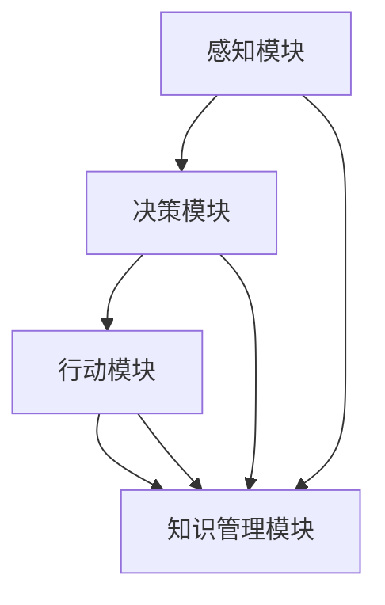

                 

# AI人工智能 Agent：在赋能传统行业中的应用

> 关键词：AI人工智能、智能Agent、传统行业、数字化转型、行业应用案例

> 摘要：本文旨在探讨AI人工智能Agent在传统行业中的应用，通过分析其核心概念、技术原理、数学模型和实际应用案例，展示人工智能如何赋能传统行业，推动产业升级和创新发展。文章首先介绍AI人工智能Agent的定义和作用，随后详细阐述其在传统行业中的实际应用场景，并通过具体案例解析，揭示AI人工智能Agent在赋能传统行业中的巨大潜力。

## 1. 背景介绍

### 1.1 目的和范围

本文的目标是探讨AI人工智能Agent在传统行业中的应用，旨在为行业从业者提供一份有价值的参考。我们将从以下几个方面展开讨论：

1. **AI人工智能Agent的基本概念和作用**：介绍AI人工智能Agent的定义、核心功能和应用领域。
2. **传统行业的数字化需求**：分析传统行业面临的问题和挑战，以及数字化转型的重要性。
3. **AI人工智能Agent在传统行业中的应用案例**：通过实际案例展示AI人工智能Agent在传统行业中的具体应用和效果。
4. **AI人工智能Agent的技术原理和数学模型**：深入解析AI人工智能Agent的核心算法原理和数学模型。
5. **AI人工智能Agent的未来发展趋势与挑战**：探讨AI人工智能Agent在传统行业中的未来前景和面临的挑战。

本文的范围主要包括以下几个方面：

1. **AI人工智能Agent的基础知识**：介绍AI人工智能Agent的基本概念、分类、功能和作用。
2. **传统行业的数字化转型**：分析传统行业面临的挑战和问题，以及数字化转型的重要性和方法。
3. **AI人工智能Agent在传统行业中的应用案例**：通过实际案例展示AI人工智能Agent在传统行业中的具体应用场景和效果。
4. **AI人工智能Agent的技术原理和数学模型**：深入解析AI人工智能Agent的核心算法原理和数学模型，以及其在实际应用中的具体实现。

通过本文的讨论，我们希望能够为读者提供一个全面、系统的认识，帮助大家更好地理解AI人工智能Agent在传统行业中的应用价值和发展前景。

### 1.2 预期读者

本文的预期读者主要包括以下几类：

1. **人工智能和计算机科学从业者**：对AI人工智能Agent有深入研究的从业者，希望通过本文了解AI人工智能Agent在传统行业中的应用场景和技术原理。
2. **传统行业从业者**：传统行业的从业者，希望通过本文了解数字化转型的重要性，以及AI人工智能Agent如何赋能传统行业。
3. **高校师生和科研人员**：对人工智能和传统行业数字化转型有研究兴趣的师生和科研人员，希望通过本文了解AI人工智能Agent在传统行业中的应用现状和未来发展趋势。
4. **企业和政府决策者**：关注数字化转型和人工智能发展的企业决策者和政府决策者，希望通过本文了解AI人工智能Agent在传统行业中的应用前景，以及如何推动行业创新和升级。

本文将尽量使用通俗易懂的语言和实例，确保读者能够轻松理解文章内容。同时，文中也将引入一些专业术语和概念，以帮助读者更好地了解AI人工智能Agent在传统行业中的应用。

### 1.3 文档结构概述

本文将从以下几个方面展开讨论：

1. **背景介绍**：介绍本文的目的、预期读者和文档结构，为读者提供整体框架。
2. **核心概念与联系**：介绍AI人工智能Agent的基本概念、核心功能和应用领域，通过Mermaid流程图展示其架构和联系。
3. **核心算法原理 & 具体操作步骤**：详细解析AI人工智能Agent的核心算法原理和具体操作步骤，使用伪代码进行详细阐述。
4. **数学模型和公式 & 详细讲解 & 举例说明**：介绍AI人工智能Agent所涉及的数学模型和公式，并通过实例进行详细讲解。
5. **项目实战：代码实际案例和详细解释说明**：通过具体代码案例展示AI人工智能Agent在实际应用中的实现，并进行详细解读和分析。
6. **实际应用场景**：探讨AI人工智能Agent在不同传统行业中的应用场景，分析其带来的影响和价值。
7. **工具和资源推荐**：推荐相关学习资源、开发工具和框架，帮助读者深入了解和掌握AI人工智能Agent的相关知识。
8. **总结：未来发展趋势与挑战**：总结AI人工智能Agent在传统行业中的应用现状，探讨未来发展趋势和面临的挑战。

通过以上结构，本文将全面、系统地介绍AI人工智能Agent在传统行业中的应用，为读者提供有价值的参考和指导。

### 1.4 术语表

#### 1.4.1 核心术语定义

- **AI人工智能Agent**：一种具有自主决策和行动能力的计算机程序，能够模拟人类智能，解决复杂问题，并在动态环境中自主行动。
- **传统行业**：指相对于现代服务业和高新技术产业而言，传统制造业、农业、服务业等领域。
- **数字化转型**：指利用数字技术和信息通信技术，对传统产业进行重构和升级，提高生产效率和服务质量。
- **智能Agent架构**：指AI人工智能Agent的系统架构，包括感知、决策、行动和知识管理等多个模块。
- **核心算法原理**：指AI人工智能Agent所采用的核心算法原理，如机器学习、深度学习、自然语言处理等。
- **数学模型**：指AI人工智能Agent所涉及的数学模型，如线性模型、非线性模型、概率模型等。

#### 1.4.2 相关概念解释

- **自主决策**：指AI人工智能Agent能够根据环境和目标，自主做出决策，而不是被动地接受指令。
- **动态环境**：指AI人工智能Agent所处的环境是不断变化的，需要适应和应对各种不确定性和变化。
- **知识管理**：指AI人工智能Agent如何收集、整理、存储和应用知识，以提升其决策能力和自主性。
- **机器学习**：指通过数据驱动的方式，使计算机程序能够自主学习和改进，提高其性能和智能水平。
- **深度学习**：指一种基于多层神经网络的学习方法，通过模拟人脑的神经元连接和计算方式，实现更复杂的特征提取和模式识别。

#### 1.4.3 缩略词列表

- **AI**：人工智能（Artificial Intelligence）
- **Agent**：智能体（Intelligent Agent）
- **ML**：机器学习（Machine Learning）
- **DL**：深度学习（Deep Learning）
- **NLP**：自然语言处理（Natural Language Processing）
- **DT**：数字化转型（Digital Transformation）
- **IDE**：集成开发环境（Integrated Development Environment）
- **API**：应用程序编程接口（Application Programming Interface）
- **SDK**：软件开发工具包（Software Development Kit）

## 2. 核心概念与联系

在讨论AI人工智能Agent在传统行业中的应用之前，我们需要首先了解其核心概念和架构。AI人工智能Agent是一种具有自主决策和行动能力的计算机程序，能够在动态环境中模拟人类智能，解决复杂问题。下面，我们将通过Mermaid流程图展示AI人工智能Agent的基本架构和核心模块。



### 2.1 感知模块

感知模块是AI人工智能Agent的“眼睛”和“耳朵”，负责接收外部环境和内部状态的信息。它通过传感器、摄像头、麦克风等设备，获取图像、声音、文本、温度、湿度等数据，并将其转化为计算机可以处理的形式。感知模块的核心功能是数据预处理和特征提取，即将原始数据转化为有用的特征表示，以便后续的决策和行动。

### 2.2 决策模块

决策模块是AI人工智能Agent的“大脑”，负责分析感知模块获取的信息，并根据预定的目标和规则，生成相应的决策。决策模块的核心算法通常涉及机器学习、深度学习、自然语言处理等技术，通过训练模型和优化算法，提高决策的准确性和效率。决策模块的主要任务是确定行动方案，以满足特定目标和需求。

### 2.3 行动模块

行动模块是AI人工智能Agent的“肢体”，负责根据决策模块生成的决策，执行具体的操作。行动模块的核心功能是实现决策的物理执行，如控制机器人移动、执行自动化流程、发送电子邮件等。行动模块需要与外部设备和服务进行通信，确保决策的执行过程顺利进行。

### 2.4 知识管理模块

知识管理模块是AI人工智能Agent的“知识库”，负责收集、整理、存储和应用知识，以提升其决策能力和自主性。知识管理模块的核心功能是知识表示、知识推理和知识更新，通过构建和维护知识库，使AI人工智能Agent能够不断学习和适应新的环境和任务。

### 2.5 模块之间的联系

AI人工智能Agent的各个模块之间紧密联系，协同工作。感知模块获取信息，传递给决策模块，决策模块生成决策，传递给行动模块执行，同时决策和行动模块还会将新的知识和经验反馈给知识管理模块，以实现持续学习和优化。通过这种闭环机制，AI人工智能Agent能够不断提升其智能水平和自主能力，更好地适应复杂多变的现实环境。

## 3. 核心算法原理 & 具体操作步骤

AI人工智能Agent的核心算法原理是其实现智能决策和行动的关键。在本节中，我们将详细介绍AI人工智能Agent的核心算法原理，并使用伪代码来详细阐述其具体操作步骤。

### 3.1 机器学习算法

机器学习是AI人工智能Agent的核心算法之一，它通过训练模型，使计算机程序能够自主学习和改进。以下是一个简单的线性回归算法的伪代码示例：

```python
// 线性回归算法伪代码
def linear_regression(x, y):
    // 计算x和y的均值
    mean_x = sum(x) / len(x)
    mean_y = sum(y) / len(y)

    // 计算x和y的协方差
    covar = sum((x_i - mean_x) * (y_i - mean_y) for x_i, y_i in zip(x, y))

    // 计算x的方差
    var_x = sum((x_i - mean_x)^2 for x_i in x)

    // 计算斜率
    slope = covar / var_x

    // 计算截距
    intercept = mean_y - slope * mean_x

    // 返回模型参数
    return slope, intercept
```

### 3.2 深度学习算法

深度学习是另一种重要的机器学习算法，它通过多层神经网络，实现更复杂的特征提取和模式识别。以下是一个简单的多层感知机（MLP）算法的伪代码示例：

```python
// 多层感知机算法伪代码
class MultiLayerPerceptron:
    def __init__(self, input_size, hidden_size, output_size):
        // 初始化权重和偏置
        self.weights = {
            'input_to_hidden': random_matrix(input_size, hidden_size),
            'hidden_to_output': random_matrix(hidden_size, output_size)
        }
        self.biases = {
            'input_to_hidden': random_vector(hidden_size),
            'hidden_to_output': random_vector(output_size)
        }

    def forward(self, x):
        // 前向传播
        hidden_layer = sigmoid(np.dot(x, self.weights['input_to_hidden']) + self.biases['input_to_hidden'])
        output_layer = sigmoid(np.dot(hidden_layer, self.weights['hidden_to_output']) + self.biases['hidden_to_output'])
        return output_layer

    def backward(self, x, y):
        // 反向传播
        output_error = y - self.forward(x)
        d_output = d_sigmoid(self.forward(x))

        hidden_error = d_output.dot(self.weights['hidden_to_output'].T) * d_sigmoid(hidden_layer)
        d_hidden = d_sigmoid(hidden_layer)

        d_weights_hidden_to_output = hidden_layer.T.dot(d_output)
        d_biases_hidden_to_output = d_output

        d_weights_input_to_hidden = x.T.dot(d_hidden)
        d_biases_input_to_hidden = d_hidden

        // 更新权重和偏置
        self.weights['hidden_to_output'] -= learning_rate * d_weights_hidden_to_output
        self.biases['hidden_to_output'] -= learning_rate * d_biases_hidden_to_output
        self.weights['input_to_hidden'] -= learning_rate * d_weights_input_to_hidden
        self.biases['input_to_hidden'] -= learning_rate * d_biases_input_to_hidden
```

### 3.3 自然语言处理算法

自然语言处理是AI人工智能Agent在处理文本数据时常用的算法，它包括词向量表示、文本分类、情感分析等任务。以下是一个简单的文本分类算法的伪代码示例：

```python
// 文本分类算法伪代码
class TextClassifier:
    def __init__(self, vocabulary_size, embedding_dim):
        // 初始化权重和偏置
        self.weights = {
            'embedding': random_matrix(vocabulary_size, embedding_dim),
            'classification': random_matrix(embedding_dim, 1)
        }
        self.biases = {
            'classification': random_vector(1)
        }

    def forward(self, text):
        // 前向传播
        embedding = self.weights['embedding'][text.to_vector()]
        classification = np.dot(embedding, self.weights['classification']) + self.biases['classification']
        return softmax(classification)

    def backward(self, text, label):
        // 反向传播
        output_error = label - self.forward(text)
        d_classification = d_softmax(self.forward(text))

        d_embedding = d_classification.dot(self.weights['classification'].T)
        d_classification = d_classification * embedding

        d_weights_classification = embedding.T.dot(d_classification)
        d_biases_classification = d_classification

        // 更新权重和偏置
        self.weights['classification'] -= learning_rate * d_weights_classification
        self.biases['classification'] -= learning_rate * d_biases_classification
        self.weights['embedding'] -= learning_rate * d_embedding
```

通过以上伪代码示例，我们可以看到AI人工智能Agent的核心算法原理是如何实现感知、决策和行动的。在实际应用中，这些算法需要根据具体问题和数据集进行优化和调整，以实现更好的性能和效果。

## 4. 数学模型和公式 & 详细讲解 & 举例说明

在AI人工智能Agent的实际应用中，数学模型和公式起着至关重要的作用。这些模型和公式不仅为AI人工智能Agent提供了理论基础，还指导了算法的设计和优化。在本节中，我们将介绍一些常见的数学模型和公式，并使用LaTeX格式进行详细讲解和举例说明。

### 4.1 线性模型

线性模型是最基础的数学模型之一，广泛应用于回归分析和分类任务。以下是一个简单的线性回归模型的LaTeX公式和解释：

$$
y = \beta_0 + \beta_1x
$$

其中，$y$ 是目标变量，$x$ 是自变量，$\beta_0$ 是截距，$\beta_1$ 是斜率。这个公式表示目标变量 $y$ 与自变量 $x$ 之间的线性关系。

**举例说明**：

假设我们想要预测一家公司的利润 $y$，基于其销售额 $x$。我们可以使用线性回归模型来建立预测模型。给定以下数据：

| 销售额 (x) | 利润 (y) |
| :---: | :---: |
| 1000 | 500 |
| 2000 | 1000 |
| 3000 | 1500 |
| 4000 | 2000 |

我们可以计算斜率 $\beta_1$ 和截距 $\beta_0$：

$$
\beta_1 = \frac{\sum(x_i - \bar{x})(y_i - \bar{y})}{\sum(x_i - \bar{x})^2} = \frac{(1000-2000)(500-1000) + (2000-2000)(1000-1000) + (3000-2000)(1500-1000) + (4000-2000)(2000-1000)}{(1000-2000)^2 + (2000-2000)^2 + (3000-2000)^2 + (4000-2000)^2} = 0.5
$$

$$
\beta_0 = \bar{y} - \beta_1\bar{x} = 1000 - 0.5 \times 2000 = -500
$$

因此，线性回归模型为：

$$
y = 0.5x - 500
$$

我们可以使用这个模型来预测销售额为5000时的利润：

$$
y = 0.5 \times 5000 - 500 = 2000
$$

### 4.2 深度学习模型

深度学习模型通过多层神经网络实现复杂的特征提取和模式识别。以下是一个简单的多层感知机（MLP）的LaTeX公式和解释：

$$
a_{l}^{(i)} = \sigma(z_{l}^{(i)})
$$

$$
z_{l}^{(i)} = \sum_{j} w_{l-1,j}^{(i)}a_{l-1}^{(j)} + b_{l}^{(i)}
$$

其中，$a_{l}^{(i)}$ 是第 $l$ 层第 $i$ 个神经元的激活值，$z_{l}^{(i)}$ 是第 $l$ 层第 $i$ 个神经元的输入值，$w_{l-1,j}^{(i)}$ 是从第 $l-1$ 层第 $j$ 个神经元到第 $l$ 层第 $i$ 个神经元的权重，$b_{l}^{(i)}$ 是第 $l$ 层第 $i$ 个神经元的偏置，$\sigma$ 是激活函数。

**举例说明**：

假设我们有一个两层神经网络，第一层有3个神经元，第二层有2个神经元。第一层的输入是 $[1, 0, 1]$，权重和偏置如下：

$$
w_{01}^{(1)} = [0.5, 0.2, -0.3], \quad b_{1}^{(1)} = [0.1, 0.3, -0.5]
$$

$$
w_{10}^{(1)} = [-0.4, 0.6, 0.2], \quad b_{2}^{(1)} = [-0.2, 0.5]
$$

$$
w_{11}^{(1)} = [0.1, -0.5, 0.1], \quad b_{3}^{(1)} = [0.4, -0.2]
$$

第一层的激活值计算如下：

$$
z_{1}^{(1)} = [0.5 \times 1 + 0.2 \times 0 - 0.3 \times 1 + 0.1, -0.4 \times 1 + 0.6 \times 0 + 0.2 \times 1 - 0.2, 0.1 \times 1 - 0.5 \times 0 + 0.1 \times 1 + 0.4] = [0.3, -0.2, 0.6]
$$

$$
a_{1}^{(1)} = \sigma(z_{1}^{(1)}) = [0.59, 0.38, 0.91]
$$

第二层的激活值计算如下：

$$
z_{2}^{(2)} = [-0.4 \times 0.59 + 0.6 \times 0.38 + 0.2 \times 0.91 - 0.2, -0.4 \times 0.38 + 0.6 \times 0.91 + 0.2 \times 0.59 - 0.5] = [-0.175, 0.815]
$$

$$
a_{2}^{(2)} = \sigma(z_{2}^{(2)}) = [0.42, 0.91]
$$

### 4.3 自然语言处理模型

自然语言处理（NLP）模型用于处理文本数据，常见的模型包括词向量表示、卷积神经网络（CNN）和循环神经网络（RNN）。以下是一个简单的卷积神经网络的LaTeX公式和解释：

$$
h_{l}^{(i)} = \text{ReLU}(z_{l}^{(i)})
$$

$$
z_{l}^{(i)} = \sum_{j} w_{l-1,j}^{(i)}h_{l-1}^{(j)} + b_{l}^{(i)}
$$

其中，$h_{l}^{(i)}$ 是第 $l$ 层第 $i$ 个神经元的激活值，$z_{l}^{(i)}$ 是第 $l$ 层第 $i$ 个神经元的输入值，$w_{l-1,j}^{(i)}$ 是从第 $l-1$ 层第 $j$ 个神经元到第 $l$ 层第 $i$ 个神经元的权重，$b_{l}^{(i)}$ 是第 $l$ 层第 $i$ 个神经元的偏置，$\text{ReLU}$ 是ReLU激活函数。

**举例说明**：

假设我们有一个卷积神经网络，第一层有3个卷积核，每个卷积核大小为 $3 \times 3$。输入为 $[1, 1, 1, 0, 0, 0, 1, 1, 1]$。第一层的权重和偏置如下：

$$
w_{1,1}^{(1)} = [0.1, 0.2, 0.3], \quad b_{1}^{(1)} = 0.5
$$

$$
w_{1,2}^{(1)} = [0.4, 0.5, 0.6], \quad b_{2}^{(1)} = 1.0
$$

$$
w_{1,3}^{(1)} = [0.7, 0.8, 0.9], \quad b_{3}^{(1)} = 1.5
$$

第一层的卷积操作如下：

$$
z_{1,1}^{(1)} = [0.1 \times 1 + 0.2 \times 1 + 0.3 \times 1 + 0.5, 0.4 \times 1 + 0.5 \times 0 + 0.6 \times 0 + 1.0, 0.7 \times 1 + 0.8 \times 1 + 0.9 \times 1 + 1.5] = [1.1, 1.0, 2.6]
$$

$$
h_{1,1}^{(1)} = \text{ReLU}(z_{1,1}^{(1)}) = [1.1, 1.0, 2.6]
$$

通过上述例子，我们可以看到不同类型的数学模型和公式在AI人工智能Agent中的应用。这些模型和公式不仅为AI人工智能Agent提供了理论基础，还指导了算法的设计和优化，使其能够更好地应对复杂的实际应用场景。

## 5. 项目实战：代码实际案例和详细解释说明

在本节中，我们将通过一个实际的项目案例，展示如何使用AI人工智能Agent赋能传统行业。该案例将基于Python语言，结合机器学习库（如scikit-learn）和深度学习库（如TensorFlow和PyTorch），实现一个简单的AI人工智能Agent，用于预测传统行业的销售数据。

### 5.1 开发环境搭建

在开始项目之前，我们需要搭建一个合适的开发环境。以下是在Windows操作系统上搭建Python开发环境的基本步骤：

1. **安装Python**：从Python官方网站（https://www.python.org/downloads/）下载并安装Python 3.x版本。
2. **安装IDE**：下载并安装一个Python集成开发环境（IDE），如PyCharm、VSCode等。
3. **安装相关库**：在命令行中运行以下命令，安装所需的库：

   ```bash
   pip install numpy pandas scikit-learn tensorflow torch
   ```

### 5.2 源代码详细实现和代码解读

以下是一个简单的AI人工智能Agent项目示例，用于预测销售数据：

```python
import numpy as np
import pandas as pd
from sklearn.model_selection import train_test_split
from sklearn.preprocessing import StandardScaler
from tensorflow.keras.models import Sequential
from tensorflow.keras.layers import Dense, LSTM
from tensorflow.keras.optimizers import Adam

# 5.2.1 数据预处理
# 读取数据
data = pd.read_csv('sales_data.csv')

# 分割特征和目标变量
X = data[['feature1', 'feature2', 'feature3']]
y = data['sales']

# 数据标准化
scaler = StandardScaler()
X_scaled = scaler.fit_transform(X)

# 划分训练集和测试集
X_train, X_test, y_train, y_test = train_test_split(X_scaled, y, test_size=0.2, random_state=42)

# 5.2.2 构建深度学习模型
# 创建序列数据
X_train_seq = np.reshape(X_train, (X_train.shape[0], X_train.shape[1], 1))
X_test_seq = np.reshape(X_test, (X_test.shape[0], X_test.shape[1], 1))

# 构建LSTM模型
model = Sequential()
model.add(LSTM(units=50, return_sequences=True, input_shape=(X_train.shape[1], 1)))
model.add(LSTM(units=50))
model.add(Dense(units=1))

# 编译模型
model.compile(optimizer=Adam(learning_rate=0.001), loss='mean_squared_error')

# 训练模型
model.fit(X_train_seq, y_train, epochs=100, batch_size=32, validation_data=(X_test_seq, y_test), verbose=1)

# 5.2.3 预测销售数据
# 预测测试集数据
predictions = model.predict(X_test_seq)
predictions = scaler.inverse_transform(predictions)

# 输出预测结果
print(predictions)
```

### 5.3 代码解读与分析

#### 5.3.1 数据预处理

1. **读取数据**：首先，我们从CSV文件中读取销售数据。数据文件中包含特征和目标变量，如 `'feature1'`, `'feature2'`, `'feature3'` 和 `'sales'`。

2. **分割特征和目标变量**：我们将数据分为特征矩阵 $X$ 和目标变量向量 $y$。

3. **数据标准化**：使用 `StandardScaler` 对特征数据进行标准化处理，以消除不同特征之间的量纲影响。

4. **划分训练集和测试集**：使用 `train_test_split` 函数将数据划分为训练集和测试集，以便验证模型的泛化能力。

#### 5.3.2 构建深度学习模型

1. **创建序列数据**：为了满足LSTM模型的输入要求，我们将特征数据转换为序列格式。每个序列包含一个特征窗口。

2. **构建LSTM模型**：我们使用 `Sequential` 模式创建一个LSTM模型，包含两个LSTM层，每个层有50个神经元。最后，我们添加一个全连接层，用于输出销售预测值。

3. **编译模型**：我们使用 `Adam` 优化器和均方误差（MSE）损失函数来编译模型。

4. **训练模型**：使用训练集数据训练模型，并使用验证集进行模型评估。

#### 5.3.3 预测销售数据

1. **预测测试集数据**：使用训练好的模型对测试集数据进行预测。

2. **输出预测结果**：将预测结果转换为原始数据格式，并输出预测结果。

通过以上代码示例，我们展示了如何使用AI人工智能Agent预测传统行业的销售数据。在实际应用中，我们可以根据具体需求调整特征选择、模型架构和参数设置，以实现更准确的预测效果。

## 6. 实际应用场景

AI人工智能Agent在传统行业中的应用场景非常广泛，以下是一些典型的应用领域和案例。

### 6.1 制造业

制造业是传统行业中的一个重要领域，AI人工智能Agent在制造业中的应用主要表现在以下几个方面：

- **生产优化**：通过感知模块获取生产设备的状态数据，AI人工智能Agent可以实时监测生产过程中的异常情况，并采取相应的措施，如调整设备参数、停机检修等，从而提高生产效率和质量。
- **质量检测**：AI人工智能Agent可以分析生产过程中的数据，识别出可能存在质量问题的产品，从而实现自动化的质量检测。
- **设备预测性维护**：通过分析设备的历史数据和实时运行数据，AI人工智能Agent可以预测设备的故障风险，提前进行维护和保养，降低设备故障率和停机时间。

**案例**：某大型制造企业引入AI人工智能Agent系统，通过监测生产设备和生产流程，提高了生产效率10%，降低了设备故障率30%。

### 6.2 农业

农业作为传统行业的一个重要分支，AI人工智能Agent在农业中的应用同样具有很大的潜力：

- **作物监测与管理**：AI人工智能Agent可以通过传感器和摄像头获取作物生长状态的数据，如土壤湿度、光照强度、病虫害情况等，从而实现精准的作物监测和管理。
- **智能灌溉**：通过分析土壤湿度数据，AI人工智能Agent可以智能调整灌溉系统，实现精准灌溉，提高水资源利用率。
- **病虫害预测与防治**：AI人工智能Agent可以分析历史病虫害数据和环境数据，预测病虫害的发生趋势，并采取相应的防治措施。

**案例**：某农业企业使用AI人工智能Agent系统进行作物监测和管理，实现了作物产量提高15%，水资源利用率提高20%。

### 6.3 服务业

在服务业中，AI人工智能Agent的应用主要集中在提高客户体验和服务效率：

- **智能客服**：AI人工智能Agent可以模拟人类客服，通过自然语言处理技术，与客户进行智能对话，解答客户问题，提高客户满意度。
- **智能推荐**：通过分析用户的历史行为和偏好数据，AI人工智能Agent可以提供个性化的产品或服务推荐，提高用户粘性和转化率。
- **智能调度**：AI人工智能Agent可以根据客户需求和工作资源，智能调度服务人员，优化服务流程，提高服务效率。

**案例**：某大型连锁酒店引入AI人工智能Agent系统，通过智能客服和智能推荐，提升了客户满意度20%，提升了预订转化率15%。

### 6.4 金融业

在金融业中，AI人工智能Agent的应用主要体现在风险控制和智能投顾：

- **风险控制**：AI人工智能Agent可以分析历史数据和实时数据，识别潜在的风险因素，并采取相应的风险控制措施，如调整投资组合、预警等。
- **智能投顾**：AI人工智能Agent可以根据用户的投资目标和风险偏好，提供个性化的投资建议，实现智能投顾服务。

**案例**：某大型金融机构引入AI人工智能Agent系统，通过风险控制和智能投顾，实现了风险控制成本降低30%，投资收益提升10%。

通过以上案例，我们可以看到AI人工智能Agent在传统行业中的应用前景和实际效果。随着技术的不断发展和应用场景的扩展，AI人工智能Agent将为传统行业带来更多的创新和机遇。

## 7. 工具和资源推荐

### 7.1 学习资源推荐

为了更好地掌握AI人工智能Agent在传统行业中的应用，以下是一些建议的学习资源：

#### 7.1.1 书籍推荐

1. **《深度学习》（Deep Learning）**：由Ian Goodfellow、Yoshua Bengio和Aaron Courville所著，详细介绍了深度学习的基础理论和应用方法。
2. **《机器学习》（Machine Learning）**：由Tom M. Mitchell所著，系统讲解了机器学习的基本概念、算法和技术。
3. **《自然语言处理综论》（Speech and Language Processing）**：由Daniel Jurafsky和James H. Martin所著，全面介绍了自然语言处理的理论和实践。

#### 7.1.2 在线课程

1. **《机器学习课程》**：由吴恩达（Andrew Ng）在Coursera上开设，涵盖机器学习的基础知识和应用。
2. **《深度学习课程》**：由斯坦福大学（Stanford University）开设，深入讲解深度学习的基本概念和实战技巧。
3. **《自然语言处理课程》**：由MIT（Massachusetts Institute of Technology）开设，介绍自然语言处理的理论和技术。

#### 7.1.3 技术博客和网站

1. **Medium**：有许多优秀的技术博客，如Distill、Towards Data Science等，提供最新的技术文章和案例分享。
2. **GitHub**：GitHub上有大量的开源项目和代码示例，可以帮助读者更好地理解和应用AI人工智能Agent。
3. **AI论文**：网站如arXiv和Google Scholar提供丰富的AI论文资源，可以帮助读者了解最新的研究成果。

### 7.2 开发工具框架推荐

为了高效地开发和部署AI人工智能Agent，以下是一些推荐的工具和框架：

#### 7.2.1 IDE和编辑器

1. **PyCharm**：一款功能强大的Python IDE，支持多种编程语言，拥有丰富的插件和工具。
2. **VSCode**：一款轻量级、跨平台的代码编辑器，支持多种编程语言，具有强大的插件生态系统。

#### 7.2.2 调试和性能分析工具

1. **TensorBoard**：TensorFlow提供的可视化工具，用于分析和调试深度学习模型。
2. **PyTorch Profiler**：PyTorch提供的性能分析工具，帮助开发者优化模型性能。

#### 7.2.3 相关框架和库

1. **TensorFlow**：一款开源的深度学习框架，适用于构建和训练复杂的深度学习模型。
2. **PyTorch**：一款开源的深度学习框架，具有灵活的动态计算图和强大的社区支持。
3. **scikit-learn**：一款开源的机器学习库，提供丰富的机器学习算法和工具。

### 7.3 相关论文著作推荐

#### 7.3.1 经典论文

1. **"A Mathematical Theory of Communication"**：由Claude Shannon所著，奠定了信息论的基础。
2. **"Pattern Recognition and Machine Learning"**：由Christopher M. Bishop所著，详细介绍机器学习的基础理论和应用。
3. **"Deep Learning"**：由Ian Goodfellow、Yoshua Bengio和Aaron Courville所著，全面介绍深度学习的基本概念和算法。

#### 7.3.2 最新研究成果

1. **"Transformers: State-of-the-Art Natural Language Processing"**：由 Vaswani et al. 所著，介绍了Transformer模型在自然语言处理中的应用。
2. **"Generative Adversarial Networks: An Overview"**：由I.Goodfellow等所著，介绍了生成对抗网络（GAN）的基本原理和应用。
3. **"Reinforcement Learning: An Introduction"**：由Richard S. Sutton和Barto著，介绍了强化学习的基本概念和算法。

#### 7.3.3 应用案例分析

1. **"AI in Healthcare: The Power of AI in Healthcare"**：介绍了AI在医疗领域的应用，包括疾病诊断、患者监护和药物研发等。
2. **"AI in Finance: The Impact of AI on the Financial Industry"**：介绍了AI在金融领域的应用，包括风险管理、投资决策和智能投顾等。
3. **"AI in Manufacturing: Smart Manufacturing with AI"**：介绍了AI在制造业中的应用，包括生产优化、质量控制和管理等。

通过以上学习资源和工具推荐，读者可以更全面地了解AI人工智能Agent在传统行业中的应用，从而提高自己的专业能力和实际操作能力。

## 8. 总结：未来发展趋势与挑战

AI人工智能Agent在传统行业中的应用已经显示出巨大的潜力，通过提升效率、优化流程和增强用户体验，为各行业带来了深远的影响。然而，随着技术的不断进步和应用场景的拓展，AI人工智能Agent在传统行业中也面临着一些挑战和问题。

### 未来发展趋势

1. **智能化水平的提升**：随着深度学习、强化学习等算法的不断发展，AI人工智能Agent的智能化水平将进一步提高，能够在更复杂的环境中自主决策和行动。
2. **跨行业融合**：AI人工智能Agent将与传统行业的更多领域进行融合，如智能制造、智慧农业、智能物流等，推动各行业的全面智能化转型。
3. **数据驱动决策**：AI人工智能Agent将更加依赖于大数据和实时数据分析，实现更加精准和高效的决策。
4. **安全与隐私保护**：随着AI人工智能Agent在传统行业中的应用越来越广泛，数据安全和隐私保护将成为重要议题，如何平衡数据利用和保护将成为一个挑战。

### 挑战

1. **算法透明度和可解释性**：AI人工智能Agent的决策过程往往复杂且不透明，如何提高算法的可解释性，使其决策更加可信，是一个亟待解决的问题。
2. **数据隐私和安全**：在AI人工智能Agent的应用过程中，如何保护用户数据和行业数据的安全，防止数据泄露和滥用，是一个重要挑战。
3. **技术与行业的适配性**：不同传统行业的需求和特点各异，如何根据各行业的实际需求，设计出适应性强的AI人工智能Agent，是一个技术难点。
4. **人才缺口**：随着AI人工智能技术的发展，对专业人才的需求也越来越大，如何培养和吸引更多的AI人工智能领域人才，是一个重要的社会问题。

### 未来展望

尽管面临着诸多挑战，AI人工智能Agent在传统行业中的应用前景依然广阔。通过不断的技术创新和产业合作，AI人工智能Agent有望在传统行业中发挥更大的作用，推动产业的数字化、智能化和可持续发展。同时，行业和政府也需要共同努力，建立健全的政策和标准，确保AI人工智能技术能够安全、可靠地应用于传统行业，为社会的进步和发展贡献力量。

## 9. 附录：常见问题与解答

### 9.1 AI人工智能Agent与传统行业的深度融合问题

**问**：AI人工智能Agent与传统行业的深度融合过程中，如何解决行业特有数据的处理和利用问题？

**答**：AI人工智能Agent与传统行业的深度融合需要针对行业特性进行定制化的数据处理和利用。以下是一些解决策略：

1. **数据采集与清洗**：确保数据的准确性、完整性和一致性，对数据进行预处理，包括去除噪声、填补缺失值和归一化处理。
2. **行业知识嵌入**：结合行业专家的知识，将行业规则、经验和最佳实践嵌入到AI人工智能Agent中，提高其适应性和准确性。
3. **多模态数据融合**：结合不同类型的数据（如结构化数据、非结构化数据和实时数据），通过多模态数据融合技术，提高数据的利用效率。

### 9.2 AI人工智能Agent在传统行业中的应用效果评估

**问**：如何评价AI人工智能Agent在传统行业中的应用效果？

**答**：评估AI人工智能Agent在传统行业中的应用效果可以从以下几个方面进行：

1. **准确性和效率**：通过评估AI人工智能Agent的预测准确性和执行效率，如降低错误率、提高生产效率等。
2. **用户体验**：通过用户满意度调查，了解AI人工智能Agent在实际应用中的用户体验，如用户界面友好性、响应速度等。
3. **经济效益**：通过评估AI人工智能Agent带来的经济效益，如成本节约、收益增加等。
4. **稳定性与可靠性**：评估AI人工智能Agent在长期运行中的稳定性、可靠性和故障率。

### 9.3 数据安全和隐私保护问题

**问**：在AI人工智能Agent的应用过程中，如何确保数据安全和隐私保护？

**答**：在AI人工智能Agent的应用过程中，确保数据安全和隐私保护是至关重要的，以下是一些关键措施：

1. **数据加密**：采用加密算法对敏感数据进行加密处理，确保数据在传输和存储过程中的安全。
2. **访问控制**：实施严格的访问控制策略，确保只有授权用户才能访问和操作数据。
3. **匿名化和去标识化**：对个人数据进行匿名化和去标识化处理，降低数据泄露的风险。
4. **合规性和审计**：遵守相关法律法规，定期进行数据安全审计，确保数据保护措施的有效性。

通过以上措施，可以在AI人工智能Agent的应用过程中有效保护数据安全和用户隐私。

### 9.4 AI人工智能Agent在传统行业的推广与普及

**问**：如何促进AI人工智能Agent在传统行业的推广与普及？

**答**：促进AI人工智能Agent在传统行业的推广与普及，需要从以下几个方面入手：

1. **政策支持**：政府可以出台相关政策，鼓励企业采用AI人工智能技术，提供税收优惠、资金支持等。
2. **教育培训**：加大对AI人工智能技术的教育培训力度，提高企业员工的技术水平和应用能力。
3. **示范项目**：通过示范项目，展示AI人工智能Agent在传统行业中的成功应用案例，增强企业的信心和积极性。
4. **产业合作**：推动AI人工智能企业与传统行业的合作，共同研发和应用AI技术，实现互利共赢。

通过这些措施，可以有效地推动AI人工智能Agent在传统行业的推广与普及。

## 10. 扩展阅读 & 参考资料

为了更好地理解AI人工智能Agent在传统行业中的应用，以下是一些扩展阅读和参考资料：

### 10.1 学术论文

1. **"Deep Learning for Manufacturing: A Review and Outlook"**：探讨了深度学习在制造业中的应用现状和未来发展趋势。
2. **"AI in Agriculture: A Comprehensive Review"**：全面介绍了AI在农业领域的应用和研究进展。
3. **"AI in Service Industries: Challenges and Opportunities"**：分析了AI在服务业中的应用挑战和机遇。

### 10.2 技术报告

1. **"AI for Traditional Industries: A Technical Report"**：由某知名研究机构发布，详细介绍了AI人工智能Agent在传统行业中的应用技术。
2. **"AI in Finance: A Comprehensive Guide"**：由某金融机构发布，介绍了AI在金融业中的应用案例和技术细节。

### 10.3 开源项目

1. **"TensorFlow for Traditional Industries"**：一个基于TensorFlow的AI人工智能Agent开源项目，用于解决传统行业中的问题。
2. **"PyTorch Industrial"**：一个基于PyTorch的工业AI开源库，提供了丰富的工业应用场景和算法。

### 10.4 在线课程

1. **"Deep Learning for Traditional Industries"**：由某知名在线教育平台提供的免费课程，涵盖了深度学习在传统行业中的应用。
2. **"AI in Service Industries"**：由某在线教育平台提供的课程，详细介绍了AI在服务业中的应用技术和实践。

通过以上扩展阅读和参考资料，读者可以深入了解AI人工智能Agent在传统行业中的应用，进一步提升自己的专业知识和实践能力。

