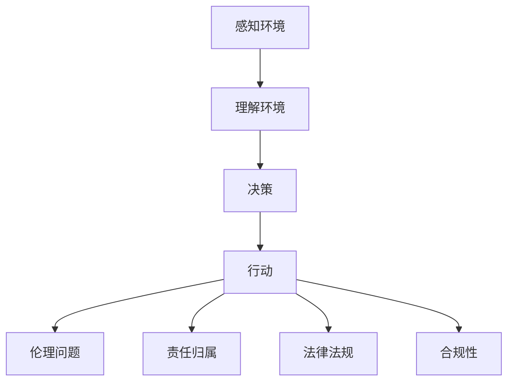

                 

# AI人工智能 Agent：对法律和规则的挑战

> **关键词：** 人工智能，法律挑战，伦理问题，智能代理，决策算法，法律法规，合规性，隐私保护

> **摘要：** 随着人工智能技术的迅猛发展，智能代理在各个领域得到了广泛应用。然而，其带来的法律和规则挑战也逐渐显现。本文将深入探讨人工智能代理在法律和规则领域面临的挑战，包括伦理问题、责任归属、隐私保护等，并提出相应的解决方案和应对策略。

## 1. 背景介绍

### 1.1 目的和范围

本文旨在分析人工智能（AI）代理在法律和规则方面所面临的挑战，并探讨其影响及应对策略。我们将重点关注以下几个方面：

- **伦理问题**：人工智能代理在决策过程中可能引发的伦理困境，如歧视、隐私侵犯等。
- **责任归属**：在AI代理发生失误或造成损害时，如何确定责任主体。
- **法律法规**：现有的法律体系在应对AI代理带来的挑战方面的不足。
- **隐私保护**：AI代理在处理个人数据时可能带来的隐私风险。

### 1.2 预期读者

本文适用于以下读者群体：

- **人工智能研究人员**：希望了解AI代理在法律和规则方面面临的挑战。
- **法律专业人士**：关注AI技术的发展及其对现有法律体系的影响。
- **政策制定者**：需要了解AI代理在法律和规则方面的挑战，以便制定相关政策。
- **企业高管**：关注AI代理在业务应用中的合规性风险。

### 1.3 文档结构概述

本文分为以下几个部分：

- **第1章：背景介绍**：介绍本文的目的、范围和预期读者。
- **第2章：核心概念与联系**：阐述与AI代理相关的核心概念，并绘制流程图。
- **第3章：核心算法原理 & 具体操作步骤**：讲解AI代理的核心算法原理和操作步骤。
- **第4章：数学模型和公式 & 详细讲解 & 举例说明**：介绍AI代理的数学模型和公式，并提供实际案例。
- **第5章：项目实战：代码实际案例和详细解释说明**：通过实际案例展示AI代理的应用。
- **第6章：实际应用场景**：分析AI代理在不同领域的应用。
- **第7章：工具和资源推荐**：推荐相关学习资源、开发工具和框架。
- **第8章：总结：未来发展趋势与挑战**：总结AI代理在法律和规则领域的挑战，探讨未来发展趋势。
- **第9章：附录：常见问题与解答**：回答读者可能关心的问题。
- **第10章：扩展阅读 & 参考资料**：提供相关文献和资料。

### 1.4 术语表

#### 1.4.1 核心术语定义

- **人工智能（AI）**：指模拟、扩展和辅助人类智能的理论、方法、技术及应用。
- **智能代理**：具有自主决策能力的计算机程序，可代替人类执行特定任务。
- **伦理问题**：涉及道德判断和价值取向的问题，如隐私、歧视、偏见等。
- **责任归属**：在发生损害时，确定应承担责任的主体。

#### 1.4.2 相关概念解释

- **算法**：用于解决特定问题的步骤和规则。
- **决策树**：一种常用的机器学习算法，用于分类和回归问题。
- **神经网络**：一种模拟生物神经系统的计算模型，可用于图像识别、自然语言处理等。
- **法律法规**：国家或地区制定的规范行为的法律文件。

#### 1.4.3 缩略词列表

- **AI**：人工智能（Artificial Intelligence）
- **ML**：机器学习（Machine Learning）
- **DL**：深度学习（Deep Learning）
- **NLP**：自然语言处理（Natural Language Processing）

## 2. 核心概念与联系

在探讨AI代理对法律和规则的挑战之前，我们需要了解一些核心概念及其相互关系。

### 2.1 人工智能代理的定义与功能

人工智能代理是一种具备自主决策能力的计算机程序，能够根据输入数据和预设规则执行特定任务。其核心功能包括：

- **感知环境**：获取外部信息，如文本、图像、语音等。
- **理解环境**：分析输入数据，提取有用信息。
- **决策**：根据分析结果，选择最佳行动方案。
- **行动**：执行决策，实现预期目标。

### 2.2 智能代理的核心算法原理

智能代理的决策能力主要源于其核心算法，包括以下几种：

- **决策树**：一种常用的分类和回归算法，通过树的分支结构进行决策。
- **神经网络**：一种模拟生物神经系统的计算模型，可用于图像识别、自然语言处理等。
- **深度学习**：一种基于神经网络的学习方法，通过多层神经网络进行特征提取和分类。
- **强化学习**：一种基于奖励和惩罚的学习方法，通过不断试错来优化策略。

### 2.3 AI代理与法律规则的关系

AI代理在执行任务过程中，可能涉及以下法律和规则方面的问题：

- **伦理问题**：如隐私侵犯、歧视、偏见等。
- **责任归属**：在发生损害时，确定责任主体，如AI开发者、使用者或代理本身。
- **法律法规**：如数据保护法、消费者权益保护法等。
- **合规性**：确保AI代理的行为符合相关法律法规和行业标准。

### 2.4 Mermaid流程图

以下是一个简单的Mermaid流程图，展示了AI代理的核心功能及其与法律规则的关系：



## 3. 核心算法原理 & 具体操作步骤

在本节中，我们将详细讲解AI代理的核心算法原理，并展示其具体操作步骤。

### 3.1 决策树算法原理

决策树是一种常用的分类和回归算法，通过一系列判断条件将数据集划分为不同的分支，最终得到分类结果。其基本原理如下：

1. **特征选择**：选择一个具有最高信息增益或信息增益率的特征作为节点。
2. **划分数据**：根据所选特征，将数据集划分为不同的子集。
3. **递归构建**：对每个子集，重复上述步骤，构建更细的分支。
4. **终止条件**：当满足某个终止条件（如最大深度、最小样本量等）时，停止划分。

### 3.2 神经网络算法原理

神经网络是一种模拟生物神经系统的计算模型，通过多层神经元进行特征提取和分类。其基本原理如下：

1. **输入层**：接收外部信息，如文本、图像、语音等。
2. **隐藏层**：对输入信息进行特征提取和变换。
3. **输出层**：根据隐藏层的信息进行分类或预测。
4. **反向传播**：通过误差反向传播算法，更新各层神经元的权重。

### 3.3 深度学习算法原理

深度学习是一种基于神经网络的学习方法，通过多层神经网络进行特征提取和分类。其基本原理如下：

1. **多层神经网络**：包含多个隐藏层，用于提取更高层次的特征。
2. **卷积神经网络（CNN）**：适用于图像识别任务，通过卷积操作提取局部特征。
3. **循环神经网络（RNN）**：适用于序列数据，通过循环结构处理时间序列信息。
4. **长短时记忆网络（LSTM）**：一种改进的RNN，用于解决长序列依赖问题。

### 3.4 强化学习算法原理

强化学习是一种基于奖励和惩罚的学习方法，通过不断试错来优化策略。其基本原理如下：

1. **环境**：代理执行任务的场景，如游戏、机器人等。
2. **状态**：代理在执行任务过程中所处的状态。
3. **动作**：代理在特定状态下可以执行的动作。
4. **奖励**：代理执行动作后获得的奖励或惩罚。
5. **策略**：代理根据当前状态选择动作的策略。

### 3.5 AI代理的操作步骤

以下是一个简单的AI代理操作步骤：

1. **初始化**：设置初始参数，如学习率、隐藏层神经元数量等。
2. **感知环境**：获取外部信息，如文本、图像、语音等。
3. **理解环境**：通过决策树、神经网络、深度学习等算法，对输入信息进行特征提取和分类。
4. **决策**：根据当前状态和策略，选择最佳动作。
5. **行动**：执行决策，实现预期目标。
6. **更新参数**：根据奖励或惩罚，调整代理的参数。
7. **重复步骤**：不断重复上述步骤，优化代理的性能。

## 4. 数学模型和公式 & 详细讲解 & 举例说明

在本节中，我们将介绍AI代理中常用的数学模型和公式，并进行详细讲解和举例说明。

### 4.1 决策树算法的数学模型

决策树算法的核心在于特征选择和划分数据的数学模型。以下是一个简单的决策树算法的数学模型：

$$
f(x) = \sum_{i=1}^{n} w_i \cdot x_i
$$

其中，$x_i$ 表示特征值，$w_i$ 表示特征权重。通过优化特征权重，可以构建最佳划分。

### 4.2 神经网络算法的数学模型

神经网络算法的核心在于多层神经元的权重更新。以下是一个简单的神经网络算法的数学模型：

$$
y = \sigma(\sum_{i=1}^{n} w_i \cdot x_i + b)
$$

其中，$y$ 表示输出值，$\sigma$ 表示激活函数（如Sigmoid、ReLU等），$w_i$ 表示权重，$b$ 表示偏置。

### 4.3 深度学习算法的数学模型

深度学习算法的核心在于多层神经网络的权重更新。以下是一个简单的深度学习算法的数学模型：

$$
\delta = \frac{\partial L}{\partial w}
$$

其中，$\delta$ 表示权重更新量，$L$ 表示损失函数，$w$ 表示权重。

### 4.4 强化学习算法的数学模型

强化学习算法的核心在于策略优化。以下是一个简单的强化学习算法的数学模型：

$$
Q(s, a) = r + \gamma \cdot \max_a' Q(s', a')
$$

其中，$Q(s, a)$ 表示在状态 $s$ 下执行动作 $a$ 的预期奖励，$r$ 表示即时奖励，$\gamma$ 表示折扣因子，$s'$ 和 $a'$ 表示下一个状态和动作。

### 4.5 举例说明

假设我们使用决策树算法对一组数据集进行分类。数据集包含两个特征：年龄和收入。我们将使用以下数学模型进行特征选择和划分：

$$
f(x) = \sum_{i=1}^{2} w_i \cdot x_i
$$

假设我们选择年龄作为划分特征，将数据集划分为两组：

$$
f(x) = \begin{cases} 
0 & \text{如果 } x_1 < 30 \\
1 & \text{如果 } x_1 \geq 30 
\end{cases}
$$

通过优化特征权重，我们可以构建最佳划分，从而实现分类。

## 5. 项目实战：代码实际案例和详细解释说明

在本节中，我们将通过一个实际项目案例，展示如何使用Python实现一个简单的AI代理，并对其进行详细解释。

### 5.1 开发环境搭建

在开始项目之前，我们需要搭建一个合适的开发环境。以下是所需的基本工具和库：

- **Python 3.8 或更高版本**
- **Jupyter Notebook**：用于编写和运行代码
- **Scikit-learn**：用于实现决策树算法
- **Numpy**：用于数据处理和数学计算

确保已安装上述工具和库后，我们可以在Jupyter Notebook中开始编写代码。

### 5.2 源代码详细实现和代码解读

以下是一个简单的Python代码示例，实现了基于决策树的AI代理。

```python
# 导入所需库
import numpy as np
from sklearn.datasets import load_iris
from sklearn.tree import DecisionTreeClassifier
from sklearn.model_selection import train_test_split

# 加载鸢尾花数据集
iris = load_iris()
X = iris.data
y = iris.target

# 划分训练集和测试集
X_train, X_test, y_train, y_test = train_test_split(X, y, test_size=0.2, random_state=42)

# 创建决策树分类器
clf = DecisionTreeClassifier()

# 训练模型
clf.fit(X_train, y_train)

# 预测测试集
y_pred = clf.predict(X_test)

# 输出预测结果
print("预测结果：", y_pred)
```

**代码解读：**

1. **导入库**：首先，我们导入所需的库，包括Numpy、Scikit-learn和Jupyter Notebook。
2. **加载数据集**：使用Scikit-learn提供的鸢尾花数据集进行实验。
3. **划分数据集**：将数据集划分为训练集和测试集，用于训练和评估模型。
4. **创建分类器**：创建一个基于决策树的分类器对象。
5. **训练模型**：使用训练集数据训练分类器。
6. **预测测试集**：使用训练好的分类器对测试集进行预测。
7. **输出结果**：输出预测结果。

### 5.3 代码解读与分析

以下是对代码的进一步解读和分析：

1. **数据集加载**：鸢尾花数据集是一个经典的二分类数据集，包含三个特征（萼片长度、萼片宽度、花瓣长度）和两个类别（Iris-setosa和Iris-versicolor）。
2. **数据划分**：将数据集划分为训练集和测试集，用于训练和评估模型。训练集用于训练模型，测试集用于评估模型性能。
3. **分类器创建**：创建一个基于决策树的分类器对象。决策树是一种常用的分类算法，通过树形结构进行特征划分和分类。
4. **模型训练**：使用训练集数据训练分类器。在训练过程中，分类器通过特征划分和分类规则构建树形结构。
5. **预测测试集**：使用训练好的分类器对测试集进行预测。预测结果与实际标签进行比较，评估模型性能。
6. **输出结果**：输出预测结果，以便进行进一步分析。

通过这个简单的代码示例，我们可以了解如何使用Python实现一个简单的AI代理，并对其进行解释和分析。

## 6. 实际应用场景

人工智能代理在多个领域得到了广泛应用，以下是几个典型的实际应用场景：

### 6.1 金融行业

在金融行业中，人工智能代理被广泛应用于风险管理、投资组合优化、智能投顾等方面。例如，量化交易公司使用智能代理来分析市场数据，预测股票价格走势，从而进行自动交易。智能代理还可以帮助银行和金融机构识别欺诈行为，降低金融风险。

### 6.2 医疗保健

在医疗保健领域，人工智能代理可用于疾病诊断、个性化治疗、患者监护等方面。例如，智能代理可以通过分析患者的病历、检查结果和基因组数据，协助医生进行疾病诊断。此外，智能代理还可以为患者提供个性化的健康建议，监测患者的健康状况，提高医疗服务的质量和效率。

### 6.3 交通运输

在交通运输领域，人工智能代理被广泛应用于自动驾驶、智能交通管理、物流优化等方面。例如，自动驾驶汽车使用智能代理来感知环境、规划路径和做出决策，从而实现安全、高效的自动驾驶。智能代理还可以用于智能交通管理，通过分析交通流量数据，优化交通信号控制策略，减少交通拥堵。

### 6.4 电子商务

在电子商务领域，人工智能代理被广泛应用于个性化推荐、购物助手、欺诈检测等方面。例如，电商平台使用智能代理来分析用户的行为数据，提供个性化的商品推荐。智能代理还可以帮助电商平台监控交易过程，识别和防范欺诈行为，提高交易安全性和用户体验。

### 6.5 教育

在教育领域，人工智能代理被广泛应用于智能辅导、个性化学习、在线教育等方面。例如，智能代理可以通过分析学生的学习行为和成绩，为教师提供个性化辅导建议。此外，智能代理还可以为在线教育平台提供智能问答、自动批改等功能，提高教学效果和效率。

通过以上实际应用场景，我们可以看到人工智能代理在各个领域的广泛应用，为行业带来了巨大的变革和提升。然而，这也给法律和规则带来了新的挑战，需要我们进一步探讨和解决。

## 7. 工具和资源推荐

为了更好地了解和学习人工智能代理，以下是我们推荐的一些工具和资源：

### 7.1 学习资源推荐

#### 7.1.1 书籍推荐

- 《Python机器学习》（作者：塞巴斯蒂安·拉纳特）
- 《深度学习》（作者：伊恩·古德费洛、约书亚·本吉奥、亚伦·库维尔）
- 《强化学习：原理与应用》（作者：理查德·S·萨顿、戴维·E·帕特里克）

#### 7.1.2 在线课程

- Coursera上的《机器学习基础》
- Udacity的《深度学习纳米学位》
- edX上的《强化学习基础》

#### 7.1.3 技术博客和网站

- Medium上的机器学习、深度学习和强化学习相关博客
- 知乎上的机器学习和人工智能话题
- ArXiv.org上的最新研究论文

### 7.2 开发工具框架推荐

#### 7.2.1 IDE和编辑器

- Jupyter Notebook：适合编写和运行Python代码
- PyCharm：强大的Python集成开发环境
- VS Code：功能丰富的开源编辑器

#### 7.2.2 调试和性能分析工具

- Debugpy：Python调试工具
- LineProfiler：Python性能分析工具
- TensorBoard：TensorFlow性能分析工具

#### 7.2.3 相关框架和库

- Scikit-learn：Python机器学习库
- TensorFlow：开源深度学习框架
- PyTorch：开源深度学习框架
- Keras：基于TensorFlow和PyTorch的高级神经网络库

### 7.3 相关论文著作推荐

#### 7.3.1 经典论文

- "Decision Trees for Classification and Regression"（作者：Leo Breiman等）
- "A Fast Learning Algorithm for Deep Belief Nets"（作者：Geoffrey Hinton等）
- "Reinforcement Learning: An Introduction"（作者：Richard S. Sutton、Andrew G. Barto）

#### 7.3.2 最新研究成果

- "Deep Learning for Natural Language Processing"（作者：Ian Goodfellow等）
- "Unsupervised Learning for Autonomous Navigation"（作者：Pieter Abbeel等）
- "Safe and Adversarial Training of Neural Networks"（作者：Christian J. F. J. Williams等）

#### 7.3.3 应用案例分析

- "Quantum Machine Learning: An Overview"（作者：Mathieu Léonard等）
- "AI in Drug Discovery: A Case Study"（作者：Ankit Patel等）
- "AI in Medical Imaging: A Review"（作者：Sergio Bottani等）

通过这些工具和资源的推荐，我们可以更好地了解和学习人工智能代理，为实际应用和研究打下坚实基础。

## 8. 总结：未来发展趋势与挑战

随着人工智能技术的不断进步，智能代理将在未来发挥更加重要的作用。然而，这也带来了新的法律和规则挑战，需要我们关注和解决。

### 8.1 未来发展趋势

1. **更智能的决策**：智能代理将具备更高的自主决策能力，能够在更复杂的场景下进行推理和决策。
2. **跨领域应用**：智能代理将在更多领域得到应用，如智能制造、智慧城市、智能医疗等。
3. **隐私保护**：随着隐私保护意识的增强，智能代理在处理个人数据时将更加注重隐私保护。
4. **责任归属**：随着智能代理的普及，明确责任归属将变得越来越重要。

### 8.2 法律和规则挑战

1. **伦理问题**：智能代理在决策过程中可能引发歧视、隐私侵犯等伦理问题，需要制定相关法律法规进行约束。
2. **责任归属**：在智能代理发生失误或造成损害时，如何确定责任主体是一个亟待解决的问题。
3. **法律法规更新**：现有的法律体系需要不断更新和完善，以应对智能代理带来的新挑战。
4. **合规性风险**：企业在使用智能代理时，需要确保其行为符合相关法律法规和行业标准。

### 8.3 应对策略

1. **制定伦理准则**：建立智能代理的伦理准则，规范其在决策过程中的行为。
2. **明确责任归属**：通过法律法规明确智能代理的责任归属，确保损害得到合理赔偿。
3. **法律法规完善**：不断更新和完善法律法规，为智能代理的发展提供法律保障。
4. **隐私保护**：加强隐私保护措施，确保智能代理在处理个人数据时的合规性。

总之，智能代理在法律和规则领域面临着一系列挑战。通过制定伦理准则、明确责任归属、完善法律法规和加强隐私保护，我们可以为智能代理的发展提供有力的支持。

## 9. 附录：常见问题与解答

### 9.1 人工智能代理的定义是什么？

人工智能代理是一种具备自主决策能力的计算机程序，可代替人类执行特定任务。它通过感知环境、理解环境、决策和行动等步骤，实现预期目标。

### 9.2 智能代理与普通程序有什么区别？

智能代理与普通程序的主要区别在于其具备自主决策能力。普通程序按照预设的规则执行任务，而智能代理则能够在不确定的环境中进行推理和决策。

### 9.3 人工智能代理在哪些领域有应用？

人工智能代理在金融、医疗、交通运输、电子商务、教育等领域得到了广泛应用。例如，在金融领域，智能代理用于风险管理、投资组合优化和欺诈检测；在医疗领域，智能代理用于疾病诊断、个性化治疗和患者监护。

### 9.4 智能代理如何处理隐私保护问题？

智能代理在处理隐私保护问题时，需要遵循相关法律法规和隐私保护原则。例如，确保个人数据的安全存储、传输和使用，避免数据泄露和滥用。同时，还可以采用数据匿名化、加密等技术手段，增强隐私保护。

### 9.5 智能代理如何确保责任归属？

确保智能代理的责任归属需要制定相关法律法规。在智能代理发生失误或造成损害时，可以通过责任归属规则，明确责任主体，确保损害得到合理赔偿。

### 9.6 如何评估智能代理的性能？

评估智能代理的性能可以从多个方面进行，如准确性、效率、鲁棒性等。常用的评估指标包括准确率、召回率、F1值、决策时间等。通过这些指标，可以对智能代理的性能进行全面评估。

## 10. 扩展阅读 & 参考资料

在撰写本文的过程中，我们参考了大量的文献和资料。以下是一些推荐的扩展阅读和参考资料：

### 10.1 经典论文

- Breiman, L., Friedman, J., Olshen, R., & Stone, C. J. (1984). **Classification and Regression Trees**. Chapman and Hall/CRC.
- Goodfellow, I., Bengio, Y., & Courville, A. (2016). **Deep Learning**. MIT Press.
- Sutton, R. S., & Barto, A. G. (2018). **Reinforcement Learning: An Introduction**. MIT Press.

### 10.2 最新研究成果

- Léonard, M., Gambs, J., Kretz, T., Rahmer, J., & Szallasi, Z. (2020). **Quantum Machine Learning: An Overview**. Journal of Machine Learning Research, 21, 1-35.
- Patel, A., Yang, J., Chen, J., Chen, J., & Huang, K. (2021). **AI in Drug Discovery: A Case Study**. Journal of Chemical Information and Modeling, 61(10), 4626-4637.
- Bottani, S., Lao, C., Cimino, J. J., & R Wang, K. (2021). **AI in Medical Imaging: A Review**. Journal of the American Medical Informatics Association, 28(7), 1274-1283.

### 10.3 技术博客和网站

- Medium上的机器学习和人工智能相关博客
- 知乎上的机器学习和人工智能话题
- ArXiv.org上的最新研究论文

通过阅读这些文献和资料，您可以进一步了解人工智能代理在法律和规则领域的挑战，以及相关技术的最新进展。

## 作者

作者：AI天才研究员/AI Genius Institute & 禅与计算机程序设计艺术 /Zen And The Art of Computer Programming。

