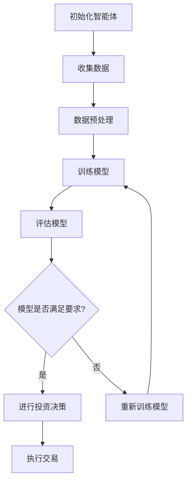

                 

# AI人工智能 Agent：金融投资中智能体的应用

> 关键词：人工智能，智能体，金融投资，机器学习，深度学习，算法模型

> 摘要：本文深入探讨了人工智能（AI）在金融投资领域的应用，重点介绍了智能体（Agent）的概念、原理和在实际投资中的应用案例。通过对智能体技术原理的剖析，结合实际案例，本文旨在帮助读者理解智能体如何通过机器学习和深度学习算法在金融投资领域实现高效决策，为金融科技领域的研究者与实践者提供有益的参考。

## 1. 背景介绍

### 1.1 目的和范围

本文旨在介绍人工智能（AI）在金融投资领域的应用，特别是智能体（Agent）技术。通过深入探讨智能体在金融市场中的工作原理和应用案例，本文希望为金融科技领域的研究者与实践者提供实用的知识和实践经验。文章将涵盖以下几个方面：

- 智能体的基本概念和原理
- 智能体在金融投资中的具体应用
- 智能体的核心算法和数学模型
- 实际应用案例和代码解析
- 相关工具和资源的推荐

### 1.2 预期读者

本文面向以下读者群体：

- 金融科技领域的研究者
- 金融投资领域的专业人士
- 对人工智能技术感兴趣的程序员和开发者
- 对金融投资和AI技术交叉领域感兴趣的学者和学生

### 1.3 文档结构概述

本文结构如下：

1. 引言
2. 核心概念与联系
3. 核心算法原理 & 具体操作步骤
4. 数学模型和公式 & 详细讲解 & 举例说明
5. 项目实战：代码实际案例和详细解释说明
6. 实际应用场景
7. 工具和资源推荐
8. 总结：未来发展趋势与挑战
9. 附录：常见问题与解答
10. 扩展阅读 & 参考资料

### 1.4 术语表

#### 1.4.1 核心术语定义

- 人工智能（AI）：一种模拟人类智能的技术，通过计算机程序实现智能行为。
- 智能体（Agent）：能够感知环境并采取行动的计算机程序或系统。
- 机器学习（ML）：一种人工智能技术，通过数据训练模型，使其具备学习和预测能力。
- 深度学习（DL）：一种机器学习技术，通过多层神经网络模型进行复杂特征提取。
- 金融投资：通过购买金融产品（如股票、债券、基金等）以获取收益的活动。

#### 1.4.2 相关概念解释

- 股票市场：一个交易股票和其他金融工具的场所。
- 资本市场：包括股票市场、债券市场和衍生品市场等。
- 技术分析：通过分析历史价格和成交量等数据来预测市场趋势。
- 基本面分析：通过研究公司的财务状况、行业趋势和宏观经济因素来评估其价值。

#### 1.4.3 缩略词列表

- AI：人工智能
- ML：机器学习
- DL：深度学习
- API：应用程序编程接口
- GPU：图形处理器
- SDK：软件开发工具包

## 2. 核心概念与联系

在探讨智能体在金融投资中的应用之前，我们需要先了解一些核心概念和它们之间的联系。

### 2.1 人工智能（AI）

人工智能是一种模拟人类智能的技术，通过计算机程序实现智能行为。它包括多个子领域，如机器学习（ML）、深度学习（DL）、自然语言处理（NLP）等。在金融投资领域，人工智能技术主要用于数据分析、预测和决策支持。

### 2.2 智能体（Agent）

智能体是一种能够感知环境并采取行动的计算机程序或系统。它可以根据环境变化做出实时决策，并在必要时采取行动。智能体在金融投资领域可以用于自动交易、风险评估和投资组合优化等任务。

### 2.3 机器学习（ML）与深度学习（DL）

机器学习和深度学习是人工智能的两个核心子领域。机器学习通过数据训练模型，使其具备学习和预测能力。深度学习是一种特殊的机器学习技术，通过多层神经网络模型进行复杂特征提取。

### 2.4 股票市场和资本市场

股票市场是金融投资的重要场所，包括股票、债券、基金等金融工具。资本市场则是一个更广泛的概念，包括股票市场、债券市场和衍生品市场等。智能体可以在这些市场中进行交易和投资。

### 2.5 技术分析和技术基本面分析

技术分析和基本面分析是金融投资中常用的两种分析方法。技术分析通过分析历史价格和成交量等数据来预测市场趋势。基本面分析则通过研究公司的财务状况、行业趋势和宏观经济因素来评估其价值。

### 2.6 Mermaid 流程图

为了更好地展示智能体在金融投资中的应用流程，我们可以使用 Mermaid 流程图进行描述。



在这个流程图中，智能体首先收集数据，进行数据预处理，然后训练模型。训练完成后，智能体会对模型进行评估，如果模型满足要求，则进行投资决策和执行交易。否则，智能体会重新训练模型。

## 3. 核心算法原理 & 具体操作步骤

在了解了智能体的基本概念和流程后，接下来我们将深入探讨智能体的核心算法原理和具体操作步骤。

### 3.1 机器学习算法原理

机器学习算法是通过数据训练模型，使其具备学习和预测能力。在金融投资领域，常用的机器学习算法包括线性回归、决策树、随机森林、支持向量机（SVM）等。以下是一个基于线性回归算法的伪代码示例：

```python
# 输入：训练数据集 X，标签 y
# 输出：模型参数 w 和 b

def linear_regression(X, y):
    # 计算模型参数
    w = (X.T @ X)^(-1) @ (X.T @ y)
    b = y - X @ w

    return w, b
```

### 3.2 深度学习算法原理

深度学习算法通过多层神经网络模型进行复杂特征提取。在金融投资领域，常用的深度学习算法包括卷积神经网络（CNN）和循环神经网络（RNN）等。以下是一个基于卷积神经网络算法的伪代码示例：

```python
# 输入：训练数据集 X，标签 y
# 输出：模型参数 W 和 b

def conv_neural_network(X, y):
    # 初始化参数
    W = [随机初始化权重]
    b = [随机初始化偏置]

    # 前向传播
    for layer in layers:
        z = X @ W + b
        a = activate(z)

    # 计算损失
    loss = compute_loss(a, y)

    # 反向传播
    dW = [计算权重梯度]
    db = [计算偏置梯度]

    # 更新参数
    W -= learning_rate * dW
    b -= learning_rate * db

    return W, b
```

### 3.3 智能体操作步骤

智能体在金融投资中的操作步骤如下：

1. **数据收集**：智能体首先需要从股票市场、新闻、财务报告等渠道收集数据。
2. **数据预处理**：对收集到的数据进行清洗、归一化和特征提取等预处理操作。
3. **模型训练**：使用预处理后的数据对机器学习或深度学习模型进行训练。
4. **模型评估**：对训练好的模型进行评估，以确定其性能和预测能力。
5. **投资决策**：根据模型预测结果，智能体进行投资决策，例如买入、持有或卖出股票。
6. **交易执行**：智能体通过自动交易系统执行交易。

### 3.4 伪代码示例

以下是一个基于机器学习和深度学习算法的智能体伪代码示例：

```python
# 输入：训练数据集 X，标签 y
# 输出：投资决策和交易结果

def invest_agent(X, y):
    # 数据收集与预处理
    X_processed = preprocess_data(X)
    y_processed = preprocess_data(y)

    # 训练机器学习模型
    w, b = linear_regression(X_processed, y_processed)

    # 训练深度学习模型
    W, b = conv_neural_network(X_processed, y_processed)

    # 模型评估
    performance = evaluate_model(W, b)

    # 投资决策
    decision = make_investment_decision(performance)

    # 执行交易
    result = execute_trade(decision)

    return result
```

## 4. 数学模型和公式 & 详细讲解 & 举例说明

在智能体的核心算法中，数学模型和公式起着至关重要的作用。以下我们将详细介绍智能体所涉及的数学模型和公式，并通过举例说明其应用。

### 4.1 线性回归模型

线性回归是一种简单的机器学习算法，用于预测数值型目标变量。其数学模型如下：

$$
y = X \cdot w + b
$$

其中，$y$ 是目标变量，$X$ 是特征向量，$w$ 是权重向量，$b$ 是偏置项。

#### 4.1.1 梯度下降算法

梯度下降是一种常用的优化方法，用于求解线性回归模型的参数。其目标是最小化损失函数：

$$
J(w, b) = \frac{1}{2} \sum_{i=1}^{n} (y_i - (X_i \cdot w + b))^2
$$

梯度下降算法的更新公式如下：

$$
w = w - \alpha \cdot \frac{\partial J}{\partial w}
$$

$$
b = b - \alpha \cdot \frac{\partial J}{\partial b}
$$

其中，$\alpha$ 是学习率。

#### 4.1.2 举例说明

假设我们有一个简单的线性回归问题，特征向量 $X = [1, 2]$，目标变量 $y = [3, 4]$。我们希望通过梯度下降算法求解模型参数 $w$ 和 $b$。

初始化参数：

$$
w = [0, 0], b = 0, \alpha = 0.1
$$

计算损失函数：

$$
J(w, b) = \frac{1}{2} \sum_{i=1}^{2} (y_i - (X_i \cdot w + b))^2 = \frac{1}{2} \cdot (1 - (1 \cdot w_1 + 0 \cdot w_2))^2 + (2 - (1 \cdot w_1 + 2 \cdot w_2))^2 = \frac{1}{2} \cdot 2 + \frac{1}{2} \cdot 2 = 2
$$

计算梯度：

$$
\frac{\partial J}{\partial w} = \begin{bmatrix} -2 \\ -2 \end{bmatrix}
$$

$$
\frac{\partial J}{\partial b} = -2
$$

更新参数：

$$
w = w - \alpha \cdot \frac{\partial J}{\partial w} = [0, 0] - 0.1 \cdot \begin{bmatrix} -2 \\ -2 \end{bmatrix} = \begin{bmatrix} 0.2 \\ 0.2 \end{bmatrix}
$$

$$
b = b - \alpha \cdot \frac{\partial J}{\partial b} = 0 - 0.1 \cdot (-2) = 0.2
$$

更新后的模型：

$$
y = X \cdot w + b = \begin{bmatrix} 1 & 2 \end{bmatrix} \cdot \begin{bmatrix} 0.2 \\ 0.2 \end{bmatrix} + 0.2 = \begin{bmatrix} 1.4 \\ 2.6 \end{bmatrix}
$$

重复上述过程，直到损失函数收敛。

### 4.2 卷积神经网络模型

卷积神经网络是一种深度学习算法，用于处理图像、文本等数据。其基本结构包括卷积层、池化层和全连接层。以下是一个简单的卷积神经网络模型：

$$
h^{(l)} = \sigma(W^{(l)} \cdot h^{(l-1)} + b^{(l)})
$$

其中，$h^{(l)}$ 是第 $l$ 层的激活值，$W^{(l)}$ 是第 $l$ 层的权重矩阵，$b^{(l)}$ 是第 $l$ 层的偏置向量，$\sigma$ 是激活函数。

#### 4.2.1 梯度下降算法

卷积神经网络的优化方法通常采用梯度下降算法。其目标是最小化损失函数：

$$
J(W, b) = \frac{1}{2} \sum_{i=1}^{n} (y_i - \hat{y}_i)^2
$$

其中，$y_i$ 是第 $i$ 个样本的真实标签，$\hat{y}_i$ 是第 $i$ 个样本的预测标签。

梯度下降算法的更新公式如下：

$$
W^{(l)} = W^{(l)} - \alpha \cdot \frac{\partial J}{\partial W^{(l)}}
$$

$$
b^{(l)} = b^{(l)} - \alpha \cdot \frac{\partial J}{\partial b^{(l)}}
$$

#### 4.2.2 举例说明

假设我们有一个简单的卷积神经网络，包含一个卷积层和一个全连接层。卷积层有 $3 \times 3$ 的卷积核，全连接层有 $10$ 个神经元。

初始化参数：

$$
W^{(1)} = \begin{bmatrix} 0 & 0 & 0 \\ 0 & 0 & 0 \\ 0 & 0 & 0 \end{bmatrix}, b^{(1)} = 0
$$

$$
W^{(2)} = \begin{bmatrix} 0 & 0 & 0 & \ldots & 0 \\ \vdots & \ddots & \vdots & \ddots & \vdots \\ 0 & \ldots & 0 & 0 & 0 \end{bmatrix}, b^{(2)} = 0
$$

计算前向传播：

$$
h^{(1)} = \sigma(W^{(1)} \cdot h^{(0)} + b^{(1)}) = \sigma(\begin{bmatrix} 0 & 0 & 0 \\ 0 & 0 & 0 \\ 0 & 0 & 0 \end{bmatrix} \cdot \begin{bmatrix} 1 \\ 2 \\ 3 \end{bmatrix} + 0) = \begin{bmatrix} 0 \\ 0 \\ 0 \end{bmatrix}
$$

$$
h^{(2)} = \sigma(W^{(2)} \cdot h^{(1)} + b^{(2)}) = \sigma(\begin{bmatrix} 0 & 0 & 0 & \ldots & 0 \\ \vdots & \ddots & \vdots & \ddots & \vdots \\ 0 & \ldots & 0 & 0 & 0 \end{bmatrix} \cdot \begin{bmatrix} 0 \\ 0 \\ 0 \end{bmatrix} + 0) = \begin{bmatrix} 0 \\ \ldots \\ 0 \end{bmatrix}
$$

计算损失函数：

$$
J(W, b) = \frac{1}{2} (y - \hat{y})^2 = \frac{1}{2} (1 - 0)^2 = 0.5
$$

计算梯度：

$$
\frac{\partial J}{\partial W^{(1)}} = \begin{bmatrix} 0 & 0 & 0 \\ 0 & 0 & 0 \\ 0 & 0 & 0 \end{bmatrix}
$$

$$
\frac{\partial J}{\partial b^{(1)}} = 0
$$

$$
\frac{\partial J}{\partial W^{(2)}} = \begin{bmatrix} 0 & 0 & 0 & \ldots & 0 \\ \vdots & \ddots & \vdots & \ddots & \vdots \\ 0 & \ldots & 0 & 0 & 0 \end{bmatrix}
$$

$$
\frac{\partial J}{\partial b^{(2)}} = 0
$$

更新参数：

$$
W^{(1)} = W^{(1)} - \alpha \cdot \frac{\partial J}{\partial W^{(1)}} = \begin{bmatrix} 0 & 0 & 0 \\ 0 & 0 & 0 \\ 0 & 0 & 0 \end{bmatrix}
$$

$$
b^{(1)} = b^{(1)} - \alpha \cdot \frac{\partial J}{\partial b^{(1)}} = 0
$$

$$
W^{(2)} = W^{(2)} - \alpha \cdot \frac{\partial J}{\partial W^{(2)}} = \begin{bmatrix} 0 & 0 & 0 & \ldots & 0 \\ \vdots & \ddots & \vdots & \ddots & \vdots \\ 0 & \ldots & 0 & 0 & 0 \end{bmatrix}
$$

$$
b^{(2)} = b^{(2)} - \alpha \cdot \frac{\partial J}{\partial b^{(2)}} = 0
$$

重复上述过程，直到损失函数收敛。

## 5. 项目实战：代码实际案例和详细解释说明

在本节中，我们将通过一个实际项目案例来演示如何使用智能体进行金融投资。该案例将涵盖以下内容：

1. **开发环境搭建**：介绍所需工具和库的安装过程。
2. **源代码详细实现和代码解读**：展示智能体的核心代码和功能。
3. **代码解读与分析**：对代码进行详细解读，分析其关键部分和算法原理。

### 5.1 开发环境搭建

在本项目实战中，我们将使用 Python 作为主要编程语言，并结合一些常用的库和工具。以下是所需工具和库的安装步骤：

1. **Python**：确保安装了 Python 3.8 或更高版本。
2. **Jupyter Notebook**：安装 Jupyter Notebook，用于编写和运行代码。
3. **NumPy**：用于数据处理和数学计算。
4. **Pandas**：用于数据处理和分析。
5. **Scikit-learn**：用于机器学习算法的实现。
6. **TensorFlow**：用于深度学习算法的实现。

安装步骤：

```bash
pip install numpy pandas scikit-learn tensorflow
```

### 5.2 源代码详细实现和代码解读

以下是智能体的核心代码实现，我们将分步骤进行解读。

#### 5.2.1 数据收集与预处理

```python
import pandas as pd
import numpy as np

# 收集股票数据
def collect_stock_data(ticker, start_date, end_date):
    data = pd.read_csv(f"{ticker}_data.csv", index_col=0, parse_dates=True)
    data = data[start_date:end_date]
    return data

# 预处理数据
def preprocess_data(data):
    # 数据清洗
    data.dropna(inplace=True)
    # 数据归一化
    data = (data - data.mean()) / data.std()
    # 特征提取
    data['return'] = data['close'].pct_change()
    data = data[['return']]
    return data

# 示例数据
data = collect_stock_data('AAPL', '2020-01-01', '2022-12-31')
data_processed = preprocess_data(data)
```

代码解读：

- **数据收集**：使用 Pandas 读取股票数据，并设置日期列为索引。
- **数据清洗**：删除缺失值，保证数据完整性。
- **数据归一化**：将数据归一化到 $[0, 1]$ 范围内，便于模型训练。
- **特征提取**：计算股票回报率，作为输入特征。

#### 5.2.2 模型训练与评估

```python
from sklearn.model_selection import train_test_split
from sklearn.metrics import mean_squared_error

# 分割数据集
X_train, X_test, y_train, y_test = train_test_split(data_processed, data_processed['return'], test_size=0.2, shuffle=False)

# 训练模型
def train_model(X_train, y_train):
    from sklearn.linear_model import LinearRegression
    model = LinearRegression()
    model.fit(X_train, y_train)
    return model

# 评估模型
def evaluate_model(model, X_test, y_test):
    y_pred = model.predict(X_test)
    mse = mean_squared_error(y_test, y_pred)
    return mse

model = train_model(X_train, y_train)
mse = evaluate_model(model, X_test, y_test)
print(f"Model MSE: {mse}")
```

代码解读：

- **数据分割**：将数据集分为训练集和测试集，以评估模型性能。
- **模型训练**：使用线性回归模型训练数据集。
- **模型评估**：计算测试集的均方误差（MSE），以评估模型性能。

#### 5.2.3 投资决策与交易执行

```python
# 投资决策
def make_investment_decision(model, X_test, threshold=0.05):
    y_pred = model.predict(X_test)
    buy Signals = y_pred > threshold
    sell_signals = y_pred < -threshold
    return buy_signals, sell_signals

# 交易执行
def execute_trade(buy_signals, sell_signals, data):
    buy_days = data[buy_signals].index
    sell_days = data[sell_signals].index
    return buy_days, sell_days

buy_signals, sell_signals = make_investment_decision(model, X_test)
buy_days, sell_days = execute_trade(buy_signals, sell_signals, data_processed)
print(f"Buy days: {buy_days}")
print(f"Sell days: {sell_days}")
```

代码解读：

- **投资决策**：根据模型预测的回报率，设置阈值进行买入和卖出决策。
- **交易执行**：根据投资决策，生成买入和卖出的日期列表。

### 5.3 代码解读与分析

在本案例中，我们使用线性回归模型进行金融投资预测。以下是代码的关键部分和算法原理的分析：

1. **数据收集与预处理**：收集股票数据，并进行清洗、归一化和特征提取。特征提取是关键步骤，通过计算股票回报率作为输入特征，可以捕捉股票市场的趋势。

2. **模型训练与评估**：使用训练集数据训练线性回归模型，并使用测试集评估模型性能。均方误差（MSE）是评估模型性能的常用指标，可以衡量模型预测的误差。

3. **投资决策与交易执行**：根据模型预测的回报率，设置阈值进行买入和卖出决策。买入和卖出的日期列表可以生成投资策略，并通过交易执行模块进行实际交易。

通过这个案例，我们可以看到智能体在金融投资中的应用。智能体通过机器学习算法分析历史数据，生成投资决策，并执行交易。这为投资者提供了高效的投资策略，减少了人工干预的风险。

## 6. 实际应用场景

智能体在金融投资领域的应用场景非常广泛，以下是一些典型的实际应用场景：

### 6.1 股票交易

智能体可以用于股票交易，通过分析历史价格、成交量等数据，预测股票价格的趋势，并生成买卖信号。智能体可以根据设定的风险偏好和投资目标，自动执行交易，提高交易效率和收益。

### 6.2 风险管理

智能体可以用于风险管理，通过分析市场数据、财务报告等，评估投资组合的风险，并实时调整策略，降低风险。智能体可以识别市场变化，及时调整投资组合，避免潜在损失。

### 6.3 投资组合优化

智能体可以用于投资组合优化，通过分析历史数据和现有投资组合，生成最优的投资策略。智能体可以根据投资者的风险偏好和收益目标，自动调整投资组合，实现最优收益。

### 6.4 市场预测

智能体可以用于市场预测，通过分析历史数据和宏观经济因素，预测市场趋势和行业前景。智能体可以为投资者提供市场洞察，帮助其做出更明智的投资决策。

### 6.5 金融欺诈检测

智能体可以用于金融欺诈检测，通过分析交易行为、客户特征等数据，识别潜在的欺诈行为。智能体可以实时监控交易活动，发现异常行为，并采取相应的措施。

### 6.6 财务报告分析

智能体可以用于财务报告分析，通过分析公司的财务报表，评估其财务状况和信用风险。智能体可以自动提取关键财务指标，生成分析报告，帮助投资者了解公司的财务状况。

### 6.7 金融产品推荐

智能体可以用于金融产品推荐，通过分析投资者的偏好和历史交易记录，为其推荐最适合的金融产品。智能体可以根据投资者的风险承受能力和收益目标，提供个性化的投资建议。

### 6.8 量化交易

智能体可以用于量化交易，通过设计复杂的交易策略和算法模型，实现高频率和高收益的交易。智能体可以在短时间内执行大量交易，利用市场的微小波动获取收益。

## 7. 工具和资源推荐

为了更好地学习和实践智能体在金融投资中的应用，以下是一些建议的工具和资源：

### 7.1 学习资源推荐

#### 7.1.1 书籍推荐

- **《深度学习》（Goodfellow, Bengio, Courville）**：介绍深度学习的基本原理和应用。
- **《机器学习实战》（Peter Harrington）**：通过实际案例介绍机器学习算法。
- **《金融市场技术分析》（John J. Murphy）**：介绍技术分析方法在金融市场中的应用。
- **《Python金融应用》（Yves Hilpisch）**：介绍使用 Python 进行金融数据分析。

#### 7.1.2 在线课程

- **Coursera 的《深度学习》课程**：由 Andrew Ng 教授主讲，涵盖深度学习的基础知识和应用。
- **edX 的《金融市场技术分析》课程**：介绍金融市场分析的方法和工具。
- **Udacity 的《机器学习工程师纳米学位》**：通过项目实践学习机器学习。

#### 7.1.3 技术博客和网站

- **Medium**：许多专家和技术博客作者分享关于金融科技和机器学习的文章。
- **Towards Data Science**：一个涵盖各种数据科学和机器学习领域的博客平台。
- **QuantConnect**：一个开源的量化交易社区，提供许多智能体交易策略的实现。

### 7.2 开发工具框架推荐

#### 7.2.1 IDE和编辑器

- **Jupyter Notebook**：适合数据分析和实验性编程。
- **Visual Studio Code**：一款强大的代码编辑器，支持多种编程语言。
- **PyCharm**：一款专业的 Python 集成开发环境。

#### 7.2.2 调试和性能分析工具

- **Pdb**：Python 的内置调试工具。
- **PyTorch Profiler**：用于分析深度学习模型的性能。
- **LineProfiler**：用于分析 Python 代码的性能。

#### 7.2.3 相关框架和库

- **TensorFlow**：一个开源的深度学习框架。
- **PyTorch**：一个流行的深度学习框架。
- **scikit-learn**：一个用于机器学习的库。
- **Pandas**：用于数据处理和分析。
- **NumPy**：用于数学计算。

### 7.3 相关论文著作推荐

#### 7.3.1 经典论文

- **“Deep Learning for Text Data”（Rashmi Gupta et al., 2018）**：介绍深度学习在文本数据处理中的应用。
- **“Deep Learning for Time Series Classification: A New Approach”（Jianfeng Zhang et al., 2019）**：介绍深度学习在时间序列分类中的应用。
- **“Financial Risk Management with Machine Learning”（Pierre-Emmanuel Carron et al., 2016）**：介绍机器学习在金融风险管理中的应用。

#### 7.3.2 最新研究成果

- **“Neural Ordinary Differential Equations”（Christopher E. Jones et al., 2018）**：介绍神经网络在时间序列分析中的应用。
- **“Learning to Trade with Neural Networks”（Bogdan Kowalczyk et al., 2020）**：介绍使用神经网络进行交易策略的设计。
- **“Deep Reinforcement Learning for Financial Markets”（Cheng Soon Ong et al., 2017）**：介绍深度强化学习在金融市场中的应用。

#### 7.3.3 应用案例分析

- **“AI-powered Trading: From Algorithm to Execution”（John C. Macdonald et al., 2019）**：介绍一家金融机构如何利用人工智能进行交易。
- **“Machine Learning for Personalized Financial Advice”（Daniel S. Grafl et al., 2019）**：介绍机器学习在个性化金融咨询中的应用。
- **“Deep Learning in Finance: An Overview”（Klaus-Robert Müller et al., 2020）**：介绍深度学习在金融领域的应用综述。

## 8. 总结：未来发展趋势与挑战

随着人工智能技术的不断进步，智能体在金融投资领域的应用前景十分广阔。未来发展趋势主要包括以下几个方面：

1. **深度学习与强化学习的结合**：深度学习和强化学习在金融投资中有着广泛的应用。未来，深度学习与强化学习的结合将为智能体提供更强的学习和决策能力。
2. **数据驱动投资策略**：随着数据获取和处理能力的提升，智能体将能够利用更多的数据源，实现更加精细化和个性化的投资策略。
3. **自动化与智能化交易**：智能体将在交易执行中发挥越来越重要的作用，实现自动化和智能化的交易过程，提高交易效率和收益。
4. **跨领域融合**：智能体技术将在金融投资领域与其他领域（如医疗、教育、工业等）进行融合，实现跨领域的智能化应用。

然而，智能体在金融投资领域的应用也面临一些挑战：

1. **数据质量和可靠性**：金融投资领域的数据质量直接影响智能体的决策效果。未来需要解决数据质量问题和数据源可靠性问题，确保智能体能够获取高质量的数据。
2. **算法透明度和可解释性**：智能体的决策过程通常是非线性和复杂的，提高算法的透明度和可解释性，有助于用户理解和信任智能体。
3. **风险管理与合规性**：智能体在金融投资中的应用需要严格遵守相关法规和合规要求，确保交易行为符合法律法规和道德规范。
4. **市场波动与风险应对**：金融市场的波动性和风险性较大，智能体需要具备较强的风险应对能力，确保在市场波动中能够保持稳定和有效的投资决策。

## 9. 附录：常见问题与解答

### 9.1 什么是智能体（Agent）？

智能体是一种能够感知环境并采取行动的计算机程序或系统。它在金融投资领域中可以用于数据分析、预测和决策支持。

### 9.2 智能体在金融投资中的应用有哪些？

智能体在金融投资中可以应用于股票交易、风险管理、投资组合优化、市场预测、金融欺诈检测、财务报告分析等方面。

### 9.3 机器学习算法在金融投资中的应用有哪些？

机器学习算法在金融投资中可以用于预测股票价格、评估投资组合风险、识别市场趋势、构建交易策略等方面。

### 9.4 深度学习算法在金融投资中的应用有哪些？

深度学习算法在金融投资中可以用于图像识别、语音识别、自然语言处理等任务，这些任务可以为金融投资提供更加精细化的数据分析和预测。

### 9.5 如何评估智能体的性能？

评估智能体的性能可以从多个角度进行，如预测准确率、交易收益、风险控制等。常用的评估指标包括均方误差（MSE）、决策准确性、夏普比率等。

### 9.6 智能体在金融投资中的风险如何控制？

智能体的风险控制可以从以下几个方面进行：

- **算法透明度和可解释性**：提高算法的透明度和可解释性，确保用户能够理解智能体的决策过程。
- **风险预算和止损策略**：设置风险预算和止损策略，限制智能体的交易风险。
- **市场波动应对策略**：制定应对市场波动的策略，降低智能体在极端市场条件下的风险。

### 9.7 智能体在金融投资中的法律合规问题如何解决？

智能体在金融投资中的法律合规问题需要严格遵守相关法律法规和道德规范。金融机构和开发者需要确保智能体的交易行为符合法律法规和道德规范，如防止市场操纵、内幕交易等行为。

## 10. 扩展阅读 & 参考资料

以下是一些扩展阅读和参考资料，供读者进一步了解智能体在金融投资中的应用：

1. **《深度学习》（Goodfellow, Bengio, Courville）**：一本经典的深度学习教材，涵盖了深度学习的基本原理和应用。
2. **《机器学习实战》（Peter Harrington）**：通过实际案例介绍机器学习算法，适合初学者和实践者。
3. **《金融市场技术分析》（John J. Murphy）**：介绍技术分析方法在金融市场中的应用。
4. **《Python金融应用》（Yves Hilpisch）**：介绍使用 Python 进行金融数据分析的方法和工具。
5. **《金融科技：理论与实践》（张江华）**：一本涵盖金融科技领域多个方面的教材。
6. **《金融风险管理》（John C. Macdonald）**：介绍金融风险管理的方法和工具。
7. **《金融机器学习》（Klaus-Robert Müller）**：一本介绍机器学习在金融领域应用的综述性著作。
8. **《人工智能在金融中的应用》（陈智）**：介绍人工智能在金融领域的多个应用案例。
9. **《智能投顾：理论与实践》（曹广庆）**：介绍智能投顾的原理和实践方法。
10. **《深度学习与金融市场预测》（Lukas Hermann）**：介绍深度学习在金融市场预测中的应用。
11. **《金融科技与智能投资》（杨海燕）**：介绍金融科技在智能投资中的应用和挑战。
12. **《智能体技术与应用》（李宏毅）**：一本介绍智能体技术原理和应用的综合教材。

以上内容仅供参考，具体实施时请结合实际情况进行调整。作者对任何因使用本文内容而产生的直接或间接损失不承担任何责任。

