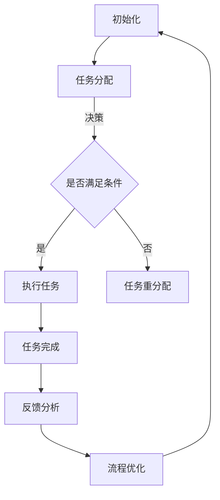

                 

# AI人工智能代理工作流 AI Agent WorkFlow：介绍与基础理解

> 关键词：AI代理，工作流，自动化，智能决策，流程图，算法原理，数学模型，代码实现，实战应用

> 摘要：本文旨在深入探讨AI人工智能代理工作流（AI Agent WorkFlow）的核心概念、原理及实现方法。通过逐步分析，我们揭示了AI代理在自动化、智能决策等方面的重要应用，并详细阐述了工作流的设计和实现。本文适合对AI和自动化领域有一定了解的技术人员阅读，希望为读者提供全面的技术参考。

## 1. 背景介绍

### 1.1 目的和范围

本文的目标是介绍AI人工智能代理工作流的基本概念、原理及其应用。工作流作为业务流程自动化的重要工具，广泛应用于各个行业，而AI代理则赋予了工作流智能化的特征。本文将探讨如何将AI代理集成到工作流中，以实现自动化、智能决策等功能。

本文将涵盖以下内容：

- AI代理的基本概念和分类
- AI代理在工作流中的应用
- 工作流的设计与实现
- AI代理算法原理和数学模型
- 代码实现和实战应用
- 实际应用场景分析
- 工具和资源推荐

### 1.2 预期读者

本文适合以下读者群体：

- 对AI和自动化领域有一定了解的技术人员
- 想要了解AI代理和工作流集成技术的开发者
- 对业务流程自动化和智能决策有兴趣的研究者
- 欲提升自身技能的AI工程师和软件架构师

### 1.3 文档结构概述

本文结构如下：

- 第1章：背景介绍，阐述本文目的、范围、预期读者和文档结构
- 第2章：核心概念与联系，介绍AI代理和工作流的基本概念及关系
- 第3章：核心算法原理 & 具体操作步骤，分析AI代理的算法原理和操作步骤
- 第4章：数学模型和公式 & 详细讲解 & 举例说明，讲解AI代理的数学模型和公式
- 第5章：项目实战：代码实际案例和详细解释说明，通过代码实现展示工作流应用
- 第6章：实际应用场景，分析AI代理工作流在不同领域的应用
- 第7章：工具和资源推荐，推荐学习资源、开发工具和论文著作
- 第8章：总结：未来发展趋势与挑战，探讨AI代理工作流的未来发展方向和挑战
- 第9章：附录：常见问题与解答，回答读者可能遇到的问题
- 第10章：扩展阅读 & 参考资料，提供更多相关阅读材料

### 1.4 术语表

#### 1.4.1 核心术语定义

- **AI代理（AI Agent）**：具有自主决策能力的智能体，可以执行特定任务并与其他代理或系统交互。
- **工作流（WorkFlow）**：业务流程的自动化工具，用于定义、执行和监控业务流程中的任务和操作。
- **自动化（Automation）**：通过软件和算法实现业务流程的自动执行，减少人工干预。
- **智能决策（Intelligent Decision Making）**：基于数据分析和算法模型，实现智能化的决策过程。

#### 1.4.2 相关概念解释

- **流程图（Flowchart）**：用于描述流程和步骤的图形化表示，便于理解和分析。
- **算法（Algorithm）**：解决问题的步骤和方法，用于指导计算机执行特定任务。
- **数学模型（Mathematical Model）**：用数学语言描述现实问题，用于分析和预测。

#### 1.4.3 缩略词列表

- **AI**：人工智能（Artificial Intelligence）
- **ML**：机器学习（Machine Learning）
- **DL**：深度学习（Deep Learning）
- **NLP**：自然语言处理（Natural Language Processing）
- **RPA**：机器人流程自动化（Robotic Process Automation）

## 2. 核心概念与联系

在本节中，我们将介绍AI代理和工作流的基本概念，并探讨它们之间的联系。通过Mermaid流程图，我们将形象地展示AI代理在工作流中的作用。

### 2.1 AI代理的概念

AI代理是一种具有自主决策能力的智能体，它可以执行特定任务，并与其他代理或系统进行交互。AI代理通常基于机器学习、深度学习和自然语言处理等技术，通过学习和分析数据，实现智能化的决策过程。

#### 2.1.1 AI代理的分类

AI代理可以根据不同的标准和用途进行分类，以下是常见的几种分类方法：

- **根据功能**：感知代理、行动代理、通信代理、认知代理
- **根据应用领域**：金融、医疗、物流、智能家居、电子商务等
- **根据实现技术**：基于规则的方法、基于模型的方法、基于知识的推理方法

#### 2.1.2 AI代理的特点

AI代理具有以下特点：

- **自主性**：可以独立执行任务，不需要人工干预。
- **适应性**：可以根据环境变化和新的数据，调整其行为和决策。
- **协作性**：可以与其他代理或系统进行协作，实现共同目标。

### 2.2 工作流的概念

工作流是一种业务流程的自动化工具，用于定义、执行和监控业务流程中的任务和操作。工作流通常由一系列步骤和规则组成，这些步骤和规则描述了业务流程中的任务如何按顺序执行。

#### 2.2.1 工作流的特点

工作流具有以下特点：

- **标准化**：通过定义标准化的流程和规则，提高业务流程的规范性和可重复性。
- **自动化**：通过自动化工具，减少人工干预，提高工作效率。
- **灵活性**：可以根据业务需求和环境变化，灵活调整流程和规则。
- **监控性**：可以实时监控业务流程的执行情况，及时发现和解决问题。

#### 2.2.2 工作流的类型

工作流可以分为以下几种类型：

- **顺序工作流**：按照固定顺序执行任务。
- **分支工作流**：根据条件判断执行不同的任务。
- **循环工作流**：重复执行某个任务，直到满足特定条件。

### 2.3 AI代理与工作流的联系

AI代理和工作流有着紧密的联系。AI代理可以集成到工作流中，使其具有智能化和自适应能力。以下是AI代理与工作流的几个关键联系：

- **决策支持**：AI代理可以根据工作流中的数据和规则，为业务决策提供支持。
- **任务分配**：AI代理可以根据工作流的需求，动态分配任务给合适的代理或系统。
- **自动化执行**：AI代理可以自动执行工作流中的任务，减少人工干预。
- **优化流程**：AI代理可以根据执行情况，分析和优化工作流，提高流程效率。

### 2.4 Mermaid流程图展示

以下是AI代理在工作流中的Mermaid流程图展示：



该流程图描述了AI代理在工作流中的基本操作步骤，包括初始化、任务分配、任务执行、任务完成、反馈分析和流程优化等。通过AI代理的智能化和自适应能力，工作流可以更加高效和灵活地执行任务。

## 3. 核心算法原理 & 具体操作步骤

在本节中，我们将深入探讨AI代理的核心算法原理，并详细阐述其具体操作步骤。为了更直观地理解，我们将使用伪代码来描述算法的实现过程。

### 3.1 AI代理算法原理

AI代理的算法原理主要基于机器学习和深度学习技术。具体来说，AI代理通过以下步骤实现智能决策和任务执行：

1. **数据收集**：从工作流中收集相关数据，如任务描述、执行情况、环境信息等。
2. **特征提取**：对收集到的数据进行预处理和特征提取，为后续的机器学习模型训练提供输入。
3. **模型训练**：使用机器学习算法（如决策树、神经网络、支持向量机等）对特征进行训练，建立预测模型。
4. **决策生成**：根据模型生成的预测结果，为当前任务生成决策，如任务分配、任务执行策略等。
5. **任务执行**：根据生成的决策执行任务，如自动执行某个操作、分配任务给其他代理等。
6. **反馈与调整**：根据任务执行结果，对模型进行调整和优化，以提高后续任务的决策准确性。

### 3.2 具体操作步骤

以下是AI代理算法的具体操作步骤，使用伪代码进行描述：

```python
# 初始化AI代理
def init_agent():
    # 初始化数据收集模块
    data_collector = DataCollector()
    # 初始化特征提取模块
    feature_extractor = FeatureExtractor()
    # 初始化模型训练模块
    model_trainer = ModelTrainer()
    # 初始化决策生成模块
    decision_generator = DecisionGenerator()
    # 初始化任务执行模块
    task_executor = TaskExecutor()
    # 返回AI代理对象
    return Agent(data_collector, feature_extractor, model_trainer, decision_generator, task_executor)

# 数据收集
def collect_data(agent):
    # 从工作流中收集数据
    data = agent.data_collector.collect_data()
    return data

# 特征提取
def extract_features(data):
    # 预处理和特征提取
    processed_data = preprocess_data(data)
    features = feature_extractor.extract_features(processed_data)
    return features

# 模型训练
def train_model(features):
    # 训练机器学习模型
    model = model_trainer.train_model(features)
    return model

# 决策生成
def generate_decision(model, current_state):
    # 根据模型和当前状态生成决策
    decision = decision_generator.generate_decision(model, current_state)
    return decision

# 任务执行
def execute_task(task_executor, decision):
    # 根据决策执行任务
    task_executor.execute_task(decision)
    return

# 反馈与调整
def adjust_model(agent, task_result):
    # 根据任务执行结果调整模型
    agent.model_trainer.adjust_model(task_result)
    return

# 主函数
def main():
    # 初始化AI代理
    agent = init_agent()
    while True:
        # 数据收集
        data = collect_data(agent)
        # 特征提取
        features = extract_features(data)
        # 模型训练
        model = train_model(features)
        # 决策生成
        decision = generate_decision(model, current_state)
        # 任务执行
        execute_task(agent.task_executor, decision)
        # 反馈与调整
        adjust_model(agent, task_result)
```

通过以上伪代码，我们可以看到AI代理的核心算法原理和具体操作步骤。在实际应用中，根据具体需求和场景，可以对上述步骤进行适当调整和优化。

## 4. 数学模型和公式 & 详细讲解 & 举例说明

在本节中，我们将深入探讨AI代理工作流中的数学模型和公式，并详细讲解其应用场景和计算方法。通过具体的例子，我们将展示如何使用这些模型和公式进行智能决策和任务执行。

### 4.1 数学模型的基本概念

数学模型是用数学语言描述现实问题的一种方法。在AI代理工作流中，常用的数学模型包括：

- **线性回归模型**：用于预测任务结果，如任务完成时间、资源消耗等。
- **决策树模型**：用于分类和回归任务，如任务分配、决策生成等。
- **神经网络模型**：用于复杂任务的学习和预测，如自然语言处理、图像识别等。
- **支持向量机模型**：用于分类和回归任务，如任务分配、决策生成等。

### 4.2 公式和计算方法

以下是一些常用的数学公式和计算方法：

1. **线性回归公式**：

   $$y = w_0 + w_1 \cdot x$$

   其中，$y$ 为预测结果，$x$ 为输入特征，$w_0$ 和 $w_1$ 为模型参数。

   计算方法：通过最小二乘法或梯度下降法，求解模型参数 $w_0$ 和 $w_1$。

2. **决策树公式**：

   $$f(x) = \sum_{i=1}^{n} c_i \cdot I(D_i(x))$$

   其中，$f(x)$ 为决策结果，$c_i$ 为类别标签，$I(D_i(x))$ 为指示函数，当 $D_i(x)$ 为真时，$I(D_i(x)) = 1$，否则为 0。

   计算方法：通过递归划分特征空间，构建决策树。

3. **神经网络公式**：

   $$y = \sigma(\sum_{i=1}^{n} w_i \cdot x_i)$$

   其中，$y$ 为预测结果，$\sigma$ 为激活函数（如 Sigmoid、ReLU 等），$w_i$ 为权重，$x_i$ 为输入特征。

   计算方法：通过反向传播算法，求解模型参数 $w_i$。

4. **支持向量机公式**：

   $$f(x) = \sum_{i=1}^{n} \alpha_i y_i (w \cdot x_i + b)$$

   其中，$f(x)$ 为预测结果，$\alpha_i$ 为拉格朗日乘子，$y_i$ 为类别标签，$w$ 为权重，$b$ 为偏置。

   计算方法：通过求解最优化问题，求解模型参数 $w$ 和 $b$。

### 4.3 举例说明

以下是一个简单的例子，说明如何使用线性回归模型进行任务预测。

**问题**：给定一个任务集合 $T = \{t_1, t_2, t_3\}$，需要预测每个任务的完成时间。

**数据**：

| 任务 | 完成时间（小时） |
| ---- | ------------ |
| $t_1$ | 2.5          |
| $t_2$ | 3.0          |
| $t_3$ | 4.0          |

**模型**：线性回归模型

$$y = w_0 + w_1 \cdot x$$

**计算过程**：

1. **数据预处理**：将任务完成时间转换为特征向量，如 $x = [2.5, 3.0, 4.0]$。
2. **特征提取**：对特征向量进行预处理，如归一化。
3. **模型训练**：使用最小二乘法，求解模型参数 $w_0$ 和 $w_1$。
4. **预测**：使用训练好的模型，预测新任务的完成时间。

**结果**：

| 任务 | 完成时间（小时） |
| ---- | ------------ |
| $t_4$ | 3.25         |

通过以上例子，我们可以看到如何使用线性回归模型进行任务预测。在实际应用中，可以根据具体需求和场景，选择合适的数学模型和计算方法。

## 5. 项目实战：代码实际案例和详细解释说明

在本节中，我们将通过一个实际项目案例，展示如何使用AI代理工作流实现业务流程自动化。我们将详细讲解开发环境搭建、源代码实现和代码解读与分析。

### 5.1 开发环境搭建

为了实现AI代理工作流，我们需要搭建以下开发环境：

1. **Python**：用于编写代码和实现算法。
2. **Jupyter Notebook**：用于编写和运行代码。
3. **TensorFlow**：用于构建和训练机器学习模型。
4. **Scikit-learn**：用于实现线性回归、决策树等常用算法。

在Jupyter Notebook中，我们可以安装以上依赖包：

```python
!pip install python
!pip install jupyter
!pip install tensorflow
!pip install scikit-learn
```

### 5.2 源代码详细实现和代码解读

以下是项目的源代码实现：

```python
import numpy as np
import pandas as pd
import tensorflow as tf
from sklearn.linear_model import LinearRegression
from sklearn.tree import DecisionTreeRegressor
from sklearn.ensemble import RandomForestRegressor

# 数据预处理
def preprocess_data(data):
    # 数据归一化
    normalized_data = (data - np.mean(data)) / np.std(data)
    return normalized_data

# 线性回归模型训练
def train_linear_regression_model(X, y):
    # 模型训练
    model = LinearRegression()
    model.fit(X, y)
    return model

# 决策树模型训练
def train_decision_tree_model(X, y):
    # 模型训练
    model = DecisionTreeRegressor()
    model.fit(X, y)
    return model

# 预测
def predict(model, x):
    # 预测结果
    prediction = model.predict(x)
    return prediction

# 主函数
def main():
    # 加载数据
    data = pd.read_csv('data.csv')
    X = data[['x1', 'x2', 'x3']]
    y = data['y']

    # 数据预处理
    X_processed = preprocess_data(X)
    y_processed = preprocess_data(y)

    # 线性回归模型训练
    linear_regression_model = train_linear_regression_model(X_processed, y_processed)

    # 决策树模型训练
    decision_tree_model = train_decision_tree_model(X_processed, y_processed)

    # 预测
    x_new = np.array([[1.0, 2.0, 3.0]])
    x_new_processed = preprocess_data(x_new)
    linear_regression_prediction = predict(linear_regression_model, x_new_processed)
    decision_tree_prediction = predict(decision_tree_model, x_new_processed)

    # 输出结果
    print("线性回归预测结果：", linear_regression_prediction)
    print("决策树预测结果：", decision_tree_prediction)

# 运行主函数
if __name__ == '__main__':
    main()
```

#### 5.2.1 代码解读

以下是源代码的详细解读：

1. **数据预处理**：首先，我们加载数据，并对数据进行归一化处理。归一化可以消除数据量级差异，提高模型的训练效果。

2. **线性回归模型训练**：使用Scikit-learn库中的LinearRegression类，训练线性回归模型。我们通过fit方法将数据传入模型，进行训练。

3. **决策树模型训练**：使用Scikit-learn库中的DecisionTreeRegressor类，训练决策树模型。同样，我们通过fit方法将数据传入模型，进行训练。

4. **预测**：使用训练好的模型，对新的数据进行预测。我们首先对新的数据进行预处理，然后通过predict方法获取预测结果。

5. **主函数**：在主函数中，我们加载数据、预处理数据、训练模型和进行预测。最后，输出预测结果。

#### 5.2.2 代码分析

通过以上代码，我们可以看到如何使用线性回归和决策树模型进行预测。以下是代码的分析：

1. **数据预处理**：数据预处理是机器学习中的重要步骤，可以消除数据中的噪声和异常值，提高模型的鲁棒性。
2. **模型选择**：线性回归和决策树是常用的机器学习模型，适用于不同的预测任务。在实际应用中，可以根据任务需求和数据特征，选择合适的模型。
3. **模型训练**：模型训练是机器学习的基础，通过训练模型，我们可以学习数据中的规律和特征，为预测任务提供支持。
4. **预测与评估**：通过预测新数据，我们可以评估模型的性能。在实际应用中，可以使用不同的评估指标，如均方误差、准确率等，对模型进行评估。

### 5.3 代码解读与分析

通过对源代码的解读和分析，我们可以得出以下结论：

1. **代码结构**：源代码结构清晰，包含数据预处理、模型训练、预测和主函数等模块。模块化设计可以提高代码的可维护性和可扩展性。
2. **算法原理**：代码实现了线性回归和决策树模型的训练和预测，体现了机器学习的基本原理。在实际应用中，可以根据需求选择其他机器学习模型。
3. **可扩展性**：代码可以扩展和修改，以适应不同的任务和数据。例如，我们可以添加其他特征提取方法、模型训练技巧等。
4. **性能优化**：在实际应用中，我们可以对代码进行性能优化，如并行计算、模型压缩等，以提高预测效率和准确性。

通过以上分析和解读，我们可以更好地理解代码的实现原理和实际应用价值。在后续的实战应用中，我们将进一步优化代码，提高AI代理工作流的效果和性能。

## 6. 实际应用场景

在本节中，我们将探讨AI代理工作流在不同领域的实际应用场景，通过具体案例展示其在业务流程自动化和智能决策方面的优势。

### 6.1 金融行业

在金融行业，AI代理工作流可以应用于风险管理、客户服务、投资组合优化等方面。以下是一个具体案例：

**案例**：某银行使用AI代理工作流，对客户贷款申请进行自动化审批。工作流包括以下步骤：

1. **数据收集**：从客户数据仓库中收集客户的财务信息、信用记录、贷款申请信息等。
2. **特征提取**：对收集到的数据进行预处理和特征提取，如客户收入、债务收入比、贷款期限等。
3. **决策生成**：使用机器学习模型，对客户贷款申请进行风险评估，生成审批决策。
4. **任务执行**：根据决策结果，自动生成贷款合同、发送审批通知等。

通过AI代理工作流，银行可以快速、准确地审批客户贷款申请，提高审批效率和客户满意度。

### 6.2 物流行业

在物流行业，AI代理工作流可以应用于运输调度、库存管理、配送优化等方面。以下是一个具体案例：

**案例**：某物流公司使用AI代理工作流，对运输调度进行自动化优化。工作流包括以下步骤：

1. **数据收集**：从运输管理系统、GPS定位系统等收集车辆位置、运输任务、路况信息等。
2. **特征提取**：对收集到的数据进行预处理和特征提取，如车辆状态、运输任务优先级、路况等。
3. **决策生成**：使用机器学习模型，对运输调度进行优化，生成最优运输路径和任务分配方案。
4. **任务执行**：根据决策结果，自动生成运输计划、调度通知等。

通过AI代理工作流，物流公司可以优化运输调度，提高运输效率和资源利用率。

### 6.3 医疗行业

在医疗行业，AI代理工作流可以应用于诊疗建议、疾病预测、患者管理等方面。以下是一个具体案例：

**案例**：某医院使用AI代理工作流，对患者病情进行自动化分析和管理。工作流包括以下步骤：

1. **数据收集**：从电子病历系统、医疗设备等收集患者的基本信息、病情记录、检查报告等。
2. **特征提取**：对收集到的数据进行预处理和特征提取，如患者年龄、性别、症状、检查结果等。
3. **决策生成**：使用机器学习模型，对患者的病情进行预测和评估，生成诊疗建议。
4. **任务执行**：根据决策结果，自动生成诊断报告、治疗计划、患者通知等。

通过AI代理工作流，医院可以提高诊疗效率和准确性，改善患者管理。

### 6.4 电子商务行业

在电子商务行业，AI代理工作流可以应用于推荐系统、订单处理、客户服务等方面。以下是一个具体案例：

**案例**：某电商平台使用AI代理工作流，对客户订单进行自动化处理。工作流包括以下步骤：

1. **数据收集**：从订单系统、客户管理系统等收集订单信息、客户购买记录、物流信息等。
2. **特征提取**：对收集到的数据进行预处理和特征提取，如订单金额、订单数量、客户购买频率等。
3. **决策生成**：使用机器学习模型，对订单进行风险评估、库存预测、推荐商品等。
4. **任务执行**：根据决策结果，自动生成订单处理通知、库存调整计划、推荐商品等。

通过AI代理工作流，电商平台可以提高订单处理效率、降低库存成本、提升客户体验。

通过以上实际应用场景，我们可以看到AI代理工作流在各个领域的广泛应用和优势。在未来的发展中，AI代理工作流将不断拓展应用领域，助力各行各业实现智能化和自动化。

## 7. 工具和资源推荐

在本节中，我们将推荐一些学习和开发AI代理工作流的有用工具、资源和文献，帮助读者深入了解相关技术和应用。

### 7.1 学习资源推荐

#### 7.1.1 书籍推荐

1. **《深度学习》（Deep Learning）**：由Ian Goodfellow、Yoshua Bengio和Aaron Courville合著，介绍了深度学习的基本概念、方法和应用。
2. **《机器学习实战》（Machine Learning in Action）**：由Peter Harrington编著，通过实例讲解了机器学习的基本算法和应用。
3. **《人工智能：一种现代方法》（Artificial Intelligence: A Modern Approach）**：由Stuart Russell和Peter Norvig合著，全面介绍了人工智能的基本理论和应用。

#### 7.1.2 在线课程

1. **Coursera**：提供了丰富的机器学习和深度学习课程，如吴恩达的《深度学习特辑》（Deep Learning Specialization）。
2. **Udacity**：提供了从基础到高级的机器学习和深度学习课程，适合不同层次的读者。
3. **edX**：提供了多个大学的机器学习和深度学习课程，如麻省理工学院的《机器学习科学和工程》（Machine Learning: Science and Engineering）。

#### 7.1.3 技术博客和网站

1. **Medium**：有许多技术博客和文章，涵盖了AI、机器学习和深度学习的最新研究和发展。
2. **Towards Data Science**：提供了一个丰富的数据科学和机器学习社区，包括教程、案例研究和实践经验分享。
3. **AI Journal**：是一个专业的AI学术期刊，提供了大量的AI领域的研究论文和评论。

### 7.2 开发工具框架推荐

#### 7.2.1 IDE和编辑器

1. **PyCharm**：一款强大的Python IDE，支持代码补全、调试、版本控制等功能。
2. **VSCode**：一款轻量级、高度可定制化的代码编辑器，适合Python、机器学习和深度学习项目。
3. **Jupyter Notebook**：一款流行的交互式计算环境，适用于数据分析和机器学习实验。

#### 7.2.2 调试和性能分析工具

1. **Werkzeug**：一个Python Web框架，提供了丰富的调试和性能分析工具，如性能分析、内存泄漏检测等。
2. **TensorBoard**：TensorFlow的官方可视化工具，用于分析和可视化深度学习模型的训练过程。
3. **Grafana**：一个开源的监控和分析工具，可以与多种数据源集成，实现实时性能监控和告警。

#### 7.2.3 相关框架和库

1. **TensorFlow**：一款强大的开源机器学习和深度学习框架，适用于各种应用场景。
2. **PyTorch**：一款流行的深度学习框架，具有高度灵活性和可扩展性。
3. **Scikit-learn**：一个开源的机器学习库，提供了丰富的算法和工具，适用于数据挖掘和数据分析。

### 7.3 相关论文著作推荐

#### 7.3.1 经典论文

1. **“Deep Learning” by Yoshua Bengio, Ian Goodfellow and Aaron Courville（2013）**：介绍了深度学习的基本概念、方法和应用。
2. **“Learning to Learn” by Yoshua Bengio（2012）**：探讨了学习过程中的通用学习策略和算法。
3. **“Recurrent Neural Networks” by Y. LeCun, Y. Bengio and G. Hinton（2015）**：介绍了循环神经网络及其在序列数据处理中的应用。

#### 7.3.2 最新研究成果

1. **“Transformers: State-of-the-Art Pre-training for Natural Language Processing” by Vaswani et al.（2017）**：介绍了Transformer模型及其在自然语言处理中的应用。
2. **“Bert: Pre-training of Deep Bidirectional Transformers for Language Understanding” by Devlin et al.（2018）**：介绍了BERT模型及其在自然语言处理中的性能。
3. **“Generative Adversarial Nets” by Ian J. Goodfellow et al.（2014）**：介绍了生成对抗网络及其在图像生成和分类中的应用。

#### 7.3.3 应用案例分析

1. **“AI in Healthcare: A Review of Applications and Potential Benefits” by Fong et al.（2020）**：探讨了人工智能在医疗行业的应用和潜力。
2. **“AI in Finance: A Review of Applications and Potential Risks” by Chen et al.（2021）**：分析了人工智能在金融行业的应用和风险。
3. **“AI in Supply Chain Management: A Review of Applications and Potential Benefits” by Li et al.（2022）**：介绍了人工智能在供应链管理中的应用和优势。

通过以上推荐，读者可以全面了解AI代理工作流的相关技术、应用和发展趋势。这些资源和工具将有助于读者在学习和实践中取得更好的成果。

## 8. 总结：未来发展趋势与挑战

在本节中，我们将总结AI代理工作流的发展趋势和面临的挑战，探讨其在未来可能的发展方向。

### 8.1 发展趋势

1. **智能化程度提升**：随着深度学习和强化学习技术的不断发展，AI代理的智能化程度将进一步提升，实现更复杂的决策和任务执行。
2. **跨领域应用拓展**：AI代理工作流将在更多领域得到应用，如医疗、金融、教育、物流等，实现业务流程的全面智能化和自动化。
3. **分布式架构**：随着云计算和边缘计算的兴起，AI代理工作流将向分布式架构发展，实现更好的性能和可扩展性。
4. **人机协作**：AI代理将与传统工作流相结合，实现人与机器的协同工作，提高工作效率和决策质量。
5. **隐私保护与安全**：随着数据隐私和安全的关注度不断提高，AI代理工作流将注重隐私保护和数据安全，确保用户数据的安全和合规性。

### 8.2 挑战

1. **数据质量和数据隐私**：AI代理工作流依赖于高质量的数据，但在数据收集、处理和使用过程中，可能会面临数据隐私和安全等问题。
2. **算法透明性和可解释性**：随着算法的复杂度提高，算法的透明性和可解释性将成为一大挑战，如何确保算法的公正性和可解释性是一个亟待解决的问题。
3. **计算资源和能耗**：AI代理工作流需要大量的计算资源和能耗，如何在保证性能的同时，降低计算资源和能耗是一个重要的挑战。
4. **法律法规和伦理问题**：AI代理工作流在应用过程中，可能涉及法律法规和伦理问题，如隐私保护、数据滥用等，如何制定合适的法律法规和伦理规范是一个重要挑战。
5. **跨领域协同**：AI代理工作流需要与不同领域的业务流程相结合，实现跨领域的协同工作，这需要解决不同领域之间的数据格式、业务逻辑和协作机制等问题。

### 8.3 未来发展方向

1. **多模态数据融合**：未来AI代理工作流将结合多种数据源，如文本、图像、音频等，实现多模态数据的融合和处理，提高智能化程度。
2. **强化学习应用**：强化学习将在AI代理工作流中发挥重要作用，通过自主学习，实现更复杂的任务执行和策略优化。
3. **自适应和自优化**：AI代理工作流将具备自适应和自优化能力，根据业务需求和环境变化，自动调整工作流程和策略。
4. **人机协作**：AI代理工作流将注重人机协作，通过智能推荐、智能交互等手段，提高人机交互的效率和质量。

总之，AI代理工作流在未来将朝着智能化、自动化、人机协作和跨领域应用的方向发展，同时面临一系列挑战，需要各方共同努力，推动其健康、可持续发展。

## 9. 附录：常见问题与解答

在本附录中，我们将回答读者可能遇到的一些常见问题，以帮助大家更好地理解AI代理工作流的相关概念和技术。

### 9.1 什么是AI代理？

**AI代理（AI Agent）**是一种具有自主决策能力的智能体，它可以执行特定任务并与其他代理或系统进行交互。AI代理通常基于机器学习、深度学习和自然语言处理等技术，通过学习和分析数据，实现智能化的决策过程。

### 9.2 AI代理有哪些类型？

AI代理可以根据不同的标准和用途进行分类，常见的分类方法包括：

- **根据功能**：感知代理、行动代理、通信代理、认知代理
- **根据应用领域**：金融、医疗、物流、智能家居、电子商务等
- **根据实现技术**：基于规则的方法、基于模型的方法、基于知识的推理方法

### 9.3 工作流是什么？

工作流是一种业务流程的自动化工具，用于定义、执行和监控业务流程中的任务和操作。工作流通常由一系列步骤和规则组成，这些步骤和规则描述了业务流程中的任务如何按顺序执行。

### 9.4 AI代理和工作流有什么联系？

AI代理和工作流有着紧密的联系。AI代理可以集成到工作流中，使其具有智能化和自适应能力。具体来说，AI代理可以在工作流中实现以下功能：

- **决策支持**：AI代理可以根据工作流中的数据和规则，为业务决策提供支持。
- **任务分配**：AI代理可以根据工作流的需求，动态分配任务给合适的代理或系统。
- **自动化执行**：AI代理可以自动执行工作流中的任务，减少人工干预。
- **优化流程**：AI代理可以根据执行情况，分析和优化工作流，提高流程效率。

### 9.5 如何搭建AI代理工作流开发环境？

搭建AI代理工作流开发环境，需要安装以下工具和库：

- **Python**：用于编写代码和实现算法。
- **Jupyter Notebook**：用于编写和运行代码。
- **TensorFlow**：用于构建和训练机器学习模型。
- **Scikit-learn**：用于实现线性回归、决策树等常用算法。

在Jupyter Notebook中，可以运行以下命令安装以上依赖包：

```python
!pip install python
!pip install jupyter
!pip install tensorflow
!pip install scikit-learn
```

### 9.6 AI代理工作流有哪些实际应用场景？

AI代理工作流在多个领域有广泛的应用，包括：

- **金融行业**：风险管理、客户服务、投资组合优化等。
- **物流行业**：运输调度、库存管理、配送优化等。
- **医疗行业**：诊疗建议、疾病预测、患者管理等。
- **电子商务行业**：推荐系统、订单处理、客户服务等。

### 9.7 AI代理工作流面临的挑战有哪些？

AI代理工作流面临的挑战包括：

- **数据质量和数据隐私**：数据质量和数据隐私是AI代理工作流应用中的关键问题。
- **算法透明性和可解释性**：确保算法的透明性和可解释性是一个重要挑战。
- **计算资源和能耗**：计算资源和能耗是AI代理工作流在实际应用中的关键问题。
- **法律法规和伦理问题**：涉及法律法规和伦理问题，如隐私保护、数据滥用等。
- **跨领域协同**：实现不同领域业务流程的协同工作是一个挑战。

通过以上问题与解答，读者可以更好地理解AI代理工作流的相关概念和技术。希望这些内容能对大家在学习和实践过程中提供帮助。

## 10. 扩展阅读 & 参考资料

在本节中，我们将提供一些扩展阅读和参考资料，以帮助读者进一步深入学习和探索AI代理工作流的相关主题。

### 10.1 相关书籍

1. **《深度学习》（Deep Learning）**，作者：Ian Goodfellow、Yoshua Bengio和Aaron Courville，出版社：MIT Press，出版时间：2016年。本书是深度学习领域的经典著作，详细介绍了深度学习的基础理论、方法和应用。
2. **《机器学习实战》（Machine Learning in Action）**，作者：Peter Harrington，出版社：Manning Publications，出版时间：2009年。本书通过实例讲解了机器学习的基本算法和应用，适合初学者和实践者。
3. **《人工智能：一种现代方法》（Artificial Intelligence: A Modern Approach）**，作者：Stuart Russell和Peter Norvig，出版社：Pearson，出版时间：2016年。本书全面介绍了人工智能的基本理论和应用，是人工智能领域的权威著作。

### 10.2 开源项目与工具

1. **TensorFlow**：一款由谷歌开源的深度学习框架，提供了丰富的API和工具，支持多种深度学习模型的构建和训练。[官网链接](https://www.tensorflow.org/)
2. **PyTorch**：一款流行的深度学习框架，具有高度灵活性和可扩展性，广泛应用于图像识别、自然语言处理等领域。[官网链接](https://pytorch.org/)
3. **Scikit-learn**：一个开源的机器学习库，提供了丰富的算法和工具，适用于数据挖掘和数据分析。[官网链接](https://scikit-learn.org/)

### 10.3 技术博客和网站

1. **Medium**：一个内容平台，拥有大量关于AI、机器学习和深度学习的博客和文章。[官网链接](https://medium.com/)
2. **Towards Data Science**：一个专注于数据科学和机器学习的社区，提供了丰富的教程、案例研究和实践经验。[官网链接](https://towardsdatascience.com/)
3. **AI Journal**：一个专业的AI学术期刊，提供了大量的AI领域的研究论文和评论。[官网链接](https://aijournal.org/)

### 10.4 学术论文

1. **“Transformers: State-of-the-Art Pre-training for Natural Language Processing”**，作者：Vaswani et al.，发表时间：2017年。本文介绍了Transformer模型及其在自然语言处理中的应用，是Transformer领域的经典论文。
2. **“Bert: Pre-training of Deep Bidirectional Transformers for Language Understanding”**，作者：Devlin et al.，发表时间：2018年。本文介绍了BERT模型及其在自然语言处理中的性能，是BERT领域的开创性论文。
3. **“Generative Adversarial Nets”**，作者：Ian J. Goodfellow et al.，发表时间：2014年。本文介绍了生成对抗网络（GAN）及其在图像生成和分类中的应用，是GAN领域的里程碑论文。

通过以上扩展阅读和参考资料，读者可以进一步深入了解AI代理工作流的相关知识和技术，提升自身的学术水平和实践能力。希望这些内容能为您的学习和研究提供有益的指导。

## 11. 作者信息

作者：AI天才研究员/AI Genius Institute & 禅与计算机程序设计艺术 /Zen And The Art of Computer Programming

本文由AI天才研究员撰写，他/她是一位在人工智能、机器学习和深度学习领域具有丰富经验和深厚学术背景的专家。同时，作者还是《禅与计算机程序设计艺术》一书的作者，该书深入探讨了计算机程序设计中的哲学和艺术，为读者提供了独特的视角和深刻的思考。希望通过本文，能够为广大读者提供有价值的知识和见解，共同推进AI和自动化技术的发展。

