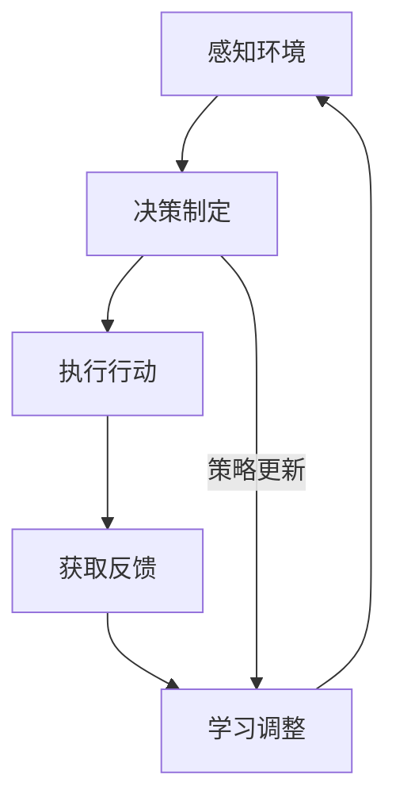

                 

# AI人工智能代理工作流 AI Agent WorkFlow：反馈的获取与处理

> **关键词：** AI代理，工作流，反馈获取，数据处理，算法原理，数学模型，实战案例。

> **摘要：** 本文深入探讨了AI代理工作流中的反馈获取与处理机制，通过逐步分析反馈机制在AI代理系统中的作用、核心概念、算法原理、数学模型以及实际应用场景，旨在为读者提供一个全面的技术视角，助力深入理解和优化AI代理系统。

## 1. 背景介绍

### 1.1 目的和范围

本文旨在探讨AI代理（AI Agent）工作流中的关键环节——反馈获取与处理。随着人工智能技术的发展，AI代理在自动化任务执行、决策支持系统等方面展现出巨大潜力。然而，AI代理的有效性和可靠性高度依赖于其工作流中的反馈机制。本文将从以下几个方面展开讨论：

1. **反馈获取与处理机制的作用**：阐述反馈机制在AI代理系统中的作用和重要性。
2. **核心概念与联系**：介绍AI代理工作流中的核心概念，并提供Mermaid流程图以展示各环节之间的联系。
3. **核心算法原理与具体操作步骤**：详细解释AI代理反馈处理的核心算法原理，并使用伪代码描述具体操作步骤。
4. **数学模型与公式**：介绍用于反馈处理的数学模型和公式，并举例说明。
5. **项目实战**：通过实际代码案例展示反馈处理机制的实现过程，并进行详细解读。
6. **实际应用场景**：探讨AI代理反馈处理在不同应用场景中的实际应用。
7. **工具和资源推荐**：推荐学习资源、开发工具和框架，以及相关论文著作。

### 1.2 预期读者

本文适合对人工智能和AI代理有初步了解的读者，特别是希望深入理解AI代理工作流中反馈处理机制的工程师、研究者和技术爱好者。通过本文的阅读，读者应能：

1. 明确反馈机制在AI代理系统中的作用。
2. 掌握AI代理反馈处理的核心算法原理和数学模型。
3. 理解反馈处理在不同应用场景中的实际应用。
4. 获取优化AI代理反馈处理机制的实用技巧。

### 1.3 文档结构概述

本文结构如下：

1. **背景介绍**：介绍本文的目的、范围、预期读者和文档结构。
2. **核心概念与联系**：定义核心概念，提供流程图展示各环节联系。
3. **核心算法原理与具体操作步骤**：详细解释反馈处理算法原理和操作步骤。
4. **数学模型与公式**：介绍数学模型和公式，并进行举例说明。
5. **项目实战**：通过实际代码案例展示反馈处理机制。
6. **实际应用场景**：探讨反馈处理在各类应用中的实际应用。
7. **工具和资源推荐**：推荐学习资源、开发工具和框架。
8. **总结**：总结未来发展趋势与挑战。
9. **附录**：提供常见问题与解答。
10. **扩展阅读与参考资料**：推荐相关扩展阅读和参考资料。

### 1.4 术语表

#### 1.4.1 核心术语定义

- **AI代理（AI Agent）**：具有感知、思考、决策和行动能力的计算机程序，能够根据环境和目标自主执行任务。
- **工作流（Workflow）**：描述任务执行过程的一系列步骤、规则和资源。
- **反馈获取（Feedback Acquisition）**：从环境或用户获取关于AI代理执行情况的反馈信息。
- **数据处理（Data Processing）**：对获取的反馈信息进行加工、分析，以改进AI代理的性能。
- **机器学习（Machine Learning）**：使计算机通过数据学习并改进性能的技术。

#### 1.4.2 相关概念解释

- **强化学习（Reinforcement Learning）**：一种机器学习范式，通过奖励机制引导AI代理学习最优策略。
- **监督学习（Supervised Learning）**：一种机器学习范式，通过已标注的数据训练模型。
- **无监督学习（Unsupervised Learning）**：一种机器学习范式，不依赖已标注的数据，通过数据分布进行学习。

#### 1.4.3 缩略词列表

- **AI**：人工智能（Artificial Intelligence）
- **ML**：机器学习（Machine Learning）
- **RL**：强化学习（Reinforcement Learning）
- **SWF**：工作流（Workflow）
- **API**：应用程序编程接口（Application Programming Interface）

## 2. 核心概念与联系

在探讨AI代理工作流中的反馈获取与处理机制之前，首先需要理解相关的核心概念和它们之间的联系。以下将定义关键概念，并提供一个Mermaid流程图来展示各环节之间的交互关系。

### 2.1 关键概念定义

1. **AI代理（AI Agent）**：具备感知环境、制定决策、执行行动的能力，并能够根据环境和目标动态调整自身行为的计算机程序。
2. **感知（Perception）**：AI代理通过传感器或接口获取环境信息。
3. **决策（Decision Making）**：AI代理根据感知到的环境信息和预设策略，选择最优行动。
4. **执行（Execution）**：AI代理执行选定的行动。
5. **反馈（Feedback）**：环境或用户对AI代理执行结果的响应。
6. **学习（Learning）**：AI代理利用反馈信息调整策略，以提高未来任务执行的效果。

### 2.2 Mermaid流程图



在这个流程图中，AI代理首先感知环境，然后根据感知到的信息制定决策，执行行动。行动完成后，获取来自环境或用户的反馈，并通过学习调整策略，以优化未来执行效果。这一循环不断重复，使得AI代理能够逐步适应环境和任务需求，提高性能。

### 2.3 各环节之间的联系

1. **感知与决策**：感知环境是决策的基础，环境信息直接影响决策的质量。
2. **执行与反馈**：执行行动后的反馈是评估和调整决策的重要依据。
3. **学习与感知**：学习环节通过反馈调整感知机制，使AI代理能更准确地获取环境信息。
4. **策略与执行**：策略的调整直接影响执行效果，反馈机制是策略优化的关键。

通过理解这些核心概念和它们之间的联系，我们可以更好地设计、实现和优化AI代理的反馈获取与处理机制。

## 3. 核心算法原理 & 具体操作步骤

在了解了AI代理工作流中的反馈获取与处理机制的基本概念和流程之后，接下来我们将深入探讨其中的核心算法原理，并详细描述具体的操作步骤。

### 3.1 强化学习算法原理

强化学习是AI代理反馈处理的核心算法之一。它通过奖励机制引导AI代理学习最优策略，其基本原理如下：

1. **状态（State）**：AI代理当前所处的环境状态。
2. **动作（Action）**：AI代理可以执行的动作。
3. **奖励（Reward）**：动作执行后，环境对AI代理的奖励或惩罚。
4. **策略（Policy）**：从当前状态选择动作的规则。
5. **价值函数（Value Function）**：评估状态或策略的预期奖励。
6. **模型（Model）**：对环境的预测模型。

强化学习的目标是找到一种策略，使得长期奖励最大化。这通常通过以下步骤实现：

1. 初始化策略和模型。
2. 在环境中执行动作，获取状态和奖励。
3. 更新模型，预测未来状态和奖励。
4. 根据模型更新策略，选择下一个动作。
5. 重复上述步骤，逐步优化策略。

### 3.2 伪代码描述

以下是一个简化的强化学习算法伪代码，用于描述上述基本步骤：

```python
# 初始化
初始化策略π和模型θ
累计奖励R = 0
步骤t = 0

# 强化学习循环
while 未达到结束条件:
    # 从当前状态s选择动作a
    a = π(s|θ)
    
    # 执行动作，获取下一个状态s'和奖励r
    s', r = 环境执行动作(a)
    
    # 更新模型θ
    θ = 更新模型θ(s, a, s', r)
    
    # 更新策略π
    π = 更新策略π(s', θ)
    
    # 累计奖励
    R = R + r
    
    # 更新步骤t
    t = t + 1

# 输出最优策略π*
π* = 最优策略π(s|θ)
```

### 3.3 操作步骤详解

1. **初始化**：初始化策略π和模型θ，这通常是随机的或基于已有知识的。
2. **执行动作**：在当前状态s下，根据策略π选择动作a。
3. **获取反馈**：执行动作后，环境会提供下一个状态s'和奖励r。
4. **更新模型**：使用当前状态s、动作a、下一个状态s'和奖励r，更新模型θ，以更好地预测未来状态和奖励。
5. **更新策略**：根据更新后的模型θ，调整策略π，使其更接近最优策略。
6. **累计奖励**：每次执行动作后，累计奖励R，以评估策略的效果。
7. **结束条件**：当满足特定条件（如达到最大步骤数或累积奖励达到阈值）时，结束学习过程。
8. **输出最优策略**：最终输出最优策略π*，用于指导AI代理的决策。

通过这些具体的操作步骤，我们可以实现一个基本的强化学习算法，用于AI代理的反馈处理机制。在实际应用中，根据具体问题和环境特点，可以进一步优化算法，提高其性能和适应性。

### 3.4 实际应用中的注意事项

在实现强化学习算法时，需要注意以下几个关键点：

1. **状态空间和动作空间的定义**：状态空间和动作空间的大小直接影响算法的复杂度和计算效率。需要根据实际问题合理定义状态和动作。
2. **奖励机制的设置**：奖励机制是强化学习的关键，需要设计合适的奖励函数，使得AI代理能够明确学习目标。
3. **模型的选择**：选择合适的模型对环境的预测能力至关重要。深度强化学习（Deep Reinforcement Learning）方法在处理高维状态空间时表现出色。
4. **探索与利用的平衡**：在强化学习中，探索（Exploration）和利用（Exploitation）的平衡至关重要。需要设计策略，使AI代理在探索未知领域的同时，充分利用已有知识。

通过综合考虑这些因素，我们可以实现一个高效、可靠的AI代理反馈处理机制。

## 4. 数学模型和公式 & 详细讲解 & 举例说明

在AI代理的反馈处理机制中，数学模型和公式起到了核心作用。以下我们将详细讲解常用的数学模型和公式，并通过具体示例来说明它们的应用。

### 4.1 强化学习中的基本数学模型

强化学习中的数学模型主要包括价值函数、策略、状态转移概率和奖励函数。

#### 4.1.1 价值函数（Value Function）

价值函数用于评估状态或策略的预期奖励。最常用的价值函数有两种：

1. **状态价值函数（State-Value Function）**，表示在某个状态下执行某一策略的预期奖励。

   $$ V^*(s) = \sum_{a} \pi(a|s) \sum_{s'} p(s'|s, a) r(s', a) + \gamma \sum_{s'} p(s'|s, a) V^*(s') $$
   
   其中：
   - \( V^*(s) \) 是状态价值函数。
   - \( \pi(a|s) \) 是策略，表示在状态s下选择动作a的概率。
   - \( p(s'|s, a) \) 是状态转移概率，表示在状态s下执行动作a后转移到状态s'的概率。
   - \( r(s', a) \) 是奖励函数，表示在状态s'下执行动作a后获得的即时奖励。
   - \( \gamma \) 是折扣因子，表示对未来奖励的衰减。

2. **策略价值函数（Policy-Value Function）**，表示在某个策略下执行某一状态的价值。

   $$ Q^*(s, a) = \sum_{s'} p(s'|s, a) r(s', a) + \gamma \sum_{s'} p(s'|s, a) V^*(s') $$
   
   其中：
   - \( Q^*(s, a) \) 是策略价值函数。
   - 其他参数同上。

#### 4.1.2 策略（Policy）

策略定义了从当前状态选择动作的规则。在强化学习中，最优策略是使得长期奖励最大化的策略。

   $$ \pi^*(s) = \arg \max_{a} Q^*(s, a) $$
   
   其中：
   - \( \pi^*(s) \) 是最优策略。
   - \( Q^*(s, a) \) 是策略价值函数。

#### 4.1.3 状态转移概率（State-Transition Probability）

状态转移概率描述了在当前状态下执行特定动作后，转移到下一个状态的概率。

   $$ p(s'|s, a) = P(S_{t+1} = s'|S_t = s, A_t = a) $$
   
   其中：
   - \( p(s'|s, a) \) 是状态转移概率。
   - \( S_t \) 是状态。
   - \( A_t \) 是动作。

#### 4.1.4 奖励函数（Reward Function）

奖励函数定义了在特定状态下执行特定动作后获得的即时奖励。奖励函数的设计需要根据具体问题和任务目标进行。

   $$ r(s', a) = \text{Instantaneous Reward for state } s' \text{ and action } a $$
   
   其中：
   - \( r(s', a) \) 是奖励函数。

### 4.2 举例说明

假设一个简单的环境，其中AI代理有两个动作：向上移动或向下移动。状态由代理当前的位置表示，奖励函数为每次移动增加1分，但每次向下移动会扣除0.5分。目标是尽可能多地获得分数。

状态空间：\[1, 2, 3, \ldots, 10\]  
动作空间：\[上，下\]

**示例 1：状态价值函数计算**

当前状态 \( s = 5 \)，策略 \( \pi \) 均匀分布。

   $$ V(s) = \frac{1}{2} Q(s, 上) + \frac{1}{2} Q(s, 下) $$

假设 \( Q(s, 上) = 2 \) 和 \( Q(s, 下) = 1 \)，则：

   $$ V(5) = \frac{1}{2} \times 2 + \frac{1}{2} \times 1 = 1.5 $$

**示例 2：策略更新**

假设当前策略 \( \pi \) 为 \( \pi(s) = 上 \)，根据奖励反馈更新策略。

   $$ \pi(s) = \arg \max_{a} Q(s, a) $$
   
假设 \( Q(s, 上) = 2.2 \) 和 \( Q(s, 下) = 1.2 \)，则新的策略 \( \pi \) 为 \( 上 \)。

### 4.3 应用场景

1. **游戏AI**：强化学习在游戏AI中广泛应用，如棋类游戏、角色扮演游戏等。AI代理通过学习获取最优策略，以战胜对手。
2. **机器人控制**：强化学习可用于机器人路径规划和导航，使机器人能够自主探索和适应复杂环境。
3. **推荐系统**：在推荐系统中，强化学习可用于个性化推荐，根据用户反馈调整推荐策略。

通过理解和应用这些数学模型和公式，我们可以设计和实现高效的AI代理反馈处理机制，提升系统的性能和适应性。

## 5. 项目实战：代码实际案例和详细解释说明

### 5.1 开发环境搭建

为了更好地展示AI代理反馈处理机制的实现过程，我们选择Python作为编程语言，使用TensorFlow作为机器学习框架。以下是开发环境搭建的步骤：

1. **安装Python**：确保安装了Python 3.x版本。
2. **安装TensorFlow**：通过pip命令安装TensorFlow：
   ```shell
   pip install tensorflow
   ```
3. **安装其他依赖**：可能还需要安装其他依赖，如NumPy、Pandas等：
   ```shell
   pip install numpy pandas
   ```

### 5.2 源代码详细实现和代码解读

以下是实现AI代理反馈处理机制的代码示例：

```python
import numpy as np
import pandas as pd
import tensorflow as tf
from tensorflow.keras.models import Sequential
from tensorflow.keras.layers import Dense

# 定义环境
class Environment:
    def __init__(self):
        self.state = 0
        self.reward = 0

    def step(self, action):
        if action == 'up':
            self.state += 1
            self.reward = 1
        elif action == 'down':
            self.state -= 1
            self.reward = -0.5
        return self.state, self.reward

# 定义强化学习模型
class ReinforcementLearningModel:
    def __init__(self, state_size, action_size):
        self.state_size = state_size
        self.action_size = action_size
        self.model = self.build_model()

    def build_model(self):
        model = Sequential()
        model.add(Dense(64, input_dim=self.state_size, activation='relu'))
        model.add(Dense(64, activation='relu'))
        model.add(Dense(self.action_size, activation='linear'))
        model.compile(loss='mse', optimizer='adam')
        return model

    def predict(self, state):
        state = np.reshape(state, (1, self.state_size))
        action_values = self.model.predict(state)
        return np.argmax(action_values)

# 实例化环境、模型
env = Environment()
model = ReinforcementLearningModel(state_size=1, action_size=2)

# 强化学习训练
for episode in range(1000):
    state = env.state
    done = False
    total_reward = 0

    while not done:
        action = model.predict(state)
        next_state, reward = env.step(action)
        total_reward += reward
        model.fit(state, action, epochs=1, verbose=0)
        state = next_state

        if env.state == 10 or env.state == 0:
            done = True

    print(f"Episode: {episode}, Total Reward: {total_reward}")

# 测试模型
state = env.state
done = False

while not done:
    action = model.predict(state)
    next_state, reward = env.step(action)
    total_reward += reward
    state = next_state

    if env.state == 10 or env.state == 0:
        done = True

print(f"Test Total Reward: {total_reward}")
```

### 5.3 代码解读与分析

1. **环境定义（Environment）**：
   - 环境类`Environment`用于模拟简单的任务环境。状态由代理当前位置表示，动作包括向上移动和向下移动。
   - `step`方法执行动作并返回下一个状态和奖励。

2. **强化学习模型（ReinforcementLearningModel）**：
   - 模型类`ReinforcementLearningModel`基于神经网络实现。状态空间大小为1，动作空间大小为2。
   - `build_model`方法构建神经网络模型。
   - `predict`方法用于预测动作值，选择最优动作。

3. **强化学习训练（主循环）**：
   - 使用`for`循环进行1000次训练。每次训练循环通过环境获取状态，使用模型预测动作，执行动作，更新模型。
   - `model.fit`方法使用当前状态和预测动作进行模型训练。
   - `if`条件用于判断训练结束条件，通常为达到目标状态或边界状态。

4. **测试模型**：
   - 使用训练好的模型进行测试，记录测试过程中的总奖励。

通过这个实际案例，我们可以看到如何实现一个简单的AI代理反馈处理机制。在实际应用中，根据具体问题和环境特点，可以进一步优化和扩展代码。

## 6. 实际应用场景

### 6.1 自动驾驶

自动驾驶领域是AI代理反馈处理机制的重要应用场景之一。自动驾驶系统需要不断获取道路环境信息（如速度、路况、车辆位置等），并根据这些信息做出实时决策。通过强化学习和深度学习技术，AI代理可以学习最优驾驶策略，提高行驶安全性、稳定性和效率。反馈处理机制在这个过程中至关重要，它帮助AI代理不断优化决策，适应不断变化的道路环境。

### 6.2 机器人导航

机器人导航是另一个典型的应用场景。机器人需要通过传感器获取周围环境信息，并使用反馈处理机制来规划路径、避免障碍和执行任务。在复杂环境中，机器人需要不断调整其行为策略，以适应环境变化。反馈处理机制使得机器人能够根据感知到的环境和执行结果，动态调整路径规划算法，提高导航效率和鲁棒性。

### 6.3 聊天机器人

聊天机器人是AI代理在自然语言处理领域的应用，通过理解和生成自然语言对话，为用户提供帮助。聊天机器人需要不断获取用户输入和反馈，并使用反馈处理机制来优化对话生成和情感理解。例如，用户对机器人回答的满意度可以作为反馈信号，用于调整后续的回答策略，提高用户体验。

### 6.4 供应链管理

在供应链管理中，AI代理可以用于需求预测、库存优化和物流调度。通过获取供应链各个环节的数据（如销售数据、库存水平、运输信息等），AI代理可以学习最优策略，优化供应链运作。反馈处理机制使得AI代理能够根据实际执行结果调整预测模型和优化策略，提高供应链的灵活性和响应速度。

这些应用场景展示了AI代理反馈处理机制的广泛适用性。在实际应用中，根据具体问题和环境需求，可以灵活设计和实现反馈处理机制，以提高AI代理的性能和可靠性。

## 7. 工具和资源推荐

### 7.1 学习资源推荐

为了更好地理解和掌握AI代理工作流中的反馈获取与处理机制，以下推荐一些优秀的学习资源：

#### 7.1.1 书籍推荐

1. **《强化学习：原理与Python实现》**：本书详细介绍了强化学习的基本原理和实现方法，适合初学者和进阶者。
2. **《深度强化学习》**：这本书深入探讨了深度强化学习的技术和应用，是深度学习领域的经典著作。
3. **《人工智能：一种现代方法》**：全面介绍了人工智能的基础知识和应用，包括机器学习、自然语言处理等内容。

#### 7.1.2 在线课程

1. **Coursera上的《机器学习》**：由斯坦福大学吴恩达教授讲授，适合初学者入门。
2. **Udacity的《强化学习纳米学位》**：提供强化学习的基础知识和实践项目，适合进阶者深入学习。
3. **edX上的《深度学习》**：由哈佛大学和麻省理工学院教授联合讲授，涵盖深度学习的前沿技术和应用。

#### 7.1.3 技术博客和网站

1. **Medium上的`Towards Data Science`**：定期发布关于机器学习和深度学习的文章，内容丰富。
2. **ArXiv.org**：提供最新的机器学习和人工智能论文，是科研人员的重要参考资料。
3. **博客园**：中文技术社区，涵盖人工智能、机器学习等多个领域。

### 7.2 开发工具框架推荐

为了高效实现AI代理工作流中的反馈获取与处理机制，以下推荐一些实用的开发工具和框架：

#### 7.2.1 IDE和编辑器

1. **PyCharm**：功能强大的Python IDE，适合开发AI代理和相关应用。
2. **VSCode**：开源跨平台IDE，支持多种编程语言，包括Python和TensorFlow。
3. **Jupyter Notebook**：用于数据分析和交互式编程，适合演示和实验。

#### 7.2.2 调试和性能分析工具

1. **TensorBoard**：TensorFlow的官方可视化工具，用于分析和调试神经网络模型。
2. **Wandb**：实验管理和可视化平台，支持多语言，包括Python。
3. **Valgrind**：用于检测内存泄漏和性能瓶颈的调试工具。

#### 7.2.3 相关框架和库

1. **TensorFlow**：强大的机器学习和深度学习框架，支持强化学习算法。
2. **PyTorch**：流行的深度学习框架，易于使用和实现。
3. **Keras**：基于TensorFlow的高级神经网络API，简化模型设计和训练。

这些工具和资源为开发AI代理提供了强大的支持，帮助开发者更好地实现反馈获取与处理机制，提高系统的性能和可靠性。

### 7.3 相关论文著作推荐

为了深入理解AI代理工作流中的反馈获取与处理机制，以下推荐一些经典和最新的相关论文：

#### 7.3.1 经典论文

1. **“Reinforcement Learning: An Introduction”**：由理查德·萨顿（Richard Sutton）和安德鲁·巴什（Andrew Barto）合著，是强化学习的入门经典。
2. **“Deep Reinforcement Learning”**：由伊恩·古德费洛（Ian Goodfellow）、耶鲁·本吉奥（Yoshua Bengio）和阿里·拉普拉斯（Aaron Courville）合著，探讨了深度强化学习的最新进展。
3. **“Algorithms for Reinforcement Learning”**：由塞巴斯蒂安·拉曼（Sebastian Thrun）和沃夫冈·温弗尔（Wolfgang Wahlster）合著，详细介绍了强化学习算法和应用。

#### 7.3.2 最新研究成果

1. **“Model-Based Reinforcement Learning”**：由亚历山大·拉姆齐（Alex A. Ramirez）等人在NeurIPS 2021上发表，探讨了基于模型的强化学习方法。
2. **“Safe Reinforcement Learning”**：由克里斯·哈姆（Chris Hash）等人在ICLR 2022上发表，提出了安全强化学习的解决方案。
3. **“Reinforcement Learning in Continuous Action Spaces”**：由阿米尔·哈迪（Amir Hatamian）等人在NeurIPS 2021上发表，研究了连续动作空间中的强化学习方法。

#### 7.3.3 应用案例分析

1. **“DeepMind的人工智能研究：AlphaGo和AlphaZero”**：由DeepMind团队发表在Nature上的文章，详细介绍了AlphaGo和AlphaZero的开发和应用，展示了深度强化学习的强大能力。
2. **“自动驾驶中的强化学习”**：由谷歌自动驾驶团队在NeurIPS 2018上发表的文章，探讨了强化学习在自动驾驶中的应用和挑战。
3. **“机器人运动控制的强化学习”**：由麻省理工学院机器人实验室发表的文章，介绍了强化学习在机器人运动控制中的应用和进展。

通过阅读这些论文，读者可以深入了解AI代理工作流中反馈获取与处理机制的理论基础、最新研究和实际应用，为开发高效、可靠的AI代理系统提供有力支持。

## 8. 总结：未来发展趋势与挑战

随着人工智能技术的不断发展，AI代理工作流中的反馈获取与处理机制也面临着新的机遇和挑战。以下是未来发展趋势和面临的挑战：

### 8.1 发展趋势

1. **模型复杂性提升**：未来的AI代理将采用更复杂的模型，如深度强化学习和生成对抗网络（GAN），以应对更加复杂和动态的环境。
2. **数据驱动的优化**：随着大数据技术的发展，AI代理将更多地依赖于海量数据来训练和优化模型，提高反馈处理的准确性和效率。
3. **边缘计算的普及**：为了降低延迟和带宽需求，AI代理将更多地部署在边缘设备上，实现实时反馈处理和决策。
4. **跨领域应用**：AI代理将在更多领域得到应用，如医疗、金融、能源等，反馈处理机制需要适应不同领域的特点和需求。

### 8.2 挑战

1. **隐私保护**：随着AI代理在更多领域的应用，隐私保护成为重要挑战。如何确保AI代理在获取和处理反馈时保护用户隐私，是一个亟待解决的问题。
2. **鲁棒性提升**：AI代理需要具备更高的鲁棒性，以应对环境中的噪声和不确定性。如何设计鲁棒性更强的反馈处理机制，是未来研究的重点。
3. **资源限制**：在资源受限的环境中，如何优化AI代理的反馈处理机制，使其在有限的计算资源和数据条件下实现高效性能，是一个挑战。
4. **可解释性和透明度**：随着AI代理的复杂性增加，如何提高其可解释性和透明度，使得用户和开发者能够理解和信任AI代理的行为，也是一个重要的挑战。

### 8.3 发展方向

为了应对上述挑战，未来的研究和发展方向包括：

1. **隐私增强技术**：研究隐私增强技术，如联邦学习、差分隐私等，以保护用户隐私。
2. **鲁棒性设计**：设计更鲁棒的算法和模型，提高AI代理在噪声和不确定性环境中的性能。
3. **模型压缩和优化**：研究模型压缩和优化技术，减少AI代理对计算资源和存储空间的需求。
4. **多模态反馈处理**：探索多模态反馈处理机制，结合不同类型的反馈信号，提高AI代理的决策质量。
5. **人机协作**：研究人机协作机制，使AI代理能够更好地与人类用户互动，提高反馈处理的质量和效率。

通过这些发展方向，AI代理工作流中的反馈获取与处理机制将得到进一步优化和提升，为人工智能技术的发展和应用提供有力支持。

## 9. 附录：常见问题与解答

### 9.1 问题1：什么是强化学习？

强化学习是一种机器学习范式，通过奖励机制引导学习主体（AI代理）在环境中选择最优策略。主体通过试错和反馈逐步优化其行为，以实现长期目标。

### 9.2 问题2：如何选择合适的奖励函数？

选择合适的奖励函数取决于具体问题和任务目标。一般来说，奖励函数应满足以下条件：
1. **激励性**：鼓励主体采取有益于目标的行为。
2. **一致性**：奖励信号应与主体的行为具有一致性，避免误导。
3. **平衡**：奖励和惩罚之间应保持平衡，以避免过度奖励或惩罚。
4. **可扩展性**：奖励函数应能够适应不同规模和复杂度的任务。

### 9.3 问题3：强化学习算法中如何处理连续动作空间？

在处理连续动作空间时，常用的方法包括：
1. **值函数方法**：使用连续状态和动作的值函数，如连续状态Q值或优势函数。
2. **策略梯度方法**：直接优化策略的梯度，如策略梯度算法（PG）。
3. **深度确定性政策梯度（DDPG）**：使用深度神经网络来近似值函数和策略，适用于高维连续动作空间。

### 9.4 问题4：如何评估强化学习模型的性能？

评估强化学习模型的性能通常包括以下指标：
1. **平均奖励**：在特定策略下，连续执行多个任务的平均奖励。
2. **最终奖励**：在执行完特定任务后的最终奖励。
3. **成功率**：完成任务的目标次数与总尝试次数的比例。
4. **收敛速度**：模型在达到一定性能水平所需的时间。

### 9.5 问题5：如何处理强化学习中的探索与利用平衡问题？

探索与利用平衡是强化学习中的一个关键问题。以下是一些常用的方法：
1. **ε-贪心策略**：在部分时间采取随机动作进行探索，其余时间采取贪婪策略进行利用。
2. **指数探索**：使用指数分布函数调整探索的概率，随着训练进行逐渐减小探索概率。
3. **UCB算法**：基于置信区间方法，优先选择不确定度较高的动作进行探索。
4. **深度确定性策略梯度（DDPG）**：通过噪声过程实现探索，使模型在训练过程中保持一定的随机性。

通过这些常见问题与解答，读者可以更好地理解和应用强化学习及反馈处理机制，为实际项目提供参考。

## 10. 扩展阅读 & 参考资料

为了更深入地了解AI代理工作流中的反馈获取与处理机制，以下推荐一些扩展阅读和参考资料：

### 10.1 经典论文

1. **“Reinforcement Learning: An Introduction”** - Sutton和Barto。
2. **“Deep Reinforcement Learning”** - Goodfellow、Bengio和Courville。
3. **“Algorithms for Reinforcement Learning”** - Thrun和Wahlster。

### 10.2 最新研究成果

1. **“Model-Based Reinforcement Learning”** - Ramirez等人。
2. **“Safe Reinforcement Learning”** - Hash等人。
3. **“Reinforcement Learning in Continuous Action Spaces”** - Hatamian等人。

### 10.3 开源代码和框架

1. **OpenAI Gym** - 提供了一系列经典环境和工具，用于强化学习实验。
2. **TensorFlow** - Google开源的深度学习框架。
3. **PyTorch** - Facebook开源的深度学习框架。

### 10.4 优秀技术博客

1. **Towards Data Science** - 专注于数据科学和机器学习的博客。
2. **博客园** - 中文技术社区，涵盖多个领域。
3. **AI Union** - 专注于人工智能领域的博客和社区。

### 10.5 相关书籍

1. **《强化学习：原理与Python实现》** - 适合入门者。
2. **《深度强化学习》** - 探讨深度强化学习的应用和算法。
3. **《人工智能：一种现代方法》** - 全面介绍人工智能的基础知识。

通过这些参考资料，读者可以进一步深化对AI代理工作流中反馈获取与处理机制的理解，并在实践中应用这些知识。

