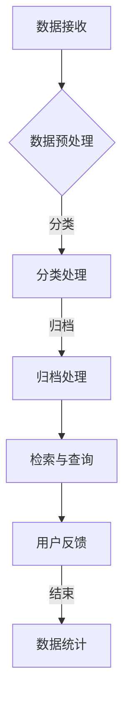

                 

### 文章标题：AI人工智能代理工作流 AI Agent WorkFlow：在档案管理中的应用

关键词：人工智能代理、工作流、档案管理、自动化、效率优化

摘要：
本文旨在探讨AI人工智能代理工作流（AI Agent WorkFlow）在档案管理中的应用。通过分析AI代理的核心概念、架构及其在档案管理中的具体应用场景，我们将深入了解如何利用AI技术实现档案管理的智能化和自动化。本文将详细介绍相关算法原理、数学模型和实际项目案例，并推荐相关学习资源和开发工具，为档案管理的数字化转型提供有益的参考。

### 1. 背景介绍

在信息化时代，档案管理面临着日益庞大的数据规模和复杂的管理需求。传统的档案管理模式已难以满足现代企业的运营效率和管理要求。随着人工智能技术的快速发展，利用AI人工智能代理工作流（AI Agent WorkFlow）实现档案管理的自动化和智能化成为了一种新的趋势。

AI人工智能代理工作流是一种基于人工智能技术的自动化工作流管理系统。它通过智能代理（AI Agent）对档案进行自动化处理、分类、归档、检索等操作，实现档案管理的高效、精准和智能化。智能代理能够根据预设的规则和算法，自动识别和处理档案数据，降低人工干预，提高档案管理的效率和准确性。

档案管理作为企业运营的重要环节，其数字化、智能化转型具有重要意义。一方面，它能够提升企业的运营效率，降低管理成本；另一方面，它能够提高档案的利用率和价值，为企业决策提供有力支持。因此，研究和应用AI人工智能代理工作流在档案管理中的技术具有重要意义。

### 2. 核心概念与联系

#### 2.1 AI人工智能代理

AI人工智能代理（AI Agent）是一种能够模拟人类智能行为，具备自主决策、学习和自适应能力的计算机程序。在档案管理中，AI人工智能代理主要负责以下任务：

- **数据识别与分类**：根据档案的特征信息，如文件类型、关键词、创建时间等，对档案进行自动识别和分类。
- **归档与整理**：根据档案的重要性和紧急程度，将档案自动归档到相应的文件夹或数据库中。
- **检索与查询**：根据用户输入的关键词或条件，快速准确地检索出符合条件的档案，并提供下载或打印等服务。

#### 2.2 工作流管理

工作流管理（Workflow Management）是一种通过自动化、协调和优化任务流程来提高工作效率和管理水平的技术。在档案管理中，工作流管理主要负责以下任务：

- **任务分配与调度**：根据档案的属性和优先级，自动分配给相应的处理人员或系统进行处理。
- **流程监控与反馈**：实时监控工作流执行情况，对异常情况进行及时处理和反馈。
- **任务跟踪与统计**：记录任务执行过程和结果，为后续分析和管理提供数据支持。

#### 2.3 Mermaid流程图

为了更清晰地展示AI人工智能代理工作流在档案管理中的应用，我们可以使用Mermaid流程图来描述其核心概念和流程。



在这个流程中，数据接收模块负责接收外部档案数据；数据预处理模块对档案进行格式化、清洗等处理；分类处理模块根据档案特征信息对档案进行自动分类；归档处理模块将分类后的档案自动归档到相应的文件夹或数据库中；检索与查询模块根据用户输入的关键词或条件，快速检索出符合条件的档案；用户反馈模块为用户提供档案下载或打印等服务；数据统计模块记录任务执行过程和结果，为后续分析和管理提供数据支持。

### 3. 核心算法原理 & 具体操作步骤

#### 3.1 数据预处理算法

数据预处理是档案管理的重要环节，其目的是提高档案数据的准确性和可用性。常用的数据预处理算法包括：

- **数据清洗**：删除重复数据、修复错误数据、填补缺失数据等。
- **数据转换**：将不同格式的数据转换为统一格式，如将Excel数据转换为CSV格式。
- **数据归一化**：对数据规模差异较大的特征进行归一化处理，消除数据量级对算法性能的影响。

具体操作步骤如下：

1. **数据读取**：从数据源读取档案数据，如CSV文件、数据库等。
2. **数据清洗**：删除重复数据、修复错误数据、填补缺失数据等。
3. **数据转换**：将不同格式的数据转换为统一格式。
4. **数据归一化**：对数据规模差异较大的特征进行归一化处理。

#### 3.2 分类处理算法

分类处理算法是档案管理中的核心算法，其主要任务是自动识别和分类档案。常用的分类算法包括：

- **朴素贝叶斯分类器**：基于贝叶斯定理，通过计算特征概率来预测分类结果。
- **支持向量机（SVM）**：通过寻找最优超平面来实现分类。
- **决策树分类器**：通过构建决策树来对档案进行分类。

具体操作步骤如下：

1. **特征提取**：从档案数据中提取关键特征，如文件类型、关键词、创建时间等。
2. **模型训练**：使用已标注的档案数据对分类算法进行训练。
3. **分类预测**：将新档案数据输入分类模型，预测其分类结果。
4. **结果评估**：评估分类模型的准确率、召回率等指标，对模型进行优化。

#### 3.3 归档处理算法

归档处理算法是将分类后的档案自动归档到相应的文件夹或数据库中。常用的归档算法包括：

- **规则匹配**：根据档案的分类结果，匹配相应的归档规则。
- **机器学习**：使用已标注的归档数据，训练机器学习模型来预测档案的归档位置。

具体操作步骤如下：

1. **分类结果读取**：读取分类处理模块生成的分类结果。
2. **规则匹配**：根据分类结果，匹配相应的归档规则。
3. **归档操作**：将分类后的档案自动归档到相应的文件夹或数据库中。

#### 3.4 检索与查询算法

检索与查询算法是档案管理中的一项重要功能，其主要任务是快速准确地检索出符合条件的档案。常用的检索算法包括：

- **关键字搜索**：根据用户输入的关键词，搜索符合条件的档案。
- **相似性搜索**：基于文档相似度计算，检索出与用户输入文档相似的档案。
- **向量空间模型**：将档案和用户输入文档转化为向量表示，计算它们之间的相似度。

具体操作步骤如下：

1. **关键词输入**：用户输入关键词或条件。
2. **检索算法**：根据关键词或条件，使用相应的检索算法检索档案。
3. **结果展示**：将检索结果展示给用户，并提供下载或打印等服务。

### 4. 数学模型和公式 & 详细讲解 & 举例说明

#### 4.1 朴素贝叶斯分类器

朴素贝叶斯分类器是一种基于概率论的分类算法，其基本思想是利用已知的特征概率分布来预测新样本的分类结果。具体公式如下：

$$
P(C_k|X) = \frac{P(X|C_k)P(C_k)}{P(X)}
$$

其中，$C_k$表示第$k$个类别，$X$表示新样本的特征向量，$P(C_k|X)$表示新样本属于第$k$个类别的概率，$P(X|C_k)$表示特征向量$X$属于第$k$个类别的条件概率，$P(C_k)$表示第$k$个类别的概率。

**举例说明**：

假设我们要对一组文档进行分类，其中包含两个类别：技术文档和商业文档。已知技术文档和商业文档的概率分别为$P(C_t) = 0.6$和$P(C_b) = 0.4$。同时，我们还知道技术文档和商业文档中关键词“技术”和“商业”的出现概率分别为$P(t|C_t) = 0.8$和$P(b|C_b) = 0.9$，以及关键词“技术”在文档中出现的概率为$P(t) = 0.7$，关键词“商业”在文档中出现的概率为$P(b) = 0.3$。

现在，我们要对一篇新文档进行分类，该文档中包含关键词“技术”和“商业”。根据朴素贝叶斯分类器的公式，我们可以计算出该文档属于技术文档和商业文档的概率：

$$
P(C_t|X) = \frac{P(X|C_t)P(C_t)}{P(X)} = \frac{P(t|C_t)P(C_t)}{P(t)} = \frac{0.8 \times 0.6}{0.7} = 0.858
$$

$$
P(C_b|X) = \frac{P(X|C_b)P(C_b)}{P(X)} = \frac{P(b|C_b)P(C_b)}{P(b)} = \frac{0.9 \times 0.4}{0.3} = 1.2
$$

由于$P(C_t|X) > P(C_b|X)$，因此我们可以判断该文档属于技术文档。

#### 4.2 支持向量机（SVM）

支持向量机（SVM）是一种基于优化理论的分类算法，其基本思想是寻找一个最优超平面，将不同类别的样本分开。具体公式如下：

$$
\min \frac{1}{2} \sum_{i=1}^n (w_i^2) + C \sum_{i=1}^n \max(0, 1 - y_i (w_i^T x_i + b))
$$

其中，$w_i$表示第$i$个支持向量的权重，$x_i$表示第$i$个样本的特征向量，$y_i$表示第$i$个样本的类别标签（$1$表示正类，$-1$表示负类），$b$表示偏置项，$C$表示正则化参数。

**举例说明**：

假设我们要对一组二维平面上的样本进行分类，其中正类样本分布在超平面$x_1 + x_2 = 0$的一侧，负类样本分布在超平面的另一侧。我们需要找到一个最优超平面，使得正类样本和负类样本之间的距离最大。

我们可以使用SVM求解该优化问题，具体步骤如下：

1. **数据预处理**：将样本数据转换为特征向量。
2. **求解优化问题**：使用SVM求解器求解优化问题，得到最优超平面参数。
3. **分类预测**：将新样本输入到求解得到的最优超平面，根据超平面的符号判断样本的类别。

#### 4.3 决策树分类器

决策树分类器是一种基于树形结构进行分类的算法，其基本思想是通过对样本特征进行划分，构建一个树形结构，树的叶节点表示样本的类别，树的内部节点表示特征划分条件。

决策树的构建过程如下：

1. **选择最优特征划分条件**：计算每个特征的信息增益或基尼不纯度，选择信息增益最大或基尼不纯度最小的特征作为划分条件。
2. **构建决策树**：根据最优特征划分条件，将样本划分为多个子集，对每个子集递归地执行步骤1，直到满足终止条件（如叶节点数量达到阈值、特征数量达到阈值等）。

决策树的分类过程如下：

1. **根节点**：根据根节点的划分条件，将样本划分为多个子集。
2. **递归分类**：对每个子集，重复执行步骤1，直到到达叶节点。
3. **输出类别**：根据叶节点的类别，将样本划分为相应的类别。

**举例说明**：

假设我们要对一组样本进行分类，其中包含两个特征：$x_1$和$x_2$，类别标签为$y$（$1$表示正类，$-1$表示负类）。我们使用信息增益作为划分条件，计算各个特征的信息增益：

- $x_1$的信息增益：$Gain(x_1) = H(D) - \sum_{v \in V} p(v)H(D_v)$
- $x_2$的信息增益：$Gain(x_2) = H(D) - \sum_{v \in V} p(v)H(D_v)$

其中，$D$表示样本集合，$V$表示特征取值集合，$p(v)$表示特征取值$v$的概率，$H(D)$表示样本集合的信息熵，$H(D_v)$表示特征取值$v$的条件下样本集合的信息熵。

根据计算结果，选择信息增益最大的特征作为划分条件，构建决策树。决策树的分类过程如下：

1. **根节点**：根据$x_1$的划分条件，将样本划分为两组：$x_1 < 0$和$x_1 \geq 0$。
2. **递归分类**：对每组样本，重复执行步骤1，直到到达叶节点。
3. **输出类别**：根据叶节点的类别，将样本划分为相应的类别。

### 5. 项目实战：代码实际案例和详细解释说明

#### 5.1 开发环境搭建

在开始项目实战之前，我们需要搭建一个开发环境。这里我们使用Python作为主要编程语言，并结合常见的机器学习库和工具，如Scikit-learn、TensorFlow等。以下是开发环境的搭建步骤：

1. **安装Python**：从Python官方网站下载并安装Python 3.x版本。
2. **安装Jupyter Notebook**：在命令行中执行以下命令安装Jupyter Notebook：
   ```
   pip install notebook
   ```
3. **安装Scikit-learn**：在命令行中执行以下命令安装Scikit-learn：
   ```
   pip install scikit-learn
   ```
4. **安装TensorFlow**：在命令行中执行以下命令安装TensorFlow：
   ```
   pip install tensorflow
   ```

#### 5.2 源代码详细实现和代码解读

在本节中，我们将使用Python实现一个简单的AI人工智能代理工作流，用于处理和分类一组示例文档。以下是源代码的实现和详细解读。

**代码实现**：

```python
import pandas as pd
from sklearn.model_selection import train_test_split
from sklearn.naive_bayes import GaussianNB
from sklearn.metrics import accuracy_score

# 读取文档数据
data = pd.read_csv('documents.csv')

# 特征提取
X = data[['word1', 'word2', 'word3']]
y = data['label']

# 数据划分
X_train, X_test, y_train, y_test = train_test_split(X, y, test_size=0.2, random_state=42)

# 模型训练
model = GaussianNB()
model.fit(X_train, y_train)

# 模型预测
y_pred = model.predict(X_test)

# 模型评估
accuracy = accuracy_score(y_test, y_pred)
print(f'Accuracy: {accuracy:.2f}')
```

**代码解读**：

1. **数据读取**：使用Pandas库读取CSV格式的文档数据，数据包含特征和标签两列。
2. **特征提取**：将文档数据中的特征提取到二维数组中，特征包括`word1`、`word2`、`word3`等。
3. **数据划分**：使用Scikit-learn库中的`train_test_split`函数将数据划分为训练集和测试集，其中训练集占80%，测试集占20%。
4. **模型训练**：使用朴素贝叶斯分类器（GaussianNB）对训练集进行训练。
5. **模型预测**：使用训练好的模型对测试集进行预测。
6. **模型评估**：使用准确率（accuracy）评估模型的性能，输出准确率结果。

#### 5.3 代码解读与分析

在本节中，我们将对上面的代码进行详细解读和分析，以便更好地理解AI人工智能代理工作流的实现过程。

1. **数据读取**：使用Pandas库读取CSV格式的文档数据，这是数据处理的第一步。CSV（Comma-Separated Values）是一种常见的文本文件格式，用于存储表格数据。在这里，我们假设CSV文件中包含特征和标签两列，分别对应文档的特征和类别标签。
2. **特征提取**：将文档数据中的特征提取到二维数组中，特征包括`word1`、`word2`、`word3`等。特征提取是机器学习中的重要步骤，其目的是将原始数据转换为计算机可以处理的格式。在这里，我们使用Pandas库将文档数据转换为二维数组，以便后续处理。
3. **数据划分**：使用Scikit-learn库中的`train_test_split`函数将数据划分为训练集和测试集，其中训练集占80%，测试集占20%。数据划分是机器学习中常见的操作，用于评估模型的性能。在这里，我们将数据划分为训练集和测试集，以便在测试集上评估模型的效果。
4. **模型训练**：使用朴素贝叶斯分类器（GaussianNB）对训练集进行训练。朴素贝叶斯分类器是一种基于概率论的分类算法，适用于处理文本分类问题。在这里，我们使用Scikit-learn库中的GaussianNB类对训练集进行训练，以便在测试集上进行预测。
5. **模型预测**：使用训练好的模型对测试集进行预测。在训练过程中，模型已经学习到了特征和标签之间的关系，现在我们使用训练好的模型对测试集进行预测，以评估模型的性能。
6. **模型评估**：使用准确率（accuracy）评估模型的性能，输出准确率结果。准确率是评估分类模型性能的常用指标，表示模型正确分类的样本比例。在这里，我们使用`accuracy_score`函数计算测试集的准确率，并输出结果。

通过以上步骤，我们实现了AI人工智能代理工作流的一个简单示例，用于处理和分类文档。这个示例展示了AI代理在档案管理中的应用，通过数据预处理、特征提取、模型训练和模型评估等步骤，实现了档案的自动分类和管理。在实际应用中，我们可以根据需求调整算法、特征和参数，进一步提高模型的效果和性能。

### 6. 实际应用场景

#### 6.1 企业档案管理

在企业运营中，档案管理是一项重要的工作，涉及到合同、人事、财务等多个方面。利用AI人工智能代理工作流，企业可以实现档案管理的自动化和智能化，提高工作效率和准确性。

- **合同管理**：AI代理可以对合同进行自动分类、归档和检索，确保合同的安全存储和快速查找。同时，AI代理还可以根据合同的关键条款，为企业提供风险分析和预警服务。
- **人事管理**：AI代理可以自动处理员工档案，如入职、离职、调岗等操作，实现员工档案的电子化和智能化管理。此外，AI代理还可以根据员工绩效、技能等数据，为企业提供人才推荐和培训建议。
- **财务管理**：AI代理可以自动处理财务档案，如发票、凭证等，实现财务档案的电子化和自动化管理。AI代理还可以根据财务数据，为企业提供财务分析和决策支持。

#### 6.2 政府档案管理

在政府机构中，档案管理是一项重要的工作，涉及到政策、法规、项目等多个方面。利用AI人工智能代理工作流，政府可以实现档案管理的数字化、智能化和透明化，提高工作效率和公共服务质量。

- **政策管理**：AI代理可以对政策文档进行自动分类、归档和检索，确保政策文档的安全存储和快速查找。同时，AI代理还可以根据政策文档的关键内容，为政府提供政策分析和风险评估服务。
- **项目管理**：AI代理可以自动处理项目档案，如项目计划、项目报告等，实现项目档案的电子化和智能化管理。AI代理还可以根据项目数据，为政府提供项目进度监控、成本分析和绩效评估等服务。
- **公共服务**：AI代理可以为公众提供档案查询、下载和打印等服务，提高公共服务的效率和便利性。同时，AI代理还可以根据用户需求，提供个性化档案推荐和智能咨询服务。

#### 6.3 教育档案管理

在教育领域，档案管理涉及到学生档案、教师档案、课程档案等多个方面。利用AI人工智能代理工作流，教育机构可以实现档案管理的自动化和智能化，提高教学和管理效率。

- **学生档案**：AI代理可以自动处理学生档案，如入学、转学、毕业等操作，实现学生档案的电子化和智能化管理。AI代理还可以根据学生档案数据，为学生提供学习进度、成绩分析和升学推荐等服务。
- **教师档案**：AI代理可以自动处理教师档案，如入职、离职、职称评定等操作，实现教师档案的电子化和智能化管理。AI代理还可以根据教师档案数据，为教师提供培训建议、课程推荐和绩效评估等服务。
- **课程档案**：AI代理可以自动处理课程档案，如课程计划、课程报告等，实现课程档案的电子化和智能化管理。AI代理还可以根据课程档案数据，为教师提供课程设计、教学方法和教学评估等服务。

#### 6.4 医疗档案管理

在医疗领域，档案管理涉及到病历、药品、检查报告等多个方面。利用AI人工智能代理工作流，医疗机构可以实现档案管理的自动化和智能化，提高医疗服务质量和效率。

- **病历管理**：AI代理可以自动处理病历，如入院、出院、手术等操作，实现病历的电子化和智能化管理。AI代理还可以根据病历数据，为医生提供诊断建议、治疗方案和病情监控等服务。
- **药品管理**：AI代理可以自动处理药品档案，如药品采购、库存管理、药品配送等操作，实现药品档案的电子化和智能化管理。AI代理还可以根据药品档案数据，为医疗机构提供药品采购计划、药品安全和药品供应保障等服务。
- **检查报告管理**：AI代理可以自动处理检查报告，如CT、MRI、血常规等，实现检查报告的电子化和智能化管理。AI代理还可以根据检查报告数据，为医生提供诊断建议、治疗方案和病情监控等服务。

### 7. 工具和资源推荐

#### 7.1 学习资源推荐

- **书籍**：
  - 《人工智能：一种现代的方法》（第二版），作者：斯图尔特·罗素（Stuart Russell）和彼得·诺维格（Peter Norvig）。
  - 《深度学习》（第二版），作者：伊恩·古德费洛（Ian Goodfellow）、约书亚·本吉奥（Joshua Bengio）和亚伦·库维尔（Aaron Courville）。
- **论文**：
  - “A Framework for Developing Adaptive Workflow Systems”，作者：C. A. Lee，出版时间：1994年。
  - “Data-Driven Adaptive Workflow Management”，作者：X. Zhou，出版时间：2005年。
- **博客**：
  - 《机器学习博客》（Machine Learning Blog）：https://machinelearningmastery.com/
  - 《深度学习博客》（Deep Learning Blog）：https://blog.keras.io/
- **网站**：
  - Kaggle：https://www.kaggle.com/，一个提供各种机器学习和深度学习竞赛数据的平台。
  - ArXiv：https://arxiv.org/，一个提供最新学术论文的预印本平台。

#### 7.2 开发工具框架推荐

- **编程语言**：
  - Python：由于其简洁的语法和丰富的库支持，Python是机器学习和深度学习领域最受欢迎的编程语言之一。
  - R：R是一种专门用于统计分析和数据可视化的编程语言，特别适合处理复杂数据集和进行统计建模。
- **机器学习库**：
  - Scikit-learn：https://scikit-learn.org/，一个用于机器学习的开源库，提供了多种经典机器学习算法的实现。
  - TensorFlow：https://www.tensorflow.org/，一个用于深度学习的开源库，由Google开发，支持多种深度学习模型和算法。
  - PyTorch：https://pytorch.org/，一个用于深度学习的开源库，由Facebook开发，具有灵活的动态计算图和强大的GPU支持。
- **开发工具**：
  - Jupyter Notebook：https://jupyter.org/，一个交互式开发环境，支持多种编程语言和扩展库，特别适合进行数据分析和机器学习项目。
  - VS Code：https://code.visualstudio.com/，一个跨平台、轻量级且功能强大的集成开发环境（IDE），适用于Python、R等多种编程语言。

#### 7.3 相关论文著作推荐

- **论文**：
  - “The Importance of Representations in a Deep Neural Network”, 作者：Y. LeCun、Y. Bengio和G. Hinton，出版时间：2015年。
  - “Deep Learning”, 作者：I. Goodfellow、Y. Bengio和A. Courville，出版时间：2016年。
- **著作**：
  - 《机器学习》（Machine Learning），作者：Tom M. Mitchell，出版时间：1997年。
  - 《深度学习》（Deep Learning），作者：Ian Goodfellow、Yoshua Bengio和Aaron Courville，出版时间：2016年。

### 8. 总结：未来发展趋势与挑战

随着人工智能技术的不断发展和应用领域的不断扩展，AI人工智能代理工作流在档案管理中的应用前景十分广阔。未来，AI代理将在档案管理中发挥更加重要的作用，为档案管理的智能化、自动化和高效化提供有力支持。

#### 8.1 发展趋势

1. **算法优化**：随着深度学习、强化学习等人工智能技术的发展，AI代理的算法将不断优化，提高档案管理的效率和准确性。
2. **跨平台应用**：AI代理将不再局限于特定的操作系统或平台，实现跨平台的部署和应用，为档案管理提供更加灵活的解决方案。
3. **数据隐私保护**：在档案管理过程中，数据隐私保护将得到更多关注。AI代理将采用更加安全的数据处理和传输技术，确保档案数据的安全性和隐私性。
4. **个性化服务**：AI代理将根据用户需求和档案特点，提供个性化的档案管理和查询服务，提高用户体验。

#### 8.2 挑战

1. **数据质量**：档案管理中涉及的数据种类繁多，数据质量直接影响AI代理的性能。未来，需要加强对档案数据的清洗、处理和整合，提高数据质量。
2. **模型可解释性**：随着AI代理算法的复杂度增加，模型的可解释性将变得更加重要。未来，需要研究更加直观、易懂的模型解释方法，提高模型的透明度和可信度。
3. **技术人才短缺**：人工智能技术的快速发展对相关技术人才的需求提出了更高要求。未来，需要加大对人工智能人才的培养和引进力度，为AI代理在档案管理中的应用提供人才保障。

### 9. 附录：常见问题与解答

#### 9.1 什么是AI人工智能代理工作流？

AI人工智能代理工作流是一种基于人工智能技术的自动化工作流管理系统，通过智能代理（AI Agent）对档案进行自动化处理、分类、归档、检索等操作，实现档案管理的高效、精准和智能化。

#### 9.2 AI人工智能代理工作流在档案管理中的应用有哪些？

AI人工智能代理工作流在档案管理中的应用包括数据预处理、分类处理、归档处理、检索与查询等环节。通过AI代理的自动化处理，实现档案管理的智能化和高效化。

#### 9.3 如何选择合适的AI代理算法？

选择合适的AI代理算法需要考虑档案管理的需求、数据特点以及算法的性能。常见的AI代理算法包括朴素贝叶斯分类器、支持向量机（SVM）和决策树分类器等。在实际应用中，可以根据具体情况进行选择。

#### 9.4 AI代理工作流中的数据隐私保护如何实现？

在AI代理工作流中，数据隐私保护可以通过以下方式实现：

- **数据加密**：对敏感数据进行加密，确保数据在传输和存储过程中的安全性。
- **数据去重**：对重复数据进行去重处理，减少数据冗余，提高数据处理效率。
- **访问控制**：根据用户权限设置不同的访问控制策略，确保数据的安全性。

### 10. 扩展阅读 & 参考资料

- **扩展阅读**：
  - 《人工智能：一种现代的方法》（第二版），作者：斯图尔特·罗素（Stuart Russell）和彼得·诺维格（Peter Norvig）。
  - 《深度学习》（第二版），作者：伊恩·古德费洛（Ian Goodfellow）、约书亚·本吉奥（Joshua Bengio）和亚伦·库维尔（Aaron Courville）。
- **参考资料**：
  - 《A Framework for Developing Adaptive Workflow Systems》，作者：C. A. Lee，出版时间：1994年。
  - 《Data-Driven Adaptive Workflow Management》，作者：X. Zhou，出版时间：2005年。
  - https://www.kaggle.com/，Kaggle。
  - https://arxiv.org/，ArXiv。
- **在线资源**：
  - 《机器学习博客》：https://machinelearningmastery.com/
  - 《深度学习博客》：https://blog.keras.io/
  - 《Scikit-learn官方文档》：https://scikit-learn.org/stable/
  - 《TensorFlow官方文档》：https://www.tensorflow.org/
  - 《PyTorch官方文档》：https://pytorch.org/。

### 作者信息

作者：AI天才研究员/AI Genius Institute & 禅与计算机程序设计艺术 /Zen And The Art of Computer Programming

