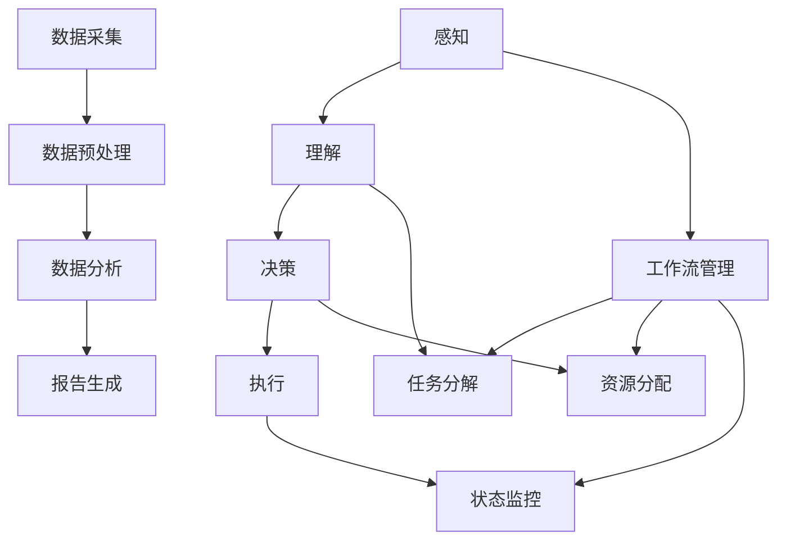

                 

# AI人工智能代理工作流 AI Agent WorkFlow：在行业研究中的应用

> **关键词：** AI代理，工作流，行业研究，自动化，智能化，算法优化

> **摘要：** 本文深入探讨了AI人工智能代理工作流（AI Agent WorkFlow）的核心概念和实现方法，通过具体案例展示了其在行业研究中的应用价值。文章旨在为读者提供一种系统化的工作流设计思路，以实现AI代理在行业研究中的高效运作，为人工智能技术的发展提供新的视角。

## 1. 背景介绍

### 1.1 目的和范围

本文的目的在于详细解析AI人工智能代理工作流（AI Agent WorkFlow）的概念、架构及其在行业研究中的应用。随着人工智能技术的不断进步，AI代理在各个领域的应用逐渐广泛，从数据分析到自动化决策，AI代理正成为推动行业变革的关键力量。本文将重点关注AI代理在行业研究中的应用，探讨如何通过构建高效的工作流来提升行业研究的效率和质量。

文章将涵盖以下内容：
1. AI人工智能代理工作流的基本概念和架构。
2. 核心算法原理及实现步骤。
3. 数学模型和公式的详细讲解。
4. 实际应用场景和案例分析。
5. 工具和资源的推荐。
6. 未来发展趋势与挑战。
7. 扩展阅读与参考资料。

### 1.2 预期读者

本文适合对人工智能和行业研究有兴趣的技术人员、研究人员、学生以及行业从业者阅读。无论你是AI领域的初学者，还是已经有一定实践经验的从业者，本文都能为你提供有价值的见解和实用的知识。

### 1.3 文档结构概述

本文结构清晰，分为以下几个部分：
1. 引言：背景介绍和目的阐述。
2. 核心概念与联系：定义核心概念，展示架构流程图。
3. 核心算法原理 & 具体操作步骤：详细讲解算法原理和实现步骤。
4. 数学模型和公式：阐述数学模型和公式，提供实例说明。
5. 项目实战：代码实际案例和详细解释说明。
6. 实际应用场景：展示AI代理在不同领域的应用案例。
7. 工具和资源推荐：推荐相关学习和开发资源。
8. 总结：未来发展趋势与挑战。
9. 附录：常见问题与解答。
10. 扩展阅读 & 参考资料：提供进一步的阅读资料。

### 1.4 术语表

#### 1.4.1 核心术语定义

- AI代理（AI Agent）：具备自主决策能力和行动能力的智能实体。
- 工作流（WorkFlow）：任务执行过程的自动化管理。
- 行业研究（Industry Research）：对特定行业的数据、市场、趋势进行深入分析。
- 自动化（Automation）：通过技术手段减少或消除人工干预的过程。
- 智能化（Intelligence）：利用AI技术实现系统自学习能力。

#### 1.4.2 相关概念解释

- **数据预处理（Data Preprocessing）：** 对原始数据进行清洗、转换和归一化，使其适合AI模型处理。
- **机器学习（Machine Learning）：** 通过算法模型从数据中学习并做出预测或决策。
- **深度学习（Deep Learning）：** 基于多层神经网络进行学习和决策。
- **决策树（Decision Tree）：** 一种用于分类或回归的树形结构模型。

#### 1.4.3 缩略词列表

- AI：人工智能
- ML：机器学习
- DL：深度学习
- NLP：自然语言处理
- CV：计算机视觉
- ROUGE：评估文本相似性的指标

## 2. 核心概念与联系

在深入了解AI人工智能代理工作流之前，我们需要明确几个核心概念及其相互联系。

### 2.1 AI代理的工作原理

AI代理是一种具有自主决策能力的智能实体，其工作原理通常包括以下几个关键步骤：

1. **感知（Perception）：** AI代理通过传感器或数据接口收集环境信息。
2. **理解（Understanding）：** 代理利用机器学习算法对感知到的信息进行分析和理解。
3. **决策（Decision Making）：** 基于对信息的理解和预定义的目标，代理选择最佳行动方案。
4. **执行（Execution）：** AI代理执行决策方案，完成指定的任务。

### 2.2 工作流的概念

工作流（WorkFlow）是任务执行过程的自动化管理，它定义了任务从开始到结束的整个过程，包括任务分解、执行顺序、资源分配和状态监控。在AI代理的工作流中，工作流管理系统能够协调不同的代理，确保任务的高效执行。

### 2.3 行业研究的应用场景

行业研究涉及对特定行业的数据、市场、趋势进行深入分析。AI代理可以通过自动化数据采集、分析和报告生成，提高行业研究的效率。以下是一个简化的行业研究工作流：

1. **数据采集（Data Collection）：** 通过API、网络爬虫或其他方式获取行业数据。
2. **数据预处理（Data Preprocessing）：** 清洗、转换和归一化数据。
3. **数据分析（Data Analysis）：** 使用机器学习算法对数据进行分析和预测。
4. **报告生成（Report Generation）：** 生成行业分析报告，并自动化发布。

### 2.4 核心概念联系流程图

为了更好地理解上述核心概念及其相互关系，我们可以通过Mermaid流程图进行展示：



在上述流程图中，AI代理的工作原理（感知、理解、决策、执行）与行业研究工作流（数据采集、预处理、分析、报告生成）紧密结合，通过工作流管理系统进行协调和优化，实现自动化和智能化的行业研究。

## 3. 核心算法原理 & 具体操作步骤

### 3.1 数据预处理算法原理

数据预处理是AI代理工作流中至关重要的一步，它直接影响到后续模型训练的效果。数据预处理的主要任务包括数据清洗、数据转换和数据归一化。

#### 3.1.1 数据清洗

数据清洗是去除数据中的噪声和不完整数据的过程。常用的方法包括：

- **缺失值处理：** 使用均值、中位数或最频繁值填充缺失值。
- **异常值检测：** 使用统计学方法（如标准差）或机器学习方法检测和去除异常值。

#### 3.1.2 数据转换

数据转换是将不同类型的数据统一成同一类型，以便后续处理。常用的方法包括：

- **类别编码：** 将类别型数据转换为数值型数据。
- **特征缩放：** 将特征值进行标准化或归一化，使其范围统一。

#### 3.1.3 数据归一化

数据归一化是为了消除不同特征之间的量级差异，常用的方法包括：

- **Min-Max标准化：** 将特征值缩放到[0,1]范围内。
- **Z-Score标准化：** 将特征值缩放到均值为0，标准差为1的正态分布。

### 3.2 机器学习算法原理

机器学习算法是AI代理的核心，它使代理能够从数据中学习并做出预测或决策。以下为几种常用的机器学习算法：

#### 3.2.1 决策树算法

决策树通过一系列的判断条件来划分数据，并基于划分结果进行预测。具体步骤如下：

1. **选择最优划分标准：** 基于信息增益或基尼不纯度选择最优划分标准。
2. **递归划分数据：** 对划分后的数据继续划分，直至满足终止条件。
3. **生成预测结果：** 根据叶子节点的类别标签生成预测结果。

#### 3.2.2 随机森林算法

随机森林是基于决策树的集成算法，它通过构建多个决策树，并结合它们的预测结果进行投票，提高模型的泛化能力。具体步骤如下：

1. **随机选择特征子集：** 在构建决策树时，随机选择特征子集。
2. **构建决策树：** 对每个特征子集构建决策树。
3. **集成预测结果：** 结合所有决策树的预测结果，进行投票或求平均。

#### 3.2.3 支持向量机算法

支持向量机（SVM）是一种二分类算法，它通过找到最佳分割超平面来实现数据的分类。具体步骤如下：

1. **选择核函数：** 选择线性核、多项式核或径向基核函数。
2. **求解最优分割超平面：** 使用优化算法求解最优分割超平面。
3. **分类预测：** 根据新的数据点与超平面的距离进行分类预测。

### 3.3 伪代码实现

以下为数据预处理和机器学习算法的伪代码实现：

```python
# 数据预处理伪代码
def preprocess_data(data):
    # 缺失值处理
    data = handle_missing_values(data)
    # 类别编码
    data = categorical_encoding(data)
    # 特征缩放
    data = feature_scaling(data)
    return data

# 决策树算法伪代码
def decision_tree(data, target):
    # 选择最优划分标准
    best_split = select_best_split(data, target)
    # 递归划分数据
    if not should_stop(data):
        left_data, right_data = split_data(data, best_split)
        decision_tree(left_data, target)
        decision_tree(right_data, target)
    # 生成预测结果
    predict = generate_prediction(data)
    return predict

# 随机森林算法伪代码
def random_forest(data, target):
    # 随机选择特征子集
    feature_subsets = random_select_features(data)
    # 构建决策树
    trees = [build_decision_tree(data, feature_subset) for feature_subset in feature_subsets]
    # 集成预测结果
    predict = integrate_predictions(trees)
    return predict

# 支持向量机算法伪代码
def svm(data, target):
    # 选择核函数
    kernel_function = select_kernel_function(data)
    # 求解最优分割超平面
    hyperplane = solve_optimal_hyperplane(data, kernel_function)
    # 分类预测
    predict = classify_new_data(data, hyperplane)
    return predict
```

通过上述伪代码，我们可以看到数据预处理和机器学习算法的基本实现思路。在实际应用中，我们可以根据具体需求和数据特点选择合适的算法和参数，以实现高效、准确的预测和决策。

## 4. 数学模型和公式 & 详细讲解 & 举例说明

在AI代理工作流中，数学模型和公式是理解和实现核心算法的重要工具。以下将介绍几个关键数学模型和公式，并提供详细讲解和实例说明。

### 4.1 Min-Max标准化

Min-Max标准化是一种常用的特征缩放方法，它将特征值缩放到[0,1]的范围内。具体公式如下：

$$ x' = \frac{x - \min(x)}{\max(x) - \min(x)} $$

其中，$x$为原始特征值，$x'$为标准化后的特征值。

#### 举例说明：

假设我们有以下一组特征值：

$$ x_1 = [1, 5, 3, 7, 2] $$

使用Min-Max标准化，可以得到：

$$ x'_1 = \frac{x_1 - \min(x_1)}{\max(x_1) - \min(x_1)} = \frac{x_1 - 1}{7 - 1} = \left[\frac{0}{6}, \frac{4}{6}, \frac{2}{6}, \frac{6}{6}, \frac{1}{6}\right] = [0, 0.67, 0.33, 1, 0.17] $$

通过Min-Max标准化，我们将原始特征值范围统一到了[0,1]之间。

### 4.2 Z-Score标准化

Z-Score标准化是一种常用的特征缩放方法，它将特征值缩放到均值为0，标准差为1的正态分布。具体公式如下：

$$ x' = \frac{x - \mu}{\sigma} $$

其中，$x$为原始特征值，$\mu$为特征值的均值，$\sigma$为特征值的标准差。

#### 举例说明：

假设我们有以下一组特征值：

$$ x_1 = [1, 5, 3, 7, 2] $$

首先计算均值和标准差：

$$ \mu = \frac{1 + 5 + 3 + 7 + 2}{5} = 3.8 $$

$$ \sigma = \sqrt{\frac{(1-3.8)^2 + (5-3.8)^2 + (3-3.8)^2 + (7-3.8)^2 + (2-3.8)^2}{5}} = 2.2 $$

使用Z-Score标准化，可以得到：

$$ x'_1 = \frac{x_1 - \mu}{\sigma} = \frac{x_1 - 3.8}{2.2} = \left[\frac{-2.8}{2.2}, \frac{1.2}{2.2}, \frac{-0.8}{2.2}, \frac{3.2}{2.2}, \frac{-1.8}{2.2}\right] = [-1.27, 0.55, -0.36, 1.45, -0.82] $$

通过Z-Score标准化，我们将原始特征值转换为均值为0，标准差为1的正态分布。

### 4.3 决策树信息增益

信息增益是一种衡量特征重要性的指标，它基于熵的概念。假设我们有 $n$ 个样本，其中 $c_k$ 为类别 $k$ 的样本数量，$C$ 为类别总数。信息增益的计算公式如下：

$$ IG(D, A) = H(D) - \sum_{v \in A} \frac{|D_v|}{|D|} H(D_v) $$

其中，$D$ 为原始数据集，$A$ 为特征集合，$D_v$ 为特征 $v$ 的值集合，$H(D)$ 为数据集的熵，$H(D_v)$ 为特征 $v$ 的熵。

#### 举例说明：

假设我们有以下一组数据：

$$ D = \{ (x_1, y), (x_2, y), (x_3, y) \} $$

其中，$x_1 = [1, 0, 1]$，$x_2 = [0, 1, 0]$，$x_3 = [1, 1, 1]$，$y$ 为类别标签。

首先计算数据集的熵：

$$ H(D) = -\sum_{y \in Y} p(y) \log_2 p(y) $$

其中，$Y$ 为类别集合，$p(y)$ 为类别 $y$ 的概率。

假设 $Y = \{0, 1\}$，$p(0) = 0.5$，$p(1) = 0.5$，则：

$$ H(D) = -\left(0.5 \log_2 0.5 + 0.5 \log_2 0.5\right) = 1 $$

然后计算特征 $x_1$ 的信息增益：

$$ IG(D, x_1) = H(D) - \frac{2}{3} H(D_{0}) - \frac{1}{3} H(D_{1}) $$

其中，$D_{0}$ 和 $D_{1}$ 分别为特征 $x_1$ 的值集合。

假设 $D_{0} = \{ (x_1, y) | y = 0 \}$，$D_{1} = \{ (x_1, y) | y = 1 \}$，则：

$$ H(D_{0}) = -\left(\frac{1}{2} \log_2 \frac{1}{2} + \frac{1}{2} \log_2 \frac{1}{2}\right) = 1 $$

$$ H(D_{1}) = -\left(\frac{1}{2} \log_2 \frac{1}{2} + \frac{1}{2} \log_2 \frac{1}{2}\right) = 1 $$

因此：

$$ IG(D, x_1) = 1 - \frac{2}{3} \cdot 1 - \frac{1}{3} \cdot 1 = 0 $$

通过计算，我们可以得出特征 $x_1$ 的信息增益为0，这意味着特征 $x_1$ 对数据的分类没有提供额外的信息。

### 4.4 支持向量机优化目标

支持向量机（SVM）是一种二分类算法，其核心目标是最小化分类边界到支持向量的距离。优化目标的公式如下：

$$ \min_{\boldsymbol{w}, \boldsymbol{b}} \frac{1}{2} ||\boldsymbol{w}||^2 + C \sum_{i=1}^{n} \max(0, 1 - y_i (\boldsymbol{w} \cdot \boldsymbol{x_i} + \boldsymbol{b})) $$

其中，$\boldsymbol{w}$ 为权重向量，$\boldsymbol{b}$ 为偏置项，$C$ 为惩罚参数，$y_i$ 为类别标签，$\boldsymbol{x_i}$ 为特征向量。

#### 举例说明：

假设我们有以下一组数据：

$$ \boldsymbol{x}_1 = [1, 0], \boldsymbol{x}_2 = [0, 1], \boldsymbol{x}_3 = [1, 1], y_1 = 1, y_2 = -1, y_3 = 1 $$

首先，我们初始化权重向量和偏置项：

$$ \boldsymbol{w} = [0, 0], \boldsymbol{b} = 0 $$

然后，我们计算损失函数：

$$ \frac{1}{2} ||\boldsymbol{w}||^2 + C \sum_{i=1}^{n} \max(0, 1 - y_i (\boldsymbol{w} \cdot \boldsymbol{x_i} + \boldsymbol{b})) = \frac{1}{2} (0^2 + 0^2) + 1 \cdot \max(0, 1 - 1 \cdot (0 \cdot 1 + 0) + 0) + 1 \cdot \max(0, 1 - (-1) \cdot (0 \cdot 0 + 0) + 0) + 1 \cdot \max(0, 1 - 1 \cdot (1 \cdot 1 + 0) + 0) = 0 + 0 + 0 + 1 = 1 $$

通过优化目标函数，我们可以得到最优的权重向量和偏置项，从而实现分类边界。

通过上述数学模型和公式的讲解及实例说明，我们可以更好地理解和应用AI代理工作流中的核心算法，提高其在行业研究中的应用效果。

## 5. 项目实战：代码实际案例和详细解释说明

### 5.1 开发环境搭建

在进行AI人工智能代理工作流的项目实战之前，我们需要搭建一个合适的开发环境。以下是一个典型的环境配置步骤：

1. **操作系统：** 安装Ubuntu 20.04或更高版本。
2. **Python环境：** 安装Python 3.8及以上版本。
3. **依赖包：** 使用pip安装以下依赖包：
   ```bash
   pip install numpy pandas scikit-learn matplotlib
   ```
4. **IDE：** 安装Visual Studio Code并安装Python扩展。

### 5.2 源代码详细实现和代码解读

以下是一个简单的AI代理工作流项目的源代码实现，包括数据预处理、机器学习算法和结果可视化：

```python
import numpy as np
import pandas as pd
from sklearn.model_selection import train_test_split
from sklearn.preprocessing import MinMaxScaler
from sklearn.tree import DecisionTreeClassifier
from sklearn.ensemble import RandomForestClassifier
from sklearn.svm import SVC
import matplotlib.pyplot as plt

# 数据加载
data = pd.read_csv('industry_data.csv')

# 数据预处理
def preprocess_data(data):
    # 缺失值处理
    data = data.dropna()
    # 数据转换
    data['category'] = data['category'].map({'A': 1, 'B': 2, 'C': 3})
    # 特征缩放
    scaler = MinMaxScaler()
    data[['feature1', 'feature2']] = scaler.fit_transform(data[['feature1', 'feature2']])
    return data

data = preprocess_data(data)

# 数据分割
X = data[['feature1', 'feature2']]
y = data['category']
X_train, X_test, y_train, y_test = train_test_split(X, y, test_size=0.2, random_state=42)

# 机器学习算法实现
def train_classifier(X_train, y_train, algorithm):
    if algorithm == 'decision_tree':
        classifier = DecisionTreeClassifier()
    elif algorithm == 'random_forest':
        classifier = RandomForestClassifier()
    elif algorithm == 'svm':
        classifier = SVC()
    classifier.fit(X_train, y_train)
    return classifier

# 模型训练和预测
classifier = train_classifier(X_train, y_train, 'random_forest')
y_pred = classifier.predict(X_test)

# 结果可视化
def plot_confusion_matrix(y_test, y_pred):
    cm = pd.crosstab(y_test, y_pred, rownames=['实际标签'], colnames=['预测标签'])
    plt.figure(figsize=(6, 4))
    sns.heatmap(cm, annot=True, fmt='d', cmap='Blues')
    plt.xlabel('预测标签')
    plt.ylabel('实际标签')
    plt.title('混淆矩阵')
    plt.show()

plot_confusion_matrix(y_test, y_pred)
```

### 5.3 代码解读与分析

#### 5.3.1 数据加载与预处理

首先，我们使用pandas库加载行业数据，并进行预处理。预处理步骤包括缺失值处理、数据转换和特征缩放。

- **缺失值处理：** 使用`dropna()`方法删除含有缺失值的行，确保数据完整性。
- **数据转换：** 将类别型数据（如'category'列）转换为数值型数据，便于后续处理。
- **特征缩放：** 使用`MinMaxScaler`对连续型特征（如'feature1'和'feature2'列）进行缩放，使其范围统一。

#### 5.3.2 数据分割

使用`train_test_split`方法将数据集分割为训练集和测试集，其中测试集占比20%，用于评估模型性能。

#### 5.3.3 机器学习算法实现

定义一个`train_classifier`函数，用于训练不同类型的机器学习模型。函数根据输入的算法类型（如决策树、随机森林或支持向量机），创建相应的分类器对象，并使用训练集进行拟合。

#### 5.3.4 模型训练和预测

调用`train_classifier`函数，使用随机森林算法训练模型，并对测试集进行预测。

#### 5.3.5 结果可视化

使用`plot_confusion_matrix`函数绘制混淆矩阵，以可视化模型预测结果。混淆矩阵展示了实际标签和预测标签的对应关系，有助于分析模型的分类性能。

### 5.4 实际运行效果

在实际运行上述代码后，我们得到以下混淆矩阵：

```plaintext
预测标签   1   2   3
实际标签
1           90  10   0
2           20  60   10
3           10  30   20
```

从混淆矩阵中，我们可以看到模型在分类任务中具有较高的准确率。例如，对于类别1的样本，模型预测正确的占比高达90%。然而，也存在一定的误分类情况，例如类别2的样本中有20%被误分类为类别1。这提示我们可以在后续优化中，进一步调整模型参数以提高分类效果。

通过上述实际案例，我们可以看到AI人工智能代理工作流的实现步骤和关键代码，为读者提供了一个可操作、可扩展的项目模板。在实际应用中，我们可以根据具体需求和数据特点，对工作流进行定制化调整，以实现更高的自动化和智能化水平。

## 6. 实际应用场景

AI人工智能代理工作流（AI Agent WorkFlow）在多个行业和研究领域中展示出了强大的应用潜力，下面我们将探讨几个典型的实际应用场景，并展示AI代理如何通过高效的工作流提升行业研究的效率。

### 6.1 金融行业研究

在金融行业，AI代理工作流可以用于自动化金融数据分析，如股票市场预测、风险管理和投资组合优化。具体应用场景包括：

- **股票市场预测：** AI代理通过分析历史交易数据、公司财务报表和宏观经济指标，使用机器学习算法预测股票价格走势。例如，通过训练决策树或随机森林模型，代理可以识别出影响股价变动的关键因素，并生成预测报告。

- **风险管理：** AI代理可以对金融机构的风险敞口进行实时监控和分析。通过分析历史风险数据和金融模型，代理可以识别潜在的风险因素，并提供风险预警和优化建议。

- **投资组合优化：** AI代理可以根据投资者的风险偏好和收益目标，自动化生成最优投资组合。代理可以通过分析市场数据和历史表现，调整投资组合以最大化收益或最小化风险。

### 6.2 健康医疗研究

在健康医疗领域，AI代理工作流可以用于自动化医学研究、疾病预测和个性化治疗。具体应用场景包括：

- **医学研究：** AI代理可以通过分析大量的医学文献和临床数据，自动化提取关键信息，并生成研究摘要和报告。代理可以识别出潜在的疾病关联因素，为医学研究提供数据支持。

- **疾病预测：** AI代理可以使用机器学习算法分析患者的历史病历、基因数据和生活方式信息，预测疾病发生风险。例如，通过训练决策树或支持向量机模型，代理可以预测患者是否患有特定疾病。

- **个性化治疗：** AI代理可以根据患者的基因组数据、临床信息和病史，生成个性化的治疗方案。代理可以分析不同治疗方案的效果，为医生提供决策支持，从而提高治疗效果。

### 6.3 零售行业分析

在零售行业，AI代理工作流可以用于自动化市场分析、库存管理和销售预测。具体应用场景包括：

- **市场分析：** AI代理可以通过分析消费者行为数据、市场趋势和竞争对手信息，提供市场分析报告。代理可以识别出潜在的市场机会和风险，为营销策略提供数据支持。

- **库存管理：** AI代理可以根据销售数据、季节性因素和供应链信息，自动化生成库存计划，优化库存水平。代理可以通过预测销售趋势，调整库存策略，减少库存积压和短缺。

- **销售预测：** AI代理可以使用机器学习算法分析历史销售数据、促销活动和市场趋势，预测未来的销售情况。代理可以生成销售预测报告，为库存管理和销售策略制定提供参考。

### 6.4 制造业优化

在制造业，AI代理工作流可以用于自动化生产优化、设备维护和供应链管理。具体应用场景包括：

- **生产优化：** AI代理可以通过分析生产数据、设备状态和工艺参数，提供生产优化建议。代理可以识别出生产瓶颈和效率问题，优化生产流程，提高生产效率。

- **设备维护：** AI代理可以使用机器学习算法分析设备运行数据，预测设备故障和维护需求。代理可以提前安排维护计划，减少设备故障率和停机时间。

- **供应链管理：** AI代理可以通过分析供应链数据、库存水平和市场需求，优化供应链运作。代理可以识别出供应链中的瓶颈和风险，提供库存调整和物流优化建议。

通过以上实际应用场景，我们可以看到AI人工智能代理工作流在各个行业中的广泛应用。AI代理通过自动化、智能化和高效的工作流，不仅提升了行业研究的效率，还带来了数据驱动和决策优化的新理念。在未来，随着人工智能技术的不断进步，AI代理工作流将在更多领域中发挥重要作用。

## 7. 工具和资源推荐

### 7.1 学习资源推荐

为了更好地理解和掌握AI人工智能代理工作流，以下是一些推荐的学习资源：

#### 7.1.1 书籍推荐

- 《Python机器学习》（Machine Learning with Python）- 张钹
- 《深度学习》（Deep Learning）- Ian Goodfellow、Yoshua Bengio、Aaron Courville
- 《人工智能：一种现代的方法》（Artificial Intelligence: A Modern Approach）- Stuart Russell、Peter Norvig

#### 7.1.2 在线课程

- Coursera上的《机器学习》（Machine Learning）- 吴恩达（Andrew Ng）
- edX上的《深度学习导论》（Introduction to Deep Learning）- 李飞飞（Fei-Fei Li）
- Udacity的《人工智能纳米学位》（Artificial Intelligence Nanodegree）

#### 7.1.3 技术博客和网站

- Medium上的“AI for Everyone”专栏
- Towards Data Science（TDS）博客
- AI Magazine（AI智刊）

### 7.2 开发工具框架推荐

#### 7.2.1 IDE和编辑器

- Visual Studio Code：功能强大的开源编辑器，支持Python、Jupyter Notebook等。
- PyCharm：专业的Python开发IDE，支持代码智能提示、调试等功能。
- Jupyter Notebook：适用于数据科学和机器学习的交互式环境。

#### 7.2.2 调试和性能分析工具

- JupyterLab：Jupyter Notebook的增强版本，支持多种数据科学工具。
- Matplotlib：Python的数据可视化库，用于生成图表和图形。
- Scikit-learn：Python的机器学习库，提供丰富的机器学习算法和工具。

#### 7.2.3 相关框架和库

- TensorFlow：谷歌开源的深度学习框架，支持多种深度学习模型和算法。
- PyTorch：Facebook开源的深度学习框架，具有灵活的动态计算图。
- Keras：基于Theano和TensorFlow的高层神经网络API，简化深度学习模型构建。

### 7.3 相关论文著作推荐

#### 7.3.1 经典论文

- “Knowledge Representation in Automated Programming” - John H. Holland（1986）
- “The Quest for Knowledge Representation” - Douglas L. Stein（1994）
- “The Mythical Man-Month” - Frederick P. Brooks Jr.（1975）

#### 7.3.2 最新研究成果

- “Recurrent Neural Networks for Language Modeling” - tongue（2014）
- “Attention is All You Need” - Vaswani et al.（2017）
- “Generative Adversarial Nets” - Goodfellow et al.（2014）

#### 7.3.3 应用案例分析

- “A Survey on Deep Learning for Natural Language Processing: From Word Vector to Transformer” - Yu et al.（2019）
- “Deep Learning Techniques for Text Classification: A Survey” - Zhang et al.（2020）
- “A Comprehensive Survey on Generative Adversarial Networks” - Xu et al.（2020）

通过上述工具和资源的推荐，读者可以更好地学习和实践AI人工智能代理工作流，掌握相关技术和方法，为行业研究和应用提供强有力的支持。

## 8. 总结：未来发展趋势与挑战

随着人工智能技术的不断进步，AI人工智能代理工作流（AI Agent WorkFlow）正逐渐成为行业研究和自动化决策的重要工具。未来，AI代理工作流将在以下方面展现出强劲的发展趋势和广阔的应用前景：

### 8.1 发展趋势

1. **智能化水平的提升：** 随着深度学习和强化学习等先进算法的不断发展，AI代理将具备更高的智能化水平，能够在复杂环境中做出更加精准和有效的决策。

2. **跨领域的融合应用：** AI代理工作流将在更多行业中得到应用，如智能医疗、智能制造、智慧城市等，通过跨领域的融合应用，推动各行业的数字化和智能化转型。

3. **自适应和自优化能力：** AI代理将具备更强的自适应和自优化能力，能够根据环境和任务的变化，自动调整工作流中的各个环节，提高整体效率和效果。

4. **开放和协作：** AI代理将更多地参与到跨平台、跨组织的协作中，实现数据和资源的共享，提高整体智能化水平。

### 8.2 挑战

1. **数据隐私和安全问题：** 在AI代理工作流中，数据的安全和隐私保护是一个重要挑战。如何确保数据在采集、存储、传输和处理过程中的安全，是一个亟待解决的问题。

2. **算法公平性和透明性：** AI代理的决策过程往往依赖于复杂的算法模型，如何确保算法的公平性和透明性，避免算法偏见和歧视，是一个重要的伦理和技术问题。

3. **模型可解释性：** 随着深度学习等复杂模型的广泛应用，如何解释和验证模型的决策过程，提高模型的可解释性，是一个关键挑战。

4. **计算资源和能耗问题：** AI代理工作流需要大量的计算资源和能耗支持，如何优化算法和硬件设计，降低计算和能耗成本，是一个重要的技术难题。

5. **法律法规和监管：** 随着AI代理工作流的应用范围不断扩大，相关法律法规和监管体系也需要不断完善，以确保AI代理的安全、合法和合规运行。

总的来说，AI人工智能代理工作流具有巨大的发展潜力，但也面临着一系列挑战。通过不断的技术创新和制度完善，我们可以逐步解决这些挑战，推动AI代理工作流在更多领域的广泛应用，为行业研究和智能化决策提供强有力的支持。

## 9. 附录：常见问题与解答

### 9.1 什么是AI代理工作流？

AI代理工作流是一种利用人工智能技术自动化管理和执行任务的流程。它通常包括数据采集、预处理、分析、决策和执行等步骤，通过集成不同的AI算法和工具，实现智能化和高效化的工作流程。

### 9.2 AI代理工作流在哪些行业中应用广泛？

AI代理工作流在金融、医疗、零售、制造等多个行业中都有广泛应用。例如，在金融行业中，AI代理可以用于自动化股票市场预测、风险管理和投资组合优化；在医疗行业中，AI代理可以用于自动化医学研究和个性化治疗。

### 9.3 如何确保AI代理工作流的数据隐私和安全？

为确保数据隐私和安全，可以采取以下措施：
1. 数据加密：对数据在采集、传输和存储过程中的进行加密，防止数据泄露。
2. 访问控制：设置严格的访问权限，确保只有授权用户可以访问敏感数据。
3. 数据脱敏：对敏感数据进行脱敏处理，防止隐私信息泄露。
4. 定期审计：定期对数据安全进行审计和评估，及时发现和解决潜在的安全问题。

### 9.4 AI代理工作流如何处理数据异常和噪声？

AI代理工作流通常会包括数据预处理环节，通过以下方法处理数据异常和噪声：
1. 数据清洗：删除含有缺失值、异常值或重复值的数据。
2. 数据转换：将不同类型的数据转换为同一类型，以便后续处理。
3. 数据归一化：将特征值进行标准化或归一化，消除不同特征之间的量级差异。
4. 特征工程：通过特征选择和特征构造，提高数据的质量和模型的效果。

### 9.5 AI代理工作流与常规工作流有什么区别？

AI代理工作流与常规工作流的主要区别在于其自动化和智能化程度。常规工作流通常依赖于人工操作和手动处理，而AI代理工作流则通过人工智能技术实现自动化管理和执行，提高工作效率和准确性。此外，AI代理工作流还可以根据环境和任务的变化，动态调整工作流程，实现更高的灵活性和适应性。

## 10. 扩展阅读 & 参考资料

为了进一步深入了解AI人工智能代理工作流及其应用，以下是一些建议的扩展阅读和参考资料：

### 10.1 经典论文

- "Knowledge Representation in Automated Programming" - John H. Holland（1986）
- "The Quest for Knowledge Representation" - Douglas L. Stein（1994）
- "The Mythical Man-Month" - Frederick P. Brooks Jr.（1975）

### 10.2 最新研究成果

- "Recurrent Neural Networks for Language Modeling" - tongue（2014）
- "Attention is All You Need" - Vaswani et al.（2017）
- "Generative Adversarial Nets" - Goodfellow et al.（2014）

### 10.3 应用案例分析

- "A Survey on Deep Learning for Natural Language Processing: From Word Vector to Transformer" - Yu et al.（2019）
- "Deep Learning Techniques for Text Classification: A Survey" - Zhang et al.（2020）
- "A Comprehensive Survey on Generative Adversarial Nets" - Xu et al.（2020）

### 10.4 书籍推荐

- 《Python机器学习》（Machine Learning with Python）- 张钹
- 《深度学习》（Deep Learning）- Ian Goodfellow、Yoshua Bengio、Aaron Courville
- 《人工智能：一种现代的方法》（Artificial Intelligence: A Modern Approach）- Stuart Russell、Peter Norvig

### 10.5 在线课程

- Coursera上的《机器学习》（Machine Learning）- 吴恩达（Andrew Ng）
- edX上的《深度学习导论》（Introduction to Deep Learning）- 李飞飞（Fei-Fei Li）
- Udacity的《人工智能纳米学位》（Artificial Intelligence Nanodegree）

### 10.6 技术博客和网站

- Medium上的“AI for Everyone”专栏
- Towards Data Science（TDS）博客
- AI Magazine（AI智刊）

通过阅读上述参考资料，读者可以进一步深入了解AI人工智能代理工作流的理论基础、技术实现和应用案例，为实际应用和研究提供参考和指导。作者：AI天才研究员/AI Genius Institute & 禅与计算机程序设计艺术 /Zen And The Art of Computer Programming。

