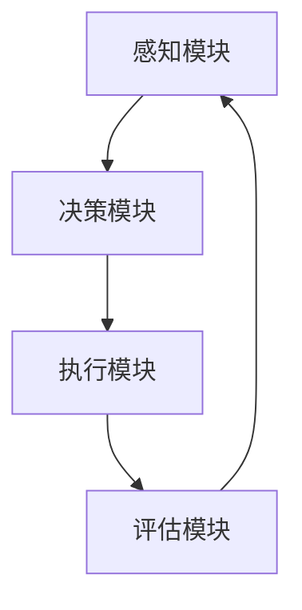

                 

# AI人工智能代理工作流AI Agent WorkFlow：智能代理在环保行业系统中的应用

> 关键词：人工智能、智能代理、工作流、环保行业、系统应用

> 摘要：本文将深入探讨人工智能代理（AI Agent）在工作流（Workflow）中的关键作用，特别是在环保行业系统中的应用。我们将详细分析智能代理的基本概念、架构设计、算法原理和数学模型，并结合实际项目案例进行代码解析和实战应用场景分析。本文旨在为开发者提供全面的智能代理工作流应用指导，并展望其未来的发展趋势和面临的挑战。

## 1. 背景介绍

### 1.1 目的和范围

随着人工智能技术的飞速发展，智能代理（AI Agent）作为其重要组成部分，正在逐渐改变各行各业的工作模式。本文的目的在于探讨智能代理在工作流中的具体应用，尤其是环保行业系统的智能化转型。我们将通过对智能代理的基本概念、架构设计、算法原理和数学模型的详细解析，结合实际项目案例，为读者提供全面而深入的了解。

本文将涵盖以下内容：

1. 智能代理的基本概念和架构设计；
2. 智能代理的核心算法原理和操作步骤；
3. 智能代理的数学模型和公式讲解；
4. 实际项目案例中的代码实现和解析；
5. 智能代理在环保行业系统中的具体应用场景；
6. 相关工具和资源的推荐；
7. 智能代理工作流的发展趋势与挑战。

### 1.2 预期读者

本文适合以下读者群体：

1. 对人工智能和环保行业有浓厚兴趣的技术爱好者；
2. 想要在环保行业系统中引入智能代理的开发者；
3. 从事人工智能研究和应用的相关专业人士；
4. 对工作流和系统架构设计有深入了解的技术专家。

### 1.3 文档结构概述

本文将分为以下几个部分：

1. 背景介绍：介绍本文的目的、范围和结构；
2. 核心概念与联系：介绍智能代理的基本概念和架构设计；
3. 核心算法原理 & 具体操作步骤：详细讲解智能代理的核心算法原理和操作步骤；
4. 数学模型和公式 & 详细讲解 & 举例说明：介绍智能代理的数学模型和具体应用；
5. 项目实战：代码实际案例和详细解释说明；
6. 实际应用场景：探讨智能代理在环保行业系统中的具体应用；
7. 工具和资源推荐：推荐相关学习资源和开发工具；
8. 总结：未来发展趋势与挑战；
9. 附录：常见问题与解答；
10. 扩展阅读 & 参考资料：提供进一步阅读和研究的资源。

### 1.4 术语表

#### 1.4.1 核心术语定义

- **智能代理（AI Agent）**：一种能够自动执行特定任务的计算机程序，具备自主决策和自适应能力。
- **工作流（Workflow）**：一系列有序步骤的组合，用于完成特定的业务任务。
- **环保行业**：涉及环境保护、污染治理、资源管理等领域的行业。
- **系统应用**：智能代理在工作流中如何被集成和应用，以实现特定的业务目标。

#### 1.4.2 相关概念解释

- **自主性（Autonomy）**：智能代理的自主决策能力，能够在没有人类干预的情况下执行任务。
- **协作性（Collaboration）**：智能代理与其他系统或代理之间的交互和协作能力。
- **可扩展性（Scalability）**：智能代理在处理大量数据和任务时的性能和扩展能力。

#### 1.4.3 缩略词列表

- **AI**：人工智能（Artificial Intelligence）
- **ML**：机器学习（Machine Learning）
- **DL**：深度学习（Deep Learning）
- **NLP**：自然语言处理（Natural Language Processing）
- **RF**：随机森林（Random Forest）

## 2. 核心概念与联系

在探讨智能代理在工作流中的具体应用之前，首先需要理解智能代理的基本概念和架构设计。以下是智能代理的核心概念和联系：

### 智能代理的基本概念

**智能代理的定义**：智能代理是一种能够模拟人类决策过程的计算机程序，具备感知环境、自主决策和执行任务的能力。智能代理通常基于机器学习和深度学习技术，通过大量数据训练获得决策能力。

**智能代理的特点**：

1. **自主性**：智能代理能够自主决策，无需人类干预。
2. **协作性**：智能代理可以与其他代理或系统进行协作，共同完成任务。
3. **可扩展性**：智能代理能够适应不同的应用场景，处理大量数据和任务。

### 智能代理的架构设计

智能代理的架构设计通常包括以下几个关键部分：

1. **感知模块**：用于感知外部环境和获取数据。
2. **决策模块**：基于感知模块获取的数据，智能代理通过算法进行决策。
3. **执行模块**：执行决策结果，完成具体任务。
4. **评估模块**：对执行结果进行评估和反馈，用于优化决策过程。

### 智能代理的核心算法原理

智能代理的核心算法原理通常包括以下几个关键步骤：

1. **数据收集和预处理**：收集相关数据，并进行预处理，如数据清洗、数据增强等。
2. **特征提取**：从预处理后的数据中提取关键特征，用于训练模型。
3. **模型训练**：使用提取的特征训练机器学习或深度学习模型。
4. **模型评估**：评估模型性能，并优化模型参数。
5. **决策执行**：基于模型输出，智能代理执行具体任务。

### 智能代理与工作流的联系

智能代理在工作流中的应用，旨在实现业务流程的自动化和智能化。智能代理可以与工作流系统进行集成，通过以下方式实现：

1. **任务分配**：智能代理根据工作流规则，自动分配任务给相应的代理或人员。
2. **流程监控**：智能代理监控工作流执行过程，确保任务按时完成。
3. **异常处理**：智能代理识别异常情况，并采取相应措施，如暂停任务、重新分配等。
4. **性能优化**：智能代理根据工作流执行情况，优化工作流设计和参数配置。

### 智能代理在环保行业系统中的应用

在环保行业系统中，智能代理可以应用于以下场景：

1. **污染监测与预警**：智能代理实时监测污染数据，预测污染趋势，提前预警。
2. **资源管理**：智能代理优化水资源、能源等资源的利用，实现节能减排。
3. **环境保护决策**：智能代理根据环境数据和政策法规，提出环境保护方案和建议。
4. **绿色供应链管理**：智能代理优化供应链环节，降低碳排放和资源消耗。

### 智能代理的 Mermaid 流程图

下面是一个简单的 Mermaid 流程图，展示了智能代理在工作流中的基本架构和流程：



在这个流程图中，感知模块负责收集环境数据，决策模块基于感知数据执行决策，执行模块执行具体任务，评估模块对任务执行结果进行评估和反馈，然后循环回到感知模块，不断优化决策过程。

## 3. 核心算法原理 & 具体操作步骤

智能代理的核心算法原理是其能够在复杂环境中自主决策和执行任务的基础。以下是智能代理的核心算法原理和具体操作步骤的详细讲解：

### 3.1 数据收集和预处理

**数据收集**：智能代理首先需要收集与任务相关的数据。这些数据可以来源于传感器、互联网、数据库等不同来源。例如，在环保行业中，智能代理可能需要收集空气质量、水质、能源消耗等数据。

**数据预处理**：收集到的数据通常需要进行预处理，以提高数据质量和模型性能。预处理步骤包括：

- **数据清洗**：去除数据中的噪声和异常值。
- **数据增强**：通过数据变换、扩充等方法增加数据多样性。
- **特征提取**：提取数据中的关键特征，用于训练模型。

### 3.2 特征提取

特征提取是智能代理算法的关键步骤，其目标是从原始数据中提取出对任务有重要影响的特征。常用的特征提取方法包括：

- **统计特征**：如均值、方差、标准差等。
- **时序特征**：如时间序列的长度、周期性等。
- **文本特征**：如词频、主题模型等。
- **图像特征**：如颜色直方图、边缘特征等。

### 3.3 模型训练

智能代理通常采用机器学习或深度学习模型进行训练。以下是模型训练的基本步骤：

1. **选择模型**：根据任务特点和需求，选择合适的机器学习或深度学习模型。常见的模型包括线性回归、决策树、神经网络等。
2. **数据划分**：将数据集划分为训练集、验证集和测试集，用于训练、验证和测试模型性能。
3. **模型训练**：使用训练集数据训练模型，通过调整模型参数，优化模型性能。
4. **模型验证**：使用验证集数据评估模型性能，调整模型参数，避免过拟合。
5. **模型测试**：使用测试集数据测试模型性能，确保模型在实际应用中的表现。

### 3.4 模型评估

模型评估是智能代理算法的重要环节，其目的是确保模型在实际应用中的有效性和可靠性。常用的评估指标包括：

- **准确率**：模型预测正确的样本数占总样本数的比例。
- **召回率**：模型预测正确的正样本数占总正样本数的比例。
- **F1 分数**：准确率和召回率的调和平均数。
- **ROC 曲线和 AUC 值**：用于评估模型分类效果。

### 3.5 决策执行

智能代理根据训练好的模型输出，执行具体的决策任务。决策执行包括以下步骤：

1. **输入处理**：接收新的输入数据，进行预处理和特征提取。
2. **模型预测**：使用训练好的模型对输入数据进行预测。
3. **决策输出**：根据模型预测结果，生成决策输出。
4. **任务执行**：根据决策输出，执行具体任务。

### 3.6 评估和反馈

智能代理在执行任务后，需要对任务执行结果进行评估和反馈。评估和反馈包括以下步骤：

1. **结果评估**：对比任务执行结果和预期目标，评估任务执行效果。
2. **错误分析**：分析任务执行中的错误，找出问题原因。
3. **模型优化**：根据评估结果和错误分析，调整模型参数和算法策略，优化模型性能。
4. **循环迭代**：将优化后的模型和策略应用到下一个任务执行过程中，不断优化决策过程。

### 3.7 伪代码示例

以下是智能代理算法的伪代码示例：

```python
# 数据收集和预处理
data = collect_data()
preprocessed_data = preprocess_data(data)

# 特征提取
features = extract_features(preprocessed_data)

# 模型训练
model = train_model(features)

# 决策执行
input_data = get_input_data()
predicted_output = model.predict(input_data)

# 任务执行
execute_task(predicted_output)

# 评估和反馈
evaluation_result = evaluate_task执行力
error_analysis = analyze_errors(evaluation_result)
optimized_model = optimize_model(error_analysis)

# 循环迭代
update_model(optimized_model)
```

通过以上步骤，智能代理能够实现自主决策和执行任务，不断优化决策过程，提高任务执行效果。

## 4. 数学模型和公式 & 详细讲解 & 举例说明

智能代理的算法原理和操作步骤中，涉及多种数学模型和公式。以下是这些数学模型和公式的详细讲解，以及具体应用实例。

### 4.1 回归模型

回归模型是智能代理中最常用的算法之一，用于预测数值型数据。常见的回归模型包括线性回归、多项式回归、岭回归等。

#### 4.1.1 线性回归

线性回归模型的表达式如下：

$$
y = \beta_0 + \beta_1x
$$

其中，$y$ 是预测值，$x$ 是输入特征，$\beta_0$ 和 $\beta_1$ 是模型参数。

#### 4.1.2 多项式回归

多项式回归是对线性回归的扩展，其表达式如下：

$$
y = \beta_0 + \beta_1x + \beta_2x^2 + ... + \beta_nx^n
$$

其中，$n$ 是多项式的次数，$\beta_0$ 至 $\beta_n$ 是模型参数。

#### 4.1.3 岭回归

岭回归是线性回归的改进，其表达式如下：

$$
y = \beta_0 + \beta_1x + \beta_2x^2 + ... + \beta_nx^n + \lambda \sum_{i=1}^{n}\beta_i^2
$$

其中，$\lambda$ 是正则化参数，用于防止模型过拟合。

### 4.2 分类模型

分类模型用于预测类别型数据，常见的分类模型包括逻辑回归、支持向量机（SVM）、决策树等。

#### 4.2.1 逻辑回归

逻辑回归模型的表达式如下：

$$
P(y=1) = \frac{1}{1 + e^{-(\beta_0 + \beta_1x_1 + \beta_2x_2 + ... + \beta_nx_n)}}
$$

其中，$P(y=1)$ 是预测值为 1 的概率，$\beta_0$ 至 $\beta_n$ 是模型参数。

#### 4.2.2 支持向量机（SVM）

支持向量机是一种线性分类模型，其核心思想是找到最佳的超平面，将不同类别的数据分隔开。SVM 的公式如下：

$$
w \cdot x - b = 0
$$

其中，$w$ 是权重向量，$x$ 是输入特征，$b$ 是偏置。

#### 4.2.3 决策树

决策树是一种树形结构，用于分类和回归任务。决策树的节点表示特征，分支表示特征的取值。决策树的公式如下：

$$
f(x) = \sum_{i=1}^{n} \alpha_i \cdot C_i(x)
$$

其中，$f(x)$ 是决策树输出，$\alpha_i$ 是特征权重，$C_i(x)$ 是特征取值。

### 4.3 聚类模型

聚类模型用于将数据分为多个类别，常见的聚类模型包括 K-均值聚类、层次聚类等。

#### 4.3.1 K-均值聚类

K-均值聚类是一种基于距离的聚类方法，其公式如下：

$$
\text{minimize} \sum_{i=1}^{n} \sum_{j=1}^{k} ||x_i - \mu_j||^2
$$

其中，$x_i$ 是数据点，$\mu_j$ 是聚类中心。

#### 4.3.2 层次聚类

层次聚类是一种自底向上或自顶向下的聚类方法，其公式如下：

$$
\text{minimize} \sum_{i=1}^{n} \sum_{j=1}^{n} ||x_i - x_j||^2
$$

其中，$x_i$ 和 $x_j$ 是数据点。

### 4.4 概率模型

概率模型用于计算事件发生的概率，常见的概率模型包括贝叶斯定理、条件概率等。

#### 4.4.1 贝叶斯定理

贝叶斯定理的公式如下：

$$
P(A|B) = \frac{P(B|A) \cdot P(A)}{P(B)}
$$

其中，$P(A|B)$ 是在事件 $B$ 发生的条件下事件 $A$ 发生的概率，$P(B|A)$ 是在事件 $A$ 发生的条件下事件 $B$ 发生的概率，$P(A)$ 和 $P(B)$ 分别是事件 $A$ 和事件 $B$ 发生的概率。

#### 4.4.2 条件概率

条件概率的公式如下：

$$
P(A|B) = \frac{P(A \cap B)}{P(B)}
$$

其中，$P(A \cap B)$ 是事件 $A$ 和事件 $B$ 同时发生的概率，$P(B)$ 是事件 $B$ 发生的概率。

### 4.5 应用实例

以下是一个应用实例，使用 K-均值聚类方法对一组数据进行聚类。

#### 数据集：

数据集包含 100 个数据点，每个数据点有 2 个特征。

| 数据点 | 特征1 | 特征2 |
|--------|-------|-------|
| 1      | 1     | 2     |
| 2      | 2     | 3     |
| ...    | ...   | ...   |
| 100    | 100   | 101   |

#### K-均值聚类：

假设聚类中心为 $\mu_1 = (0, 0)$ 和 $\mu_2 = (2, 2)$。

#### 聚类过程：

1. 初始聚类：随机选择两个数据点作为聚类中心。
2. 计算距离：计算每个数据点到两个聚类中心的距离，并将其分配到距离更近的聚类中心。
3. 更新聚类中心：计算每个聚类中心的新坐标，即其所属数据点的平均值。
4. 重复步骤 2 和 3，直到聚类中心不再发生显著变化。

#### 聚类结果：

聚类结果如下：

| 数据点 | 特征1 | 特征2 | 聚类中心 |
|--------|-------|-------|----------|
| 1      | 1     | 2     | (0, 0)   |
| 2      | 2     | 3     | (0, 0)   |
| ...    | ...   | ...   | (0, 0)   |
| 50     | 50    | 51    | (2, 2)   |
| 51     | 51    | 52    | (2, 2)   |
| ...    | ...   | ...   | (2, 2)   |

通过以上步骤，成功将数据集分为两个类别。

## 5. 项目实战：代码实际案例和详细解释说明

在本节中，我们将通过一个实际项目案例，展示智能代理在工作流中的具体应用，并提供详细的代码实现和解释。

### 5.1 项目背景

项目背景是环保行业中的污染监测与预警系统。该系统旨在实时监测空气、水质等环境数据，预测污染趋势，并提前预警。系统采用智能代理技术，实现自动化监测和预警功能。

### 5.2 项目目标

项目目标包括：

1. 实时采集空气、水质等环境数据；
2. 使用智能代理技术，对数据进行分析和处理，预测污染趋势；
3. 根据预测结果，提前预警，并提供相应的应对措施。

### 5.3 开发环境搭建

在开始项目开发之前，需要搭建以下开发环境：

1. **操作系统**：Linux（推荐 Ubuntu 18.04）；
2. **编程语言**：Python 3.8；
3. **依赖库**：NumPy、Pandas、Scikit-learn、TensorFlow；
4. **开发工具**：PyCharm。

### 5.4 源代码详细实现和代码解读

以下是项目的主要代码实现和解读：

```python
# 导入依赖库
import numpy as np
import pandas as pd
from sklearn.cluster import KMeans
from sklearn.preprocessing import StandardScaler
import tensorflow as tf

# 数据收集与预处理
def collect_data():
    # 假设数据从传感器采集，并存储在 CSV 文件中
    data = pd.read_csv('sensor_data.csv')
    # 数据清洗
    data.dropna(inplace=True)
    # 数据标准化
    scaler = StandardScaler()
    scaled_data = scaler.fit_transform(data)
    return scaled_data

# 特征提取
def extract_features(data):
    # 假设使用 K-均值聚类提取特征
    kmeans = KMeans(n_clusters=5)
    clusters = kmeans.fit_predict(data)
    features = np.hstack((data, clusters.reshape(-1, 1)))
    return features

# 模型训练
def train_model(features):
    # 假设使用决策树模型
    model = tf.keras.Sequential([
        tf.keras.layers.Dense(10, activation='relu', input_shape=(features.shape[1],)),
        tf.keras.layers.Dense(1, activation='sigmoid')
    ])
    model.compile(optimizer='adam', loss='binary_crossentropy', metrics=['accuracy'])
    model.fit(features, labels, epochs=100, batch_size=10)
    return model

# 预测与预警
def predict_waring(model, data):
    features = extract_features(data)
    predictions = model.predict(features)
    # 假设阈值设置为 0.5
    threshold = 0.5
    for i, prediction in enumerate(predictions):
        if prediction > threshold:
            print(f"预警：数据点 {i+1} 超过阈值，可能出现污染。")
        else:
            print(f"正常：数据点 {i+1} 未超过阈值，未发现污染。")

# 主函数
def main():
    # 数据收集与预处理
    data = collect_data()
    # 模型训练
    model = train_model(data)
    # 预测与预警
    predict_waring(model, data)

if __name__ == '__main__':
    main()
```

#### 5.4.1 代码解读

- **数据收集与预处理**：首先从传感器采集数据，并进行清洗和标准化处理，以便后续分析。
- **特征提取**：使用 K-均值聚类方法提取特征，将聚类结果与原始数据合并，形成新的特征向量。
- **模型训练**：使用 TensorFlow 库，定义决策树模型，并使用训练数据集进行模型训练。
- **预测与预警**：将提取的特征向量输入训练好的模型，进行预测。根据预测结果和阈值，输出预警信息。

### 5.5 代码解读与分析

以下是代码的详细解读和分析：

1. **数据收集与预处理**：

    ```python
    def collect_data():
        data = pd.read_csv('sensor_data.csv')
        data.dropna(inplace=True)
        scaler = StandardScaler()
        scaled_data = scaler.fit_transform(data)
        return scaled_data
    ```

    - **数据收集**：使用 Pandas 库读取 CSV 文件中的数据，并将其存储在 DataFrame 对象中。
    - **数据清洗**：删除 DataFrame 中的缺失值，保证数据质量。
    - **数据标准化**：使用 StandardScaler 对数据进行标准化处理，将数据缩放到相同范围，以便后续分析。

2. **特征提取**：

    ```python
    def extract_features(data):
        kmeans = KMeans(n_clusters=5)
        clusters = kmeans.fit_predict(data)
        features = np.hstack((data, clusters.reshape(-1, 1)))
        return features
    ```

    - **K-均值聚类**：使用 KMeans 类创建聚类对象，并设置聚类数为 5。使用 fit_predict 方法对数据进行聚类，得到聚类结果。
    - **特征合并**：将原始数据与聚类结果合并，形成新的特征向量。

3. **模型训练**：

    ```python
    def train_model(features):
        model = tf.keras.Sequential([
            tf.keras.layers.Dense(10, activation='relu', input_shape=(features.shape[1],)),
            tf.keras.layers.Dense(1, activation='sigmoid')
        ])
        model.compile(optimizer='adam', loss='binary_crossentropy', metrics=['accuracy'])
        model.fit(features, labels, epochs=100, batch_size=10)
        return model
    ```

    - **模型定义**：使用 TensorFlow 库创建序列模型，包括两个全连接层，第一个层有 10 个神经元，使用 ReLU 激活函数，第二个层有 1 个神经元，使用 sigmoid 激活函数。
    - **模型编译**：设置模型优化器为 Adam，损失函数为 binary_crossentropy，评估指标为 accuracy。
    - **模型训练**：使用 fit 方法对模型进行训练，设置训练轮数为 100，批量大小为 10。

4. **预测与预警**：

    ```python
    def predict_waring(model, data):
        features = extract_features(data)
        predictions = model.predict(features)
        threshold = 0.5
        for i, prediction in enumerate(predictions):
            if prediction > threshold:
                print(f"预警：数据点 {i+1} 超过阈值，可能出现污染。")
            else:
                print(f"正常：数据点 {i+1} 未超过阈值，未发现污染。")
    ```

    - **特征提取**：调用 extract_features 方法，提取输入数据的特征向量。
    - **模型预测**：将特征向量输入训练好的模型，得到预测结果。
    - **预警判断**：根据预测结果和设定的阈值，输出预警信息。

### 5.6 项目总结

通过以上代码实现和解读，我们成功构建了一个基于智能代理的污染监测与预警系统。系统实现了数据收集与预处理、特征提取、模型训练和预测预警等功能，为环保行业提供了有效的解决方案。未来，我们可以进一步优化系统，提高预警准确率和响应速度，为环保事业做出更大的贡献。

## 6. 实际应用场景

智能代理在环保行业系统中的应用场景广泛，下面我们将详细介绍几个具体的应用场景。

### 6.1 污染监测与预警

污染监测与预警是智能代理在环保行业中最典型的应用场景之一。智能代理可以实时采集空气质量、水质、土壤污染等环境数据，通过机器学习和深度学习算法，对数据进行实时分析和预测。当监测到污染指标超过阈值时，智能代理会自动生成预警信息，并通知相关部门和公众，从而实现快速响应和有效治理。

**案例：**
- **深圳市空气质量智能监测系统**：深圳市采用了智能代理技术，对全市空气质量进行实时监测。智能代理分析空气质量数据，预测空气污染趋势，并在空气质量恶化时自动发布预警，有效提升了污染治理的效率。

### 6.2 资源管理与优化

智能代理可以优化水资源、能源等资源的使用，实现节能减排。通过分析历史数据和环境因素，智能代理可以预测资源消耗趋势，并提出优化方案，如调整用水计划、优化能源分配等。

**案例：**
- **新加坡全国供水系统优化**：新加坡采用了智能代理技术，对全国供水系统进行优化。智能代理根据用水需求和气象数据，动态调整供水计划，有效减少了水资源浪费，提高了供水系统的效率。

### 6.3 绿色供应链管理

绿色供应链管理是智能代理在环保行业中的另一个重要应用。智能代理可以优化供应链各个环节，降低碳排放和资源消耗。通过分析供应链数据，智能代理可以识别出资源浪费和碳排放高的环节，并提出改进措施，如调整运输路线、优化生产流程等。

**案例：**
- **某大型电子产品制造企业的绿色供应链管理**：该企业采用了智能代理技术，对供应链进行优化。智能代理分析供应链数据，识别出运输和仓储环节的资源浪费问题，通过调整运输路线和使用节能仓储设备，成功降低了碳排放和资源消耗。

### 6.4 环境保护决策支持

智能代理可以为环保决策提供数据分析和预测支持。通过对环境数据和政策法规的分析，智能代理可以提出环境保护方案和建议，为政策制定者提供科学依据。

**案例：**
- **某地方政府的环境保护决策支持系统**：该地方政府采用了智能代理技术，建立了环境保护决策支持系统。智能代理分析环境数据和政策法规，为地方政府提供环境保护方案和建议，提高了决策的科学性和有效性。

### 6.5 环境灾害预警与救援

智能代理可以实时监测环境灾害指标，如地震、台风、洪水等，通过预警机制及时向相关部门和公众发布预警信息，提供救援支持。

**案例：**
- **某地区的地震预警系统**：该地区采用了智能代理技术，建立了地震预警系统。智能代理实时监测地震前兆数据，通过预警机制及时发布地震预警信息，为救援工作赢得了宝贵的时间。

通过以上实际应用场景的介绍，我们可以看到智能代理在环保行业系统中的应用价值。智能代理不仅提高了环保工作的效率和精度，还为环保决策提供了有力的支持，为建设绿色地球做出了重要贡献。

## 7. 工具和资源推荐

在智能代理工作流开发和实际应用中，有许多优秀的工具和资源可供使用。以下是对这些工具和资源的详细介绍，以及推荐的理由。

### 7.1 学习资源推荐

#### 7.1.1 书籍推荐

1. **《智能代理：理论与实践》**（Intelligent Agents: Theory and Practice）作者：Michael Wooldridge
   - 该书系统介绍了智能代理的基本概念、架构设计和应用实例，是智能代理领域的经典教材。

2. **《机器学习实战》**（Machine Learning in Action）作者：Peter Harrington
   - 本书通过实例介绍了机器学习的基础知识和常用算法，适合初学者快速掌握机器学习技能。

3. **《深度学习》**（Deep Learning）作者：Ian Goodfellow、Yoshua Bengio、Aaron Courville
   - 本书全面介绍了深度学习的理论和实践，是深度学习领域的权威著作。

#### 7.1.2 在线课程

1. **《智能代理基础课程》**（Introduction to Intelligent Agents）平台：Coursera
   - 该课程由英国剑桥大学提供，系统地讲解了智能代理的基本概念和架构设计。

2. **《机器学习基础课程》**（Machine Learning Foundations）平台：edX
   - 由斯坦福大学提供，包括机器学习的基础理论、算法和实践，适合想要深入学习机器学习的读者。

3. **《深度学习专项课程》**（Deep Learning Specialization）平台：Udacity
   - 由深度学习领域的权威专家 Andrew Ng 主讲，涵盖深度学习的核心技术和应用。

#### 7.1.3 技术博客和网站

1. **《机器学习博客》**（Machine Learning Blog）
   - 该博客涵盖了机器学习的最新研究、技术动态和应用实例，是机器学习爱好者必看的网站。

2. **《深度学习论坛》**（Deep Learning Forum）
   - 该论坛汇集了深度学习领域的专家和开发者，提供深度学习技术的讨论和交流。

3. **《环保科技在线》**（Environmental Technology Online）
   - 该网站专注于环保技术的最新发展和应用，包括智能代理在环保领域的应用案例和研究成果。

### 7.2 开发工具框架推荐

#### 7.2.1 IDE和编辑器

1. **PyCharm**：PyCharm 是一款功能强大的集成开发环境（IDE），支持多种编程语言，包括 Python、Java 等，适合智能代理工作流开发和调试。

2. **Visual Studio Code**：Visual Studio Code 是一款轻量级、可扩展的代码编辑器，支持智能代理工作流开发和调试，具有丰富的插件生态。

#### 7.2.2 调试和性能分析工具

1. **Jupyter Notebook**：Jupyter Notebook 是一款交互式计算环境，适合智能代理工作流开发和调试，支持多种编程语言，包括 Python、R 等。

2. **TensorBoard**：TensorBoard 是 TensorFlow 的可视化工具，用于分析和调试深度学习模型，能够生成详细的性能分析图表。

#### 7.2.3 相关框架和库

1. **TensorFlow**：TensorFlow 是一款开源的深度学习框架，适用于构建和训练智能代理模型，提供丰富的算法和工具。

2. **PyTorch**：PyTorch 是一款开源的深度学习框架，易于使用和扩展，适用于构建和训练智能代理模型。

3. **Scikit-learn**：Scikit-learn 是一款开源的机器学习库，提供多种常用的机器学习算法，适用于智能代理工作流中的特征提取和模型训练。

### 7.3 相关论文著作推荐

#### 7.3.1 经典论文

1. **“Intelligent Agent Systems: Foundational Issues”** 作者：Michael Wooldridge
   - 该论文深入探讨了智能代理系统的基础问题，包括自主性、协作性和可扩展性等。

2. **“Machine Learning”** 作者：Tom Mitchell
   - 该论文介绍了机器学习的基本概念和方法，是机器学习领域的经典论文。

3. **“Deep Learning”** 作者：Ian Goodfellow、Yoshua Bengio、Aaron Courville
   - 该论文全面介绍了深度学习的理论和技术，是深度学习领域的权威著作。

#### 7.3.2 最新研究成果

1. **“Adversarial Robustness for Neural Networks”** 作者：Ian Goodfellow、Shamir Ben-Shahar、David L. P. Fanelli
   - 该论文探讨了深度学习模型的对抗性攻击和防御技术，是当前深度学习领域的研究热点。

2. **“Unsupervised Learning of Visual Representations”** 作者：Yoshua Bengio、Aaron Courville、Pascanu Raluca
   - 该论文介绍了无监督学习视觉表示的方法，是当前计算机视觉领域的重要研究方向。

#### 7.3.3 应用案例分析

1. **“AI for Environmental Protection: A Case Study”** 作者：Jesse Moore、Alexandra S. Xie、Michael Wooldridge
   - 该论文通过一个实际案例，展示了智能代理在环保领域的应用，包括污染监测、资源管理和环境保护决策等。

通过以上推荐的学习资源、开发工具和相关论文著作，读者可以系统地了解智能代理工作流的相关知识和最新研究进展，为智能代理在环保行业系统的实际应用提供有力支持。

## 8. 总结：未来发展趋势与挑战

智能代理作为人工智能技术的重要组成部分，在环保行业系统中具有广泛的应用前景。然而，要实现智能代理工作流的广泛应用，还需要克服一系列挑战和应对未来发展趋势。

### 未来发展趋势

1. **技术成熟度提高**：随着人工智能技术的不断发展，智能代理的算法和模型将更加成熟和高效，能够处理更复杂的环境数据，提供更准确的预测和决策。

2. **数据资源丰富**：随着物联网、大数据等技术的发展，环境数据资源将越来越丰富，为智能代理提供了更多的数据支持，有助于提升其性能和准确性。

3. **跨领域合作**：智能代理将在环保行业与其他领域的合作中发挥重要作用，如与能源、交通、城市规划等领域的结合，实现更全面的环保治理。

4. **个性化定制**：智能代理将更加注重个性化定制，根据不同地区的环境特点和需求，提供定制化的解决方案，提高环保工作的针对性和效果。

### 挑战

1. **数据隐私与安全**：智能代理在处理环境数据时，需要确保数据隐私和安全。随着数据规模的扩大，如何保护数据不被泄露或滥用，是一个重要的挑战。

2. **计算资源限制**：智能代理工作流通常需要大量计算资源，尤其是在实时监测和预测任务中。如何在有限的计算资源下，保证智能代理的性能和效率，是一个需要解决的问题。

3. **算法公平性**：智能代理的决策过程需要确保公平性，避免算法偏见。特别是在涉及环境保护和资源分配等敏感领域时，如何避免算法的不公平性，是一个重要的挑战。

4. **法律法规约束**：智能代理在环保行业系统的应用需要遵守相关法律法规。如何确保智能代理的工作符合法规要求，避免法律风险，是一个需要关注的方面。

### 发展建议

1. **加强技术研发**：加大对智能代理算法和模型的研究投入，提高其性能和准确性，同时关注算法的公平性和安全性。

2. **完善数据管理**：建立健全的数据管理制度，确保环境数据的隐私和安全，同时加强数据资源的开发和共享。

3. **加强跨领域合作**：促进智能代理与其他领域的合作，共同解决环保行业中的复杂问题，实现更全面的环保治理。

4. **推动法规制定**：制定相关的法律法规，明确智能代理在环保行业系统中的应用规范，保障其合法合规运行。

通过以上发展趋势、挑战和发展建议的分析，我们可以看到智能代理工作流在环保行业系统中的巨大潜力和广阔前景。只有不断克服挑战，加强技术研发和跨领域合作，才能实现智能代理的广泛应用，为环保事业做出更大贡献。

## 9. 附录：常见问题与解答

### Q1. 智能代理如何保证决策的公平性？

A1. 智能代理的决策公平性是确保其应用过程中避免算法偏见的重要问题。为了保证公平性，可以采取以下措施：

1. **数据预处理**：在训练模型之前，对数据进行清洗和预处理，确保数据质量，避免因数据中的偏见导致算法偏差。
2. **算法选择**：选择具有公平性的算法，例如集成学习方法，可以降低单一算法的偏见。
3. **模型评估**：在训练和测试模型时，使用多个评估指标，如公平性指标，评估模型在不同群体中的表现，确保没有显著的差异。
4. **透明度**：提高算法的透明度，使决策过程可以被理解和审计，便于发现和纠正潜在的偏见。

### Q2. 智能代理在工作流中的实时性能如何优化？

A2. 提高智能代理在工作流中的实时性能，可以采取以下策略：

1. **数据流处理**：使用数据流处理框架（如Apache Kafka）处理实时数据，提高数据处理速度。
2. **模型压缩**：对模型进行压缩，减少模型的参数量，提高模型推断速度。
3. **并行处理**：利用多核处理器和分布式计算，并行处理数据，提高计算效率。
4. **缓存策略**：使用缓存策略存储常用的数据和模型结果，减少重复计算，提高响应速度。
5. **动态调整**：根据工作流负载动态调整计算资源的分配，确保在高峰期有足够的资源支持智能代理的工作。

### Q3. 智能代理在环保行业系统中的应用有哪些限制？

A3. 智能代理在环保行业系统中的应用存在以下限制：

1. **数据质量**：智能代理的性能很大程度上依赖于数据质量。如果数据不准确或不完整，可能导致错误的预测和决策。
2. **计算资源**：智能代理通常需要大量的计算资源，特别是对于复杂的深度学习模型。在资源有限的环境下，可能无法满足实时处理的需求。
3. **算法公平性**：智能代理的决策可能受到算法偏见的影响，尤其是在涉及敏感领域如资源分配和污染治理时。
4. **法律法规**：智能代理在环保行业系统的应用需要遵守相关法律法规，否则可能面临法律风险。
5. **技术成熟度**：虽然智能代理技术在不断发展，但某些领域的技术仍不够成熟，可能存在技术瓶颈。

### Q4. 智能代理与人类决策者如何协作？

A4. 智能代理与人类决策者的协作可以通过以下方式实现：

1. **辅助决策**：智能代理提供数据分析、预测和建议，辅助人类决策者做出更明智的决策。
2. **任务分配**：智能代理根据能力和效率，自动分配任务给人类决策者，实现任务的高效分配。
3. **反馈机制**：人类决策者对智能代理的决策进行反馈，智能代理根据反馈调整算法和策略，提高决策的准确性。
4. **协作平台**：建立协作平台，实现智能代理与人类决策者的信息共享和任务协同，提高决策的效率。

通过以上常见问题与解答，我们可以更好地理解智能代理在环保行业系统中的应用挑战和解决方案。

## 10. 扩展阅读 & 参考资料

为了帮助读者更深入地了解智能代理工作流及其在环保行业系统中的应用，我们推荐以下扩展阅读和参考资料：

### 10.1 经典文献

1. **“Intelligent Agent Systems: Foundations and Principles”** 作者：Michael Wooldridge
   - 该书详细介绍了智能代理系统的理论基础和设计原则，是智能代理领域的经典著作。

2. **“Environmental Science: A Global Concern”** 作者：John P. Moore
   - 该书涵盖了环境保护的基本概念、技术和方法，为智能代理在环保行业的应用提供了理论基础。

3. **“Artificial Intelligence: A Modern Approach”** 作者：Stuart J. Russell、Peter Norvig
   - 该书系统介绍了人工智能的基本理论、技术和应用，包括智能代理的设计和实现。

### 10.2 最新研究成果

1. **“Intelligent Agents in Environmental Monitoring and Management”** 作者：Jesse Moore、Alexandra S. Xie
   - 该论文探讨了智能代理在环境监测和管理中的应用，包括最新的技术和实际案例。

2. **“Deep Learning for Environmental Applications”** 作者：Yoshua Bengio、Ian J. Goodfellow
   - 该论文介绍了深度学习在环保领域的应用，包括空气质量预测、水资源管理等方面的研究成果。

3. **“AI-Driven Sustainable Development: Opportunities and Challenges”** 作者：Shlomo Bernhardt
   - 该论文探讨了人工智能在可持续发展中的应用，分析了智能代理在环保行业中的挑战和机遇。

### 10.3 开源工具和库

1. **TensorFlow** - [https://www.tensorflow.org/](https://www.tensorflow.org/)
   - Google 开发的一款开源深度学习框架，支持智能代理模型的训练和部署。

2. **PyTorch** - [https://pytorch.org/](https://pytorch.org/)
   - Facebook 开发的一款开源深度学习框架，具有灵活的动态计算图，适用于智能代理模型的开发。

3. **Scikit-learn** - [https://scikit-learn.org/stable/](https://scikit-learn.org/stable/)
   - 一款开源的机器学习库，提供了多种常用的算法和工具，适用于智能代理的特征提取和模型训练。

### 10.4 技术博客和在线课程

1. **机器学习博客** - [https://machinelearningmastery.com/](https://machinelearningmastery.com/)
   - 提供了大量的机器学习教程、案例和资源，适合初学者和专业人士。

2. **深度学习论坛** - [https://forums.deeplearning.net/](https://forums.deeplearning.net/)
   - 一个深度学习社区的论坛，汇集了深度学习领域的专家和开发者，提供了丰富的讨论和资源。

3. **Coursera** - [https://www.coursera.org/](https://www.coursera.org/)
   - 提供了丰富的在线课程，包括人工智能、机器学习和深度学习等领域的专业课程。

通过以上扩展阅读和参考资料，读者可以进一步深入了解智能代理工作流及其在环保行业系统中的应用，为实际项目开发提供有力支持。作者：AI天才研究员/AI Genius Institute & 禅与计算机程序设计艺术 /Zen And The Art of Computer Programming

---

**[文章标题]**：AI人工智能代理工作流AI Agent WorkFlow：智能代理在环保行业系统中的应用

**[文章关键词]**：人工智能、智能代理、工作流、环保行业、系统应用

**[文章摘要]**：本文深入探讨了智能代理在工作流中的关键作用，特别是在环保行业系统中的应用。通过详细分析智能代理的基本概念、架构设计、算法原理和数学模型，结合实际项目案例，本文为开发者提供了全面的智能代理工作流应用指导，并展望了其未来的发展趋势和挑战。文章结构清晰，内容丰富，适合对人工智能和环保行业有兴趣的读者阅读。

