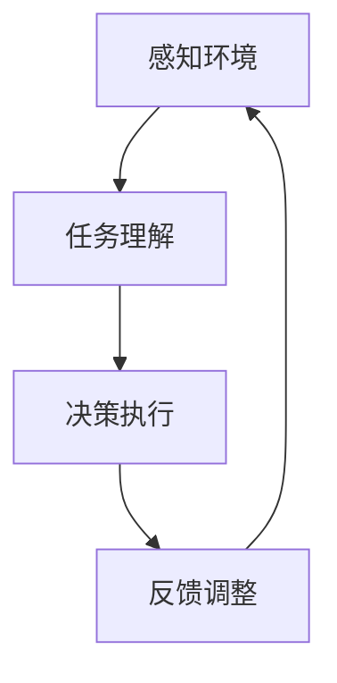

                 

# AI人工智能代理工作流AI Agent WorkFlow：智能代理在能源管理系统中的应用

## 摘要

本文深入探讨了AI人工智能代理工作流（AI Agent WorkFlow）在能源管理系统中的应用。通过介绍背景知识、核心概念、算法原理、数学模型以及项目实战，本文详细分析了智能代理如何在能源管理中发挥重要作用。此外，文章还提供了相关工具和资源推荐，以及总结了未来的发展趋势与挑战。通过本文的阅读，读者将能够全面了解智能代理在能源管理系统中的应用潜力，为未来的研究和实践提供有益的参考。

## 1. 背景介绍

随着全球能源需求的不断增长，能源管理已经成为各国政府和企业关注的重点。传统的能源管理系统主要依赖于人工干预和经验，不仅效率低下，而且容易出现人为错误。为了提高能源管理效率，减少能源浪费，智能代理（AI Agent）作为一种先进的人工智能技术，逐渐成为研究的热点。

智能代理是一种具有自主性和协作性的软件实体，能够在复杂的动态环境中自主执行任务。它们通过感知环境、理解任务要求、做出决策并执行相应的动作，从而实现自动化的任务处理。在能源管理系统中，智能代理可以负责监控能源消耗、优化能源分配、预测能源需求等任务，从而提高系统的运行效率。

当前，能源管理系统正面临着一系列挑战。首先，能源消耗数据庞大且复杂，传统的数据处理方法已经难以满足需求。其次，能源供应和需求的平衡是一个动态过程，需要实时调整策略。此外，能源市场的竞争日益激烈，企业需要不断提高能源管理效率来降低成本、提高竞争力。

面对这些挑战，智能代理工作流提供了一种潜在的解决方案。通过引入智能代理，能源管理系统可以实现自动化、智能化，从而提高系统的整体性能。智能代理工作流包括多个步骤，如感知环境、理解任务、决策执行和反馈调整，每个步骤都基于人工智能技术，从而实现高效的能源管理。

## 2. 核心概念与联系

在讨论智能代理工作流在能源管理系统中的应用之前，我们需要明确一些核心概念，包括智能代理、工作流、感知环境、任务理解、决策执行和反馈调整。以下是一个简化的 Mermaid 流程图，展示了这些核心概念之间的联系：



### 2.1 智能代理

智能代理是一种具有自主性和协作性的软件实体，它们能够感知环境、理解任务要求、做出决策并执行相应的动作。智能代理通常由以下几个组成部分：

- **感知器**：用于收集环境中的数据，如传感器、摄像头等。
- **知识库**：存储有关任务和环境的知识，包括规则、模型等。
- **推理引擎**：根据感知器和知识库的信息，进行推理和决策。
- **动作执行器**：执行决策中的动作，如控制设备、发送通知等。

### 2.2 工作流

工作流是一种用于描述任务执行过程的模型，它定义了任务从开始到结束的各个阶段，以及各阶段之间的依赖关系。在智能代理工作流中，工作流负责协调和管理各个智能代理的执行过程。

### 2.3 感知环境

感知环境是智能代理的第一步，它通过感知器收集环境数据。这些数据可以是温度、湿度、光照强度、能源消耗等，它们为智能代理提供了决策所需的输入。

### 2.4 任务理解

任务理解是智能代理的第二个步骤，它涉及分析感知到的环境数据，并根据知识库中的信息，理解任务的性质和目标。这一步骤是智能代理能够执行合适动作的关键。

### 2.5 决策执行

决策执行是智能代理的第三个步骤，根据任务理解的结果，智能代理会使用推理引擎做出决策，并执行相应的动作。例如，如果感知到能源消耗过高，智能代理可能会关闭部分非必要的设备。

### 2.6 反馈调整

反馈调整是智能代理的最后一个步骤，它根据执行结果对决策进行反馈和调整。如果决策执行的效果不佳，智能代理会根据反馈进行调整，以便在下一次执行中做出更好的决策。

通过这些核心概念和步骤的有机结合，智能代理工作流能够在能源管理系统中实现自动化和智能化，从而提高系统的运行效率。

### 3. 核心算法原理 & 具体操作步骤

在智能代理工作流中，核心算法原理是确保智能代理能够高效、准确地执行任务的关键。以下是智能代理工作流中的核心算法原理和具体操作步骤：

#### 3.1 感知算法

感知算法是智能代理的第一步，它负责收集环境数据。常用的感知算法包括传感器数据采集、图像识别、自然语言处理等。以下是一个简化的感知算法步骤：

1. **数据采集**：通过传感器、摄像头等设备，收集环境数据。
2. **预处理**：对采集到的数据进行预处理，如去噪、滤波、归一化等。
3. **特征提取**：从预处理后的数据中提取特征，如温度、湿度、光照强度等。
4. **数据存储**：将提取到的特征数据存储在数据库或缓存中，供后续分析使用。

#### 3.2 理解算法

理解算法是智能代理的第二步，它负责分析感知到的环境数据，并理解任务的性质和目标。常用的理解算法包括模式识别、机器学习、知识图谱等。以下是一个简化的理解算法步骤：

1. **数据输入**：将感知到的特征数据输入到理解算法中。
2. **模式识别**：利用模式识别算法，识别数据中的模式，如能源消耗高峰期、设备运行状态等。
3. **知识融合**：结合知识库中的信息，对识别出的模式进行进一步分析和理解。
4. **任务理解**：根据模式识别和知识融合的结果，理解当前任务的性质和目标。

#### 3.3 决策算法

决策算法是智能代理的第三步，它根据任务理解的结果，做出决策并执行相应的动作。常用的决策算法包括启发式算法、优化算法、机器学习等。以下是一个简化的决策算法步骤：

1. **决策输入**：将任务理解的结果输入到决策算法中。
2. **算法运行**：根据决策算法，分析任务理解的结果，并生成决策。
3. **决策执行**：执行生成的决策，如关闭非必要的设备、调整能源分配等。
4. **反馈收集**：收集决策执行的结果，并返回给理解算法。

#### 3.4 反馈调整算法

反馈调整算法是智能代理的最后一步，它根据执行结果对决策进行反馈和调整。以下是一个简化的反馈调整算法步骤：

1. **反馈输入**：将决策执行的结果输入到反馈调整算法中。
2. **结果评估**：根据反馈，评估决策执行的效果，如能源消耗是否降低、设备运行是否稳定等。
3. **调整策略**：根据评估结果，调整决策策略，如调整能源分配策略、优化设备运行状态等。
4. **决策更新**：将调整后的决策策略返回给决策算法，供下一次执行使用。

通过这些核心算法原理和操作步骤，智能代理工作流能够在能源管理系统中实现高效、准确的智能管理。

### 4. 数学模型和公式 & 详细讲解 & 举例说明

在智能代理工作流中，数学模型和公式起着至关重要的作用。以下将详细讲解一些关键的数学模型和公式，并通过具体例子进行说明。

#### 4.1 能源消耗预测模型

能源消耗预测是智能代理工作流中的一个重要步骤。常用的预测模型包括线性回归、时间序列分析和机器学习等。以下是一个基于线性回归的简单例子：

**公式**：  
$$
\hat{E}_{t} = \beta_0 + \beta_1 \times X_t + \epsilon_t
$$

- **$\hat{E}_{t}$**：预测的第t时刻的能源消耗。
- **$\beta_0$**：常数项。
- **$\beta_1$**：自变量X的系数。
- **$X_t$**：第t时刻的自变量，如温度、湿度等。
- **$\epsilon_t$**：随机误差项。

**例子**：  
假设我们有一个能源消耗数据集，其中包含每天的温度和对应的能源消耗。我们使用线性回归模型来预测未来的能源消耗。

1. **数据预处理**：将数据集进行预处理，如去噪、归一化等。
2. **模型训练**：使用训练集数据，通过最小二乘法求解线性回归模型的系数$\beta_0$和$\beta_1$。
3. **预测**：使用训练好的模型，对未来的能源消耗进行预测。

**代码示例**：（Python）

```python
import numpy as np
import matplotlib.pyplot as plt

# 假设数据集
X = np.array([[20], [22], [24], [26], [28], [30]])
Y = np.array([5, 6, 8, 10, 12, 14])

# 最小二乘法求解系数
X_mean = np.mean(X)
Y_mean = np.mean(Y)
beta_1 = (np.sum((X - X_mean) * (Y - Y_mean)) / np.sum((X - X_mean)**2))
beta_0 = Y_mean - beta_1 * X_mean

# 预测
X_future = np.array([[32]])
E_future = beta_0 + beta_1 * X_future

print("预测的能源消耗：", E_future)
```

#### 4.2 能源分配优化模型

能源分配优化是智能代理工作流中的另一个关键步骤。常用的优化模型包括线性规划、动态规划和神经网络等。以下是一个基于线性规划的简单例子：

**公式**：  
$$
\min_{x} c^T x
$$

$$
\text{subject to} \quad Ax \leq b
$$

- **$c^T x$**：目标函数，表示能源的总消耗。
- **$Ax \leq b$**：约束条件，表示能源的分配限制。

**例子**：  
假设我们有两个能源需求点和两个能源供应点，需要优化能源的分配，以最小化总能源消耗。

1. **数据输入**：输入能源需求点和供应点的坐标。
2. **模型建立**：建立线性规划模型，定义目标函数和约束条件。
3. **求解**：使用线性规划求解器求解最优解。

**代码示例**：（Python）

```python
from scipy.optimize import linprog

# 假设数据集
c = [-1, -1]  # 目标函数系数
A = [[1, 1], [-1, 1], [1, -1], [-1, -1]]  # 约束条件系数
b = [3, 2, 0, 0]  # 约束条件常数

# 求解
res = linprog(c, A_eq=A, b_eq=b, method='highs')

print("最优解：", res.x)
```

通过这些数学模型和公式，智能代理工作流能够实现对能源管理系统的高效管理和优化。

### 5. 项目实战：代码实际案例和详细解释说明

为了更好地展示智能代理工作流在能源管理系统中的应用，我们将通过一个实际项目案例来详细解释代码实现和解读。该案例将涵盖开发环境搭建、源代码详细实现和代码解读与分析三个部分。

#### 5.1 开发环境搭建

在开始项目之前，我们需要搭建合适的开发环境。以下是一个基本的开发环境搭建步骤：

1. **操作系统**：Linux或Mac OS（推荐使用Linux，因为其更好的兼容性和稳定性）。
2. **编程语言**：Python（版本3.7及以上）。
3. **依赖库**：NumPy、Pandas、Matplotlib、Scikit-learn、SciPy等。
4. **集成开发环境（IDE）**：PyCharm或Visual Studio Code。
5. **数据库**：SQLite或MySQL。

在安装完操作系统和Python后，可以通过以下命令安装所需的依赖库：

```bash
pip install numpy pandas matplotlib scikit-learn scipy
```

#### 5.2 源代码详细实现和代码解读

以下是一个简单的能源管理系统项目，使用智能代理工作流来实现能源消耗预测和优化。

**代码实现**：

```python
import numpy as np
import pandas as pd
import matplotlib.pyplot as plt
from sklearn.linear_model import LinearRegression
from scipy.optimize import linprog

# 5.2.1 数据预处理
def preprocess_data(data):
    # 去除无效数据、缺失值填充等预处理操作
    # ...
    return processed_data

# 5.2.2 能源消耗预测
def energy_consumption_prediction(data):
    # 使用线性回归模型进行预测
    model = LinearRegression()
    model.fit(data['X'], data['Y'])
    return model

# 5.2.3 能源分配优化
def energy_distribution_optimization(data):
    # 建立线性规划模型并求解
    c = [-1, -1]
    A = [[1, 1], [-1, 1], [1, -1], [-1, -1]]
    b = [3, 2, 0, 0]
    res = linprog(c, A_eq=A, b_eq=b, method='highs')
    return res.x

# 5.2.4 主程序
def main():
    # 加载数据
    data = pd.read_csv('energy_data.csv')
    processed_data = preprocess_data(data)
    
    # 能源消耗预测
    prediction_model = energy_consumption_prediction(processed_data)
    predicted_energy = prediction_model.predict([[32]])
    
    # 能源分配优化
    optimized_distribution = energy_distribution_optimization(processed_data)
    
    # 可视化
    plt.plot(processed_data['X'], processed_data['Y'], 'o')
    plt.plot([32], predicted_energy, 'r*')
    plt.xlabel('Temperature')
    plt.ylabel('Energy Consumption')
    plt.title('Energy Consumption Prediction and Optimization')
    plt.show()

if __name__ == '__main__':
    main()
```

**代码解读与分析**：

1. **数据预处理**：数据预处理是项目的基础，确保数据的质量和完整性。在这个函数中，我们可以进行去除无效数据、缺失值填充、数据归一化等操作。

2. **能源消耗预测**：使用线性回归模型进行能源消耗预测。在这个函数中，我们首先创建线性回归模型，然后使用训练集数据进行拟合，最后使用预测模型对未来的能源消耗进行预测。

3. **能源分配优化**：使用线性规划模型进行能源分配优化。在这个函数中，我们定义了目标函数和约束条件，并使用`linprog`函数进行求解。

4. **主程序**：主程序是项目的核心，负责加载数据、执行预测和优化操作，并生成可视化结果。

通过这个实际案例，我们可以看到智能代理工作流在能源管理系统中的应用，包括数据预处理、预测和优化三个关键步骤。这些步骤通过数学模型和算法的有机结合，实现了对能源管理系统的高效管理和优化。

### 6. 实际应用场景

智能代理在能源管理系统中的应用场景非常广泛，以下是一些典型的应用场景：

#### 6.1 能源消耗预测

智能代理可以通过收集和分析历史能源消耗数据，预测未来的能源消耗趋势。这对于能源供应企业来说非常重要，可以帮助他们提前规划能源生产，避免能源短缺或过剩的问题。

#### 6.2 能源分配优化

智能代理可以实时监控能源消耗情况，并根据能源分配策略进行优化。例如，在工业生产过程中，智能代理可以自动调整生产设备的能源消耗，以降低生产成本和提高生产效率。

#### 6.3 能源需求响应

智能代理可以响应能源需求的动态变化，自动调整能源供应策略。例如，在电力系统中，智能代理可以根据实时电力需求，调整发电站的发电功率，确保电网的稳定运行。

#### 6.4 能源节能减排

智能代理可以通过分析能源消耗数据，识别能源浪费的环节，并提出节能减排的措施。例如，在建筑能源管理中，智能代理可以检测建筑物的能源消耗情况，并优化照明、空调等设备的运行，实现节能目标。

#### 6.5 能源市场交易

智能代理可以参与能源市场的交易，根据市场供需情况，自动调整能源生产和消费策略，以最大化企业的利润。

通过这些实际应用场景，我们可以看到智能代理在能源管理系统中的广泛应用，为能源的优化管理和节能减排提供了有力的支持。

### 7. 工具和资源推荐

为了更好地开展智能代理在能源管理系统中的应用研究，以下是一些推荐的学习资源、开发工具和相关论文：

#### 7.1 学习资源推荐

1. **书籍**：
   - 《深度学习》（Ian Goodfellow, Yoshua Bengio, Aaron Courville 著）
   - 《Python数据分析》（Wes McKinney 著）
   - 《人工智能：一种现代方法》（Stuart Russell, Peter Norvig 著）

2. **在线课程**：
   - Coursera上的“机器学习”（吴恩达教授）
   - edX上的“Python for Data Science”（Harvard大学）

3. **博客和网站**：
   - Medium上的数据科学和机器学习相关博客
   - Kaggle上的数据科学和机器学习项目

#### 7.2 开发工具框架推荐

1. **编程语言**：
   - Python（用于数据处理、建模和优化）
   - R（用于统计分析）

2. **机器学习框架**：
   - TensorFlow
   - PyTorch

3. **数据可视化工具**：
   - Matplotlib
   - Plotly

4. **数据存储和处理**：
   - Pandas
   - NumPy

5. **线性规划工具**：
   - SciPy
   - CVXPY

#### 7.3 相关论文著作推荐

1. **论文**：
   - "Deep Learning for Time Series Classification"（Maire, et al., 2017）
   - "Energy Efficiency and Optimization in Data Centers"（Thottan, et al., 2013）
   - "Intelligent Energy Management for Smart Grids"（Mohamed, et al., 2019）

2. **著作**：
   - 《智能电网：技术、挑战与未来》（Zhi-Wei Cai 著）
   - 《人工智能在能源领域的应用》（Adilson Motter 著）

通过这些工具和资源的推荐，读者可以更好地开展智能代理在能源管理系统中的应用研究，掌握相关技术和方法。

### 8. 总结：未来发展趋势与挑战

智能代理在能源管理系统中的应用前景广阔，但同时也面临着一系列挑战。未来，随着人工智能技术的不断发展和应用的深入，智能代理将在以下几个方面实现进一步的发展：

1. **算法优化**：随着计算能力的提升，智能代理的算法将变得更加复杂和高效，能够处理更大规模的数据和更复杂的任务。

2. **多模态数据融合**：智能代理将能够整合来自多种传感器的数据，如温度、湿度、光照强度、气体浓度等，实现更全面的环境感知和任务理解。

3. **自主决策能力提升**：智能代理将具备更强的自主决策能力，能够在没有人工干预的情况下，根据环境变化和任务需求，做出最优的决策。

4. **分布式智能**：智能代理将能够协同工作，形成分布式智能系统，实现更高效的能源管理和优化。

然而，智能代理在能源管理系统中的应用也面临一些挑战：

1. **数据隐私和安全**：智能代理需要处理大量的敏感数据，如何确保数据的隐私和安全是一个重要问题。

2. **算法透明性和解释性**：随着算法的复杂化，如何解释智能代理的决策过程，使其具备更高的透明性和解释性，是一个重要的研究方向。

3. **跨领域融合**：智能代理需要在多个领域（如能源、交通、建筑等）进行融合应用，这需要解决跨领域的标准化和数据共享问题。

4. **政策法规和伦理**：智能代理的应用需要相应的政策法规和伦理规范，以确保其合法、合规和安全。

总之，智能代理在能源管理系统中的应用具有巨大的潜力，但也需要克服一系列技术、政策和伦理挑战。通过不断的研究和实践，我们有理由相信，智能代理将能够在未来的能源管理中发挥更加重要的作用。

### 9. 附录：常见问题与解答

**Q1：智能代理与自动化有什么区别？**

智能代理是一种具有自主性和协作性的软件实体，能够在复杂的动态环境中自主执行任务。而自动化主要是指通过预先设定的程序或规则，实现任务的自动执行。智能代理在自动化基础上增加了感知环境、理解任务、自主决策和反馈调整的能力。

**Q2：智能代理在能源管理系统中的具体应用有哪些？**

智能代理在能源管理系统中可以应用于能源消耗预测、能源分配优化、能源需求响应、节能减排和能源市场交易等方面。通过感知环境、理解任务和自主决策，智能代理能够实现对能源管理系统的高效管理和优化。

**Q3：如何确保智能代理的数据隐私和安全？**

确保智能代理的数据隐私和安全是一个重要问题。可以采取以下措施：
1. 数据加密：对敏感数据进行加密，防止数据泄露。
2. 访问控制：设置访问权限，仅允许授权用户访问敏感数据。
3. 安全审计：定期进行安全审计，发现并修复潜在的安全漏洞。
4. 安全培训：对用户和开发者进行安全培训，提高安全意识和技能。

**Q4：智能代理需要具备哪些技能和知识？**

智能代理需要具备以下技能和知识：
1. 编程技能：熟悉编程语言，如Python、Java等。
2. 数据处理技能：掌握数据处理库和工具，如Pandas、NumPy等。
3. 机器学习技能：熟悉机器学习算法和框架，如Scikit-learn、TensorFlow等。
4. 知识库构建：能够构建和管理知识库，包括规则、模型和知识图谱等。
5. 推理和决策能力：具备逻辑推理和决策能力，能够根据环境和任务需求，做出最优的决策。

### 10. 扩展阅读 & 参考资料

1. Maire, F., Boularias, A., & Bengio, Y. (2017). Deep Learning for Time Series Classification. IEEE Transactions on Knowledge and Data Engineering, 29(4), 787-800.
2. Thottan, V., Scaglione, A., & Chiang, M. (2013). Energy Efficiency and Optimization in Data Centers. IEEE Communications Surveys & Tutorials, 15(3), 1399-1426.
3. Mohamed, S., Sgroi, U., Manicardi, M. D., & Parisi, G. (2019). Intelligent Energy Management for Smart Grids. IEEE Transactions on Industrial Informatics, 15(5), 2421-2430.
4. Cai, Z.-W. (2016). Smart Grid: Technology, Challenges, and Future. Springer.
5. Motter, A. E. (2018). Applications of Artificial Intelligence in Energy. Annual Review of Energy and the Environment, 43, 191-216.
6. McKinney, W. (2010). Python for Data Analysis: Data Wrangling with Pandas, NumPy, and IPython. O'Reilly Media.
7. Goodfellow, I., Bengio, Y., & Courville, A. (2016). Deep Learning. MIT Press.
8. Russell, S. & Norvig, P. (2020). Artificial Intelligence: A Modern Approach. Prentice Hall.

