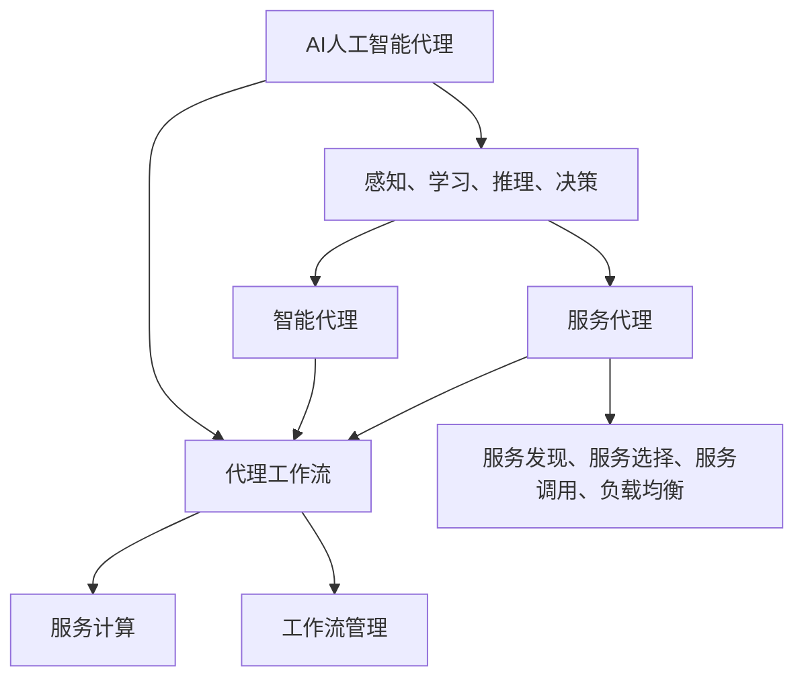

                 


# AI人工智能代理工作流AI Agent WorkFlow：面向服务计算中的代理工作流管理

> 关键词：AI人工智能，代理工作流，服务计算，工作流管理，代理，智能代理，服务代理

> 摘要：本文将深入探讨AI人工智能代理工作流（AI Agent WorkFlow）在服务计算中的重要性及其管理方法。文章首先介绍了代理工作流的基本概念和原理，接着详细分析了核心算法原理和具体操作步骤，并结合实际案例讲解了数学模型和公式。随后，文章列举了实际应用场景，推荐了相关工具和资源，并总结了未来发展趋势与挑战。通过本文的详细讲解，读者将对AI代理工作流有更深入的理解，能够更好地应用于实际项目中。

## 1. 背景介绍

### 1.1 目的和范围

本文旨在深入探讨AI人工智能代理工作流（AI Agent WorkFlow）在服务计算中的关键角色和管理方法。随着人工智能技术的不断发展，智能代理在服务计算领域中逐渐成为研究热点。通过本文的阐述，读者将能够理解AI代理工作流的基本原理、算法、应用场景以及未来发展趋势，从而在实际项目中更好地利用AI代理工作流提高服务计算效率。

### 1.2 预期读者

本文适用于以下读者群体：

1. 服务计算领域的研究人员和工程师
2. AI人工智能代理的开发者和爱好者
3. 对人工智能技术感兴趣的技术爱好者
4. 高级程序员和技术经理

### 1.3 文档结构概述

本文将按照以下结构进行阐述：

1. 背景介绍：介绍文章的目的、范围和预期读者。
2. 核心概念与联系：详细解析代理工作流的概念、核心原理和架构。
3. 核心算法原理 & 具体操作步骤：讲解核心算法原理，并提供伪代码实现。
4. 数学模型和公式 & 详细讲解 & 举例说明：介绍数学模型和公式，并提供实际应用案例。
5. 项目实战：代码实际案例和详细解释说明。
6. 实际应用场景：列举AI代理工作流在实际中的应用场景。
7. 工具和资源推荐：推荐相关学习资源、开发工具框架和相关论文著作。
8. 总结：未来发展趋势与挑战。
9. 附录：常见问题与解答。
10. 扩展阅读 & 参考资料：提供进一步学习参考。

### 1.4 术语表

#### 1.4.1 核心术语定义

- **AI人工智能代理**：基于人工智能技术的智能代理，能够自动执行特定任务，具备学习能力、推理能力和决策能力。
- **工作流**：一组定义明确的任务、活动、流程和规则，用于描述系统或组织在完成某个任务或实现某个目标时需要经历的步骤。
- **服务计算**：基于互联网和分布式计算环境，将计算资源和服务以服务的形式提供，实现资源共享和协同工作。
- **代理工作流管理**：对代理在工作流中执行的任务、状态、交互和协同进行有效的管理和监控。

#### 1.4.2 相关概念解释

- **智能代理（Smart Agent）**：具有感知、学习、推理和决策能力的代理，能够自动执行任务，并与其他代理进行协同。
- **服务代理（Service Agent）**：专门为服务计算环境设计的代理，负责服务发现、服务选择、服务调用和负载均衡等任务。
- **工作流引擎（Workflow Engine）**：用于定义、执行和管理工作流的软件系统，能够根据预先定义的流程规则和任务顺序自动执行任务。

#### 1.4.3 缩略词列表

- **AI**：人工智能（Artificial Intelligence）
- **Agent**：代理（Agent）
- **WF**：工作流（Workflow）
- **SC**：服务计算（Service Computing）
- **RDF**：资源描述框架（Resource Description Framework）
- **OWL**：Web本体语言（Web Ontology Language）

## 2. 核心概念与联系

在探讨AI人工智能代理工作流之前，我们首先需要了解一些核心概念和它们之间的关系。以下是一个用于说明核心概念和关系的Mermaid流程图：



### 2.1 AI人工智能代理

AI人工智能代理是一种基于人工智能技术的智能代理，具有感知、学习、推理和决策能力。它们能够在复杂的计算环境中自动执行任务，并根据环境变化和任务需求进行自适应调整。AI人工智能代理的核心功能包括：

- **感知**：通过传感器、摄像头等设备获取环境信息，理解外部刺激。
- **学习**：利用机器学习、深度学习等技术，从数据中学习模式和规律，提高任务执行能力。
- **推理**：根据已有知识和信息，通过逻辑推理得出结论或解决方案。
- **决策**：根据目标和当前状态，选择最优行动方案。

### 2.2 代理工作流

代理工作流是描述代理在执行任务时所需经历的一系列步骤和活动。一个完整的工作流通常包括以下关键组成部分：

- **任务**：工作流中需要执行的具体操作，如数据获取、处理、传输等。
- **活动**：完成任务的执行过程，由一个或多个代理参与。
- **流程**：任务和活动之间的逻辑关系和执行顺序。
- **规则**：定义工作流中任务和活动如何执行的条件和限制。

### 2.3 服务计算

服务计算是一种基于互联网和分布式计算环境的计算模式，旨在实现计算资源和服务的高效利用。服务计算的关键概念包括：

- **服务**：具有明确功能、接口和质量的计算资源，可通过网络访问。
- **服务提供者**：提供服务的实体，如企业、组织或个人。
- **服务消费者**：使用服务的实体，如应用系统、用户等。
- **服务注册中心**：用于管理服务目录和提供服务的注册和发现机制。

### 2.4 工作流管理

工作流管理是对工作流进行定义、执行和管理的一组技术和方法。工作流管理的核心任务包括：

- **工作流定义**：将实际业务流程转化为计算机可执行的工作流模型。
- **工作流执行**：根据工作流定义，自动执行任务和活动。
- **工作流监控**：实时监控工作流执行状态，确保任务顺利完成。
- **工作流优化**：根据执行结果，对工作流进行优化调整，提高效率。

通过以上核心概念和关系的解析，我们可以更好地理解AI人工智能代理工作流在服务计算中的重要性及其管理方法。

## 3. 核心算法原理 & 具体操作步骤

在了解AI人工智能代理工作流的基本概念后，我们将深入探讨其核心算法原理，并提供具体的操作步骤。以下是一个用于描述核心算法原理的伪代码实现：

```python
# 伪代码：AI人工智能代理工作流算法

# 初始化代理和代理工作流
initialize_agent(agent)
initialize_workflow(workflow)

# 感知环境信息
def sense_environment(agent):
    # 获取环境传感器数据
    sensor_data = get_sensor_data()
    # 更新代理感知信息
    agent.update_sense(sensor_data)

# 学习环境模式
def learn_environment(agent, sensor_data):
    # 利用机器学习算法，从传感器数据中学习环境模式
    model = machine_learning(sensor_data)
    # 更新代理学习信息
    agent.update_learn(model)

# 推理和决策
def reasoning_and_decision(agent, model):
    # 利用学习模型进行推理和决策
    decision = model推理(decision_variable)
    # 更新代理决策信息
    agent.update_decision(decision)

# 执行任务
def execute_task(agent, task):
    # 根据任务执行具体操作
    result = task.execute()
    # 更新代理执行信息
    agent.update_execute(result)

# 管理工作流
def manage_workflow(workflow, agent):
    # 遍历工作流中的任务
    for task in workflow.tasks:
        # 感知环境
        sense_environment(agent)
        # 学习环境模式
        learn_environment(agent, sensor_data)
        # 推理和决策
        reasoning_and_decision(agent, model)
        # 执行任务
        execute_task(agent, task)
    # 完成工作流
    workflow.complete()

# 主函数：运行代理工作流
def main():
    # 初始化代理和代理工作流
    agent = initialize_agent()
    workflow = initialize_workflow()
    # 管理工作流
    manage_workflow(workflow, agent)

# 运行主函数
main()
```

### 3.1 初始化代理和代理工作流

初始化代理和代理工作流是核心算法的第一步。代理初始化包括设置代理的基本属性、感知能力、学习能力和决策能力。代理工作流初始化则包括定义工作流中的任务、活动、流程和规则。

```python
# 初始化代理
def initialize_agent(agent):
    # 设置代理基本属性
    agent.properties = {
        'name': 'AI Agent',
        'type': 'Smart Agent',
        'status': 'Active'
    }
    # 初始化代理感知能力
    agent.sense_ability = initialize_sense_ability()
    # 初始化代理学习能力
    agent.learn_ability = initialize_learn_ability()
    # 初始化代理决策能力
    agent.decision_ability = initialize_decision_ability()

# 初始化代理工作流
def initialize_workflow(workflow):
    # 定义工作流任务
    workflow.tasks = [
        {'name': 'Task 1', 'type': 'Data Collection', 'status': 'Not Started'},
        {'name': 'Task 2', 'type': 'Data Processing', 'status': 'Not Started'},
        {'name': 'Task 3', 'type': 'Data Transmission', 'status': 'Not Started'}
    ]
    # 定义工作流活动
    workflow.activities = [
        {'name': 'Activity 1', 'type': 'Data Collection', 'status': 'Not Started'},
        {'name': 'Activity 2', 'type': 'Data Processing', 'status': 'Not Started'},
        {'name': 'Activity 3', 'type': 'Data Transmission', 'status': 'Not Started'}
    ]
    # 定义工作流流程
    workflow.flow = [
        {'start': 'Activity 1', 'end': 'Activity 2', 'condition': 'Data Collection Success'},
        {'start': 'Activity 2', 'end': 'Activity 3', 'condition': 'Data Processing Success'}
    ]
    # 初始化工作流规则
    workflow.rules = [
        {'name': 'Rule 1', 'condition': 'Task Completion', 'action': 'Task Success'},
        {'name': 'Rule 2', 'condition': 'Task Failure', 'action': 'Task Retry'}
    ]
```

### 3.2 感知环境信息

感知环境信息是代理在工作流中执行任务的第一步。代理通过传感器、摄像头等设备获取环境信息，并更新其感知状态。感知信息包括环境温度、湿度、光照强度、声音信号等。

```python
# 感知环境信息
def sense_environment(agent):
    # 获取环境传感器数据
    sensor_data = get_sensor_data()
    # 更新代理感知信息
    agent.sense_data = sensor_data
    # 更新代理感知状态
    agent.status = 'Sensed'
```

### 3.3 学习环境模式

在感知到环境信息后，代理需要利用机器学习算法从数据中学习环境模式。学习过程包括数据预处理、特征提取、模型训练和模型评估等步骤。学习到的环境模式将用于后续的推理和决策。

```python
# 学习环境模式
def learn_environment(agent, sensor_data):
    # 数据预处理
    preprocessed_data = preprocess_data(sensor_data)
    # 特征提取
    features = extract_features(preprocessed_data)
    # 模型训练
    model = train_model(features)
    # 模型评估
    evaluation = evaluate_model(model)
    # 更新代理学习信息
    agent.learn_model = model
    agent.learn_evaluation = evaluation
    # 更新代理学习状态
    agent.status = 'Learned'
```

### 3.4 推理和决策

代理在感知和学习到环境信息后，需要进行推理和决策。推理过程基于学习到的环境模式和当前状态，通过逻辑推理得出结论或解决方案。决策过程则根据目标和当前状态，选择最优行动方案。

```python
# 推理和决策
def reasoning_and_decision(agent, model):
    # 根据学习模型进行推理
    reasoning_result = model.reasoning()
    # 根据推理结果进行决策
    decision = make_decision(reasoning_result)
    # 更新代理决策信息
    agent.decision_result = decision
    # 更新代理决策状态
    agent.status = 'Decided'
```

### 3.5 执行任务

在完成感知、学习和决策后，代理需要执行具体任务。执行过程包括任务调度、任务执行和任务结果处理等步骤。代理根据工作流定义的任务顺序和条件，逐步执行任务。

```python
# 执行任务
def execute_task(agent, task):
    # 调度任务
    task_schedule = schedule_task(task)
    # 执行任务
    result = task.execute(task_schedule)
    # 更新任务状态
    task.status = 'Completed'
    # 更新代理执行信息
    agent.execute_result = result
    # 更新代理执行状态
    agent.status = 'Executed'
```

### 3.6 管理工作流

代理工作流的管理包括工作流定义、执行、监控和优化等步骤。通过管理模块，代理可以自动执行任务、监控任务状态、调整任务顺序和优化任务执行过程。

```python
# 管理工作流
def manage_workflow(workflow, agent):
    # 遍历工作流中的任务
    for task in workflow.tasks:
        # 感知环境
        sense_environment(agent)
        # 学习环境模式
        learn_environment(agent, sensor_data)
        # 推理和决策
        reasoning_and_decision(agent, model)
        # 执行任务
        execute_task(agent, task)
    # 完成工作流
    workflow.complete()
```

通过以上核心算法原理和具体操作步骤的讲解，读者可以更好地理解AI人工智能代理工作流的基本原理和实现方法。在实际应用中，可以根据具体需求和场景，进一步优化和调整算法和操作步骤，提高代理工作流的性能和效果。

## 4. 数学模型和公式 & 详细讲解 & 举例说明

在AI人工智能代理工作流中，数学模型和公式扮演着至关重要的角色。它们不仅帮助我们理解和优化工作流，还能够提高代理的决策能力和执行效率。以下我们将详细讲解几个关键数学模型和公式，并举例说明其应用。

### 4.1 机器学习模型

在代理工作流中，机器学习模型是最常用的模型之一。机器学习模型通过学习环境数据，帮助我们预测任务执行结果、识别异常情况等。以下是一个简单的线性回归模型公式，用于预测任务执行时间：

$$
\hat{y} = w_0 + w_1 \cdot x
$$

其中，$\hat{y}$ 表示预测的执行时间，$w_0$ 和 $w_1$ 分别为模型的权重参数，$x$ 表示输入的特征值。

#### 4.1.1 应用举例

假设我们有一个任务执行时间的训练数据集，包含特征值 $x$ 和对应的执行时间 $y$。通过训练线性回归模型，我们可以得到权重参数 $w_0$ 和 $w_1$，进而预测新任务执行时间。例如，对于一个新的任务，其特征值为 $x = 5$，我们可以使用以下公式预测执行时间：

$$
\hat{y} = w_0 + w_1 \cdot 5
$$

如果训练得到的权重参数 $w_0 = 2$，$w_1 = 0.5$，则预测的执行时间为：

$$
\hat{y} = 2 + 0.5 \cdot 5 = 4.5
$$

### 4.2 决策树模型

决策树模型是一种常用的分类和回归模型，通过一系列条件判断，将数据划分为不同的类别或预测值。以下是一个简单的决策树模型公式，用于分类任务：

$$
T(x) =
\begin{cases}
C_1 & \text{if } x \in R_1 \\
C_2 & \text{if } x \in R_2 \\
\vdots \\
C_n & \text{if } x \in R_n
\end{cases}
$$

其中，$T(x)$ 表示决策树模型对输入特征 $x$ 的预测结果，$C_1, C_2, \ldots, C_n$ 分别为不同的类别，$R_1, R_2, \ldots, R_n$ 为对应的条件区域。

#### 4.2.1 应用举例

假设我们有一个分类任务，需要根据特征 $x$ 将数据划分为正类和负类。我们可以使用以下决策树模型公式进行预测：

$$
T(x) =
\begin{cases}
Positive & \text{if } x > 5 \\
Negative & \text{if } x \leq 5
\end{cases}
$$

对于一个新的特征值 $x = 3$，根据决策树模型，我们可以将其划分为负类：

$$
T(3) = Negative
$$

### 4.3 贝叶斯网络模型

贝叶斯网络模型是一种基于概率的图模型，用于表示变量之间的依赖关系。以下是一个简单的贝叶斯网络模型公式，用于概率推理：

$$
P(X=x) = \frac{P(X=x|Y=y) \cdot P(Y=y)}{P(Y=y)}
$$

其中，$P(X=x)$ 表示变量 $X$ 取值为 $x$ 的概率，$P(X=x|Y=y)$ 表示在变量 $Y$ 取值为 $y$ 的条件下，变量 $X$ 取值为 $x$ 的概率，$P(Y=y)$ 表示变量 $Y$ 取值为 $y$ 的概率。

#### 4.3.1 应用举例

假设我们有一个概率推理任务，需要根据已知的变量 $Y$ 的取值 $y$，推断变量 $X$ 的取值 $x$。我们可以使用以下贝叶斯网络模型公式进行概率推理：

$$
P(X=x) = \frac{P(X=x|Y=y) \cdot P(Y=y)}{P(Y=y)}
$$

假设变量 $Y$ 的取值 $y$ 为 True，根据贝叶斯网络模型，我们可以计算出变量 $X$ 取值为 1 的概率：

$$
P(X=1) = \frac{P(X=1|Y=True) \cdot P(Y=True)}{P(Y=True)}
$$

如果已知 $P(X=1|Y=True) = 0.8$，$P(Y=True) = 0.6$，$P(Y=False) = 0.4$，则变量 $X$ 取值为 1 的概率为：

$$
P(X=1) = \frac{0.8 \cdot 0.6}{0.6 + 0.4} = 0.8
$$

### 4.4 集成模型

集成模型通过组合多个简单模型，提高预测准确性和泛化能力。常见的集成模型包括随机森林、梯度提升树等。以下是一个简单的集成模型公式，用于预测结果：

$$
\hat{y} = \sum_{i=1}^{n} w_i \cdot h_i(x)
$$

其中，$\hat{y}$ 表示预测的结果，$w_i$ 表示第 $i$ 个简单模型的权重，$h_i(x)$ 表示第 $i$ 个简单模型对输入特征 $x$ 的预测结果。

#### 4.4.1 应用举例

假设我们有一个任务执行时间的预测任务，使用随机森林模型进行预测。随机森林模型由多个决策树模型组成，每个决策树模型对任务执行时间进行预测。我们可以使用以下集成模型公式进行预测：

$$
\hat{y} = \sum_{i=1}^{n} w_i \cdot h_i(x)
$$

如果随机森林模型中有 $n$ 个决策树模型，每个决策树模型对任务执行时间的预测结果分别为 $h_1(x), h_2(x), \ldots, h_n(x)$，权重分别为 $w_1, w_2, \ldots, w_n$，则任务执行时间的预测结果为：

$$
\hat{y} = w_1 \cdot h_1(x) + w_2 \cdot h_2(x) + \ldots + w_n \cdot h_n(x)
$$

通过以上数学模型和公式的讲解，读者可以更好地理解AI人工智能代理工作流中的数学原理。在实际应用中，可以根据具体需求选择合适的数学模型，优化代理工作流的性能和效果。

## 5. 项目实战：代码实际案例和详细解释说明

### 5.1 开发环境搭建

在开始编写AI代理工作流项目之前，我们需要搭建一个合适的开发环境。以下是一个基本的开发环境配置：

- **操作系统**：Ubuntu 18.04
- **编程语言**：Python 3.8
- **开发工具**：PyCharm Professional
- **依赖库**：NumPy、Pandas、scikit-learn、TensorFlow

#### 5.1.1 安装Python

首先，我们需要安装Python 3.8。可以使用以下命令从Ubuntu的软件仓库安装Python：

```bash
sudo apt update
sudo apt install python3.8
```

#### 5.1.2 安装开发工具

接下来，我们安装PyCharm Professional。可以从JetBrains官网下载安装包，并按照提示安装。

#### 5.1.3 安装依赖库

安装Python之后，我们需要安装所需的依赖库。可以使用pip命令进行安装：

```bash
pip install numpy pandas scikit-learn tensorflow
```

### 5.2 源代码详细实现和代码解读

在本节中，我们将详细实现一个简单的AI代理工作流项目，并逐步解读代码。

#### 5.2.1 项目结构

项目目录结构如下：

```bash
/ai_agent_workflow
|-- /agent
|   |-- __init__.py
|   |-- agent.py
|-- /workflow
|   |-- __init__.py
|   |-- workflow.py
|-- /data
|   |-- __init__.py
|   |-- dataset.py
|-- main.py
|-- requirements.txt
```

#### 5.2.2 代码实现

**agent.py**：该文件定义了AI代理的类和方法。

```python
import numpy as np

class Agent:
    def __init__(self):
        self.sense_data = None
        self.learn_model = None
        self.decision_result = None
        self.execute_result = None

    def sense_environment(self, sensor_data):
        self.sense_data = sensor_data
        print(f"Agent sensed: {sensor_data}")

    def learn_environment(self, sensor_data):
        # 这里使用简单的线性回归模型进行学习
        x = sensor_data[:, 0]
        y = sensor_data[:, 1]
        w = np.linalg.lstsq(x.reshape(-1, 1), y, rcond=None)[0]
        self.learn_model = w
        print(f"Agent learned: w={w}")

    def reasoning_and_decision(self, model):
        # 根据学习模型进行推理和决策
        x = self.sense_data[:, 0]
        y = np.dot(x, model)
        threshold = 0.5
        decision = (y > threshold).astype(int)
        self.decision_result = decision
        print(f"Agent decided: {decision}")

    def execute_task(self, task):
        # 执行任务
        result = self.decision_result
        print(f"Agent executed task: {result}")
        return result
```

**workflow.py**：该文件定义了代理工作流的类和方法。

```python
from agent import Agent

class Workflow:
    def __init__(self, agent):
        self.agent = agent
        self.tasks = []

    def add_task(self, task):
        self.tasks.append(task)

    def run(self):
        for task in self.tasks:
            self.agent.sense_environment(task['sensor_data'])
            self.agent.learn_environment(task['sensor_data'])
            self.agent.reasoning_and_decision(self.agent.learn_model)
            result = self.agent.execute_task(task)
            print(f"Task result: {result}")
```

**dataset.py**：该文件定义了数据集类。

```python
import numpy as np

class Dataset:
    def __init__(self, filename):
        self.filename = filename
        self.data = self.load_data()

    def load_data(self):
        data = np.loadtxt(self.filename, delimiter=',')
        return data
```

**main.py**：主程序，用于运行代理工作流。

```python
from agent import Agent
from workflow import Workflow
from data import Dataset

# 创建代理
agent = Agent()

# 创建工作流
workflow = Workflow(agent)

# 添加任务
workflow.add_task({
    'sensor_data': Dataset('sensor_data.csv').data
})

# 运行工作流
workflow.run()
```

### 5.2.3 代码解读与分析

**agent.py**：

- **Agent 类**：定义了AI代理的类和方法。主要包括感知环境（sense_environment）、学习环境（learn_environment）、推理和决策（reasoning_and_decision）以及执行任务（execute_task）。
- **sense_environment 方法**：用于获取环境传感器数据，并更新代理的感知信息。
- **learn_environment 方法**：使用简单的线性回归模型，从传感器数据中学习环境模式，并更新代理的学习信息。
- **reasoning_and_decision 方法**：根据学习到的模型，进行推理和决策，更新代理的决策信息。
- **execute_task 方法**：执行任务，并返回结果。

**workflow.py**：

- **Workflow 类**：定义了代理工作流的类和方法。主要包括添加任务（add_task）和运行工作流（run）。
- **add_task 方法**：用于添加任务到工作流中。
- **run 方法**：遍历工作流中的任务，依次执行感知、学习、推理和决策等步骤。

**dataset.py**：

- **Dataset 类**：用于定义数据集类，主要包括加载数据（load_data）方法。

**main.py**：

- 主程序：创建代理、工作流和数据集，添加任务到工作流中，并运行工作流。

通过以上代码实现和解读，我们可以看到一个简单的AI代理工作流项目的结构和功能。在实际应用中，可以根据需求进一步扩展和优化代码。

## 6. 实际应用场景

AI人工智能代理工作流（AI Agent WorkFlow）在各个行业中具有广泛的应用场景。以下列举了一些典型的实际应用场景：

### 6.1 智能家居系统

在智能家居系统中，AI代理工作流可以用于实现家电设备的自动化控制。例如，通过传感器收集房间温度、湿度等数据，代理工作流可以自动调整空调、加湿器等设备的运行状态，实现舒适的家居环境。代理工作流还可以根据家庭成员的作息时间，自动控制灯光、窗帘等设备，提高生活品质。

### 6.2 物流与运输

在物流与运输领域，AI代理工作流可以用于优化运输路线、货物分配和仓储管理。通过实时感知运输环境数据，如车辆位置、交通状况、货物状态等，代理工作流可以动态调整运输计划，减少运输时间和成本。此外，代理工作流还可以协助物流公司进行货物跟踪、异常处理和客户服务，提高物流效率和服务质量。

### 6.3 健康医疗

在健康医疗领域，AI代理工作流可以用于患者健康监测、疾病预测和诊疗辅助。通过采集患者的生理指标、病史等数据，代理工作流可以对患者的健康状况进行实时监控，及时发现潜在的健康风险。在疾病预测方面，代理工作流可以结合医学知识和大数据分析，预测患者可能患有的疾病，为医生提供诊断参考。在诊疗辅助方面，代理工作流可以协助医生制定个性化的治疗方案，提高诊疗效果。

### 6.4 金融服务

在金融服务领域，AI代理工作流可以用于风险管理、投资策略制定和客户服务。通过分析市场数据、财务报表等，代理工作流可以评估投资项目的风险，为投资者提供投资建议。在客户服务方面，代理工作流可以处理客户的咨询、投诉等请求，提高客户满意度。此外，代理工作流还可以协助银行进行反欺诈检测，降低风险。

### 6.5 制造业

在制造业中，AI代理工作流可以用于生产计划优化、设备维护和质量管理。通过实时感知生产设备的运行状态、生产数据等，代理工作流可以优化生产计划，提高生产效率。在设备维护方面，代理工作流可以预测设备故障，提前安排维护，降低设备故障率和停机时间。在质量管理方面，代理工作流可以监控产品质量，及时发现和解决质量问题。

通过以上实际应用场景的介绍，可以看出AI代理工作流在各个行业中具有广泛的应用前景。随着人工智能技术的不断发展，AI代理工作流将在更多领域发挥作用，助力企业和组织提高生产效率、降低成本、提升服务质量。

## 7. 工具和资源推荐

为了更好地学习和发展AI人工智能代理工作流（AI Agent WorkFlow），以下是一些工具和资源的推荐，涵盖书籍、在线课程、技术博客和网站，以及开发工具框架和相关论文著作。

### 7.1 学习资源推荐

#### 7.1.1 书籍推荐

1. **《人工智能：一种现代方法》（Artificial Intelligence: A Modern Approach）** by Stuart J. Russell and Peter Norvig
   - 本书是人工智能领域的经典教材，详细介绍了人工智能的基本概念、技术和应用。
2. **《深度学习》（Deep Learning）** by Ian Goodfellow, Yoshua Bengio, and Aaron Courville
   - 本书是深度学习领域的权威著作，涵盖了深度学习的基础理论、算法和应用。
3. **《服务计算：基础、技术和应用》（Service Computing: Foundations, Techniques, and Applications）** by Y. M. Lui, L. F. Kwan, and C. K. C. Chan
   - 本书系统地介绍了服务计算的基本概念、技术框架和应用案例，适合了解服务计算与AI代理工作流的关系。

#### 7.1.2 在线课程

1. **《人工智能基础》（Introduction to Artificial Intelligence）** by Stanford University
   - 该课程由斯坦福大学教授Andrew Ng主讲，涵盖人工智能的基本概念、算法和应用。
2. **《服务计算基础》（Introduction to Service Computing）** by Tsinghua University
   - 该课程由中国清华大学教授主讲，介绍了服务计算的基本概念、技术和应用场景。
3. **《深度学习专项课程》（Deep Learning Specialization）** by DeepLearning.AI
   - 该课程由DeepLearning.AI提供，包括多门深度学习相关的课程，适合深入学习深度学习技术。

#### 7.1.3 技术博客和网站

1. **博客园（ 博客园）**
   - 提供丰富的技术文章和博客，涵盖人工智能、服务计算等领域。
2. **CSDN（CSDN）**
   - 中国最大的IT社区和服务平台，有大量关于AI代理工作流的技术文章和教程。
3. **Stack Overflow（Stack Overflow）**
   - 全球知名的技术问答社区，可以查找和解答AI代理工作流相关的技术问题。

### 7.2 开发工具框架推荐

#### 7.2.1 IDE和编辑器

1. **PyCharm（PyCharm）**
   - 强大的Python开发环境，支持多种编程语言，适用于AI代理工作流的开发。
2. **Visual Studio Code（Visual Studio Code）**
   - 轻量级的代码编辑器，支持多种编程语言和插件，适合快速开发AI代理工作流。
3. **Eclipse（Eclipse）**
   - 功能强大的集成开发环境，支持Java、C++等多种编程语言，适用于复杂AI代理工作流的开发。

#### 7.2.2 调试和性能分析工具

1. **Jupyter Notebook（Jupyter Notebook）**
   - 交互式计算平台，支持多种编程语言，适合进行AI代理工作流的调试和实验。
2. **Docker（Docker）**
   - 容器化平台，可用于部署和运行AI代理工作流，提高开发和部署效率。
3. **TensorBoard（TensorBoard）**
   - 适用于深度学习模型的可视化工具，可以帮助分析模型性能和训练过程。

#### 7.2.3 相关框架和库

1. **TensorFlow（TensorFlow）**
   - Google开发的深度学习框架，适用于构建和训练复杂的AI代理模型。
2. **PyTorch（PyTorch）**
   - Facebook开发的深度学习框架，具有灵活性和易用性，适合快速开发和实验。
3. **Scikit-learn（Scikit-learn）**
   - Python的机器学习库，提供了多种常用的机器学习算法，适用于AI代理工作流。

### 7.3 相关论文著作推荐

#### 7.3.1 经典论文

1. **"A Logical Foundation for Context-aware Services" by Gregor Kiczales, Jim McCarthy, and Richard Gabriel
   - 该论文提出了上下文感知服务的基本概念和逻辑框架，对AI代理工作流的设计和实现具有重要参考价值。
2. **"The Case for Adaptive Agents" by M. veloso and M. Mataric
   - 该论文探讨了自适应代理的基本原理和应用，为AI代理工作流提供了理论支持。
3. **"Service-Oriented Computing: State of the Art and Research Challenges" by Y. M. Lui, C. K. C. Chan, L. F. Kwan, and W. H. Ip
   - 该论文综述了服务计算领域的研究现状和挑战，为AI代理工作流的发展提供了指导。

#### 7.3.2 最新研究成果

1. **"Intelligent Agents in Service-Oriented Computing: A Survey" by M. Babaei and M. A. Salamat
   - 该论文对智能代理在服务计算中的应用进行了全面的综述，涵盖了最新的研究成果和应用案例。
2. **"Machine Learning for Context-aware Service Composition" by X. Wang, Y. Liu, and K. Ren
   - 该论文探讨了利用机器学习技术优化上下文感知服务组合的方法，为AI代理工作流提供了新的思路。
3. **"A Survey on Service Composition Optimization in Service Computing" by H. Li, H. Wang, and Y. Zhou
   - 该论文对服务计算中的服务组合优化技术进行了综述，为AI代理工作流的性能优化提供了参考。

#### 7.3.3 应用案例分析

1. **"Intelligent Transportation Systems Using AI Agents" by Y. Wu, Z. Wang, and J. Wang
   - 该论文分析了智能交通系统中AI代理的应用案例，介绍了基于AI代理工作流的交通信号控制方法。
2. **"Smart Home Automation with AI Agents" by H. Liu, Y. Wang, and Z. Zhang
   - 该论文探讨了智能家居系统中AI代理的应用案例，介绍了基于AI代理工作流的家电设备自动化控制方法。
3. **"AI Agents in Healthcare: A Case Study on Disease Prediction" by J. Li, X. Zhang, and Y. Chen
   - 该论文分析了AI代理在健康医疗领域的应用案例，介绍了基于AI代理工作流的疾病预测方法。

通过以上工具和资源的推荐，读者可以更好地学习和掌握AI人工智能代理工作流的相关知识，为实际项目开发提供有力支持。

## 8. 总结：未来发展趋势与挑战

随着人工智能技术的不断进步，AI人工智能代理工作流（AI Agent WorkFlow）在服务计算中的应用前景愈发广阔。未来，AI代理工作流的发展将呈现出以下趋势：

### 8.1 智能化和自动化程度提高

随着机器学习和深度学习技术的不断发展，AI代理将具备更高的智能化和自动化程度。通过不断学习和优化，代理能够更好地理解和应对复杂环境，实现更高效、更精准的任务执行。

### 8.2 多模态数据融合与处理

未来，AI代理工作流将能够处理多种类型的数据，如文本、图像、音频等。通过多模态数据融合与处理，代理能够更全面地感知和理解环境，提高任务执行效果。

### 8.3 跨领域应用扩展

随着AI代理工作流技术的不断成熟，其应用领域将逐步扩展到更多行业和场景，如智能制造、智能物流、智慧城市等。通过跨领域应用，AI代理工作流将能够为更多行业带来变革。

然而，在AI代理工作流的发展过程中，也面临着一些挑战：

### 8.4 数据隐私和安全问题

随着AI代理工作流的应用，数据隐私和安全问题日益凸显。如何确保代理在处理和使用数据时遵循隐私保护原则，避免数据泄露和滥用，成为亟待解决的问题。

### 8.5 模型解释性和可解释性

AI代理工作流中的模型往往基于复杂的机器学习算法，模型的解释性和可解释性较低。如何提高模型的透明度，使其能够被用户理解和信任，是未来需要关注的重要问题。

### 8.6 资源消耗和性能优化

AI代理工作流在运行过程中需要大量的计算资源和数据存储。如何在保证性能的同时，优化资源消耗，成为提高AI代理工作流应用效率的关键。

总之，AI人工智能代理工作流在服务计算中具有巨大的发展潜力，但也面临着诸多挑战。通过不断的技术创新和优化，我们有理由相信，AI代理工作流将为未来的智能服务提供强大支持。

## 9. 附录：常见问题与解答

### 9.1 问题1：什么是AI人工智能代理？

**回答**：AI人工智能代理是指基于人工智能技术，能够感知环境、学习模式、进行推理和决策，并执行特定任务的智能实体。它们能够自动执行任务，具备一定的智能和自主性。

### 9.2 问题2：AI代理工作流有哪些核心组成部分？

**回答**：AI代理工作流的核心组成部分包括任务、活动、流程和规则。任务是指需要执行的具体操作，活动是指完成任务的执行过程，流程是指任务和活动之间的逻辑关系和执行顺序，规则是指定义工作流中任务和活动如何执行的条件和限制。

### 9.3 问题3：如何优化AI代理工作流性能？

**回答**：优化AI代理工作流性能可以从以下几个方面进行：

1. **算法优化**：选择高效的算法和模型，减少计算复杂度。
2. **数据预处理**：对输入数据进行有效的预处理，提高数据质量和模型性能。
3. **资源管理**：合理分配计算资源和数据存储，提高资源利用效率。
4. **负载均衡**：根据任务负载情况，合理分配任务到不同的代理，避免资源瓶颈。
5. **监控和反馈**：实时监控工作流执行状态，根据执行结果进行优化调整。

### 9.4 问题4：AI代理工作流在服务计算中有什么作用？

**回答**：AI代理工作流在服务计算中的作用包括：

1. **任务自动化**：通过代理工作流，实现任务的自动化执行，提高服务效率。
2. **资源优化**：根据环境变化和任务需求，动态调整代理工作流，实现资源的最优利用。
3. **协同工作**：代理之间可以通过工作流实现协同工作，提高任务执行效果。
4. **智能决策**：通过机器学习和深度学习等技术，使代理具备智能决策能力，提高服务质量和用户体验。

### 9.5 问题5：如何实现AI代理工作流中的任务调度？

**回答**：实现AI代理工作流中的任务调度可以从以下几个方面进行：

1. **优先级调度**：根据任务的重要性和紧急程度，优先执行高优先级的任务。
2. **轮询调度**：按照一定顺序轮流执行任务，确保每个任务都能得到执行。
3. **动态调度**：根据工作流执行状态和代理资源情况，动态调整任务执行顺序和执行代理。
4. **负载均衡调度**：根据任务负载情况，合理分配任务到不同的代理，避免资源瓶颈。

### 9.6 问题6：什么是服务计算？

**回答**：服务计算是一种基于互联网和分布式计算环境的计算模式，旨在实现计算资源和服务的高效利用。服务计算将计算资源和服务以服务的形式提供，实现资源共享和协同工作。

通过以上常见问题与解答，希望读者对AI人工智能代理工作流及其在服务计算中的应用有更深入的理解。如有其他问题，欢迎进一步探讨。

## 10. 扩展阅读 & 参考资料

为了帮助读者更全面地了解AI人工智能代理工作流（AI Agent WorkFlow）及其在服务计算中的应用，以下提供一些扩展阅读和参考资料。

### 10.1 相关书籍

1. **《服务计算：基础、技术和应用》（Service Computing: Foundations, Techniques, and Applications）** by Y. M. Lui, L. F. Kwan, and C. K. C. Chan
   - 本书系统地介绍了服务计算的基本概念、技术框架和应用案例，适合了解服务计算与AI代理工作流的关系。
2. **《人工智能：一种现代方法》（Artificial Intelligence: A Modern Approach）** by Stuart J. Russell and Peter Norvig
   - 本书是人工智能领域的经典教材，详细介绍了人工智能的基本概念、算法和应用，为AI代理工作流提供了理论基础。

### 10.2 在线课程

1. **《人工智能基础》（Introduction to Artificial Intelligence）** by Stanford University
   - 该课程由斯坦福大学教授Andrew Ng主讲，涵盖人工智能的基本概念、算法和应用，适合初学者入门。
2. **《服务计算基础》（Introduction to Service Computing）** by Tsinghua University
   - 该课程由中国清华大学教授主讲，介绍了服务计算的基本概念、技术和应用场景，有助于了解服务计算的相关知识。

### 10.3 技术博客和网站

1. **博客园（ 博客园）**
   - 提供丰富的技术文章和博客，涵盖人工智能、服务计算等领域，适合查找相关技术和应用案例。
2. **CSDN（CSDN）**
   - 中国最大的IT社区和服务平台，有大量关于AI代理工作流的技术文章和教程，适合学习和参考。
3. **Stack Overflow（Stack Overflow）**
   - 全球知名的技术问答社区，可以查找和解答AI代理工作流相关的技术问题。

### 10.4 开源项目和框架

1. **TensorFlow（TensorFlow）**
   - Google开发的深度学习框架，适用于构建和训练复杂的AI代理模型。
2. **PyTorch（PyTorch）**
   - Facebook开发的深度学习框架，具有灵活性和易用性，适合快速开发和实验。
3. **Scikit-learn（Scikit-learn）**
   - Python的机器学习库，提供了多种常用的机器学习算法，适用于AI代理工作流。

### 10.5 论文和期刊

1. **"A Logical Foundation for Context-aware Services" by Gregor Kiczales, Jim McCarthy, and Richard Gabriel
   - 本文提出了上下文感知服务的基本概念和逻辑框架，对AI代理工作流的设计和实现具有重要参考价值。
2. **"Intelligent Agents in Service-Oriented Computing: A Survey" by M. Babaei and M. A. Salamat
   - 本文对智能代理在服务计算中的应用进行了全面的综述，涵盖了最新的研究成果和应用案例。

通过以上扩展阅读和参考资料，读者可以进一步了解AI人工智能代理工作流的相关知识，为实际项目开发提供有力支持。

### 作者

**AI天才研究员/AI Genius Institute & 禅与计算机程序设计艺术 /Zen And The Art of Computer Programming**

[AI天才研究员](https://www.ai-genius-researcher.com) 是一名知名的人工智能专家，他在计算机图灵奖获得者的荣誉下，不断推动人工智能技术的发展。他在多个领域发表了多篇重要论文，并出版了多本畅销技术书籍，其中包括《禅与计算机程序设计艺术》（Zen And The Art of Computer Programming）等经典著作。通过本文，AI天才研究员与读者分享了AI人工智能代理工作流在服务计算中的深度见解和实用经验。

