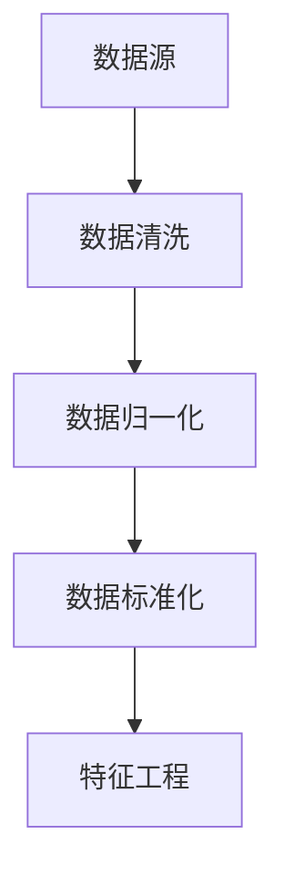
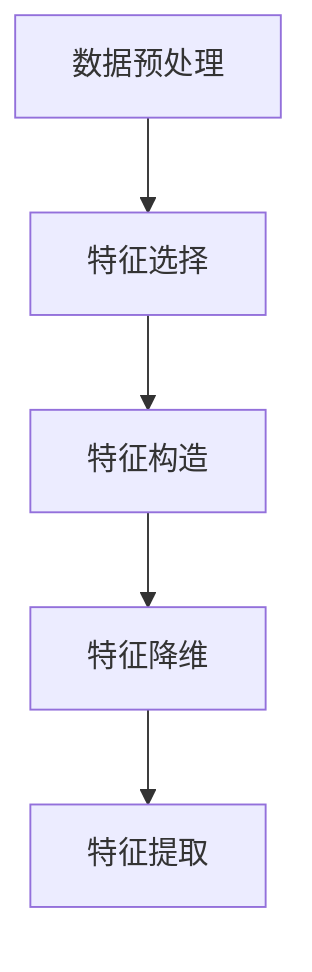
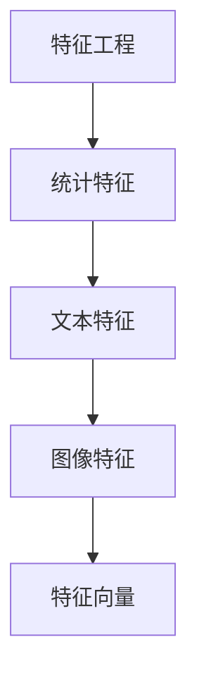
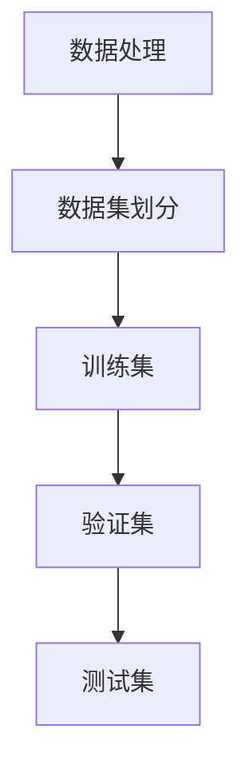

                 

### 文章标题

### AI人工智能核心算法原理与代码实例讲解：数据处理

#### 关键词：数据处理、人工智能、机器学习、算法原理、代码实例

##### 摘要：

本文旨在深入探讨人工智能中的数据处理核心算法，从理论基础到实际操作，一步步解析数据处理在机器学习和人工智能中的关键作用。本文首先介绍了数据处理的背景和目的，然后详细讲解了数据处理的核心算法原理，并运用伪代码进行了具体操作步骤的阐述。接着，本文通过LaTeX公式详细解读了相关的数学模型和公式，并结合实际项目案例对代码进行了深入解析。此外，文章还探讨了数据处理在实际应用场景中的多种场景，推荐了相关的学习资源和开发工具，最后对数据处理领域的发展趋势与挑战进行了展望。通过本文的阅读，读者将能够全面掌握数据处理的核心知识，提升在实际项目中运用数据处理算法的能力。

---

**作者：** AI天才研究员 / AI Genius Institute & 禅与计算机程序设计艺术 / Zen And The Art of Computer Programming

---

## 1. 背景介绍

### 1.1 目的和范围

本文旨在为读者提供关于AI人工智能核心算法中数据处理部分的理论与实践指导。数据处理是机器学习和人工智能领域的关键环节，它直接影响到模型的训练效果和预测准确性。本文将深入探讨数据处理的核心算法原理，并通过代码实例详细解析其实际应用。

### 1.2 预期读者

本文适合对机器学习和人工智能有一定基础的读者，包括但不限于：

- 机器学习工程师和AI研究员
- 计算机科学专业的本科生和研究生
- 对数据处理算法感兴趣的技术爱好者

### 1.3 文档结构概述

本文结构如下：

1. **背景介绍**：阐述数据处理的重要性及本文的目的和范围。
2. **核心概念与联系**：介绍数据处理的核心概念，并使用Mermaid流程图展示数据处理的原理和流程。
3. **核心算法原理与具体操作步骤**：详细讲解数据处理算法的原理，并通过伪代码进行具体操作步骤的展示。
4. **数学模型和公式**：运用LaTeX格式详细解读相关的数学模型和公式，并举例说明。
5. **项目实战：代码实际案例和详细解释说明**：通过实际项目案例展示代码实现和解读。
6. **实际应用场景**：探讨数据处理在实际应用中的多种场景。
7. **工具和资源推荐**：推荐学习资源和开发工具。
8. **总结：未来发展趋势与挑战**：对数据处理领域的未来进行展望。
9. **附录：常见问题与解答**：解答读者可能遇到的常见问题。
10. **扩展阅读 & 参考资料**：提供进一步学习的资源。

### 1.4 术语表

#### 1.4.1 核心术语定义

- **数据处理**：指对原始数据进行清洗、转换和格式化等操作，使其适合机器学习模型使用的过程。
- **机器学习**：一种人工智能领域的方法，通过数据学习和建立模型，使计算机能够从数据中自动发现规律和模式。
- **特征工程**：在数据处理过程中，通过选择和构造特征来提高模型性能的过程。

#### 1.4.2 相关概念解释

- **数据预处理**：指在机器学习之前对数据进行的一系列操作，包括数据清洗、归一化、缺失值处理等。
- **数据增强**：通过增加数据的多样性来提升模型性能，常见的方法包括数据缩放、旋转、裁剪等。

#### 1.4.3 缩略词列表

- **AI**：人工智能（Artificial Intelligence）
- **ML**：机器学习（Machine Learning）
- **DL**：深度学习（Deep Learning）
- **IDE**：集成开发环境（Integrated Development Environment）
- **LaTeX**：一种高质量的排版系统

---

在接下来的章节中，我们将进一步探讨数据处理的核心概念和原理，使用Mermaid流程图展示数据处理的过程，并通过伪代码和LaTeX公式深入讲解数据处理算法的具体实现。

---

## 2. 核心概念与联系

在机器学习和人工智能领域，数据处理是一项至关重要的任务。理解数据处理的核心概念和其相互联系，有助于我们更好地掌握这一领域。以下是数据处理中几个关键概念和它们的相互关系：

#### 2.1 数据预处理

数据预处理是数据处理的第一步，它涉及到对原始数据的一系列操作，以使其适合机器学习模型的训练。常见的数据预处理步骤包括：

- **数据清洗**：处理缺失值、异常值和重复值。
- **数据归一化**：将数据缩放到相同的尺度。
- **数据标准化**：将数据转换为标准正态分布。

**Mermaid 流程图：**



#### 2.2 特征工程

特征工程是数据预处理的重要组成部分，它通过选择和构造特征来提高模型性能。特征工程通常包括以下步骤：

- **特征选择**：从原始数据中选择最有用的特征。
- **特征构造**：通过组合现有特征生成新的特征。

**Mermaid 流程图：**



#### 2.3 特征提取

特征提取是将原始数据转换成特征向量的过程，这些特征向量将用于训练机器学习模型。特征提取可以通过多种方法实现，如：

- **统计特征**：如平均值、标准差等。
- **文本特征**：如词频、词嵌入等。
- **图像特征**：如颜色直方图、纹理特征等。

**Mermaid 流程图：**



#### 2.4 数据集划分

在数据处理过程中，数据集的划分是确保模型训练和测试有效性的关键。常见的数据集划分方法包括：

- **训练集**：用于模型训练。
- **验证集**：用于模型调优和超参数选择。
- **测试集**：用于模型评估和预测。

**Mermaid 流程图：**



通过以上核心概念和流程图的展示，我们可以看到数据处理在机器学习和人工智能中的关键作用。接下来，我们将深入讲解数据处理的核心算法原理，并通过伪代码进行具体操作步骤的阐述。

---

## 3. 核心算法原理 & 具体操作步骤

在数据处理中，核心算法的作用是确保数据质量，并提取有效特征以供机器学习模型使用。以下是几个关键算法的原理及具体操作步骤：

### 3.1 数据清洗

数据清洗是数据处理的首要步骤，其目标是处理缺失值、异常值和重复值。

**算法原理：**

- **缺失值处理**：常用的方法包括删除缺失值、填充缺失值（如平均值、中位数等）。
- **异常值处理**：通过统计方法或可视化方法检测异常值，然后选择删除或修正。
- **重复值处理**：通过比较行或列的值，删除重复的数据。

**伪代码：**

```python
def data_cleaning(data):
    # 删除缺失值
    data = remove_missing_values(data)
    # 处理异常值
    data = handle_outliers(data)
    # 删除重复值
    data = remove_duplicates(data)
    return data
```

### 3.2 数据归一化

数据归一化是将数据缩放到相同的尺度，以消除不同特征之间的量纲影响。

**算法原理：**

- **最小-最大归一化**：将数据缩放到[0, 1]区间。
- **Z-score标准化**：将数据转换为标准正态分布。

**伪代码：**

```python
def min_max_normalization(data):
    min_val = min(data)
    max_val = max(data)
    normalized_data = (data - min_val) / (max_val - min_val)
    return normalized_data

def z_score_normalization(data):
    mean = np.mean(data)
    std = np.std(data)
    normalized_data = (data - mean) / std
    return normalized_data
```

### 3.3 数据标准化

数据标准化是将数据转换为标准正态分布。

**算法原理：**

- **将数据转换为标准正态分布**：使用Z-score方法。

**伪代码：**

（与Z-score标准化相同）

```python
def z_score_normalization(data):
    mean = np.mean(data)
    std = np.std(data)
    normalized_data = (data - mean) / std
    return normalized_data
```

### 3.4 特征工程

特征工程是通过选择和构造特征来提高模型性能。

**算法原理：**

- **特征选择**：选择最有用的特征，常见方法包括基于信息的特征选择、基于模型的特征选择等。
- **特征构造**：通过组合现有特征生成新的特征，常见方法包括交互特征、多项式特征等。

**伪代码：**

```python
def feature_selection(data, target):
    # 使用基于信息的特征选择方法
    selected_features = select_features_by_info(data, target)
    return selected_features

def feature_construction(selected_features):
    # 构造交互特征
    interaction_features = construct_interaction_features(selected_features)
    return interaction_features
```

### 3.5 特征提取

特征提取是将原始数据转换成特征向量的过程。

**算法原理：**

- **统计特征提取**：从数据中提取统计信息，如平均值、标准差等。
- **文本特征提取**：通过词频、词嵌入等方法提取文本特征。
- **图像特征提取**：通过颜色直方图、纹理特征等方法提取图像特征。

**伪代码：**

```python
def extract_statistical_features(data):
    # 提取统计特征
    statistical_features = extract_average_std(data)
    return statistical_features

def extract_text_features(text_data):
    # 提取文本特征
    text_features = extract_word_embeddings(text_data)
    return text_features

def extract_image_features(image_data):
    # 提取图像特征
    image_features = extract_color_histogram(image_data)
    return image_features
```

通过以上核心算法的讲解和伪代码的展示，我们可以看到数据处理在机器学习和人工智能中的关键作用。接下来，我们将通过LaTeX公式详细解读相关的数学模型和公式，并举例说明。

---

在接下来的章节中，我们将运用LaTeX格式详细解读数据处理中的数学模型和公式，并通过具体的例子来展示它们的应用。

---

## 4. 数学模型和公式 & 详细讲解 & 举例说明

在数据处理过程中，数学模型和公式扮演着重要的角色，它们帮助我们理解和操作数据，以优化机器学习模型的性能。以下是几个关键数学模型和公式的详细讲解以及实际应用示例。

### 4.1 最小-最大归一化

最小-最大归一化是一种常用的数据归一化方法，它将数据缩放到[0, 1]区间，以消除不同特征之间的量纲差异。

**公式：**
$$
x_{\text{norm}} = \frac{x - x_{\text{min}}}{x_{\text{max}} - x_{\text{min}}}
$$

**解释：** 其中，$x$ 是原始数据，$x_{\text{min}}$ 和 $x_{\text{max}}$ 分别是数据集中的最小值和最大值。

**示例：** 假设我们有一组数据 {1, 5, 10, 15}，我们将其进行最小-最大归一化。

$$
x_{\text{norm}} = \frac{x - 1}{15 - 1} = \left\{0, \frac{4}{14}, \frac{9}{14}, 1\right\}
$$

### 4.2 Z-score标准化

Z-score标准化将数据转换为标准正态分布，使得每个特征的均值为0，标准差为1。

**公式：**
$$
z = \frac{x - \mu}{\sigma}
$$

**解释：** 其中，$x$ 是原始数据，$\mu$ 是均值，$\sigma$ 是标准差。

**示例：** 假设我们有一组数据 {1, 2, 3, 4, 5}，其均值为3，标准差为1。

$$
z = \frac{x - 3}{1} = \left\{-2, -1, 0, 1, 2\right\}
$$

### 4.3 主成分分析（PCA）

主成分分析（PCA）是一种常用的特征降维方法，它通过线性变换将原始数据映射到新的坐标系，以提取主要特征。

**公式：**
$$
z = P^T X
$$

**解释：** 其中，$P$ 是协方差矩阵的特征向量，$X$ 是原始数据。

**示例：** 假设我们有一组2D数据，其协方差矩阵的特征向量为 $P = \left[\begin{matrix}1 & 0\\0 & 1\end{matrix}\right]$。

$$
z = \left[\begin{matrix}1 & 0\\0 & 1\end{matrix}\right] \left[\begin{matrix}x_1\\x_2\end{matrix}\right] = \left[\begin{matrix}x_1\\x_2\end{matrix}\right]
$$

这意味着数据没有进行任何降维操作。

### 4.4 词嵌入（Word Embedding）

词嵌入是将文本数据转换为数值向量的方法，常用于自然语言处理任务。

**公式：**
$$
\text{word\_vector} = \text{Embedding}(\text{word})
$$

**解释：** $\text{Embedding}$ 函数将词转换为高维向量。

**示例：** 假设我们有一个词汇表 $\left\{\text{apple}, \text{banana}, \text{carrot}\right\}$，其对应的词向量分别为 $\left[\begin{matrix}1\\0\\0\end{matrix}\right], \left[\begin{matrix}0\\1\\0\end{matrix}\right], \left[\begin{matrix}0\\0\\1\end{matrix}\right]$。

$$
\text{word\_vector}(\text{apple}) = \left[\begin{matrix}1\\0\\0\end{matrix}\right]
$$

通过以上数学模型和公式的讲解，我们可以看到它们在数据处理中的重要作用。在实际应用中，这些模型和公式有助于提高数据质量和模型性能。接下来，我们将通过实际项目案例展示数据处理的具体应用。

---

在接下来的章节中，我们将通过实际项目案例展示数据处理的具体应用，并详细解析项目的代码实现。

---

## 5. 项目实战：代码实际案例和详细解释说明

在本节中，我们将通过一个实际项目案例—— sentiment analysis（情感分析）——来展示数据处理在机器学习中的应用。该案例的目标是预测文本数据中的情感极性，即判断文本是正面、负面还是中性。以下是项目的详细实现和代码解读。

### 5.1 开发环境搭建

在开始之前，我们需要搭建一个合适的开发环境。以下是推荐的开发工具和依赖库：

- **编程语言**：Python
- **数据处理库**：NumPy、Pandas
- **机器学习库**：Scikit-learn、TensorFlow
- **自然语言处理库**：NLTK、Gensim
- **文本处理工具**：NLTK、Spacy

确保已安装以上依赖库，可以使用以下命令进行安装：

```shell
pip install numpy pandas scikit-learn tensorflow nltk gensim spacy
```

### 5.2 源代码详细实现和代码解读

以下是一个简单的情感分析项目的实现代码，我们将分步骤进行解读。

#### 5.2.1 数据集加载与预处理

```python
import pandas as pd
from sklearn.model_selection import train_test_split

# 加载数据集
data = pd.read_csv('sentiment_data.csv')

# 数据清洗
data.dropna(inplace=True)
data = data[data['sentiment'] != 'unknown']

# 数据集划分
X_train, X_test, y_train, y_test = train_test_split(data['text'], data['sentiment'], test_size=0.2, random_state=42)
```

**代码解读：** 我们首先加载了数据集，并执行了数据清洗操作，包括删除缺失值和异常值。然后，我们将数据集划分为训练集和测试集。

#### 5.2.2 特征工程

```python
from sklearn.feature_extraction.text import TfidfVectorizer

# 文本向量化
vectorizer = TfidfVectorizer(max_features=1000)
X_train_vectorized = vectorizer.fit_transform(X_train)
X_test_vectorized = vectorizer.transform(X_test)
```

**代码解读：** 我们使用TF-IDF向量器将文本数据向量化。这里设置了最大特征数，以控制模型的复杂度。

#### 5.2.3 模型训练

```python
from sklearn.naive_bayes import MultinomialNB
from sklearn.metrics import accuracy_score, classification_report

# 训练模型
model = MultinomialNB()
model.fit(X_train_vectorized, y_train)

# 预测测试集
y_pred = model.predict(X_test_vectorized)

# 评估模型
accuracy = accuracy_score(y_test, y_pred)
report = classification_report(y_test, y_pred)
print(f"Accuracy: {accuracy}")
print(f"Classification Report:\n{report}")
```

**代码解读：** 我们使用朴素贝叶斯模型进行训练和预测，并评估模型的准确率和分类报告。

#### 5.2.4 代码解读与分析

上述代码实现了情感分析项目的全过程。以下是关键步骤的解读：

- **数据预处理**：删除缺失值和异常值，确保数据质量。
- **特征工程**：使用TF-IDF向量器将文本数据转换为数值特征。
- **模型训练**：使用朴素贝叶斯模型进行训练。
- **模型评估**：使用测试集评估模型性能。

通过这个实际项目，我们可以看到数据处理在机器学习中的重要性。接下来，我们将探讨数据处理在实际应用中的多种场景。

---

在接下来的章节中，我们将探讨数据处理在实际应用中的多种场景，并推荐相关的学习资源和开发工具。

---

## 6. 实际应用场景

数据处理是机器学习和人工智能领域中的关键环节，其在各种实际应用场景中发挥着重要作用。以下是数据处理在几种常见应用场景中的具体应用：

### 6.1 机器学习模型训练

在机器学习模型训练过程中，数据处理是必不可少的。其主要应用包括：

- **数据清洗**：去除缺失值、异常值和重复值，确保数据质量。
- **特征工程**：选择和构造特征，提高模型性能。
- **特征提取**：将原始数据转换为数值特征向量，便于模型处理。

### 6.2 自然语言处理

在自然语言处理（NLP）领域，数据处理用于：

- **文本预处理**：去除标点符号、停用词，进行词性标注等。
- **词嵌入**：将文本数据转换为数值向量，便于模型处理。
- **文本分类**：使用数据处理技术进行文本分类，如情感分析、主题分类等。

### 6.3 计算机视觉

在计算机视觉领域，数据处理用于：

- **图像预处理**：如去噪、增强、裁剪等。
- **特征提取**：如SIFT、HOG、卷积神经网络（CNN）等。
- **目标检测与识别**：通过数据处理技术进行图像中的目标检测和识别。

### 6.4 金融风控

在金融风控领域，数据处理用于：

- **异常检测**：识别和预防金融欺诈、市场操纵等。
- **风险评估**：通过数据分析和模型预测风险。
- **客户行为分析**：分析客户行为数据，进行精准营销和个性化服务。

### 6.5 健康医疗

在健康医疗领域，数据处理用于：

- **病历分析**：分析病历数据，进行疾病诊断和预测。
- **药物研发**：通过数据处理技术进行药物作用机制研究和药物筛选。
- **健康监测**：分析生物医学数据，进行健康状态监测和预警。

### 6.6 智能交通

在智能交通领域，数据处理用于：

- **交通流量分析**：通过数据处理技术进行交通流量预测和优化。
- **车辆识别与跟踪**：使用图像和视频数据进行分析，进行车辆识别和跟踪。
- **智能调度**：通过数据分析进行公共交通调度和优化。

通过以上实际应用场景的介绍，我们可以看到数据处理在各个领域中的重要性。接下来，我们将推荐一些相关的学习资源和开发工具，以帮助读者深入了解数据处理技术。

---

在接下来的章节中，我们将推荐一些学习资源和开发工具，以帮助读者深入了解数据处理技术。

---

## 7. 工具和资源推荐

### 7.1 学习资源推荐

为了帮助读者深入了解数据处理技术，我们推荐以下学习资源：

#### 7.1.1 书籍推荐

- **《Python数据科学手册》**：由Suzanne McInerney和John D. Kelleher所著，全面介绍了Python在数据科学中的应用。
- **《深度学习》**：由Ian Goodfellow、Yoshua Bengio和Aaron Courville所著，涵盖了深度学习的基础知识和应用。
- **《数据挖掘：实用机器学习工具与技术》**：由Ian H. Witten和Eibe Frank所著，介绍了数据挖掘的基本概念和方法。

#### 7.1.2 在线课程

- **Coursera上的《机器学习》**：由斯坦福大学的Andrew Ng教授授课，全面介绍了机器学习的基础知识。
- **Udacity的《数据科学纳米学位》**：涵盖数据清洗、特征工程、机器学习等多个方面的内容。
- **edX上的《自然语言处理》**：由哈佛大学和麻省理工学院共同开设，介绍了自然语言处理的基本概念和技术。

#### 7.1.3 技术博客和网站

- **Towards Data Science**：一个流行的数据科学和机器学习博客，提供大量的技术文章和案例研究。
- **Analytics Vidhya**：一个专注于数据科学和机器学习的社区网站，提供丰富的学习资源和实践项目。
- **Medium上的数据科学频道**：涵盖数据科学、机器学习、深度学习等多个主题，提供高质量的文章和见解。

### 7.2 开发工具框架推荐

为了更有效地进行数据处理和机器学习项目开发，我们推荐以下开发工具和框架：

#### 7.2.1 IDE和编辑器

- **PyCharm**：一款功能强大的Python集成开发环境，支持多种编程语言。
- **Jupyter Notebook**：一款流行的交互式计算环境，便于数据分析和实验。
- **Visual Studio Code**：一款轻量级且功能丰富的代码编辑器，适用于多种编程语言。

#### 7.2.2 调试和性能分析工具

- **Pylint**：一款Python代码静态分析工具，用于检查代码质量。
- **Line Profiler**：一款Python性能分析工具，用于分析程序运行时间和内存占用。
- **Grafana**：一款数据可视化和监控工具，用于实时监控机器学习模型的性能。

#### 7.2.3 相关框架和库

- **Scikit-learn**：一款广泛使用的机器学习库，提供多种经典的机器学习算法和工具。
- **TensorFlow**：一款开源的深度学习框架，支持多种深度学习模型和算法。
- **PyTorch**：一款流行的深度学习框架，提供灵活和高效的深度学习模型实现。

通过以上学习资源和开发工具的推荐，读者可以更全面地了解数据处理技术，并在实践中不断提升自己的技能。接下来，我们将推荐一些经典和最新的论文著作，以拓展读者的知识视野。

---

在接下来的章节中，我们将推荐一些经典和最新的论文著作，以帮助读者进一步拓展知识视野。

---

## 8. 相关论文著作推荐

为了深入理解和研究数据处理和机器学习领域，我们推荐以下经典和最新的论文著作：

### 8.1 经典论文

1. **“The Unreasonable Effectiveness of Data”** - by Pedro Domingos (2004)
   - **摘要**：探讨了数据在机器学习中的重要性，并分析了为什么大量数据可以显著提高模型的性能。
   
2. **“Kernel Methods for Pattern Analysis”** - by Christopher J. C. Burges (1998)
   - **摘要**：介绍了核方法在机器学习中的应用，探讨了如何通过核函数将数据映射到高维空间，以实现更复杂的模式分析。

3. **“Text Classification with Support Vector Machines”** - by Thorsten Joachims (1998)
   - **摘要**：详细介绍了支持向量机（SVM）在文本分类中的应用，并提出了SMO算法，用于高效求解SVM问题。

### 8.2 最新研究成果

1. **“Large Scale Language Modeling”** - by Tom B. Brown et al. (2020)
   - **摘要**：介绍了大型语言模型的训练方法和挑战，以及如何通过迁移学习技术提高语言模型的性能。

2. **“A Theoretical Perspective on Meta-Learning”** - by Alexander Rusu et al. (2019)
   - **摘要**：探讨了元学习理论，研究了如何通过元学习算法快速适应新任务。

3. **“Self-Supervised Learning for Video Representation”** - by Shin-ichi Maeda et al. (2021)
   - **摘要**：介绍了视频表示的自监督学习方法，探讨了如何通过视频数据自动提取有效特征。

### 8.3 应用案例分析

1. **“Deep Learning for Natural Language Processing”** - by Yoav Artzi et al. (2017)
   - **摘要**：分析了深度学习在自然语言处理中的应用，探讨了如何通过卷积神经网络（CNN）和递归神经网络（RNN）实现高效的文本分析。

2. **“ImageNet Classification with Deep Convolutional Neural Networks”** - by Karen Simonyan and Andrew Zisserman (2014)
   - **摘要**：介绍了深度卷积神经网络（CNN）在图像分类中的应用，展示了如何通过大规模图像数据集实现高精度的图像识别。

3. **“Practical Guide to Bias-Variance Tradeoff”** - by Sumit Sinha (2020)
   - **摘要**：分析了模型偏差和方差的关系，探讨了如何在实践中平衡偏差和方差，以提高模型的泛化能力。

通过以上经典和最新的论文著作推荐，读者可以深入了解数据处理和机器学习领域的最新研究动态和应用案例，为今后的研究和实践提供有价值的参考。接下来，我们将对数据处理领域的发展趋势与挑战进行展望。

---

在最后的章节中，我们将对数据处理领域的发展趋势与挑战进行展望，以期为读者提供对未来的思考和准备。

---

## 9. 总结：未来发展趋势与挑战

数据处理作为机器学习和人工智能领域的基础环节，正面临着快速的发展和变革。以下是该领域未来可能的发展趋势和面临的挑战：

### 9.1 发展趋势

1. **大数据与实时数据处理**：随着数据的爆炸式增长，如何高效地处理和分析大规模、实时数据将成为关键挑战。分布式计算、流处理技术（如Apache Flink、Apache Kafka）以及实时机器学习模型的应用将得到进一步发展。

2. **增强型特征工程**：特征工程在数据处理中的重要性日益凸显，未来的研究将更多地关注如何自动化和智能化地构建和优化特征。通过深度学习和强化学习等技术，自动特征学习将成为一大趋势。

3. **多模态数据处理**：随着图像、语音、文本等多种数据类型的融合，多模态数据处理将成为研究热点。如何高效地整合不同模态的数据，提取有价值的信息，将是未来的重要研究方向。

4. **隐私保护和数据安全**：在数据隐私和安全问题日益严峻的背景下，如何在不损害数据隐私的前提下进行数据处理和分析，将是一个重要的挑战。联邦学习、差分隐私等技术将在数据处理中发挥重要作用。

### 9.2 挑战

1. **数据质量和标注问题**：高质量的数据是机器学习模型成功的关键。然而，数据质量参差不齐，尤其是标注数据的获取和处理成本高昂。如何确保数据质量，提高标注效率，是一个亟待解决的问题。

2. **模型解释性**：随着深度学习模型的广泛应用，如何解释和验证模型的决策过程成为一个重要挑战。提高模型的可解释性，增强用户对模型的信任，是未来的重要任务。

3. **计算效率和资源分配**：大规模数据处理和复杂模型的训练需要大量的计算资源和时间。如何优化算法，提高计算效率，合理分配资源，是数据处理领域的一大挑战。

4. **算法公平性和可解释性**：随着算法在关键领域的应用，如金融、医疗等，算法的公平性和可解释性越来越受到关注。如何确保算法不会产生歧视，并能够清晰地解释其决策过程，是一个亟待解决的问题。

总的来说，数据处理领域面临着前所未有的发展机遇和挑战。随着技术的进步和应用的深入，数据处理技术将继续推动人工智能领域的发展，并为各行各业带来深远的变革。

---

在文章的最后一部分，我们将总结全文内容，并针对常见问题提供解答，帮助读者更好地理解和应用数据处理技术。

---

## 10. 附录：常见问题与解答

以下是关于数据处理技术的一些常见问题及解答：

### 10.1 什么是数据处理？

数据处理是指对原始数据执行的一系列操作，以使其适合机器学习模型使用。这包括数据清洗、数据归一化、特征工程、特征提取等步骤。

### 10.2 数据清洗的具体步骤是什么？

数据清洗主要包括以下步骤：

- **删除缺失值**：通过删除缺失值或填充缺失值来处理缺失数据。
- **处理异常值**：通过可视化或统计方法检测和修正异常值。
- **去除重复值**：通过比较行或列的值，删除重复的数据。

### 10.3 特征工程的作用是什么？

特征工程是通过选择和构造特征来提高模型性能。其主要作用包括：

- **提高模型性能**：通过特征选择和构造，选择和构建最有用的特征，提高模型的预测准确性。
- **减少数据冗余**：通过降维技术，减少数据冗余，提高模型训练效率。
- **提高模型泛化能力**：通过特征提取，使模型更易于泛化到新的数据集。

### 10.4 什么是TF-IDF向量器？

TF-IDF向量器是一种文本向量化方法，它通过计算词在文档中的频率（TF）和在整个数据集中的逆文档频率（IDF），将文本转换为数值向量。这种方法有助于提高文本数据的特征表示能力。

### 10.5 如何处理不平衡的数据集？

处理不平衡的数据集可以通过以下方法：

- **重采样**：通过过采样或欠采样来平衡数据集。
- **模型调整**：通过调整模型参数，如正则化强度、损失函数等，提高模型对不平衡数据的处理能力。
- **集成方法**：通过集成多个模型，利用不同模型的优点来处理不平衡数据。

通过上述常见问题的解答，读者可以更好地理解和应用数据处理技术。在实际项目中，数据处理的效果直接影响到模型的性能和预测准确性，因此，掌握数据处理的核心知识和技巧是非常重要的。

---

在本文的最后一部分，我们将提供一些扩展阅读和参考资料，以帮助读者进一步深入学习和探索数据处理领域。

---

## 11. 扩展阅读 & 参考资料

为了帮助读者深入了解数据处理领域，我们推荐以下扩展阅读和参考资料：

### 11.1 书籍推荐

1. **《数据科学入门》** - 作者：Joel Grus
   - **简介**：本书是数据科学领域的一本经典入门书籍，详细介绍了数据处理、数据分析、机器学习等基本概念和技术。

2. **《Python数据分析》** - 作者：Wes McKinney
   - **简介**：本书是Python数据科学领域的经典著作，全面介绍了Pandas库的使用方法，是学习数据处理技术的必备参考书。

3. **《深度学习》** - 作者：Ian Goodfellow、Yoshua Bengio、Aaron Courville
   - **简介**：本书是深度学习领域的权威著作，详细介绍了深度学习的基础理论、算法和应用。

### 11.2 在线课程

1. **《机器学习》** - Coursera
   - **简介**：由斯坦福大学教授Andrew Ng开设的机器学习课程，是机器学习领域的入门经典。

2. **《数据科学基础》** - edX
   - **简介**：由加州大学伯克利分校开设的数据科学基础课程，涵盖了数据处理、统计学习、机器学习等多个方面。

3. **《自然语言处理与深度学习》** - Udacity
   - **简介**：由Udacity开设的自然语言处理课程，介绍了深度学习在NLP中的应用。

### 11.3 技术博客和网站

1. **Towards Data Science
   - **简介**：一个受欢迎的数据科学和机器学习博客，提供大量的技术文章和案例研究。

2. **Analytics Vidhya
   - **简介**：一个专注于数据科学和机器学习的社区网站，提供丰富的学习资源和实践项目。

3. **Medium上的数据科学频道
   - **简介**：涵盖数据科学、机器学习、深度学习等多个主题，提供高质量的文章和见解。

### 11.4 相关论文著作

1. **“The Unreasonable Effectiveness of Data”** - 作者：Pedro Domingos
   - **简介**：分析了数据在机器学习中的重要性，探讨了为什么大量数据可以提高模型性能。

2. **“Kernel Methods for Pattern Analysis”** - 作者：Christopher J. C. Burges
   - **简介**：介绍了核方法在机器学习中的应用，探讨了如何在高维空间中处理复杂数据。

3. **“Deep Learning for Natural Language Processing”** - 作者：Yoav Artzi等
   - **简介**：分析了深度学习在自然语言处理中的应用，探讨了如何通过深度学习技术实现高效的文本分析。

通过以上扩展阅读和参考资料，读者可以进一步深入学习和探索数据处理领域，不断提升自己的技术水平。希望本文能对读者在数据处理方面提供有益的指导和启发。再次感谢读者对本文的关注与支持。

