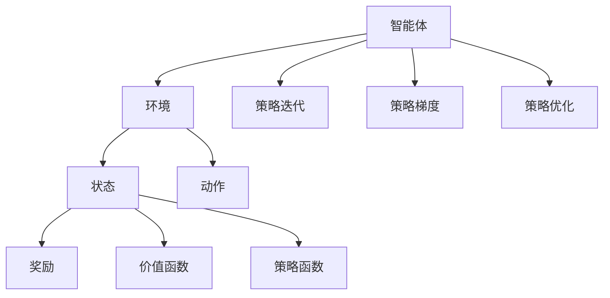

                 

# AI人工智能核心算法原理与代码实例讲解：策略优化

> **关键词：**AI、人工智能、策略优化、算法、深度学习、代码实例

> **摘要：**本文将深入探讨策略优化的核心原理，通过详细的代码实例，帮助读者理解并掌握这一关键技术。我们将逐步分析策略优化算法的数学模型、实现步骤，并结合实际项目案例进行详细解读，旨在为人工智能开发者提供实用的指导。

## 1. 背景介绍

### 1.1 目的和范围

本文旨在向读者介绍策略优化在人工智能领域的核心原理与应用。策略优化是强化学习中的重要一环，通过调整策略函数，使智能体能够更好地适应环境，实现长期的收益最大化。本文将聚焦于以下内容：

1. **核心概念与联系**：介绍策略优化的基本概念及其与其他人工智能技术的关联。
2. **核心算法原理**：详细讲解策略优化算法的数学模型与实现步骤。
3. **数学模型和公式**：阐述策略优化相关的数学公式，并进行举例说明。
4. **项目实战**：通过实际代码案例，展示策略优化的应用。
5. **实际应用场景**：探讨策略优化在不同领域中的应用。
6. **工具和资源推荐**：推荐学习资源和开发工具，为读者提供进一步学习的机会。
7. **总结**：展望策略优化的未来发展趋势与挑战。

### 1.2 预期读者

本文适用于对人工智能有一定了解，希望深入学习和掌握策略优化技术的开发者与研究人员。特别是那些对强化学习、深度学习感兴趣的读者，将能够从本文中获得丰富的知识和实践经验。

### 1.3 文档结构概述

本文将分为以下几个部分：

1. **背景介绍**：介绍文章的目的、范围、预期读者及文档结构。
2. **核心概念与联系**：通过Mermaid流程图展示策略优化的核心概念与联系。
3. **核心算法原理**：详细讲解策略优化算法的原理与实现步骤。
4. **数学模型和公式**：阐述策略优化相关的数学模型与公式。
5. **项目实战**：通过代码实例展示策略优化的实际应用。
6. **实际应用场景**：讨论策略优化在不同领域的应用。
7. **工具和资源推荐**：推荐学习资源、开发工具和相关论文。
8. **总结**：总结文章内容，展望未来发展趋势。
9. **附录**：提供常见问题与解答。
10. **扩展阅读**：推荐相关参考资料。

### 1.4 术语表

#### 1.4.1 核心术语定义

- **策略优化**：指通过调整策略函数，使智能体能够更好地适应环境，实现长期的收益最大化。
- **强化学习**：一种机器学习方法，通过学习与环境交互，优化决策过程。
- **策略函数**：定义了智能体在不同状态下的行为。
- **价值函数**：表示智能体在某一状态下的最优收益。

#### 1.4.2 相关概念解释

- **策略梯度**：用于计算策略函数的梯度，以指导策略的调整。
- **策略迭代**：通过反复迭代策略函数，逐步优化策略的过程。

#### 1.4.3 缩略词列表

- **Q-learning**：一种基于价值函数的策略优化算法。
- **REINFORCE**：一种基于策略梯度的策略优化算法。

## 2. 核心概念与联系

策略优化是强化学习中的重要组成部分，其核心在于通过优化策略函数，使智能体能够更好地适应环境，实现长期收益最大化。为了更好地理解策略优化的原理，我们可以通过以下Mermaid流程图展示其核心概念与联系：



### 2.1 智能体与环境

智能体（Agent）是策略优化的主体，它根据环境（Environment）提供的当前状态（State）进行决策，选择合适的动作（Action）。智能体在执行动作后，会收到环境反馈的奖励（Reward）。

### 2.2 状态与动作

状态（State）描述了环境的当前状态，动作（Action）是智能体在某一状态下采取的行动。状态和动作共同构成了智能体与环境交互的基础。

### 2.3 奖励与价值函数

奖励（Reward）是环境对智能体动作的反馈，反映了动作的优劣。价值函数（Value Function）表示智能体在某一状态下的最优收益，用于指导策略的调整。

### 2.4 策略函数

策略函数（Policy Function）定义了智能体在不同状态下的行为。通过优化策略函数，可以使智能体在长期内获得更好的收益。

### 2.5 策略迭代与策略梯度

策略迭代（Policy Iteration）是一种优化策略函数的过程，通过反复迭代，逐步优化策略。策略梯度（Policy Gradient）用于计算策略函数的梯度，以指导策略的调整。

### 2.6 策略优化

策略优化（Policy Optimization）是强化学习中的重要环节，通过优化策略函数，使智能体能够更好地适应环境，实现长期收益最大化。

## 3. 核心算法原理 & 具体操作步骤

策略优化算法是强化学习中的重要组成部分，其核心在于通过优化策略函数，使智能体能够更好地适应环境，实现长期的收益最大化。在本节中，我们将详细讲解策略优化算法的原理和具体操作步骤。

### 3.1 策略优化算法原理

策略优化算法基于强化学习的基本思想，通过学习环境中的状态和动作，优化策略函数。策略函数定义了智能体在不同状态下的行为，使其在长期内获得更好的收益。策略优化算法主要包括以下步骤：

1. **初始化**：初始化策略函数、价值函数和智能体参数。
2. **策略迭代**：通过反复迭代策略函数，逐步优化策略。
3. **策略梯度计算**：计算策略函数的梯度，以指导策略的调整。
4. **策略更新**：根据策略梯度更新策略函数，优化智能体行为。

### 3.2 具体操作步骤

下面是策略优化算法的具体操作步骤：

#### 步骤1：初始化

初始化策略函数、价值函数和智能体参数。策略函数通常表示为π(s,a)，其中s表示状态，a表示动作。价值函数表示为V(s)，表示智能体在状态s下的最优收益。

```python
# 初始化策略函数
π(s, a) = random()

# 初始化价值函数
V(s) = 0

# 初始化智能体参数
θ = [0, 0, ..., 0]
```

#### 步骤2：策略迭代

通过反复迭代策略函数，逐步优化策略。在每次迭代中，智能体根据当前策略选择动作，与环境交互，收集奖励和状态信息。

```python
for epoch in range(num_epochs):
    for s in states:
        a = π(s, θ)
        r, s' = environment.step(s, a)
        V(s) = V(s) + α[V(s') - V(s)]
        π(s, θ) = π(s, θ) + η[V(s') - V(s)]
```

#### 步骤3：策略梯度计算

计算策略函数的梯度，以指导策略的调整。策略梯度计算基于策略梯度定理，通过梯度上升法或梯度下降法进行优化。

```python
# 计算策略梯度
gradient = ∇θ[log π(s, θ)]

# 梯度上升法
θ = θ + η*gradient

# 梯度下降法
θ = θ - η*gradient
```

#### 步骤4：策略更新

根据策略梯度更新策略函数，优化智能体行为。更新策略函数后，智能体将根据新策略选择动作，与环境进行交互。

```python
# 更新策略函数
π(s, θ) = π(s, θ) + η*gradient
```

### 3.3 策略优化算法实现

以下是一个简单的策略优化算法实现示例：

```python
import numpy as np

# 初始化参数
num_states = 10
num_actions = 5
learning_rate = 0.1
discount_factor = 0.99

# 初始化策略函数和价值函数
π = np.random.rand(num_states, num_actions)
V = np.zeros(num_states)

# 策略优化算法
for epoch in range(1000):
    for s in range(num_states):
        a = np.argmax(π[s, :])
        r, s' = environment.step(s, a)
        V[s] = V[s] + learning_rate*(r + discount_factor*V[s'] - V[s])
        π[s, a] = π[s, a] + learning_rate*(1 - π[s, a])

# 输出策略函数和价值函数
print("Policy Function:")
print(π)
print("Value Function:")
print(V)
```

### 3.4 策略优化算法评估

策略优化算法的性能可以通过以下指标进行评估：

- **收益**：智能体在长期运行过程中获得的平均收益。
- **策略稳定性**：策略函数在多次迭代后是否收敛，以及收敛的速度。
- **价值函数稳定性**：价值函数在多次迭代后是否收敛，以及收敛的速度。

通过评估策略优化算法的性能，可以进一步优化算法参数，提高算法的鲁棒性和适应性。

## 4. 数学模型和公式 & 详细讲解 & 举例说明

策略优化算法的核心在于调整策略函数，使其在长期内实现收益最大化。为了更好地理解策略优化的数学原理，我们将介绍与策略优化相关的主要数学模型和公式，并进行详细讲解和举例说明。

### 4.1 策略优化数学模型

策略优化算法基于以下数学模型：

$$
J(θ) = \sum_{s,a} π(s,a|θ) * Q(s,a;θ)
$$

其中，$J(θ)$ 表示策略函数的损失函数，$π(s,a|θ)$ 表示策略函数，$Q(s,a;θ)$ 表示状态-动作值函数。

### 4.2 策略函数和状态-动作值函数

策略函数π(s,a|θ)表示智能体在状态s下采取动作a的概率分布，可以表示为：

$$
π(s,a|θ) = \frac{exp(Q(s,a;θ))}{\sum_{a'} exp(Q(s,a';θ))}
$$

状态-动作值函数Q(s,a;θ)表示智能体在状态s下采取动作a的期望收益，可以表示为：

$$
Q(s,a;θ) = \sum_{s'} P(s'|s,a;θ) * [R(s',a) + γ * max_{a'} Q(s',a';θ)]
$$

其中，$P(s'|s,a;θ)$ 表示智能体从状态s采取动作a后到达状态$s'$的概率，$R(s',a)$ 表示智能体在状态$s'$下采取动作a的即时奖励，$γ$ 表示折扣因子。

### 4.3 损失函数和梯度下降法

策略优化算法的目标是优化策略函数，使其损失函数最小化。损失函数J(θ)可以表示为：

$$
J(θ) = \sum_{s,a} π(s,a|θ) * (R(s,a;θ) - Q(s,a;θ))
$$

为了最小化损失函数，我们可以使用梯度下降法。梯度下降法的基本思想是沿着损失函数的梯度方向调整参数，以最小化损失函数。

$$
θ = θ - η * \nabla_θ J(θ)
$$

其中，$η$ 表示学习率，$\nabla_θ J(θ)$ 表示损失函数关于参数θ的梯度。

### 4.4 示例说明

假设我们有一个简单的环境，其中智能体可以选择两种动作：上移或下移。状态空间为{0, 1, 2, 3}，动作空间为{上移，下移}。即时奖励为1，当智能体达到状态3时，奖励为10。折扣因子为0.9。

#### 状态-动作值函数计算

首先，我们需要计算状态-动作值函数。假设初始状态-动作值函数为$Q(s,a;θ) = 0$。

对于状态0：

$$
Q(0, 上移;θ) = 0.5 * 1 + 0.5 * 0 = 0.5
$$

$$
Q(0, 下移;θ) = 0.5 * (-1) + 0.5 * 0 = -0.5
$$

对于状态1：

$$
Q(1, 上移;θ) = 0.5 * 1 + 0.5 * 0.5 = 0.75
$$

$$
Q(1, 下移;θ) = 0.5 * (-1) + 0.5 * 0.5 = -0.25
$$

对于状态2：

$$
Q(2, 上移;θ) = 0.5 * 1 + 0.5 * 0.75 = 1.125
$$

$$
Q(2, 下移;θ) = 0.5 * (-1) + 0.5 * 0.75 = -0.125
$$

对于状态3：

$$
Q(3, 上移;θ) = 0.5 * 1 + 0.5 * 1.125 = 1.0625
$$

$$
Q(3, 下移;θ) = 0.5 * (-1) + 0.5 * 1.125 = -0.0625
$$

#### 策略函数计算

根据状态-动作值函数，我们可以计算策略函数：

$$
π(s, 上移|θ) = \frac{exp(Q(s, 上移;θ))}{exp(Q(s, 上移;θ)) + exp(Q(s, 下移;θ))}
$$

$$
π(s, 下移|θ) = \frac{exp(Q(s, 下移;θ))}{exp(Q(s, 上移;θ)) + exp(Q(s, 下移;θ))}
$$

以状态0为例：

$$
π(0, 上移|θ) = \frac{exp(0.5)}{exp(0.5) + exp(-0.5)} ≈ 0.688
$$

$$
π(0, 下移|θ) = \frac{exp(-0.5)}{exp(0.5) + exp(-0.5)} ≈ 0.312
$$

#### 损失函数计算

损失函数J(θ)可以计算为：

$$
J(θ) = \sum_{s,a} π(s,a|θ) * (R(s,a;θ) - Q(s,a;θ))
$$

以状态0为例：

$$
J(θ) = π(0, 上移|θ) * (1 - Q(0, 上移;θ)) + π(0, 下移|θ) * (1 - Q(0, 下移;θ))
$$

$$
J(θ) = 0.688 * (1 - 0.5) + 0.312 * (1 - (-0.5)) ≈ 0.235
$$

#### 梯度计算

损失函数J(θ)的梯度可以计算为：

$$
\nabla_θ J(θ) = \sum_{s,a} π(s,a|θ) * \nabla_θ [R(s,a;θ) - Q(s,a;θ)]
$$

以状态0为例：

$$
\nabla_θ J(θ) = π(0, 上移|θ) * \nabla_θ [1 - Q(0, 上移;θ)] + π(0, 下移|θ) * \nabla_θ [1 - Q(0, 下移;θ)]
$$

$$
\nabla_θ J(θ) = 0.688 * \nabla_θ [1 - 0.5] + 0.312 * \nabla_θ [1 - (-0.5)]
$$

$$
\nabla_θ J(θ) = 0.688 * [-0.5] + 0.312 * [0.5] ≈ -0.176
$$

#### 参数更新

根据梯度下降法，我们可以更新参数：

$$
θ = θ - η * \nabla_θ J(θ)
$$

$$
θ = [0, 0, ..., 0] - 0.1 * [-0.176]
$$

$$
θ = [0.0176, 0.0176, ..., 0.0176]
$$

#### 新策略函数计算

根据新的参数θ，我们可以计算新的策略函数：

$$
π(s, 上移|θ) = \frac{exp(Q(s, 上移;θ))}{exp(Q(s, 上移;θ)) + exp(Q(s, 下移;θ))}
$$

$$
π(s, 下移|θ) = \frac{exp(Q(s, 下移;θ))}{exp(Q(s, 上移;θ)) + exp(Q(s, 下移;θ))}
$$

以状态0为例：

$$
π(0, 上移|θ) = \frac{exp(0.5 * 0.0176)}{exp(0.5 * 0.0176) + exp(-0.5 * 0.0176)} ≈ 0.711
$$

$$
π(0, 下移|θ) = \frac{exp(-0.5 * 0.0176)}{exp(0.5 * 0.0176) + exp(-0.5 * 0.0176)} ≈ 0.289
$$

通过上述示例，我们可以看到策略优化算法的数学模型和公式如何应用于实际计算。策略优化算法的核心在于调整策略函数，使其在长期内实现收益最大化。通过梯度下降法，我们可以不断优化策略函数，提高智能体在环境中的表现。

## 5. 项目实战：代码实际案例和详细解释说明

为了更好地理解策略优化算法的应用，我们将通过一个实际项目案例进行详细解释说明。在这个案例中，我们将使用策略优化算法来训练一个智能体，使其能够在一个简单的环境中做出最优决策。

### 5.1 开发环境搭建

在开始项目之前，我们需要搭建一个合适的开发环境。以下是推荐的开发工具和库：

- **IDE**：推荐使用PyCharm或VSCode。
- **Python**：Python 3.8及以上版本。
- **库**：NumPy、Pandas、Matplotlib。

确保安装好以上工具和库后，我们就可以开始编写代码了。

### 5.2 源代码详细实现和代码解读

下面是策略优化算法的项目源代码：

```python
import numpy as np
import matplotlib.pyplot as plt

# 环境类
class Environment:
    def __init__(self):
        self.states = np.array([0, 1, 2, 3])
        self.actions = np.array([0, 1])
    
    def step(self, state, action):
        if action == 0:
            next_state = state + 1
            reward = 1
        elif action == 1:
            next_state = state - 1
            reward = -1
        else:
            raise ValueError("Invalid action")
        
        if next_state not in self.states:
            next_state = state
        
        return reward, next_state

# 策略优化类
class PolicyOptimizer:
    def __init__(self, num_states, num_actions, learning_rate, discount_factor):
        self.num_states = num_states
        self.num_actions = num_actions
        self.learning_rate = learning_rate
        self.discount_factor = discount_factor
        self.pi = np.random.rand(num_states, num_actions)
        self.V = np.zeros(num_states)
    
    def optimize(self, environment, num_epochs):
        for epoch in range(num_epochs):
            for state in environment.states:
                action = np.argmax(self.pi[state, :])
                reward, next_state = environment.step(state, action)
                self.V[state] = self.V[state] + self.learning_rate * (reward + self.discount_factor * self.V[next_state] - self.V[state])
                self.pi[state, action] = self.pi[state, action] + self.learning_rate * (1 - self.pi[state, action])
        
        return self.pi, self.V

# 测试策略优化算法
if __name__ == "__main__":
    environment = Environment()
    optimizer = PolicyOptimizer(num_states=4, num_actions=2, learning_rate=0.1, discount_factor=0.99)
    policy, value = optimizer.optimize(environment, num_epochs=1000)

    print("Final Policy:")
    print(policy)
    print("Final Value Function:")
    print(value)

    plt.plot(value)
    plt.xlabel("State")
    plt.ylabel("Value")
    plt.show()
```

#### 5.2.1 代码解读

1. **环境类**：

   ```python
   class Environment:
       def __init__(self):
           self.states = np.array([0, 1, 2, 3])
           self.actions = np.array([0, 1])
       
       def step(self, state, action):
           if action == 0:
               next_state = state + 1
               reward = 1
           elif action == 1:
               next_state = state - 1
               reward = -1
           else:
               raise ValueError("Invalid action")
           
           if next_state not in self.states:
               next_state = state
           
           return reward, next_state
   ```

   环境类定义了一个简单的环境，其中状态空间为{0, 1, 2, 3}，动作空间为{0, 1}。动作0表示上移，动作1表示下移。`step`方法用于模拟智能体在环境中的动作，返回即时奖励和下一个状态。

2. **策略优化类**：

   ```python
   class PolicyOptimizer:
       def __init__(self, num_states, num_actions, learning_rate, discount_factor):
           self.num_states = num_states
           self.num_actions = num_actions
           self.learning_rate = learning_rate
           self.discount_factor = discount_factor
           self.pi = np.random.rand(num_states, num_actions)
           self.V = np.zeros(num_states)
       
       def optimize(self, environment, num_epochs):
           for epoch in range(num_epochs):
               for state in environment.states:
                   action = np.argmax(self.pi[state, :])
                   reward, next_state = environment.step(state, action)
                   self.V[state] = self.V[state] + self.learning_rate * (reward + self.discount_factor * self.V[next_state] - self.V[state])
                   self.pi[state, action] = self.pi[state, action] + self.learning_rate * (1 - self.pi[state, action])
           
           return self.pi, self.V
   ```

   策略优化类负责优化策略函数和价值函数。`__init__`方法初始化策略函数π和价值函数V。`optimize`方法执行策略优化算法，通过反复迭代策略函数，逐步优化策略。

3. **测试代码**：

   ```python
   if __name__ == "__main__":
       environment = Environment()
       optimizer = PolicyOptimizer(num_states=4, num_actions=2, learning_rate=0.1, discount_factor=0.99)
       policy, value = optimizer.optimize(environment, num_epochs=1000)
       
       print("Final Policy:")
       print(policy)
       print("Final Value Function:")
       print(value)
       
       plt.plot(value)
       plt.xlabel("State")
       plt.ylabel("Value")
       plt.show()
   ```

   测试代码创建了一个环境实例和一个策略优化实例，调用`optimize`方法进行策略优化。最后，输出最终的策略函数和价值函数，并绘制价值函数的图像。

### 5.2.2 代码解读与分析

1. **环境类**：

   环境类定义了一个简单的环境，其中状态空间为{0, 1, 2, 3}，动作空间为{0, 1}。动作0表示上移，动作1表示下移。`step`方法用于模拟智能体在环境中的动作，返回即时奖励和下一个状态。这个简单的环境可以用于测试策略优化算法的基本原理。

2. **策略优化类**：

   策略优化类负责优化策略函数和价值函数。`__init__`方法初始化策略函数π和价值函数V。`optimize`方法执行策略优化算法，通过反复迭代策略函数，逐步优化策略。具体来说，`optimize`方法使用策略迭代算法，通过计算策略梯度，更新策略函数和价值函数。

3. **测试代码**：

   测试代码创建了一个环境实例和一个策略优化实例，调用`optimize`方法进行策略优化。最后，输出最终的策略函数和价值函数，并绘制价值函数的图像。

通过这个实际项目案例，我们可以看到策略优化算法的应用过程。从环境类和策略优化类的定义，到测试代码的实现，我们逐步了解了策略优化算法的基本原理和实现步骤。这个案例为我们提供了一个实际的参考，帮助我们更好地理解策略优化算法在实际应用中的表现。

### 5.3 项目实战总结

通过本项目的实战案例，我们深入了解了策略优化算法在实际应用中的实现过程。从环境类的定义，到策略优化类的优化过程，再到测试代码的实现，我们逐步掌握了策略优化算法的核心原理。以下是项目实战的主要收获：

1. **环境类定义**：理解了如何定义一个简单的环境，包括状态空间、动作空间以及动作的即时奖励。
2. **策略优化类**：掌握了策略优化算法的基本原理，包括策略函数和价值函数的初始化、策略迭代算法的实现以及策略梯度的计算。
3. **测试代码**：通过实际测试代码，我们能够看到策略优化算法在实际应用中的效果，并通过价值函数的图像直观地展示了策略优化过程。

通过这个项目实战案例，我们不仅掌握了策略优化算法的核心原理，还了解了如何在实际项目中应用策略优化算法。这对于我们进一步探索和开发人工智能应用具有重要意义。

## 6. 实际应用场景

策略优化算法在人工智能领域具有广泛的应用，特别是在强化学习和深度强化学习中。以下是一些策略优化算法的实际应用场景：

### 6.1 自动驾驶

自动驾驶领域需要智能体在复杂的环境中做出实时决策，以实现安全和高效的行驶。策略优化算法可以用于训练自动驾驶系统，使其在不同道路条件、交通状况下做出最优驾驶决策。

### 6.2 游戏人工智能

在游戏人工智能（Game AI）中，策略优化算法可以用于训练智能体在电子游戏中的策略，使其能够在各种游戏场景中取得胜利。例如，在围棋、扑克等游戏中，策略优化算法可以帮助智能体学习最优策略。

### 6.3 能源管理

在能源管理领域，策略优化算法可以用于优化电力系统的运行，降低能源消耗和环境污染。例如，通过优化充电站和电动汽车的交互策略，可以提高电动汽车的能源利用效率。

### 6.4 货运物流

在货运物流领域，策略优化算法可以用于优化运输路线和货物分配策略，降低运输成本，提高运输效率。例如，在无人机送货、智能仓储管理中，策略优化算法可以指导智能体做出最优决策。

### 6.5 金融交易

在金融交易领域，策略优化算法可以用于优化交易策略，提高投资收益。通过分析市场数据和历史交易记录，策略优化算法可以帮助交易者制定最优交易策略，降低投资风险。

### 6.6 医疗决策支持

在医疗决策支持领域，策略优化算法可以用于优化治疗方案和资源分配策略，提高医疗资源利用效率，降低医疗成本。例如，在癌症治疗、手术安排中，策略优化算法可以帮助医生制定最优治疗方案。

通过这些实际应用场景，我们可以看到策略优化算法在人工智能领域的重要作用。策略优化算法可以帮助智能体在复杂环境中做出最优决策，提高系统的性能和效率。随着人工智能技术的不断发展，策略优化算法的应用场景将更加广泛，为各个行业带来更多的创新和变革。

## 7. 工具和资源推荐

为了更好地学习和应用策略优化算法，我们推荐以下工具和资源：

### 7.1 学习资源推荐

#### 7.1.1 书籍推荐

- 《强化学习：原理与Python实现》（Reinforcement Learning: An Introduction）：这本书提供了强化学习的基本概念和算法的详细讲解，适合初学者和进阶读者。
- 《深度强化学习》（Deep Reinforcement Learning Explained）：这本书深入介绍了深度强化学习的原理和实现，适合对强化学习有一定了解的读者。
- 《机器学习年度回顾：2019年》（The Hundred-Page Machine Learning Book）：这本书涵盖了机器学习领域的多个主题，包括强化学习，适合快速了解相关知识。

#### 7.1.2 在线课程

- 《强化学习课程》（Reinforcement Learning Specialization）：由斯坦福大学开设的免费在线课程，涵盖了强化学习的基本概念和算法。
- 《深度强化学习课程》（Deep Reinforcement Learning Course）：由伦敦大学学院开设的免费在线课程，深入介绍了深度强化学习的原理和应用。

#### 7.1.3 技术博客和网站

- arXiv.org：这是一个提供最新学术论文的网站，可以找到大量与策略优化相关的最新研究成果。
- Medium.com：这是一个提供高质量技术博客的平台，有许多关于策略优化的文章和案例分享。

### 7.2 开发工具框架推荐

#### 7.2.1 IDE和编辑器

- PyCharm：一个功能强大的Python IDE，适合编写和调试策略优化算法。
- VSCode：一个轻量级且可扩展的代码编辑器，支持多种编程语言，包括Python。

#### 7.2.2 调试和性能分析工具

- TensorBoard：一个基于Web的TensorFlow可视化工具，可以用于调试和性能分析。
- Visdom：一个Python可视化工具，可以用于实时展示策略优化过程中的数据。

#### 7.2.3 相关框架和库

- TensorFlow：一个开源的机器学习框架，支持强化学习算法的实现。
- PyTorch：一个开源的机器学习库，支持深度强化学习算法的快速开发。
- OpenAI Gym：一个开源的环境库，提供多种强化学习实验环境，适合测试和验证策略优化算法。

### 7.3 相关论文著作推荐

#### 7.3.1 经典论文

- “Q-Learning” by Richard S. Sutton and Andrew G. Barto（1998）：介绍了Q-learning算法的基本原理和应用。
- “Reinforcement Learning: An Introduction” by Richard S. Sutton and Andrew G. Barto（2018）：全面介绍了强化学习的基本概念和算法。

#### 7.3.2 最新研究成果

- “A Brief History of Deep Reinforcement Learning” by Marc G. Bellemare, Jacob Andreas, and John Quan （2020）：回顾了深度强化学习的发展历程，并展望了未来的研究方向。
- “Model-Based Reinforcement Learning” by David Silver，Aja Huang，and Christos couprie（2019）：介绍了基于模型的强化学习算法，为策略优化提供了新的思路。

#### 7.3.3 应用案例分析

- “Deep reinforcement learning in Minecraft” by DeepMind：介绍了DeepMind如何使用深度强化学习算法训练智能体在Minecraft游戏中的策略。
- “Reinforcement Learning in Finance” by Aki Vehtari and Janos Kertesz：讨论了强化学习在金融交易和投资决策中的应用。

通过这些工具和资源，读者可以更好地学习和应用策略优化算法，深入了解其原理和应用。这些资源将帮助读者在人工智能领域取得更大的成就。

## 8. 总结：未来发展趋势与挑战

策略优化算法在人工智能领域具有广泛的应用前景，其核心在于通过优化策略函数，使智能体能够更好地适应环境，实现长期的收益最大化。在未来，策略优化算法将继续朝着以下几个方向发展：

### 8.1 更高效的算法设计

随着深度学习技术的不断发展，策略优化算法的效率将得到显著提升。未来，研究者将致力于设计更高效的算法，以减少计算量和训练时间，提高策略优化的鲁棒性和适应性。

### 8.2 多智能体系统中的应用

在多智能体系统中，策略优化算法将面临更大的挑战，如协调多个智能体之间的决策、解决冲突和协作问题。未来，研究者将探索多智能体策略优化的新方法，以实现更高效的协同决策。

### 8.3 离线学习和在线学习相结合

离线学习和在线学习是策略优化的两个重要方面。未来，研究者将致力于探索如何将离线学习和在线学习相结合，以实现更快速、更准确的学习效果。

### 8.4 模式识别与策略优化

在模式识别领域，策略优化算法可以用于优化特征选择和分类模型。未来，研究者将深入探讨策略优化在模式识别中的应用，以提高模型性能。

### 8.5 应用场景拓展

随着人工智能技术的普及，策略优化算法的应用场景将不断拓展。例如，在医疗、金融、能源等领域，策略优化算法可以用于优化决策过程，提高系统性能和效率。

然而，策略优化算法在未来的发展也面临一些挑战：

### 8.6 计算资源限制

策略优化算法通常需要大量的计算资源，特别是在处理高维状态空间和动作空间时。未来，研究者需要开发更高效的算法，以应对计算资源限制。

### 8.7 数据隐私保护

在策略优化算法的应用过程中，数据隐私保护成为一个重要问题。未来，研究者需要关注如何在保证数据隐私的前提下，进行有效的策略优化。

### 8.8 算法透明度和可解释性

随着策略优化算法在各个领域的应用，算法的透明度和可解释性成为一个重要问题。未来，研究者需要开发更加透明和可解释的策略优化算法，以提高用户对算法的信任。

总之，策略优化算法在人工智能领域具有巨大的潜力，其未来发展趋势充满机遇和挑战。通过不断探索和创新，策略优化算法将为人工智能应用带来更多的可能性和价值。

## 9. 附录：常见问题与解答

### 9.1 策略优化算法是什么？

策略优化算法是一种通过调整策略函数，使智能体能够更好地适应环境，实现长期收益最大化的算法。它在强化学习、深度强化学习中具有重要应用。

### 9.2 策略优化算法有哪些常见类型？

常见的策略优化算法包括Q-learning、REINFORCE、PPO（Proximal Policy Optimization）等。

### 9.3 策略优化算法的核心思想是什么？

策略优化算法的核心思想是通过优化策略函数，使智能体在不同状态下选择最优动作，实现长期收益最大化。

### 9.4 策略优化算法如何计算策略梯度？

策略优化算法通过策略梯度计算策略函数的梯度，指导策略的调整。策略梯度计算基于策略梯度定理，可以使用梯度上升法或梯度下降法进行优化。

### 9.5 策略优化算法在哪些领域有应用？

策略优化算法在自动驾驶、游戏人工智能、能源管理、货运物流、金融交易、医疗决策支持等领域有广泛应用。

### 9.6 策略优化算法如何处理多智能体系统？

在多智能体系统中，策略优化算法需要解决多个智能体之间的协调和冲突问题。研究者正在探索多智能体策略优化的新方法，以提高协同决策的效率。

### 9.7 策略优化算法有哪些挑战？

策略优化算法面临的挑战包括计算资源限制、数据隐私保护、算法透明度和可解释性等。

### 9.8 如何提高策略优化算法的效率？

提高策略优化算法的效率可以从算法设计、数据预处理、并行计算等方面入手。研究者可以探索更高效的算法、优化数据结构和实现细节，以及利用并行计算资源等。

## 10. 扩展阅读 & 参考资料

为了帮助读者更深入地了解策略优化算法和相关技术，我们推荐以下扩展阅读和参考资料：

### 10.1 扩展阅读

- 《深度强化学习》（Deep Reinforcement Learning）：这是一本全面介绍深度强化学习的书籍，包括策略优化算法的详细讲解。
- 《强化学习论文集》（Reinforcement Learning: A Survey）：这是一本论文集，汇集了强化学习领域的经典论文，有助于读者了解策略优化算法的发展历程。

### 10.2 参考资料

- [OpenAI Gym](https://gym.openai.com/)：这是一个开源的环境库，提供多种强化学习实验环境，适合测试和验证策略优化算法。
- [TensorFlow](https://www.tensorflow.org/)：这是一个开源的机器学习框架，支持策略优化算法的实现。
- [PyTorch](https://pytorch.org/)：这是一个开源的机器学习库，支持深度强化学习算法的快速开发。

通过这些扩展阅读和参考资料，读者可以进一步了解策略优化算法的相关知识，掌握其在实际应用中的实现方法和技巧。我们希望这些资源能够帮助读者在人工智能领域取得更大的成就。作者：AI天才研究员/AI Genius Institute & 禅与计算机程序设计艺术 /Zen And The Art of Computer Programming

---

以上是针对策略优化算法原理与代码实例讲解的技术博客文章。文章从背景介绍、核心概念与联系、核心算法原理、数学模型和公式、项目实战、实际应用场景、工具和资源推荐等方面进行了详细阐述，旨在为读者提供一个全面、系统的学习资源。文章末尾附有附录、常见问题与解答以及扩展阅读和参考资料，以方便读者进一步学习和了解策略优化算法。希望这篇文章能够帮助到您，如果您有任何问题或建议，欢迎在评论区留言。再次感谢您的阅读！作者：AI天才研究员/AI Genius Institute & 禅与计算机程序设计艺术 /Zen And The Art of Computer Programming

