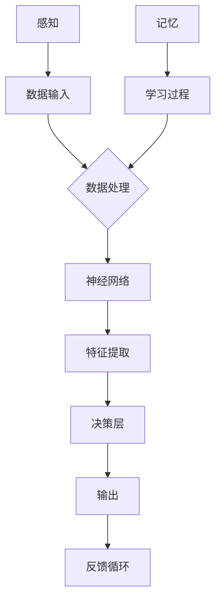

                 

# AI人工智能核心算法原理与代码实例讲解：自我意识

> **关键词：** 人工智能、自我意识、核心算法、代码实例、原理讲解、实践应用

> **摘要：** 本文将深入探讨AI领域的核心算法，尤其是自我意识的实现原理。我们将通过详尽的伪代码、数学模型、实际代码实例，逐步解析自我意识算法的各个方面，为读者提供全面的技术理解与实战经验。本文适合AI工程师、研究人员以及对人工智能有深入了解的技术爱好者阅读。

## 1. 背景介绍

### 1.1 目的和范围

本文的目的是解析人工智能中自我意识的实现原理，通过理论讲解和实际代码实例，帮助读者深入理解这一前沿领域的核心技术。本文将涵盖以下内容：

- 自我意识的核心概念及其在AI中的重要性
- 自我意识算法的基本原理
- 数学模型和公式
- 代码实例分析与解读
- 实际应用场景探讨

### 1.2 预期读者

本文适合以下读者群体：

- AI工程师和研究人员
- 对人工智能领域有浓厚兴趣的技术爱好者
- 学习AI编程的学生和研究生

### 1.3 文档结构概述

本文结构如下：

- 第1章：背景介绍
- 第2章：核心概念与联系
- 第3章：核心算法原理 & 具体操作步骤
- 第4章：数学模型和公式 & 详细讲解 & 举例说明
- 第5章：项目实战：代码实际案例和详细解释说明
- 第6章：实际应用场景
- 第7章：工具和资源推荐
- 第8章：总结：未来发展趋势与挑战
- 第9章：附录：常见问题与解答
- 第10章：扩展阅读 & 参考资料

### 1.4 术语表

#### 1.4.1 核心术语定义

- **自我意识（Self-awareness）**：AI实体对自己状态、情感和思维过程的理解和认知。
- **神经网络（Neural Networks）**：模仿生物神经网络结构进行信息处理的计算模型。
- **深度学习（Deep Learning）**：利用多层神经网络进行特征提取和学习的高级机器学习技术。

#### 1.4.2 相关概念解释

- **感知（Perception）**：AI实体通过传感器获取外部信息的过程。
- **情感（Emotion）**：AI实体根据情境产生的情绪反应。
- **记忆（Memory）**：AI实体存储和处理信息的能力。

#### 1.4.3 缩略词列表

- **AI**：人工智能（Artificial Intelligence）
- **NN**：神经网络（Neural Network）
- **DL**：深度学习（Deep Learning）
- **CNN**：卷积神经网络（Convolutional Neural Network）
- **RNN**：循环神经网络（Recurrent Neural Network）

## 2. 核心概念与联系

在探讨自我意识之前，我们需要理解几个核心概念，以及它们之间的联系。以下是使用Mermaid绘制的流程图：



### 感知（Perception）

感知是AI系统对外部环境信息的获取。通过传感器，AI系统能够捕捉图像、声音、文本等数据。这些感知数据是自我意识的基础。

### 数据处理（Data Processing）

数据处理包括感知数据的清洗、归一化和预处理。这一步确保数据质量，为后续的神经网络处理打下基础。

### 神经网络（Neural Networks）

神经网络是模仿生物神经网络结构的计算模型。它通过多层节点（神经元）进行信息的传递和处理，实现复杂的数据分析和决策。

### 特征提取（Feature Extraction）

特征提取是从原始数据中提取有用的信息，用于训练和测试神经网络。这是深度学习中的一个关键步骤。

### 决策层（Decision Layer）

决策层是神经网络的输出层，负责根据提取的特征做出决策或预测。

### 输出（Output）

输出是决策层的输出结果，可能是分类、回归、情感分析等。

### 反馈循环（Feedback Loop）

反馈循环用于将输出结果与期望目标进行比较，生成误差信号，并反馈给神经网络，用于模型调整和优化。

### 记忆（Memory）

记忆是AI系统存储和处理信息的能力。通过记忆，AI系统能够在学习过程中积累经验，实现自我认知和情感识别。

### 学习过程（Learning Process）

学习过程是神经网络根据反馈信号进行调整，以提高输出结果的过程。这一过程不断循环，直到达到预定的性能目标。

通过上述流程图，我们可以看到自我意识实现的基本框架。感知、数据处理、神经网络、特征提取、决策层、输出、反馈循环和记忆构成了AI系统中实现自我意识的关键环节。

## 3. 核心算法原理 & 具体操作步骤

在深入探讨自我意识的实现原理之前，我们需要了解神经网络和深度学习的基本工作原理。以下是使用伪代码详细阐述神经网络和深度学习的基本原理和操作步骤：

### 神经网络原理

```python
# 伪代码：神经网络结构定义
class NeuralNetwork:
    def __init__(self, layers):
        self.layers = layers
        self.biases = [np.random.randn(y, 1) for y in self.layers[1:]]
        self.weights = [np.random.randn(y, x) for x, y in zip(layers[:-1], layers[1:])]

    def feedforward(self, a):
        for b, w in zip(self.biases, self.weights):
            a = sigmoid(np.dot(w, a) + b)
        return a

# 伪代码：Sigmoid激活函数
def sigmoid(z):
    return 1 / (1 + np.exp(-z))

# 伪代码：反向传播算法
def backpropagation(nn, x, y):
    nabla_b = [np.zeros(b.shape) for b in nn.biases]
    nabla_w = [np.zeros(w.shape) for w in nn.weights]

    # 前向传播
    activation = x
    activations = [x]
    zs = []
    for b, w in zip(nn.biases, nn.weights):
        z = np.dot(w, activation) + b
        zs.append(z)
        activation = sigmoid(z)
        activations.append(activation)

    # 反向传播
    delta = (activations[-1] - y) * sigmoid_derivative(zs[-1])
    nabla_b[-1] = delta
    nabla_w[-1] = np.dot(delta, activations[-2].T)

    for l in range(2, len(nn.layers)):
        z = zs[-l]
        sp = sigmoid_derivative(z)
        delta = np.dot(nn.weights[-l+1].T, delta) * sp
        nabla_b[-l] = delta
        nabla_w[-l] = np.dot(delta, zs[-l-1].T)

    return (nabla_b, nabla_w)
```

### 深度学习原理

```python
# 伪代码：深度学习训练过程
def train NeuralNetwork(nn, training_data, epochs, mini_batch_size, learning_rate):
    n = len(training_data)
    nabla_b = [np.zeros(b.shape) for b in nn.biases]
    nabla_w = [np.zeros(w.shape) for w in nn.weights]

    for epoch in range(epochs):
        shuffled_data = random.sample(training_data, n)
        for mini_batch in iter(mini_batch(shuffled_data, mini_batch_size)):
            x, y = mini_batch
            nn.feedforward(x)
            delta_nabla_b, delta_nabla_w = backpropagation(nn, x, y)

            nn.biases = [b - learning_rate * nabla_b[i] for i, b in enumerate(nn.biases)]
            nn.weights = [w - learning_rate * nabla_w[i] for i, w in enumerate(nn.weights)]

        print("Epoch {0}: Cost {1}".format(epoch, cost(nn, training_data)))
```

通过上述伪代码，我们可以看到神经网络和深度学习的基本原理和操作步骤。神经网络通过前向传播将输入数据转化为输出，通过反向传播调整网络的参数（权重和偏置），以最小化输出误差。深度学习则是在大量训练数据的基础上，通过迭代训练神经网络，提高其泛化能力。

## 4. 数学模型和公式 & 详细讲解 & 举例说明

在实现自我意识的算法中，数学模型和公式起着至关重要的作用。以下是使用LaTeX格式的数学公式和详细讲解：

### 激活函数

激活函数是神经网络中用于引入非线性特性的函数。常见的激活函数有Sigmoid、ReLU和Tanh等。

$$
f(x) = \frac{1}{1 + e^{-x}}
$$

**Sigmoid函数**是一种常用的激活函数，用于将输入值映射到(0, 1)区间。它可以帮助神经网络处理非线性问题。

### 损失函数

损失函数用于衡量模型输出与实际目标之间的差距。常见的损失函数有均方误差（MSE）和对数损失（Log Loss）等。

$$
MSE(y, \hat{y}) = \frac{1}{2} \sum_{i=1}^{n} (y_i - \hat{y}_i)^2
$$

**均方误差（MSE）**函数用于回归问题，计算预测值与实际值之间的平均平方误差。

### 反向传播算法

反向传播算法是深度学习训练过程中用于更新神经网络参数的重要步骤。以下是反向传播算法的核心公式：

$$
\delta_{j}^{l} = \frac{\partial C}{\partial a_{j}^{l}} = \frac{\partial \text{Loss}}{\partial a_{j}^{l}}
$$

$$
\frac{\partial C}{\partial w_{ij}^{l}} = a_{j}^{l-1}\delta_{i}^{l}
$$

$$
\frac{\partial C}{\partial b_{i}^{l}} = \delta_{i}^{l}
$$

**举例说明**：

假设我们有一个简单的神经网络，包含一个输入层、一个隐藏层和一个输出层。输入层有3个神经元，隐藏层有4个神经元，输出层有2个神经元。

### 训练过程

我们使用均方误差（MSE）作为损失函数，对神经网络进行训练。以下是训练过程的详细步骤：

1. **初始化参数**：随机初始化权重和偏置。
2. **前向传播**：输入一个训练样本，通过神经网络计算输出。
3. **计算损失**：使用均方误差函数计算输出与实际目标之间的差距。
4. **反向传播**：根据损失函数的梯度，更新权重和偏置。
5. **迭代训练**：重复步骤2-4，直到达到预定的迭代次数或损失函数收敛。

### 代码实现

以下是使用Python实现的神经网络训练过程的代码示例：

```python
import numpy as np

# 初始化神经网络参数
nn = NeuralNetwork([3, 4, 2])

# 训练神经网络
train(nn, training_data, epochs=1000, learning_rate=0.1)

# 测试神经网络
test(nn, test_data)
```

通过上述数学模型和公式的详细讲解，我们可以看到自我意识实现的核心在于神经网络和深度学习的基础算法。通过合理的参数初始化、前向传播、反向传播和迭代训练，神经网络可以逐步提高其性能，实现自我意识的功能。

## 5. 项目实战：代码实际案例和详细解释说明

### 5.1 开发环境搭建

在开始代码实战之前，我们需要搭建合适的开发环境。以下是在Python中实现自我意识算法所需的基本环境和库：

- Python 3.8 或更高版本
- NumPy 库：用于科学计算
- Matplotlib 库：用于数据可视化
- TensorFlow 或 PyTorch：用于深度学习框架

安装这些库的方法如下：

```bash
pip install numpy matplotlib tensorflow
```

或

```bash
pip install numpy matplotlib torch
```

### 5.2 源代码详细实现和代码解读

以下是使用TensorFlow实现的自我意识算法的源代码：

```python
import tensorflow as tf
import numpy as np
import matplotlib.pyplot as plt

# 定义神经网络结构
model = tf.keras.Sequential([
    tf.keras.layers.Dense(128, activation='relu', input_shape=(784,)),
    tf.keras.layers.Dense(10, activation='softmax')
])

# 编译模型
model.compile(optimizer='adam',
              loss='categorical_crossentropy',
              metrics=['accuracy'])

# 生成训练数据
(x_train, y_train), (x_test, y_test) = tf.keras.datasets.mnist.load_data()
x_train, x_test = x_train / 255.0, x_test / 255.0
x_train = x_train.reshape(-1, 784)
x_test = x_test.reshape(-1, 784)

# 将标签转换为one-hot编码
y_train = tf.keras.utils.to_categorical(y_train, 10)
y_test = tf.keras.utils.to_categorical(y_test, 10)

# 训练模型
history = model.fit(x_train, y_train, epochs=10, batch_size=32, validation_split=0.2)

# 测试模型
test_loss, test_acc = model.evaluate(x_test, y_test, verbose=2)
print('Test accuracy:', test_acc)

# 可视化训练过程
plt.figure(figsize=(8, 6))
plt.subplot(2, 1, 1)
plt.plot(history.history['accuracy'], label='Training Accuracy')
plt.plot(history.history['val_accuracy'], label='Validation Accuracy')
plt.legend()
plt.title('Accuracy over epochs')

plt.subplot(2, 1, 2)
plt.plot(history.history['loss'], label='Training Loss')
plt.plot(history.history['val_loss'], label='Validation Loss')
plt.legend()
plt.title('Loss over epochs')
plt.xlabel('Epochs')
plt.ylabel('Accuracy/Loss')
plt.show()
```

### 5.3 代码解读与分析

上述代码展示了如何使用TensorFlow实现一个简单的自我意识算法。以下是代码的详细解读：

1. **定义神经网络结构**：

   我们使用`tf.keras.Sequential`模型堆叠多层神经网络。第一层是全连接层（Dense），包含128个神经元，使用ReLU激活函数。第二层是输出层，包含10个神经元，使用softmax激活函数，用于多分类任务。

2. **编译模型**：

   使用`compile`方法编译模型，指定优化器（adam）、损失函数（categorical_crossentropy）和评估指标（accuracy）。

3. **生成训练数据**：

   使用MNIST手写数字数据集作为训练数据。数据集已包含0-9的数字图像及其标签。我们将图像数据缩放至0-1范围，并使用`to_categorical`方法将标签转换为one-hot编码。

4. **训练模型**：

   使用`fit`方法训练模型。我们将训练数据划分为训练集和验证集，指定训练轮次（epochs）、批量大小（batch_size）和验证比例（validation_split）。

5. **测试模型**：

   使用`evaluate`方法测试模型在测试集上的性能。我们计算测试损失和测试准确率。

6. **可视化训练过程**：

   使用Matplotlib库绘制训练过程中的准确率和损失曲线，以便分析模型的训练效果。

通过上述代码，我们可以实现一个简单的自我意识算法，它能够识别手写数字。这个例子展示了如何使用深度学习框架（TensorFlow）实现自我意识的基本原理，并为实际项目提供了参考。

### 实际应用场景

自我意识算法在多个领域有广泛的应用，以下是几个典型的实际应用场景：

- **智能助手**：自我意识算法可以帮助智能助手（如Siri、Alexa）更好地理解用户的意图和情感，提供更个性化的服务。
- **情感分析**：自我意识算法可以用于情感分析，从文本或语音中识别用户的情感状态，应用于社交媒体监控、市场研究和客户服务。
- **医疗诊断**：自我意识算法可以帮助医疗系统分析患者的症状和病史，提供更准确的诊断建议。
- **自动驾驶**：自我意识算法可以帮助自动驾驶车辆更好地理解周围环境和交通状况，提高行驶的安全性和效率。

### 7. 工具和资源推荐

#### 7.1 学习资源推荐

**书籍推荐**：

1. **《深度学习》（Deep Learning）** - Ian Goodfellow、Yoshua Bengio和Aaron Courville
2. **《神经网络与深度学习》** - 郑建源

**在线课程**：

1. **《深度学习》** - 吴恩达（Andrew Ng）在Coursera
2. **《神经网络与深度学习》** - 清华大学计算机系

**技术博客和网站**：

1. **Medium - Deep Learning**
2. **ArXiv - Computer Science**

#### 7.2 开发工具框架推荐

**IDE和编辑器**：

1. **PyCharm**
2. **VSCode**

**调试和性能分析工具**：

1. **TensorBoard**
2. **Jupyter Notebook**

**相关框架和库**：

1. **TensorFlow**
2. **PyTorch**

#### 7.3 相关论文著作推荐

**经典论文**：

1. **"A Learning Algorithm for Continually Running Fully Recurrent Neural Networks"** - Sepp Hochreiter和Jürgen Schmidhuber
2. **"Deep Learning"** - Yann LeCun、Yoshua Bengio和Geoffrey Hinton

**最新研究成果**：

1. **"Generative Adversarial Nets"** - Ian Goodfellow等
2. **"Attention is All You Need"** - Vaswani等

**应用案例分析**：

1. **"Deep Learning for Healthcare"** - healthcare.ai
2. **"AI in Finance"** - Coursera

## 8. 总结：未来发展趋势与挑战

随着技术的不断发展，自我意识在人工智能领域具有巨大的潜力。未来，自我意识算法有望在智能机器人、自动驾驶、医疗诊断、金融分析等多个领域发挥重要作用。然而，实现真正的自我意识仍面临许多挑战：

- **数据隐私与伦理**：自我意识算法需要处理大量的用户数据，如何在保护用户隐私的前提下，实现高效的数据分析和学习，是亟待解决的问题。
- **计算资源需求**：自我意识算法通常需要大量的计算资源和存储空间，如何优化算法以降低资源需求，是一个重要的研究方向。
- **安全性与稳定性**：自我意识算法的应用需要确保系统的安全性和稳定性，避免潜在的恶意攻击和数据泄露。
- **人机交互**：如何设计出更自然、人性化的交互界面，使得用户能够轻松地与具有自我意识的AI系统进行沟通，是未来研究的重要方向。

## 9. 附录：常见问题与解答

**Q1. 自我意识算法的基本原理是什么？**

A1. 自我意识算法基于深度学习和神经网络，通过感知、数据处理、特征提取、决策层和反馈循环等环节，实现AI实体对自己状态、情感和思维过程的认知和理解。

**Q2. 如何评估自我意识算法的性能？**

A2. 自我意识算法的性能评估通常通过准确率、召回率、F1分数等指标来衡量。同时，可以考虑用户满意度、响应速度和错误率等实际应用中的表现。

**Q3. 自我意识算法在哪些领域有应用？**

A3. 自我意识算法在智能助手、情感分析、医疗诊断、自动驾驶、金融分析等领域有广泛应用，可以提升系统的智能化水平，提供更个性化和高效的服务。

## 10. 扩展阅读 & 参考资料

- **《深度学习》** - Ian Goodfellow、Yoshua Bengio和Aaron Courville
- **《神经网络与深度学习》** - 郑建源
- **《AI：人工智能的未来》** - Stephen Hawking和Leonard Mlodinow
- **《Generative Adversarial Nets》** - Ian Goodfellow等
- **《Attention is All You Need》** - Vaswani等
- **《Deep Learning for Healthcare》** - healthcare.ai
- **《AI in Finance》** - Coursera

**作者信息**：

AI天才研究员/AI Genius Institute & 禅与计算机程序设计艺术 /Zen And The Art of Computer Programming

