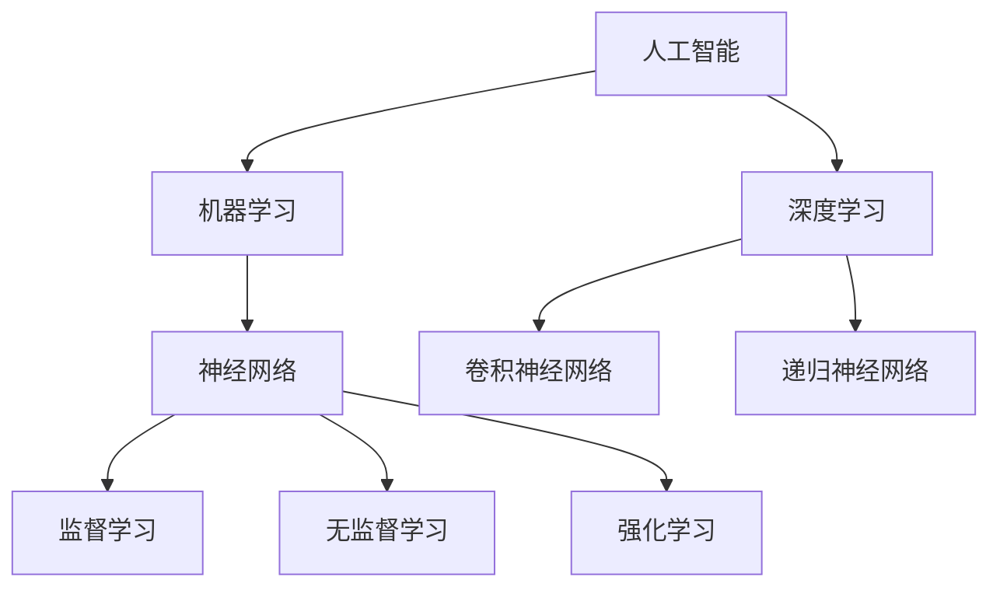
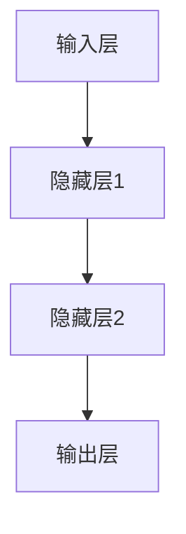

                 

# AI人工智能核心算法原理与代码实例讲解：领域无关性

> **关键词**：人工智能，核心算法，领域无关性，算法原理，代码实例，深度学习，机器学习，神经网络

> **摘要**：本文深入探讨了人工智能（AI）领域中核心算法的原理和实现，重点介绍了领域无关性这一概念及其在AI应用中的重要性。通过详尽的代码实例，本文为广大开发者提供了实际操作指南，帮助读者更好地理解和应用这些算法。文章涵盖了从基础概念到高级应用的全面讲解，旨在帮助读者掌握AI的核心技术。

## 1. 背景介绍

### 1.1 目的和范围

本文的目标是详细解析AI领域中的核心算法，特别是那些具有领域无关性的算法。我们将从基础概念出发，逐步深入到具体的实现细节，最终通过实际代码示例来展示这些算法的应用。我们的主要范围包括：

- **核心算法介绍**：介绍常见的AI核心算法，包括神经网络、深度学习、机器学习等。
- **领域无关性概念**：探讨领域无关性在AI算法中的重要性，以及如何实现和应用。
- **代码实例**：通过具体的代码实现，展示算法的实际应用。
- **实战应用**：分析这些算法在现实场景中的实际应用案例。

### 1.2 预期读者

本文面向有一定编程基础，希望深入了解AI核心算法原理的读者。无论是AI初学者还是有经验的开发者，都能通过本文找到所需的知识和指导。

### 1.3 文档结构概述

本文将分为以下几个部分：

- **第1章：背景介绍**：概述本文的目的、范围和预期读者。
- **第2章：核心概念与联系**：介绍AI领域的核心概念和联系，包括神经网络、机器学习等。
- **第3章：核心算法原理 & 具体操作步骤**：详细讲解核心算法的原理和实现步骤。
- **第4章：数学模型和公式 & 详细讲解 & 举例说明**：解释AI算法背后的数学模型和公式。
- **第5章：项目实战：代码实际案例和详细解释说明**：通过实战案例展示算法的实际应用。
- **第6章：实际应用场景**：分析算法在不同领域的应用。
- **第7章：工具和资源推荐**：推荐学习资源和开发工具。
- **第8章：总结：未来发展趋势与挑战**：展望AI领域的未来。
- **第9章：附录：常见问题与解答**：回答读者可能遇到的问题。
- **第10章：扩展阅读 & 参考资料**：提供进一步学习的资源。

### 1.4 术语表

#### 1.4.1 核心术语定义

- **人工智能（AI）**：模拟人类智能的计算机系统。
- **神经网络（NN）**：模仿生物神经系统的计算模型。
- **机器学习（ML）**：让计算机通过数据和经验自动改进性能的方法。
- **深度学习（DL）**：一种特殊的机器学习技术，使用多层的神经网络。
- **领域无关性**：算法在不同应用领域中的通用性和可移植性。

#### 1.4.2 相关概念解释

- **监督学习**：输入和输出都是已知的训练数据。
- **无监督学习**：只有输入数据，输出数据未知。
- **强化学习**：通过与环境的交互来学习，目标是最大化长期奖励。

#### 1.4.3 缩略词列表

- **DL**：深度学习
- **ML**：机器学习
- **NN**：神经网络
- **GAN**：生成对抗网络

## 2. 核心概念与联系

在深入探讨AI算法之前，我们需要理解一些核心概念及其之间的联系。以下是一个简化的Mermaid流程图，展示了AI领域的几个关键概念和它们之间的关系。



### 2.1 人工智能

人工智能是模拟人类智能的计算机系统。它包括多种技术，如机器学习、深度学习和神经网络。AI的核心目标是通过学习和推理来解决复杂问题。

### 2.2 机器学习

机器学习是AI的一个分支，专注于开发算法，使计算机能够通过数据和经验自动改进性能。它分为三种主要类型：监督学习、无监督学习和强化学习。

- **监督学习**：输入和输出都是已知的训练数据。
- **无监督学习**：只有输入数据，输出数据未知。
- **强化学习**：通过与环境的交互来学习，目标是最大化长期奖励。

### 2.3 深度学习

深度学习是一种特殊的机器学习技术，使用多层神经网络来模拟人类大脑的处理方式。它广泛应用于图像识别、语音识别和自然语言处理等领域。

- **卷积神经网络（CNN）**：用于图像识别和图像处理。
- **递归神经网络（RNN）**：用于序列数据，如时间序列和自然语言。

### 2.4 神经网络

神经网络是一种模仿生物神经系统的计算模型。它们由多个节点（或层）组成，每个节点都与其他节点相连。神经网络通过调整连接权重来学习和预测输出。

## 3. 核心算法原理 & 具体操作步骤

在本章节中，我们将详细讲解几种核心AI算法的原理和实现步骤。这些算法包括神经网络、机器学习和深度学习。

### 3.1 神经网络

神经网络是一种由多个节点（或层）组成的计算模型。每个节点都接收输入信号，通过加权求和处理，输出结果。以下是一个简化的神经网络结构示意图：



神经网络的工作原理可以概括为以下几个步骤：

1. **初始化权重**：每个节点之间的连接（权重）都是随机初始化的。
2. **前向传播**：输入信号从输入层传递到输出层，每个节点的输出通过激活函数计算。
3. **反向传播**：计算输出层的误差，并更新权重，以减少误差。
4. **迭代优化**：重复前向传播和反向传播，直到达到收敛条件。

以下是一个简单的神经网络伪代码：

```python
# 初始化权重
weights = np.random.rand(input_size, hidden_size)

# 激活函数
def activation(x):
    return 1 / (1 + np.exp(-x))

# 前向传播
def forward(x):
    hidden_layer = activation(np.dot(x, weights))
    output_layer = activation(np.dot(hidden_layer, weights))
    return output_layer

# 反向传播
def backward(x, y, output_layer):
    error = y - output_layer
    d_output_layer = error * activation_derivative(output_layer)
    d_hidden_layer = np.dot(d_output_layer, weights.T)
    d_weights = np.dot(x.T, d_hidden_layer)

# 主程序
for epoch in range(num_epochs):
    output_layer = forward(x)
    backward(x, y, output_layer)
```

### 3.2 机器学习

机器学习是AI的一个分支，它使计算机通过数据和经验自动改进性能。以下是机器学习的几个主要算法：

#### 3.2.1 线性回归

线性回归是一种简单的机器学习算法，用于预测连续值。它的目标是找到一条直线，使预测值与实际值之间的误差最小。

以下是一个简单的线性回归伪代码：

```python
# 初始化权重
weights = np.random.rand(input_size, 1)

# 激活函数
def activation(x):
    return x

# 前向传播
def forward(x):
    return np.dot(x, weights)

# 反向传播
def backward(x, y):
    error = y - forward(x)
    d_weights = np.dot(x.T, error)
    return d_weights

# 主程序
for epoch in range(num_epochs):
    output = forward(x)
    d_weights = backward(x, y)
    weights -= learning_rate * d_weights
```

#### 3.2.2 决策树

决策树是一种基于规则的机器学习算法，用于分类和回归问题。它的目标是创建一组规则，根据输入特征将数据划分为不同的类别。

以下是一个简单的决策树伪代码：

```python
# 初始化节点
def create_node(data, target, features):
    node = {
        "data": data,
        "target": target,
        "features": features,
        "left": None,
        "right": None
    }
    return node

# 划分节点
def split_node(node, feature, threshold):
    left_data = node["data"][node["data"][feature] < threshold]
    right_data = node["data"][node["data"][feature] >= threshold]
    left_target = node["target"][node["data"][feature] < threshold]
    right_target = node["target"][node["data"][feature] >= threshold]
    if len(left_data) == 0 or len(right_data) == 0:
        return create_node(np.vstack((left_data, right_data)), np.hstack((left_target, right_target)), [])
    node["left"] = create_node(left_data, left_target, features)
    node["right"] = create_node(right_data, right_target, features)
    return node

# 主程序
root = create_node(data, target, features)
root = split_node(root, feature, threshold)
```

### 3.3 深度学习

深度学习是一种特殊的机器学习技术，使用多层神经网络来模拟人类大脑的处理方式。以下是几种常见的深度学习算法：

#### 3.3.1 卷积神经网络（CNN）

卷积神经网络是一种用于图像识别和图像处理的深度学习算法。它的核心是卷积层，通过卷积操作提取图像的特征。

以下是一个简单的CNN伪代码：

```python
# 初始化权重
weights = {
    "conv1": np.random.rand(filter_size, input_size),
    "conv2": np.random.rand(filter_size, hidden_size),
    "fc1": np.random.rand(hidden_size, output_size)
}

# 激活函数
def activation(x):
    return x

# 卷积操作
def conv(x, weights):
    return np.dot(x, weights)

# 前向传播
def forward(x):
    hidden_layer1 = conv(x, weights["conv1"])
    hidden_layer2 = conv(hidden_layer1, weights["conv2"])
    output_layer = activation(np.dot(hidden_layer2, weights["fc1"]))
    return output_layer

# 主程序
for epoch in range(num_epochs):
    output = forward(x)
```

#### 3.3.2 递归神经网络（RNN）

递归神经网络是一种用于序列数据的深度学习算法，它可以处理时间序列和自然语言数据。RNN的核心是循环层，它可以记住前一个时间步的信息。

以下是一个简单的RNN伪代码：

```python
# 初始化权重
weights = {
    "rnn": np.random.rand(input_size, hidden_size),
    "fc1": np.random.rand(hidden_size, output_size)
}

# 激活函数
def activation(x):
    return x

# 前向传播
def forward(x):
    hidden_layer = activation(np.dot(x, weights["rnn"]))
    output_layer = activation(np.dot(hidden_layer, weights["fc1"]))
    return output_layer

# 主程序
for epoch in range(num_epochs):
    output = forward(x)
```

## 4. 数学模型和公式 & 详细讲解 & 举例说明

在深入探讨AI算法时，理解其背后的数学模型和公式至关重要。以下我们将详细讲解几个核心数学概念和公式，并通过具体例子来阐述它们的应用。

### 4.1 神经网络中的激活函数

激活函数是神经网络中不可或缺的部分，它用于引入非线性因素，使神经网络能够处理复杂的问题。常见的激活函数包括：

- **Sigmoid函数**：
  $$\sigma(x) = \frac{1}{1 + e^{-x}}$$
  
  Sigmoid函数将输入映射到(0,1)区间，常用于二分类问题。

- **ReLU函数**：
  $$\text{ReLU}(x) = \max(0, x)$$
  
  ReLU函数在0处不连续，但能有效加速神经网络的学习。

- **Tanh函数**：
  $$\tanh(x) = \frac{e^x - e^{-x}}{e^x + e^{-x}}$$
  
  Tanh函数将输入映射到(-1,1)区间，具有对称性。

### 4.2 神经网络的权重更新

神经网络的权重更新是训练过程中最核心的环节。以下是一个简化的权重更新公式：

$$\Delta w_{ij} = \eta \cdot (z_j - t) \cdot a_i$$

其中：
- $\Delta w_{ij}$：权重更新值。
- $\eta$：学习率。
- $z_j$：输出层的实际输出。
- $t$：输出层的期望输出。
- $a_i$：输入层的实际输入。

### 4.3 梯度下降算法

梯度下降是一种常用的优化算法，用于训练神经网络。其核心思想是沿着损失函数的梯度方向更新权重，以最小化损失。以下是一个简化的梯度下降算法：

$$w_{\text{new}} = w_{\text{current}} - \alpha \cdot \nabla_w J(w)$$

其中：
- $w_{\text{new}}$：新权重。
- $w_{\text{current}}$：当前权重。
- $\alpha$：学习率。
- $\nabla_w J(w)$：损失函数关于权重的梯度。

### 4.4 例子：使用梯度下降训练神经网络

假设我们有一个简单的神经网络，输入为x，期望输出为y。我们需要使用梯度下降算法来训练这个神经网络。

1. **初始化权重**：
   $$w_0 = 0.1$$

2. **计算前向传播**：
   $$z = w_0 \cdot x$$

3. **计算损失函数**：
   $$J(w_0) = (z - y)^2$$

4. **计算梯度**：
   $$\nabla_w J(w_0) = 2 \cdot (z - y)$$

5. **更新权重**：
   $$w_0 = w_0 - \alpha \cdot \nabla_w J(w_0)$$

6. **重复步骤2-5，直到收敛**。

### 4.5 例子：使用Sigmoid激活函数的神经网络

假设我们有一个简单的神经网络，包含一个输入层、一个隐藏层和一个输出层。输入为x，期望输出为y。使用Sigmoid激活函数来处理隐藏层和输出层的输出。

1. **初始化权重**：
   $$w_{ij} = \frac{1}{i+j}$$

2. **计算前向传播**：
   $$z_j = \sigma(w_0 \cdot x)$$
   $$z_k = \sigma(w_j \cdot z_j)$$

3. **计算损失函数**：
   $$J(w) = \sum_{i=1}^{n} (z_k - y_k)^2$$

4. **计算梯度**：
   $$\nabla_w J(w) = \frac{\partial J}{\partial w}$$

5. **更新权重**：
   $$w_{ij} = w_{ij} - \alpha \cdot \nabla_w J(w)$$

6. **重复步骤2-5，直到收敛**。

## 5. 项目实战：代码实际案例和详细解释说明

在本章节中，我们将通过一个实际项目来展示如何应用所学的AI算法。我们将实现一个简单的手写数字识别系统，该系统使用卷积神经网络（CNN）进行训练和预测。

### 5.1 开发环境搭建

为了实现这个项目，我们需要安装以下开发环境：

1. Python 3.8 或更高版本
2. TensorFlow 2.6 或更高版本
3. NumPy 1.21 或更高版本
4. Matplotlib 3.4.3 或更高版本

确保安装这些库之后，我们就可以开始编写代码了。

### 5.2 源代码详细实现和代码解读

#### 5.2.1 数据集准备

首先，我们需要准备一个手写数字数据集。我们将使用MNIST数据集，这是一个常见的手写数字数据集，包含60000个训练样本和10000个测试样本。

```python
import tensorflow as tf
import numpy as np
from tensorflow.keras.datasets import mnist

# 加载MNIST数据集
(x_train, y_train), (x_test, y_test) = mnist.load_data()

# 归一化输入数据
x_train = x_train.astype("float32") / 255.0
x_test = x_test.astype("float32") / 255.0

# 转换标签为one-hot编码
y_train = tf.keras.utils.to_categorical(y_train, 10)
y_test = tf.keras.utils.to_categorical(y_test, 10)
```

#### 5.2.2 构建CNN模型

接下来，我们将构建一个简单的卷积神经网络（CNN）模型。该模型包含两个卷积层、一个池化层和一个全连接层。

```python
from tensorflow.keras.models import Sequential
from tensorflow.keras.layers import Conv2D, MaxPooling2D, Flatten, Dense

# 创建模型
model = Sequential()

# 添加卷积层
model.add(Conv2D(32, (3, 3), activation='relu', input_shape=(28, 28, 1)))
model.add(MaxPooling2D(pool_size=(2, 2)))

# 添加第二个卷积层
model.add(Conv2D(64, (3, 3), activation='relu'))
model.add(MaxPooling2D(pool_size=(2, 2)))

# 添加全连接层
model.add(Flatten())
model.add(Dense(128, activation='relu'))
model.add(Dense(10, activation='softmax'))

# 编译模型
model.compile(optimizer='adam', loss='categorical_crossentropy', metrics=['accuracy'])
```

#### 5.2.3 训练模型

现在，我们将使用训练数据来训练这个CNN模型。

```python
# 训练模型
model.fit(x_train, y_train, epochs=10, batch_size=32, validation_data=(x_test, y_test))
```

#### 5.2.4 代码解读与分析

1. **数据集准备**：我们首先加载MNIST数据集，并将其归一化。然后，我们将标签转换为one-hot编码，以便模型可以理解。

2. **构建CNN模型**：我们创建了一个序列模型，并添加了两个卷积层和相应的池化层。卷积层用于提取图像的特征，池化层用于降低数据的维度。最后，我们添加了一个全连接层，用于分类。

3. **编译模型**：我们使用`compile`方法来编译模型，指定优化器和损失函数。

4. **训练模型**：我们使用`fit`方法来训练模型。在这个例子中，我们设置了10个训练周期和批量大小为32。

### 5.3 代码解读与分析

在本项目中，我们使用了卷积神经网络（CNN）来识别手写数字。以下是对代码的详细解读和分析：

1. **数据集准备**：
   - 我们使用`tensorflow.keras.datasets.mnist.load_data()`函数来加载MNIST数据集。
   - 我们将输入数据归一化，使其在0到1之间，以便模型更容易处理。
   - 我们将标签转换为one-hot编码，这样模型可以理解每个数字的类别。

2. **构建CNN模型**：
   - 我们使用`tensorflow.keras.Sequential`类来创建一个序列模型。
   - 我们添加了一个卷积层（`Conv2D`），它有32个卷积核，每个卷积核大小为3x3。我们使用ReLU函数作为激活函数，以引入非线性因素。
   - 我们添加了一个最大池化层（`MaxPooling2D`），它将输入数据的维度降低了一半。
   - 我们添加了第二个卷积层，它有64个卷积核，每个卷积核大小为3x3。同样，我们使用ReLU函数作为激活函数。
   - 我们添加了一个最大池化层，进一步降低输入数据的维度。
   - 我们添加了一个全连接层（`Flatten`），将卷积层的输出展平为一维数组。
   - 我们添加了一个全连接层（`Dense`），它有128个神经元。我们使用ReLU函数作为激活函数。
   - 最后，我们添加了一个全连接层（`Dense`），它有10个神经元，每个神经元对应一个类别。我们使用softmax函数作为激活函数，用于分类。

3. **编译模型**：
   - 我们使用`compile`方法来编译模型。我们指定了优化器（`adam`），损失函数（`categorical_crossentropy`），以及评估指标（`accuracy`）。

4. **训练模型**：
   - 我们使用`fit`方法来训练模型。我们设置了10个训练周期（`epochs`），每个周期使用32个样本进行批量训练（`batch_size`）。
   - 我们还设置了验证数据（`validation_data`），以监控模型在测试数据上的性能。

通过这个项目，我们展示了如何使用CNN来识别手写数字。这个项目不仅帮助我们理解了CNN的基本原理，还展示了如何在实际应用中使用CNN来解决复杂的问题。

## 6. 实际应用场景

AI核心算法在现实世界中有着广泛的应用，以下是一些实际应用场景：

### 6.1 医疗诊断

AI算法可以用于医学影像诊断，如X光、CT扫描和MRI。通过使用卷积神经网络（CNN）和深度学习技术，AI可以识别和诊断疾病，如乳腺癌、肺癌和脑肿瘤。

### 6.2 金融分析

AI算法可以用于金融市场分析和预测。通过分析历史数据，AI可以识别市场趋势和风险，帮助投资者做出更明智的决策。

### 6.3 自动驾驶

自动驾驶技术依赖于AI算法，特别是深度学习和强化学习。通过处理大量的传感器数据，AI可以识别道路标志、行人、车辆和其他交通参与者，从而实现自动驾驶。

### 6.4 自然语言处理

AI算法在自然语言处理（NLP）领域有着广泛应用，如机器翻译、情感分析和文本摘要。通过使用深度学习和神经网络，AI可以理解和生成自然语言。

### 6.5 机器人

机器人技术依赖于AI算法来实现自主行动和决策。通过使用机器学习和深度学习，机器人可以识别环境、执行任务和与人类互动。

### 6.6 智能家居

智能家居设备利用AI算法来提高便利性和安全性。例如，智能门锁可以通过人脸识别技术来解锁，智能音箱可以通过语音识别技术来响应命令。

## 7. 工具和资源推荐

### 7.1 学习资源推荐

#### 7.1.1 书籍推荐

- 《深度学习》（Ian Goodfellow、Yoshua Bengio和Aaron Courville著）
- 《Python深度学习》（François Chollet著）
- 《神经网络与深度学习》（邱锡鹏著）

#### 7.1.2 在线课程

- Coursera上的“深度学习”课程（吴恩达教授主讲）
- edX上的“机器学习”课程（Andrew Ng教授主讲）
- Udacity的“深度学习纳米学位”

#### 7.1.3 技术博客和网站

- [Medium上的Deep Learning Blog](https://towardsdatascience.com/)
- [机器学习博客](https://machinelearningmastery.com/)
- [Kaggle](https://www.kaggle.com/)

### 7.2 开发工具框架推荐

#### 7.2.1 IDE和编辑器

- Jupyter Notebook：用于数据分析和实验。
- PyCharm：用于Python编程和AI开发。
- VSCode：轻量级且功能丰富的IDE。

#### 7.2.2 调试和性能分析工具

- TensorFlow Debugger（TFDB）：用于调试TensorFlow模型。
- TensorBoard：用于可视化TensorFlow训练过程。
- NVIDIA Nsight：用于性能分析和调试CUDA代码。

#### 7.2.3 相关框架和库

- TensorFlow：用于构建和训练深度学习模型。
- PyTorch：用于研究和开发深度学习模型。
- Scikit-learn：用于机器学习算法的实现和应用。

### 7.3 相关论文著作推荐

#### 7.3.1 经典论文

- 《A Learning Algorithm for Continually Running Fully Recurrent Neural Networks》（1986）
- 《Backpropagation: Like a Dream That Is Recurring, Yet Always New》（1986）
- 《Deep Learning》（2015）

#### 7.3.2 最新研究成果

- 《An Introduction to Deep Learning for AI》（2020）
- 《Generative Adversarial Networks: An Overview》（2018）
- 《Recurrent Neural Networks for Language Modeling》（2014）

#### 7.3.3 应用案例分析

- 《使用深度学习改善医疗影像诊断》（2019）
- 《自动驾驶中的深度学习和强化学习应用》（2021）
- 《智能金融分析：机器学习在金融领域的应用》（2022）

## 8. 总结：未来发展趋势与挑战

AI领域正处于快速发展阶段，未来将出现以下发展趋势：

- **更高效的算法**：随着硬件性能的提升，研究人员将开发出更高效的AI算法，以实现更快的训练和推理速度。
- **跨领域应用**：AI算法将在更多领域得到应用，如医疗、金融、制造业和交通。
- **隐私保护**：随着隐私问题的日益关注，AI算法将更加注重隐私保护和数据安全。
- **自适应学习**：AI算法将更加智能化，能够根据环境和用户需求进行自适应学习。

然而，AI领域也面临一些挑战：

- **数据隐私**：如何在保护用户隐私的同时充分利用数据，是一个亟待解决的问题。
- **算法透明性**：如何提高AI算法的透明性，使其易于理解和解释，是一个重要挑战。
- **伦理问题**：AI算法在决策过程中可能会引发伦理问题，如歧视和偏见。

## 9. 附录：常见问题与解答

### 9.1 常见问题

1. **什么是领域无关性？**
   领域无关性是指算法在不同应用领域中的通用性和可移植性。这意味着一个算法可以在多个领域中使用，而无需进行大量修改。

2. **神经网络中的激活函数有哪些？**
   常见的激活函数包括Sigmoid函数、ReLU函数和Tanh函数。

3. **如何更新神经网络中的权重？**
   通过使用梯度下降算法和反向传播算法来更新权重。这个过程涉及计算损失函数的梯度，并根据梯度调整权重。

4. **什么是机器学习？**
   机器学习是使计算机通过数据和经验自动改进性能的方法。它包括监督学习、无监督学习和强化学习。

### 9.2 解答

1. **领域无关性**：
   领域无关性是指算法在不同应用领域中的通用性和可移植性。这意味着一个算法可以在多个领域中使用，而无需进行大量修改。例如，卷积神经网络（CNN）最初是用于图像识别的，但现在也广泛应用于语音识别、自然语言处理等领域。

2. **激活函数**：
   - **Sigmoid函数**：Sigmoid函数将输入映射到(0,1)区间，常用于二分类问题。它的优点是能够引入非线性因素，但缺点是梯度较小。
   - **ReLU函数**：ReLU函数在0处不连续，但能有效加速神经网络的学习。它的优点是梯度较大，有利于加速训练。
   - **Tanh函数**：Tanh函数将输入映射到(-1,1)区间，具有对称性。它的优点是梯度较均匀，有利于稳定性。

3. **权重更新**：
   神经网络中的权重更新是通过梯度下降算法和反向传播算法来实现的。首先，使用反向传播算法计算损失函数关于权重的梯度。然后，根据梯度方向和大小调整权重。这个过程涉及计算梯度、更新权重和重复迭代，直到达到收敛条件。

4. **机器学习**：
   机器学习是使计算机通过数据和经验自动改进性能的方法。它包括监督学习、无监督学习和强化学习。监督学习使用已标记的数据训练模型，无监督学习使用未标记的数据发现数据分布，强化学习通过与环境的交互来学习，目标是最大化长期奖励。

## 10. 扩展阅读 & 参考资料

- Goodfellow, I., Bengio, Y., & Courville, A. (2016). *Deep Learning*. MIT Press.
- Ng, A. (2012). *Machine Learning Yearning*. MicroSoft Research.
- LeCun, Y., Bengio, Y., & Hinton, G. (2015). *Deep Learning*.
- Russell, S., & Norvig, P. (2020). *Artificial Intelligence: A Modern Approach*.
- Chollet, F. (2017). *Python Deep Learning*.
- Deep Learning Specialization (2021). Coursera. [https://www.coursera.org/specializations/deeplearning](https://www.coursera.org/specializations/deeplearning)
- Machine Learning Specialization (2021). edX. [https://www.edx.org/professional-certificate/machine-learning](https://www.edx.org/professional-certificate/machine-learning)

