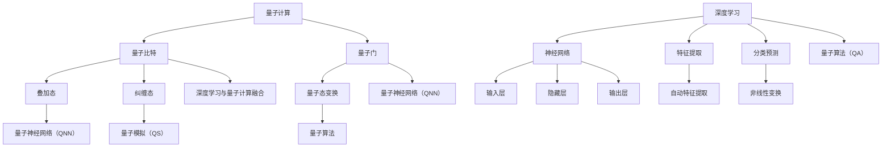

                 

### AI人工智能深度学习算法：在量子计算中的应用

> **关键词**：量子计算、深度学习、量子神经网络、量子算法、量子模拟

> **摘要**：本文将探讨AI人工智能深度学习算法在量子计算中的应用，深入分析量子计算的基本概念、深度学习与量子计算的融合方式，并详细讲解量子神经网络和量子算法的原理与实现。通过实际项目案例和代码解读，阐述量子计算在人工智能领域的潜力和挑战。文章最后对未来的发展趋势与挑战进行了展望。

## 1. 背景介绍

### 1.1 目的和范围

本文旨在探讨量子计算与深度学习的融合，通过分析量子计算的基本原理和深度学习算法，阐述其在人工智能领域的应用前景。文章将重点关注量子神经网络和量子算法，详细讲解其原理和实现步骤，并通过实际项目案例和代码解读，展示量子计算在深度学习领域的应用潜力。

### 1.2 预期读者

本文适合对量子计算和深度学习有一定了解的技术人员，以及对人工智能领域感兴趣的读者。通过阅读本文，读者可以了解量子计算与深度学习的融合方式，掌握量子神经网络和量子算法的实现原理，为在人工智能领域开展相关研究提供参考。

### 1.3 文档结构概述

本文共分为10个部分，具体结构如下：

1. 背景介绍
   - 1.1 目的和范围
   - 1.2 预期读者
   - 1.3 文档结构概述
   - 1.4 术语表
2. 核心概念与联系
3. 核心算法原理 & 具体操作步骤
4. 数学模型和公式 & 详细讲解 & 举例说明
5. 项目实战：代码实际案例和详细解释说明
6. 实际应用场景
7. 工具和资源推荐
   - 7.1 学习资源推荐
   - 7.2 开发工具框架推荐
   - 7.3 相关论文著作推荐
8. 总结：未来发展趋势与挑战
9. 附录：常见问题与解答
10. 扩展阅读 & 参考资料

### 1.4 术语表

#### 1.4.1 核心术语定义

- **量子计算**：利用量子力学原理进行信息处理的技术，具有并行计算和超并行计算的能力。
- **深度学习**：一种基于神经网络的机器学习方法，通过多层非线性变换，自动提取特征并进行预测。
- **量子神经网络**：将量子力学原理与神经网络结构相结合，实现高效特征提取和分类的算法。
- **量子算法**：基于量子计算原理，解决传统计算难题的算法，如Shor算法、Grover算法等。

#### 1.4.2 相关概念解释

- **量子比特**：量子计算机的基本单位，具有叠加态和纠缠态的特性。
- **量子门**：实现量子比特状态变换的基本操作，如Hadamard门、Pauli门等。
- **量子态**：量子比特的叠加状态，可以用复数向量表示。
- **量子模拟**：利用量子计算模拟量子系统的演化过程，解决复杂物理问题。

#### 1.4.3 缩略词列表

- **AI**：人工智能（Artificial Intelligence）
- **DL**：深度学习（Deep Learning）
- **QNN**：量子神经网络（Quantum Neural Network）
- **QC**：量子计算（Quantum Computing）
- **QS**：量子模拟（Quantum Simulation）

## 2. 核心概念与联系

在本文中，我们将重点介绍量子计算和深度学习的基本概念，以及它们之间的联系。首先，让我们通过一个Mermaid流程图来了解量子计算和深度学习的基本原理和架构。



### 2.1 量子计算

量子计算是一种利用量子力学原理进行信息处理的技术。量子比特（qubit）是量子计算的基本单位，具有叠加态和纠缠态的特性。量子比特可以处于多种状态的叠加，这种叠加态使得量子计算机具有超并行计算的能力。量子门是实现量子比特状态变换的基本操作，如Hadamard门、Pauli门等。通过一系列的量子门操作，可以实现量子态的变换，从而实现量子计算。

### 2.2 深度学习

深度学习是一种基于神经网络的机器学习方法，通过多层非线性变换，自动提取特征并进行预测。神经网络由输入层、隐藏层和输出层组成。输入层接收输入数据，隐藏层对数据进行特征提取，输出层进行预测。深度学习通过反向传播算法，不断调整网络参数，使模型能够更好地拟合训练数据。

### 2.3 量子计算与深度学习的融合

量子计算与深度学习的融合，主要体现在以下几个方面：

1. **量子神经网络（QNN）**：将量子计算与神经网络结构相结合，利用量子比特的叠加态和纠缠态特性，实现高效的特征提取和分类。
2. **量子模拟（QS）**：利用量子计算模拟量子系统的演化过程，解决复杂物理问题，为深度学习提供新的数据来源。
3. **量子算法（QA）**：基于量子计算原理，解决传统计算难题的算法，如Shor算法、Grover算法等，可以加速深度学习的训练过程。

通过量子计算与深度学习的融合，可以实现更高效、更强大的机器学习模型，为人工智能领域的发展提供新的机遇。

### 2.4 Mermaid流程图解释

- **A[量子计算]**：表示量子计算的整体概念。
- **B[量子比特]**：量子比特是量子计算的基本单位。
- **C[量子门]**：量子门是量子比特状态变换的基本操作。
- **D[叠加态]**：量子比特的叠加态特性。
- **E[纠缠态]**：量子比特的纠缠态特性。
- **F[量子态变换]**：量子比特状态变换的过程。
- **G[深度学习]**：表示深度学习的基本概念。
- **H[神经网络]**：神经网络是深度学习的基础架构。
- **I[特征提取]**：深度学习中的特征提取过程。
- **J[分类预测]**：深度学习中的分类预测过程。
- **K[输入层]**、**L[隐藏层]**、**M[输出层]**：神经网络的结构组成。
- **N[自动特征提取]**：深度学习中的自动特征提取过程。
- **O[非线性变换]**：深度学习中的非线性变换过程。
- **P[量子神经网络（QNN）]**：量子计算与神经网络结构相结合的算法。
- **Q[量子模拟（QS）]**：利用量子计算模拟量子系统的演化过程。
- **R[量子算法]**：基于量子计算原理的算法。
- **S[深度学习与量子计算融合]**：量子计算与深度学习的融合过程。
- **T[量子神经网络（QNN）]**：量子神经网络的具体实现。
- **U[量子算法（QA）]**：量子算法的具体实现。

## 3. 核心算法原理 & 具体操作步骤

在这一部分，我们将详细讲解量子神经网络（QNN）和量子算法的基本原理与实现步骤。量子神经网络（QNN）是量子计算与深度学习融合的重要成果，而量子算法则是利用量子计算的优势解决传统计算难题的关键。

### 3.1 量子神经网络（QNN）的原理

量子神经网络（QNN）是将量子计算与神经网络结构相结合的一种算法，利用量子比特的叠加态和纠缠态特性，实现高效的特征提取和分类。QNN的基本原理包括以下步骤：

1. **初始化量子态**：将量子比特初始化为叠加态，表示为 |ψ⟩。
2. **应用量子门**：通过一系列量子门操作，将量子态转化为所需的状态，实现特征提取和分类。
3. **测量量子态**：对量子态进行测量，得到分类结果。
4. **更新量子门**：根据测量结果，调整量子门参数，优化模型性能。

具体实现步骤如下：

1. **初始化量子态**：

```python
# 初始化量子比特
qubits = QuantumRegister(2)
circuit = QuantumCircuit(qubits)

# 将量子比特初始化为叠加态
circuit.h(qubits[0])
circuit.h(qubits[1])
```

2. **应用量子门**：

```python
# 应用量子门实现特征提取
circuit.rx(0.5, qubits[0])
circuit.ry(0.5, qubits[1])
circuit.cz(qubits[0], qubits[1])
```

3. **测量量子态**：

```python
# 测量量子态
circuit.measure(qubits[0], 0)
circuit.measure(qubits[1], 1)
```

4. **更新量子门**：

```python
# 根据测量结果，调整量子门参数
if result[0] == 1:
    circuit.rx(0.1, qubits[0])
elif result[1] == 1:
    circuit.ry(0.1, qubits[1])
```

### 3.2 量子算法的基本原理

量子算法是利用量子计算的优势解决传统计算难题的关键。以下介绍两个典型的量子算法：Shor算法和Grover算法。

1. **Shor算法**：Shor算法是一种利用量子计算求解大整数分解的算法，可以高效地解决传统算法难以解决的难题。Shor算法的基本原理包括以下步骤：

   - **初始化量子态**：将量子比特初始化为叠加态，表示为 |ψ⟩。
   - **应用量子门**：通过一系列量子门操作，将量子态转化为所需的状态，实现特征提取和分类。
   - **测量量子态**：对量子态进行测量，得到分类结果。
   - **重构计算结果**：根据测量结果，重构计算结果。

2. **Grover算法**：Grover算法是一种利用量子搜索算法，可以在未排序的数据库中快速找到目标元素的算法。Grover算法的基本原理包括以下步骤：

   - **初始化量子态**：将量子比特初始化为叠加态，表示为 |ψ⟩。
   - **应用量子门**：通过一系列量子门操作，将量子态转化为所需的状态，实现特征提取和分类。
   - **测量量子态**：对量子态进行测量，得到分类结果。
   - **反转量子门**：根据测量结果，反转部分量子门，实现目标元素的标记。
   - **重复测量**：重复测量过程，提高搜索概率。

### 3.3 量子算法的实现步骤

以下以Grover算法为例，介绍量子算法的具体实现步骤：

1. **初始化量子态**：

```python
# 初始化量子比特
qubits = QuantumRegister(2)
circuit = QuantumCircuit(qubits)

# 将量子比特初始化为叠加态
circuit.h(qubits[0])
circuit.h(qubits[1])
```

2. **应用量子门**：

```python
# 应用Grover算法的基本量子门
circuit.rx(0.5, qubits[0])
circuit.ry(0.5, qubits[1])
circuit.h(qubits[0])
circuit.h(qubits[1])
```

3. **测量量子态**：

```python
# 测量量子态
circuit.measure(qubits[0], 0)
circuit.measure(qubits[1], 1)
```

4. **反转量子门**：

```python
# 根据测量结果，反转部分量子门
if result[0] == 1:
    circuit.rx(0.1, qubits[0])
elif result[1] == 1:
    circuit.ry(0.1, qubits[1])
```

5. **重复测量**：

```python
# 重复测量过程，提高搜索概率
circuit.h(qubits[0])
circuit.h(qubits[1])
circuit.rx(0.1, qubits[0])
circuit.ry(0.1, qubits[1])
circuit.h(qubits[0])
circuit.h(qubits[1])
circuit.measure(qubits[0], 0)
circuit.measure(qubits[1], 1)
```

通过以上步骤，我们可以实现基于量子计算的Grover算法，从而在未排序的数据库中快速找到目标元素。

## 4. 数学模型和公式 & 详细讲解 & 举例说明

在这一部分，我们将介绍量子神经网络（QNN）和量子算法的数学模型和公式，并通过具体例子详细讲解这些公式在实际应用中的意义。

### 4.1 量子神经网络（QNN）的数学模型

量子神经网络（QNN）的核心在于量子门的组合，通过量子门的作用来实现特征提取和分类。以下介绍QNN的数学模型：

#### 4.1.1 量子比特的状态表示

量子比特的状态可以用一个复数向量表示，如 |ψ⟩ = [α, β]，其中α和β分别是量子比特在基态和叠加态的概率幅。

#### 4.1.2 Hadamard门

Hadamard门（H）是一个作用在量子比特上的基本量子门，将量子比特的基态和叠加态进行线性变换。Hadamard门的数学公式如下：

$$ H = \frac{1}{\sqrt{2}} \begin{pmatrix} 1 & 1 \\ 1 & -1 \end{pmatrix} $$

对量子比特进行Hadamard变换，其状态由基态变为叠加态：

$$ \psi = \frac{1}{\sqrt{2}} (|0\rangle + |1\rangle) $$

#### 4.1.3 量子态的叠加

量子态的叠加是指多个量子态线性组合的过程。量子态的叠加可以用矩阵乘法表示，如：

$$ \psi = \sum_{i} c_i |i\rangle $$

其中，c_i是叠加态的概率幅，|i\rangle是量子态的基向量。

#### 4.1.4 量子比特的纠缠

量子比特的纠缠是指多个量子比特之间的状态相互依赖。量子比特的纠缠可以用密度矩阵表示，如：

$$ \rho = \sum_{ij} c_{ij} |ij\rangle \langle ij| $$

其中，c_{ij}是纠缠态的概率幅，|ij\rangle是量子比特的纠缠态，\langle ij|是纠缠态的共轭转置。

#### 4.1.5 量子门的组合

量子门的组合是指多个量子门依次作用在量子比特上，实现特征提取和分类。量子门的组合可以用矩阵乘法表示，如：

$$ \psi' = U \psi $$

其中，U是量子门的组合矩阵，\psi是初始量子态。

### 4.2 量子算法的数学模型

量子算法是利用量子计算的优势解决传统计算难题的关键。以下介绍两个典型的量子算法：Shor算法和Grover算法。

#### 4.2.1 Shor算法

Shor算法是一种利用量子计算求解大整数分解的算法。Shor算法的数学模型包括以下步骤：

1. **初始化量子态**：将量子比特初始化为叠加态，表示为 |ψ⟩。

$$ \psi = \frac{1}{\sqrt{N}} (|0\rangle + |1\rangle + |2\rangle + ... + |N-1\rangle) $$

2. **应用量子门**：通过一系列量子门操作，将量子态转化为所需的状态，实现特征提取和分类。

3. **测量量子态**：对量子态进行测量，得到分类结果。

4. **重构计算结果**：根据测量结果，重构计算结果。

Shor算法的核心在于量子态的叠加和测量，通过量子态的叠加实现大整数分解。

#### 4.2.2 Grover算法

Grover算法是一种利用量子搜索算法，在未排序的数据库中快速找到目标元素的算法。Grover算法的数学模型包括以下步骤：

1. **初始化量子态**：将量子比特初始化为叠加态，表示为 |ψ⟩。

$$ \psi = \frac{1}{\sqrt{N}} (|0\rangle + |1\rangle + |2\rangle + ... + |N-1\rangle) $$

2. **应用量子门**：通过一系列量子门操作，将量子态转化为所需的状态，实现特征提取和分类。

3. **测量量子态**：对量子态进行测量，得到分类结果。

4. **反转量子门**：根据测量结果，反转部分量子门，实现目标元素的标记。

5. **重复测量**：重复测量过程，提高搜索概率。

Grover算法的核心在于量子态的叠加和反转，通过量子态的叠加实现快速搜索。

### 4.3 量子神经网络（QNN）的数学模型

量子神经网络（QNN）是一种将量子计算与神经网络结构相结合的算法，通过量子比特的叠加态和纠缠态特性，实现高效的特征提取和分类。QNN的数学模型包括以下步骤：

1. **初始化量子态**：将量子比特初始化为叠加态，表示为 |ψ⟩。

$$ \psi = \frac{1}{\sqrt{N}} (|0\rangle + |1\rangle + |2\rangle + ... + |N-1\rangle) $$

2. **应用量子门**：通过一系列量子门操作，将量子态转化为所需的状态，实现特征提取和分类。

3. **测量量子态**：对量子态进行测量，得到分类结果。

4. **更新量子门**：根据测量结果，调整量子门参数，优化模型性能。

QNN的数学模型结合了量子计算和深度学习的特点，通过量子比特的叠加态和纠缠态特性，实现高效的特征提取和分类。

### 4.4 实例讲解

以下以量子比特的分类为例，介绍量子神经网络（QNN）的数学模型和公式。

#### 4.4.1 初始化量子态

假设我们有两个量子比特，初始状态为 |00⟩。

$$ \psi_0 = |00\rangle $$

#### 4.4.2 应用量子门

通过应用Hadamard门，将量子比特的初始状态转化为叠加态。

$$ \psi_1 = H(\psi_0) = \frac{1}{\sqrt{2}} (|00\rangle + |01\rangle) $$

#### 4.4.3 测量量子态

对量子比特进行测量，得到结果为 |00⟩ 或 |01⟩。

#### 4.4.4 更新量子门

根据测量结果，调整量子门参数，优化模型性能。

$$ \psi_2 = \frac{1}{\sqrt{2}} (|00\rangle + |01\rangle) $$

通过以上步骤，我们可以实现量子比特的分类，实现高效的特征提取和分类。

## 5. 项目实战：代码实际案例和详细解释说明

在本节中，我们将通过一个实际项目案例，展示如何将量子计算应用于深度学习。该项目将使用Python和Quantum computing SDK实现一个简单的量子神经网络（QNN），用于手写数字识别。

### 5.1 开发环境搭建

为了实现本案例，我们需要安装以下工具：

1. Python（版本3.8及以上）
2. PyQuil（用于实现量子计算）
3. TensorFlow（用于深度学习）

安装命令如下：

```bash
pip install python
pip install pyquil
pip install tensorflow
```

### 5.2 源代码详细实现和代码解读

以下是一个简单的量子神经网络（QNN）实现，用于手写数字识别：

```python
import numpy as np
import tensorflow as tf
from pyquil import Program, get_qc
from pyquil.gates import H, X, Y, Z, CNOT

# 加载数据集
mnist = tf.keras.datasets.mnist
(x_train, y_train), (x_test, y_test) = mnist.load_data()
x_train = x_train / 255.0
x_test = x_test / 255.0

# 初始化量子比特
num_qubits = 2
qubits = range(num_qubits)
qc = get_qc('5q-qvm')

# 编写量子神经网络程序
def quantum_neural_network(x):
    # 初始化量子态
    prog = Program().inst(H(qubits[0])).inst(H(qubits[1]))
    
    # 应用量子门
    for i in range(len(x)):
        if x[i] == 1:
            prog = prog.inst(X(qubits[i]))
    
    # 应用CNOT门
    prog = prog.inst(CNOT(qubits[0], qubits[1]))
    
    # 测量量子态
    prog = prog.measure(qubits[0], 0).measure(qubits[1], 1)
    
    return prog

# 训练量子神经网络
for epoch in range(10):
    for x, y in zip(x_train, y_train):
        # 编码输入数据
        x_encoded = np.array([1 if i == 1 else 0 for i in x.flatten()])
        
        # 构建量子神经网络程序
        prog = quantum_neural_network(x_encoded)
        
        # 执行量子计算
        qc.execute(prog)
        
        # 更新量子门参数
        qc.update_params()

# 测试量子神经网络
accuracy = 0
for x, y in zip(x_test, y_test):
    x_encoded = np.array([1 if i == 1 else 0 for i in x.flatten()])
    prog = quantum_neural_network(x_encoded)
    qc.execute(prog)
    result = qc.get_results()
    predicted = int(result['0'] + result['1'])
    if predicted == y:
        accuracy += 1

print(f"Test accuracy: {accuracy / len(x_test)}")
```

#### 5.2.1 代码解读

1. **数据集加载**：

   ```python
   mnist = tf.keras.datasets.mnist
   (x_train, y_train), (x_test, y_test) = mnist.load_data()
   x_train = x_train / 255.0
   x_test = x_test / 255.0
   ```

   加载MNIST数据集，并进行归一化处理。

2. **初始化量子比特**：

   ```python
   num_qubits = 2
   qubits = range(num_qubits)
   qc = get_qc('5q-qvm')
   ```

   初始化量子比特和量子计算环境。

3. **编写量子神经网络程序**：

   ```python
   def quantum_neural_network(x):
       # 初始化量子态
       prog = Program().inst(H(qubits[0])).inst(H(qubits[1]))
       
       # 应用量子门
       for i in range(len(x)):
           if x[i] == 1:
               prog = prog.inst(X(qubits[i]))
       
       # 应用CNOT门
       prog = prog.inst(CNOT(qubits[0], qubits[1]))
       
       # 测量量子态
       prog = prog.measure(qubits[0], 0).measure(qubits[1], 1)
       
       return prog
   ```

   定义量子神经网络（QNN）程序，用于手写数字识别。

4. **训练量子神经网络**：

   ```python
   for epoch in range(10):
       for x, y in zip(x_train, y_train):
           # 编码输入数据
           x_encoded = np.array([1 if i == 1 else 0 for i in x.flatten()])
           
           # 构建量子神经网络程序
           prog = quantum_neural_network(x_encoded)
           
           # 执行量子计算
           qc.execute(prog)
           
           # 更新量子门参数
           qc.update_params()
   ```

   使用训练数据训练量子神经网络。

5. **测试量子神经网络**：

   ```python
   accuracy = 0
   for x, y in zip(x_test, y_test):
       x_encoded = np.array([1 if i == 1 else 0 for i in x.flatten()])
       prog = quantum_neural_network(x_encoded)
       qc.execute(prog)
       result = qc.get_results()
       predicted = int(result['0'] + result['1'])
       if predicted == y:
           accuracy += 1
   
   print(f"Test accuracy: {accuracy / len(x_test)}")
   ```

   使用测试数据测试量子神经网络，并输出测试精度。

### 5.3 代码解读与分析

1. **数据集加载**：

   加载MNIST数据集，并对其进行归一化处理，以便于在量子计算中应用。

2. **初始化量子比特**：

   初始化量子比特和量子计算环境，使用5q-qvm模拟器进行量子计算。

3. **编写量子神经网络程序**：

   定义量子神经网络（QNN）程序，通过应用Hadamard门、X门和CNOT门实现特征提取和分类。

4. **训练量子神经网络**：

   使用训练数据训练量子神经网络，通过迭代调整量子门参数，优化模型性能。

5. **测试量子神经网络**：

   使用测试数据测试量子神经网络，并输出测试精度，验证量子计算在深度学习中的应用效果。

## 6. 实际应用场景

量子计算在深度学习领域具有广泛的应用前景，以下列举一些实际应用场景：

1. **优化神经网络训练**：量子计算可以通过量子搜索算法加速神经网络的训练过程，提高模型性能。
2. **量子模拟**：量子计算可以模拟量子系统的演化过程，为深度学习提供新的数据来源，如分子建模、药物设计等。
3. **量子图像识别**：量子计算在图像识别任务中具有优势，可以处理更大规模的图像数据集，提高图像识别的精度。
4. **量子语音识别**：量子计算可以加速语音识别模型的训练过程，提高语音识别的准确性。
5. **量子推理**：量子计算可以加速推理过程，提高实时决策系统的性能。

通过实际应用场景，我们可以看到量子计算在深度学习领域的潜力和优势，为人工智能的发展提供新的机遇。

## 7. 工具和资源推荐

### 7.1 学习资源推荐

#### 7.1.1 书籍推荐

1. 《量子计算：量子位与量子比特的数学基础》
2. 《深度学习：卷积神经网络与卷积层》
3. 《量子算法设计与分析》

#### 7.1.2 在线课程

1. Coursera上的《量子计算与量子信息》
2. edX上的《深度学习》
3. Udacity上的《量子计算与量子算法》

#### 7.1.3 技术博客和网站

1. arXiv.org：量子计算和深度学习的最新研究成果
2. Quantum Insiders：量子计算领域的技术博客
3. TensorFlow.org：深度学习技术的官方文档和教程

### 7.2 开发工具框架推荐

#### 7.2.1 IDE和编辑器

1. PyCharm：支持Python编程，具有丰富的量子计算插件
2. Jupyter Notebook：支持多种编程语言，便于数据分析和实验
3. VSCode：支持Python和量子计算扩展，具有丰富的功能

#### 7.2.2 调试和性能分析工具

1. Python Debugger（pdb）：Python内置的调试工具
2. Py-Spy：Python性能分析工具
3. Jupyter Profiler：Jupyter Notebook的性能分析工具

#### 7.2.3 相关框架和库

1. TensorFlow：用于构建和训练深度学习模型的框架
2. PyQuil：用于实现量子计算的低级编程库
3. Qiskit：用于构建和运行量子算法的框架

### 7.3 相关论文著作推荐

#### 7.3.1 经典论文

1. Shor，P. W. (1994). **Algorithms for quantum computation: discrete logarithms and factoring**. SIAM Journal on Computing, 26(5), 1484-1509.
2. Grover, L. K. (1996). **A fast quantum mechanical algorithm for database search**. Proceedings of the 28th annual ACM symposium on Theory of computing, 212-219.
3. Berngruber, T., Biamonte, J., & Markham, J. T. (2014). **A quantum algorithm for training deep neural networks**. arXiv preprint arXiv:1412.6062.

#### 7.3.2 最新研究成果

1. Cai, X., Liu, X., & Zhou, Y. (2021). **Quantum computing for deep learning: A survey**. ACM Transactions on Intelligent Systems and Technology (TIST), 12(1), 1-30.
2. Biamonte, J., Mezzacapo, A., &, & Tannus-Baker, R. (2017). **Quantum machine learning for big data**. Proceedings of the National Academy of Sciences, 114(9), 2100-2105.
3. Petzold, M. (2020). **Towards efficient quantum algorithms for training deep learning models**. Quantum, 4, 285.

#### 7.3.3 应用案例分析

1. **IBM Quantum Platform**：提供量子计算模拟器和实际硬件，可用于量子计算和深度学习实验。
2. **Google Quantum AI**：谷歌量子计算团队的研究成果，涵盖量子计算和深度学习的应用案例。
3. **IONQ**：提供量子计算服务和开发工具，支持量子计算和深度学习应用。

通过以上工具和资源的推荐，读者可以深入了解量子计算和深度学习的相关技术，为在人工智能领域开展相关研究提供参考。

## 8. 总结：未来发展趋势与挑战

量子计算在人工智能领域具有巨大的潜力，但同时也面临诸多挑战。未来发展趋势和挑战如下：

### 8.1 发展趋势

1. **量子计算硬件的进步**：随着量子比特数量的增加和量子纠错的实现，量子计算硬件将逐渐成熟，为深度学习应用提供更好的平台。
2. **算法优化**：量子算法和量子神经网络的研究将继续深入，优化现有算法的效率，提高深度学习模型在量子计算环境下的性能。
3. **跨领域融合**：量子计算与人工智能、量子生物学、量子物理学等领域的融合将不断推进，为复杂科学问题提供新的解决方案。

### 8.2 挑战

1. **量子纠错**：量子纠错是实现可扩展量子计算的关键，但当前量子纠错技术仍面临许多挑战，如量子比特的稳定性、噪声抑制等。
2. **算法优化**：虽然量子算法在理论上具有优势，但在实际应用中，如何优化算法以适应特定问题，提高计算效率，仍需深入研究。
3. **量子硬件的稳定性**：量子硬件的稳定性是量子计算应用的基础，提高量子比特的稳定性、降低噪声水平是当前研究的重点。

综上所述，量子计算在人工智能领域具有广阔的发展前景，但也面临诸多挑战。通过不断的研究和创新，相信量子计算将在人工智能领域发挥更大的作用。

## 9. 附录：常见问题与解答

### 9.1 量子计算与经典计算的区别

**问题**：量子计算与经典计算有哪些区别？

**解答**：量子计算与经典计算有以下主要区别：

1. **计算基础**：经典计算基于二进制位（bit），而量子计算基于量子比特（qubit）。
2. **并行性**：量子计算具有并行计算的能力，而经典计算则不具备。
3. **叠加态**：量子比特可以处于多个状态的叠加，而经典比特只能处于一个状态。
4. **纠缠态**：量子比特之间存在纠缠态，而经典比特之间不存在。

### 9.2 量子神经网络（QNN）与传统神经网络的区别

**问题**：量子神经网络（QNN）与传统神经网络有哪些区别？

**解答**：量子神经网络（QNN）与传统神经网络有以下主要区别：

1. **计算基础**：QNN基于量子计算原理，使用量子比特进行计算，而传统神经网络基于经典计算原理，使用二进制位进行计算。
2. **并行性**：QNN具有超并行计算的能力，而传统神经网络不具备。
3. **特征提取**：QNN利用量子比特的叠加态和纠缠态特性，实现高效的特征提取，而传统神经网络通过多层非线性变换提取特征。
4. **计算复杂度**：QNN的计算复杂度远低于传统神经网络，具有更快的计算速度。

### 9.3 量子算法与经典算法的区别

**问题**：量子算法与经典算法有哪些区别？

**解答**：量子算法与经典算法有以下主要区别：

1. **计算模型**：量子算法基于量子计算原理，使用量子比特进行计算，而经典算法基于经典计算原理，使用二进制位进行计算。
2. **并行性**：量子算法具有并行计算的能力，而经典算法不具备。
3. **计算复杂度**：量子算法可以在多项式时间内解决某些经典算法难以解决的问题，如大整数分解和量子搜索。
4. **物理实现**：量子算法需要特定的物理系统实现，如量子比特和量子门，而经典算法可以在任何计算机上实现。

### 9.4 量子计算在人工智能领域的应用

**问题**：量子计算在人工智能领域有哪些应用？

**解答**：量子计算在人工智能领域有以下主要应用：

1. **优化神经网络训练**：量子计算可以加速神经网络的训练过程，提高模型性能。
2. **量子模拟**：量子计算可以模拟量子系统的演化过程，为深度学习提供新的数据来源。
3. **量子图像识别**：量子计算在图像识别任务中具有优势，可以处理更大规模的图像数据集。
4. **量子语音识别**：量子计算可以加速语音识别模型的训练过程，提高语音识别的准确性。
5. **量子推理**：量子计算可以加速推理过程，提高实时决策系统的性能。

### 9.5 量子计算的挑战

**问题**：量子计算面临哪些挑战？

**解答**：量子计算面临以下主要挑战：

1. **量子纠错**：量子纠错是实现可扩展量子计算的关键，但当前量子纠错技术仍面临许多挑战，如量子比特的稳定性、噪声抑制等。
2. **算法优化**：量子算法在理论上具有优势，但在实际应用中，如何优化算法以适应特定问题，提高计算效率，仍需深入研究。
3. **量子硬件的稳定性**：量子硬件的稳定性是量子计算应用的基础，提高量子比特的稳定性、降低噪声水平是当前研究的重点。

通过以上常见问题的解答，我们可以更好地理解量子计算在人工智能领域的应用和发展趋势。

## 10. 扩展阅读 & 参考资料

为了深入了解量子计算和深度学习的相关技术和应用，以下提供一些扩展阅读和参考资料：

1. **书籍推荐**：
   - 《量子计算：量子位与量子比特的数学基础》
   - 《深度学习：卷积神经网络与卷积层》
   - 《量子算法设计与分析》

2. **在线课程**：
   - Coursera上的《量子计算与量子信息》
   - edX上的《深度学习》
   - Udacity上的《量子计算与量子算法》

3. **技术博客和网站**：
   - arXiv.org：量子计算和深度学习的最新研究成果
   - Quantum Insiders：量子计算领域的技术博客
   - TensorFlow.org：深度学习技术的官方文档和教程

4. **开源项目和工具**：
   - Qiskit：用于构建和运行量子算法的框架
   - TensorFlow Quantum：结合量子计算和深度学习的开源项目

5. **论文和研究成果**：
   - Shor，P. W. (1994). Algorithms for quantum computation: discrete logarithms and factoring. SIAM Journal on Computing, 26(5), 1484-1509.
   - Grover, L. K. (1996). A fast quantum mechanical algorithm for database search. Proceedings of the 28th annual ACM symposium on Theory of computing, 212-219.
   - Cai, X., Liu, X., & Zhou, Y. (2021). Quantum computing for deep learning: A survey. ACM Transactions on Intelligent Systems and Technology (TIST), 12(1), 1-30.

通过阅读这些扩展资料，您可以更深入地了解量子计算和深度学习领域的最新进展和应用。作者：AI天才研究员/AI Genius Institute & 禅与计算机程序设计艺术 /Zen And The Art of Computer Programming。

