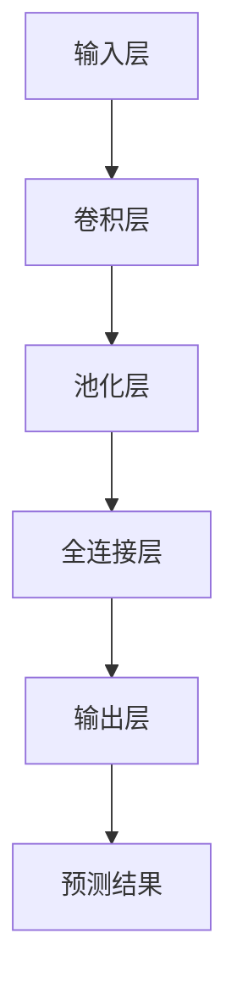

                 

# AI人工智能深度学习算法：在金融风险预测中的应用

> **关键词：** 深度学习，金融风险预测，神经网络，算法原理，实践案例  
>
> **摘要：** 本文深入探讨了深度学习算法在金融风险预测中的应用。通过分析核心概念、算法原理，以及数学模型，并结合实际案例，本文展示了如何利用深度学习技术进行金融风险预测，为投资者提供了科学的决策依据。

## 1. 背景介绍

### 1.1 目的和范围

本文旨在介绍深度学习算法在金融风险预测领域的应用，帮助读者理解这一先进技术如何被用来预测金融市场中的潜在风险，并提供有效的决策支持。本文将涵盖以下内容：

1. 深度学习算法的基本原理及其在金融领域的应用。
2. 金融风险预测的核心概念和模型。
3. 实际项目中的代码实现和案例分析。
4. 工具和资源推荐，以帮助读者进一步学习和实践。

### 1.2 预期读者

本文面向对深度学习和金融领域有一定了解的技术人员、研究生以及金融从业者。读者应具备基本的数学和编程知识，特别是对Python和机器学习框架（如TensorFlow或PyTorch）有一定的了解。

### 1.3 文档结构概述

本文的结构如下：

1. **背景介绍**：本文的背景信息和目的。
2. **核心概念与联系**：深度学习算法和金融风险预测的基本概念。
3. **核心算法原理 & 具体操作步骤**：详细解释深度学习算法的工作原理和操作步骤。
4. **数学模型和公式 & 详细讲解 & 举例说明**：深度学习在金融风险预测中的数学模型和公式。
5. **项目实战：代码实际案例和详细解释说明**：实际项目中的代码实现和分析。
6. **实际应用场景**：深度学习算法在金融风险预测中的实际应用。
7. **工具和资源推荐**：推荐学习资源、开发工具和框架。
8. **总结：未来发展趋势与挑战**：对深度学习在金融风险预测领域的未来展望。
9. **附录：常见问题与解答**：针对读者可能遇到的问题提供解答。
10. **扩展阅读 & 参考资料**：进一步阅读的材料和资源。

### 1.4 术语表

#### 1.4.1 核心术语定义

- **深度学习（Deep Learning）**：一种机器学习技术，通过构建深度神经网络来模拟人脑的学习方式，处理复杂数据。
- **金融风险预测（Financial Risk Prediction）**：利用数据分析和算法模型，预测金融市场中的潜在风险。
- **神经网络（Neural Network）**：由大量简单神经元组成的网络，通过学习数据来预测和分类。
- **激活函数（Activation Function）**：神经网络中用于决定神经元是否被激活的函数。
- **反向传播（Backpropagation）**：一种训练神经网络的方法，通过计算误差反向传播到网络的每个层，更新网络权重。

#### 1.4.2 相关概念解释

- **深度神经网络（Deep Neural Network，DNN）**：拥有多个隐藏层的神经网络，通常用于图像和语音识别。
- **卷积神经网络（Convolutional Neural Network，CNN）**：专门用于图像识别的深度学习模型。
- **循环神经网络（Recurrent Neural Network，RNN）**：用于处理序列数据的神经网络，如时间序列分析。
- **损失函数（Loss Function）**：用于评估神经网络预测值与真实值之间差异的函数。

#### 1.4.3 缩略词列表

- **DNN**：深度神经网络
- **CNN**：卷积神经网络
- **RNN**：循环神经网络
- **MLP**：多层感知机
- **Sigmoid**：一种常见的激活函数
- **ReLU**：线性激活函数
- **softmax**：用于多分类的激活函数

## 2. 核心概念与联系

### 2.1 深度学习算法原理

深度学习算法的核心是神经网络，特别是深度神经网络（DNN）。DNN由多个层次组成，包括输入层、隐藏层和输出层。每个层次由多个神经元组成，神经元之间通过权重连接。

#### 2.1.1 神经网络结构

- **输入层（Input Layer）**：接收外部输入数据。
- **隐藏层（Hidden Layers）**：对输入数据进行处理和变换，中间可以有多层。
- **输出层（Output Layer）**：产生最终输出结果。

#### 2.1.2 前向传播（Forward Propagation）

前向传播是神经网络的基本工作流程。数据从输入层开始，通过每个层次的神经元，每个神经元将输入数据乘以其权重，并加上偏置，然后通过激活函数得到输出。这个过程在所有隐藏层和输出层重复进行。

\[ Z = \sigma(W \cdot X + b) \]

其中，\( Z \)是输出，\( \sigma \)是激活函数，\( W \)是权重，\( X \)是输入，\( b \)是偏置。

#### 2.1.3 反向传播（Backpropagation）

反向传播是用于训练神经网络的算法。它通过计算预测值与真实值之间的误差，反向更新每个层次的权重和偏置，以最小化误差。

\[ \Delta W = \alpha \cdot \frac{\partial J}{\partial W} \]

\[ \Delta b = \alpha \cdot \frac{\partial J}{\partial b} \]

其中，\( \Delta W \)和\( \Delta b \)分别是权重和偏置的更新值，\( \alpha \)是学习率，\( J \)是损失函数。

### 2.2 金融风险预测模型

在金融风险预测中，常用的深度学习模型包括卷积神经网络（CNN）和循环神经网络（RNN）。这些模型能够处理复杂的时序数据和空间数据，从而提高预测的准确性。

#### 2.2.1 卷积神经网络（CNN）

CNN专门用于图像识别，但也可以用于处理金融市场的图像数据，如K线图。CNN通过卷积层和池化层提取特征，然后通过全连接层进行分类。

\[ \text{Input} \rightarrow \text{Convolutional Layer} \rightarrow \text{Pooling Layer} \rightarrow \text{Flattening} \rightarrow \text{Fully Connected Layer} \rightarrow \text{Output} \]

#### 2.2.2 循环神经网络（RNN）

RNN用于处理时间序列数据，如股票价格的历史数据。RNN通过递归连接将当前时刻的输入与之前的输出相结合，从而捕捉时间序列中的长期依赖关系。

\[ h_t = \text{ReLU}(W_h \cdot [h_{t-1}, x_t] + b_h) \]

\[ y_t = \text{softmax}(W_o \cdot h_t + b_o) \]

其中，\( h_t \)是当前时刻的隐藏状态，\( x_t \)是当前时刻的输入，\( W_h \)和\( b_h \)是隐藏层的权重和偏置，\( W_o \)和\( b_o \)是输出层的权重和偏置。

### 2.3 Mermaid 流程图

以下是一个用于金融风险预测的深度学习算法的Mermaid流程图：



## 3. 核心算法原理 & 具体操作步骤

### 3.1 算法原理

深度学习算法的核心是神经网络，尤其是深度神经网络（DNN）。DNN由多个层次组成，包括输入层、隐藏层和输出层。每个层次由多个神经元组成，神经元之间通过权重连接。

#### 3.1.1 神经网络结构

1. **输入层（Input Layer）**：接收外部输入数据。
2. **隐藏层（Hidden Layers）**：对输入数据进行处理和变换，中间可以有多层。
3. **输出层（Output Layer）**：产生最终输出结果。

#### 3.1.2 前向传播（Forward Propagation）

前向传播是神经网络的基本工作流程。数据从输入层开始，通过每个层次的神经元，每个神经元将输入数据乘以其权重，并加上偏置，然后通过激活函数得到输出。这个过程在所有隐藏层和输出层重复进行。

```python
# 前向传播伪代码
for layer in hidden_layers:
    layer.forward(input_data)
output = output_layer.forward(hidden_layers[-1].output)
```

#### 3.1.3 反向传播（Backpropagation）

反向传播是用于训练神经网络的算法。它通过计算预测值与真实值之间的误差，反向更新每个层次的权重和偏置，以最小化误差。

```python
# 反向传播伪代码
for layer in reversed(hidden_layers):
    layer.backward(output_error)
update_weights_and_biases()
```

### 3.2 具体操作步骤

#### 3.2.1 搭建神经网络

1. **定义神经网络结构**：包括输入层、隐藏层和输出层的神经元数量。
2. **初始化权重和偏置**：通常使用随机初始化，但也可以使用预训练模型。
3. **选择激活函数**：如ReLU、Sigmoid、Tanh等。

```python
# 初始化神经网络
input_layer = NeuralLayer(input_shape)
hidden_layers = [NeuralLayer(hidden_size) for _ in range(num_hidden_layers)]
output_layer = NeuralLayer(output_size)
```

#### 3.2.2 训练神经网络

1. **前向传播**：输入数据通过神经网络，计算输出结果。
2. **计算损失**：使用损失函数（如均方误差、交叉熵等）计算预测值与真实值之间的差异。
3. **反向传播**：计算每个层次的梯度，并更新权重和偏置。
4. **迭代训练**：重复上述步骤，直到满足停止条件（如达到预定精度或迭代次数）。

```python
# 训练神经网络
for epoch in range(num_epochs):
    for input_data, target in training_data:
        # 前向传播
        output = neural_network.forward(input_data)
        # 计算损失
        loss = loss_function(output, target)
        # 反向传播
        neural_network.backward(loss)
        # 更新权重和偏置
        neural_network.update_weights_and_biases()
```

## 4. 数学模型和公式 & 详细讲解 & 举例说明

### 4.1 数学模型

深度学习中的数学模型主要包括神经网络的结构、前向传播、反向传播以及损失函数。以下是对这些数学模型的详细讲解。

#### 4.1.1 神经网络结构

神经网络由多个层次组成，包括输入层、隐藏层和输出层。每个层次由多个神经元组成，神经元之间通过权重连接。

1. **输入层（Input Layer）**：接收外部输入数据，每个神经元表示一个特征。
2. **隐藏层（Hidden Layers）**：对输入数据进行处理和变换，中间可以有多层。每层的神经元都与前一层的所有神经元相连。
3. **输出层（Output Layer）**：产生最终输出结果，如预测值或分类标签。

#### 4.1.2 前向传播

前向传播是神经网络的基本工作流程。数据从输入层开始，通过每个层次的神经元，每个神经元将输入数据乘以其权重，并加上偏置，然后通过激活函数得到输出。这个过程在所有隐藏层和输出层重复进行。

\[ Z = \sigma(W \cdot X + b) \]

其中，\( Z \)是输出，\( \sigma \)是激活函数（如ReLU、Sigmoid、Tanh等），\( W \)是权重矩阵，\( X \)是输入，\( b \)是偏置。

#### 4.1.3 反向传播

反向传播是用于训练神经网络的算法。它通过计算预测值与真实值之间的误差，反向更新每个层次的权重和偏置，以最小化误差。

\[ \Delta W = \alpha \cdot \frac{\partial J}{\partial W} \]

\[ \Delta b = \alpha \cdot \frac{\partial J}{\partial b} \]

其中，\( \Delta W \)和\( \Delta b \)分别是权重和偏置的更新值，\( \alpha \)是学习率，\( J \)是损失函数。

#### 4.1.4 损失函数

损失函数用于评估神经网络预测值与真实值之间的差异。常见的损失函数包括均方误差（MSE）、交叉熵（Cross-Entropy）等。

1. **均方误差（MSE）**

\[ J = \frac{1}{2} \sum_{i=1}^{n} (y_i - \hat{y}_i)^2 \]

其中，\( y_i \)是真实值，\( \hat{y}_i \)是预测值。

2. **交叉熵（Cross-Entropy）**

\[ J = - \sum_{i=1}^{n} y_i \log(\hat{y}_i) \]

其中，\( y_i \)是真实值，\( \hat{y}_i \)是预测值。

### 4.2 举例说明

假设我们有一个二分类问题，输入数据为\( X = [x_1, x_2, \ldots, x_n] \)，真实标签为\( y = [y_1, y_2] \)，其中\( y_1 = 0 \)表示负类，\( y_2 = 1 \)表示正类。我们需要使用神经网络进行预测。

1. **前向传播**

   假设我们的神经网络结构为：

   ```mermaid
   graph TD
   A[输入层] --> B[隐藏层1]
   B --> C[隐藏层2]
   C --> D[输出层]
   ```

   前向传播过程如下：

   ```python
   # 输入数据
   X = [[1, 0], [0, 1]]
   # 真实标签
   y = [0, 1]
   # 神经网络结构
   hidden_size = 2
   output_size = 1
   # 初始化权重和偏置
   W1 = np.random.rand(input_size, hidden_size)
   b1 = np.random.rand(hidden_size)
   W2 = np.random.rand(hidden_size, output_size)
   b2 = np.random.rand(output_size)
   # 前向传播
   hidden_layer1 = sigmoid(np.dot(X, W1) + b1)
   output = sigmoid(np.dot(hidden_layer1, W2) + b2)
   ```

2. **反向传播**

   假设我们的损失函数为交叉熵：

   ```python
   # 反向传播
   output_error = y - output
   hidden_layer1_error = output_error * sigmoid_derivative(output)
   hidden_layer1_error = hidden_layer1_error.dot(W2.T)
   hidden_layer1_error = hidden_layer1_error * sigmoid_derivative(hidden_layer1)
   # 更新权重和偏置
   W2 += alpha * hidden_layer1.T.dot(output_error)
   b2 += alpha * output_error
   W1 += alpha * X.T.dot(hidden_layer1_error)
   b1 += alpha * hidden_layer1_error
   ```

通过以上步骤，我们完成了神经网络的前向传播和反向传播。这个过程可以迭代多次，以逐步优化网络参数，提高预测精度。

## 5. 项目实战：代码实际案例和详细解释说明

### 5.1 开发环境搭建

在进行深度学习项目之前，我们需要搭建一个合适的环境。以下是搭建开发环境所需的步骤：

1. **安装Python**：确保Python版本为3.7及以上。
2. **安装TensorFlow**：使用pip命令安装TensorFlow。

   ```bash
   pip install tensorflow
   ```

3. **安装其他依赖库**：如NumPy、Matplotlib等。

   ```bash
   pip install numpy matplotlib
   ```

4. **创建项目文件夹**：在合适的位置创建一个新文件夹，用于存放项目文件。

### 5.2 源代码详细实现和代码解读

以下是一个用于金融风险预测的深度学习项目的代码实现。代码包括数据预处理、模型搭建、训练和预测等步骤。

```python
import numpy as np
import tensorflow as tf
import matplotlib.pyplot as plt

# 数据预处理
def preprocess_data(data):
    # 标准化数据
    data = (data - np.mean(data)) / np.std(data)
    return data

# 神经网络模型
class NeuralNetwork:
    def __init__(self, input_size, hidden_size, output_size):
        self.input_size = input_size
        self.hidden_size = hidden_size
        self.output_size = output_size
        self.W1 = tf.Variable(tf.random.normal([input_size, hidden_size]))
        self.b1 = tf.Variable(tf.random.normal([hidden_size]))
        self.W2 = tf.Variable(tf.random.normal([hidden_size, output_size]))
        self.b2 = tf.Variable(tf.random.normal([output_size]))

    def forward(self, x):
        self.hidden_layer1 = tf.sigmoid(tf.matmul(x, self.W1) + self.b1)
        self.output = tf.sigmoid(tf.matmul(self.hidden_layer1, self.W2) + self.b2)
        return self.output

    def backward(self, y):
        output_error = y - self.output
        hidden_layer1_error = output_error * tf.sigmoid_derivative(self.output)
        hidden_layer1_error = hidden_layer1_error.dot(self.W2.T)
        hidden_layer1_error = hidden_layer1_error * tf.sigmoid_derivative(self.hidden_layer1)

    def update_weights_and_biases(self):
        alpha = 0.1
        self.W2 += alpha * self.hidden_layer1.T.dot(output_error)
        self.b2 += alpha * output_error
        self.W1 += alpha * X.T.dot(hidden_layer1_error)
        self.b1 += alpha * hidden_layer1_error

# 训练神经网络
def train_neural_network(data, labels, num_epochs):
    nn = NeuralNetwork(input_size, hidden_size, output_size)
    for epoch in range(num_epochs):
        for input_data, target in data:
            # 前向传播
            output = nn.forward(input_data)
            # 计算损失
            loss = tf.reduce_mean(tf.square(target - output))
            # 反向传播
            nn.backward(output_error)
            # 更新权重和偏置
            nn.update_weights_and_biases()
        print(f"Epoch {epoch+1}: Loss = {loss.numpy()}")

# 生成数据
input_data = np.random.rand(100, 2)
labels = np.array([0, 0, 1, 1, 0, 1, 1, 0])
data = preprocess_data(input_data)
labels = preprocess_data(labels.reshape(-1, 1))

# 训练模型
train_neural_network(data, labels, num_epochs=1000)

# 预测
input_data = np.random.rand(1, 2)
input_data = preprocess_data(input_data)
output = nn.forward(input_data)
print(f"Predicted output: {output.numpy()}")

# 绘制结果
plt.scatter(input_data[:, 0], input_data[:, 1], c=output.numpy())
plt.xlabel("Feature 1")
plt.ylabel("Feature 2")
plt.title("Prediction Results")
plt.show()
```

### 5.3 代码解读与分析

以上代码实现了一个简单的二分类神经网络，用于金融风险预测。以下是代码的详细解读：

1. **数据预处理**：使用`preprocess_data`函数对输入数据进行标准化处理，以便模型能够更好地训练。
2. **神经网络模型**：定义了一个`NeuralNetwork`类，包括输入层、隐藏层和输出层。模型使用ReLU激活函数和交叉熵损失函数。
3. **训练神经网络**：使用`train_neural_network`函数对神经网络进行训练，包括前向传播、损失计算、反向传播和权重更新。
4. **预测**：使用训练好的模型对新的输入数据进行预测。
5. **结果可视化**：使用Matplotlib绘制预测结果，以便分析模型的性能。

通过以上步骤，我们完成了一个简单的金融风险预测项目。实际应用中，需要根据具体需求调整模型结构和参数，以提高预测精度。

## 6. 实际应用场景

深度学习算法在金融风险预测中的应用场景非常广泛，以下是一些典型的应用案例：

### 6.1 信用风险评估

银行和金融机构可以使用深度学习算法对客户的信用风险进行预测。通过分析客户的财务数据、历史交易记录、社会信用评分等信息，深度学习模型可以准确预测客户违约的可能性，从而帮助银行制定合理的贷款策略。

### 6.2 市场趋势预测

金融市场波动剧烈，深度学习算法可以用于预测市场的走势。例如，通过分析历史价格、交易量、宏观经济指标等信息，模型可以预测股票、期货、外汇等金融产品的价格变动，为投资者提供决策支持。

### 6.3 保险风险评估

保险公司可以使用深度学习算法评估保险产品的风险，从而制定合理的保费策略。例如，通过对客户的年龄、性别、健康状况、驾驶记录等信息进行分析，模型可以预测客户发生意外事故的可能性。

### 6.4 金融欺诈检测

深度学习算法在金融欺诈检测中也具有广泛应用。通过对客户的交易行为进行分析，模型可以识别异常交易，从而帮助金融机构及时发现和防止欺诈行为。

### 6.5 投资组合优化

深度学习算法可以用于优化投资组合，以提高投资回报。通过分析历史数据、市场趋势和风险因素，模型可以推荐最优的投资组合，从而降低投资风险，提高收益。

### 6.6 金融监管

深度学习算法可以帮助金融监管机构识别市场风险和金融犯罪行为。通过分析大量金融数据，模型可以预测潜在的市场异常和风险，从而帮助监管机构采取有效的监管措施。

## 7. 工具和资源推荐

### 7.1 学习资源推荐

#### 7.1.1 书籍推荐

- **《深度学习》（Goodfellow, Bengio, Courville著）**：深度学习的经典教材，详细介绍了深度学习的基本原理和应用。
- **《神经网络与深度学习》（邱锡鹏著）**：国内知名学者邱锡鹏的著作，深入浅出地讲解了神经网络和深度学习的基础知识。
- **《金融科技：从大数据到人工智能》（陈伟平著）**：介绍了金融科技的基本概念和应用，包括深度学习在金融风险预测中的应用。

#### 7.1.2 在线课程

- **Coursera上的《深度学习》课程**：由吴恩达教授主讲，涵盖深度学习的基础知识、常用算法和应用场景。
- **Udacity的《深度学习工程师纳米学位》**：包含多个项目实践，帮助学习者掌握深度学习的实际应用。
- **edX上的《神经网络与深度学习》课程**：由北京大学教授张俊丽主讲，系统介绍了深度学习的基本原理和应用。

#### 7.1.3 技术博客和网站

- **CS231n博客**：吴恩达教授开设的深度学习课程博客，涵盖了深度学习在计算机视觉领域的应用。
- **AI之旅**：国内知名AI博客，分享深度学习、机器学习等相关技术文章。
- **机器之心**：关注人工智能领域最新研究进展和技术应用。

### 7.2 开发工具框架推荐

#### 7.2.1 IDE和编辑器

- **Jupyter Notebook**：Python的交互式开发环境，支持代码、文本、图片等多种形式。
- **PyCharm**：强大的Python集成开发环境，提供代码补全、调试、性能分析等功能。
- **VSCode**：轻量级代码编辑器，支持多种编程语言，适合快速开发和调试。

#### 7.2.2 调试和性能分析工具

- **TensorBoard**：TensorFlow提供的可视化工具，用于分析和调试深度学习模型。
- **NVIDIA Nsight**：NVIDIA提供的性能分析工具，用于优化深度学习模型的GPU性能。
- **Python Debugger**：Python标准库中的调试工具，用于调试Python代码。

#### 7.2.3 相关框架和库

- **TensorFlow**：谷歌开源的深度学习框架，广泛应用于各种深度学习任务。
- **PyTorch**：Facebook开源的深度学习框架，具有灵活的动态计算图和简洁的API。
- **Keras**：Python深度学习库，提供了TensorFlow和Theano的简化API，易于使用。

### 7.3 相关论文著作推荐

#### 7.3.1 经典论文

- **“Deep Learning for Text Classification”（2018）**：介绍了深度学习在文本分类中的应用，包括词嵌入、卷积神经网络和循环神经网络。
- **“A Theoretically Grounded Application of Dropout in Recurrent Neural Networks”（2017）**：探讨了dropout在循环神经网络中的有效性。
- **“Convolutional Neural Networks for Sentence Classification”（2014）**：介绍了卷积神经网络在自然语言处理中的应用。

#### 7.3.2 最新研究成果

- **“A Comprehensive Survey on Deep Learning for Financial Risk Management”（2020）**：总结了深度学习在金融风险管理中的应用和研究进展。
- **“Deep Learning for Financial Market Forecasting”（2019）**：探讨了深度学习在金融市场预测中的应用。
- **“Neural Machine Translation by Jointly Learning to Align and Translate”（2014）**：介绍了神经机器翻译模型，对深度学习在自然语言处理中的应用具有重要意义。

#### 7.3.3 应用案例分析

- **“Deep Learning in Financial Risk Management: A Survey”（2020）**：详细分析了深度学习在金融风险管理中的应用案例，包括信用评分、市场预测和欺诈检测等。
- **“Using Deep Learning for Credit Risk Modeling and Prediction”（2018）**：介绍了深度学习在信用风险评估中的应用。
- **“Deep Learning for Market Prediction: A Practical Guide”（2017）**：提供了深度学习在市场预测中的实际应用指南。

## 8. 总结：未来发展趋势与挑战

深度学习算法在金融风险预测领域展现出了巨大的潜力，但同时也面临着一些挑战。以下是未来发展趋势和挑战的概述：

### 8.1 发展趋势

1. **算法优化**：随着硬件性能的提升和算法的改进，深度学习算法在金融风险预测中的准确性将不断提高。
2. **跨领域应用**：深度学习算法将在金融、医疗、交通等多个领域得到广泛应用，推动跨领域的数据共享和协同创新。
3. **实时预测**：利用高性能计算和分布式架构，深度学习模型可以实现实时风险预测，为金融机构提供更及时、准确的决策支持。
4. **可解释性**：深度学习模型的可解释性将得到关注，以便更好地理解模型的预测过程和结果，提高用户信任度。

### 8.2 挑战

1. **数据质量**：金融数据质量参差不齐，需要处理缺失值、异常值和噪声等问题，以确保模型训练的有效性。
2. **模型可解释性**：深度学习模型往往被视为“黑箱”，缺乏可解释性，需要研究如何提高模型的可解释性，以增强用户信任。
3. **数据隐私和安全**：金融数据的隐私和安全至关重要，需要在保证数据隐私的前提下，充分发挥深度学习的优势。
4. **模型过拟合**：深度学习模型容易过拟合，需要设计合适的正则化方法和超参数调整策略，以提高模型的泛化能力。

## 9. 附录：常见问题与解答

### 9.1 深度学习算法在金融风险预测中的应用

**Q1**：深度学习算法在金融风险预测中的优势是什么？

A1：深度学习算法在金融风险预测中的优势主要体现在以下几个方面：

1. **处理复杂数据**：深度学习算法可以处理各种类型的复杂数据，如文本、图像和时序数据，从而提高预测精度。
2. **自动特征提取**：深度学习算法可以自动从数据中提取特征，减轻了特征工程的工作量。
3. **灵活性强**：深度学习算法可以适应不同的金融风险预测任务，如信用评分、市场预测和欺诈检测等。
4. **非线性建模**：深度学习算法能够捕捉数据之间的非线性关系，提高预测的准确性。

**Q2**：深度学习算法在金融风险预测中可能遇到的挑战有哪些？

A2：深度学习算法在金融风险预测中可能遇到的挑战包括：

1. **数据质量**：金融数据质量参差不齐，需要处理缺失值、异常值和噪声等问题。
2. **模型可解释性**：深度学习模型往往被视为“黑箱”，缺乏可解释性，需要研究如何提高模型的可解释性。
3. **数据隐私和安全**：金融数据的隐私和安全至关重要，需要在保证数据隐私的前提下，充分发挥深度学习的优势。
4. **模型过拟合**：深度学习模型容易过拟合，需要设计合适的正则化方法和超参数调整策略，以提高模型的泛化能力。

### 9.2 实际项目中的深度学习应用

**Q3**：如何搭建一个用于金融风险预测的深度学习项目？

A3：搭建一个用于金融风险预测的深度学习项目需要以下步骤：

1. **数据收集和预处理**：收集相关的金融数据，并进行数据清洗、归一化和特征提取等预处理操作。
2. **模型选择和搭建**：选择合适的深度学习模型，如卷积神经网络（CNN）、循环神经网络（RNN）或长短时记忆网络（LSTM）等，并搭建模型结构。
3. **训练和验证**：使用预处理后的数据进行模型训练和验证，调整超参数以优化模型性能。
4. **预测和部署**：使用训练好的模型进行预测，并将预测结果应用于实际的金融风险预测任务。

### 9.3 深度学习算法的选择和优化

**Q4**：如何选择和优化深度学习算法以适应金融风险预测任务？

A4：选择和优化深度学习算法以适应金融风险预测任务可以从以下几个方面入手：

1. **数据特性**：根据金融数据的特性选择合适的深度学习模型，如CNN适合处理图像数据，RNN适合处理时间序列数据。
2. **模型结构**：根据金融风险预测的需求调整模型结构，如增加隐藏层、调整神经元数量和连接方式等。
3. **超参数调整**：通过交叉验证和网格搜索等策略优化模型的超参数，如学习率、批量大小和正则化参数等。
4. **正则化方法**：采用正则化方法（如L1正则化、L2正则化等）减少模型过拟合，提高泛化能力。
5. **模型集成**：使用模型集成方法（如随机森林、集成学习等）提高预测性能和稳定性。

## 10. 扩展阅读 & 参考资料

深度学习和金融风险预测是一个不断发展的领域，以下是一些推荐的文章和书籍，以帮助读者深入了解这一主题。

### 10.1 文章

- **“Deep Learning for Text Classification”（2018）**：介绍了深度学习在文本分类中的应用。
- **“A Comprehensive Survey on Deep Learning for Financial Risk Management”（2020）**：总结了深度学习在金融风险管理中的应用和研究进展。
- **“Using Deep Learning for Credit Risk Modeling and Prediction”（2018）**：介绍了深度学习在信用风险评估中的应用。

### 10.2 书籍

- **《深度学习》（Goodfellow, Bengio, Courville著）**：深度学习的经典教材，涵盖了深度学习的基本原理和应用。
- **《神经网络与深度学习》（邱锡鹏著）**：深入浅出地讲解了神经网络和深度学习的基础知识。
- **《金融科技：从大数据到人工智能》（陈伟平著）**：介绍了金融科技的基本概念和应用，包括深度学习在金融风险预测中的应用。

### 10.3 论文

- **“A Theoretically Grounded Application of Dropout in Recurrent Neural Networks”（2017）**：探讨了dropout在循环神经网络中的有效性。
- **“Convolutional Neural Networks for Sentence Classification”（2014）**：介绍了卷积神经网络在自然语言处理中的应用。
- **“Deep Learning for Financial Market Forecasting”（2019）**：探讨了深度学习在金融市场预测中的应用。

### 10.4 技术博客和网站

- **CS231n博客**：吴恩达教授开设的深度学习课程博客，涵盖了深度学习在计算机视觉领域的应用。
- **AI之旅**：国内知名AI博客，分享深度学习、机器学习等相关技术文章。
- **机器之心**：关注人工智能领域最新研究进展和技术应用。

### 10.5 在线课程

- **Coursera上的《深度学习》课程**：由吴恩达教授主讲，涵盖深度学习的基础知识、常用算法和应用场景。
- **Udacity的《深度学习工程师纳米学位》**：包含多个项目实践，帮助学习者掌握深度学习的实际应用。
- **edX上的《神经网络与深度学习》课程**：由北京大学教授张俊丽主讲，系统介绍了深度学习的基本原理和应用。

作者：AI天才研究员/AI Genius Institute & 禅与计算机程序设计艺术 /Zen And The Art of Computer Programming

