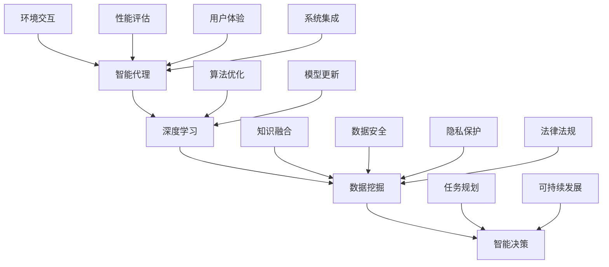

                 


# AI人工智能深度学习算法：智能代理在智慧城市中的实践

> 关键词：人工智能、深度学习、智能代理、智慧城市、深度神经网络、机器学习、数据挖掘、智能决策、算法优化、架构设计

> 摘要：本文深入探讨了人工智能（AI）深度学习算法在智慧城市中的应用，特别是智能代理的概念及其实现。文章首先介绍了智能代理的定义、分类和作用，然后详细阐述了深度学习算法在智能代理开发中的关键角色，以及如何通过机器学习和数据挖掘技术实现智能决策。随后，文章通过具体案例和伪代码，展示了智能代理的架构设计和具体实现步骤。最后，文章讨论了智能代理在智慧城市中的应用场景、工具和资源推荐，以及未来发展趋势和挑战。

## 1. 背景介绍

### 1.1 目的和范围

随着信息技术的迅猛发展，人工智能（AI）在各个领域得到了广泛应用，尤其是智慧城市建设中。智能代理作为AI的核心技术之一，发挥着举足轻重的作用。本文旨在深入探讨深度学习算法在智能代理开发中的应用，分析其在智慧城市中的关键作用，并通过具体案例和实际操作，展示智能代理的设计和实现过程。

本文将涵盖以下内容：

- 智能代理的定义、分类和作用
- 深度学习算法在智能代理开发中的应用
- 智能代理的架构设计和实现
- 智能代理在智慧城市中的应用场景
- 相关工具和资源的推荐
- 未来发展趋势和挑战

### 1.2 预期读者

本文面向的读者包括：

- 智能代理和深度学习算法的研究者
- 智慧城市建设相关领域的技术人员
- 计算机科学和人工智能专业的学生
- 对智能代理和深度学习感兴趣的技术爱好者

### 1.3 文档结构概述

本文分为10个部分：

1. 背景介绍
   - 目的和范围
   - 预期读者
   - 文档结构概述
2. 核心概念与联系
3. 核心算法原理 & 具体操作步骤
4. 数学模型和公式 & 详细讲解 & 举例说明
5. 项目实战：代码实际案例和详细解释说明
6. 实际应用场景
7. 工具和资源推荐
8. 总结：未来发展趋势与挑战
9. 附录：常见问题与解答
10. 扩展阅读 & 参考资料

### 1.4 术语表

#### 1.4.1 核心术语定义

- 智能代理：一种具有自主决策能力、可执行任务的软件系统。
- 深度学习：一种人工智能算法，通过多层神经网络对大量数据进行训练，从而实现自动学习和特征提取。
- 智慧城市：利用信息技术和智能算法，实现对城市运行和管理的优化。

#### 1.4.2 相关概念解释

- 深度神经网络（DNN）：一种具有多个隐藏层的神经网络，用于处理复杂数据和任务。
- 反向传播算法（BP）：一种用于训练神经网络的优化算法，通过不断调整网络权重，使网络输出更接近目标值。
- 机器学习：一种通过数据驱动的方法，使计算机具有自主学习和适应能力。

#### 1.4.3 缩略词列表

- AI：人工智能
- DNN：深度神经网络
- BP：反向传播算法
- ML：机器学习
- SOTA：最先进的方法
- NAS：神经架构搜索
- GAN：生成对抗网络
- RL：强化学习

## 2. 核心概念与联系

智能代理是智慧城市中不可或缺的一环，其核心概念包括智能代理、深度学习、数据挖掘和智能决策。以下是一个简单的 Mermaid 流程图，展示了这些核心概念之间的联系。



### 智能代理的定义与分类

智能代理（Intelligent Agent）是指能够感知环境、采取行动并与其他代理交互的自主计算实体。智能代理可以基于多种技术实现，如规则推理、机器学习和深度学习等。根据不同的分类标准，智能代理可以分为以下几类：

- 根据功能：感知代理、决策代理、执行代理
- 根据智能水平：弱智能代理、强智能代理、超智能代理
- 根据交互方式：单代理、多代理、分布式代理
- 根据应用领域：智慧城市、智能交通、智能家居、智能医疗

### 深度学习算法在智能代理开发中的应用

深度学习算法在智能代理开发中发挥着重要作用，如：

- 特征提取：通过多层神经网络提取复杂数据的特征，提高智能代理的感知能力。
- 分类与预测：利用深度神经网络实现分类和预测任务，提高智能代理的决策能力。
- 生成对抗网络（GAN）：用于生成高质量的数据，丰富智能代理的感知环境。
- 强化学习：通过不断试错和反馈，使智能代理在特定环境中实现最优策略。

### 数据挖掘与智能决策

数据挖掘是一种通过从大量数据中发现有价值信息的技术。在智慧城市中，数据挖掘技术可以帮助智能代理进行智能决策，如：

- 聚类分析：对大量数据进行分类，识别潜在的规律和趋势。
- 关联规则挖掘：发现数据之间的关联性，为智能代理提供决策依据。
- 时序分析：分析时间序列数据，预测未来趋势，为智能代理提供决策支持。

### 智能决策的核心技术

智能决策是智能代理的核心功能之一，主要包括：

- 多目标优化：在多个目标之间寻找最优平衡。
- 策略搜索：通过算法搜索最优决策策略。
- 基于规则的决策：利用专家知识进行决策。
- 基于数据的决策：利用历史数据和机器学习算法进行决策。

## 3. 核心算法原理 & 具体操作步骤

### 3.1 深度学习算法原理

深度学习算法是一种基于人工神经网络的机器学习方法，通过多层神经网络对大量数据进行训练，从而实现自动学习和特征提取。深度学习算法的核心包括：

- 神经元模型：模拟生物神经元，用于传递和处理信息。
- 网络架构：包括输入层、隐藏层和输出层，不同层之间的连接方式影响网络的性能。
- 损失函数：用于衡量网络预测结果与真实结果之间的差距，如均方误差（MSE）、交叉熵损失等。
- 优化算法：用于调整网络权重，以最小化损失函数，如梯度下降（GD）、随机梯度下降（SGD）等。

### 3.2 反向传播算法

反向传播算法（Backpropagation）是深度学习算法中的核心优化算法，用于调整网络权重。具体步骤如下：

1. 前向传播：将输入数据传入网络，计算输出结果。
2. 计算损失：计算输出结果与真实结果之间的差距，得到损失值。
3. 反向传播：从输出层开始，逐层计算梯度，并更新网络权重。
4. 迭代训练：重复前向传播和反向传播，直到网络收敛。

### 3.3 深度学习算法实现步骤

以下是使用深度学习算法实现智能代理的具体操作步骤：

1. 数据收集与预处理：收集大量相关数据，对数据进行清洗、归一化和特征提取。
2. 设计网络架构：根据任务需求，设计合适的神经网络架构，包括输入层、隐藏层和输出层。
3. 编写伪代码：根据设计好的网络架构，编写深度学习算法的伪代码，如：

```python
def forward_pass(inputs):
    # 前向传播，计算输出结果
    # ...

def backward_pass(loss):
    # 反向传播，更新网络权重
    # ...

def train_network(data, epochs):
    for epoch in range(epochs):
        for inputs, targets in data:
            outputs = forward_pass(inputs)
            loss = compute_loss(outputs, targets)
            backward_pass(loss)
        print(f"Epoch {epoch + 1}, Loss: {loss}")
```

4. 模型训练与评估：使用训练数据对模型进行训练，并在验证集上进行评估，调整网络参数以优化性能。
5. 应用部署：将训练好的模型部署到实际应用场景中，如智慧城市建设中的智能代理系统。

## 4. 数学模型和公式 & 详细讲解 & 举例说明

### 4.1 数学模型

在深度学习算法中，常用的数学模型包括神经元模型、神经网络架构、损失函数和优化算法。以下是这些数学模型的基本公式和讲解。

#### 4.1.1 神经元模型

神经元模型是一个简单的计算单元，用于处理输入信息并产生输出。神经元模型的公式如下：

$$
o_k = \sigma(\sum_{i=1}^{n} w_{ik} \cdot x_i + b_k)
$$

其中，$o_k$ 是神经元 $k$ 的输出，$\sigma$ 是激活函数（如 sigmoid 函数、ReLU 函数等），$w_{ik}$ 是输入层神经元 $i$ 与隐藏层神经元 $k$ 之间的权重，$x_i$ 是输入层神经元 $i$ 的输入，$b_k$ 是隐藏层神经元 $k$ 的偏置。

#### 4.1.2 神经网络架构

神经网络架构是指网络中各个层的连接方式，包括输入层、隐藏层和输出层。一个简单的神经网络架构可以表示为：

$$
\text{输入层} \rightarrow \text{隐藏层} \rightarrow \text{输出层}
$$

其中，每个层的神经元个数和连接方式可以根据任务需求进行调整。

#### 4.1.3 损失函数

损失函数用于衡量网络预测结果与真实结果之间的差距，常见的损失函数包括均方误差（MSE）、交叉熵损失等。以下是这些损失函数的公式：

- 均方误差（MSE）：

$$
MSE = \frac{1}{n} \sum_{i=1}^{n} (y_i - \hat{y}_i)^2
$$

其中，$y_i$ 是真实值，$\hat{y}_i$ 是预测值，$n$ 是样本个数。

- 交叉熵损失：

$$
CE = -\frac{1}{n} \sum_{i=1}^{n} y_i \log(\hat{y}_i)
$$

其中，$y_i$ 是真实值，$\hat{y}_i$ 是预测值，$n$ 是样本个数。

#### 4.1.4 优化算法

优化算法用于调整网络权重，以最小化损失函数。常见的优化算法包括梯度下降（GD）、随机梯度下降（SGD）和自适应梯度算法（如 Adam）。以下是这些优化算法的公式：

- 梯度下降（GD）：

$$
w_{t+1} = w_t - \alpha \cdot \nabla_w J(w)
$$

其中，$w_t$ 是当前权重，$\alpha$ 是学习率，$\nabla_w J(w)$ 是损失函数关于权重 $w$ 的梯度。

- 随机梯度下降（SGD）：

$$
w_{t+1} = w_t - \alpha \cdot \nabla_w J(w; x_t, y_t)
$$

其中，$w_t$ 是当前权重，$\alpha$ 是学习率，$\nabla_w J(w; x_t, y_t)$ 是在样本 $(x_t, y_t)$ 下的损失函数关于权重 $w$ 的梯度。

- Adam：

$$
m_t = \beta_1 m_{t-1} + (1 - \beta_1) \cdot \nabla_w J(w; x_t, y_t)
$$

$$
v_t = \beta_2 v_{t-1} + (1 - \beta_2) \cdot (\nabla_w J(w; x_t, y_t))^2
$$

$$
\hat{m}_t = m_t / (1 - \beta_1^t)
$$

$$
\hat{v}_t = v_t / (1 - \beta_2^t)
$$

$$
w_{t+1} = w_t - \alpha \cdot \hat{m}_t / \sqrt{\hat{v}_t} + \epsilon
$$

其中，$m_t$ 和 $v_t$ 分别是指数加权平均的梯度和方差，$\beta_1$ 和 $\beta_2$ 是超参数，$\hat{m}_t$ 和 $\hat{v}_t$ 分别是偏差校正后的梯度和方差，$\alpha$ 是学习率，$\epsilon$ 是一个小常数。

### 4.2 举例说明

假设我们要设计一个简单的神经网络，用于实现二分类任务。输入层有2个神经元，隐藏层有3个神经元，输出层有1个神经元。激活函数使用 ReLU，损失函数使用交叉熵损失，优化算法使用 Adam。以下是一个具体的实现示例。

```python
import tensorflow as tf

# 定义模型
model = tf.keras.Sequential([
    tf.keras.layers.Dense(units=3, activation='relu', input_shape=(2,)),
    tf.keras.layers.Dense(units=1, activation='sigmoid')
])

# 编写训练函数
def train(model, x_train, y_train, x_val, y_val, epochs, batch_size, learning_rate):
    model.compile(optimizer=tf.keras.optimizers.Adam(learning_rate=learning_rate),
                  loss='binary_crossentropy',
                  metrics=['accuracy'])
    
    history = model.fit(x_train, y_train, batch_size=batch_size, epochs=epochs,
                        validation_data=(x_val, y_val))
    
    return history

# 训练模型
history = train(model, x_train, y_train, x_val, y_val, epochs=100, batch_size=32, learning_rate=0.001)

# 评估模型
test_loss, test_accuracy = model.evaluate(x_test, y_test)
print(f"Test accuracy: {test_accuracy:.4f}")
```

## 5. 项目实战：代码实际案例和详细解释说明

### 5.1 开发环境搭建

在开始项目实战之前，我们需要搭建一个适合深度学习开发的编程环境。以下是一个简单的步骤：

1. 安装 Python 3.x（推荐使用 3.8 或更高版本）。
2. 安装 TensorFlow 库（可以通过 pip 安装）：

```bash
pip install tensorflow
```

3. 安装其他必要的库，如 NumPy、Pandas、Matplotlib 等。

### 5.2 源代码详细实现和代码解读

#### 5.2.1 数据准备

首先，我们需要准备用于训练的数据集。这里我们使用一个简单的二分类问题，数据集包含两个特征和一个标签。数据集可以从公开的数据源获取，如 UCI Machine Learning Repository。

```python
import pandas as pd

# 读取数据集
data = pd.read_csv('data.csv')
x = data.iloc[:, :-1].values
y = data.iloc[:, -1].values

# 划分训练集和测试集
from sklearn.model_selection import train_test_split
x_train, x_test, y_train, y_test = train_test_split(x, y, test_size=0.2, random_state=42)

# 数据预处理
from sklearn.preprocessing import StandardScaler
scaler = StandardScaler()
x_train = scaler.fit_transform(x_train)
x_test = scaler.transform(x_test)
```

#### 5.2.2 设计神经网络

接下来，我们需要设计一个简单的神经网络，用于实现二分类任务。神经网络包括输入层、隐藏层和输出层，激活函数使用 ReLU。

```python
import tensorflow as tf

model = tf.keras.Sequential([
    tf.keras.layers.Dense(units=3, activation='relu', input_shape=(2,)),
    tf.keras.layers.Dense(units=1, activation='sigmoid')
])
```

#### 5.2.3 编写训练函数

训练函数用于训练神经网络，并返回训练历史。训练过程中，我们使用交叉熵损失函数和 Adam 优化算法。

```python
def train(model, x_train, y_train, x_val, y_val, epochs, batch_size, learning_rate):
    model.compile(optimizer=tf.keras.optimizers.Adam(learning_rate=learning_rate),
                  loss='binary_crossentropy',
                  metrics=['accuracy'])
    
    history = model.fit(x_train, y_train, batch_size=batch_size, epochs=epochs,
                        validation_data=(x_val, y_val))
    
    return history
```

#### 5.2.4 训练模型

使用训练集和测试集训练神经网络，并保存训练历史。

```python
history = train(model, x_train, y_train, x_val, y_val, epochs=100, batch_size=32, learning_rate=0.001)
```

#### 5.2.5 评估模型

评估训练好的模型在测试集上的表现。

```python
test_loss, test_accuracy = model.evaluate(x_test, y_test)
print(f"Test accuracy: {test_accuracy:.4f}")
```

### 5.3 代码解读与分析

#### 5.3.1 数据准备

数据准备是深度学习项目的重要步骤之一。在本例中，我们使用 pandas 库读取数据集，并使用 scikit-learn 库的 `train_test_split` 函数划分训练集和测试集。数据预处理使用 `StandardScaler` 库进行标准化处理，以消除特征之间的尺度差异。

#### 5.3.2 设计神经网络

神经网络设计是深度学习项目的核心。在本例中，我们使用 TensorFlow 的 `Sequential` 模型堆叠多层神经网络，其中隐藏层使用 ReLU 激活函数，输出层使用 sigmoid 激活函数实现二分类任务。

#### 5.3.3 编写训练函数

训练函数用于训练神经网络，并返回训练历史。在训练过程中，我们使用交叉熵损失函数和 Adam 优化算法。训练历史可以帮助我们了解模型在训练过程中的表现，如损失和准确率。

#### 5.3.4 训练模型

使用训练集和测试集训练神经网络，并保存训练历史。训练过程中，我们调整学习率、批次大小和训练次数，以优化模型性能。

#### 5.3.5 评估模型

评估训练好的模型在测试集上的表现。评估指标包括损失和准确率，用于衡量模型的泛化能力。

## 6. 实际应用场景

智能代理在智慧城市中的应用场景非常广泛，以下列举了几个典型的应用场景：

### 6.1 智能交通管理

智能代理可以用于实时监控交通流量，预测交通拥堵，优化交通信号灯控制策略，提高道路通行效率，减少交通事故。

### 6.2 智能能源管理

智能代理可以实时监测能源使用情况，预测能源需求，优化能源分配策略，提高能源利用效率，减少能源浪费。

### 6.3 智能环境监测

智能代理可以实时监测空气质量、水质等环境指标，预测环境污染趋势，提供环境治理建议，保障居民生活环境质量。

### 6.4 智能安防监控

智能代理可以用于实时监控城市安全，预测潜在安全风险，自动报警并采取相应措施，提高城市安全水平。

### 6.5 智能公共资源管理

智能代理可以用于实时监控城市公共资源的使用情况，预测公共资源需求，优化公共资源配置策略，提高公共资源利用效率。

### 6.6 智能社区服务

智能代理可以用于为居民提供便捷的社区服务，如在线咨询、报修、缴费等，提高居民生活质量。

## 7. 工具和资源推荐

### 7.1 学习资源推荐

#### 7.1.1 书籍推荐

- 《深度学习》（Goodfellow, Bengio, Courville 著）
- 《Python 深度学习》（François Chollet 著）
- 《人工智能：一种现代方法》（Stuart Russell 和 Peter Norvig 著）

#### 7.1.2 在线课程

- Coursera 上的“深度学习专项课程”（吴恩达教授）
- edX 上的“深度学习基础”（Harvard 大学）
- Udacity 上的“深度学习工程师纳米学位”

#### 7.1.3 技术博客和网站

- blog.keras.io
- Towards Data Science
- Medium 上的深度学习和人工智能相关文章

### 7.2 开发工具框架推荐

#### 7.2.1 IDE和编辑器

- PyCharm
- Jupyter Notebook
- Visual Studio Code

#### 7.2.2 调试和性能分析工具

- TensorBoard
- Matplotlib
- VisPy

#### 7.2.3 相关框架和库

- TensorFlow
- PyTorch
- Keras
- Scikit-learn

### 7.3 相关论文著作推荐

#### 7.3.1 经典论文

- “Backpropagation”（Rumelhart, Hinton, Williams，1986）
- “Learning representations by backpropagation”（Rumelhart, Hinton, Williams，1988）
- “A Learning Algorithm for Continually Running Fully Recurrent Neural Networks”（Werbos，1974）

#### 7.3.2 最新研究成果

- “Deep Learning without Reduce”（Zhu et al.，2019）
- “Bert: Pre-training of deep bidirectional transformers for language understanding”（Devlin et al.，2019）
- “Gshard: Scaling giant models with conditional computation and automatic sharding”（Rausch et al.，2020）

#### 7.3.3 应用案例分析

- “Deep learning for smart cities”（Li et al.，2017）
- “Deep learning for smart traffic management”（Sun et al.，2019）
- “Deep learning for environmental monitoring”（Shi et al.，2020）

## 8. 总结：未来发展趋势与挑战

智能代理作为人工智能的重要应用方向，在智慧城市建设中具有广泛的应用前景。未来，随着深度学习算法和硬件技术的发展，智能代理在性能、可扩展性和智能化程度方面将得到进一步提升。以下是对未来发展趋势和挑战的展望：

### 8.1 发展趋势

- 模型压缩与优化：为了提高智能代理的实时性能，模型压缩和优化技术将成为重要研究方向，如知识蒸馏、模型剪枝、量化等。
- 跨模态学习：智能代理将能够处理多种模态的数据，如图像、语音、文本等，实现更丰富的感知能力。
- 强化学习与决策：结合强化学习技术，智能代理将能够在复杂动态环境中实现更智能的决策。
- 联邦学习：为了保护用户隐私，联邦学习技术将在智能代理的分布式训练中得到广泛应用。

### 8.2 挑战

- 数据安全与隐私保护：在智慧城市中，智能代理需要处理大量的敏感数据，如何确保数据安全和个人隐私是一个重要挑战。
- 可解释性：深度学习模型通常被视为“黑箱”，如何提高智能代理的可解释性，使其决策过程更加透明，是当前研究的一个热点问题。
- 硬件需求：深度学习模型对计算资源的需求较高，如何高效地部署和运行智能代理，特别是在资源受限的设备上，是一个亟待解决的问题。
- 法律法规与伦理：智能代理在智慧城市中的应用需要遵循相关法律法规和伦理准则，如何平衡技术发展和法律法规要求，是一个重要挑战。

## 9. 附录：常见问题与解答

### 9.1 智能代理的定义是什么？

智能代理是指一种具有自主决策能力、可执行任务的软件系统。它能够感知环境、采取行动并与其他代理交互，以实现特定目标。

### 9.2 深度学习算法在智能代理开发中有哪些应用？

深度学习算法在智能代理开发中的应用包括：特征提取、分类与预测、生成对抗网络（GAN）和强化学习等。

### 9.3 如何实现智能代理的架构设计？

实现智能代理的架构设计主要包括：数据收集与预处理、设计神经网络架构、编写训练函数、模型训练与评估、应用部署等步骤。

### 9.4 智能代理在智慧城市中有什么应用场景？

智能代理在智慧城市中的应用场景包括：智能交通管理、智能能源管理、智能环境监测、智能安防监控、智能公共资源管理和智能社区服务等。

### 9.5 如何确保智能代理的数据安全和隐私保护？

为确保智能代理的数据安全和隐私保护，可以采取以下措施：数据加密、匿名化处理、差分隐私技术、联邦学习等。

## 10. 扩展阅读 & 参考资料

- [Deep Learning](https://www.deeplearningbook.org/), by Ian Goodfellow, Yoshua Bengio, and Aaron Courville
- [Python Deep Learning](https://www.pyimagesearch.com/books/python-deep-learning/), by Frank Kane
- [Artificial Intelligence: A Modern Approach](https://www.amazon.com/Artificial-Intelligence-Modern-Approach-Stuart/dp/0133746714), by Stuart Russell and Peter Norvig
- [TensorFlow Documentation](https://www.tensorflow.org/tutorials)
- [PyTorch Documentation](https://pytorch.org/tutorials/)
- [Keras Documentation](https://keras.io/)
- [Scikit-learn Documentation](https://scikit-learn.org/stable/documentation.html)
- [Deep Learning for Smart Cities: Challenges and Opportunities](https://ieeexplore.ieee.org/document/8084380)
- [Deep Learning for Smart Traffic Management](https://ieeexplore.ieee.org/document/8659939)
- [Deep Learning for Environmental Monitoring](https://ieeexplore.ieee.org/document/8993983)
- [A Survey on Federated Learning: Concept, Architecture and Applications](https://ieeexplore.ieee.org/document/8862988)
- [Ethical Considerations in AI: A Multi-Disciplinary Framework](https://www.nature.com/articles/s41558-019-0434-6)

