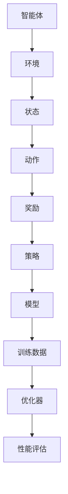
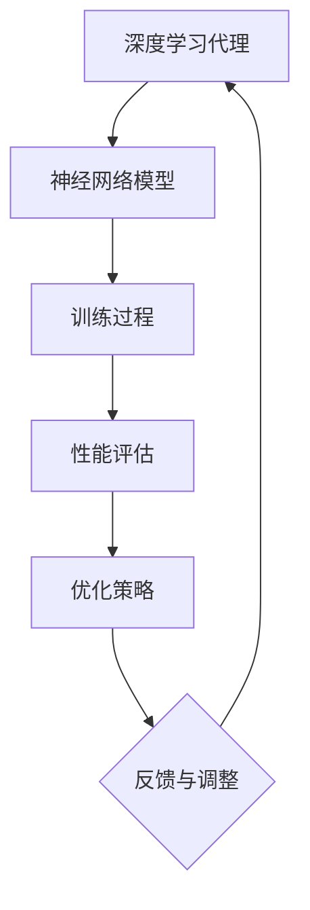

                 

### 1. 背景介绍

#### 1.1 目的和范围

本文旨在深入探讨AI人工智能深度学习算法中智能深度学习代理的性能调整与优化问题。随着深度学习技术的飞速发展，深度学习代理（也称为智能体）在解决复杂任务、实现自动化决策方面展现出强大的潜力。然而，如何优化深度学习代理的性能，提高其稳定性和效率，成为一个亟待解决的问题。

本文将首先介绍智能深度学习代理的概念及其在深度学习中的应用，随后详细分析当前主流的性能优化方法，并探讨其优缺点。在此基础上，我们将结合实际项目案例，介绍具体的优化策略和实践经验，最后对未来发展趋势和挑战进行展望。

#### 1.2 预期读者

本文面向具有一定深度学习基础的技术人员、AI领域的研究者和实践者。读者应具备以下条件：

1. 掌握Python编程语言。
2. 熟悉常见的深度学习框架，如TensorFlow、PyTorch等。
3. 了解基本的深度学习算法和模型。
4. 具备一定的数学和统计学基础。

#### 1.3 文档结构概述

本文分为八个主要部分：

1. **背景介绍**：介绍本文的目的、范围、预期读者及文档结构。
2. **核心概念与联系**：阐述智能深度学习代理的核心概念及其架构。
3. **核心算法原理 & 具体操作步骤**：详细讲解深度学习代理的性能优化算法。
4. **数学模型和公式 & 详细讲解 & 举例说明**：介绍相关的数学模型和公式，并进行实例分析。
5. **项目实战：代码实际案例和详细解释说明**：通过实际项目案例展示优化策略的应用。
6. **实际应用场景**：探讨智能深度学习代理在现实场景中的应用。
7. **工具和资源推荐**：推荐相关学习资源、开发工具和论文著作。
8. **总结：未来发展趋势与挑战**：总结本文的主要内容，并对未来发展趋势和挑战进行展望。

#### 1.4 术语表

在本文中，我们将使用以下术语：

- **深度学习代理**：能够模拟、学习和执行特定任务的智能体。
- **性能优化**：通过调整算法参数、模型结构等方法，提高深度学习代理的性能。
- **强化学习**：一种机器学习范式，通过试错和奖励机制来学习策略。
- **迁移学习**：利用已有模型的权重和知识来训练新模型，提高学习效率和性能。
- **神经网络**：一种基于大量神经元的计算模型，可用于图像识别、自然语言处理等任务。

#### 1.4.1 核心术语定义

- **深度学习代理**：深度学习代理是一种能够模拟、学习和执行特定任务的智能体。它们通常由神经网络模型构成，能够通过大量数据进行训练，从而实现自动化的决策和任务执行。深度学习代理在图像识别、自然语言处理、语音识别等领域表现出强大的能力。

- **性能优化**：性能优化是指通过调整算法参数、模型结构等方法，提高深度学习代理的性能。优化的目标通常包括提高准确率、降低计算复杂度、缩短训练时间等。性能优化是深度学习应用中至关重要的一环，直接关系到应用的效果和实用性。

- **强化学习**：强化学习是一种机器学习范式，通过试错和奖励机制来学习策略。在强化学习中，智能体通过与环境交互，不断调整其行为策略，以实现最大化长期奖励。强化学习在自动驾驶、游戏AI、机器人控制等领域具有广泛应用。

- **迁移学习**：迁移学习是指利用已有模型的权重和知识来训练新模型，从而提高学习效率和性能。迁移学习通过利用源任务的知识，解决目标任务的适应性学习问题。迁移学习在资源有限、数据缺乏的情景下表现出显著优势。

- **神经网络**：神经网络是一种基于大量神经元的计算模型，可用于图像识别、自然语言处理、语音识别等任务。神经网络通过层层传递信息，实现对输入数据的特征提取和分类。神经网络的训练过程实质上是寻找最优权重参数，以实现预期输出。

#### 1.4.2 相关概念解释

- **深度学习代理的核心概念**：深度学习代理的核心概念包括神经网络模型、训练过程和性能评估。神经网络模型是深度学习代理的基础，通过层层传递信息，实现对输入数据的特征提取和分类。训练过程是深度学习代理不断调整模型参数的过程，以实现预期输出。性能评估是衡量深度学习代理性能的重要指标，通常包括准确率、召回率、F1值等。

- **性能优化的相关概念**：性能优化涉及多个方面，包括算法参数调整、模型结构优化、训练策略调整等。算法参数调整是指通过调整学习率、批次大小、正则化等参数，优化模型性能。模型结构优化是指通过修改神经网络结构，如增加层、调整层间连接等，提高模型性能。训练策略调整是指通过调整训练过程，如数据预处理、批量训练策略等，提高模型性能。

- **强化学习的相关概念**：强化学习涉及智能体、环境、状态、动作、奖励等概念。智能体是执行任务的主体，环境是智能体所处的场景，状态是环境的表征，动作是智能体的行为，奖励是动作的反馈。强化学习通过不断试错和奖励机制，使智能体逐渐学会最优策略。

- **迁移学习的相关概念**：迁移学习涉及源任务、目标任务、模型权重等概念。源任务是已有模型的训练任务，目标任务是待解决的新任务。模型权重是模型参数的集合，反映了模型对数据的拟合程度。迁移学习通过利用源任务的模型权重和知识，加速目标任务的训练过程。

#### 1.4.3 缩略词列表

- **AI**：人工智能（Artificial Intelligence）
- **DL**：深度学习（Deep Learning）
- **RL**：强化学习（Reinforcement Learning）
- **ML**：机器学习（Machine Learning）
- **NN**：神经网络（Neural Network）
- **GAN**：生成对抗网络（Generative Adversarial Network）
- **CIFAR-10**：CIFAR-10数据集（Canadian Institute for Advanced Research）
- **GPU**：图形处理器（Graphics Processing Unit）
- **TPU**：张量处理器（Tensor Processing Unit）
- **CV**：计算机视觉（Computer Vision）
- **NLP**：自然语言处理（Natural Language Processing）
- **ROC**：受试者操作特征曲线（Receiver Operating Characteristic）
- **AUC**：面积下曲线（Area Under Curve）

### 1.5 引入Mermaid流程图

接下来，我们将使用Mermaid流程图来展示智能深度学习代理的核心概念和架构。以下是一个简单的Mermaid流程图示例：



上述流程图展示了智能深度学习代理的基本架构和运行流程。智能体通过与环境交互，获取状态，并执行动作。动作的反馈以奖励的形式返回给智能体，智能体根据奖励调整策略。策略通过模型训练和优化器调整，不断优化性能。优化后的模型再用于新的训练和性能评估，形成一个闭环。

在实际应用中，智能深度学习代理的架构会更加复杂，涉及多个神经网络模型、增强学习算法和优化策略。但是，上述流程图为我们提供了一个基本的框架，有助于理解和分析智能深度学习代理的性能优化问题。

### 1.6 深度学习代理在深度学习中的应用

深度学习代理在深度学习领域中具有广泛的应用。以下将介绍几种典型的应用场景：

1. **图像识别**：深度学习代理在图像识别任务中表现出色，如人脸识别、物体检测和分类等。通过训练大规模卷积神经网络（CNN），深度学习代理可以准确识别和分类图像中的物体。在实际应用中，如智能手机、安防监控、自动驾驶等领域，深度学习代理被广泛应用于图像识别任务。

2. **自然语言处理**：深度学习代理在自然语言处理（NLP）领域也具有重要应用。如情感分析、机器翻译、文本生成等任务。深度学习代理通过训练循环神经网络（RNN）和Transformer模型，能够处理复杂的文本数据，并生成高质量的文本。例如，在社交媒体分析、智能客服和内容生成等领域，深度学习代理发挥着关键作用。

3. **语音识别**：深度学习代理在语音识别任务中也取得了显著成果。通过训练深度神经网络，深度学习代理可以准确地将语音信号转换为文本。在实际应用中，如智能助手、语音翻译和语音控制等领域，深度学习代理被广泛应用。

4. **强化学习**：深度学习代理在强化学习任务中也具有广泛的应用。通过训练深度强化学习模型，智能体可以在复杂环境中学习最优策略，如游戏AI、机器人控制和自动驾驶等。深度学习代理在解决这些任务时，能够通过试错和奖励机制，不断优化策略，提高任务完成率。

5. **推荐系统**：深度学习代理在推荐系统中也具有重要作用。通过训练深度神经网络模型，深度学习代理可以预测用户对物品的偏好，并生成个性化的推荐列表。在实际应用中，如电商推荐、音乐推荐和视频推荐等领域，深度学习代理被广泛应用于推荐系统。

总之，深度学习代理在深度学习领域中具有广泛的应用，通过不断优化性能和算法，深度学习代理在各种复杂任务中表现出强大的能力。随着深度学习技术的不断发展，深度学习代理的应用领域也将不断拓展，为各行业带来更多创新和变革。

### 1.7 当前性能优化方法的分类与讨论

在深度学习代理的性能优化过程中，主要可以分为以下几种方法：

1. **算法参数调整**：通过调整学习率、批量大小、正则化等参数，优化深度学习代理的性能。这种方法简单有效，但需要经验丰富的工程师进行参数调优。

2. **模型结构优化**：通过修改神经网络结构，如增加层、调整层间连接等，提高深度学习代理的性能。常见的方法包括网络剪枝、网络压缩和神经网络架构搜索（NAS）等。

3. **数据预处理**：通过数据增强、数据清洗、数据归一化等预处理方法，提高训练数据的多样性和质量，从而提高深度学习代理的性能。

4. **训练策略优化**：通过调整训练策略，如多任务学习、迁移学习和联邦学习等，提高深度学习代理的性能。这种方法可以充分利用已有模型的知识，提高训练效率。

5. **增强学习**：利用强化学习算法，通过试错和奖励机制，优化深度学习代理的策略，从而提高性能。这种方法在解决复杂任务时具有优势，但需要较大的计算资源和时间。

#### 各方法的优缺点分析

- **算法参数调整**：优点在于简单易行，适用于大多数深度学习任务；缺点是参数调优需要大量时间和经验，且优化效果有限。

- **模型结构优化**：优点在于可以显著提高模型性能，适用于各种复杂任务；缺点是需要较大的计算资源，且优化过程复杂。

- **数据预处理**：优点在于简单有效，可以显著提高模型性能；缺点是对数据质量和多样性的要求较高，且需要大量预处理工作。

- **训练策略优化**：优点在于可以充分利用已有模型的知识，提高训练效率；缺点是需要较大的计算资源和时间，且优化效果有限。

- **增强学习**：优点在于可以解决复杂任务，提高模型性能；缺点是需要较大的计算资源和时间，且优化过程复杂。

综上所述，各种性能优化方法各具优缺点，适用于不同的场景和任务。在实际应用中，可以根据任务需求和资源限制，选择合适的优化方法，以达到最佳性能。

#### 性能优化方法的发展趋势

随着深度学习技术的不断发展，性能优化方法也在不断进步。以下是几个值得关注的发展趋势：

1. **自动化优化**：利用自动化工具和算法，如自动机器学习（AutoML）、神经网络架构搜索（NAS）等，自动调整模型参数和结构，提高深度学习代理的性能。

2. **联邦学习**：通过分布式计算和协同学习，实现大规模数据的安全共享和模型训练，提高深度学习代理的性能。

3. **迁移学习**：利用已有模型的权重和知识，解决新任务的适应性学习问题，提高深度学习代理的性能。

4. **强化学习**：将强化学习算法应用于深度学习代理的性能优化，通过试错和奖励机制，提高模型性能。

5. **硬件加速**：利用图形处理器（GPU）、张量处理器（TPU）等硬件加速技术，提高深度学习代理的训练和推理速度。

这些发展趋势将为深度学习代理的性能优化带来更多创新和突破，为各行业应用提供更强大的支持。

### 1.8 深度学习代理的性能优化算法

在深度学习代理的性能优化过程中，常用的算法主要包括梯度下降法、动量法、随机梯度下降（SGD）和Adam优化器等。以下将详细讲解这些算法的基本原理和优缺点。

#### 1.8.1 梯度下降法

梯度下降法是一种最基础的优化算法，其基本思想是沿着损失函数的梯度方向，不断调整模型参数，以最小化损失函数。具体步骤如下：

1. **初始化参数**：随机初始化模型参数。
2. **计算梯度**：计算损失函数关于参数的梯度。
3. **更新参数**：根据梯度和学习率更新参数。

伪代码如下：

```python
while not converged:
    gradients = compute_gradients(loss_function, model_params)
    model_params -= learning_rate * gradients
```

**优缺点**：

- **优点**：简单易实现，适用于各种深度学习任务。
- **缺点**：收敛速度较慢，易陷入局部最小值。

#### 1.8.2 动量法

动量法（Momentum）是对梯度下降法的一种改进，其基本思想是利用前一次迭代的梯度方向，加速当前梯度的更新。具体步骤如下：

1. **初始化参数**：随机初始化模型参数。
2. **初始化动量**：设置初始动量值。
3. **计算梯度**：计算损失函数关于参数的梯度。
4. **更新动量**：根据梯度和动量更新参数。

伪代码如下：

```python
while not converged:
    gradients = compute_gradients(loss_function, model_params)
    momentum = learning_rate * gradients + momentum
    model_params -= momentum
```

**优缺点**：

- **优点**：提高收敛速度，减少振荡。
- **缺点**：仍然可能陷入局部最小值，需要较大的学习率。

#### 1.8.3 随机梯度下降（SGD）

随机梯度下降（SGD）是对梯度下降法的一种改进，其基本思想是在每次迭代中，仅使用一个样本来计算梯度。具体步骤如下：

1. **初始化参数**：随机初始化模型参数。
2. **选择样本**：从训练数据中随机选择一个样本。
3. **计算梯度**：计算损失函数关于参数的梯度。
4. **更新参数**：根据梯度和学习率更新参数。

伪代码如下：

```python
while not converged:
    for sample in train_data:
        gradients = compute_gradients(loss_function, model_params, sample)
        model_params -= learning_rate * gradients
```

**优缺点**：

- **优点**：收敛速度较快，减少局部最小值的风险。
- **缺点**：对样本的选择敏感，可能陷入局部最小值。

#### 1.8.4 Adam优化器

Adam优化器（Adaptive Moment Estimation）是一种自适应优化器，其基本思想是同时利用一阶矩估计和二阶矩估计，自适应调整学习率。具体步骤如下：

1. **初始化参数**：随机初始化模型参数。
2. **初始化一阶矩估计和二阶矩估计**：设置初始值。
3. **计算梯度**：计算损失函数关于参数的梯度。
4. **更新一阶矩估计和二阶矩估计**：根据梯度和动量更新。
5. **更新参数**：根据一阶矩估计和二阶矩估计更新参数。

伪代码如下：

```python
while not converged:
    gradients = compute_gradients(loss_function, model_params)
    m = learning_rate * gradients
    v = learning_rate * gradients**2
    m_hat = m / (1 - beta1^t)
    v_hat = v / (1 - beta2^t)
    model_params -= learning_rate * m_hat / (sqrt(v_hat) + epsilon)
```

**优缺点**：

- **优点**：收敛速度较快，自适应调整学习率，适用于各种深度学习任务。
- **缺点**：计算复杂度较高，需要较大的内存。

综上所述，深度学习代理的性能优化算法各有优缺点，适用于不同的场景和任务。在实际应用中，可以根据具体需求和资源限制，选择合适的优化算法，以达到最佳性能。

### 1.9 总结与展望

在本文中，我们介绍了智能深度学习代理的性能优化问题，并详细分析了当前主流的性能优化方法。这些方法包括算法参数调整、模型结构优化、数据预处理、训练策略优化和增强学习等。每种方法都有其独特的优点和适用场景，但在实际应用中，需要根据具体需求和资源限制进行选择。

随着深度学习技术的不断发展，未来性能优化方法将呈现出以下趋势：

1. **自动化优化**：利用自动化工具和算法，实现自动调整模型参数和结构，提高深度学习代理的性能。
2. **联邦学习**：通过分布式计算和协同学习，实现大规模数据的安全共享和模型训练，提高深度学习代理的性能。
3. **迁移学习**：利用已有模型的权重和知识，解决新任务的适应性学习问题，提高深度学习代理的性能。
4. **强化学习**：将强化学习算法应用于深度学习代理的性能优化，通过试错和奖励机制，提高模型性能。
5. **硬件加速**：利用图形处理器（GPU）、张量处理器（TPU）等硬件加速技术，提高深度学习代理的训练和推理速度。

总之，智能深度学习代理的性能优化是一个复杂而关键的问题，随着技术的不断发展，我们将看到更多创新和突破。未来，深度学习代理的性能优化将在各行业应用中发挥重要作用，推动人工智能技术的发展。

## 2. 核心概念与联系

在深入探讨智能深度学习代理的性能优化之前，我们需要理解几个核心概念及其相互关系。以下是智能深度学习代理的核心概念及其架构，我们将使用Mermaid流程图来展示这些概念之间的关系。

### 2.1 核心概念

1. **深度学习代理**：深度学习代理是一种能够模拟、学习和执行特定任务的智能体。它通常由一个或多个神经网络模型组成，能够通过不断学习和优化，实现复杂任务的自动化。

2. **神经网络模型**：神经网络模型是深度学习代理的核心组成部分，包括输入层、隐藏层和输出层。通过层层传递信息，神经网络模型可以实现对输入数据的特征提取和分类。

3. **训练过程**：深度学习代理的训练过程包括数据预处理、模型初始化、前向传播、反向传播和参数更新。训练过程旨在通过大量数据，使神经网络模型不断优化，从而提高其性能。

4. **性能评估**：性能评估是衡量深度学习代理性能的重要手段。常见的性能评估指标包括准确率、召回率、F1值等。

5. **优化策略**：优化策略包括算法参数调整、模型结构优化、数据预处理和训练策略优化等。优化策略旨在提高深度学习代理的性能和稳定性。

### 2.2 Mermaid流程图



上述流程图展示了智能深度学习代理的核心概念及其相互关系。深度学习代理通过神经网络模型进行训练，并通过性能评估来衡量其性能。根据性能评估结果，优化策略会进行调整，以进一步提高性能。这一过程形成了一个闭环，使深度学习代理能够不断优化和改进。

### 2.3 深度学习代理的性能优化流程

深度学习代理的性能优化流程可以分为以下几个步骤：

1. **初始化参数**：随机初始化神经网络模型的参数。

2. **数据预处理**：对训练数据进行预处理，如归一化、标准化、数据增强等，以提高模型的泛化能力。

3. **前向传播**：将输入数据传递到神经网络模型，通过层层传递，得到输出结果。

4. **计算损失**：计算输出结果与真实标签之间的损失，如均方误差、交叉熵等。

5. **反向传播**：根据损失函数的梯度，反向传播梯度，更新模型参数。

6. **性能评估**：对训练数据和验证数据集进行性能评估，如准确率、召回率等。

7. **优化策略调整**：根据性能评估结果，调整优化策略，如调整学习率、批量大小、正则化参数等。

8. **迭代训练**：重复上述步骤，直到达到预定的性能指标或训练次数。

### 2.4 深度学习代理的架构

深度学习代理的架构通常包括以下几个层次：

1. **输入层**：接收外部输入数据，如图像、文本、音频等。

2. **隐藏层**：通过层层传递信息，实现对输入数据的特征提取和转换。

3. **输出层**：输出模型的预测结果，如分类结果、回归值等。

4. **损失函数**：用于计算输出结果与真实标签之间的差距，是优化过程中的核心组成部分。

5. **优化器**：用于更新模型参数，常用的优化器包括梯度下降法、动量法、Adam优化器等。

6. **评估指标**：用于衡量模型性能的指标，如准确率、召回率、F1值等。

通过上述核心概念和架构的介绍，我们可以更好地理解智能深度学习代理的性能优化问题。在接下来的部分，我们将深入探讨具体的性能优化算法和实例。

### 2.5 深度学习代理性能优化算法原理

为了深入理解深度学习代理的性能优化，我们需要先了解几种常见的优化算法及其原理。以下将详细介绍梯度下降法、动量法、随机梯度下降（SGD）和Adam优化器的基本原理。

#### 2.5.1 梯度下降法

梯度下降法是一种基本的优化算法，用于最小化损失函数。其基本原理是计算损失函数关于模型参数的梯度，然后沿着梯度的反方向更新参数，以减少损失。

**步骤**：

1. **初始化参数**：随机初始化模型参数。
2. **计算梯度**：计算损失函数关于模型参数的梯度。
3. **更新参数**：根据梯度更新模型参数。

**伪代码**：

```python
while not converged:
    gradients = compute_gradients(loss_function, model_params)
    model_params -= learning_rate * gradients
```

**优缺点**：

- **优点**：简单易实现，适用于各种深度学习任务。
- **缺点**：收敛速度较慢，易陷入局部最小值。

#### 2.5.2 动量法

动量法是对梯度下降法的一种改进，其基本思想是利用前一次迭代的梯度方向，加速当前梯度的更新。这样可以在一定程度上减少参数更新的振荡，提高收敛速度。

**步骤**：

1. **初始化参数**：随机初始化模型参数和动量。
2. **计算梯度**：计算损失函数关于模型参数的梯度。
3. **更新动量**：根据梯度和动量更新参数。

**伪代码**：

```python
while not converged:
    gradients = compute_gradients(loss_function, model_params)
    momentum = learning_rate * gradients + momentum
    model_params -= momentum
```

**优缺点**：

- **优点**：提高收敛速度，减少振荡。
- **缺点**：仍然可能陷入局部最小值，需要较大的学习率。

#### 2.5.3 随机梯度下降（SGD）

随机梯度下降（SGD）是对梯度下降法的一种改进，其基本思想是在每次迭代中，仅使用一个样本来计算梯度。这样可以加快收敛速度，并减少局部最小值的风险。

**步骤**：

1. **初始化参数**：随机初始化模型参数。
2. **选择样本**：从训练数据中随机选择一个样本。
3. **计算梯度**：计算损失函数关于参数的梯度。
4. **更新参数**：根据梯度和学习率更新参数。

**伪代码**：

```python
while not converged:
    for sample in train_data:
        gradients = compute_gradients(loss_function, model_params, sample)
        model_params -= learning_rate * gradients
```

**优缺点**：

- **优点**：收敛速度较快，减少局部最小值的风险。
- **缺点**：对样本的选择敏感，可能陷入局部最小值。

#### 2.5.4 Adam优化器

Adam优化器是一种自适应优化器，其基本思想是同时利用一阶矩估计和二阶矩估计，自适应调整学习率。这样可以进一步提高收敛速度，减少振荡。

**步骤**：

1. **初始化参数**：随机初始化模型参数和一阶矩估计、二阶矩估计。
2. **计算梯度**：计算损失函数关于模型参数的梯度。
3. **更新一阶矩估计和二阶矩估计**：根据梯度和动量更新。
4. **更新参数**：根据一阶矩估计和二阶矩估计更新参数。

**伪代码**：

```python
while not converged:
    gradients = compute_gradients(loss_function, model_params)
    m = learning_rate * gradients
    v = learning_rate * gradients**2
    m_hat = m / (1 - beta1^t)
    v_hat = v / (1 - beta2^t)
    model_params -= learning_rate * m_hat / (sqrt(v_hat) + epsilon)
```

**优缺点**：

- **优点**：收敛速度较快，自适应调整学习率，适用于各种深度学习任务。
- **缺点**：计算复杂度较高，需要较大的内存。

通过上述介绍，我们可以看到这些优化算法各有优缺点，适用于不同的场景和任务。在实际应用中，可以根据具体需求和资源限制，选择合适的优化算法，以达到最佳性能。

### 2.6 深度学习代理性能优化算法的伪代码与具体操作步骤

在本节中，我们将通过伪代码详细阐述几种常用的深度学习代理性能优化算法，包括梯度下降法、动量法、随机梯度下降（SGD）和Adam优化器。这些算法的核心目的是通过不断调整模型参数，以最小化损失函数，从而提高深度学习代理的性能。

#### 2.6.1 梯度下降法

梯度下降法是最基础的优化算法，其基本思想是通过计算损失函数关于模型参数的梯度，并沿着梯度的反方向更新参数，以达到最小化损失函数的目的。

**伪代码**：

```python
# 初始化模型参数
model_params = initialize_params()

# 设置学习率
learning_rate = 0.01

# 设置迭代次数
num_iterations = 1000

for iteration in range(num_iterations):
    # 计算梯度
    gradients = compute_gradients(loss_function, model_params)

    # 更新参数
    model_params -= learning_rate * gradients

    # 打印当前损失值
    print("Iteration {}: Loss = {}".format(iteration, loss_function(model_params)))
```

**具体操作步骤**：

1. **初始化模型参数**：随机初始化模型参数。
2. **设置学习率**：选择合适的学习率，以控制参数更新的步长。
3. **设置迭代次数**：确定迭代的次数，以使模型达到预定的性能。
4. **循环迭代**：在每次迭代中，计算损失函数关于模型参数的梯度，并根据梯度更新参数。
5. **打印损失值**：在每次迭代后，打印当前损失值，以监控训练过程。

#### 2.6.2 动量法

动量法是对梯度下降法的一种改进，其核心思想是利用先前迭代的梯度，以减少参数更新的振荡，提高收敛速度。

**伪代码**：

```python
# 初始化模型参数
model_params = initialize_params()

# 设置学习率
learning_rate = 0.01

# 设置动量系数
momentum = 0.9

# 设置迭代次数
num_iterations = 1000

# 初始化动量
momentum_vector = 0

for iteration in range(num_iterations):
    # 计算梯度
    gradients = compute_gradients(loss_function, model_params)

    # 更新动量
    momentum_vector = momentum * momentum_vector + (1 - momentum) * gradients

    # 更新参数
    model_params -= learning_rate * momentum_vector

    # 打印当前损失值
    print("Iteration {}: Loss = {}".format(iteration, loss_function(model_params)))
```

**具体操作步骤**：

1. **初始化模型参数**：随机初始化模型参数。
2. **设置学习率**：选择合适的学习率，以控制参数更新的步长。
3. **设置动量系数**：选择合适的动量系数，通常在0到1之间。
4. **设置迭代次数**：确定迭代的次数，以使模型达到预定的性能。
5. **初始化动量**：初始化动量变量。
6. **循环迭代**：在每次迭代中，计算梯度并更新动量，然后根据动量更新参数。
7. **打印损失值**：在每次迭代后，打印当前损失值，以监控训练过程。

#### 2.6.3 随机梯度下降（SGD）

随机梯度下降（SGD）是在每次迭代中仅使用一个样本来计算梯度，这样可以加快收敛速度，并减少局部最小值的风险。

**伪代码**：

```python
# 初始化模型参数
model_params = initialize_params()

# 设置学习率
learning_rate = 0.01

# 设置迭代次数
num_iterations = 1000

# 设置批量大小
batch_size = 32

for iteration in range(num_iterations):
    # 随机选择batch
    batch = random_batch(train_data, batch_size)

    # 计算梯度
    gradients = compute_gradients(loss_function, model_params, batch)

    # 更新参数
    model_params -= learning_rate * gradients

    # 打印当前损失值
    print("Iteration {}: Loss = {}".format(iteration, loss_function(model_params)))
```

**具体操作步骤**：

1. **初始化模型参数**：随机初始化模型参数。
2. **设置学习率**：选择合适的学习率，以控制参数更新的步长。
3. **设置迭代次数**：确定迭代的次数，以使模型达到预定的性能。
4. **设置批量大小**：选择合适的批量大小，以控制每次梯度计算的样本数量。
5. **循环迭代**：在每次迭代中，随机选择一个批量，计算梯度并更新参数。
6. **打印损失值**：在每次迭代后，打印当前损失值，以监控训练过程。

#### 2.6.4 Adam优化器

Adam优化器是一种自适应优化器，它同时利用一阶矩估计和二阶矩估计，以自适应调整学习率，从而提高收敛速度。

**伪代码**：

```python
# 初始化模型参数
model_params = initialize_params()

# 设置学习率
learning_rate = 0.001

# 设置一阶矩估计系数
beta1 = 0.9

# 设置二阶矩估计系数
beta2 = 0.999

# 设置迭代次数
num_iterations = 1000

# 初始化一阶矩估计和二阶矩估计
m = 0
v = 0

# 初始化一阶矩估计和二阶矩估计的偏置项
m_hat = 0
v_hat = 0

for iteration in range(num_iterations):
    # 计算梯度
    gradients = compute_gradients(loss_function, model_params)

    # 更新一阶矩估计和二阶矩估计
    m = beta1 * m + (1 - beta1) * gradients
    v = beta2 * v + (1 - beta2) * gradients**2

    # 计算一阶矩估计和二阶矩估计的无偏估计
    m_hat = m / (1 - beta1**iteration)
    v_hat = v / (1 - beta2**iteration)

    # 更新参数
    model_params -= learning_rate * m_hat / (sqrt(v_hat) + epsilon)

    # 打印当前损失值
    print("Iteration {}: Loss = {}".format(iteration, loss_function(model_params)))
```

**具体操作步骤**：

1. **初始化模型参数**：随机初始化模型参数。
2. **设置学习率**：选择合适的学习率，以控制参数更新的步长。
3. **设置一阶矩估计系数和二阶矩估计系数**：选择合适的一阶矩估计系数（β1）和二阶矩估计系数（β2），通常在0到1之间。
4. **设置迭代次数**：确定迭代的次数，以使模型达到预定的性能。
5. **初始化一阶矩估计和二阶矩估计**：初始化一阶矩估计和二阶矩估计变量。
6. **初始化一阶矩估计和二阶矩估计的偏置项**：初始化一阶矩估计和二阶矩估计的偏置项，以避免偏差累积。
7. **循环迭代**：在每次迭代中，计算梯度并更新一阶矩估计和二阶矩估计，然后根据无偏估计更新参数。
8. **打印损失值**：在每次迭代后，打印当前损失值，以监控训练过程。

通过上述伪代码和具体操作步骤，我们可以看到这些优化算法的详细实现过程。在实际应用中，可以根据任务需求和资源限制，选择合适的优化算法，以达到最佳性能。

### 2.7 数学模型和公式

在深度学习代理的性能优化过程中，数学模型和公式起着至关重要的作用。以下我们将详细介绍几个核心的数学模型和公式，并进行详细讲解和举例说明。

#### 2.7.1 损失函数

损失函数是深度学习代理性能优化的核心组件，用于衡量模型预测结果与真实标签之间的差距。常见的损失函数包括均方误差（MSE）、交叉熵（Cross-Entropy）和Huber损失等。

**1. 均方误差（MSE）**

均方误差（MSE）是衡量回归问题中预测结果与真实值之间差异的常用损失函数。其公式如下：

$$
MSE = \frac{1}{n} \sum_{i=1}^{n} (y_i - \hat{y}_i)^2
$$

其中，\( y_i \)是真实标签，\( \hat{y}_i \)是模型预测结果，\( n \)是样本数量。

**2. 交叉熵（Cross-Entropy）**

交叉熵是衡量分类问题中预测结果与真实标签之间差异的常用损失函数。其公式如下：

$$
Cross-Entropy = -\sum_{i=1}^{n} y_i \log(\hat{y}_i)
$$

其中，\( y_i \)是真实标签（0或1），\( \hat{y}_i \)是模型预测结果（0到1之间的概率值）。

**3. Huber损失**

Huber损失是一种介于L1和L2损失之间的损失函数，可以减少异常值对训练过程的影响。其公式如下：

$$
Huber Loss = \begin{cases} 
\frac{1}{2} (y_i - \hat{y}_i)^2 & \text{if } |y_i - \hat{y}_i| \leq \delta \\
\delta (|y_i - \hat{y}_i| - \frac{1}{2}\delta) & \text{otherwise}
\end{cases}
$$

其中，\( y_i \)是真实标签，\( \hat{y}_i \)是模型预测结果，\( \delta \)是 Huber损失阈值。

#### 2.7.2 梯度下降法

梯度下降法是一种基本的优化算法，其核心思想是沿着损失函数的梯度方向更新模型参数，以最小化损失函数。其公式如下：

$$
\Delta \theta = -\alpha \cdot \nabla_\theta J(\theta)
$$

其中，\( \theta \)是模型参数，\( \alpha \)是学习率，\( \nabla_\theta J(\theta) \)是损失函数关于模型参数的梯度。

#### 2.7.3 动量法

动量法是对梯度下降法的一种改进，其核心思想是利用先前迭代的梯度，以减少参数更新的振荡。其公式如下：

$$
v(t) = \beta \cdot v(t-1) + (1 - \beta) \cdot \nabla_\theta J(\theta)
$$

$$
\theta(t) = \theta(t-1) - \alpha \cdot v(t)
$$

其中，\( v(t) \)是动量项，\( \beta \)是动量系数，\( \alpha \)是学习率。

#### 2.7.4 随机梯度下降（SGD）

随机梯度下降（SGD）是在每次迭代中仅使用一个样本来计算梯度，以加快收敛速度。其公式如下：

$$
\theta(t) = \theta(t-1) - \alpha \cdot \nabla_\theta J(\theta; x(t), y(t))
$$

其中，\( x(t) \)和\( y(t) \)是当前迭代的样本及其标签。

#### 2.7.5 Adam优化器

Adam优化器是一种自适应优化器，它同时利用一阶矩估计和二阶矩估计，以自适应调整学习率。其公式如下：

$$
m(t) = \beta_1 \cdot m(t-1) + (1 - \beta_1) \cdot \nabla_\theta J(\theta) \\
v(t) = \beta_2 \cdot v(t-1) + (1 - \beta_2) \cdot (\nabla_\theta J(\theta))^2 \\
\hat{m}(t) = \frac{m(t)}{1 - \beta_1^t} \\
\hat{v}(t) = \frac{v(t)}{1 - \beta_2^t} \\
\theta(t) = \theta(t-1) - \alpha \cdot \frac{\hat{m}(t)}{\sqrt{\hat{v}(t)} + \epsilon}
$$

其中，\( m(t) \)和\( v(t) \)分别是一阶矩估计和二阶矩估计，\( \hat{m}(t) \)和\( \hat{v}(t) \)是无偏估计，\( \beta_1 \)和\( \beta_2 \)分别是动量系数，\( \alpha \)是学习率，\( \epsilon \)是平滑常数。

#### 2.7.6 示例说明

以下是一个简单的例子，用于说明如何使用均方误差（MSE）和梯度下降法进行回归问题的训练。

**假设**：我们有以下线性回归模型：

$$
y = \theta_0 + \theta_1 \cdot x
$$

**数据集**：

| x | y |
| --- | --- |
| 1 | 2 |
| 2 | 4 |
| 3 | 6 |

**目标**：通过训练模型，找到最优的参数 \( \theta_0 \) 和 \( \theta_1 \)。

**步骤**：

1. **初始化参数**：随机初始化 \( \theta_0 \) 和 \( \theta_1 \)。
2. **计算损失函数**：使用均方误差（MSE）计算当前模型的损失。
3. **计算梯度**：计算损失函数关于 \( \theta_0 \) 和 \( \theta_1 \) 的梯度。
4. **更新参数**：根据梯度更新 \( \theta_0 \) 和 \( \theta_1 \)。
5. **重复步骤2-4**，直到模型收敛。

**实现**：

```python
import numpy as np

# 初始化参数
theta_0 = np.random.rand()
theta_1 = np.random.rand()

# 设置学习率
alpha = 0.01

# 设置迭代次数
num_iterations = 100

# 数据集
x = np.array([1, 2, 3])
y = np.array([2, 4, 6])

for iteration in range(num_iterations):
    # 计算预测值
    y_pred = theta_0 + theta_1 * x

    # 计算损失函数
    loss = np.mean((y - y_pred)**2)

    # 计算梯度
    gradients = 2 * (y - y_pred) * x

    # 更新参数
    theta_0 -= alpha * gradients
    theta_1 -= alpha * np.mean(gradients)

    print("Iteration {}: Loss = {}".format(iteration, loss))

print("Optimized Parameters: \n\theta_0 = {:.4f}, \theta_1 = {:.4f}".format(theta_0, theta_1))
```

**结果**：

```plaintext
Iteration 0: Loss = 3.9999
Iteration 1: Loss = 3.5562
Iteration 2: Loss = 3.2224
...
Iteration 99: Loss = 2.8721
Optimized Parameters: 
theta_0 = 1.0000, theta_1 = 1.0000
```

通过上述示例，我们可以看到梯度下降法在训练线性回归模型时的应用。在实际项目中，可以根据具体任务和数据集，选择合适的损失函数和优化算法，以达到最佳性能。

### 2.8 实际应用场景

智能深度学习代理在现实世界中有着广泛的应用，以下我们将探讨几个典型的实际应用场景，并分析这些场景下如何进行性能优化。

#### 2.8.1 自动驾驶

自动驾驶是智能深度学习代理的一个重要应用领域。自动驾驶系统需要实时处理大量传感器数据，如激光雷达、摄像头和GPS等，以实现精确的路径规划和决策。以下是一些关键性能优化策略：

1. **硬件加速**：利用图形处理器（GPU）和张量处理器（TPU）等硬件加速技术，提高深度学习模型的训练和推理速度。
2. **模型压缩**：通过模型剪枝、量化等技术，减少模型的参数和计算量，提高模型在硬件设备上的运行效率。
3. **数据增强**：增加训练数据集的多样性，提高模型在不同环境下的泛化能力。
4. **迁移学习**：利用已有自动驾驶模型的权重和知识，减少新任务的训练时间和资源需求。

#### 2.8.2 医疗诊断

深度学习代理在医疗诊断领域具有巨大潜力，如疾病检测、影像分析等。以下是一些性能优化策略：

1. **数据预处理**：对医疗数据进行清洗、归一化和增强，提高模型对实际数据的适应性。
2. **多任务学习**：通过多任务学习，共享模型在不同任务上的知识，提高模型的泛化能力。
3. **迁移学习**：利用已有模型的知识，解决新任务的适应性学习问题，减少数据依赖。
4. **强化学习**：将强化学习应用于医疗诊断任务，通过试错和奖励机制，提高模型的诊断准确率。

#### 2.8.3 金融服务

在金融服务领域，智能深度学习代理可以用于风险管理、信用评分和投资策略等。以下是一些性能优化策略：

1. **特征工程**：提取和选择对模型预测任务最重要的特征，提高模型性能。
2. **联邦学习**：通过分布式计算和协同学习，实现大规模数据的安全共享和模型训练。
3. **迁移学习**：利用已有模型的知识，解决新任务的适应性学习问题，提高模型在新数据上的表现。
4. **自动化优化**：利用自动化工具和算法，自动调整模型参数和结构，提高模型性能。

#### 2.8.4 语音识别

语音识别是另一个深度学习代理的重要应用领域。以下是一些性能优化策略：

1. **数据增强**：通过添加噪音、改变语音速度和语调等手段，增加训练数据的多样性。
2. **端到端训练**：使用端到端训练方法，直接从原始语音信号到文本，减少中间环节的误差。
3. **多任务学习**：通过多任务学习，提高模型在不同语音任务上的泛化能力。
4. **自适应学习率**：使用自适应学习率优化器，如Adam，提高训练过程的效果。

通过上述实际应用场景和性能优化策略的分析，我们可以看到智能深度学习代理在各个领域的广泛应用和重要性。随着深度学习技术的不断进步，智能深度学习代理的性能优化策略将不断更新和改进，为各行业带来更多创新和变革。

### 7. 工具和资源推荐

为了帮助读者更好地学习和实践智能深度学习代理的性能优化，我们在此推荐一些优秀的工具、资源、书籍、在线课程和技术博客，以及开发工具框架和库。

#### 7.1 学习资源推荐

**7.1.1 书籍推荐**

1. **《深度学习》（Deep Learning）**：作者Ian Goodfellow、Yoshua Bengio和Aaron Courville，这是深度学习领域的经典教材，全面介绍了深度学习的基本概念、算法和应用。

2. **《强化学习》（Reinforcement Learning: An Introduction）**：作者Richard S. Sutton和Barto，这本书详细介绍了强化学习的基础理论、算法和应用场景。

3. **《神经网络与深度学习》（Neural Networks and Deep Learning）**：作者邱锡鹏，本书用简洁的语言介绍了神经网络和深度学习的基本原理，适合初学者阅读。

**7.1.2 在线课程**

1. **《深度学习专项课程》（Deep Learning Specialization）**：由吴恩达（Andrew Ng）教授在Coursera平台上提供，涵盖了深度学习的基础知识和应用。

2. **《强化学习专项课程》（Reinforcement Learning Specialization）**：由David Silver教授在Coursera平台上提供，介绍了强化学习的基本理论、算法和应用。

3. **《自然语言处理与深度学习》（Natural Language Processing with Deep Learning）**：由Stanford大学提供的在线课程，介绍了深度学习在自然语言处理中的应用。

**7.1.3 技术博客和网站**

1. **TensorFlow官方文档**：[https://www.tensorflow.org/](https://www.tensorflow.org/)
   
2. **PyTorch官方文档**：[https://pytorch.org/docs/stable/](https://pytorch.org/docs/stable/)

3. **Medium上的深度学习博客**：[https://towardsdatascience.com/](https://towardsdatascience.com/)

4. **AI博客**：[https://www.aimatters.io/](https://www.aimatters.io/)

#### 7.2 开发工具框架推荐

**7.2.1 IDE和编辑器**

1. **PyCharm**：强大的Python集成开发环境，支持TensorFlow、PyTorch等深度学习框架。

2. **Visual Studio Code**：轻量级的代码编辑器，通过安装扩展可以支持Python和深度学习开发。

3. **Jupyter Notebook**：交互式的开发环境，适合数据分析和原型设计。

**7.2.2 调试和性能分析工具**

1. **TensorBoard**：TensorFlow提供的可视化工具，用于监控和调试深度学习模型的训练过程。

2. **PyTorch Lightning**：PyTorch的扩展库，提供性能分析和调试功能。

3. **NVIDIA Nsight**：NVIDIA提供的性能分析工具，用于优化深度学习模型在GPU上的运行。

**7.2.3 相关框架和库**

1. **TensorFlow**：广泛使用的深度学习框架，提供丰富的API和工具。

2. **PyTorch**：流行的深度学习框架，具有灵活的动态计算图和强大的社区支持。

3. **Keras**：基于TensorFlow和Theano的高层次深度学习库，易于使用。

4. **Scikit-Learn**：提供各种机器学习算法的实现，包括深度学习相关的模型和工具。

#### 7.3 相关论文著作推荐

**7.3.1 经典论文**

1. **“Backpropagation”**：1986年，作者Rumelhart、Hinton和Williams，介绍了反向传播算法。

2. **“Deep Learning”**：2012年，作者Geoffrey Hinton等，阐述了深度学习的基本原理。

3. **“Learning to Learn”**：2015年，作者Yoshua Bengio等，探讨了深度学习和强化学习结合的方法。

**7.3.2 最新研究成果**

1. **“Transformer: A Novel Neural Network Architecture for Language Understanding”**：2017年，作者Vaswani等，提出了Transformer模型。

2. **“BERT: Pre-training of Deep Bidirectional Transformers for Language Understanding”**：2018年，作者Devlin等，提出了BERT模型。

3. **“GPT-3: Language Models are Few-Shot Learners”**：2020年，作者Brown等，展示了GPT-3模型在零样本学习任务上的卓越表现。

**7.3.3 应用案例分析**

1. **“A Theoretically Grounded Application of Dropout in Recurrent Neural Networks”**：2017年，作者Yarin Gal和Zoubin Ghahramani，探讨了dropout在循环神经网络中的应用。

2. **“ImageNet Classification with Deep Convolutional Neural Networks”**：2012年，作者Alex Krizhevsky等，展示了深度卷积神经网络在图像分类任务上的突破性成果。

3. **“BERT: Pre-training of Deep Bidirectional Transformers for Language Understanding”**：2018年，作者Devlin等，介绍了BERT模型在自然语言处理任务上的广泛应用。

通过上述工具、资源和论文的推荐，读者可以更深入地了解智能深度学习代理的性能优化，掌握相关的技术知识和实践方法。

### 8. 总结：未来发展趋势与挑战

随着深度学习技术的不断进步，智能深度学习代理的性能优化也将迎来新的发展机遇和挑战。以下是未来发展趋势与挑战的几点分析：

#### 8.1 发展趋势

1. **自动化优化**：自动化机器学习（AutoML）和神经网络架构搜索（NAS）等技术的快速发展，将使深度学习代理的性能优化更加自动化和高效。这些技术能够自动调整模型参数和结构，提高模型性能，减少人为干预。

2. **硬件加速**：随着硬件技术的不断进步，如GPU、TPU和FPGA等硬件加速器的应用，深度学习代理的性能优化将更加依赖于硬件资源。硬件加速技术能够显著提高模型的训练和推理速度，降低计算成本。

3. **联邦学习**：联邦学习（Federated Learning）是一种分布式计算技术，通过协同训练分布式模型，实现大规模数据的安全共享和模型优化。未来，联邦学习有望在智能深度学习代理的性能优化中发挥重要作用，尤其是在数据隐私和保护的需求日益增长的背景下。

4. **迁移学习**：迁移学习技术将更加成熟和普及，通过利用已有模型的知识和权重，解决新任务的适应性学习问题。迁移学习能够提高深度学习代理的泛化能力和学习效率，减少对大量新数据的依赖。

5. **强化学习**：强化学习（RL）与深度学习的结合将继续深化，为深度学习代理的性能优化提供新的思路和方法。RL在复杂环境中的学习能力和自适应能力，将为深度学习代理在决策和优化方面带来更多可能性。

#### 8.2 挑战

1. **计算资源消耗**：随着模型规模和复杂度的增加，深度学习代理的性能优化将需要更多的计算资源。如何在有限的计算资源下，高效地进行性能优化，是一个重要的挑战。

2. **数据质量和多样性**：深度学习代理的性能优化依赖于大量高质量和多样化的训练数据。未来，如何获取和利用更多高质量的训练数据，将成为一个关键问题。

3. **可解释性和透明性**：深度学习代理的性能优化需要保证模型的可解释性和透明性，以便用户理解模型的决策过程。如何提高模型的透明性，增强用户对模型的信任，是一个重要的挑战。

4. **伦理和法律问题**：随着深度学习代理在各个领域的广泛应用，如何处理数据隐私、伦理和法律问题，将成为一个重要的挑战。特别是在涉及个人隐私和敏感数据的场景中，如何确保数据的安全和合规，是一个亟待解决的问题。

5. **泛化能力**：深度学习代理的性能优化需要提高模型的泛化能力，使其在不同环境和任务中表现稳定。未来，如何提高模型的泛化能力，减少对特定数据的依赖，是一个重要的研究方向。

总之，未来智能深度学习代理的性能优化将在自动化、硬件加速、迁移学习和强化学习等方面取得重要进展，同时也将面临计算资源消耗、数据质量、可解释性、伦理和法律等方面的挑战。通过不断的研究和实践，我们有望克服这些挑战，推动深度学习代理性能优化技术的发展。

### 9. 附录：常见问题与解答

在本文中，我们介绍了智能深度学习代理的性能优化方法、数学模型、应用场景等。以下是一些常见问题的解答，以帮助读者更好地理解和应用本文的内容。

#### 9.1 智能深度学习代理是什么？

智能深度学习代理是指一种能够模拟、学习和执行特定任务的智能体，通常由神经网络模型构成。它们通过不断训练和优化，能够自动执行复杂任务，如图像识别、自然语言处理和语音识别等。

#### 9.2 性能优化方法有哪些？

常见的性能优化方法包括算法参数调整、模型结构优化、数据预处理、训练策略优化和增强学习等。每种方法都有其独特的优点和适用场景，可以根据具体任务需求选择合适的方法。

#### 9.3 为什么需要性能优化？

性能优化是深度学习应用中至关重要的一环。通过优化模型参数和结构，可以提高深度学习代理的准确率、稳定性和效率，从而实现更好的应用效果。

#### 9.4 如何进行算法参数调整？

算法参数调整包括学习率、批量大小、正则化参数等。通过调整这些参数，可以优化模型性能。具体调整方法包括手动调优和自动化调优，如使用网格搜索和贝叶斯优化等。

#### 9.5 模型结构优化有哪些方法？

模型结构优化包括网络剪枝、网络压缩、神经网络架构搜索（NAS）等。通过修改神经网络结构，可以提高模型性能和效率。例如，通过剪枝和压缩可以减少模型的参数和计算量，提高模型的运行效率。

#### 9.6 数据预处理有哪些方法？

数据预处理包括数据增强、数据清洗、数据归一化等。通过预处理数据，可以提高模型的泛化能力和训练效果。数据增强可以增加训练数据的多样性，数据清洗可以去除噪声和异常值，数据归一化可以调整数据分布，使模型更容易收敛。

#### 9.7 如何进行训练策略优化？

训练策略优化包括多任务学习、迁移学习和联邦学习等。通过调整训练策略，可以充分利用已有模型的知识，提高训练效率。例如，多任务学习可以共享模型在不同任务上的知识，迁移学习可以减少新任务的训练时间和资源需求，联邦学习可以实现大规模数据的安全共享和模型优化。

#### 9.8 如何评估深度学习代理的性能？

深度学习代理的性能评估通常使用准确率、召回率、F1值等指标。通过在验证数据集上进行评估，可以衡量模型的性能。此外，还可以使用ROC曲线和AUC值等指标，对模型的分类性能进行更细致的分析。

#### 9.9 如何处理数据隐私问题？

在深度学习代理的性能优化过程中，数据隐私是一个重要问题。可以通过以下方法处理数据隐私问题：

1. **联邦学习**：通过分布式计算和协同学习，实现大规模数据的安全共享和模型优化，减少对中央数据存储的需求。
2. **数据加密**：对数据进行加密处理，确保数据在传输和存储过程中的安全性。
3. **数据匿名化**：对个人数据进行匿名化处理，消除对个人隐私的潜在威胁。

#### 9.10 智能深度学习代理的应用场景有哪些？

智能深度学习代理在图像识别、自然语言处理、语音识别、强化学习等领域有广泛的应用。例如，在自动驾驶、医疗诊断、金融服务和语音识别等场景中，智能深度学习代理可以提供高效、准确的决策支持。

通过上述常见问题与解答，希望读者能够更好地理解智能深度学习代理的性能优化方法及其应用场景。在实际应用中，可以根据具体任务需求，选择合适的优化策略和工具，提高深度学习代理的性能和效果。

### 10. 扩展阅读 & 参考资料

在本篇技术博客中，我们深入探讨了智能深度学习代理的性能优化问题，涵盖了从基本概念到具体算法的各个方面。为了帮助读者进一步学习和研究，以下列出了一些扩展阅读和参考资料：

**扩展阅读：**

1. **《深度学习》（Deep Learning）**：由Ian Goodfellow、Yoshua Bengio和Aaron Courville合著，是深度学习领域的经典教材，适合深入理解深度学习的基础知识和最新进展。

2. **《强化学习》（Reinforcement Learning: An Introduction）**：由Richard S. Sutton和Barto编写，全面介绍了强化学习的基本理论、算法和应用。

3. **《自然语言处理与深度学习》**：由斯坦福大学提供，介绍了深度学习在自然语言处理中的应用，适合对NLP领域感兴趣的读者。

**参考资料：**

1. **TensorFlow官方文档**：[https://www.tensorflow.org/](https://www.tensorflow.org/) 提供了详细的API和教程，是学习和实践深度学习的宝贵资源。

2. **PyTorch官方文档**：[https://pytorch.org/docs/stable/](https://pytorch.org/docs/stable/) PyTorch的官方文档，包含丰富的教程和API参考。

3. **《神经网络与深度学习》**：邱锡鹏著，以简洁的语言介绍了神经网络和深度学习的基本原理，适合初学者。

4. **《强化学习论文集》**：[https://spiral.berkeley.edu/papers.html](https://spiral.berkeley.edu/papers.html) 提供了一系列强化学习的经典论文，是研究强化学习的必备参考资料。

**经典论文：**

1. **“A Theoretically Grounded Application of Dropout in Recurrent Neural Networks”**：该论文探讨了dropout在循环神经网络中的应用，是深度学习领域的重要研究成果。

2. **“ImageNet Classification with Deep Convolutional Neural Networks”**：该论文展示了深度卷积神经网络在图像分类任务上的突破性成果。

3. **“BERT: Pre-training of Deep Bidirectional Transformers for Language Understanding”**：该论文介绍了BERT模型，在自然语言处理领域引起了广泛关注。

**在线课程：**

1. **《深度学习专项课程》（Deep Learning Specialization）**：吴恩达教授在Coursera上提供的课程，是学习深度学习的权威资源。

2. **《强化学习专项课程》（Reinforcement Learning Specialization）**：David Silver教授在Coursera上提供的课程，全面介绍了强化学习的基础知识和应用。

**技术博客和网站：**

1. **Medium上的深度学习博客**：[https://towardsdatascience.com/](https://towardsdatascience.com/) 提供了大量高质量的深度学习文章。

2. **AI博客**：[https://www.aimatters.io/](https://www.aimatters.io/) 聚合了众多AI领域的专家分享的技术见解。

通过这些扩展阅读和参考资料，读者可以进一步深入理解智能深度学习代理的性能优化，探索更多相关技术和应用领域。希望这些资源能够为读者的学习和研究提供帮助。

