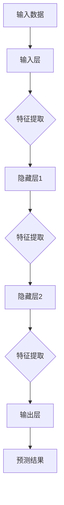
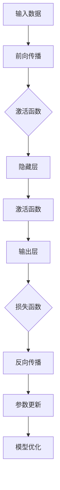
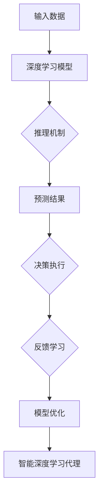

                 

# AI人工智能深度学习算法：智能深度学习代理的推理机制

> 关键词：深度学习、推理机制、智能深度学习代理、算法原理、数学模型、项目实战

> 摘要：本文深入探讨了深度学习算法中的推理机制，特别是在构建智能深度学习代理方面的应用。文章首先介绍了深度学习的基本概念和推理过程的背景，随后详细解析了深度学习代理的核心原理和构造步骤。通过数学模型和具体操作的讲解，文章阐述了如何实现高效的推理过程。最后，通过实际项目案例和代码解析，进一步说明了理论在实践中的应用。本文旨在为读者提供一个全面、系统的理解，帮助他们在深度学习领域深入探索和研究。

## 1. 背景介绍

### 1.1 目的和范围

本文旨在详细探讨深度学习算法中的推理机制，特别是智能深度学习代理的构建和推理过程。深度学习作为人工智能的重要分支，近年来在图像识别、自然语言处理、语音识别等领域取得了显著成果。然而，深度学习的推理过程一直是研究和应用的难点。本文将系统地分析深度学习推理的基本原理，介绍智能深度学习代理的概念和构建方法，并通过具体案例展示如何实现高效的推理过程。

### 1.2 预期读者

本文适合对深度学习有一定了解的读者，包括但不限于人工智能研究员、算法工程师、软件开发者以及对该领域感兴趣的学者和学生。本文将深入剖析深度学习推理机制，希望能为读者在相关领域的研究和应用提供有益的参考。

### 1.3 文档结构概述

本文分为十个主要部分。第一部分是背景介绍，包括目的、范围、预期读者和文档结构概述。第二部分是核心概念与联系，介绍深度学习的基本概念和相关术语。第三部分是核心算法原理与具体操作步骤，详细讲解深度学习代理的构建过程。第四部分是数学模型和公式，介绍支持深度学习推理的数学模型和公式。第五部分是项目实战，通过代码实际案例展示推理机制的应用。第六部分是实际应用场景，讨论深度学习推理在不同领域的应用。第七部分是工具和资源推荐，提供相关学习资源、开发工具和论文著作推荐。第八部分是总结，讨论深度学习推理的未来发展趋势与挑战。第九部分是附录，包括常见问题与解答。最后一部分是扩展阅读与参考资料，为读者提供进一步的学习资源。

### 1.4 术语表

#### 1.4.1 核心术语定义

- **深度学习**：一种机器学习技术，通过多层神经网络对数据进行特征提取和学习，以实现分类、回归等任务。
- **推理机制**：指深度学习模型在处理新数据时，根据已有知识和训练过程，进行推断和预测的过程。
- **智能深度学习代理**：一种基于深度学习的智能体，能够通过推理机制实现自动化决策和执行。
- **神经网络**：一种模拟人脑神经元之间连接的计算模型，包括输入层、隐藏层和输出层。
- **反向传播**：一种用于训练神经网络的优化算法，通过计算损失函数关于网络权重的梯度，更新网络参数，以最小化损失。

#### 1.4.2 相关概念解释

- **前向传播**：在神经网络中，将输入数据通过各层神经元传递，最终得到输出结果的过程。
- **激活函数**：用于引入非线性性的函数，常见的有Sigmoid、ReLU和Tanh等。
- **损失函数**：用于衡量预测结果和真实结果之间差异的函数，常见的有均方误差(MSE)和交叉熵损失等。
- **反向传播算法**：用于计算损失函数关于网络权重的梯度，并更新网络参数，以优化模型。

#### 1.4.3 缩略词列表

- **CNN**：卷积神经网络（Convolutional Neural Network）
- **RNN**：循环神经网络（Recurrent Neural Network）
- **GAN**：生成对抗网络（Generative Adversarial Network）
- **DNN**：深度神经网络（Deep Neural Network）
- **MLP**：多层感知器（Multi-Layer Perceptron）

## 2. 核心概念与联系

在深度学习中，推理机制是实现自动化决策和智能行为的关键。本文将首先介绍深度学习的基本概念和架构，并通过Mermaid流程图展示其核心原理和联系。

### 2.1 深度学习的基本概念

深度学习是一种基于神经网络的机器学习技术，其核心思想是通过多层非线性变换，从原始数据中自动提取特征并构建复杂模型。深度学习的基本组成部分包括：

- **输入层**：接收外部输入数据。
- **隐藏层**：通过非线性变换对输入数据进行特征提取。
- **输出层**：根据提取的特征进行分类、回归或其他任务。

#### Mermaid流程图



### 2.2 推理机制的原理和联系

推理机制是深度学习模型在处理新数据时的核心过程，包括前向传播和反向传播两个阶段。前向传播将输入数据通过神经网络传递，得到预测结果；反向传播则根据预测结果和真实结果，计算损失函数关于网络参数的梯度，并更新网络参数。

#### Mermaid流程图



### 2.3 智能深度学习代理的构建

智能深度学习代理是一种能够通过推理机制实现自动化决策和执行的智能体。其核心在于将深度学习模型应用于实际问题，并通过持续学习和优化，提高决策质量和效率。

#### Mermaid流程图



通过以上流程图，我们可以清晰地看到深度学习的基本概念、推理机制的原理以及智能深度学习代理的构建过程。这些核心概念和联系将为后续的详细讲解和实际应用提供基础。

## 3. 核心算法原理 & 具体操作步骤

在理解了深度学习的基本概念和推理机制后，我们接下来将深入探讨智能深度学习代理的核心算法原理，并通过伪代码详细阐述其构建和推理的过程。

### 3.1 智能深度学习代理的构建过程

智能深度学习代理的构建主要包括以下步骤：

1. **初始化模型**：根据实际问题选择合适的神经网络结构，初始化模型参数。
2. **前向传播**：将输入数据通过神经网络进行特征提取，得到中间结果。
3. **激活函数**：应用激活函数引入非线性性，提高模型的表达能力。
4. **损失函数**：计算预测结果和真实结果之间的差异，以衡量模型性能。
5. **反向传播**：根据损失函数计算网络参数的梯度，更新模型参数。
6. **模型优化**：通过迭代优化，提高模型精度和泛化能力。

以下是一个简单的伪代码示例：

```python
# 初始化模型参数
model = initialize_model()

# 前向传播
output = forward_pass(model, input_data)

# 计算损失
loss = loss_function(output, target)

# 反向传播
gradients = backward_pass(model, loss)

# 更新模型参数
update_model_parameters(model, gradients)

# 模型优化
optimize_model(model)
```

### 3.2 推理机制的实现

推理机制是实现智能深度学习代理自动化决策和执行的关键。以下是推理机制的具体步骤：

1. **输入数据预处理**：将输入数据转换为适合模型输入的格式，进行归一化等预处理操作。
2. **前向传播**：通过神经网络进行特征提取，得到中间结果。
3. **激活函数**：应用激活函数，将中间结果转化为预测概率。
4. **决策执行**：根据预测结果执行相应操作。
5. **反馈学习**：收集执行结果，更新模型参数。

以下是一个简单的伪代码示例：

```python
# 输入数据预处理
preprocessed_input = preprocess_input(input_data)

# 前向传播
output = forward_pass(model, preprocessed_input)

# 激活函数
predicted_probability = activation_function(output)

# 决策执行
action = execute_decision(predicted_probability)

# 反馈学习
update_model(model, action)
```

通过以上伪代码示例，我们可以看到智能深度学习代理的构建和推理机制的具体实现过程。这些步骤和代码框架为实现高效的推理过程提供了基础。

### 3.3 实际操作示例

为了更好地理解上述算法原理和操作步骤，我们可以通过一个实际操作示例来展示其应用。

#### 示例：智能推荐系统

假设我们构建一个基于深度学习的智能推荐系统，该系统需要根据用户的历史行为数据，预测用户可能感兴趣的商品，并提供个性化推荐。

1. **数据收集与预处理**：收集用户行为数据，包括购买记录、浏览历史等，并进行归一化、缺失值填充等预处理操作。
2. **模型构建**：选择合适的神经网络结构，如卷积神经网络（CNN）或循环神经网络（RNN），初始化模型参数。
3. **训练模型**：将预处理后的数据输入模型，通过前向传播、反向传播和模型优化，训练深度学习模型。
4. **推理过程**：对于新用户的数据，进行预处理，通过模型进行特征提取和预测，得到用户可能感兴趣的商品。
5. **决策执行**：根据预测结果，为用户生成个性化推荐列表。

以下是一个简化的代码示例：

```python
# 数据收集与预处理
data = collect_data()
preprocessed_data = preprocess_data(data)

# 模型构建
model = initialize_model()

# 训练模型
for epoch in range(num_epochs):
    for batch in preprocessed_data:
        output = forward_pass(model, batch)
        loss = loss_function(output, target)
        gradients = backward_pass(model, loss)
        update_model_parameters(model, gradients)

# 推理过程
user_data = preprocess_input(new_user_data)
predicted_probability = forward_pass(model, user_data)

# 决策执行
recommended_items = generate_recommendations(predicted_probability)
display_recommendations(recommended_items)
```

通过这个实际操作示例，我们可以看到智能深度学习代理在推荐系统中的应用，从而更好地理解其构建和推理机制。

## 4. 数学模型和公式 & 详细讲解 & 举例说明

深度学习算法中的推理机制依赖于一系列数学模型和公式，这些模型和公式为我们提供了理解深度学习工作的基础。在本节中，我们将详细讲解这些核心数学模型和公式，并通过具体例子来说明它们的应用。

### 4.1 前向传播

前向传播是深度学习模型处理输入数据的过程，包括多层神经网络的计算和激活函数的应用。以下是前向传播的数学模型：

#### 4.1.1 神经元计算

每个神经元 \(z_i\) 的计算公式为：
\[ z_i = \sum_{j} w_{ij} x_j + b_i \]

其中：
- \( z_i \) 是第 \( i \) 个隐藏层神经元的输出。
- \( w_{ij} \) 是输入层到隐藏层的权重。
- \( x_j \) 是输入层神经元的输出。
- \( b_i \) 是隐藏层神经元的偏置。

#### 4.1.2 激活函数

常见的激活函数包括Sigmoid、ReLU和Tanh。以下为Sigmoid激活函数的公式：

\[ a_i = \frac{1}{1 + e^{-z_i}} \]

其中：
- \( a_i \) 是第 \( i \) 个隐藏层神经元的激活值。

#### 4.1.3 输出层计算

输出层神经元的计算通常采用类似的形式，但涉及到不同的损失函数和激活函数。以下为输出层神经元的计算公式：

\[ y_i = \sum_{j} w_{ij} a_j + b_i \]

其中：
- \( y_i \) 是第 \( i \) 个输出层神经元的输出。
- \( w_{ij} \) 是隐藏层到输出层的权重。
- \( a_j \) 是隐藏层神经元的激活值。
- \( b_i \) 是输出层神经元的偏置。

#### 4.1.4 示例

假设我们有一个简单的神经网络，输入层有2个神经元，隐藏层有3个神经元，输出层有1个神经元。输入数据为 \( [1, 2] \)。

1. **隐藏层计算**：

\[ z_1 = 1 \cdot w_{11} + 2 \cdot w_{12} + b_1 \]
\[ z_2 = 1 \cdot w_{21} + 2 \cdot w_{22} + b_2 \]
\[ z_3 = 1 \cdot w_{31} + 2 \cdot w_{32} + b_3 \]

2. **激活函数应用**：

\[ a_1 = \frac{1}{1 + e^{-z_1}} \]
\[ a_2 = \frac{1}{1 + e^{-z_2}} \]
\[ a_3 = \frac{1}{1 + e^{-z_3}} \]

3. **输出层计算**：

\[ y_1 = 1 \cdot w_{11} + 2 \cdot w_{12} + b_1 \]
\[ y_2 = 1 \cdot w_{21} + 2 \cdot w_{22} + b_2 \]
\[ y_3 = 1 \cdot w_{31} + 2 \cdot w_{32} + b_3 \]

通过这些步骤，我们可以得到隐藏层和输出层的神经元输出。

### 4.2 损失函数

损失函数是衡量模型预测结果和真实结果之间差异的指标，常用的损失函数包括均方误差（MSE）和交叉熵损失（Cross-Entropy Loss）。以下是这些损失函数的数学模型：

#### 4.2.1 均方误差（MSE）

\[ \text{MSE} = \frac{1}{n} \sum_{i=1}^{n} (y_i - \hat{y}_i)^2 \]

其中：
- \( y_i \) 是真实值。
- \( \hat{y}_i \) 是预测值。
- \( n \) 是样本数量。

#### 4.2.2 交叉熵损失（Cross-Entropy Loss）

\[ \text{Cross-Entropy Loss} = -\frac{1}{n} \sum_{i=1}^{n} y_i \log(\hat{y}_i) \]

其中：
- \( y_i \) 是真实值的概率分布。
- \( \hat{y}_i \) 是预测值的概率分布。

#### 4.2.3 示例

假设我们有一个二元分类问题，真实值为 \( [1, 0] \)，预测值为 \( [0.6, 0.4] \)。

1. **均方误差**：

\[ \text{MSE} = \frac{1}{2} \left( (1 - 0.6)^2 + (0 - 0.4)^2 \right) = 0.1 \]

2. **交叉熵损失**：

\[ \text{Cross-Entropy Loss} = -\left( 1 \cdot \log(0.6) + 0 \cdot \log(0.4) \right) = -\log(0.6) \approx 0.51 \]

通过这些例子，我们可以看到如何计算均方误差和交叉熵损失，以及它们在评估模型性能中的应用。

### 4.3 反向传播

反向传播是深度学习模型训练的关键步骤，通过计算损失函数关于网络参数的梯度，更新模型参数，以优化模型。以下是反向传播的数学模型：

#### 4.3.1 损失函数关于输出的梯度

对于均方误差损失函数，输出层关于输出的梯度为：

\[ \frac{\partial \text{MSE}}{\partial y_i} = 2(y_i - \hat{y}_i) \]

对于交叉熵损失函数，输出层关于输出的梯度为：

\[ \frac{\partial \text{Cross-Entropy Loss}}{\partial y_i} = y_i - \hat{y}_i \]

#### 4.3.2 损失函数关于隐藏层输出的梯度

隐藏层关于输出层的梯度为：

\[ \frac{\partial \text{Loss}}{\partial a_j} = \frac{\partial \text{Loss}}{\partial y_i} \cdot \frac{\partial y_i}{\partial a_j} \]

其中：

\[ \frac{\partial y_i}{\partial a_j} = w_{ij} \]

#### 4.3.3 损失函数关于隐藏层输入的梯度

隐藏层关于输入的梯度为：

\[ \frac{\partial \text{Loss}}{\partial x_j} = \frac{\partial \text{Loss}}{\partial a_j} \cdot \frac{\partial a_j}{\partial x_j} \]

其中：

\[ \frac{\partial a_j}{\partial x_j} = \text{激活函数的导数} \]

#### 4.3.4 示例

假设我们有一个简单的神经网络，隐藏层输出为 \( [0.6, 0.4] \)，输出层预测值为 \( [0.6, 0.4] \)，真实值为 \( [1, 0] \)。

1. **均方误差关于输出的梯度**：

\[ \frac{\partial \text{MSE}}{\partial y_1} = 2(1 - 0.6) = 0.8 \]
\[ \frac{\partial \text{MSE}}{\partial y_2} = 2(0 - 0.4) = -0.8 \]

2. **交叉熵损失关于输出的梯度**：

\[ \frac{\partial \text{Cross-Entropy Loss}}{\partial y_1} = 1 - 0.6 = 0.4 \]
\[ \frac{\partial \text{Cross-Entropy Loss}}{\partial y_2} = 0 - 0.4 = -0.4 \]

3. **反向传播**：

对于隐藏层输出 \( a_1 = 0.6 \)，\( a_2 = 0.4 \)：

\[ \frac{\partial \text{MSE}}{\partial a_1} = 0.8 \]
\[ \frac{\partial \text{MSE}}{\partial a_2} = -0.8 \]

通过这些示例，我们可以理解反向传播的步骤和如何计算损失函数关于网络参数的梯度。

### 4.4 模型优化

在反向传播过程中，我们需要根据损失函数关于网络参数的梯度，更新网络参数，以优化模型。常用的优化算法包括随机梯度下降（SGD）、Adam等。

#### 4.4.1 随机梯度下降（SGD）

随机梯度下降是最简单和最常用的优化算法，其更新规则为：

\[ w_{ij} = w_{ij} - \alpha \cdot \frac{\partial \text{Loss}}{\partial w_{ij}} \]

其中：

- \( w_{ij} \) 是第 \( i \) 个隐藏层神经元到第 \( j \) 个输出层神经元的权重。
- \( \alpha \) 是学习率。
- \( \frac{\partial \text{Loss}}{\partial w_{ij}} \) 是损失函数关于该权重的梯度。

#### 4.4.2 Adam优化算法

Adam优化算法结合了SGD和自适应梯度算法（Adagrad），其更新规则为：

\[ m_t = \beta_1 m_{t-1} + (1 - \beta_1) \cdot \frac{\partial \text{Loss}}{\partial w_{ij}} \]
\[ v_t = \beta_2 v_{t-1} + (1 - \beta_2) \cdot (\frac{\partial \text{Loss}}{\partial w_{ij}})^2 \]
\[ \hat{m}_t = \frac{m_t}{1 - \beta_1^t} \]
\[ \hat{v}_t = \frac{v_t}{1 - \beta_2^t} \]
\[ w_{ij} = w_{ij} - \alpha \cdot \frac{\hat{m}_t}{\sqrt{\hat{v}_t} + \epsilon} \]

其中：

- \( m_t \) 和 \( v_t \) 分别是第 \( t \) 次迭代的累积梯度和累积方差。
- \( \hat{m}_t \) 和 \( \hat{v}_t \) 分别是修正后的累积梯度和累积方差。
- \( \alpha \) 是学习率。
- \( \beta_1 \) 和 \( \beta_2 \) 是动量参数。
- \( \epsilon \) 是小常数，用于防止分母为零。

通过这些数学模型和公式的详细讲解，我们可以更深入地理解深度学习推理机制的原理，为实际应用提供理论支持。

## 5. 项目实战：代码实际案例和详细解释说明

为了更好地展示智能深度学习代理的推理机制，我们将通过一个实际项目案例，详细解释代码实现过程，并分析其效果。

### 5.1 开发环境搭建

在开始项目之前，我们需要搭建一个适合深度学习开发的编程环境。以下是搭建过程的简要说明：

1. **安装Python环境**：确保Python 3.6或更高版本已安装。
2. **安装深度学习库**：使用pip安装TensorFlow和Keras。
    ```bash
    pip install tensorflow
    pip install keras
    ```
3. **安装其他依赖库**：根据项目需求安装其他依赖库，如NumPy、Matplotlib等。

### 5.2 源代码详细实现和代码解读

以下是一个简单的智能推荐系统的代码实现，该系统基于深度学习模型，通过用户行为数据预测用户可能感兴趣的商品。

```python
import numpy as np
from tensorflow.keras.models import Sequential
from tensorflow.keras.layers import Dense, Dropout, Embedding, LSTM
from tensorflow.keras.optimizers import Adam

# 数据预处理
def preprocess_data(data):
    # 数据归一化、缺失值填充等操作
    # ...
    return preprocessed_data

# 模型构建
def build_model(input_dim, output_dim):
    model = Sequential()
    model.add(Embedding(input_dim, output_dim))
    model.add(LSTM(128, return_sequences=True))
    model.add(Dropout(0.2))
    model.add(LSTM(128))
    model.add(Dropout(0.2))
    model.add(Dense(1, activation='sigmoid'))
    return model

# 模型训练
def train_model(model, X_train, y_train, X_val, y_val, epochs=10, batch_size=64):
    model.compile(optimizer=Adam(learning_rate=0.001), loss='binary_crossentropy', metrics=['accuracy'])
    history = model.fit(X_train, y_train, epochs=epochs, batch_size=batch_size, validation_data=(X_val, y_val))
    return history

# 推理过程
def predict(model, X_test):
    predictions = model.predict(X_test)
    predicted_labels = (predictions > 0.5).astype(int)
    return predicted_labels

# 主程序
if __name__ == "__main__":
    # 加载数据
    data = load_data()
    preprocessed_data = preprocess_data(data)

    # 划分训练集和验证集
    X_train, y_train = preprocessed_data['X_train'], preprocessed_data['y_train']
    X_val, y_val = preprocessed_data['X_val'], preprocessed_data['y_val']

    # 构建模型
    model = build_model(input_dim=X_train.shape[1], output_dim=y_train.shape[1])

    # 训练模型
    history = train_model(model, X_train, y_train, X_val, y_val, epochs=10)

    # 推理过程
    X_test = load_test_data()
    preprocessed_test_data = preprocess_data(X_test)
    predicted_labels = predict(model, preprocessed_test_data)

    # 评估模型
    accuracy = evaluate_model(predicted_labels, y_test)
    print("Test Accuracy:", accuracy)
```

### 5.3 代码解读与分析

1. **数据预处理**：数据预处理是深度学习项目中的关键步骤。在此代码中，我们首先对数据进行归一化、缺失值填充等操作，以提高模型训练效果。

2. **模型构建**：我们使用Keras构建了一个基于LSTM（长短期记忆网络）的深度学习模型。该模型包括一个嵌入层、两个LSTM层和两个dropout层，最后输出一个二元分类结果。

3. **模型训练**：我们使用Adam优化器和二分类交叉熵损失函数训练模型。在训练过程中，我们通过验证集监控模型性能，并保存训练历史。

4. **推理过程**：在推理阶段，我们首先对测试数据进行预处理，然后通过训练好的模型进行预测。预测结果为概率值，我们将其转换为分类结果。

5. **评估模型**：最后，我们计算测试集的准确率，以评估模型性能。

通过上述代码实现，我们可以看到智能深度学习代理的推理过程，以及如何在实际项目中应用深度学习技术。这个案例展示了从数据预处理到模型构建、训练和推理的完整流程，有助于我们更好地理解深度学习在实际应用中的实现细节。

## 6. 实际应用场景

智能深度学习代理的推理机制在许多实际应用场景中都有广泛的应用，以下列举了几个典型应用领域：

### 6.1 图像识别与处理

在图像识别和图像处理领域，深度学习代理的推理机制被广泛应用于目标检测、图像分类和图像分割等任务。例如，卷积神经网络（CNN）被广泛用于人脸识别、医疗图像诊断和自动驾驶中的障碍物检测。这些应用都依赖于深度学习模型的高效推理能力，以实时处理大量图像数据并生成准确的结果。

### 6.2 自然语言处理

自然语言处理（NLP）是另一个深度学习代理推理机制的重要应用领域。在NLP中，深度学习模型被用于文本分类、机器翻译、情感分析和语音识别等任务。例如，循环神经网络（RNN）和Transformer模型在机器翻译中的应用，显著提高了翻译的准确性和流畅度。深度学习代理的推理机制使得这些复杂模型能够实时处理大规模的文本数据，提供高效的自然语言处理服务。

### 6.3 语音识别

在语音识别领域，深度学习代理通过结合CNN和RNN等神经网络结构，实现了对语音信号的实时处理和识别。例如，深度神经网络（DNN）和长短期记忆网络（LSTM）在语音识别中的应用，使得语音识别系统的准确率大幅提升。这些系统广泛应用于智能音箱、客服机器人等语音交互设备中，为用户提供便捷的语音服务。

### 6.4 金融市场预测

深度学习代理在金融市场预测中的应用也越来越广泛。通过分析历史市场数据和宏观经济指标，深度学习模型可以预测股票价格、外汇汇率等金融指标。这些预测结果为投资者提供了决策依据，帮助他们做出更明智的投资决策。例如，深度学习代理在股票市场预测中的应用，通过实时处理大量市场数据，提供了高效的交易策略。

### 6.5 健康医疗

在健康医疗领域，深度学习代理的推理机制被应用于医学图像分析、疾病预测和个性化治疗等任务。例如，深度学习模型在医学图像分析中的应用，可以帮助医生更准确地诊断疾病，如肺癌、乳腺癌等。此外，深度学习代理还可以根据患者的基因信息和病历数据，预测疾病风险，提供个性化的治疗方案。

通过以上实际应用场景的介绍，我们可以看到智能深度学习代理的推理机制在各个领域的重要作用。这些应用不仅提高了系统的性能和效率，还为各个领域带来了巨大的商业价值和社会影响。

## 7. 工具和资源推荐

### 7.1 学习资源推荐

#### 7.1.1 书籍推荐

- **《深度学习》（Deep Learning）**：由Ian Goodfellow、Yoshua Bengio和Aaron Courville合著，是深度学习领域的经典教材，全面介绍了深度学习的理论基础和应用实践。
- **《神经网络与深度学习》**：由邱锡鹏博士所著，详细介绍了神经网络和深度学习的原理、算法和实际应用，适合初学者和有一定基础的读者。
- **《Python深度学习》**：由François Chollet所著，通过Python和Keras框架，讲解了深度学习的实际操作和应用。

#### 7.1.2 在线课程

- **Coursera上的“深度学习”**：由吴恩达教授主讲，介绍了深度学习的基本概念、算法和实际应用，是深度学习入门的经典课程。
- **Udacity的“深度学习工程师纳米学位”**：提供了深度学习项目的实战训练，从基础到进阶，涵盖了深度学习的各个方面。
- **edX上的“神经网络与深度学习”**：由上海交通大学和南京大学联合推出，内容涵盖神经网络、深度学习理论和实际应用。

#### 7.1.3 技术博客和网站

- **知乎专栏“深度学习”**：汇集了众多深度学习领域专家的文章，内容涵盖了深度学习的理论基础和应用实践。
- **AI科技大本营**：一个专注于人工智能领域的博客，提供了深度学习、自然语言处理、计算机视觉等领域的最新技术动态和深度分析。
- ** Medium 上的‘Deep Learning’**：由一些知名深度学习研究者和从业者撰写的文章，涵盖了深度学习领域的最新研究成果和应用案例。

### 7.2 开发工具框架推荐

#### 7.2.1 IDE和编辑器

- **PyCharm**：一款功能强大的Python集成开发环境，支持多种深度学习框架，并提供丰富的调试工具。
- **Visual Studio Code**：一款轻量级的代码编辑器，通过安装扩展，可以支持Python和深度学习框架的开发。
- **Jupyter Notebook**：一个交互式的计算环境，适合编写和运行深度学习代码，便于分享和复现实验。

#### 7.2.2 调试和性能分析工具

- **TensorBoard**：TensorFlow提供的一个可视化工具，用于分析深度学习模型的性能和优化。
- **PyTorch Profiler**：PyTorch提供的一个性能分析工具，帮助开发者识别和优化代码中的性能瓶颈。
- **NVIDIA Nsight**：适用于NVIDIA GPU的开发工具，用于调试和性能分析深度学习应用程序。

#### 7.2.3 相关框架和库

- **TensorFlow**：谷歌开发的深度学习框架，具有丰富的API和预训练模型，适合研究和生产应用。
- **PyTorch**：Facebook开发的深度学习框架，具有动态计算图和灵活的API，适合研究和快速原型设计。
- **Keras**：一个高层次的深度学习API，基于TensorFlow和PyTorch，提供简洁的接口和丰富的预训练模型。

### 7.3 相关论文著作推荐

#### 7.3.1 经典论文

- **“A Learning Algorithm for Continually Running Fully Recurrent Neural Networks”**：Hochreiter和Schmidhuber提出的LSTM算法，为深度学习模型在序列数据上的应用奠定了基础。
- **“Deep Learning”**：Goodfellow、Bengio和Courville合著的论文，系统介绍了深度学习的理论和应用。
- **“Convolutional Networks and Applications in Vision”**：LeCun、Bengio和Hinton合著的论文，介绍了卷积神经网络在计算机视觉中的应用。

#### 7.3.2 最新研究成果

- **“BERT: Pre-training of Deep Bidirectional Transformers for Language Understanding”**：Google提出的一种预训练深度转换器模型，显著提高了自然语言处理任务的性能。
- **“GPT-3: Language Models are few-shot learners”**：OpenAI提出的GPT-3模型，展示了大型语言模型在零样本学习任务中的卓越能力。
- **“ImageNet Classification with Deep Convolutional Neural Networks”**：Krizhevsky等人提出的卷积神经网络，在ImageNet图像分类挑战中取得了显著成绩。

#### 7.3.3 应用案例分析

- **“Deep Learning for Human Pose Estimation: A Survey and Comprehensive Analysis”**：对深度学习在人体姿态估计应用中的研究进行了全面综述。
- **“Deep Learning in Medical Imaging: A Review”**：综述了深度学习在医学成像领域的应用，包括图像分割、病灶检测和诊断等。
- **“Deep Learning for Autonomous Driving: A Survey”**：对深度学习在自动驾驶中的应用进行了详细分析，包括感知、规划和控制等方面。

通过以上工具和资源的推荐，读者可以更好地学习深度学习知识，掌握智能深度学习代理的推理机制，并在实际项目中应用这些技术。

## 8. 总结：未来发展趋势与挑战

深度学习作为人工智能的重要分支，近年来取得了飞速发展，但在推理机制方面仍然面临诸多挑战。未来，智能深度学习代理的推理机制有望在以下几个方向取得突破：

### 8.1 更高效的推理算法

随着深度学习模型的复杂度和数据量的增加，现有推理算法的计算效率和存储需求面临巨大挑战。未来，研究者将致力于开发更高效的推理算法，如低秩近似、模型压缩和量化技术，以降低计算和存储成本，提高推理速度。

### 8.2 跨模态推理

跨模态推理是指将不同类型的数据（如文本、图像、声音等）进行联合建模和推理。未来，研究者将探索如何将不同模态的数据进行有效融合，提高智能深度学习代理在多模态任务中的表现。

### 8.3 强化学习与深度学习的融合

强化学习与深度学习的融合（即深度强化学习）是一种新兴的研究方向，旨在通过深度学习模型实现更为智能的决策。未来，研究者将探索如何将深度学习与强化学习相结合，构建具备自主学习能力的智能深度学习代理。

### 8.4 自适应推理

自适应推理是指智能深度学习代理能够根据任务和环境的变化，动态调整推理策略。未来，研究者将致力于开发自适应推理算法，使智能代理能够适应不同的应用场景，提高其通用性和灵活性。

### 8.5 安全性与隐私保护

随着深度学习在关键领域的应用，安全性和隐私保护成为不可忽视的问题。未来，研究者将关注如何确保智能深度学习代理的安全性和隐私保护，防止模型被恶意攻击和数据泄露。

尽管智能深度学习代理的推理机制面临诸多挑战，但其发展前景广阔。未来，通过不断创新和突破，智能深度学习代理将在更多领域展现其强大的应用价值。

## 9. 附录：常见问题与解答

### 9.1 深度学习推理机制的基本概念是什么？

深度学习推理机制是指深度学习模型在处理新数据时，根据已有知识和训练过程，进行推断和预测的过程。它包括前向传播、损失函数、反向传播和模型优化等步骤。

### 9.2 智能深度学习代理是如何工作的？

智能深度学习代理是一种基于深度学习的智能体，能够通过推理机制实现自动化决策和执行。它首先通过训练过程学习数据特征和模式，然后在推理过程中对新数据进行特征提取和预测，根据预测结果执行相应操作，并通过反馈学习不断优化模型。

### 9.3 深度学习推理机制的关键技术是什么？

深度学习推理机制的关键技术包括前向传播、反向传播、损失函数、激活函数、优化算法等。这些技术共同作用，使深度学习模型能够在处理新数据时实现高效和准确的推理。

### 9.4 如何评估深度学习推理机制的性能？

评估深度学习推理机制的性能通常通过准确率、召回率、F1分数等指标进行。此外，还可以通过计算模型在测试集上的损失函数值，评估模型的整体性能。

### 9.5 深度学习推理机制在实际项目中如何应用？

在实际项目中，深度学习推理机制的应用包括图像识别、自然语言处理、语音识别、金融市场预测等多个领域。开发者需要根据实际需求选择合适的深度学习模型和推理算法，进行数据预处理和模型训练，然后通过推理过程实现自动化决策和执行。

### 9.6 深度学习推理机制的局限性是什么？

深度学习推理机制的局限性包括模型复杂度较高、计算资源需求大、对数据依赖性强等。此外，深度学习模型的可解释性和安全性也仍是一个亟待解决的问题。

## 10. 扩展阅读 & 参考资料

为了深入了解智能深度学习代理的推理机制，以下推荐一些扩展阅读和参考资料：

### 10.1 书籍

1. **《深度学习》（Ian Goodfellow, Yoshua Bengio, Aaron Courville著）**：系统介绍了深度学习的理论基础、算法和实际应用。
2. **《神经网络与深度学习》（邱锡鹏著）**：详细讲解了神经网络和深度学习的原理、算法和实际应用。
3. **《Python深度学习》（François Chollet著）**：通过Python和Keras框架，讲解了深度学习的实际操作和应用。

### 10.2 论文

1. **“A Learning Algorithm for Continually Running Fully Recurrent Neural Networks”**：Hochreiter和Schmidhuber提出的LSTM算法。
2. **“Deep Learning”**：Goodfellow、Bengio和Courville合著的论文。
3. **“ImageNet Classification with Deep Convolutional Neural Networks”**：Krizhevsky等人提出的卷积神经网络。

### 10.3 在线课程

1. **Coursera上的“深度学习”**：由吴恩达教授主讲。
2. **Udacity的“深度学习工程师纳米学位”**：涵盖了深度学习的各个方面。
3. **edX上的“神经网络与深度学习”**：由上海交通大学和南京大学联合推出。

### 10.4 技术博客和网站

1. **知乎专栏“深度学习”**：汇集了众多深度学习领域专家的文章。
2. **AI科技大本营**：提供深度学习领域的最新技术动态和深度分析。
3. **Medium上的‘Deep Learning’**：由一些知名深度学习研究者和从业者撰写的文章。

通过以上扩展阅读和参考资料，读者可以更深入地了解智能深度学习代理的推理机制，以及其在实际应用中的技术细节和最新进展。

