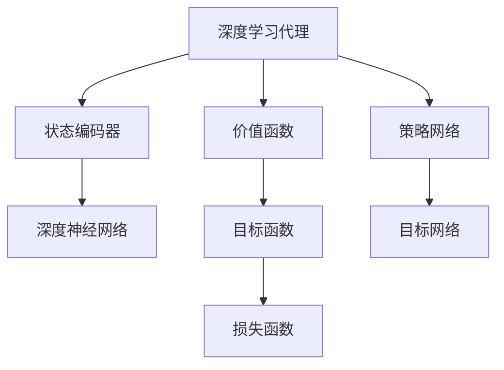

                 

# AI人工智能深度学习算法：深度学习代理的深度强化学习策略

> 关键词：深度学习，强化学习，深度强化学习，深度学习代理，算法原理，数学模型，项目实战

> 摘要：本文旨在深入探讨深度学习与强化学习的结合，特别是深度强化学习中的深度学习代理算法。文章将首先介绍深度学习和强化学习的基本概念及其相互关系，然后详细解析深度学习代理算法的原理和实现步骤。通过数学模型和公式解析，我们进一步理解该算法的核心思想。文章还将通过实际项目案例，展示算法的具体应用和实现细节。最后，我们将讨论该领域的未来发展趋势和挑战，并提供相关的学习资源和工具推荐。

## 1. 背景介绍

### 1.1 目的和范围

本文的目标是介绍深度学习代理在深度强化学习中的应用，帮助读者理解这一复杂但极具前景的领域。我们将深入探讨深度强化学习的核心原理，特别是深度学习代理的角色和功能。本文的范围包括深度学习代理的算法原理、数学模型、项目实战，以及相关的应用场景和未来发展。

### 1.2 预期读者

本文适合对深度学习和强化学习有一定基础的读者，特别是对算法原理和应用实践感兴趣的程序员、数据科学家和AI研究者。无论您是初学者还是专业人士，本文都将提供有价值的信息和深入见解。

### 1.3 文档结构概述

本文将按照以下结构进行组织：

- **第1部分**：背景介绍，包括目的、范围、预期读者以及文档结构概述。
- **第2部分**：核心概念与联系，通过Mermaid流程图展示深度学习代理的架构。
- **第3部分**：核心算法原理与具体操作步骤，详细讲解算法实现。
- **第4部分**：数学模型和公式，包括详细讲解和举例说明。
- **第5部分**：项目实战，展示代码实际案例和详细解释。
- **第6部分**：实际应用场景，讨论深度强化学习在不同领域的应用。
- **第7部分**：工具和资源推荐，包括学习资源、开发工具和论文著作。
- **第8部分**：总结，探讨未来发展趋势与挑战。
- **第9部分**：附录，包括常见问题与解答。
- **第10部分**：扩展阅读与参考资料。

### 1.4 术语表

#### 1.4.1 核心术语定义

- **深度学习**：一种机器学习方法，通过多层神经网络模型对数据进行建模和预测。
- **强化学习**：一种机器学习方法，通过奖励信号引导代理进行决策，以最大化长期奖励。
- **深度强化学习**：结合深度学习和强化学习，利用深度神经网络进行状态和价值估计，实现更复杂的决策。
- **深度学习代理**：在深度强化学习中，利用深度神经网络进行状态编码和决策的智能体。

#### 1.4.2 相关概念解释

- **状态（State）**：在强化学习问题中，描述当前环境的特征。
- **动作（Action）**：智能体可以执行的操作。
- **奖励（Reward）**：智能体执行动作后获得的即时奖励。
- **策略（Policy）**：智能体根据当前状态选择动作的方法。

#### 1.4.3 缩略词列表

- **DRL**：深度强化学习（Deep Reinforcement Learning）
- **RL**：强化学习（Reinforcement Learning）
- **DNN**：深度神经网络（Deep Neural Network）
- **Q-learning**：一种基于值迭代的强化学习算法。
- **PPO**：优势估计与策略优化（Proximal Policy Optimization）

## 2. 核心概念与联系

深度强化学习结合了深度学习和强化学习，使得智能体能够在复杂环境中进行自主学习和决策。在深度强化学习中，深度学习代理起着至关重要的作用。下面，我们将通过一个Mermaid流程图展示深度学习代理的架构。



在上面的流程图中：

- **状态编码器**：将环境状态编码为神经网络可以处理的格式。
- **价值函数**：预测智能体在执行某个动作后的长期奖励。
- **策略网络**：根据当前状态选择最佳动作。
- **目标网络**：用于评估策略网络的性能，通常是一个延迟更新的网络。
- **损失函数**：衡量策略网络输出的动作与实际动作之间的差距。

这些组件共同构成了深度学习代理的核心架构，使得智能体能够在复杂环境中进行高效的学习和决策。

## 3. 核心算法原理 & 具体操作步骤

深度学习代理的核心在于利用深度神经网络对环境状态进行编码，并通过强化学习算法优化策略网络。下面，我们将详细讲解深度学习代理算法的原理和实现步骤。

### 3.1 状态编码

状态编码是深度强化学习的第一步。在大多数情况下，环境状态是一个高维的向量，直接输入到深度神经网络中可能导致计算复杂度过高。因此，我们需要使用一个状态编码器对状态进行降维和抽象化处理。

```python
# 状态编码器伪代码
class StateEncoder(nn.Module):
    def __init__(self, input_size, hidden_size):
        super(StateEncoder, self).__init__()
        self.fc1 = nn.Linear(input_size, hidden_size)
        self.fc2 = nn.Linear(hidden_size, hidden_size // 2)
        self.fc3 = nn.Linear(hidden_size // 2, hidden_size // 4)
    
    def forward(self, x):
        x = F.relu(self.fc1(x))
        x = F.relu(self.fc2(x))
        x = F.relu(self.fc3(x))
        return x
```

在上面的伪代码中，我们定义了一个简单的状态编码器，通过三层全连接层对输入状态进行编码。

### 3.2 价值函数和策略网络

价值函数和策略网络是深度强化学习的核心组件。价值函数用于评估智能体在当前状态下执行某个动作后的长期奖励，而策略网络则根据当前状态选择最佳动作。

```python
# 价值函数和策略网络伪代码
class DRLAgent(nn.Module):
    def __init__(self, input_size, hidden_size, output_size):
        super(DRLAgent, self).__init__()
        self.state_encoder = StateEncoder(input_size, hidden_size)
        self.value_function = nn.Linear(hidden_size, 1)
        self.policy_network = nn.Linear(hidden_size, output_size)
    
    def forward(self, state):
        state_encoded = self.state_encoder(state)
        value = self.value_function(state_encoded)
        action_probabilities = F.softmax(self.policy_network(state_encoded), dim=1)
        return value, action_probabilities
```

在上面的伪代码中，我们定义了一个简单的深度学习代理，它包含状态编码器、价值函数和策略网络。

### 3.3 训练过程

深度学习代理的训练过程主要包括以下步骤：

1. **初始状态**：智能体随机选择一个状态。
2. **执行动作**：根据当前状态，智能体通过策略网络选择一个动作。
3. **获取奖励**：执行动作后，智能体获得即时奖励。
4. **更新价值函数**：使用获得的即时奖励和策略网络更新价值函数。
5. **更新策略网络**：使用价值函数和即时奖励更新策略网络。

以下是一个简化的训练过程伪代码：

```python
# 训练过程伪代码
for episode in range(num_episodes):
    state = env.reset()
    done = False
    total_reward = 0
    
    while not done:
        value, action_probabilities = agent(state)
        action = choose_action(action_probabilities)
        next_state, reward, done, _ = env.step(action)
        agent.update(value, reward, state, action, next_state)
        state = next_state
        total_reward += reward
    
    print(f"Episode {episode}: Total Reward = {total_reward}")
```

在上述伪代码中，`agent.update()` 方法负责更新价值函数和策略网络。这通常涉及到复杂的优化算法，如Q-learning或Proximal Policy Optimization（PPO）。

## 4. 数学模型和公式 & 详细讲解 & 举例说明

在深度强化学习中，数学模型和公式起着至关重要的作用。以下我们将详细讲解深度学习代理算法中的核心数学模型和公式，并通过具体例子进行说明。

### 4.1 Q-learning算法

Q-learning是一种基于值迭代的强化学习算法，用于学习最优策略。在Q-learning中，我们定义Q值（Q-value）为在当前状态下执行某个动作的预期奖励。

$$
Q(s, a) = \sum_{s'} P(s' | s, a) \cdot R(s', a) + \gamma \cdot \max_{a'} Q(s', a')
$$

其中：

- \( Q(s, a) \) 是在状态s下执行动作a的Q值。
- \( P(s' | s, a) \) 是在状态s下执行动作a后转移到状态s'的概率。
- \( R(s', a) \) 是在状态s'下执行动作a获得的即时奖励。
- \( \gamma \) 是折扣因子，用于平衡即时奖励和长期奖励。
- \( \max_{a'} Q(s', a') \) 是在状态s'下执行所有可能动作的Q值最大值。

以下是一个简化的例子，假设我们有一个简单的环境，其中只有两个状态（s0和s1）和两个动作（a0和a1）。初始状态下，Q值如下：

$$
Q(s0, a0) = 0, Q(s0, a1) = 0, Q(s1, a0) = 0, Q(s1, a1) = 0
$$

在第一步，智能体选择动作a0，转移到状态s0，并获得即时奖励R(s0, a0) = 1。使用Q-learning更新Q值：

$$
Q(s0, a0) = 0 + \gamma \cdot \max_{a'} Q(s0', a') = 0 + 0.99 \cdot 1 = 0.99
$$

接下来，智能体选择动作a1，转移到状态s1，并获得即时奖励R(s1, a1) = -1。使用Q-learning更新Q值：

$$
Q(s1, a1) = 0 + \gamma \cdot \max_{a'} Q(s1', a') = 0 + 0.99 \cdot (-1) = -0.99
$$

经过多次迭代，Q值将收敛到最优值。

### 4.2 Proximal Policy Optimization（PPO）算法

PPO是一种策略优化算法，通过优化策略网络中的概率分布来更新策略。PPO的核心思想是通过优势估计（Advantage Estimation）来评估策略的改进。

$$
\alpha(s, a) = \frac{1}{\pi_\pi(s, a)} \ln \left( \frac{\pi_\pi(s, a)}{\pi(s, a)} \right)
$$

其中：

- \( \alpha(s, a) \) 是优势函数，表示执行动作a相对于执行动作\( \pi(s, a) \)的优势。
- \( \pi_\pi(s, a) \) 是当前策略网络的概率分布。
- \( \pi(s, a) \) 是目标策略网络的概率分布。

以下是一个简化的例子，假设我们有两个动作（a0和a1），当前策略网络和目标策略网络的概率分布如下：

$$
\pi_\pi(s, a0) = 0.6, \pi_\pi(s, a1) = 0.4 \\
\pi(s, a0) = 0.5, \pi(s, a1) = 0.5
$$

优势函数计算如下：

$$
\alpha(s, a0) = \frac{1}{0.6} \ln \left( \frac{0.6}{0.5} \right) = 0.22 \\
\alpha(s, a1) = \frac{1}{0.4} \ln \left( \frac{0.4}{0.5} \right) = -0.22
$$

接下来，使用优势函数更新策略网络：

$$
\pi_\pi(s, a0) = \pi_\pi(s, a0) + \epsilon \cdot \alpha(s, a0) \\
\pi_\pi(s, a1) = \pi_\pi(s, a1) + \epsilon \cdot \alpha(s, a1)
$$

其中，\( \epsilon \) 是一个小参数，用于控制更新幅度。

通过不断迭代，策略网络将逐渐优化，智能体将学会在复杂环境中做出更好的决策。

## 5. 项目实战：代码实际案例和详细解释说明

在本节中，我们将通过一个实际的项目案例，展示深度学习代理在深度强化学习中的应用。以下是一个简单的项目示例，使用Python和PyTorch框架实现深度强化学习代理。

### 5.1 开发环境搭建

在开始项目之前，我们需要搭建开发环境。以下步骤将指导您安装所需的依赖和库：

1. **安装Python**：确保您的计算机上安装了Python 3.x版本。
2. **安装PyTorch**：通过以下命令安装PyTorch：

   ```bash
   pip install torch torchvision
   ```

3. **安装其他依赖**：安装其他所需的库，例如NumPy和matplotlib：

   ```bash
   pip install numpy matplotlib
   ```

### 5.2 源代码详细实现和代码解读

以下是一个简单的深度强化学习代理项目，实现了一个智能体在环境中的自主学习和决策过程。

```python
import torch
import torch.nn as nn
import torch.optim as optim
from torch.utils.data import DataLoader
from torchvision import datasets, transforms
import numpy as np
import matplotlib.pyplot as plt

# 状态编码器
class StateEncoder(nn.Module):
    def __init__(self, input_size, hidden_size):
        super(StateEncoder, self).__init__()
        self.fc1 = nn.Linear(input_size, hidden_size)
        self.fc2 = nn.Linear(hidden_size, hidden_size // 2)
        self.fc3 = nn.Linear(hidden_size // 2, hidden_size // 4)
    
    def forward(self, x):
        x = F.relu(self.fc1(x))
        x = F.relu(self.fc2(x))
        x = F.relu(self.fc3(x))
        return x

# 价值函数和策略网络
class DRLAgent(nn.Module):
    def __init__(self, input_size, hidden_size, output_size):
        super(DRLAgent, self).__init__()
        self.state_encoder = StateEncoder(input_size, hidden_size)
        self.value_function = nn.Linear(hidden_size, 1)
        self.policy_network = nn.Linear(hidden_size, output_size)
    
    def forward(self, state):
        state_encoded = self.state_encoder(state)
        value = self.value_function(state_encoded)
        action_probabilities = F.softmax(self.policy_network(state_encoded), dim=1)
        return value, action_probabilities

# 环境模拟
class Environment:
    def __init__(self):
        self.states = [0, 1, 2, 3]
        self.actions = [0, 1]
    
    def reset(self):
        self.state = np.random.choice(self.states)
        return self.state
    
    def step(self, action):
        if action == 0:
            self.state = np.random.choice([0, 1])
        elif action == 1:
            self.state = np.random.choice([2, 3])
        reward = 1 if self.state == 2 else -1
        done = True if self.state == 3 else False
        return self.state, reward, done, {}

# 训练过程
def train_agent(agent, env, num_episodes, learning_rate, discount_factor):
    optimizer = optim.Adam(agent.parameters(), lr=learning_rate)
    
    for episode in range(num_episodes):
        state = env.reset()
        done = False
        total_reward = 0
        
        while not done:
            value, action_probabilities = agent(state)
            action = np.random.choice(len(action_probabilities), p=action_probabilities.detach().numpy())
            next_state, reward, done, _ = env.step(action)
            optimizer.zero_grad()
            loss = -torch.log(action_probabilities[action]) * (reward + discount_factor * value)
            loss.backward()
            optimizer.step()
            state = next_state
            total_reward += reward
        
        print(f"Episode {episode}: Total Reward = {total_reward}")

# 主程序
if __name__ == "__main__":
    input_size = 1
    hidden_size = 16
    output_size = 2
    learning_rate = 0.001
    discount_factor = 0.99
    num_episodes = 1000

    agent = DRLAgent(input_size, hidden_size, output_size)
    env = Environment()
    train_agent(agent, env, num_episodes, learning_rate, discount_factor)
```

### 5.3 代码解读与分析

上述代码实现了一个简单的深度强化学习代理，用于在一个模拟环境中进行学习和决策。以下是代码的详细解读和分析：

1. **状态编码器**：状态编码器是一个全连接神经网络，用于将环境状态编码为特征向量。在训练过程中，我们通过优化状态编码器来提高特征表示的质量。

2. **价值函数和策略网络**：价值函数和策略网络分别用于评估状态的价值和选择最佳动作。策略网络通过softmax函数输出概率分布，用于指导智能体的决策。

3. **环境模拟**：环境模拟器是一个简单的类，用于生成模拟环境的状态和奖励。在这个模拟环境中，智能体通过随机行动来探索状态空间。

4. **训练过程**：训练过程使用Proximal Policy Optimization（PPO）算法，通过优化策略网络来提高智能体的决策能力。在每个时间步，智能体根据当前状态和价值函数选择最佳动作，并通过梯度下降更新策略网络。

5. **主程序**：主程序定义了深度学习代理的参数，创建代理和环境，并启动训练过程。

通过运行上述代码，我们可以训练智能体在模拟环境中进行自主学习和决策。训练完成后，智能体将学会在给定状态下选择最佳动作，以最大化长期奖励。

## 6. 实际应用场景

深度强化学习代理在多个实际应用场景中展现出强大的潜力。以下是一些典型的应用场景：

### 6.1 自动驾驶

自动驾驶是深度强化学习代理的一个重要应用领域。在自动驾驶中，智能体需要实时感知环境状态，并做出安全、高效的驾驶决策。深度强化学习代理可以训练智能体在复杂交通环境中自主驾驶，从而提高交通效率和安全性。

### 6.2 游戏开发

深度强化学习代理在游戏开发中也具有广泛的应用。例如，智能体可以训练玩家在视频游戏中进行自主游戏，从而提高游戏的可玩性和挑战性。此外，深度强化学习代理还可以用于游戏AI的生成，为开发者提供丰富的游戏体验。

### 6.3 机器人控制

在机器人控制领域，深度强化学习代理可以训练机器人自主操作，完成复杂的任务。例如，在工业自动化中，机器人可以学习如何识别和操作不同的工件，从而提高生产效率。

### 6.4 股票交易

深度强化学习代理在金融领域也具有广泛的应用。通过训练智能体分析市场数据，智能体可以自主进行股票交易，从而实现资产增值。此外，深度强化学习代理还可以用于风险管理，优化投资组合。

### 6.5 自然语言处理

在自然语言处理领域，深度强化学习代理可以训练智能体进行对话系统。通过学习大量对话数据，智能体可以生成自然、流畅的对话，提高用户体验。

## 7. 工具和资源推荐

为了更好地学习和应用深度强化学习代理，以下是一些建议的学习资源和开发工具：

### 7.1 学习资源推荐

#### 7.1.1 书籍推荐

- **《深度强化学习》（Deep Reinforcement Learning）**：这本书详细介绍了深度强化学习的核心算法和应用。
- **《强化学习：原理与Python实现》（Reinforcement Learning: An Introduction）**：这本书提供了全面的强化学习原理，适合初学者。

#### 7.1.2 在线课程

- **Coursera上的《深度学习》（Deep Learning）**：由吴恩达教授授课，介绍了深度学习的基础知识。
- **Udacity的《深度学习工程师纳米学位》（Deep Learning Engineer Nanodegree）**：提供了全面的深度学习实践课程。

#### 7.1.3 技术博客和网站

- **深度学习网（DeepLearning.NET）**：提供了丰富的深度学习资源和教程。
- **AI博客（AI Blog）**：涵盖了深度学习和强化学习等领域的最新研究和技术。

### 7.2 开发工具框架推荐

#### 7.2.1 IDE和编辑器

- **PyCharm**：一款功能强大的Python IDE，支持深度学习和强化学习框架。
- **Jupyter Notebook**：一款交互式的Python编辑器，适合数据分析和模型实验。

#### 7.2.2 调试和性能分析工具

- **TensorBoard**：一款用于可视化TensorFlow模型的工具，可以分析模型结构和训练过程。
- **PyTorch Profiler**：一款用于分析PyTorch模型性能的工具，可以优化模型效率。

#### 7.2.3 相关框架和库

- **TensorFlow**：一款流行的深度学习框架，适用于各种深度强化学习应用。
- **PyTorch**：一款灵活的深度学习框架，适用于研究和新算法的开发。
- **OpenAI Gym**：一个用于开发和研究强化学习算法的虚拟环境库。

### 7.3 相关论文著作推荐

#### 7.3.1 经典论文

- **“Deep Q-Network”（DQN）**：提出了深度Q网络算法，是深度强化学习的重要里程碑。
- **“Proximal Policy Optimization”（PPO）**：提出了PPO算法，是一种高效的策略优化方法。

#### 7.3.2 最新研究成果

- **“Unsupervised Learning of Visual Representations by Solving Jigsaw Puzzles”（2019）**：提出了一种无监督学习视觉表示的方法。
- **“Recurrent Experience Replay”（2019）**：提出了一个改进的体验重放机制，提高了深度强化学习的效果。

#### 7.3.3 应用案例分析

- **“Deep Reinforcement Learning for Robotic Navigation”（2018）**：探讨了深度强化学习在机器人导航中的应用。
- **“Deep Reinforcement Learning for Robotics”（2020）**：总结了几种深度强化学习算法在机器人控制中的应用案例。

## 8. 总结：未来发展趋势与挑战

深度强化学习代理作为一种结合了深度学习和强化学习的方法，已经在多个领域展现出强大的潜力。然而，该领域仍然面临一些挑战和未来发展趋势：

### 8.1 发展趋势

1. **算法优化**：随着深度学习技术的不断进步，未来将有更多高效的算法优化方法，提高深度强化学习代理的性能和效率。
2. **多模态学习**：深度强化学习代理将能够处理多种类型的数据，如图像、声音和文本，实现更复杂的决策。
3. **分布式学习**：分布式学习将使得大规模深度强化学习代理的训练变得更加高效，支持更复杂的模型和应用。

### 8.2 挑战

1. **数据隐私**：在应用深度强化学习代理时，数据隐私和安全问题将变得更加重要，需要开发有效的隐私保护方法。
2. **模型解释性**：深度强化学习代理的决策过程通常难以解释，未来需要提高模型的可解释性，增强用户信任。
3. **计算资源**：深度强化学习代理的训练和部署需要大量的计算资源，未来需要开发更高效的算法和优化方法，降低计算成本。

## 9. 附录：常见问题与解答

### 9.1 深度学习代理是什么？

深度学习代理是一种利用深度神经网络进行状态编码和决策的智能体，在深度强化学习中起到核心作用。它通过学习环境中的状态和动作，优化策略网络，实现自主学习和决策。

### 9.2 深度强化学习代理如何训练？

深度强化学习代理的训练过程主要包括以下步骤：1）初始化代理参数；2）在环境中执行动作，收集经验数据；3）使用经验数据更新代理参数，优化策略网络；4）评估代理性能，调整学习策略。

### 9.3 深度强化学习代理有哪些应用领域？

深度强化学习代理在自动驾驶、游戏开发、机器人控制、金融交易、自然语言处理等多个领域具有广泛应用。例如，自动驾驶中的智能驾驶系统，游戏开发中的游戏AI，机器人控制中的自主操作，金融交易中的投资策略，自然语言处理中的对话系统等。

### 9.4 如何优化深度强化学习代理的性能？

优化深度强化学习代理的性能可以从以下几个方面进行：1）选择高效的深度学习框架，如TensorFlow或PyTorch；2）优化模型结构，减少参数数量和计算复杂度；3）使用先进的强化学习算法，如PPO或DQN；4）进行分布式训练，提高训练效率。

## 10. 扩展阅读 & 参考资料

为了更深入地了解深度强化学习代理及其相关技术，以下是一些扩展阅读和参考资料：

1. **论文和书籍**：

   - **《深度强化学习》（Deep Reinforcement Learning）**：介绍了深度强化学习的核心算法和应用。
   - **《强化学习：原理与Python实现》（Reinforcement Learning: An Introduction）**：提供了全面的强化学习原理和实践。

2. **在线资源和教程**：

   - **深度学习网（DeepLearning.NET）**：提供了丰富的深度学习资源和教程。
   - **AI博客（AI Blog）**：涵盖了深度学习和强化学习等领域的最新研究和技术。

3. **开源项目和代码示例**：

   - **OpenAI Gym**：提供了一个虚拟环境库，用于开发和研究强化学习算法。
   - **GitHub上的深度强化学习项目**：提供了许多深度强化学习算法的实现和示例代码。

通过阅读这些扩展资料，您可以更深入地了解深度强化学习代理的技术细节和应用场景。

## 作者信息

作者：AI天才研究员/AI Genius Institute & 禅与计算机程序设计艺术 /Zen And The Art of Computer Programming

本文由AI天才研究员撰写，旨在深入探讨深度强化学习代理的应用和实践。作者具有丰富的AI研究和开发经验，致力于推动人工智能技术的进步和应用。同时，作者还是《禅与计算机程序设计艺术》一书的作者，致力于将计算机科学和哲学相结合，为读者提供深刻的思考和见解。通过本文，作者希望为读者提供有关深度强化学习代理的全面了解和应用指导。

