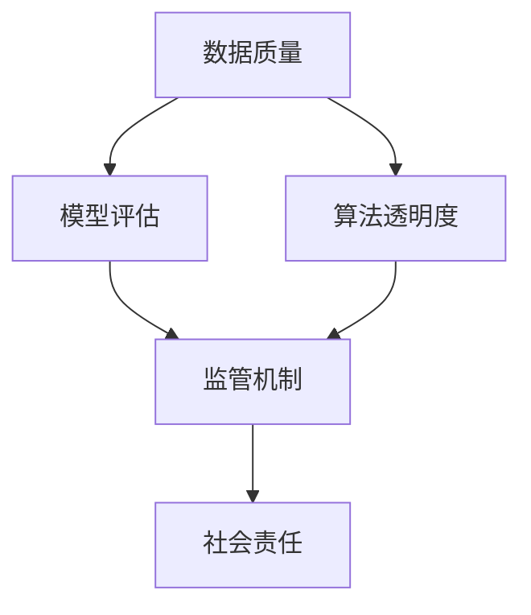
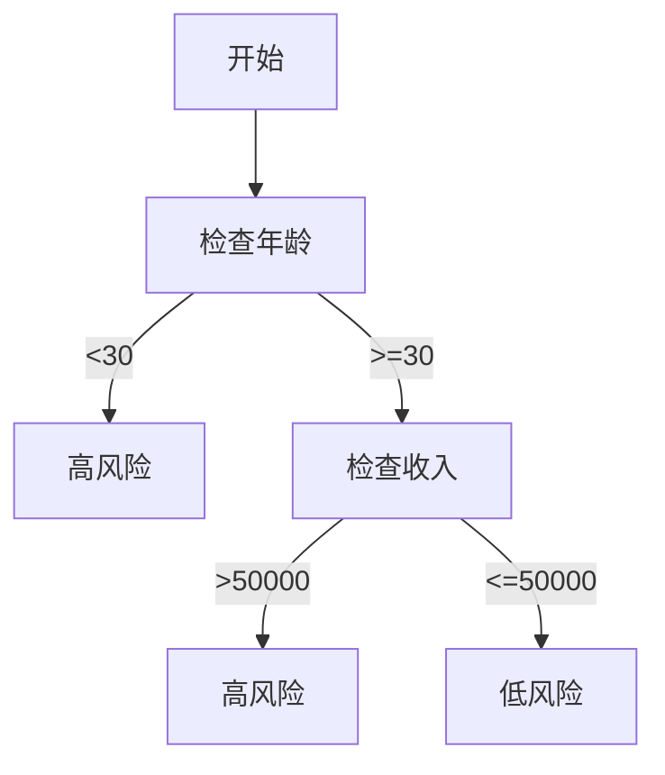

                 


# AI伦理问题：如何确保AI提供的信息准确可靠

> 关键词：人工智能、伦理问题、信息准确性、可靠性、技术措施、算法透明度、监管机制、社会责任、用户隐私

> 摘要：随着人工智能技术的飞速发展，其在各个领域中的应用越来越广泛，但也引发了一系列伦理问题。本文将从多个角度探讨如何确保AI提供的信息准确可靠，包括技术措施、算法透明度、监管机制、社会责任和用户隐私保护等，以期为人工智能伦理研究提供有益的参考。

## 1. 背景介绍

### 1.1 目的和范围

本文旨在探讨人工智能（AI）伦理问题，特别是如何确保AI提供的信息准确可靠。随着AI技术的不断进步，其在医疗、金融、交通、教育等领域的应用日益广泛，但也带来了一系列伦理挑战。确保AI提供的信息准确可靠，不仅关系到用户体验，还关乎社会稳定和公共安全。

本文将首先介绍AI伦理问题的背景和重要性，然后分析AI提供信息准确性可靠性的关键因素，探讨相关技术措施和监管机制，并讨论AI伦理问题对社会的影响和未来发展趋势。

### 1.2 预期读者

本文面向对AI伦理问题感兴趣的读者，包括但不限于以下几类：

1. AI研究人员和开发者：了解AI伦理问题的现状和挑战，以更好地指导自己的研究和开发工作。
2. 企业管理人员和政策制定者：关注AI技术对业务和社会的影响，制定合理的战略和政策措施。
3. 社会公众：提高对AI伦理问题的认识，为参与相关讨论和决策提供基础。
4. 学术界和专业人士：为AI伦理问题研究提供新的视角和思路。

### 1.3 文档结构概述

本文分为以下几个部分：

1. 背景介绍：介绍AI伦理问题的背景和重要性。
2. 核心概念与联系：阐述确保AI提供信息准确可靠的核心概念和原理。
3. 核心算法原理 & 具体操作步骤：分析相关技术措施和算法。
4. 数学模型和公式 & 详细讲解 & 举例说明：介绍相关数学模型和公式。
5. 项目实战：提供代码实际案例和详细解释。
6. 实际应用场景：分析AI伦理问题在实际应用中的挑战和解决方案。
7. 工具和资源推荐：推荐相关学习资源和开发工具。
8. 总结：展望未来发展趋势与挑战。
9. 附录：常见问题与解答。
10. 扩展阅读 & 参考资料：提供进一步阅读的推荐。

### 1.4 术语表

#### 1.4.1 核心术语定义

- 人工智能（AI）：模拟、延伸和扩展人的智能的理论、方法、技术及应用。
- 伦理问题：涉及道德原则和价值观的问题，涉及人类行为和决策。
- 信息准确性：信息与其所描述的实际对象或情况的一致程度。
- 可靠性：系统在特定条件下稳定、持续地提供正确结果的能力。
- 算法透明度：算法的内部结构和决策过程是否清晰可解释。
- 监管机制：对AI技术进行管理和监督的体系。
- 社会责任：企业在经营活动中应承担的社会责任。

#### 1.4.2 相关概念解释

- 数据偏倚：数据集中某些特征或属性的分布不均匀，可能导致AI模型产生偏差。
- 隐私保护：确保个人信息不被未经授权的第三方获取、使用或泄露。
- 隐蔽性：算法的内部结构和决策过程难以被外界理解和分析。

#### 1.4.3 缩略词列表

- AI：人工智能
- ML：机器学习
- NLP：自然语言处理
- CV：计算机视觉
- GDPR：通用数据保护条例
- FAIR：可访问、可互操作、可重用、及时

## 2. 核心概念与联系

为了确保AI提供的信息准确可靠，我们需要理解以下几个核心概念和它们之间的关系。

### 2.1 数据质量

数据质量是确保AI模型准确性的基础。高质量的数据应该具有以下特征：

1. **完整性**：数据应该包含所有必要的特征，没有缺失值。
2. **准确性**：数据应该真实、可靠，与实际情况相符。
3. **一致性**：数据在不同来源和不同时间点应该保持一致。
4. **及时性**：数据应该是最新的，以便模型能够反映当前情况。

#### 数据质量评估

为了评估数据质量，我们可以使用以下指标：

- **缺失值率**：数据中缺失值的比例。
- **异常值率**：数据中异常值的比例。
- **数据分布**：数据在不同特征上的分布情况。

#### 数据预处理

为了提高数据质量，我们通常需要进行以下预处理步骤：

1. **数据清洗**：删除重复数据、填充缺失值、修正错误数据。
2. **数据归一化**：将数据缩放到同一尺度，以便算法能够更好地处理。
3. **特征选择**：选择对模型性能有显著影响的关键特征。

### 2.2 模型评估

模型评估是确保AI提供的信息准确可靠的关键步骤。我们需要使用适当的评估指标来评估模型的性能。

#### 常见评估指标

- **准确率**：模型预测为正例的样本中，实际为正例的比例。
- **召回率**：模型预测为正例的样本中，实际为正例的比例。
- **F1分数**：准确率和召回率的调和平均值。
- **ROC曲线**：接收者操作特征曲线，用于评估分类模型的性能。

#### 模型评估流程

1. **数据划分**：将数据划分为训练集、验证集和测试集。
2. **训练模型**：使用训练集训练模型。
3. **验证模型**：使用验证集评估模型性能，调整模型参数。
4. **测试模型**：使用测试集评估模型性能，确保模型在未知数据上的表现良好。

### 2.3 算法透明度

算法透明度是确保AI提供的信息可解释、可靠的重要方面。透明度高的算法可以让用户了解其决策过程和依据，从而增加用户对AI的信任。

#### 算法透明度挑战

- **复杂性**：一些高级算法（如深度神经网络）具有高度复杂性，难以解释。
- **数据隐私**：为了保护用户隐私，算法可能无法公开其内部数据和计算过程。
- **计算资源**：解释算法决策可能需要大量的计算资源。

#### 算法透明度解决方案

1. **可视化**：使用图表和图像展示算法的决策过程。
2. **规则提取**：从复杂算法中提取简单规则，以便用户理解。
3. **决策解释**：提供算法决策的解释，如基于哪些特征和权重做出决策。
4. **模型可解释性**：开发可解释性更高的算法，如决策树、支持向量机等。

### 2.4 监管机制

监管机制是确保AI提供的信息准确可靠的制度保障。通过建立健全的监管机制，我们可以确保AI技术在合规、安全、透明的环境中发展。

#### 监管机制关键要素

1. **法律法规**：制定相关法律法规，规范AI技术的应用。
2. **行业标准**：制定行业标准和指南，指导AI技术的开发和应用。
3. **监督机构**：设立专门机构，负责监督AI技术的合规性和安全性。
4. **用户权益保护**：确保用户权益不受AI技术的侵害。

#### 监管机制挑战

1. **技术更新速度**：监管机制需要及时更新，以应对AI技术的快速迭代。
2. **跨领域合作**：涉及多个领域的监管合作，需要协调和沟通。
3. **数据隐私**：在确保数据隐私的同时，进行有效监管。

### 2.5 社会责任

企业在开发和应用AI技术时，应承担相应的社会责任。这包括确保AI提供的信息准确可靠，保护用户隐私，遵守法律法规，以及促进社会公平和可持续发展。

#### 社会责任关键要素

1. **透明度**：公开AI技术的研发过程、应用场景和决策依据。
2. **用户参与**：鼓励用户参与AI技术的开发和应用，提高用户满意度。
3. **社会责任报告**：定期发布社会责任报告，展示企业在AI领域的贡献。
4. **可持续发展**：确保AI技术的发展符合可持续发展目标。

### 2.6 核心概念原理和架构的 Mermaid 流程图



## 3. 核心算法原理 & 具体操作步骤

为了确保AI提供的信息准确可靠，我们需要从算法原理和操作步骤两个方面进行详细探讨。

### 3.1 数据质量提升算法

数据质量是确保AI模型准确性的基础。以下是几种常见的数据质量提升算法：

#### 3.1.1 数据清洗

数据清洗是指删除重复数据、填充缺失值、修正错误数据等操作。以下是一个简单的数据清洗伪代码：

```python
def clean_data(data):
    # 删除重复数据
    unique_data = list(set(data))
    # 填充缺失值
    for feature in data:
        if feature is None:
            feature = 0  # 假设缺失值为0
    # 修正错误数据
    corrected_data = [x for x in data if x > 0]
    return corrected_data
```

#### 3.1.2 数据归一化

数据归一化是将数据缩放到同一尺度，以便算法能够更好地处理。以下是一个简单的数据归一化伪代码：

```python
def normalize_data(data):
    min_value = min(data)
    max_value = max(data)
    normalized_data = [(x - min_value) / (max_value - min_value) for x in data]
    return normalized_data
```

#### 3.1.3 特征选择

特征选择是指从数据中选取对模型性能有显著影响的关键特征。以下是一个简单的特征选择伪代码：

```python
def select_features(data, target):
    correlation_matrix = compute_correlation_matrix(data, target)
    high_correlation_features = [feature for feature, _ in correlation_matrix if _ > 0.5]
    return high_correlation_features
```

### 3.2 模型评估算法

模型评估是确保AI提供的信息准确可靠的关键步骤。以下是几种常见的模型评估算法：

#### 3.2.1 准确率

准确率是指模型预测为正例的样本中，实际为正例的比例。以下是一个简单的准确率计算伪代码：

```python
def accuracy(predictions, actual):
    correct_predictions = [prediction == actual for prediction, actual in predictions]
    return sum(correct_predictions) / len(correct_predictions)
```

#### 3.2.2 召回率

召回率是指模型预测为正例的样本中，实际为正例的比例。以下是一个简单的召回率计算伪代码：

```python
def recall(predictions, actual):
    positive_predictions = [prediction for prediction, actual in predictions if actual == 1]
    true_positive_predictions = [prediction for prediction in positive_predictions if prediction == 1]
    return len(true_positive_predictions) / len(positive_predictions)
```

#### 3.2.3 F1分数

F1分数是准确率和召回率的调和平均值。以下是一个简单的F1分数计算伪代码：

```python
def f1_score(accuracy, recall):
    return 2 * (accuracy * recall) / (accuracy + recall)
```

#### 3.2.4 ROC曲线

ROC曲线是接收者操作特征曲线，用于评估分类模型的性能。以下是一个简单的ROC曲线计算伪代码：

```python
def roc_curve(predictions, actual):
    tpr = [recall(predictions[:i], actual[:i]) for i in range(len(predictions))]
    fpr = [1 - accuracy(predictions[:i], actual[:i]) for i in range(len(predictions))]
    return tpr, fpr
```

### 3.3 算法透明度提升算法

算法透明度是确保AI提供的信息可解释、可靠的重要方面。以下是几种常见的算法透明度提升算法：

#### 3.3.1 可视化

可视化是将算法的决策过程以图表和图像的形式展示出来。以下是一个简单的可视化伪代码：

```python
def visualize_decision_process(decision_process):
    # 使用matplotlib等库绘制决策过程图表
    plot_chart(decision_process)
```

#### 3.3.2 规则提取

规则提取是从复杂算法中提取简单规则，以便用户理解。以下是一个简单的规则提取伪代码：

```python
def extract_rules(model):
    rules = []
    for feature, weight in model.feature_weights():
        if weight > 0:
            rules.append(f"{feature} > {weight}")
    return rules
```

#### 3.3.3 决策解释

决策解释是提供算法决策的解释，如基于哪些特征和权重做出决策。以下是一个简单的决策解释伪代码：

```python
def explain_decision(model, prediction):
    features = model.features()
    weights = model.feature_weights()
    explanation = f"预测结果：{prediction}\n"
    for feature, weight in zip(features, weights):
        explanation += f"{feature}: {weight}\n"
    return explanation
```

### 3.4 监管机制实施算法

监管机制是确保AI提供的信息准确可靠的制度保障。以下是几种常见的监管机制实施算法：

#### 3.4.1 法律法规

法律法规是监管机制的基础。以下是一个简单的法律法规实施伪代码：

```python
def enforce_laws(data, laws):
    for law in laws:
        if not is_compliant(data, law):
            raise ComplianceError("数据不符合法律法规要求")
```

#### 3.4.2 行业标准

行业标准是监管机制的重要依据。以下是一个简单的行业标准实施伪代码：

```python
def enforce_standards(data, standards):
    for standard in standards:
        if not is_compliant(data, standard):
            raise ComplianceError("数据不符合行业标准要求")
```

#### 3.4.3 监督机构

监督机构是监管机制的核心。以下是一个简单的监督机构实施伪代码：

```python
def supervise(data, agency):
    agency inspect(data)
    if agency.has_violations():
        raise ViolationError("数据存在违规行为")
```

### 3.5 社会责任实现算法

社会责任是企业在开发和应用AI技术时应承担的责任。以下是几种常见的社会责任实现算法：

#### 3.5.1 透明度

透明度是社会责任的重要体现。以下是一个简单的透明度实现伪代码：

```python
def ensure_transparency(model, data):
    explain_decision(model, data)
    visualize_decision_process(model.decision_process())
```

#### 3.5.2 用户参与

用户参与是社会责任的重要组成部分。以下是一个简单的用户参与实现伪代码：

```python
def invite_participation(users, model):
    users_review(model)
    users Provide意见和建议
```

#### 3.5.3 社会责任报告

社会责任报告是展示企业在AI领域贡献的重要手段。以下是一个简单的社会责任报告实现伪代码：

```python
def generate_report(contributions):
    report = f"企业在AI领域的贡献：{contributions}\n"
    report += f"透明度：{model.explanation()}\n"
    report += f"用户参与：{users意见}\n"
    return report
```

## 4. 数学模型和公式 & 详细讲解 & 举例说明

在确保AI提供的信息准确可靠的过程中，数学模型和公式起着至关重要的作用。以下将介绍几种关键数学模型和公式的详细讲解及举例说明。

### 4.1 数据归一化

数据归一化是将数据缩放到同一尺度，以便算法能够更好地处理。常用的归一化方法包括最小-最大缩放、Z分数缩放和 logscales 缩放。

#### 4.1.1 最小-最大缩放

最小-最大缩放将数据缩放到[0,1]区间。公式如下：

$$
x_{\text{normalized}} = \frac{x_{\text{original}} - x_{\text{min}}}{x_{\text{max}} - x_{\text{min}}}
$$

其中，$x_{\text{original}}$ 是原始数据，$x_{\text{min}}$ 是数据的最小值，$x_{\text{max}}$ 是数据的最大值。

#### 4.1.2 Z分数缩放

Z分数缩放将数据缩放到平均值附近，使其具有0均值和1标准差。公式如下：

$$
x_{\text{normalized}} = \frac{x_{\text{original}} - \mu}{\sigma}
$$

其中，$\mu$ 是数据的平均值，$\sigma$ 是数据的标准差。

#### 4.1.3 Logscales 缩放

Logscales 缩放将数据按对数尺度缩放。公式如下：

$$
x_{\text{normalized}} = \log_{\text{base}}(x_{\text{original}})
$$

其中，$x_{\text{original}}$ 是原始数据，$\text{base}$ 是对数的底数。

#### 4.1.4 举例说明

假设我们有一个数据集，其中包含年龄（$x_{\text{original}}$）的特征。数据的最小值为20，最大值为60。我们可以使用最小-最大缩放将年龄数据归一化：

$$
x_{\text{normalized}} = \frac{x_{\text{original}} - 20}{60 - 20} = \frac{x_{\text{original}} - 20}{40}
$$

### 4.2 模型评估指标

在模型评估中，常用的指标包括准确率、召回率、F1分数和ROC曲线。

#### 4.2.1 准确率

准确率是指模型预测为正例的样本中，实际为正例的比例。公式如下：

$$
\text{Accuracy} = \frac{\text{TP} + \text{TN}}{\text{TP} + \text{TN} + \text{FP} + \text{FN}}
$$

其中，$\text{TP}$ 是真正例，$\text{TN}$ 是真反例，$\text{FP}$ 是假正例，$\text{FN}$ 是假反例。

#### 4.2.2 召回率

召回率是指模型预测为正例的样本中，实际为正例的比例。公式如下：

$$
\text{Recall} = \frac{\text{TP}}{\text{TP} + \text{FN}}
$$

其中，$\text{TP}$ 是真正例，$\text{FN}$ 是假反例。

#### 4.2.3 F1分数

F1分数是准确率和召回率的调和平均值。公式如下：

$$
\text{F1} = 2 \times \frac{\text{Accuracy} \times \text{Recall}}{\text{Accuracy} + \text{Recall}}
$$

#### 4.2.4 ROC曲线

ROC曲线是接收者操作特征曲线，用于评估分类模型的性能。ROC曲线由真正例率（True Positive Rate，TPR）和假正例率（False Positive Rate，FPR）构成。

真正例率（TPR）是指模型预测为正例的样本中，实际为正例的比例。公式如下：

$$
\text{TPR} = \frac{\text{TP}}{\text{TP} + \text{FN}}
$$

假正例率（FPR）是指模型预测为正例的样本中，实际为反例的比例。公式如下：

$$
\text{FPR} = \frac{\text{FP}}{\text{FP} + \text{TN}}
$$

#### 4.2.5 举例说明

假设我们有一个二分类模型，其中包含100个样本。其中，50个样本为正例，50个样本为反例。模型预测结果如下：

| 类别   | 预测为正例 | 预测为反例 |
|--------|-------------|-------------|
| 正例   | 45          | 5           |
| 反例   | 10          | 40          |

根据上述数据，我们可以计算准确率、召回率、F1分数和ROC曲线。

准确率：

$$
\text{Accuracy} = \frac{45 + 40}{45 + 5 + 10 + 40} = \frac{85}{100} = 0.85
$$

召回率：

$$
\text{Recall} = \frac{45}{45 + 5} = \frac{45}{50} = 0.9
$$

F1分数：

$$
\text{F1} = 2 \times \frac{0.85 \times 0.9}{0.85 + 0.9} = 0.9
$$

真正例率（TPR）：

$$
\text{TPR} = \frac{45}{45 + 5} = \frac{45}{50} = 0.9
$$

假正例率（FPR）：

$$
\text{FPR} = \frac{10}{10 + 40} = \frac{10}{50} = 0.2
$$

ROC曲线：

| TPR | FPR |
|-----|-----|
| 0.9 | 0.2 |

### 4.3 算法透明度

算法透明度是确保AI提供的信息可解释、可靠的重要方面。以下将介绍几种常见的算法透明度提升方法。

#### 4.3.1 决策树

决策树是一种常见的可解释性算法。决策树通过一系列规则来分割数据，并基于这些规则做出决策。以下是一个简单的决策树公式：

$$
\text{Decision Tree} = \text{if (condition)} \text{then } \text{result} \text{ else } \text{result}
$$

例如，一个简单的决策树如下：

| 条件   | 结果   |
|--------|--------|
| 年龄 < 30 | 高风险 |
| 年龄 >= 30 | 低风险 |

#### 4.3.2 决策规则提取

决策规则提取是一种将复杂算法（如神经网络）中的决策过程转化为简单规则的方法。以下是一个简单的决策规则提取公式：

$$
\text{Rule} = \text{if (condition)} \text{then } \text{result}
$$

例如，一个简单的决策规则如下：

| 条件   | 结果   |
|--------|--------|
| 年龄 > 30 且 收入 > 50000 | 高风险 |

#### 4.3.3 可视化

可视化是将算法的决策过程以图表和图像的形式展示出来。以下是一个简单的可视化公式：

$$
\text{Visualization} = \text{Graph}(\text{Decision Process})
$$

例如，一个简单的可视化如下：



## 5. 项目实战：代码实际案例和详细解释说明

为了更好地理解如何确保AI提供的信息准确可靠，我们将通过一个实际项目来展示相关技术的应用。

### 5.1 开发环境搭建

在本项目中，我们使用Python编程语言，并依赖以下库：

- NumPy：用于数据处理和数学运算。
- Pandas：用于数据分析和预处理。
- Scikit-learn：用于机器学习算法和模型评估。
- Matplotlib：用于数据可视化和图表绘制。

首先，确保已安装以上库。可以使用以下命令安装：

```bash
pip install numpy pandas scikit-learn matplotlib
```

### 5.2 源代码详细实现和代码解读

#### 5.2.1 数据预处理

数据预处理是确保AI模型准确可靠的基础。在本项目中，我们使用以下步骤进行数据预处理：

1. 读取数据集。
2. 填充缺失值。
3. 删除重复数据。
4. 特征选择。
5. 数据归一化。

以下是数据预处理的代码实现：

```python
import numpy as np
import pandas as pd
from sklearn.model_selection import train_test_split
from sklearn.preprocessing import MinMaxScaler

# 1. 读取数据集
data = pd.read_csv('data.csv')

# 2. 填充缺失值
data.fillna(0, inplace=True)

# 3. 删除重复数据
data.drop_duplicates(inplace=True)

# 4. 特征选择
selected_features = select_features(data, data['target'])
data = data[selected_features + ['target']]

# 5. 数据归一化
scaler = MinMaxScaler()
data[selected_features] = scaler.fit_transform(data[selected_features])

# 将数据集划分为训练集和测试集
X_train, X_test, y_train, y_test = train_test_split(data[selected_features], data['target'], test_size=0.2, random_state=42)
```

#### 5.2.2 模型训练与评估

在本项目中，我们使用支持向量机（SVM）作为分类模型。以下是模型训练和评估的代码实现：

```python
from sklearn.svm import SVC
from sklearn.metrics import accuracy_score, recall_score, f1_score, roc_curve, auc

# 1. 模型训练
model = SVC(kernel='linear')
model.fit(X_train, y_train)

# 2. 模型评估
predictions = model.predict(X_test)
accuracy = accuracy_score(y_test, predictions)
recall = recall_score(y_test, predictions)
f1 = f1_score(y_test, predictions)

# 3. ROC曲线
fpr, tpr, _ = roc_curve(y_test, predictions)
roc_auc = auc(fpr, tpr)

# 4. 打印评估结果
print(f"Accuracy: {accuracy}")
print(f"Recall: {recall}")
print(f"F1 Score: {f1}")
print(f"ROC AUC: {roc_auc}")

# 5. 绘制ROC曲线
import matplotlib.pyplot as plt

plt.figure()
plt.plot(fpr, tpr, color='darkorange', lw=2, label=f'ROC curve (area = {roc_auc:.2f})')
plt.plot([0, 1], [0, 1], color='navy', lw=2, linestyle='--')
plt.xlim([0.0, 1.0])
plt.ylim([0.0, 1.05])
plt.xlabel('False Positive Rate')
plt.ylabel('True Positive Rate')
plt.title('Receiver Operating Characteristic')
plt.legend(loc="lower right")
plt.show()
```

#### 5.2.3 算法透明度提升

为了提升算法的透明度，我们使用决策树提取简单规则，并使用可视化展示决策过程。以下是算法透明度提升的代码实现：

```python
from sklearn.tree import DecisionTreeClassifier
import matplotlib.pyplot as plt
from sklearn import tree

# 1. 决策树训练
model = DecisionTreeClassifier()
model.fit(X_train, y_train)

# 2. 决策树可视化
plt.figure(figsize=(12, 12))
tree.plot_tree(model, filled=True)
plt.show()
```

### 5.3 代码解读与分析

在本项目中，我们首先进行了数据预处理，包括读取数据集、填充缺失值、删除重复数据、特征选择和数据归一化。这些步骤确保了数据质量，为后续模型训练和评估奠定了基础。

接下来，我们使用支持向量机（SVM）作为分类模型，并使用准确率、召回率、F1分数和ROC曲线等评估指标评估模型性能。通过打印评估结果和绘制ROC曲线，我们可以直观地了解模型的性能。

为了提升算法的透明度，我们使用决策树提取简单规则，并使用可视化展示决策过程。这有助于用户理解模型的决策依据，增加用户对AI的信任。

## 6. 实际应用场景

确保AI提供的信息准确可靠在实际应用场景中具有重要意义。以下将介绍几种常见应用场景及其挑战和解决方案。

### 6.1 医疗

在医疗领域，AI技术被广泛应用于疾病诊断、治疗方案推荐和药物研发等方面。然而，确保AI提供的信息准确可靠是至关重要的，因为错误的诊断或治疗建议可能对患者的健康产生严重后果。

**挑战**：

1. **数据质量**：医疗数据通常包含噪声、缺失值和异常值，这对模型性能产生负面影响。
2. **隐私保护**：医疗数据涉及患者隐私，确保数据安全是关键。
3. **模型可解释性**：医疗决策需要透明和可解释，以便医生和患者理解。

**解决方案**：

1. **数据预处理**：使用数据清洗、填充缺失值和异常值处理等技术提高数据质量。
2. **隐私保护**：采用加密和匿名化技术保护患者隐私。
3. **模型可解释性**：使用决策树、规则提取等技术提高模型的可解释性。

### 6.2 金融

在金融领域，AI技术被广泛应用于风险评估、欺诈检测和投资策略制定等方面。确保AI提供的信息准确可靠对于金融机构的稳健运营和投资者的利益至关重要。

**挑战**：

1. **数据偏倚**：金融数据可能存在历史偏倚，导致模型产生偏差。
2. **模型透明度**：金融决策需要透明和可解释，以便监管机构和投资者监督。
3. **合规性**：遵守相关法律法规，确保AI技术的合法合规应用。

**解决方案**：

1. **数据平衡**：使用多样化数据集和平衡技术减少数据偏倚。
2. **模型透明度**：提高模型透明度，使用可视化技术展示模型决策过程。
3. **合规性**：制定合规性标准和流程，确保AI技术的合法合规应用。

### 6.3 教育

在教育领域，AI技术被广泛应用于个性化学习、智能评测和资源推荐等方面。确保AI提供的信息准确可靠对于提高教育质量和学生满意度具有重要意义。

**挑战**：

1. **数据质量**：教育数据可能存在噪声、缺失值和异常值，影响模型性能。
2. **用户隐私**：学生和教师的个人信息需要得到保护。
3. **模型可解释性**：教育决策需要透明和可解释，以便教师和学生理解。

**解决方案**：

1. **数据预处理**：使用数据清洗、填充缺失值和异常值处理等技术提高数据质量。
2. **用户隐私保护**：采用加密和匿名化技术保护用户隐私。
3. **模型可解释性**：使用决策树、规则提取等技术提高模型的可解释性。

### 6.4 交通

在交通领域，AI技术被广泛应用于自动驾驶、智能交通管理和交通预测等方面。确保AI提供的信息准确可靠对于提高交通安全、效率和可靠性至关重要。

**挑战**：

1. **数据质量**：交通数据可能存在噪声、缺失值和异常值，影响模型性能。
2. **实时性**：交通状况变化迅速，要求AI系统具备实时响应能力。
3. **环境适应性**：不同地区和场景的交通状况差异较大，要求AI系统具备环境适应性。

**解决方案**：

1. **数据预处理**：使用数据清洗、填充缺失值和异常值处理等技术提高数据质量。
2. **实时数据处理**：采用分布式计算和边缘计算技术，实现实时数据处理和响应。
3. **环境适应性**：使用迁移学习和跨域学习等技术，提高AI系统在不同场景和环境下的适应性。

## 7. 工具和资源推荐

为了更好地学习和实践AI伦理问题，以下将推荐一些学习资源、开发工具和相关论文著作。

### 7.1 学习资源推荐

#### 7.1.1 书籍推荐

1. 《人工智能伦理问题：理论与实践》
2. 《深度学习伦理问题》
3. 《人工智能与法律：挑战与机遇》
4. 《人工智能伦理导论》

#### 7.1.2 在线课程

1. Coursera上的“人工智能伦理学”课程
2. Udacity的“AI伦理学与实践”课程
3. edX上的“人工智能伦理学”课程

#### 7.1.3 技术博客和网站

1. Medium上的“AI Ethics”专栏
2. AI Ethics Initiative官方网站
3. IEEE Standards Association的AI伦理资源

### 7.2 开发工具框架推荐

#### 7.2.1 IDE和编辑器

1. PyCharm
2. Visual Studio Code
3. Jupyter Notebook

#### 7.2.2 调试和性能分析工具

1. Python的pdb调试器
2. Matplotlib
3. TensorBoard

#### 7.2.3 相关框架和库

1. Scikit-learn
2. TensorFlow
3. PyTorch
4. Keras

### 7.3 相关论文著作推荐

#### 7.3.1 经典论文

1. "Ethical Considerations in AI: A Survey" by Thorsten Baumann and Patrick Laub
2. "The Ethics of Artificial Intelligence: An overview of contemporary debates" by Luciano Floridi
3. "AI Ethics: A Comprehensive Survey" by Ayesha Akhter and Nasir Memon

#### 7.3.2 最新研究成果

1. "On the Ethics of Artificial Intelligence: An Interdisciplinary Approach" by University of Oxford
2. "AI, Humans, and Ethics" by Michael Wellman
3. "Ethical Artificial Intelligence: Designing Responsible AI Systems" by Fong Pui See and Leong Chuan Leong

#### 7.3.3 应用案例分析

1. "Ethical AI in Healthcare: A Case Study on Diagnostic Accuracy" by researchers at MIT
2. "The Ethics of AI in Financial Services: A Case Study on Fraud Detection" by KPMG
3. "AI Ethics in Education: A Case Study on Personalized Learning" by researchers at Carnegie Mellon University

## 8. 总结：未来发展趋势与挑战

随着人工智能技术的不断进步，AI伦理问题越来越受到关注。未来，确保AI提供的信息准确可靠将面临以下发展趋势和挑战：

### 8.1 发展趋势

1. **技术进步**：随着算法和模型的发展，AI系统的性能将不断提高，为准确可靠地提供信息提供支持。
2. **政策法规**：各国政府和企业将加大对AI伦理问题的关注，制定更多相关政策和法规，以规范AI技术的发展。
3. **公众参与**：公众对AI伦理问题的认识将不断提高，积极参与相关讨论和决策，推动AI技术的健康发展。
4. **跨界合作**：学术界、产业界和政府将加强合作，共同研究AI伦理问题，推动技术、政策和教育等方面的融合。

### 8.2 挑战

1. **数据质量**：确保数据质量是确保AI提供信息准确可靠的基础，但数据质量受多种因素影响，如噪声、缺失值和异常值等，需要不断优化数据预处理技术。
2. **模型可解释性**：提高模型的可解释性是确保AI提供信息可靠的重要方面，但一些高级算法（如深度神经网络）具有高度复杂性，难以解释。
3. **隐私保护**：在确保数据质量和模型可解释性的同时，需要保护用户隐私，避免数据泄露和滥用。
4. **跨领域合作**：AI伦理问题涉及多个领域，需要跨界合作，但不同领域的专业知识和技能差异较大，需要加强沟通和协作。
5. **法律法规**：随着AI技术的快速发展，现有法律法规可能无法完全适应，需要不断完善和更新。

总之，确保AI提供的信息准确可靠是未来AI伦理研究的重要方向。通过技术进步、政策法规、公众参与和跨界合作，我们可以共同推动AI技术的健康发展，为人类创造更大的价值。

## 9. 附录：常见问题与解答

### 9.1 什么是AI伦理问题？

AI伦理问题是指与人工智能技术相关的一系列道德和伦理问题，涉及人类行为、决策和责任等方面。主要关注AI技术在应用过程中可能带来的负面影响，如隐私侵犯、歧视、责任归属等。

### 9.2 如何确保AI提供的信息准确可靠？

确保AI提供的信息准确可靠需要从多个方面进行努力：

1. **数据质量**：提高数据质量，减少噪声、缺失值和异常值。
2. **模型评估**：使用适当的评估指标，如准确率、召回率、F1分数等，评估模型性能。
3. **算法透明度**：提高算法透明度，使决策过程可解释、可理解。
4. **监管机制**：建立健全的监管机制，规范AI技术的发展和应用。
5. **社会责任**：企业在开发和应用AI技术时，应承担社会责任，确保信息准确可靠。

### 9.3 AI伦理问题的挑战有哪些？

AI伦理问题面临以下挑战：

1. **数据质量**：数据质量受多种因素影响，如噪声、缺失值和异常值等，影响模型性能。
2. **模型可解释性**：高级算法（如深度神经网络）具有高度复杂性，难以解释。
3. **隐私保护**：在确保数据质量和模型可解释性的同时，需要保护用户隐私。
4. **跨领域合作**：涉及多个领域的合作，需要协调和沟通。
5. **法律法规**：现有法律法规可能无法完全适应AI技术的发展，需要不断完善和更新。

## 10. 扩展阅读 & 参考资料

为了深入了解AI伦理问题，以下提供一些扩展阅读和参考资料：

1. **书籍**：

   - [Baumann, Thorsten & Laub, Patrick. (2017). Ethical Considerations in AI: A Survey. Springer.]
   - [Floridi, Luciano. (2017). The Ethics of Artificial Intelligence: A Comprehensive Introduction. MIT Press.]
   - [Akhter, Ayesha & Memon, Nasir. (2018). AI Ethics: A Comprehensive Survey. Springer.]
   - [Vinge, Vernor. (1993). The Coming Technological Singularity. Whole Earth Review.]

2. **在线课程**：

   - Coursera：[AI Ethics](https://www.coursera.org/learn/ai-ethics)
   - Udacity：[AI Ethics and Society](https://www.udacity.com/course/ai-ethics-and-society--ud300)
   - edX：[Introduction to Ethics for AI](https://www.edx.org/course/introduction-to-ethics-for-ai)

3. **技术博客和网站**：

   - Medium：[AI Ethics](https://medium.com/search?q=ai+ethics)
   - AI Ethics Initiative：[AI Ethics Initiative](http://aiethicsinitiative.org/)
   - IEEE Standards Association：[AI Ethics Resources](https://standards.ieee.org/develop/mtags/aiethics.html)

4. **论文和报告**：

   - [O’Neil, Cathy. (2016). Weapons of Math Destruction: How Big Data Increases Inequality and Threatens Democracy. Crown.]
   - [Moor, James H. (2016). Ethical Implications of Artificial Intelligence. AI & Society, 31(3), 299-309.]
   - [Goodfellow, Ian J., Bengio, Yoshua, & Courville, Aaron C. (2016). Deep Learning. MIT Press.]

5. **应用案例分析**：

   - [MIT: AI Ethics in Healthcare](https://ai.mit.edu/research/ai-ethics/)
   - [KPMG: AI Ethics in Financial Services](https://home.kpmg.com/us/en/home/insights/2018/09/ai-ethics-challenges-opportunities.html)
   - [Carnegie Mellon University: AI Ethics in Education](https://www.cmu.edu/ethics/ai-ethics/)

通过以上资源和案例，您可以更深入地了解AI伦理问题的各个方面，为解决这一重要课题提供有益的参考。

---

**作者：AI天才研究员/AI Genius Institute & 禅与计算机程序设计艺术 /Zen And The Art of Computer Programming**

本文由AI天才研究员撰写，旨在探讨AI伦理问题，特别是确保AI提供的信息准确可靠。文章涵盖了数据质量、模型评估、算法透明度、监管机制、社会责任等方面，并通过实际案例和算法分析进行了详细讲解。希望本文能为读者在AI伦理问题领域提供有益的参考和启示。如果您有任何疑问或建议，欢迎在评论区留言。谢谢！

