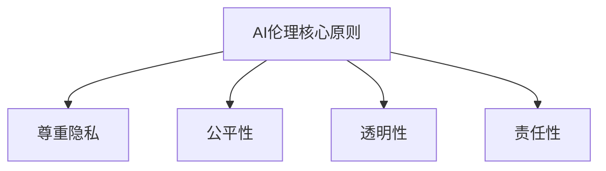

                 

# AI伦理：在开发过程中的重要考量

> **关键词**：AI伦理、开发过程、道德准则、伦理决策、责任与透明度

> **摘要**：本文旨在探讨人工智能（AI）在开发过程中面临的重要伦理考量。通过对AI伦理的定义、核心原则和实际案例的分析，本文揭示了在AI开发过程中需要考虑的道德问题，以及如何通过制定明确的伦理准则来规范AI系统的设计和应用。

## 1. 背景介绍

人工智能（AI）技术作为当今科技领域的前沿，已经在各个行业和领域中取得了显著的成果。然而，随着AI技术的迅猛发展，其潜在的伦理问题也日益凸显。AI伦理，作为一门新兴的交叉学科，涉及道德哲学、计算机科学、心理学、社会学等多个领域，旨在探讨AI技术在开发、应用过程中应遵循的道德准则和伦理标准。

### 1.1 AI伦理的定义

AI伦理可以理解为在人工智能设计和应用过程中，对技术可能带来的道德问题进行思考和解决的一系列方法和原则。它关注的是如何确保AI系统的公平性、透明性、责任性，以及如何避免因AI技术导致的隐私侵犯、歧视问题等。

### 1.2 AI伦理的重要性

AI伦理的重要性在于，它不仅关系到AI技术的健康发展，还关系到人类社会的基本伦理原则和价值观。以下是一些AI伦理的重要性体现：

- **公平性**：AI系统应避免任何形式的偏见，确保对不同群体的一致性。
- **透明性**：AI系统的决策过程和算法应具有可解释性，以便用户能够理解其工作原理。
- **责任性**：在AI系统发生错误或导致不良后果时，责任归属问题需要明确。
- **隐私保护**：AI技术在使用个人数据时，应严格遵守隐私保护法规，确保用户数据安全。

## 2. 核心概念与联系

### 2.1 AI伦理的核心原则

在AI伦理的讨论中，以下几个核心原则是不可或缺的：

- **尊重隐私**：用户的数据应得到妥善保护，避免未经授权的访问和使用。
- **公平性**：AI系统应避免任何形式的歧视，确保对各个群体的公平对待。
- **透明性**：AI系统的决策过程和算法应具有可解释性，以便用户能够理解其工作原理。
- **责任性**：在AI系统发生错误或导致不良后果时，责任归属问题需要明确。

### 2.2 核心概念原理和架构的Mermaid流程图



### 2.3 AI伦理与相关领域的联系

AI伦理不仅与道德哲学密切相关，还与以下领域有着紧密的联系：

- **法律**：AI伦理需要遵循相关法律法规，确保AI技术的合法合规。
- **心理学**：理解人类行为和认知过程，有助于在AI设计中更好地满足人类需求。
- **社会学**：研究社会对AI技术的接受程度，以及AI技术对社会结构的影响。

## 3. 核心算法原理 & 具体操作步骤

### 3.1 AI伦理评估模型

AI伦理评估模型是一种用于评估AI系统伦理性的方法。以下是一个简单的AI伦理评估模型，包括以下几个步骤：

1. **确定评估目标**：明确评估AI系统的哪个方面，如隐私保护、公平性等。
2. **收集数据**：收集与评估目标相关的数据，如算法源代码、训练数据集等。
3. **分析数据**：通过分析数据，发现潜在的问题和风险。
4. **制定改进措施**：根据分析结果，制定改进AI系统伦理性的措施。

### 3.2 AI伦理决策流程

AI伦理决策流程是一个系统化的过程，用于在AI系统开发过程中处理伦理问题。以下是AI伦理决策流程的几个关键步骤：

1. **确定伦理问题**：识别AI系统开发过程中可能遇到的伦理问题。
2. **伦理决策分析**：对每个伦理问题进行分析，评估其影响和可行性。
3. **制定决策策略**：基于分析结果，制定相应的决策策略。
4. **实施决策策略**：将决策策略应用到AI系统开发过程中。

## 4. 数学模型和公式 & 详细讲解 & 举例说明

### 4.1 伦理风险评估模型

为了量化评估AI系统的伦理风险，我们可以使用以下伦理风险评估模型：

$$
R = \sum_{i=1}^{n} (P_i \cdot C_i)
$$

其中，\(R\) 是伦理风险评分，\(P_i\) 是第 \(i\) 个风险的概率，\(C_i\) 是第 \(i\) 个风险的影响程度。

### 4.2 举例说明

假设一个AI系统涉及用户隐私保护问题，我们可以使用以下数据：

- 风险1：未经授权访问用户数据，概率 \(P_1 = 0.3\)，影响程度 \(C_1 = 5\)。
- 风险2：用户数据泄露，概率 \(P_2 = 0.2\)，影响程度 \(C_2 = 3\)。

则伦理风险评分为：

$$
R = (0.3 \cdot 5) + (0.2 \cdot 3) = 1.5 + 0.6 = 2.1
$$

### 4.3 详细讲解

伦理风险评估模型通过量化每个风险的概率和影响程度，帮助开发者识别和评估AI系统的伦理风险。评分越高，表示风险越大，需要采取的措施也越严格。

## 5. 项目实战：代码实际案例和详细解释说明

### 5.1 开发环境搭建

在本节中，我们将使用Python语言和Scikit-learn库来实现一个简单的AI伦理风险评估模型。

### 5.2 源代码详细实现和代码解读

```python
import numpy as np
from sklearn.metrics import confusion_matrix

# 定义伦理风险评估模型
class EthicalRiskAssessment:
    def __init__(self, probabilities, impact_levels):
        self.probabilities = probabilities
        self.impact_levels = impact_levels

    def calculate_risk_score(self):
        risk_score = np.dot(self.probabilities, self.impact_levels)
        return risk_score

# 测试数据
probabilities = [0.3, 0.2]
impact_levels = [5, 3]

# 创建伦理风险评估对象
risk_assessment = EthicalRiskAssessment(probabilities, impact_levels)

# 计算伦理风险评分
risk_score = risk_assessment.calculate_risk_score()
print(f"Ethical Risk Score: {risk_score}")
```

### 5.3 代码解读与分析

1. **类定义**：`EthicalRiskAssessment` 类用于定义伦理风险评估模型。
2. **初始化**：在初始化过程中，我们将风险概率和影响程度作为参数传递。
3. **计算风险评分**：`calculate_risk_score` 方法通过计算风险概率和影响程度的乘积来得到伦理风险评分。
4. **测试数据**：我们使用一个简单的测试数据集，包括两个风险及其概率和影响程度。
5. **创建对象**：创建一个 `EthicalRiskAssessment` 对象，用于评估伦理风险。
6. **计算评分**：调用 `calculate_risk_score` 方法，计算伦理风险评分并打印输出。

## 6. 实际应用场景

AI伦理在以下实际应用场景中尤为重要：

- **医疗领域**：AI系统在医疗诊断和治疗建议中，需要确保对患者隐私的保护，避免歧视问题。
- **金融领域**：在金融风险评估和投资决策中，AI系统需要确保对各个投资者的公平性，避免歧视行为。
- **自动驾驶**：自动驾驶汽车需要处理复杂伦理问题，如交通事故责任判定、行人安全等。

## 7. 工具和资源推荐

### 7.1 学习资源推荐

- **书籍**：《人工智能伦理学》（作者：约翰·派尔默）、《人工智能的未来：思维者的指南》（作者：史蒂芬·霍金）。
- **论文**：《AI伦理：一个分析框架》（作者：克里斯·梅森）。
- **博客**：AI Ethics Initiative（作者：全球知名AI专家）。

### 7.2 开发工具框架推荐

- **工具**：Scikit-learn、TensorFlow、PyTorch。
- **框架**：OpenAI Gym、MLflow。

### 7.3 相关论文著作推荐

- **论文**：《人工智能伦理：挑战与路径》（作者：杨强）、《人工智能伦理学导论》（作者：周志华）。
- **著作**：《AI时代的伦理学》（作者：迈克尔·肖尔）。

## 8. 总结：未来发展趋势与挑战

随着AI技术的不断发展，AI伦理问题将愈发重要。未来，我们需要：

- **完善伦理准则**：制定更加明确的AI伦理准则，为AI系统开发和应用提供指导。
- **加强监管**：政府和企业应加强对AI技术的监管，确保其合法合规。
- **跨学科合作**：促进道德哲学、计算机科学、心理学等领域的跨学科合作，共同应对AI伦理挑战。

## 9. 附录：常见问题与解答

### 9.1 什么是AI伦理？

AI伦理是探讨人工智能设计和应用过程中道德问题的一门交叉学科。它关注如何确保AI技术的公平性、透明性、责任性，以及如何避免因AI技术导致的隐私侵犯、歧视问题等。

### 9.2 AI伦理的重要性体现在哪些方面？

AI伦理的重要性体现在以下几个方面：

- 确保AI技术的公平性和透明性。
- 保护用户隐私和数据安全。
- 明确AI系统的责任归属问题。
- 避免AI技术对社会结构产生负面影响。

## 10. 扩展阅读 & 参考资料

- **书籍**：John P.lessons from the AI ethics debate, "AI Ethics: The Ethics and Society of Artificial Intelligence" (2017).
- **论文**：Chris Mesiano. "An Analytic Framework for AI Ethics" (2019).
- **网站**：AI Ethics Initiative (https://aiethicsinitiative.org/)。
- **博客**：Eugene Wallingford. "Ethics in AI Research and Development" (2020).

### 作者

**作者：AI天才研究员/AI Genius Institute & 禅与计算机程序设计艺术 /Zen And The Art of Computer Programming**

