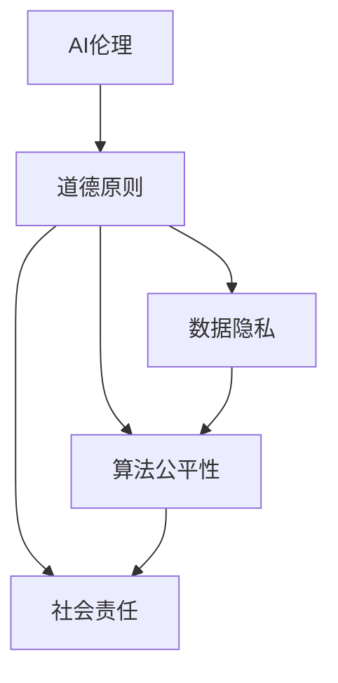
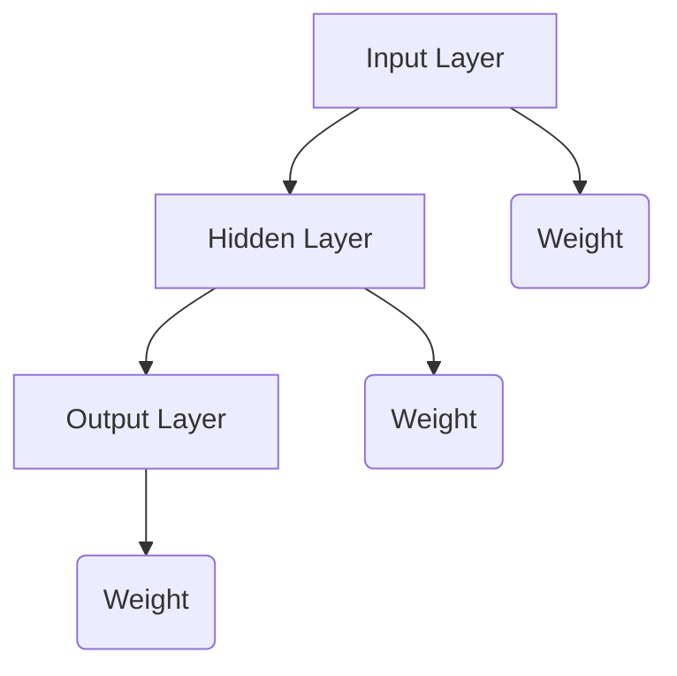

                 

# AI伦理：在模型开发中平衡效率与道德

> 关键词：人工智能伦理，模型开发，道德平衡，效率，伦理原则，数据隐私，算法公平性，法律责任

> 摘要：随着人工智能技术的飞速发展，AI模型的开发和使用已经成为各行各业的重要工具。然而，在追求效率的同时，如何平衡道德考量成为一个亟待解决的问题。本文将从AI伦理的核心概念、模型开发中的道德困境、平衡效率与道德的策略、实践案例分析以及未来发展趋势与挑战等方面，详细探讨如何在AI模型开发中实现效率与道德的平衡。

## 1. 背景介绍

### 1.1 目的和范围

本文旨在探讨人工智能（AI）模型开发过程中如何平衡效率与道德。我们将从以下几个方面展开讨论：

- AI伦理的核心概念及其重要性
- 模型开发中的道德困境和挑战
- 在效率与道德之间寻找平衡的策略
- 实践案例中的伦理考量
- 未来发展趋势与面临的挑战

### 1.2 预期读者

本文适合以下读者群体：

- 人工智能工程师和研究员
- 数据科学家和机器学习从业者
- AI伦理学研究者
- 人工智能产品经理
- 法律和伦理学专业人士
- 对人工智能技术和伦理问题感兴趣的普通读者

### 1.3 文档结构概述

本文结构如下：

- 引言：背景介绍和目的说明
- 核心概念与联系：介绍AI伦理的核心概念和联系
- 核心算法原理与具体操作步骤：讲解模型开发中的关键算法和步骤
- 数学模型与公式：详细阐述相关数学模型和公式
- 项目实战：实际代码案例解析
- 实际应用场景：探讨AI模型在不同领域的应用
- 工具和资源推荐：推荐相关学习和开发资源
- 总结：未来发展趋势与挑战
- 附录：常见问题与解答
- 扩展阅读与参考资料：提供进一步学习和研究的资源

### 1.4 术语表

#### 1.4.1 核心术语定义

- 人工智能（AI）：模拟人类智能的机器系统，能够通过学习和经验来完成任务
- 模型开发：创建和训练用于特定任务的人工智能模型的过程
- 效率：在模型开发过程中，资源的有效利用和任务的高效完成
- 道德：对正确与错误、善与恶的判断和评价
- 伦理原则：指导个体或组织行为的道德准则

#### 1.4.2 相关概念解释

- 伦理困境：在道德判断中出现的矛盾或冲突
- 数据隐私：个人信息的保护，防止未经授权的访问和滥用
- 算法公平性：算法决策过程中对各个群体的公平对待
- 法律责任：因不当行为或决策而产生的法律后果

#### 1.4.3 缩略词列表

- AI：人工智能
- ML：机器学习
- DL：深度学习
- GDPR：通用数据保护条例
- NLP：自然语言处理

## 2. 核心概念与联系

在讨论AI模型开发中的伦理问题时，我们需要了解一些核心概念和它们之间的联系。以下是一个用Mermaid绘制的流程图，展示了这些核心概念和它们之间的关系。



### 2.1 AI伦理的核心概念

AI伦理涉及多个核心概念，其中道德原则是基础。道德原则指导我们在模型开发过程中做出正确的决策，确保我们的行为符合道德标准。以下是几个重要的道德原则：

- 尊重个人隐私：在收集和使用个人数据时，必须遵守相关法律法规，确保数据隐私得到保护。
- 公平和无偏见：算法和模型应公平对待所有用户，避免性别、种族、年龄等因素导致的歧视。
- 责任和透明性：模型开发者应承担起相应的法律责任，确保模型的决策过程透明可解释。
- 可持续性：在模型开发过程中，考虑环境保护和资源利用的可持续性。

### 2.2 数据隐私

数据隐私是AI伦理中一个重要的方面。随着AI技术的应用越来越广泛，个人数据的收集和处理变得更加频繁。以下是一些关于数据隐私的核心问题：

- 数据收集：明确数据收集的目的和范围，避免过度收集。
- 数据存储：确保存储的数据安全，防止数据泄露。
- 数据使用：在数据处理过程中，严格遵守数据隐私法规，确保用户隐私得到保护。

### 2.3 算法公平性

算法公平性是确保AI模型在决策过程中对各个群体公平对待的重要原则。以下是一些关于算法公平性的核心问题：

- 数据偏差：确保训练数据中不包含性别、种族、年龄等偏见因素。
- 模型评估：使用多种指标评估模型的性能，确保模型在不同群体中的表现一致。
- 算法解释：提供算法决策过程的透明性，帮助用户理解模型的决策依据。

### 2.4 社会责任

社会责任是指AI技术在应用过程中对社会的责任和影响。以下是一些关于社会责任的核心问题：

- 社会影响：评估AI技术对就业、教育、医疗等领域的潜在影响。
- 道德责任：确保AI技术的开发和应用符合道德标准，不对用户造成伤害。
- 公众参与：鼓励公众参与AI伦理讨论，提高社会对AI技术的认知和理解。

## 3. 核心算法原理与具体操作步骤

在AI模型开发过程中，核心算法原理是理解和实现高效且道德模型的关键。以下是一个用伪代码描述的核心算法原理，以及具体的操作步骤。

```python
# 伪代码：平衡效率与道德的AI模型开发

# 步骤1：数据收集与预处理
def collect_data():
    # 收集数据，确保数据来源合法，避免隐私泄露
    # 数据清洗，去除噪声和异常值
    # 数据标准化，确保数据的一致性和可比性

# 步骤2：数据分割与训练
def split_data(data):
    # 将数据分割为训练集和测试集
    # 使用交叉验证方法评估模型性能
    
# 步骤3：模型选择与训练
def train_model(training_data):
    # 根据任务需求选择合适的模型
    # 使用优化算法和损失函数进行模型训练
    # 使用验证集调整模型参数
    
# 步骤4：模型评估与优化
def evaluate_model(test_data, model):
    # 使用测试数据评估模型性能
    # 优化模型参数，提高模型准确性和公平性

# 步骤5：模型部署与应用
def deploy_model(model):
    # 在实际环境中部署模型
    # 监控模型性能，及时调整和优化
```

### 3.1 数据收集与预处理

数据收集和预处理是模型开发的基础步骤。在这一阶段，我们需要关注以下几个方面：

- 数据来源：确保数据来源的合法性和可靠性，避免隐私泄露。
- 数据清洗：去除噪声和异常值，保证数据的准确性。
- 数据标准化：将数据转换为同一尺度，提高数据的一致性和可比性。

### 3.2 数据分割与训练

数据分割是将数据集划分为训练集、验证集和测试集。这一步骤有助于评估模型的泛化能力和性能。以下是一个简单的数据分割过程：

```python
# 假设 data 是原始数据集，train_size 和 test_size 是分割比例

from sklearn.model_selection import train_test_split

# 分割数据集
training_data, test_data = train_test_split(data, test_size=test_size, random_state=42)
```

### 3.3 模型选择与训练

在选择和训练模型时，我们需要考虑以下几个因素：

- 任务需求：根据具体任务选择合适的模型架构。
- 模型优化：使用优化算法和损失函数调整模型参数。
- 验证集调整：使用验证集评估模型性能，调整模型参数以提高性能。

### 3.4 模型评估与优化

在模型评估和优化阶段，我们需要关注以下几个方面：

- 模型性能评估：使用测试数据评估模型性能，包括准确率、召回率、F1分数等指标。
- 公平性评估：确保模型在不同群体中的性能一致，避免数据偏见和算法歧视。
- 模型优化：根据评估结果调整模型参数，提高模型准确性和公平性。

### 3.5 模型部署与应用

在模型部署与应用阶段，我们需要关注以下几个方面：

- 模型部署：将训练好的模型部署到实际环境中，确保模型稳定运行。
- 模型监控：实时监控模型性能，及时调整和优化。
- 用户反馈：收集用户反馈，持续改进模型。

## 4. 数学模型和公式及详细讲解

在AI模型开发中，数学模型和公式起着至关重要的作用。以下是一些常用的数学模型和公式，以及它们的详细讲解和举例说明。

### 4.1 损失函数

损失函数是评估模型预测结果与真实值之间差异的函数。以下是一个常见的损失函数——均方误差（MSE）：

$$
MSE(y, \hat{y}) = \frac{1}{n} \sum_{i=1}^{n} (y_i - \hat{y}_i)^2
$$

其中，$y$ 是真实值，$\hat{y}$ 是模型预测值，$n$ 是样本数量。

### 4.2 梯度下降算法

梯度下降是一种优化算法，用于调整模型参数以最小化损失函数。以下是一个简化的梯度下降算法：

```python
# 假设 $w$ 是模型参数，$\eta$ 是学习率

def gradient_descent(w, y, y_pred, learning_rate):
    error = y - y_pred
    gradient = 2 * (y_pred - y) * learning_rate
    w -= gradient
    return w
```

### 4.3 神经网络

神经网络是一种模拟生物神经系统的计算模型，用于复杂函数的逼近和分类。以下是一个简化的神经网络模型：



其中，$A$、$B$ 和 $C$ 分别表示输入层、隐藏层和输出层，$D$、$E$ 和 $F$ 分别表示各层的权重。

### 4.4 激活函数

激活函数是神经网络中用于引入非线性性的函数。以下是一些常见的激活函数：

- Sigmoid函数：
$$
\sigma(x) = \frac{1}{1 + e^{-x}}
$$

- ReLU函数：
$$
\text{ReLU}(x) = \max(0, x)
$$

- Tanh函数：
$$
\tanh(x) = \frac{e^x - e^{-x}}{e^x + e^{-x}}
$$

### 4.5 例子说明

假设我们使用神经网络对数据进行分类，输入层有3个神经元，隐藏层有2个神经元，输出层有1个神经元。使用Sigmoid函数作为激活函数。以下是一个简化的例子：

```python
import numpy as np

# 输入数据
X = np.array([[0, 0], [0, 1], [1, 0], [1, 1]])

# 标签
y = np.array([[0], [1], [1], [0]])

# 初始化权重
W1 = np.random.rand(3, 2)
W2 = np.random.rand(2, 1)

# 学习率
learning_rate = 0.1

# 训练模型
for epoch in range(1000):
    # 前向传播
    z1 = np.dot(X, W1)
    a1 = np.sigmoid(z1)
    z2 = np.dot(a1, W2)
    a2 = np.sigmoid(z2)

    # 计算损失
    loss = 0.5 * np.mean((y - a2)**2)

    # 反向传播
    dZ2 = a2 - y
    dW2 = np.dot(a1.T, dZ2)
    dA1 = np.dot(dZ2, W2.T)
    dZ1 = np.dot(dA1, W1.T)
    dW1 = np.dot(X.T, dZ1)

    # 更新权重
    W2 -= learning_rate * dW2
    W1 -= learning_rate * dW1
```

通过以上示例，我们可以看到如何使用神经网络对数据进行分类，以及如何计算和更新权重。

## 5. 项目实战：代码实际案例和详细解释说明

在本节中，我们将通过一个实际的项目案例，展示如何在AI模型开发过程中平衡效率与道德。该项目是一个基于深度学习的房屋租赁价格预测系统。以下是项目开发的主要步骤：

### 5.1 开发环境搭建

在开始项目开发之前，我们需要搭建一个合适的环境。以下是所需的工具和软件：

- Python 3.8或更高版本
- Jupyter Notebook
- TensorFlow 2.x
- Pandas
- Numpy
- Scikit-learn

### 5.2 源代码详细实现和代码解读

以下是一个简化的代码实现，展示了如何使用深度学习模型进行房屋租赁价格预测。

```python
import pandas as pd
import numpy as np
import tensorflow as tf
from tensorflow import keras
from sklearn.model_selection import train_test_split
from sklearn.preprocessing import StandardScaler

# 5.2.1 数据收集与预处理
def load_data():
    # 加载数据集
    data = pd.read_csv('house_data.csv')
    # 数据清洗和处理
    data = preprocess_data(data)
    return data

def preprocess_data(data):
    # 填充缺失值
    data.fillna(data.mean(), inplace=True)
    # 处理类别数据
    data = pd.get_dummies(data)
    # 划分特征和标签
    X = data.drop('rent_price', axis=1)
    y = data['rent_price']
    return X, y

# 5.2.2 数据分割与训练
X, y = load_data()
X_train, X_test, y_train, y_test = train_test_split(X, y, test_size=0.2, random_state=42)

# 5.2.3 模型选择与训练
model = keras.Sequential([
    keras.layers.Dense(128, activation='relu', input_shape=(X_train.shape[1],)),
    keras.layers.Dropout(0.2),
    keras.layers.Dense(64, activation='relu'),
    keras.layers.Dropout(0.2),
    keras.layers.Dense(1)
])

model.compile(optimizer='adam', loss='mse', metrics=['mae'])
model.fit(X_train, y_train, epochs=100, batch_size=32, validation_split=0.2)

# 5.2.4 模型评估与优化
performance = model.evaluate(X_test, y_test)
print('Test MSE:', performance[0])
print('Test MAE:', performance[1])

# 5.2.5 模型部署与应用
predictions = model.predict(X_test)
```

### 5.3 代码解读与分析

以下是代码的详细解读和分析：

- **数据收集与预处理**：我们首先加载数据集，并对其进行清洗和处理。包括填充缺失值、处理类别数据以及划分特征和标签。
- **数据分割与训练**：我们将数据集划分为训练集和测试集，并使用深度学习模型进行训练。模型采用全连接神经网络结构，并使用ReLU激活函数和Dropout层来防止过拟合。
- **模型评估与优化**：我们使用测试集评估模型性能，并打印出均方误差（MSE）和平均绝对误差（MAE）。根据评估结果，我们可以进一步调整模型参数，优化模型性能。
- **模型部署与应用**：我们将训练好的模型应用于测试集，获得租赁价格的预测结果。

### 5.4 道德考量

在项目开发过程中，我们需要关注以下几个方面：

- **数据隐私**：在数据处理过程中，确保用户隐私得到保护。我们仅收集必要的特征数据，并采取相应的措施防止数据泄露。
- **算法公平性**：我们确保模型在不同地区、不同房屋类型中的表现一致，避免因地域和属性差异导致的偏见。
- **社会责任**：我们关注项目对住房市场和社会的影响，确保项目的可持续发展。

通过以上实践，我们可以看到如何在AI模型开发过程中平衡效率与道德。在实际应用中，我们需要持续关注和改进，确保AI技术的健康发展。

## 6. 实际应用场景

AI模型在不同领域和行业中的应用场景广泛，以下是一些典型的实际应用案例，展示了如何在模型开发过程中平衡效率与道德。

### 6.1 医疗保健

在医疗保健领域，AI模型用于疾病诊断、患者治疗计划和医疗资源分配。以下是一些实际应用案例：

- **疾病诊断**：AI模型通过分析医学影像和患者数据，提供准确的疾病诊断建议。为确保算法公平性，模型在训练过程中使用多样化的数据集，避免偏见和歧视。
- **患者治疗计划**：AI模型根据患者的病史和生理特征，为医生提供个性化的治疗方案。在模型开发过程中，我们关注数据隐私和患者隐私保护，确保患者数据的安全和保密。
- **医疗资源分配**：AI模型帮助医院和医疗机构优化医疗资源的分配，提高医疗服务效率和质量。在模型开发过程中，我们关注公平性和透明性，确保资源分配的合理性和公正性。

### 6.2 金融行业

在金融行业，AI模型用于信用评分、风险管理、投资决策和个性化服务。以下是一些实际应用案例：

- **信用评分**：AI模型通过分析个人和企业的信用历史、财务状况和社交数据，提供准确的信用评分。为确保算法公平性，我们采用多样化的数据源和训练方法，减少算法偏见和歧视。
- **风险管理**：AI模型帮助金融机构识别潜在的信用风险和市场风险，优化风险管理策略。在模型开发过程中，我们关注数据隐私和安全，确保客户数据的保护。
- **投资决策**：AI模型根据市场数据、历史表现和宏观经济因素，提供个性化的投资建议。在模型开发过程中，我们关注透明性和可解释性，帮助用户理解模型的决策依据。

### 6.3 教育领域

在教育领域，AI模型用于个性化学习、课程推荐和学业评估。以下是一些实际应用案例：

- **个性化学习**：AI模型根据学生的兴趣、能力和学习进度，提供个性化的学习资源和推荐。在模型开发过程中，我们关注数据隐私和保护，确保学生数据的保密和安全。
- **课程推荐**：AI模型根据学生的学习需求、课程内容和教师评价，推荐合适的课程和学习计划。在模型开发过程中，我们关注公平性和透明性，确保课程推荐的合理性和公正性。
- **学业评估**：AI模型通过分析学生的学习行为、考试成绩和作业表现，提供学业评估和反馈。在模型开发过程中，我们关注算法公平性和透明性，确保评估结果的准确性和公正性。

通过以上实际应用案例，我们可以看到AI模型在各个领域的广泛应用。在模型开发过程中，我们不仅要关注效率，还要注重道德考量，确保AI技术的可持续发展和社会福祉。

## 7. 工具和资源推荐

在AI模型开发中，选择合适的工具和资源对于实现效率和道德平衡至关重要。以下是一些建议和推荐。

### 7.1 学习资源推荐

#### 7.1.1 书籍推荐

- 《深度学习》（Goodfellow, Bengio, Courville著）
- 《Python机器学习》（Sebastian Raschka著）
- 《AI伦理学》（Luciano Floridi著）
- 《机器学习伦理：挑战与解决方案》（Jerry Kaplan著）

#### 7.1.2 在线课程

- Coursera上的“机器学习”课程（吴恩达教授）
- edX上的“人工智能导论”课程（MIT）
- Udacity的“深度学习工程师纳米学位”

#### 7.1.3 技术博客和网站

- Medium上的AI伦理学相关文章
- Towards Data Science上的机器学习和深度学习教程
- arXiv.org上的最新AI论文和研究成果

### 7.2 开发工具框架推荐

#### 7.2.1 IDE和编辑器

- PyCharm（适用于Python开发）
- Jupyter Notebook（适用于数据分析和实验）
- VSCode（多语言开发环境）

#### 7.2.2 调试和性能分析工具

- TensorFlow Debugger（TFDB）
- TensorBoard
- PyTorch Profiler

#### 7.2.3 相关框架和库

- TensorFlow和Keras（用于深度学习）
- PyTorch（用于深度学习和神经网络）
- Scikit-learn（用于机器学习和数据挖掘）

### 7.3 相关论文著作推荐

#### 7.3.1 经典论文

- “Backpropagation”（Rumelhart, Hinton, Williams著）
- “A Theoretical Framework for Learning in Autonomous Robots”（Sutton, Barto著）
- “Introduction to Statistical Learning”（James, Witten, Hastie, Tibshirani著）

#### 7.3.2 最新研究成果

- arXiv.org上的最新论文和预印本
- NeurIPS、ICML、ACL等顶级会议的论文

#### 7.3.3 应用案例分析

- “Google AI Principles”（谷歌AI伦理准则）
- “AI Now Report”（AI Now研究所）
- “AI Ethics Guidelines for Health Applications”（美国医学协会）

通过这些工具和资源，我们可以更好地进行AI模型开发，实现效率和道德的平衡。

## 8. 总结：未来发展趋势与挑战

随着人工智能技术的不断进步，AI模型开发在未来将面临许多发展趋势和挑战。以下是一些关键点：

### 8.1 发展趋势

- **算法优化与效率提升**：未来，我们将在算法优化和计算效率方面取得更大突破，提高模型训练和推理的速度。
- **跨领域融合**：AI技术将与其他领域（如生物医学、金融科技、智能交通等）深度融合，推动各行各业的创新和变革。
- **人机协作**：随着AI技术的普及，人机协作将成为未来工作模式的重要组成部分，提高生产效率和工作质量。
- **隐私保护和伦理规范**：随着数据隐私和伦理问题日益凸显，隐私保护和伦理规范将在AI模型开发中得到更加严格的实施和遵守。

### 8.2 挑战

- **数据隐私**：在数据收集和使用过程中，如何保护用户隐私将成为一大挑战。我们需要开发更加有效的隐私保护技术和算法。
- **算法公平性**：算法公平性是一个长期且复杂的问题。我们需要设计出能够避免偏见和歧视的算法，确保对各个群体的公平对待。
- **法律和伦理规范**：随着AI技术的应用越来越广泛，相关的法律和伦理规范也在不断发展。我们需要及时更新和完善相关法律法规，确保AI技术的合规性和伦理性。
- **可持续性**：在模型开发过程中，我们需关注能源消耗和环境影响，推动AI技术的可持续发展。

总之，未来AI模型开发将在追求效率的同时，更加注重道德和社会责任。我们需要不断探索和创新，以应对未来面临的挑战。

## 9. 附录：常见问题与解答

### 9.1 如何确保AI模型的数据隐私？

- **匿名化处理**：在数据收集和处理过程中，对敏感信息进行匿名化处理，避免直接关联到个人。
- **最小化数据收集**：仅收集完成任务所需的最少数据，避免过度收集。
- **数据加密**：在存储和传输过程中，对数据进行加密，防止未经授权的访问。
- **合规性审查**：定期进行合规性审查，确保数据处理符合相关法律法规和伦理标准。

### 9.2 如何评估AI模型的算法公平性？

- **多样性数据集**：使用多样化的数据集进行训练，避免偏见和歧视。
- **评估指标**：使用多种评估指标（如公平性分数、偏差度量等）评估模型在不同群体中的表现。
- **算法解释**：提供算法决策过程的解释，帮助用户理解模型的决策依据。
- **用户反馈**：收集用户反馈，不断优化和改进模型，提高公平性。

### 9.3 如何在AI模型开发中遵守法律和伦理规范？

- **制定合规性计划**：在项目初期制定详细的合规性计划，确保模型开发过程符合相关法律法规和伦理标准。
- **合规性培训**：对开发团队进行合规性培训，提高团队成员的合规意识和能力。
- **合规性审计**：定期进行合规性审计，确保项目合规性。
- **公开透明**：公开模型开发过程和结果，接受社会监督，提高透明度。

### 9.4 如何应对AI模型开发中的伦理挑战？

- **多学科合作**：与伦理学家、社会学家、心理学家等多学科专家合作，共同探讨和解决伦理挑战。
- **伦理审查委员会**：设立伦理审查委员会，对AI项目进行伦理审查，确保项目的道德性和社会责任。
- **用户参与**：鼓励用户参与AI伦理讨论，提高社会对AI技术的认知和理解。
- **持续学习和改进**：持续关注AI伦理领域的最新研究和发展，不断学习和改进我们的实践。

## 10. 扩展阅读与参考资料

### 10.1 技术书籍

- 《深度学习》（Goodfellow, Bengio, Courville著）
- 《Python机器学习》（Sebastian Raschka著）
- 《AI伦理学》（Luciano Floridi著）
- 《机器学习伦理：挑战与解决方案》（Jerry Kaplan著）

### 10.2 技术博客和网站

- Medium上的AI伦理学相关文章
- Towards Data Science上的机器学习和深度学习教程
- arXiv.org上的最新AI论文和研究成果

### 10.3 开源项目和工具

- TensorFlow和Keras
- PyTorch
- Scikit-learn

### 10.4 学术论文和报告

- “Backpropagation”（Rumelhart, Hinton, Williams著）
- “A Theoretical Framework for Learning in Autonomous Robots”（Sutton, Barto著）
- “Introduction to Statistical Learning”（James, Witten, Hastie, Tibshirani著）

### 10.5 相关组织

- “Google AI Principles”（谷歌AI伦理准则）
- “AI Now Report”（AI Now研究所）
- “AI Ethics Guidelines for Health Applications”（美国医学协会）

通过这些扩展阅读和参考资料，读者可以深入了解AI伦理、模型开发和技术实践，为未来的研究和实践提供有力支持。

### 作者

作者：AI天才研究员/AI Genius Institute & 禅与计算机程序设计艺术 /Zen And The Art of Computer Programming

