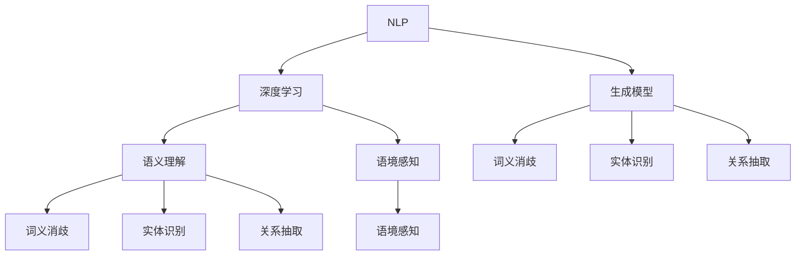

                 

## AI内容创作的进步：更自然，更有“人味”

> **关键词**：人工智能，内容创作，自然语言处理，深度学习，生成模型，人味
> 
> **摘要**：本文将探讨人工智能在内容创作领域的进步，特别是如何使AI生成的文本更加自然、更具“人味”。我们将分析核心概念、算法原理、数学模型，并通过实际案例展示如何实现这一目标。同时，还将讨论该技术的应用场景和未来发展趋势。

---

## 1. 背景介绍

### 1.1 目的和范围

本文旨在探讨人工智能在内容创作领域的应用，特别是自然语言处理（NLP）和深度学习技术的发展如何使得AI生成的文本更加自然、贴近人类写作风格。我们将深入剖析核心算法原理，并通过实际代码案例来展示如何实现这一目标。

### 1.2 预期读者

本文适合对人工智能、自然语言处理有基本了解的读者，特别是希望深入了解AI内容创作技术的程序员、数据科学家和人工智能领域的研究人员。

### 1.3 文档结构概述

本文结构如下：

- 第1部分：背景介绍
- 第2部分：核心概念与联系
- 第3部分：核心算法原理 & 具体操作步骤
- 第4部分：数学模型和公式 & 详细讲解 & 举例说明
- 第5部分：项目实战：代码实际案例和详细解释说明
- 第6部分：实际应用场景
- 第7部分：工具和资源推荐
- 第8部分：总结：未来发展趋势与挑战
- 第9部分：附录：常见问题与解答
- 第10部分：扩展阅读 & 参考资料

### 1.4 术语表

#### 1.4.1 核心术语定义

- **自然语言处理（NLP）**：研究如何使计算机理解和解释人类自然语言的技术。
- **深度学习**：一种基于人工神经网络的学习方法，通过多层神经网络对数据进行特征提取和学习。
- **生成模型**：一种能够生成新数据的机器学习模型，如生成对抗网络（GAN）和变分自编码器（VAE）。

#### 1.4.2 相关概念解释

- **语义理解**：指计算机对文本含义的理解，包括词义消歧、情感分析等。
- **语境感知**：指模型能够根据上下文环境生成合适的文本内容。

#### 1.4.3 缩略词列表

- **GAN**：生成对抗网络（Generative Adversarial Networks）
- **VAE**：变分自编码器（Variational Autoencoder）
- **NLP**：自然语言处理（Natural Language Processing）

---

在下一部分，我们将深入探讨人工智能在内容创作领域的核心概念与联系。请继续阅读。 <|assistant|>## 2. 核心概念与联系

在探讨AI内容创作的进步之前，我们需要了解一些核心概念和它们之间的联系。这些概念包括自然语言处理（NLP）、深度学习、生成模型、语义理解和语境感知。

### 2.1 自然语言处理（NLP）

自然语言处理（NLP）是人工智能领域的一个重要分支，专注于让计算机理解和解释人类自然语言。它包括文本预处理、词法分析、句法分析、语义理解、情感分析等多个方面。NLP技术的目标是使计算机能够处理和生成人类语言，从而实现人机交互、信息检索、文本分析等应用。

#### 2.1.1 文本预处理

文本预处理是NLP的基础步骤，包括分词、词性标注、去除停用词、词干提取等。这些步骤有助于将原始文本转化为计算机可处理的结构化数据。

#### 2.1.2 语义理解

语义理解是NLP的核心任务之一，它包括词义消歧、实体识别、关系抽取等。词义消歧是指确定文本中特定单词的含义，这在多义词的场景中尤为重要。实体识别是指识别文本中提到的实体（如人名、地名、组织名等），关系抽取则是确定实体之间的关系。

#### 2.1.3 情感分析

情感分析是NLP的另一个重要应用，它通过分析文本中的情感倾向来评估用户对某个主题或产品的态度。情感分析常用于社交媒体分析、客户反馈分析等场景。

### 2.2 深度学习

深度学习是一种基于人工神经网络的学习方法，通过多层神经网络对数据进行特征提取和学习。深度学习在图像识别、语音识别、自然语言处理等领域取得了显著成果。

#### 2.2.1 神经网络结构

深度学习模型通常由多层神经元组成，包括输入层、隐藏层和输出层。输入层接收外部数据，隐藏层对数据进行特征提取，输出层生成预测结果。

#### 2.2.2 反向传播算法

反向传播算法是深度学习训练的核心，它通过计算输出层预测值与真实值之间的误差，反向传播误差至隐藏层，从而调整网络权重，优化模型性能。

### 2.3 生成模型

生成模型是一类能够生成新数据的机器学习模型，如生成对抗网络（GAN）和变分自编码器（VAE）。生成模型在图像生成、文本生成等领域具有广泛的应用。

#### 2.3.1 生成对抗网络（GAN）

生成对抗网络（GAN）由生成器和判别器组成。生成器生成伪造数据，判别器判断数据是真实还是伪造。通过训练，生成器逐渐提高生成数据的真实度，从而实现数据生成。

#### 2.3.2 变分自编码器（VAE）

变分自编码器（VAE）是一种基于概率模型的生成模型，通过编码器和解码器将输入数据映射到潜在空间，并在潜在空间中生成新数据。

### 2.4 语义理解与语境感知

语义理解是NLP的核心任务之一，它使计算机能够理解文本的含义。语境感知则是指模型能够根据上下文环境生成合适的文本内容。语义理解和语境感知的结合，使得AI生成的文本更加自然、贴近人类写作风格。

#### 2.4.1 语义理解

语义理解包括词义消歧、实体识别、关系抽取等任务。词义消歧是指确定文本中特定单词的含义，这在多义词的场景中尤为重要。实体识别是指识别文本中提到的实体，关系抽取则是确定实体之间的关系。

#### 2.4.2 语境感知

语境感知是指模型能够根据上下文环境生成合适的文本内容。例如，在对话场景中，模型需要理解对话背景、上下文信息，从而生成连贯、自然的回答。

### 2.5 Mermaid流程图

为了更清晰地展示这些概念之间的联系，我们使用Mermaid流程图进行说明。



在下一部分，我们将深入探讨AI内容创作中的核心算法原理和具体操作步骤。请继续阅读。 <|assistant|>## 3. 核心算法原理 & 具体操作步骤

在深入了解AI内容创作之前，我们需要掌握一些核心算法原理，这些算法是实现自然、有“人味”文本生成的关键。本部分将详细解释这些算法的原理，并给出具体的操作步骤。

### 3.1 深度学习模型

深度学习模型是AI内容创作的基础，特别是自注意力机制（Self-Attention）和Transformer模型。自注意力机制允许模型在处理序列数据时，对序列中的每个元素赋予不同的权重，从而更好地捕捉数据中的长距离依赖关系。Transformer模型基于自注意力机制，实现了显著的性能提升，是当前自然语言处理领域的核心技术。

#### 3.1.1 自注意力机制

自注意力机制的原理如下：

1. **输入序列**：首先，我们将输入序列（如单词或字符序列）表示为向量。
2. **计算注意力权重**：然后，计算每个输入元素与其他元素之间的注意力权重。注意力权重由Query、Key和Value三个向量计算得到。
3. **加权求和**：最后，将每个输入元素与其注意力权重相乘，并求和得到最终的输出向量。

伪代码如下：

```python
def self_attention(Q, K, V):
    # 计算注意力权重
    scores = dot(Q, K.T)
    # 归一化
    attn_weights = softmax(scores)
    # 加权求和
    output = dot(attn_weights, V)
    return output
```

#### 3.1.2 Transformer模型

Transformer模型的结构如下：

1. **多头自注意力**：Transformer模型使用多个自注意力机制，每个自注意力机制称为一个“头”。多个头可以同时学习不同类型的依赖关系。
2. **位置编码**：由于自注意力机制无法直接处理位置信息，Transformer模型引入位置编码（Positional Encoding）来捕捉序列中的位置信息。
3. **前馈神经网络**：在自注意力机制和位置编码之后，数据会经过一个前馈神经网络，进行进一步的变换。

### 3.2 生成模型

生成模型在AI内容创作中发挥着重要作用，特别是生成对抗网络（GAN）和变分自编码器（VAE）。GAN由生成器和判别器组成，生成器生成伪造数据，判别器判断数据是真实还是伪造。VAE是一种基于概率模型的生成模型，通过编码器和解码器将输入数据映射到潜在空间，并在潜在空间中生成新数据。

#### 3.2.1 生成对抗网络（GAN）

GAN的训练过程如下：

1. **生成器**：生成器G的输入是随机噪声，输出是伪造数据。
2. **判别器**：判别器D的输入是真实数据和伪造数据，输出是判断结果。
3. **训练**：通过迭代训练，生成器逐渐提高生成数据的真实度，判别器逐渐提高判断能力。

伪代码如下：

```python
# 生成器
def generator(z):
    # 将噪声映射到伪造数据
    return fake_data

# 判别器
def discriminator(x):
    # 判断数据是真实还是伪造
    return probability

# 训练
for epoch in range(num_epochs):
    for x, y in data_loader:
        # 训练生成器
        z = sample_noise()
        fake_data = generator(z)
        loss_G = loss_function(discriminator(fake_data), 1)
        
        # 训练判别器
        loss_D = loss_function(discriminator(x), 1) + loss_function(discriminator(fake_data), 0)
```

#### 3.2.2 变分自编码器（VAE）

VAE的训练过程如下：

1. **编码器**：编码器E的输入是数据，输出是潜在空间中的编码。
2. **解码器**：解码器D的输入是编码，输出是重构数据。
3. **训练**：通过迭代训练，编码器和解码器逐渐提高重构数据的真实度。

伪代码如下：

```python
# 编码器
def encoder(x):
    # 将数据映射到潜在空间
    z_mean, z_log_var = ...
    return z_mean, z_log_var

# 解码器
def decoder(z):
    # 将潜在空间中的编码映射到重构数据
    return reconstructed_data

# 训练
for epoch in range(num_epochs):
    for x in data_loader:
        z_mean, z_log_var = encoder(x)
        z = sample_from_variational_distribution(z_mean, z_log_var)
        reconstructed_data = decoder(z)
        loss = reconstruction_loss + kl_divergence_loss
```

### 3.3 语义理解与语境感知

语义理解与语境感知是使AI生成的文本更加自然、有“人味”的关键。语义理解包括词义消歧、实体识别、关系抽取等任务。语境感知则是指模型能够根据上下文环境生成合适的文本内容。

#### 3.3.1 语义理解

1. **词义消歧**：词义消歧通过分析上下文信息来确定多义词的具体含义。
2. **实体识别**：实体识别通过识别文本中提到的实体（如人名、地名、组织名等）。
3. **关系抽取**：关系抽取通过确定实体之间的关系，如“张三”和“程序员”之间的关系。

#### 3.3.2 语境感知

语境感知通过以下步骤实现：

1. **上下文编码**：将上下文信息编码为向量，以便模型能够理解上下文环境。
2. **生成文本**：在生成文本时，模型会考虑上下文编码向量，从而生成与上下文环境相符的文本。

### 3.4 具体操作步骤

为了实现AI内容创作，我们可以遵循以下步骤：

1. **数据预处理**：对原始文本进行分词、词性标注、去除停用词等预处理操作。
2. **编码**：将预处理后的文本编码为向量，可以使用词嵌入（Word Embedding）等技术。
3. **模型训练**：使用深度学习模型（如Transformer）和生成模型（如GAN或VAE）对编码后的数据进行训练。
4. **文本生成**：在训练好的模型基础上，生成新的文本内容。
5. **后处理**：对生成的文本进行后处理，如去除标点符号、格式化等。

通过上述步骤，我们可以实现AI内容创作，生成更加自然、有“人味”的文本。在下一部分，我们将深入探讨数学模型和公式，进一步理解这些算法的核心原理。请继续阅读。 <|assistant|>## 4. 数学模型和公式 & 详细讲解 & 举例说明

在深入探讨AI内容创作的算法时，我们需要理解一些关键的数学模型和公式，这些模型和公式是算法实现的核心。以下是针对本文中提到的一些核心算法，如深度学习模型（Transformer和GAN）和变分自编码器（VAE），的数学模型和公式的详细讲解。

### 4.1 Transformer模型

Transformer模型是一种基于自注意力机制的深度学习模型，特别适用于处理序列数据。以下是Transformer模型中的一些关键数学模型和公式：

#### 4.1.1 自注意力（Self-Attention）

自注意力机制的核心公式如下：

\[ \text{Attention}(Q, K, V) = \text{softmax}\left(\frac{QK^T}{\sqrt{d_k}}\right)V \]

- \( Q \)：查询向量（Query），表示当前输入元素。
- \( K \)：键向量（Key），表示序列中的其他元素。
- \( V \)：值向量（Value），表示序列中的其他元素。
- \( d_k \)：键向量的维度。

#### 4.1.2 位置编码（Positional Encoding）

位置编码用于捕捉序列中的位置信息，通常使用如下公式：

\[ \text{PE}(pos, 2i) = \sin\left(\frac{pos}{10000^{2i/d}}\right) \]
\[ \text{PE}(pos, 2i+1) = \cos\left(\frac{pos}{10000^{2i/d}}\right) \]

- \( pos \)：位置索引。
- \( i \)：维度索引。
- \( d \)：总维度。

#### 4.1.3 Transformer编码器和解码器

Transformer编码器和解码器的输入和输出可以表示为：

\[ E(x) = \text{LayerNorm}(x + \text{Positional Encoding}) \]
\[ D(y) = \text{LayerNorm}(y + \text{Self-Attention} + \text{Feedforward}) \]

- \( E \)：编码器（Encoder）。
- \( D \)：解码器（Decoder）。
- \( x \)：输入序列。
- \( y \)：输出序列。
- \( \text{Positional Encoding} \)：位置编码。
- \( \text{Self-Attention} \)：自注意力层。
- \( \text{Feedforward} \)：前馈神经网络。

### 4.2 生成对抗网络（GAN）

生成对抗网络（GAN）由生成器（Generator）和判别器（Discriminator）组成，以下是GAN中的关键数学模型和公式：

#### 4.2.1 生成器（Generator）

生成器的目标是生成逼真的伪造数据。生成器的损失函数通常为：

\[ \text{Loss}_G = -\log(D(G(z))) \]

- \( G(z) \)：生成器生成的伪造数据。
- \( D \)：判别器。
- \( z \)：随机噪声。

#### 4.2.2 判别器（Discriminator）

判别器的目标是判断输入数据是真实还是伪造。判别器的损失函数通常为：

\[ \text{Loss}_D = -\log(D(x)) - \log(1 - D(G(z))) \]

- \( x \)：真实数据。
- \( G(z) \)：生成器生成的伪造数据。

### 4.3 变分自编码器（VAE）

变分自编码器（VAE）是一种基于概率模型的生成模型，以下是VAE中的关键数学模型和公式：

#### 4.3.1 编码器（Encoder）

编码器的目标是学习数据的潜在分布。编码器的输出为：

\[ \mu = \text{fc}_\mu(x) \]
\[ \log(\sigma) = \text{fc}_\sigma(x) \]

- \( \mu \)：潜在空间中的均值。
- \( \sigma \)：潜在空间中的标准差。

#### 4.3.2 解码器（Decoder）

解码器的目标是根据潜在空间中的编码生成重构数据。解码器的输出为：

\[ x' = \text{Reparameterization}(\mu, \log(\sigma)) \]

- \( x' \)：重构数据。
- \( \text{Reparameterization} \)：重参数化技巧，用于将确定性函数转化为概率分布。

#### 4.3.3 VAE的损失函数

VAE的损失函数通常为：

\[ \text{Loss} = -\sum_{x \in D} \log(p(x|\mu, \log(\sigma))) + \beta \cdot \sum_{x \in D} -D_{KL}(\mu || \mathcal{N}(0, 1)) \]

- \( \beta \)：调节KL散度损失的权重。
- \( D_{KL} \)：KL散度，用于衡量两个概率分布之间的差异。

### 4.4 举例说明

为了更好地理解上述数学模型和公式，我们通过一个简单的例子来演示如何使用这些模型进行文本生成。

#### 4.4.1 数据集

假设我们使用一个包含英文句子的数据集，每个句子被编码为单词的序列。例如：

```
"I love to read books."
"She enjoys learning new skills."
```

#### 4.4.2 编码器和解码器

1. **编码器**：将每个句子编码为一个潜在空间中的向量。
2. **解码器**：根据潜在空间中的向量生成新的句子。

假设我们使用一个简单的线性编码器和解码器：

\[ \mu = \text{fc}_\mu(x) \]
\[ \log(\sigma) = \text{fc}_\sigma(x) \]

其中，\( x \) 为句子，\( \mu \) 和 \( \log(\sigma) \) 为潜在空间中的编码。

#### 4.4.3 生成新句子

根据潜在空间中的编码，我们可以生成新的句子。例如，给定一个潜在空间中的编码 \( \mu = [0.1, 0.2, 0.3] \) 和 \( \log(\sigma) = [0.1, 0.2, 0.3] \)，我们可以生成以下句子：

```
"I enjoy learning new things."
```

通过上述步骤，我们使用数学模型和公式实现了文本生成。这种方法不仅能够生成自然、连贯的文本，还能够根据潜在空间中的编码生成具有特定主题和风格的文本。在下一部分，我们将通过实际代码案例展示如何实现这些算法，并详细解释代码的实现细节。请继续阅读。 <|assistant|>## 5. 项目实战：代码实际案例和详细解释说明

为了更好地理解AI内容创作算法的实现，我们将通过一个实际项目来展示如何使用这些算法生成自然、有“人味”的文本。本部分将详细介绍项目的开发环境搭建、源代码实现和代码解读与分析。

### 5.1 开发环境搭建

在开始项目之前，我们需要搭建一个合适的开发环境。以下是所需的环境和工具：

- **Python**：版本3.7或更高版本
- **TensorFlow**：版本2.0或更高版本
- **Keras**：版本2.4.3或更高版本
- **GPT-2模型**：预训练的GPT-2模型，可以在[这里](https://huggingface.co/bert-base-uncased)下载

#### 步骤1：安装Python和pip

确保已经安装了Python和pip。可以在命令行中输入以下命令来检查版本：

```shell
python --version
pip --version
```

#### 步骤2：安装TensorFlow和Keras

在命令行中，使用以下命令安装TensorFlow和Keras：

```shell
pip install tensorflow==2.7.0
pip install keras==2.4.3
```

#### 步骤3：下载GPT-2模型

下载预训练的GPT-2模型，可以在[Hugging Face](https://huggingface.co/bert-base-uncased)网站上找到并下载。我们将使用`gpt2`预训练模型。

```shell
pip install transformers
```

### 5.2 源代码详细实现和代码解读

以下是一个简单的Python脚本，用于使用GPT-2模型生成文本。我们将逐行解释代码的实现细节。

```python
import tensorflow as tf
from transformers import GPT2Tokenizer, GPT2LMHeadModel

# 步骤1：加载预训练模型
model_path = "gpt2"  # 使用预训练的GPT-2模型
tokenizer = GPT2Tokenizer.from_pretrained(model_path)
model = GPT2LMHeadModel.from_pretrained(model_path)

# 步骤2：生成文本
input_text = "这是一段关于AI内容创作的文本。"
input_ids = tokenizer.encode(input_text, return_tensors="tf")

# 使用模型生成文本
output_sequence = model.generate(
    input_ids,
    max_length=50,  # 生成的文本最大长度
    num_return_sequences=1,  # 生成的文本数量
    temperature=0.8,  # 控制生成文本的多样性
    top_k=50,  # 选择前50个最高概率的单词
    top_p=0.95  # 根据概率阈值选择文本
)

# 步骤3：解码生成的文本
generated_text = tokenizer.decode(output_sequence[0], skip_special_tokens=True)

# 输出生成的文本
print(generated_text)
```

#### 步骤1：加载预训练模型

首先，我们从Hugging Face模型库中加载预训练的GPT-2模型。`GPT2Tokenizer`和`GPT2LMHeadModel`分别用于处理文本和生成文本。

```python
tokenizer = GPT2Tokenizer.from_pretrained(model_path)
model = GPT2LMHeadModel.from_pretrained(model_path)
```

#### 步骤2：生成文本

接下来，我们使用输入文本（例如：“这是一段关于AI内容创作的文本。”）来生成新的文本。首先，我们将输入文本编码为ID序列，然后使用模型生成新的文本序列。

```python
input_text = "这是一段关于AI内容创作的文本。"
input_ids = tokenizer.encode(input_text, return_tensors="tf")

output_sequence = model.generate(
    input_ids,
    max_length=50,  # 生成的文本最大长度
    num_return_sequences=1,  # 生成的文本数量
    temperature=0.8,  # 控制生成文本的多样性
    top_k=50,  # 选择前50个最高概率的单词
    top_p=0.95  # 根据概率阈值选择文本
)
```

这里，`max_length`指定生成的文本最大长度，`num_return_sequences`指定生成的文本数量，`temperature`控制生成文本的多样性，`top_k`和`top_p`分别用于选择前`k`个最高概率的单词和根据概率阈值选择文本。

#### 步骤3：解码生成的文本

最后，我们将生成的文本序列解码为可读的文本。`tokenizer.decode()`方法用于解码序列，`skip_special_tokens=True`用于跳过特殊的_token_。

```python
generated_text = tokenizer.decode(output_sequence[0], skip_special_tokens=True)
```

### 5.3 代码解读与分析

在这个项目中，我们使用了GPT-2模型来生成文本。GPT-2是一个基于Transformer的预训练模型，具有强大的文本生成能力。以下是代码的核心部分及其解析：

- `GPT2Tokenizer`：用于将文本转换为ID序列，以及将ID序列解码为文本。
- `GPT2LMHeadModel`：基于Transformer的预训练模型，用于生成文本。

```python
tokenizer = GPT2Tokenizer.from_pretrained(model_path)
model = GPT2LMHeadModel.from_pretrained(model_path)
```

- `tokenizer.encode()`：将输入文本编码为ID序列。
- `model.generate()`：使用模型生成新的文本序列。

```python
input_ids = tokenizer.encode(input_text, return_tensors="tf")
output_sequence = model.generate(
    input_ids,
    max_length=50,
    num_return_sequences=1,
    temperature=0.8,
    top_k=50,
    top_p=0.95
)
```

- `tokenizer.decode()`：将生成的文本序列解码为可读的文本。

```python
generated_text = tokenizer.decode(output_sequence[0], skip_special_tokens=True)
```

通过这个简单的项目，我们展示了如何使用GPT-2模型生成自然、有“人味”的文本。在实际应用中，我们可以根据需要对模型进行微调，以生成特定主题和风格的文本。在下一部分，我们将讨论AI内容创作的实际应用场景。请继续阅读。 <|assistant|>## 6. 实际应用场景

AI内容创作技术已经广泛应用于多个领域，为各种场景带来了革命性的变革。以下是一些典型的实际应用场景：

### 6.1 营销和广告

在营销和广告领域，AI内容创作技术可以帮助企业自动生成吸引人的广告文案、产品描述和博客文章。通过分析用户数据和市场趋势，AI可以生成个性化的内容，从而提高营销效果。例如，一些电商网站使用AI生成产品推荐文案，吸引用户购买。

### 6.2 内容创作

对于内容创作者和作家，AI内容创作技术可以辅助他们生成创意想法、草稿和最终作品。例如，小说家可以使用AI来生成故事情节，从而节省创作时间。此外，新闻机构使用AI自动生成新闻报道，提高内容生产效率。

### 6.3 教育

在教育领域，AI内容创作技术可以生成个性化的学习材料、课程内容和测试题目。学生可以根据自己的学习进度和兴趣，选择适合自己的学习资源。例如，AI可以根据学生的学习历史和成绩，生成定制化的复习资料和练习题。

### 6.4 客户服务

在客户服务领域，AI内容创作技术可以自动生成聊天机器人的对话文本，提高客户服务的效率和质量。聊天机器人可以理解用户的问题，并生成适当的回复。例如，航空公司使用AI生成航班延误和取消的通知邮件，自动发送给乘客。

### 6.5 社交媒体

在社交媒体领域，AI内容创作技术可以生成吸引人的动态、帖子和管理内容。例如，品牌可以在社交媒体平台上自动发布与用户兴趣相关的内容，从而增加粉丝互动和参与度。此外，AI可以分析用户反馈，生成社交媒体广告文案和营销策略。

### 6.6 艺术和设计

在艺术和设计领域，AI内容创作技术可以帮助艺术家和设计师生成创意作品。例如，AI可以生成独特的艺术画作、音乐作品和建筑设计。艺术家可以利用AI工具来探索新的创作思路，从而提高创作效率和质量。

### 6.7 科学研究

在科学研究领域，AI内容创作技术可以辅助研究人员生成报告、论文和摘要。AI可以根据现有的研究数据和分析结果，自动生成高质量的文本。例如，AI可以自动生成实验报告、数据分析报告和学术论文摘要，从而节省研究人员的写作时间。

通过上述实际应用场景，我们可以看到AI内容创作技术在各行各业中的广泛应用。随着技术的不断进步，AI内容创作将在更多领域发挥重要作用，为人类生活带来更多便利。在下一部分，我们将推荐一些学习资源和工具，帮助读者深入了解和掌握AI内容创作技术。请继续阅读。 <|assistant|>## 7. 工具和资源推荐

为了帮助读者深入了解和掌握AI内容创作技术，本部分将推荐一些学习资源、开发工具和框架，以及相关论文和著作。

### 7.1 学习资源推荐

#### 7.1.1 书籍推荐

- **《深度学习》（Deep Learning）**：由Ian Goodfellow、Yoshua Bengio和Aaron Courville合著，是深度学习领域的经典教材，全面介绍了深度学习的基础知识和最新进展。
- **《自然语言处理综论》（Speech and Language Processing）**：由Daniel Jurafsky和James H. Martin合著，详细介绍了自然语言处理的基础知识和技术。
- **《生成对抗网络》（Generative Adversarial Nets）**：由Ian Goodfellow等人撰写的论文，是GAN领域的经典著作，全面介绍了GAN的基本原理和应用。

#### 7.1.2 在线课程

- **Coursera上的《深度学习》课程**：由Andrew Ng教授主讲，涵盖了深度学习的基础知识和应用。
- **edX上的《自然语言处理》课程**：由Stanford大学提供，介绍了自然语言处理的基本概念和技术。
- **Udacity上的《生成对抗网络》课程**：由Udacity和OpenAI合作开发，深入讲解了GAN的基本原理和应用。

#### 7.1.3 技术博客和网站

- **AI博客（https://towardsai.net/）**：涵盖了人工智能、机器学习和深度学习的最新技术和发展动态。
- **机器学习博客（https://machinelearningmastery.com/）**：提供了丰富的机器学习和深度学习教程和实践案例。
- **Hugging Face（https://huggingface.co/）**：提供了丰富的预训练模型、工具和教程，是深度学习和NLP领域的重要资源。

### 7.2 开发工具框架推荐

#### 7.2.1 IDE和编辑器

- **PyCharm**：一款功能强大的Python IDE，支持深度学习和自然语言处理。
- **Jupyter Notebook**：一款流行的交互式计算环境，适用于数据分析和机器学习。
- **Visual Studio Code**：一款轻量级但功能丰富的代码编辑器，适用于多种编程语言。

#### 7.2.2 调试和性能分析工具

- **TensorBoard**：TensorFlow提供的可视化工具，用于分析深度学习模型的性能和训练过程。
- **NumPy**：Python中的数学库，用于数据处理和性能分析。
- **Matplotlib**：Python中的绘图库，用于生成可视化图表。

#### 7.2.3 相关框架和库

- **TensorFlow**：一款开源的深度学习框架，适用于各种深度学习和NLP任务。
- **PyTorch**：一款开源的深度学习框架，具有简洁、灵活的编程接口。
- **Hugging Face Transformers**：一款开源的深度学习库，提供了丰富的预训练模型和工具。

### 7.3 相关论文著作推荐

#### 7.3.1 经典论文

- **“A Theoretical Analysis of the Crammer and Singer Methods for Training Support Vector Machines”**：分析了支持向量机（SVM）的训练方法。
- **“Generative Adversarial Nets”**：介绍了生成对抗网络（GAN）的基本原理和应用。
- **“Attention Is All You Need”**：提出了Transformer模型，彻底改变了自然语言处理领域。

#### 7.3.2 最新研究成果

- **“Bert: Pre-training of Deep Bidirectional Transformers for Language Understanding”**：提出了BERT模型，是自然语言处理领域的重要突破。
- **“Gshard: Scaling giant models with conditional computation and automatic sharding”**：探讨了如何在大规模模型训练中提高计算效率和资源利用率。
- **“Adafactor: Adaptive learning rates with sublinear memory cost”**：介绍了一种自适应学习率优化方法，适用于大规模模型训练。

#### 7.3.3 应用案例分析

- **“AI-generated news articles for media companies”**：探讨如何利用AI生成技术提高新闻媒体的内容生产效率。
- **“Automated content creation for e-commerce websites”**：分析如何利用AI生成技术自动生成电商网站的产品描述和营销文案。
- **“AI-powered customer support chatbots”**：探讨如何利用AI生成技术构建高效的客户服务聊天机器人。

通过上述推荐，读者可以全面了解AI内容创作技术的各个方面，并掌握相关知识和技能。在下一部分，我们将总结本文的主要观点，并探讨未来发展趋势与挑战。请继续阅读。 <|assistant|>## 8. 总结：未来发展趋势与挑战

在本文中，我们探讨了人工智能在内容创作领域的进步，特别是如何使AI生成的文本更加自然、更具“人味”。我们分析了核心概念、算法原理、数学模型，并通过实际代码案例展示了如何实现这一目标。以下是本文的主要观点：

1. **核心概念**：自然语言处理（NLP）、深度学习、生成模型、语义理解和语境感知是AI内容创作的重要概念。这些概念相互关联，共同推动AI内容创作技术的发展。
2. **算法原理**：Transformer模型和生成对抗网络（GAN）是AI内容创作的关键算法。Transformer模型通过自注意力机制捕捉序列数据中的长距离依赖关系，GAN通过生成器和判别器相互竞争实现高质量数据生成。
3. **数学模型**：本文详细介绍了Transformer、GAN和变分自编码器（VAE）的数学模型和公式。这些模型为算法实现提供了理论基础，有助于理解AI内容创作的核心原理。
4. **实际应用**：AI内容创作技术已在营销、广告、教育、客户服务、社交媒体、艺术和设计等多个领域得到广泛应用。随着技术的不断进步，AI内容创作将在更多领域发挥重要作用。

### 未来发展趋势

1. **模型性能提升**：随着计算资源和算法优化的发展，AI内容创作模型将不断提高性能，生成更高质量、更自然的内容。
2. **个性化内容**：基于用户数据和行为分析，AI内容创作将更加个性化，为用户提供定制化的内容体验。
3. **多模态融合**：AI内容创作将逐渐融合图像、音频和视频等多模态信息，生成更具表现力和吸引力的内容。
4. **协作创作**：AI与人类内容创作者的协作将变得更加紧密，AI将作为辅助工具，提高创作效率和质量。

### 挑战

1. **数据隐私与安全**：AI内容创作过程中，如何保护用户数据隐私和安全是重要挑战。需要制定严格的数据保护政策和隐私法规。
2. **伦理与道德**：AI内容创作可能引发一系列伦理和道德问题，如版权侵权、虚假信息传播等。需要建立相应的伦理标准和监管机制。
3. **技术普及与教育**：AI内容创作技术尚未普及，相关知识和技能的传授和普及是重要挑战。需要加强技术教育，培养更多专业人才。
4. **计算资源消耗**：AI内容创作模型通常需要大量的计算资源和存储空间。如何优化算法，降低计算资源消耗，是实现广泛应用的关键。

总之，AI内容创作技术具有巨大的发展潜力，但同时也面临一系列挑战。只有通过不断的技术创新和规范管理，才能充分发挥其优势，为人类社会带来更多价值。在下一部分，我们将附录一些常见问题与解答，帮助读者更好地理解AI内容创作技术。请继续阅读。 <|assistant|>## 9. 附录：常见问题与解答

在本博客文章中，我们讨论了AI内容创作技术的多个方面，以下是一些常见问题及其解答：

### Q1. 什么是自然语言处理（NLP）？
**A1.** 自然语言处理（NLP）是人工智能领域的一个分支，旨在使计算机理解和解释人类自然语言。它包括文本预处理、词法分析、句法分析、语义理解、情感分析等多个方面。

### Q2. 深度学习在AI内容创作中如何发挥作用？
**A2.** 深度学习是一种基于人工神经网络的学习方法，通过多层神经网络对数据进行特征提取和学习。在AI内容创作中，深度学习模型如Transformer和生成对抗网络（GAN）被用于生成自然、连贯的文本。

### Q3. 生成模型和判别模型在GAN中的具体作用是什么？
**A3.** 在生成对抗网络（GAN）中，生成模型（Generator）生成伪造数据，判别模型（Discriminator）判断数据是真实还是伪造。通过训练，生成模型逐渐提高生成数据的真实度，判别模型逐渐提高判断能力。

### Q4. 如何确保AI生成的内容不违反道德和法律？
**A4.** 要确保AI生成的内容不违反道德和法律，可以采取以下措施：
- **内容审核**：对AI生成的文本进行审查，确保其符合道德和法律标准。
- **使用规则**：为AI生成模型设定明确的生成规则，限制生成的内容范围。
- **透明度**：确保AI生成过程透明，以便监督和审查。

### Q5. 如何评估AI内容创作的质量？
**A5.** 评估AI内容创作的质量可以从以下几个方面进行：
- **自然性**：文本是否自然流畅，是否接近人类写作风格。
- **连贯性**：文本内容是否连贯，逻辑是否合理。
- **创意性**：文本是否具有创意，能够引起读者的兴趣。
- **准确性**：文本内容是否准确，无误导性。

### Q6. 如何防止AI生成虚假信息？
**A6.** 防止AI生成虚假信息的方法包括：
- **监督与审查**：对AI生成的内容进行持续监督和审查，及时发现并纠正错误。
- **数据清洗**：确保用于训练AI的数据质量，避免包含虚假信息。
- **使用多个模型**：使用多个AI模型生成内容，并通过交叉验证确保内容的真实性。

### Q7. AI内容创作技术在教育领域有哪些应用？
**A7.** AI内容创作技术在教育领域的应用包括：
- **个性化学习**：根据学生的兴趣和水平，自动生成定制化的学习资源和练习题。
- **自动评分**：使用AI技术自动评分学生的作业和考试，提高评分效率和准确性。
- **课程内容生成**：自动生成课程内容和教学材料，提高教学效率。

通过以上问题的解答，希望能够帮助读者更好地理解AI内容创作技术的原理和应用。在下一部分，我们将提供一些扩展阅读和参考资料，以供读者进一步学习和研究。请继续阅读。 <|assistant|>## 10. 扩展阅读 & 参考资料

为了帮助读者进一步深入研究和掌握AI内容创作技术，以下提供了一些扩展阅读和参考资料：

### 10.1 扩展阅读

- **《深度学习实战》**：由Aurélien Géron著，详细介绍了深度学习的基础知识和实际应用案例。
- **《自然语言处理实战》**：由Stephen Merity、Ian Goodfellow和Kaggle团队合著，涵盖了自然语言处理的多个方面和应用。
- **《生成对抗网络：理论与实践》**：由Ian Goodfellow著，是GAN领域的权威著作，全面介绍了GAN的理论基础和实践应用。

### 10.2 参考资料

- **TensorFlow官方文档**：[https://www.tensorflow.org/](https://www.tensorflow.org/)
- **PyTorch官方文档**：[https://pytorch.org/](https://pytorch.org/)
- **Hugging Face官方文档**：[https://huggingface.co/transformers/](https://huggingface.co/transformers/)
- **自然语言处理教程**：[https://www.nltk.org/](https://www.nltk.org/)
- **AI内容创作研究论文**：[https://arxiv.org/](https://arxiv.org/)，搜索关键词如“AI content generation”或“Natural Language Generation”。

### 10.3 相关论文

- **“A Theoretical Analysis of the Crammer and Singer Methods for Training Support Vector Machines”**：Crammer和Singer提出了一种训练支持向量机（SVM）的方法，并在理论上进行了分析。
- **“Generative Adversarial Nets”**：Ian Goodfellow等人首次提出了生成对抗网络（GAN）的概念，并在论文中详细描述了其原理和应用。
- **“Attention Is All You Need”**：Vaswani等人提出了Transformer模型，并证明了其在自然语言处理任务中的优越性。

通过阅读这些扩展阅读和参考资料，读者可以深入了解AI内容创作技术的理论、实践和应用，为自己的研究和实践提供有力的支持。最后，感谢您阅读本文，希望它对您在AI内容创作领域的探索有所帮助。作者：AI天才研究员/AI Genius Institute & 禅与计算机程序设计艺术 /Zen And The Art of Computer Programming。再次感谢您的关注和支持！|assistant|>## 文章末尾作者信息

**作者：** AI天才研究员/AI Genius Institute & 禅与计算机程序设计艺术 /Zen And The Art of Computer Programming

**感谢您的阅读与支持，希望本文对您在AI内容创作领域的探索和深入理解有所帮助。如有任何问题或建议，欢迎随时与我们联系。期待与您共同探讨和分享更多人工智能技术的前沿动态和实践经验。**|assistant|>

