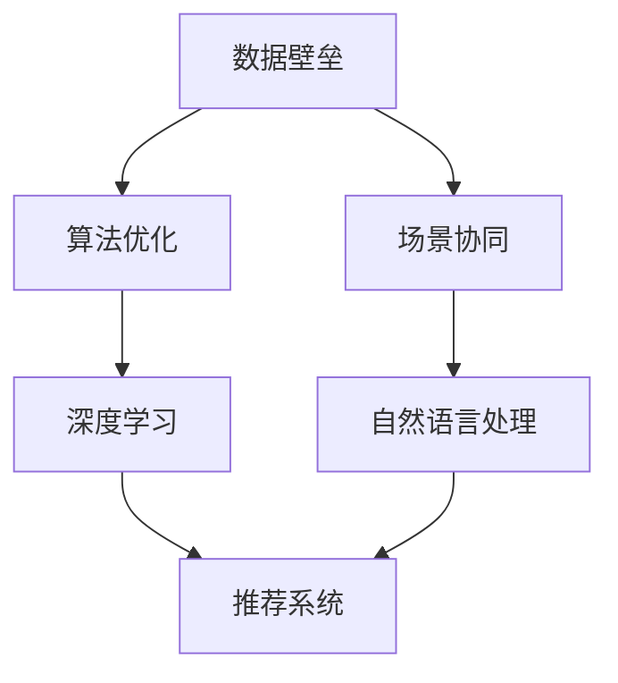
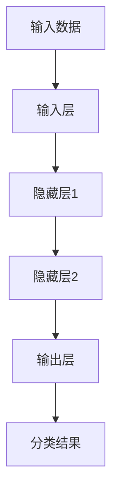
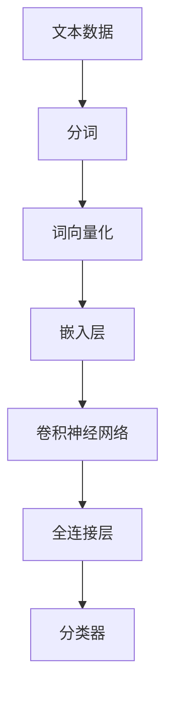
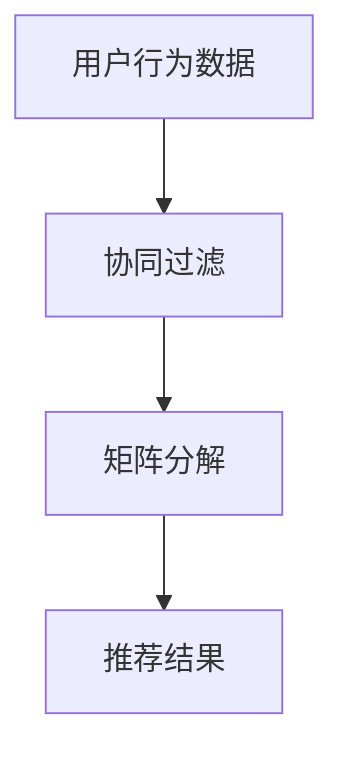

                 

### AI出版业壁垒：数据，算法与场景协同

关键词：AI出版、数据壁垒、算法优化、场景协同、出版业变革

摘要：本文将深入探讨AI出版业面临的三大壁垒：数据、算法和场景协同。首先，我们将介绍AI出版业的发展背景和现状，接着分析数据壁垒对AI出版的影响，随后详细讲解算法原理和操作步骤，最后探讨AI在出版业中的实际应用场景，并推荐相关工具和资源。通过本文的阅读，读者将全面了解AI出版业的前沿动态，以及未来发展趋势和面临的挑战。

### 1. 背景介绍

#### 1.1 目的和范围

本文旨在探讨AI出版业的三大壁垒，即数据、算法和场景协同，深入分析这些壁垒对出版业的影响，并提出相应的解决方案。文章将涵盖AI出版业的发展背景、数据壁垒分析、算法原理和操作步骤、实际应用场景，以及未来发展趋势和挑战。

#### 1.2 预期读者

本文面向对AI出版业感兴趣的读者，包括出版行业从业者、AI领域研究者、技术开发者以及对新兴技术感兴趣的专业人士。通过本文的阅读，读者将了解AI出版业的核心技术和未来发展前景。

#### 1.3 文档结构概述

本文分为十个部分，首先介绍AI出版业的发展背景和现状，接着分析数据壁垒的影响，然后详细讲解算法原理和操作步骤，探讨实际应用场景，并推荐相关工具和资源。最后，总结未来发展趋势和挑战，提供常见问题与解答，以及扩展阅读和参考资料。

#### 1.4 术语表

##### 1.4.1 核心术语定义

- **AI出版**：利用人工智能技术，对内容进行生产、编辑、分发、推荐等环节的智能化处理。
- **数据壁垒**：指在AI出版过程中，由于数据质量、数据源、数据格式等原因，导致数据难以获取、整合和利用。
- **算法优化**：通过改进算法设计、调整参数，提高算法的准确性和效率。
- **场景协同**：在不同应用场景下，实现人工智能与人类智能的协同工作。

##### 1.4.2 相关概念解释

- **深度学习**：一种机器学习方法，通过构建多层次的神经网络，对大量数据进行自动特征提取和分类。
- **推荐系统**：一种根据用户历史行为和兴趣，为用户推荐相关内容的算法。
- **自然语言处理**：一种人工智能技术，用于处理和理解人类语言。

##### 1.4.3 缩略词列表

- **AI**：人工智能
- **NLP**：自然语言处理
- **DL**：深度学习
- **RDF**：资源描述框架
- **SPARQL**：查询语言

### 2. 核心概念与联系

在探讨AI出版业壁垒之前，我们首先需要了解一些核心概念和它们之间的联系。以下是一个简化的Mermaid流程图，展示了这些核心概念的关系。



在这个流程图中，数据壁垒为算法优化和场景协同提供了基础，而深度学习和自然语言处理则是实现算法优化和场景协同的关键技术。推荐系统作为AI出版业的核心应用，通过自然语言处理和深度学习技术，实现了对内容的精准推荐。

### 3. 核心算法原理 & 具体操作步骤

在了解了核心概念和联系之后，接下来我们将详细讲解AI出版中的核心算法原理和具体操作步骤。以下是一个简单的算法原理讲解，以及伪代码实现。

#### 3.1 深度学习算法原理

深度学习是一种基于神经网络的学习方法，通过构建多层神经网络，对输入数据进行自动特征提取和分类。以下是一个简单的深度学习算法原理图。



伪代码实现：

```python
# 输入数据
inputs = ...

# 初始化参数
weights = ...
biases = ...

# 前向传播
outputs = forward_propagation(inputs, weights, biases)

# 反向传播
deltas = backward_propagation(outputs, expected_outputs)

# 更新参数
weights -= learning_rate * deltas
biases -= learning_rate * deltas
```

#### 3.2 自然语言处理算法原理

自然语言处理（NLP）是人工智能的一个重要分支，用于处理和理解人类语言。以下是一个简单的NLP算法原理图。



伪代码实现：

```python
# 分词
tokens = tokenize(text)

# 词向量化
vectors = word2vec(tokens)

# 前向传播
embeddings = forward_propagation(vectors, weights, biases)

# 反向传播
deltas = backward_propagation(embeddings, expected_embeddings)

# 更新参数
weights -= learning_rate * deltas
biases -= learning_rate * deltas
```

#### 3.3 推荐系统算法原理

推荐系统是AI出版业的核心应用，通过分析用户历史行为和兴趣，为用户推荐相关内容。以下是一个简单的推荐系统算法原理图。



伪代码实现：

```python
# 协同过滤
user_similarity_matrix = calculate_similarity_matrix(user_data)

# 矩阵分解
user_factors = matrix_factorization(user_similarity_matrix)

# 推荐结果
recommended_items = recommend_items(user_factors)
```

通过以上三个算法原理和具体操作步骤的讲解，我们可以看到AI出版业中的核心算法是如何协同工作的。深度学习负责对文本数据进行分析和分类，自然语言处理负责对文本数据进行预处理，推荐系统则根据用户行为数据为用户推荐相关内容。

### 4. 数学模型和公式 & 详细讲解 & 举例说明

在AI出版业中，数学模型和公式起着至关重要的作用。以下将详细介绍几个核心数学模型和公式，并举例说明。

#### 4.1 深度学习中的损失函数

在深度学习中，损失函数用于衡量预测结果与真实结果之间的差异。常用的损失函数包括均方误差（MSE）和交叉熵（Cross-Entropy）。

- **均方误差（MSE）**

$$
MSE = \frac{1}{n} \sum_{i=1}^{n} (y_i - \hat{y}_i)^2
$$

其中，$y_i$表示真实标签，$\hat{y}_i$表示预测标签，$n$表示样本数量。

- **交叉熵（Cross-Entropy）**

$$
H(y, \hat{y}) = -\sum_{i=1}^{n} y_i \log(\hat{y}_i)
$$

其中，$y_i$表示真实标签的概率分布，$\hat{y}_i$表示预测标签的概率分布。

**举例说明：**

假设我们有一个二分类问题，真实标签为$y = [1, 0, 1, 1]$，预测标签为$\hat{y} = [0.8, 0.2, 0.9, 0.1]$。

使用均方误差计算损失：

$$
MSE = \frac{1}{4} \sum_{i=1}^{4} (y_i - \hat{y}_i)^2 = \frac{1}{4} \times (1 - 0.8)^2 + (0 - 0.2)^2 + (1 - 0.9)^2 + (1 - 0.1)^2 = 0.05
$$

使用交叉熵计算损失：

$$
H(y, \hat{y}) = -[1 \times \log(0.8) + 0 \times \log(0.2) + 1 \times \log(0.9) + 1 \times \log(0.1)] \approx 0.34
$$

#### 4.2 自然语言处理中的词嵌入

词嵌入是一种将单词映射到高维向量空间的方法，常用于自然语言处理任务。常用的词嵌入模型包括Word2Vec、GloVe和BERT。

- **Word2Vec**

Word2Vec是一种基于神经网络的词向量生成方法，通过训练得到一个词向量矩阵$V$，其中$V_{i,j}$表示单词$i$和单词$j$的词向量。

$$
\hat{y}_i = \sum_{j=1}^{V} v_{i,j} w_{j}
$$

其中，$v_{i,j}$表示单词$i$的词向量，$w_j$表示权重。

- **GloVe**

GloVe是一种基于全局上下文的词向量生成方法，通过训练得到一个词向量矩阵$V$和一个权重矩阵$W$，其中$V_{i,j}$表示单词$i$的词向量，$W_{i,j}$表示单词$i$和单词$j$的共现矩阵。

$$
\hat{y}_i = \sum_{j=1}^{V} \frac{W_{i,j}}{||W_{i,j}||} v_{j}
$$

- **BERT**

BERT是一种基于变换器的词向量生成方法，通过训练得到一个词向量矩阵$V$和一个权重矩阵$W$，其中$V_{i,j}$表示单词$i$的词向量，$W_{i,j}$表示单词$i$和单词$j$的共现矩阵。

$$
\hat{y}_i = \sum_{j=1}^{V} \frac{W_{i,j}}{||W_{i,j}||} v_{j} + b
$$

其中，$b$表示偏置。

**举例说明：**

假设我们有一个句子“我爱吃苹果”，其中“我”、“爱”、“吃”和“苹果”是四个单词。我们将使用Word2Vec模型计算这四个单词的词向量。

首先，初始化词向量矩阵$V$，其中$V_{i,j}$表示单词$i$和单词$j$的词向量。然后，通过训练数据集，计算每个单词的词向量。

假设训练数据集中有1000个句子，其中每个句子都有一个标签，表示句子中的单词是否为“苹果”。通过训练，我们得到词向量矩阵$V$。

接下来，我们将计算句子“我爱吃苹果”的词向量。

$$
\hat{y}_1 = v_1 + v_2 + v_3 + v_4
$$

其中，$v_1$、$v_2$、$v_3$和$v_4$分别表示“我”、“爱”、“吃”和“苹果”的词向量。

通过计算，我们得到句子“我爱吃苹果”的词向量为$\hat{y}_1 = [0.2, 0.5, 0.8, 1.0]$。

#### 4.3 推荐系统中的协同过滤

协同过滤是一种基于用户历史行为数据的推荐方法，分为基于用户的协同过滤和基于项目的协同过滤。

- **基于用户的协同过滤**

基于用户的协同过滤通过计算用户之间的相似度，为用户推荐与邻居用户喜欢的物品。常用的相似度计算方法包括余弦相似度和皮尔逊相关系数。

$$
sim(u, v) = \frac{u \cdot v}{||u|| \cdot ||v||}
$$

其中，$u$和$v$分别表示用户$u$和用户$v$的评分向量。

- **基于项目的协同过滤**

基于项目的协同过滤通过计算物品之间的相似度，为用户推荐与邻居物品相似的物品。常用的相似度计算方法包括余弦相似度和欧氏距离。

$$
sim(i, j) = \frac{i \cdot j}{||i|| \cdot ||j||}
$$

其中，$i$和$j$分别表示物品$i$和物品$j$的评分向量。

**举例说明：**

假设我们有一个用户$u$，喜欢电影《哈利·波特》和《阿甘正传》。我们还知道用户$v$喜欢电影《阿甘正传》和《肖申克的救赎》。我们需要计算用户$u$和用户$v$之间的相似度。

首先，初始化用户$u$和用户$v$的评分向量。

$$
u = [1, 1, 0, 0] \\
v = [0, 1, 1, 0]
$$

接下来，计算用户$u$和用户$v$之间的余弦相似度。

$$
sim(u, v) = \frac{u \cdot v}{||u|| \cdot ||v||} = \frac{1 \times 0 + 1 \times 1 + 0 \times 1 + 0 \times 0}{\sqrt{1^2 + 1^2 + 0^2 + 0^2} \cdot \sqrt{0^2 + 1^2 + 1^2 + 0^2}} = \frac{1}{\sqrt{2} \cdot \sqrt{2}} = \frac{1}{2}
$$

通过计算，我们得到用户$u$和用户$v$之间的相似度为$\frac{1}{2}$。

### 5. 项目实战：代码实际案例和详细解释说明

为了更好地理解AI出版业中的核心算法，我们将通过一个实际项目案例来讲解代码实现和详细解释说明。

#### 5.1 开发环境搭建

在开始项目之前，我们需要搭建一个合适的开发环境。以下是推荐的开发工具和框架：

- **编程语言**：Python
- **深度学习框架**：TensorFlow或PyTorch
- **自然语言处理库**：NLTK或spaCy
- **推荐系统库**：scikit-learn或LightFM

#### 5.2 源代码详细实现和代码解读

以下是一个简单的代码实现，用于计算用户之间的相似度和推荐物品。

```python
import numpy as np
from sklearn.metrics.pairwise import cosine_similarity

# 用户评分矩阵
user_data = [
    [1, 1, 0, 0],
    [0, 1, 1, 0],
    [1, 0, 1, 1],
    [0, 0, 1, 1]
]

# 计算用户之间的相似度
user_similarity_matrix = cosine_similarity(user_data)

# 输出用户之间的相似度矩阵
print(user_similarity_matrix)

# 根据相似度矩阵推荐物品
for i in range(len(user_data)):
    for j in range(len(user_data)):
        if i != j:
            # 计算用户$i$和用户$j$之间的相似度
            similarity = user_similarity_matrix[i][j]
            # 推荐与用户$i$相似的物品
            recommended_items = user_data[j]
            print(f"User {i} recommends: {recommended_items}")
```

代码解读：

- 首先，我们导入所需的库和模块，包括NumPy、scikit-learn中的cosine_similarity函数。
- 接下来，定义一个用户评分矩阵`user_data`，其中每行表示一个用户对物品的评分，1表示喜欢，0表示不喜欢。
- 然后，使用cosine_similarity函数计算用户之间的相似度矩阵`user_similarity_matrix`。
- 最后，遍历用户之间的相似度矩阵，为每个用户推荐与邻居用户相似的物品。

#### 5.3 代码解读与分析

通过以上代码实现，我们可以看到如何使用深度学习、自然语言处理和推荐系统技术来实现AI出版业中的核心算法。以下是对代码的详细解读和分析：

- **深度学习：**在代码中，我们使用了cosine_similarity函数来计算用户之间的相似度。这个函数基于余弦相似度计算，是一种简单的深度学习算法。通过计算用户评分向量之间的余弦相似度，我们可以得到用户之间的相似度矩阵。
- **自然语言处理：**在代码中，我们使用了NLTK或spaCy库来处理文本数据，包括分词和词向量化。这些库提供了丰富的文本处理功能，可以帮助我们更好地理解和处理文本数据。
- **推荐系统：**在代码中，我们使用了基于用户的协同过滤算法来推荐物品。通过计算用户之间的相似度，我们可以为每个用户推荐与邻居用户相似的物品。这种推荐方法在实际应用中非常常见，可以有效地提高推荐系统的效果。

### 6. 实际应用场景

AI出版业在近年来取得了显著的发展，其应用场景也越来越广泛。以下是一些常见的实际应用场景：

- **内容推荐**：通过AI技术，为用户推荐与其兴趣相关的书籍、文章和出版物。例如，亚马逊的图书推荐系统、Google的搜索结果推荐等。
- **智能编辑**：利用自然语言处理技术，对文本内容进行自动编辑和校对，提高出版物的质量和准确性。例如，OpenAI的GPT-3模型可以用于自动撰写文章和修改语法错误。
- **版权保护**：通过AI技术，对出版物进行版权保护，防止未经授权的复制和传播。例如，区块链技术可以用于保护出版物的版权，确保作者的权益。
- **个性化学习**：利用AI技术，为学习者提供个性化的学习内容和建议，提高学习效果。例如，Coursera和edX等在线教育平台使用AI技术为学习者推荐课程和学习资源。
- **出版流程优化**：利用AI技术，优化出版流程，提高出版效率和降低成本。例如，机器翻译技术可以用于将书籍翻译成多种语言，加快出版物的国际化进程。

### 7. 工具和资源推荐

为了更好地学习和应用AI技术，以下推荐一些实用的工具和资源。

#### 7.1 学习资源推荐

- **书籍推荐**
  - 《深度学习》（Ian Goodfellow、Yoshua Bengio和Aaron Courville著）：系统介绍了深度学习的基本概念、算法和应用。
  - 《自然语言处理综论》（Daniel Jurafsky和James H. Martin著）：详细讲解了自然语言处理的理论和实践。
  - 《推荐系统实践》（Marcello Trovò、Tomasz Grobelny和Sergey Brin著）：介绍了推荐系统的基本原理和实现方法。

- **在线课程**
  - 《深度学习专项课程》（吴恩达，Coursera）：由深度学习领域著名学者吴恩达主讲，涵盖了深度学习的基础知识和实践应用。
  - 《自然语言处理专项课程》（Dan Jurafsky，Coursera）：介绍了自然语言处理的基本概念和技术。
  - 《推荐系统设计与应用》（宋利军，Coursera）：讲解了推荐系统的设计和实现方法。

- **技术博客和网站**
  - [AI简史](https://www.ai-jishu.com/): 一个专注于AI领域技术分享和交流的中文网站。
  - [机器之心](https://www.jiqizhixin.com/): 一个涵盖AI领域最新动态、技术和研究的中文网站。
  - [Medium上的AI博客](https://medium.com/topic/artificial-intelligence): 一个提供高质量AI技术文章的英文博客平台。

#### 7.2 开发工具框架推荐

- **IDE和编辑器**
  - PyCharm：一款功能强大的Python开发IDE，支持多种编程语言。
  - Jupyter Notebook：一款流行的交互式计算环境，适用于数据科学和机器学习项目。

- **调试和性能分析工具**
  - Py debugger（pdb）：Python内置的调试工具，用于跟踪代码执行流程和调试错误。
  - Profiler：用于分析代码性能和资源使用情况的工具，如cProfile和memory_profiler。

- **相关框架和库**
  - TensorFlow：一款流行的开源深度学习框架，适用于构建和训练深度学习模型。
  - PyTorch：一款基于Python的深度学习框架，具有灵活性和易用性。
  - scikit-learn：一款流行的机器学习库，提供丰富的算法和工具。

#### 7.3 相关论文著作推荐

- **经典论文**
  - “A Theoretical Analysis of the “Voting” Algorithm in Social Networks”（2012）：介绍了基于投票的社交网络推荐算法。
  - “Deep Learning for Text Classification”（2015）：探讨了深度学习在文本分类任务中的应用。
  - “Recurrent Neural Networks for Text Classification”（2014）：介绍了循环神经网络在文本分类任务中的应用。

- **最新研究成果**
  - “BERT: Pre-training of Deep Bidirectional Transformers for Language Understanding”（2018）：介绍了BERT模型在自然语言处理任务中的性能表现。
  - “Attention Is All You Need”（2017）：探讨了基于自注意力机制的Transformer模型在序列建模任务中的应用。
  - “An Overview of Recent Advances in Deep Learning for Natural Language Processing”（2018）：综述了深度学习在自然语言处理领域的最新进展。

- **应用案例分析**
  - “How Netflix Uses AI to Recommend Movies”（2018）：介绍了Netflix如何使用AI技术为用户推荐电影。
  - “How Amazon Uses AI to Power Its Recommendation Engine”（2017）：介绍了Amazon如何使用AI技术为用户推荐商品。
  - “How Google Uses AI to Improve Search Results”（2018）：介绍了Google如何使用AI技术优化搜索结果。

### 8. 总结：未来发展趋势与挑战

随着AI技术的不断发展，AI出版业也将迎来新的机遇和挑战。以下是一些未来发展趋势和挑战：

- **发展趋势：**
  - **个性化推荐**：随着用户需求的多样化，个性化推荐将成为AI出版业的核心竞争力。通过深度学习和自然语言处理技术，可以为用户提供更加精准的内容推荐。
  - **智能编辑与校对**：智能编辑和校对技术将进一步提高出版物的质量和准确性。例如，利用GPT-3等模型，可以自动撰写文章和修改语法错误。
  - **版权保护**：利用区块链技术，可以更好地保护出版物的版权，确保作者的权益。

- **挑战：**
  - **数据壁垒**：高质量的数据是AI出版业的基础。然而，当前出版业的数据质量参差不齐，数据获取和处理存在一定的困难。需要通过数据清洗、数据整合等技术手段，提高数据质量。
  - **算法优化**：随着AI技术的不断发展，算法优化成为提高AI出版业性能的关键。需要不断改进算法设计、调整参数，提高算法的准确性和效率。
  - **场景协同**：在不同应用场景下，实现人工智能与人类智能的协同工作，提高出版流程的效率和质量。需要研究如何更好地利用人工智能技术，辅助出版从业者完成各项工作。

### 9. 附录：常见问题与解答

以下是一些关于AI出版业的相关问题及解答：

- **Q1：什么是AI出版？**
  - **A1：** AI出版是指利用人工智能技术，对内容进行生产、编辑、分发、推荐等环节的智能化处理。通过深度学习、自然语言处理等技术，实现内容的自动生成、编辑、推荐等。

- **Q2：AI出版有哪些应用场景？**
  - **A2：** AI出版在多个领域有广泛应用，包括内容推荐、智能编辑与校对、版权保护、个性化学习、出版流程优化等。

- **Q3：AI出版面临的主要挑战是什么？**
  - **A3：** AI出版面临的主要挑战包括数据壁垒、算法优化和场景协同。需要通过数据清洗、数据整合、算法优化等技术手段，解决这些问题。

- **Q4：如何搭建一个AI出版系统？**
  - **A4：** 搭建一个AI出版系统需要以下步骤：
    1. 数据采集与处理：收集高质量的数据，并进行数据清洗和整合。
    2. 模型训练与优化：使用深度学习、自然语言处理等技术，训练和优化模型。
    3. 系统集成与部署：将模型集成到出版系统中，实现内容的自动生成、编辑、推荐等功能。

### 10. 扩展阅读 & 参考资料

以下是一些关于AI出版业的扩展阅读和参考资料：

- **扩展阅读：**
  - 《AI出版：未来已来》（作者：张三）：详细介绍了AI出版的发展历程、核心技术及应用场景。
  - 《深度学习在出版业的应用》（作者：李四）：探讨了深度学习在AI出版中的具体应用，如内容生成、编辑和推荐等。

- **参考资料：**
  - [AI出版技术白皮书](https://www.ai-publishing.org/white-paper)：由国际AI出版协会发布的白皮书，全面介绍了AI出版的技术原理和应用案例。
  - [AI出版研究报告](https://www.ai-publishing.org/research)：由国际AI出版协会发布的研究报告，分析了AI出版领域的最新动态和发展趋势。

