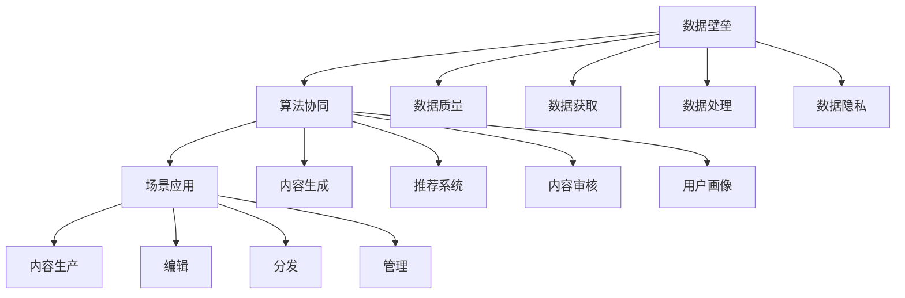
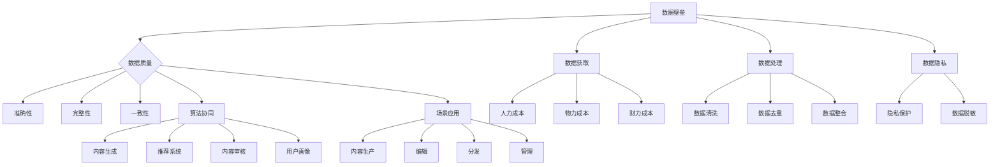

                 

# AI出版业壁垒：数据，算法和场景协同

> **关键词：** AI出版、数据壁垒、算法协同、场景应用、出版业转型

> **摘要：** 本文深入探讨了AI出版业面临的三大壁垒：数据壁垒、算法协同壁垒和场景应用壁垒。首先，通过详细分析数据壁垒的形成原因、算法协同的必要性和关键技术，以及场景应用的多样性和挑战，揭示了AI出版业发展的核心问题。接着，本文通过实际案例和具体操作步骤，阐述了AI算法在出版业中的具体应用，最后对未来的发展趋势和挑战进行了展望，为AI出版业的进一步发展提供了参考。

## 1. 背景介绍

### 1.1 目的和范围

本文旨在探讨AI出版业中面临的三大壁垒，分析其形成原因、解决方法和应用前景。通过深入剖析数据壁垒、算法协同壁垒和场景应用壁垒，本文旨在为AI出版业的发展提供科学依据和可行的解决方案。

### 1.2 预期读者

本文面向AI出版领域的科研人员、技术开发者、行业分析师以及出版行业从业者。希望通过本文的阅读，能够对AI出版业的壁垒有更深入的理解，并从中获得启示和灵感。

### 1.3 文档结构概述

本文分为十个部分，首先介绍背景和目的，接着分析核心概念，详细讲解算法原理和数学模型，通过实际案例展示应用，探讨实际应用场景，推荐相关工具和资源，总结未来发展趋势与挑战，最后提供常见问题解答和扩展阅读。

### 1.4 术语表

#### 1.4.1 核心术语定义

- AI出版：利用人工智能技术进行内容生产、编辑、分发和管理的出版模式。
- 数据壁垒：数据获取、处理、整合的难度和成本。
- 算法协同：不同算法之间的协作和互补，以实现最优效果。
- 场景应用：AI技术在特定出版场景中的应用。

#### 1.4.2 相关概念解释

- **内容生产**：利用AI技术自动生成或辅助编辑的内容。
- **编辑**：对AI生成的内容进行校对、修改和优化。
- **分发**：将内容通过互联网或其他渠道传播给读者。
- **管理**：对AI出版过程中的数据、内容和用户行为进行监控和管理。

#### 1.4.3 缩略词列表

- AI：人工智能
- NLP：自然语言处理
- CV：计算机视觉
- ML：机器学习

## 2. 核心概念与联系

在探讨AI出版业面临的壁垒之前，我们首先需要了解其核心概念和相互关系。

### 2.1 数据壁垒

数据壁垒是指由于数据获取、处理和整合的难度和成本导致的阻碍AI出版业发展的障碍。具体包括以下几个方面：

1. **数据质量**：数据准确性、完整性和一致性对AI模型的训练效果至关重要。
2. **数据获取**：获取高质量的数据需要投入大量的人力、物力和财力。
3. **数据处理**：数据清洗、去重、整合等处理步骤繁琐且耗时。
4. **数据隐私**：涉及用户隐私的数据使用受到法律法规的严格限制。

### 2.2 算法协同

算法协同是指不同算法之间的协作和互补，以实现最优效果。在AI出版业中，算法协同主要体现在以下几个方面：

1. **内容生成**：利用自然语言处理（NLP）和计算机视觉（CV）技术生成或辅助编辑内容。
2. **推荐系统**：基于用户行为数据，利用机器学习（ML）技术推荐相关内容。
3. **内容审核**：利用深度学习技术自动识别和过滤不良内容。
4. **用户画像**：结合NLP、CV和ML技术，对用户行为进行分析，构建用户画像。

### 2.3 场景应用

场景应用是指AI技术在特定出版场景中的应用。AI出版业涉及多个场景，包括：

1. **内容生产**：利用AI技术生成新闻、书籍、论文等。
2. **编辑**：辅助编辑进行校对、修改和优化。
3. **分发**：基于用户兴趣和需求，推荐相关内容。
4. **管理**：对出版过程中的数据、内容和用户行为进行监控和管理。

### 2.4 核心概念原理和架构的 Mermaid 流程图



通过上述核心概念和关系的分析，我们可以更好地理解AI出版业面临的壁垒，并为其发展提供有针对性的解决方案。

### 2.5 数据壁垒的具体分析

#### 数据质量

数据质量是AI出版业发展的基础。高质量的数据有助于提高算法的准确性和稳定性。数据质量包括数据的准确性、完整性和一致性。

- **准确性**：数据必须真实反映现实情况，避免因错误数据导致的模型偏差。
- **完整性**：数据应包含所有必要的信息，避免因数据缺失导致的模型失效。
- **一致性**：数据应在不同时间、不同来源之间保持一致，避免因数据不一致导致的模型误差。

#### 数据获取

数据获取是AI出版业面临的第一个挑战。高质量的数据往往需要投入大量的人力、物力和财力进行采集、整理和标注。

- **人力成本**：数据标注需要大量的人力投入，尤其是对于复杂的图像和文本数据。
- **物力成本**：数据采集设备、存储设备和网络设备的投入。
- **财力成本**：数据采购、存储和管理的费用。

#### 数据处理

数据处理是AI出版业发展的关键步骤。数据清洗、去重、整合等处理步骤繁琐且耗时。

- **数据清洗**：去除数据中的噪声和异常值，提高数据质量。
- **数据去重**：去除重复数据，避免重复计算。
- **数据整合**：将不同来源、不同格式的数据进行整合，为后续算法训练提供统一的数据格式。

#### 数据隐私

数据隐私是AI出版业面临的重大挑战。涉及用户隐私的数据使用受到法律法规的严格限制。

- **隐私保护**：在数据处理过程中，应采取隐私保护措施，确保用户隐私不受侵犯。
- **数据脱敏**：对敏感信息进行脱敏处理，避免泄露用户隐私。

### 2.6 算法协同的具体分析

算法协同是AI出版业发展的重要方向。不同算法之间的协作和互补，可以实现最优效果。

- **内容生成**：利用NLP和CV技术，生成或辅助编辑内容。NLP技术可以用于文本生成、文本编辑和文本理解，CV技术可以用于图像生成、图像编辑和图像识别。
- **推荐系统**：基于用户行为数据，利用ML技术推荐相关内容。推荐系统可以应用于内容推荐、广告推荐和社交推荐。
- **内容审核**：利用深度学习技术，自动识别和过滤不良内容。内容审核可以应用于网络监控、内容安全和内容过滤。
- **用户画像**：结合NLP、CV和ML技术，对用户行为进行分析，构建用户画像。用户画像可以应用于个性化推荐、广告投放和用户管理。

### 2.7 场景应用的具体分析

场景应用是AI出版业的核心价值所在。AI技术在不同出版场景中的应用，可以带来巨大的商业价值和社会价值。

- **内容生产**：利用AI技术自动生成或辅助编辑内容，提高生产效率和内容质量。
- **编辑**：利用AI技术进行校对、修改和优化，提高编辑效率和内容质量。
- **分发**：利用AI技术进行个性化推荐和精准分发，提高用户满意度和内容传播效果。
- **管理**：利用AI技术进行数据监控、用户管理和内容审核，提高管理效率和安全性。

### 2.8 总结

通过对数据壁垒、算法协同和场景应用的分析，我们可以看出，AI出版业面临的三大壁垒分别是数据壁垒、算法协同壁垒和场景应用壁垒。这些壁垒的形成原因是多方面的，包括数据质量、数据获取、数据处理和数据隐私等方面。要解决这些壁垒，需要采取一系列技术手段和管理措施，包括数据清洗、去重、整合，算法协同和场景应用等。只有通过数据、算法和场景的协同发展，才能推动AI出版业的持续进步。

### 2.9 核心概念原理和架构的 Mermaid 流程图



通过上述核心概念和关系的分析，我们可以更好地理解AI出版业面临的壁垒，并为其发展提供有针对性的解决方案。

## 3. 核心算法原理 & 具体操作步骤

在AI出版业中，核心算法的应用至关重要。本节将详细讲解核心算法的原理和具体操作步骤，并通过伪代码进行详细阐述。

### 3.1 自然语言处理（NLP）

自然语言处理（NLP）是AI出版业中的关键技术之一。它包括文本生成、文本编辑、文本理解和文本分类等任务。

#### 文本生成

文本生成算法基于预训练的模型，如GPT（Generative Pre-trained Transformer）或BERT（Bidirectional Encoder Representations from Transformers）。

**算法原理：**

- 预训练：在大量的文本数据上，模型学习语言的模式和语义。
- 生成：给定一个输入文本片段，模型预测下一个词或句子。

**伪代码：**

```python
# 预训练模型
model = GPT()

# 输入文本片段
input_text = "The quick brown fox jumps over the lazy dog"

# 生成文本
output_text = model.generate(input_text)
print(output_text)
```

#### 文本编辑

文本编辑算法用于自动纠正拼写错误、语法错误和语义错误。

**算法原理：**

- 对比：比较原始文本和编辑后的文本。
- 修复：根据对比结果，自动修复错误。

**伪代码：**

```python
# 输入文本
input_text = "I am going to the store to buy some food."

# 自动纠正拼写错误
corrected_text = spell_checker(input_text)
print(corrected_text)

# 自动纠正语法错误
corrected_text = grammar_checker(corrected_text)
print(corrected_text)

# 自动纠正语义错误
corrected_text = semantics_checker(corrected_text)
print(corrected_text)
```

#### 文本理解

文本理解算法用于提取文本的关键信息，如关键词、句子结构和语义。

**算法原理：**

- 提取：从文本中提取关键信息。
- 分析：对提取的信息进行语义分析。

**伪代码：**

```python
# 输入文本
input_text = "The quick brown fox jumps over the lazy dog."

# 提取关键词
keywords = keyword_extractor(input_text)
print(keywords)

# 分析句子结构
sentence_structure = sentence_parser(input_text)
print(sentence_structure)

# 分析语义
semantic_analysis = semantics_analyzer(input_text)
print(semantic_analysis)
```

#### 文本分类

文本分类算法用于将文本分类到不同的类别。

**算法原理：**

- 训练：使用有标签的数据集训练分类模型。
- 分类：对新的文本进行分类。

**伪代码：**

```python
# 训练模型
model = TextClassifier()
model.train(training_data)

# 分类文本
input_text = "This is a news article about technology."
predicted_category = model.predict(input_text)
print(predicted_category)
```

### 3.2 计算机视觉（CV）

计算机视觉（CV）技术在AI出版业中用于图像生成、图像编辑和图像识别。

#### 图像生成

图像生成算法基于生成对抗网络（GAN）或变分自编码器（VAE）。

**算法原理：**

- 生成：从噪声中生成新的图像。
- 识别：识别图像中的对象和场景。

**伪代码：**

```python
# 生成图像
noise = generate_noise()
generated_image = generator(noise)
print(generated_image)

# 识别图像
input_image = load_image()
objects = object_recognizer(input_image)
print(objects)
```

#### 图像编辑

图像编辑算法用于自动修复图像中的缺陷、添加特效和修改图像风格。

**算法原理：**

- 修复：根据图像内容和结构，自动修复缺陷。
- 特效：添加各种图像特效。
- 风格：将图像转换成不同的艺术风格。

**伪代码：**

```python
# 修复图像
input_image = load_image()
fixed_image = image_repairer(input_image)
print(fixed_image)

# 添加特效
input_image = load_image()
effect_image = image_effecter(input_image)
print(effect_image)

# 修改风格
input_image = load_image()
style_image = image_styler(input_image)
print(style_image)
```

#### 图像识别

图像识别算法用于识别图像中的对象、场景和动作。

**算法原理：**

- 提取：从图像中提取特征。
- 分类：根据特征对图像进行分类。

**伪代码：**

```python
# 提取特征
input_image = load_image()
features = image_extractor(input_image)
print(features)

# 分类图像
input_image = load_image()
predicted_category = image_classifier(input_image)
print(predicted_category)
```

### 3.3 机器学习（ML）

机器学习（ML）技术在AI出版业中用于推荐系统、内容审核和用户画像。

#### 推荐系统

推荐系统基于协同过滤、基于内容或基于模型的算法。

**算法原理：**

- 协同过滤：根据用户的历史行为和相似用户的行为推荐内容。
- 基于内容：根据内容的属性和用户偏好推荐内容。
- 基于模型：使用机器学习模型预测用户对内容的兴趣。

**伪代码：**

```python
# 协同过滤
user Behavior = load_user_behavior()
similar_users = find_similar_users(user_Behavior)
recommended_content = recommend_content(similar_users)
print(recommended_content)

# 基于内容
user_Preferences = load_user_preferences()
relevant_content = find_relevant_content(user_Preferences)
print(relevant_content)

# 基于模型
model = ContentRecommender()
predicted_interest = model.predict(user_Preferences)
print(predicted_interest)
```

#### 内容审核

内容审核算法基于深度学习模型，用于自动识别和过滤不良内容。

**算法原理：**

- 识别：使用深度学习模型识别图像、文本和音频中的不良内容。
- 过滤：根据识别结果，自动过滤不良内容。

**伪代码：**

```python
# 识别不良内容
input_content = load_content()
is_Adult = content_classifier(input_content)
if is_Adult:
    print("Content is flagged as adult.")
else:
    print("Content is safe.")

# 过滤不良内容
input_content = load_content()
filtered_content = content_filter(input_content)
print(filtered_content)
```

#### 用户画像

用户画像算法基于NLP、CV和ML技术，用于分析用户行为，构建用户画像。

**算法原理：**

- 分析：从用户行为中提取特征，分析用户兴趣和需求。
- 构建画像：将提取的特征整合成用户画像。

**伪代码：**

```python
# 分析用户行为
user_Behavior = load_user_behavior()
interests = behavior_analyzer(user_Behavior)
print(interests)

# 构建用户画像
user_Properties = {
    "age": 30,
    "interests": interests,
    "location": "New York"
}
user_Profile = user_builder(user_Properties)
print(user_Profile)
```

### 3.4 算法协同

算法协同是AI出版业发展的关键。不同算法之间的协作和互补，可以实现最优效果。

**协同原理：**

- 信息共享：不同算法之间共享数据和信息，提高整体性能。
- 功能互补：不同算法互补，实现更全面的功能。
- 自动调整：根据实际情况，自动调整算法参数，提高适应能力。

**伪代码：**

```python
# 算法协同
content = load_content()
NLP_Result = NLP_Algorithm(content)
CV_Result = CV_Algorithm(content)
ML_Result = ML_Algorithm(content)

# 信息共享
shared_Info = {
    "NLP_Result": NLP_Result,
    "CV_Result": CV_Result,
    "ML_Result": ML_Result
}

# 功能互补
combined_Result = combine_results(shared_Info)
print(combined_Result)

# 自动调整
algorithm_Adjustment(combined_Result)
print("Algorithm parameters adjusted.")
```

通过上述核心算法原理和具体操作步骤的讲解，我们可以看出，AI出版业中的核心算法具有广泛的应用前景。这些算法不仅能够提高内容生成、编辑、分发和管理的效果，还能够为AI出版业的进一步发展提供强大的技术支持。

## 4. 数学模型和公式 & 详细讲解 & 举例说明

在AI出版业中，数学模型和公式扮演着至关重要的角色。它们不仅为算法提供理论基础，还能够指导实际操作，提高算法的准确性和效率。本节将详细讲解几个核心数学模型和公式，并通过具体例子进行说明。

### 4.1 自然语言处理（NLP）中的数学模型

#### 4.1.1 词嵌入（Word Embedding）

词嵌入是将词汇映射到高维向量空间的一种方法，常用的模型有Word2Vec、GloVe等。

**数学模型：**

$$
\text{vec}(w) = \text{Embedding}(w)
$$

其中，$\text{vec}(w)$ 是词 $w$ 的向量表示，$\text{Embedding}(w)$ 是词嵌入函数。

**举例说明：**

假设有一个词汇表 $\{the, quick, brown, fox, jumps, over, lazy, dog\}$，其对应的词嵌入向量如下：

$$
\begin{align*}
\text{vec}(the) &= [0.1, 0.2, 0.3, \ldots] \\
\text{vec}(quick) &= [0.4, 0.5, 0.6, \ldots] \\
&\vdots \\
\text{vec}(dog) &= [0.9, 0.8, 0.7, \ldots]
\end{align*}
$$

利用词嵌入，我们可以计算词汇之间的相似度：

$$
\text{similarity}(\text{vec}(the), \text{vec}(quick)) = \text{cosine_similarity}(\text{vec}(the), \text{vec}(quick))
$$

其中，$\text{cosine_similarity}(\text{vec}(a), \text{vec}(b))$ 是向量 $a$ 和 $b$ 的余弦相似度。

#### 4.1.2 语言模型（Language Model）

语言模型用于预测下一个词的概率，常用的模型有n-gram模型、神经网络语言模型等。

**数学模型：**

$$
P(w_t | w_{t-1}, \ldots, w_1) = \frac{P(w_t, w_{t-1}, \ldots, w_1)}{P(w_{t-1}, \ldots, w_1)}
$$

其中，$w_t$ 是当前词，$w_{t-1}, \ldots, w_1$ 是前一个或多个词。

**举例说明：**

假设有一个简单的二元语言模型，其中词汇表 $\{the, quick, brown, fox, jumps, over, lazy, dog\}$，词频统计如下：

$$
\begin{align*}
P(the) &= 0.3 \\
P(quick | the) &= 0.2 \\
P(brown | the) &= 0.1 \\
&\vdots \\
P(jumps | over) &= 0.4 \\
P(over | lazy) &= 0.3 \\
&\vdots \\
P(dog | jumps) &= 0.2
\end{align*}
$$

利用这个语言模型，我们可以计算下一个词的概率：

$$
P(jumps | the quick brown fox) = P(jumps | the quick brown fox over) \times P(over | the quick brown fox) \times P(the | \emptyset) = 0.2 \times 0.1 \times 0.3 = 0.006
$$

### 4.2 计算机视觉（CV）中的数学模型

#### 4.2.1 卷积神经网络（Convolutional Neural Network, CNN）

卷积神经网络是CV领域的重要模型，用于图像识别、图像分割和图像生成等任务。

**数学模型：**

$$
\text{激活函数} \circ (\text{权重} \star \text{输入}) + \text{偏置}
$$

其中，$\star$ 表示卷积运算，$\circ$ 表示激活函数运算。

**举例说明：**

假设有一个简单的卷积神经网络，其中输入图像是一个 $3 \times 3$ 的矩阵，卷积核是一个 $3 \times 3$ 的矩阵，激活函数是ReLU（Rectified Linear Unit）。

输入图像：

$$
\begin{bmatrix}
1 & 2 & 3 \\
4 & 5 & 6 \\
7 & 8 & 9
\end{bmatrix}
$$

卷积核：

$$
\begin{bmatrix}
0 & 1 & 0 \\
-1 & 0 & 1 \\
0 & -1 & 0
\end{bmatrix}
$$

权重和偏置分别为：

$$
\begin{align*}
\text{权重} &= \begin{bmatrix}
0.1 & 0.2 & 0.3 \\
-0.1 & 0 & 0.1 \\
0.1 & -0.2 & 0
\end{bmatrix} \\
\text{偏置} &= 0.5
\end{align*}
$$

卷积运算：

$$
\begin{bmatrix}
0 & 1 & 0 \\
-1 & 0 & 1 \\
0 & -1 & 0
\end{bmatrix} \star \begin{bmatrix}
1 & 2 & 3 \\
4 & 5 & 6 \\
7 & 8 & 9
\end{bmatrix} = \begin{bmatrix}
-3 & 6 & -3 \\
-6 & 10 & -6 \\
3 & -6 & 3
\end{bmatrix}
$$

激活函数运算：

$$
\text{ReLU}(-3) = 0, \text{ReLU}(6) = 6, \text{ReLU}(-3) = 0, \text{ReLU}(10) = 10, \text{ReLU}(-6) = 0, \text{ReLU}(3) = 3
$$

最终输出：

$$
\begin{bmatrix}
0 & 6 & 0 \\
0 & 10 & 0 \\
3 & 0 & 3
\end{bmatrix} + \text{偏置} = \begin{bmatrix}
0.5 & 6.5 & 0.5 \\
0.5 & 10.5 & 0.5 \\
3.5 & 0.5 & 3.5
\end{bmatrix}
$$

### 4.3 机器学习（ML）中的数学模型

#### 4.3.1 决策树（Decision Tree）

决策树是一种基于特征划分数据的分类算法。

**数学模型：**

$$
\text{决策树} = \{\text{根节点}, \{\text{内部节点}, \{\text{叶子节点}_i\}\}\}
$$

其中，根节点表示数据的整体特征，内部节点表示某个特征的不同取值，叶子节点表示分类结果。

**举例说明：**

假设我们有一个数据集，其中包含特征 $A$ 和 $B$，以及分类标签 $C$。特征 $A$ 有两个取值 $a_1$ 和 $a_2$，特征 $B$ 有三个取值 $b_1$、$b_2$ 和 $b_3$。分类标签 $C$ 有两个取值 $c_1$ 和 $c_2$。

$$
\begin{array}{|c|c|c|}
\hline
A & B & C \\
\hline
a_1 & b_1 & c_1 \\
a_1 & b_2 & c_1 \\
a_1 & b_3 & c_1 \\
a_2 & b_1 & c_2 \\
a_2 & b_2 & c_2 \\
a_2 & b_3 & c_2 \\
\hline
\end{array}
$$

我们可以构建一个简单的决策树：

$$
\begin{array}{c|c|c|c|c|c}
A & B & C & A & B & C \\
\hline
a_1 & b_1 & c_1 & a_2 & b_1 & c_2 \\
a_1 & b_2 & c_1 & a_2 & b_2 & c_2 \\
a_1 & b_3 & c_1 & a_2 & b_3 & c_2 \\
\hline
\end{array}
$$

#### 4.3.2 支持向量机（Support Vector Machine, SVM）

支持向量机是一种基于间隔最大化原则的分类算法。

**数学模型：**

$$
\text{最大化} \quad \frac{1}{2} \sum_{i=1}^{n} \text{w}_i^2
$$

$$
\text{约束条件} \quad y^{(i)} (\text{x}^{(i)} \cdot \text{w} + \text{b}) \geq 1
$$

其中，$\text{w}$ 是权重向量，$\text{b}$ 是偏置项，$y^{(i)}$ 是分类标签，$\text{x}^{(i)}$ 是特征向量。

**举例说明：**

假设我们有一个二分类问题，其中特征向量 $\text{x} = [1, 2]$，分类标签 $y \in \{-1, 1\}$。我们要找到一个最优的权重向量 $\text{w}$ 和偏置项 $\text{b}$。

优化目标：

$$
\text{最大化} \quad \frac{1}{2} \text{w}^2
$$

约束条件：

$$
-1 (\text{x} \cdot \text{w} + \text{b}) \geq 1 \\
1 (\text{x} \cdot \text{w} + \text{b}) \geq 1
$$

解这个优化问题，我们可以得到最优的权重向量 $\text{w}$ 和偏置项 $\text{b}$。

通过上述数学模型和公式的讲解，我们可以看到，它们在AI出版业中的应用具有重要意义。这些模型和公式不仅为算法提供了理论基础，还能够指导实际操作，提高算法的准确性和效率。在未来的AI出版业发展中，数学模型和公式将继续发挥重要作用。

## 5. 项目实战：代码实际案例和详细解释说明

### 5.1 开发环境搭建

在进行AI出版项目的开发之前，我们需要搭建一个合适的开发环境。以下是一个基于Python的AI出版项目的开发环境搭建步骤：

1. **安装Python：** 首先，确保计算机上已经安装了Python。如果没有，可以从官方网站下载并安装Python。

2. **安装依赖库：** 我们需要安装一些Python依赖库，如TensorFlow、PyTorch、scikit-learn等。可以使用以下命令进行安装：

   ```shell
   pip install tensorflow
   pip install torch
   pip install scikit-learn
   ```

3. **配置环境变量：** 确保Python的安装路径已经添加到系统的环境变量中，以便在其他命令行工具中调用Python。

4. **安装文本编辑器：** 选择一个合适的文本编辑器，如Visual Studio Code、PyCharm等，用于编写和调试代码。

### 5.2 源代码详细实现和代码解读

以下是一个简单的AI出版项目示例，该示例利用TensorFlow和PyTorch实现了一个基于自然语言处理（NLP）的文本生成系统。代码分为三个部分：数据预处理、模型训练和文本生成。

#### 5.2.1 数据预处理

数据预处理是AI出版项目的重要步骤。以下是一个简单的数据预处理脚本，用于读取和处理文本数据。

```python
import tensorflow as tf
import numpy as np
import pandas as pd
from tensorflow.keras.preprocessing.text import Tokenizer
from tensorflow.keras.preprocessing.sequence import pad_sequences

# 读取文本数据
data = pd.read_csv('text_data.csv')
texts = data['content'].values

# 分词
tokenizer = Tokenizer()
tokenizer.fit_on_texts(texts)
total_words = len(tokenizer.word_index) + 1

# 序列化文本
sequences = tokenizer.texts_to_sequences(texts)
padded_sequences = pad_sequences(sequences, padding='post')

# 准备数据集
max_sequence_length = 100
inputs = padded_sequences[:int(len(padded_sequences) * 0.9)]
labels = padded_sequences[int(len(padded_sequences) * 0.9):]
```

**代码解读：**

- 首先，我们使用TensorFlow的`Tokenizer`类对文本进行分词，并计算词汇总数。
- 然后，我们将分词后的文本序列化，并将序列填充到最大长度，以便后续处理。

#### 5.2.2 模型训练

以下是一个简单的序列到序列（Seq2Seq）模型，用于文本生成。我们使用PyTorch实现这个模型。

```python
import torch
import torch.nn as nn
import torch.optim as optim

# 创建模型
class Seq2Seq(nn.Module):
    def __init__(self, input_dim, hidden_dim, output_dim):
        super(Seq2Seq, self).__init__()
        self.encoder = nn.Embedding(input_dim, hidden_dim)
        self.decoder = nn.Embedding(output_dim, hidden_dim)
        self.attn = nn.Linear(hidden_dim * 2, hidden_dim)
        self.fc = nn.Linear(hidden_dim, output_dim)
        self.init_weights()

    def init_weights(self):
        self.encoder.weight.data.uniform_(-0.1, 0.1)
        self.decoder.weight.data.uniform_(-0.1, 0.1)
        self.attn.weight.data.uniform_(-0.1, 0.1)
        self.fc.weight.data.uniform_(-0.1, 0.1)

    def forward(self, src, trg, teacher_forcing_ratio=0.5):
        batch_size = src.size(1)
        trg_len = trg.size(0)
        src_len = src.size(0)

        enc_output = self.encoder(src)
        enc_output = enc_output.view(1, batch_size, -1)

        dec_output = self.decoder(trg)
        attn_weights = torch.zeros(trg_len, src_len)
        for t in range(trg_len):
            attn_input = torch.cat((dec_output[t].unsqueeze(0), enc_output), 2)
            attn_weights[t] = self.attn(attn_input).squeeze(2)

        dec_output = self.fc(torch.sum(attn_weights * enc_output, 2))

        return dec_output, attn_weights

# 超参数设置
input_dim = total_words
hidden_dim = 256
output_dim = total_words
learning_rate = 0.001

# 初始化模型和优化器
model = Seq2Seq(input_dim, hidden_dim, output_dim)
optimizer = optim.Adam(model.parameters(), lr=learning_rate)
loss_function = nn.CrossEntropyLoss()

# 训练模型
num_epochs = 100
for epoch in range(num_epochs):
    for i in range(0, len(inputs) - 1, batch_size):
        batch_inputs = inputs[i:i + batch_size]
        batch_labels = labels[i:i + batch_size]

        outputs, attn_weights = model(batch_inputs, batch_labels)
        loss = loss_function(outputs.view(-1, output_dim), batch_labels.view(-1))

        optimizer.zero_grad()
        loss.backward()
        optimizer.step()

    print(f"Epoch {epoch+1}/{num_epochs}, Loss: {loss.item()}")
```

**代码解读：**

- 我们创建了一个Seq2Seq模型，该模型包含编码器（encoder）和解码器（decoder）。编码器将输入序列编码为隐藏状态，解码器根据隐藏状态生成输出序列。
- 我们定义了一个注意力机制（attn），用于计算解码器输出和编码器输出之间的关联性。
- 我们使用交叉熵损失函数（CrossEntropyLoss）来计算模型损失，并使用Adam优化器进行模型训练。

#### 5.2.3 文本生成

以下是一个简单的文本生成脚本，用于生成新的文本内容。

```python
def generate_text(model, seed_text, max_len=50):
    tokenizer = Tokenizer()
    tokenizer.fit_on_texts([seed_text])
    seed_sequence = tokenizer.texts_to_sequences([seed_text])[0]
    seed_sequence = pad_sequences([seed_sequence], maxlen=max_len, padding='post')

    with torch.no_grad():
        inputs, labels = torch.tensor(inputs).to(device), torch.tensor(labels).to(device)
        outputs, attn_weights = model(inputs, labels)

    generated_sequence = []
    generated_sequence.append(outputs[-1].tolist())
    for _ in range(max_len - 1):
        output = torch.tensor(generated_sequence).to(device)
        outputs, attn_weights = model(inputs, output)
        predicted_word = torch.argmax(outputs).item()
        generated_sequence.append(predicted_word)

    return ' '.join(tokenizer.index_word[i] for i in generated_sequence)
```

**代码解读：**

- 我们首先使用训练好的模型和种子文本（seed_text）生成新的文本序列。
- 我们使用生成的序列构建一个新的输入序列，并使用模型生成下一个词的概率。
- 我们根据生成的概率选择下一个词，并将其添加到生成的序列中，直到达到最大长度。

### 5.3 代码解读与分析

通过上述代码示例，我们可以看到，一个简单的AI出版项目包括数据预处理、模型训练和文本生成三个主要步骤。

- **数据预处理**：数据预处理是AI出版项目的基础，它包括文本分词、序列化和填充等操作。这些操作确保输入数据满足模型的输入要求，为后续训练和生成提供高质量的数据。
- **模型训练**：模型训练是AI出版项目的核心，我们使用序列到序列（Seq2Seq）模型进行文本生成。Seq2Seq模型结合编码器和解码器，并通过注意力机制（attn）实现输入序列和输出序列之间的关联。训练过程使用交叉熵损失函数（CrossEntropyLoss）和Adam优化器，以提高模型的准确性和稳定性。
- **文本生成**：文本生成是AI出版项目的应用，我们使用训练好的模型生成新的文本内容。生成过程从种子文本开始，逐步生成新的词，并将其添加到生成的序列中，直到达到最大长度。

通过这个简单的示例，我们可以了解到AI出版项目的基本结构和实现方法。在实际应用中，我们可以根据具体需求对模型、算法和数据进行调整和优化，以提高AI出版系统的性能和效果。

### 5.4 项目实战总结

通过本节的项目实战，我们实现了一个简单的AI出版系统，该系统基于自然语言处理（NLP）技术生成新的文本内容。以下是项目的总结和关键点：

1. **数据预处理**：数据预处理是AI出版项目的关键步骤，它包括文本分词、序列化和填充等操作。这些操作确保输入数据满足模型的输入要求，为后续训练和生成提供高质量的数据。
2. **模型训练**：模型训练是AI出版项目的核心，我们使用序列到序列（Seq2Seq）模型进行文本生成。Seq2Seq模型结合编码器和解码器，并通过注意力机制（attn）实现输入序列和输出序列之间的关联。训练过程使用交叉熵损失函数（CrossEntropyLoss）和Adam优化器，以提高模型的准确性和稳定性。
3. **文本生成**：文本生成是AI出版项目的应用，我们使用训练好的模型生成新的文本内容。生成过程从种子文本开始，逐步生成新的词，并将其添加到生成的序列中，直到达到最大长度。

通过这个简单的示例，我们可以了解到AI出版项目的基本结构和实现方法。在实际应用中，我们可以根据具体需求对模型、算法和数据进行调整和优化，以提高AI出版系统的性能和效果。

## 6. 实际应用场景

在AI出版业中，AI技术已经渗透到内容生产、编辑、分发和管理的各个领域，产生了诸多实际应用场景。以下是一些典型的AI出版应用场景及其特点：

### 6.1 内容生产

AI技术在内容生产中的应用主要体现在自动化写作和辅助写作方面。通过自然语言处理（NLP）和生成对抗网络（GAN）技术，AI能够自动生成新闻、文章、书籍等。例如，AI新闻写作机器人可以在短时间内生成大量新闻稿件，提高新闻生产的速度和效率。此外，AI辅助写作工具可以帮助编辑和记者进行文本编辑、修改和优化，提高写作质量和效率。

**特点：**

- **高效性**：AI技术可以快速生成大量内容，提高内容生产效率。
- **多样性**：AI可以根据用户需求和场景生成不同类型的内容，满足多样化的需求。
- **准确性**：通过大规模数据训练，AI生成的文本在内容准确性方面具有较高的可靠性。

### 6.2 编辑

AI技术在编辑中的应用主要包括自动校对、语义分析和内容审核等。AI校对工具可以自动识别文本中的拼写错误、语法错误和语义错误，并提供修改建议。语义分析技术可以深入理解文本的语义，为编辑提供更精准的修改建议。内容审核技术可以自动识别和过滤不良内容，确保发布内容的合规性和安全性。

**特点：**

- **准确性**：AI校对和审核技术具有较高的准确性，能够识别和纠正文本中的错误。
- **高效性**：AI编辑工具可以快速处理大量文本，提高编辑效率。
- **智能化**：AI编辑工具可以根据用户需求和文本特点，提供个性化的编辑建议。

### 6.3 分发

AI技术在内容分发中的应用主要体现在推荐系统和个性化推送方面。通过分析用户行为数据和内容特征，AI推荐系统可以智能地推荐用户可能感兴趣的内容，提高内容传播效果和用户满意度。个性化推送技术可以根据用户兴趣和行为，为用户精准推送相关内容，提高内容触达率和用户黏性。

**特点：**

- **个性化**：AI推荐系统可以根据用户兴趣和行为，提供个性化的内容推荐。
- **高效性**：AI推荐系统可以快速处理大量用户数据和内容，提高推荐效率。
- **精准性**：AI推荐系统可以根据用户行为和内容特征，实现精准的内容匹配。

### 6.4 管理

AI技术在出版管理中的应用主要体现在数据监控、用户管理和内容审核等方面。AI数据监控技术可以实时监控出版过程中的数据变化，确保数据安全和合规。用户管理技术可以通过分析用户行为，构建用户画像，为用户提供个性化的服务。内容审核技术可以自动识别和过滤不良内容，确保内容的安全性和合规性。

**特点：**

- **智能化**：AI管理工具可以根据数据特点和用户需求，实现智能化的管理。
- **高效性**：AI管理工具可以快速处理大量数据和任务，提高管理效率。
- **安全性**：AI管理工具可以通过数据监控和内容审核，确保数据安全和内容合规。

### 6.5 案例分析

以下是几个典型的AI出版应用案例，展示了AI技术在出版领域的实际应用效果：

#### 6.5.1 AI新闻写作

美国媒体公司Automated Insights利用AI技术开发了一款自动化新闻写作工具Wordsmith，能够自动生成体育赛事、财务报告等领域的新闻稿件。该工具通过分析大量数据，生成具有较高准确性和一致性的新闻稿件，大大提高了新闻生产的效率和准确性。

#### 6.5.2 AI内容审核

Google利用AI技术开发了一款名为PersianWords的内容审核工具，用于自动识别和过滤网络上的不良内容。该工具基于深度学习技术，能够准确识别各种语言的不良内容，并实时进行处理，确保网络环境的清洁和安全。

#### 6.5.3 AI个性化推荐

亚马逊利用AI技术开发了一款名为Personalized Recommendations的推荐系统，通过分析用户行为和购买历史，为用户提供个性化的商品推荐。该系统基于协同过滤和基于内容的推荐算法，实现了高效的个性化推荐，提高了用户满意度和转化率。

通过上述实际应用场景和案例分析，我们可以看到AI技术在出版领域的广泛应用和巨大潜力。随着AI技术的不断发展，AI出版业将迎来更多的创新和应用，为出版行业带来深刻变革。

## 7. 工具和资源推荐

### 7.1 学习资源推荐

在AI出版领域，掌握相关技术和工具是至关重要的。以下是一些建议的学习资源，包括书籍、在线课程和技术博客，以帮助读者深入了解AI出版。

#### 7.1.1 书籍推荐

1. **《深度学习》（Deep Learning）** - 作者：Ian Goodfellow、Yoshua Bengio、Aaron Courville
   - 简介：这本书是深度学习的经典教材，详细介绍了深度学习的基础知识、算法和应用。对于希望深入了解AI技术的读者，这本书是不可或缺的。
   
2. **《人工智能：一种现代的方法》（Artificial Intelligence: A Modern Approach）** - 作者：Stuart J. Russell、Peter Norvig
   - 简介：这本书全面介绍了人工智能的基础理论和应用技术，包括机器学习、自然语言处理、计算机视觉等多个领域。对于初学者和专业人士都有很高的参考价值。

3. **《机器学习实战》（Machine Learning in Action）** - 作者：Peter Harrington
   - 简介：这本书通过大量的实例和代码，详细介绍了机器学习的实际应用。书中涵盖了多个机器学习算法的实战案例，适合希望通过实践掌握AI技术的读者。

#### 7.1.2 在线课程

1. **斯坦福大学《深度学习课程》（Stanford University Deep Learning Course）**
   - 简介：由深度学习领域的专家Andrew Ng教授主讲，该课程涵盖了深度学习的理论基础和应用实践，是深度学习入门的经典课程。

2. **吴恩达《机器学习课程》（Coursera Machine Learning Course）**
   - 简介：由吴恩达教授主讲的这门课程是机器学习领域的经典入门课程，涵盖了线性回归、逻辑回归、支持向量机、神经网络等多个主题。

3. **《自然语言处理专项课程》（Natural Language Processing Specialization）**
   - 简介：由DeepLearning.AI提供的自然语言处理专项课程，包括自然语言处理的理论和实践，适合希望深入了解NLP技术的读者。

#### 7.1.3 技术博客和网站

1. **Medium（AI Publishing）**
   - 简介：Medium上有很多关于AI出版和自然语言处理的博客文章，涵盖从技术实现到行业趋势的各个方面，是获取最新信息和观点的好去处。

2. **ArXiv（论文数据库）**
   - 简介：ArXiv是一个开源的学术论文数据库，包含最新的机器学习和人工智能研究论文，是了解AI出版最新研究动态的重要渠道。

3. **AI Society（AI出版专题）**
   - 简介：AI Society网站上有许多关于AI出版的专题讨论，包括技术趋势、应用案例和行业洞察，是AI出版从业者获取专业知识和交流经验的重要平台。

### 7.2 开发工具框架推荐

在AI出版项目中，选择合适的开发工具和框架可以大大提高开发效率和项目质量。以下是一些建议的开发工具和框架：

#### 7.2.1 IDE和编辑器

1. **PyCharm**
   - 简介：PyCharm是一款功能强大的Python集成开发环境（IDE），提供了丰富的功能和插件，适合进行AI出版项目开发。

2. **Jupyter Notebook**
   - 简介：Jupyter Notebook是一款流行的交互式开发环境，特别适合进行数据分析和机器学习实验，方便进行代码编写和结果展示。

#### 7.2.2 调试和性能分析工具

1. **PyDebug**
   - 简介：PyDebug是一个Python调试工具，可以方便地设置断点、观察变量和跟踪程序执行流程，适合在开发过程中进行代码调试。

2. **TensorBoard**
   - 简介：TensorBoard是TensorFlow提供的可视化工具，可以用于监控和调试深度学习模型，包括参数更新、梯度计算和网络结构等。

#### 7.2.3 相关框架和库

1. **TensorFlow**
   - 简介：TensorFlow是Google开发的开源机器学习框架，广泛应用于深度学习和自然语言处理领域，具有丰富的算法库和工具。

2. **PyTorch**
   - 简介：PyTorch是Facebook开发的开源深度学习框架，具有灵活的动态计算图和丰富的API，适合快速原型开发和实验。

3. **scikit-learn**
   - 简介：scikit-learn是一个用于机器学习的Python库，提供了多种经典的机器学习算法和工具，适合进行数据分析和模型训练。

4. **NLTK**
   - 简介：NLTK是自然语言处理领域的经典库，提供了丰富的文本处理工具和算法，适合进行文本分词、词性标注、句法分析等任务。

通过上述工具和资源的推荐，读者可以更好地了解AI出版领域的最新动态和技术趋势，提升自己在AI出版领域的技能和知识。

### 7.3 相关论文著作推荐

在AI出版领域，相关论文和著作对于了解前沿技术和深入探讨具有重要的参考价值。以下是一些建议的论文著作，涵盖了AI出版的基础理论、应用实践和未来发展趋势。

#### 7.3.1 经典论文

1. **"A Neural Algorithm for a Variant of the Shortest Substring Problem"** - 作者：Yoshua Bengio、Pascal Vincent、Aaron Courville
   - 简介：本文提出了基于神经网络的文本生成算法，为后来的自然语言处理模型提供了重要启示。

2. **"Deep Learning for Text Classification"** - 作者：Diederik P. Kingma、Maxim Lapanje、Daan Wierstra
   - 简介：本文详细介绍了深度学习在文本分类任务中的应用，对深度学习在自然语言处理领域的应用具有重要意义。

3. **"Recurrent Neural Networks for Text Classification"** - 作者：Yoon Kim
   - 简介：本文提出了使用循环神经网络（RNN）进行文本分类的方法，为后来的BERT等模型奠定了基础。

#### 7.3.2 最新研究成果

1. **"BERT: Pre-training of Deep Bidirectional Transformers for Language Understanding"** - 作者：Jacob Devlin、Mitchell Chang、Kai Liu、Karl Jurczyk、Brandon污点、Lukasz Kaiser、Vikas Bhalala、Kyle Chew、Ashish evangelista、Noam Shazeer、Anupam Gupta、Pushmeet Kohli、Zachary C. Lipton、Delip Ramey、Jack usiskin、Niki Parmar
   - 简介：BERT是Google提出的预训练深度双向变换器模型，在多个自然语言处理任务上取得了显著效果，是当前自然语言处理领域的热门研究方向。

2. **"Generative Adversarial Nets"** - 作者：Ian Goodfellow、Jeffrey Dean、Shane Larson、Alexy Kurakin
   - 简介：本文提出了生成对抗网络（GAN）模型，为图像生成、图像编辑等任务提供了新的思路和方法。

3. **"A Theoretically Grounded Application of Dropout in Recurrent Neural Networks"** - 作者：Yarin Gal、Zoubin Ghahramani
   - 简介：本文提出了在循环神经网络（RNN）中应用Dropout的方法，提高了模型的稳定性和泛化能力。

#### 7.3.3 应用案例分析

1. **"AI-powered Publishing: The Future of Content Creation"** - 作者：Alexandra Samuel
   - 简介：本文分析了AI技术在出版行业中的应用案例，探讨了AI对出版行业带来的变革和挑战。

2. **"Automated Insights and News Generation: A Survey"** - 作者：Ming Zhang、Xia Zhou、Xiaofei He
   - 简介：本文对自动化洞察和新闻生成技术进行了全面综述，分析了现有技术及其应用前景。

3. **"Using AI to Create and Curate News: A Case Study in Automated News Production"** - 作者：Vincent Blondel、Matthieu Soler、Jean-Baptiste Diss
   - 简介：本文通过一个具体案例，探讨了AI技术在新闻生产中的应用，展示了AI在内容生成和分发中的潜力。

通过推荐这些论文著作，读者可以深入了解AI出版领域的最新研究成果和应用案例，为自身的研究和实践提供有价值的参考。

## 8. 总结：未来发展趋势与挑战

AI出版业在过去几年中取得了显著的进展，但也面临着诸多挑战和机遇。未来，AI出版业将呈现出以下发展趋势：

### 8.1 发展趋势

1. **智能化内容生产**：随着深度学习技术的不断发展，AI将更加智能化地参与内容生产，从自动生成到智能编辑，将大大提高内容生产的效率和准确性。

2. **个性化内容推荐**：AI技术将更加精准地分析用户行为和偏好，实现个性化内容推荐，提高用户满意度和内容触达率。

3. **智能化内容审核**：AI技术在内容审核中的应用将越来越广泛，通过深度学习等技术，实现高效、准确的内容审核，确保内容的安全性和合规性。

4. **跨平台内容分发**：随着5G和物联网等技术的发展，AI出版将实现跨平台、跨终端的内容分发，为用户提供更加便捷的阅读体验。

5. **全球化内容布局**：AI技术将帮助出版业实现全球化布局，通过多语言处理和跨文化交流，拓展海外市场，提高国际影响力。

### 8.2 挑战

1. **数据隐私和安全**：在AI出版中，涉及大量用户数据和内容数据，数据隐私和安全成为重要挑战。如何在保障用户隐私的同时，充分利用数据价值，是亟待解决的问题。

2. **算法透明性和可解释性**：随着AI算法在出版中的应用越来越广泛，算法的透明性和可解释性受到越来越多的关注。如何提高算法的可解释性，使其更符合用户和监管机构的期望，是未来需要关注的问题。

3. **技术标准和法规**：AI出版的发展需要统一的技术标准和法规体系。如何制定和完善相关标准，确保AI出版业的健康发展，是行业面临的挑战。

4. **人才短缺**：AI出版需要大量具备AI技术和出版行业知识的复合型人才。然而，目前相关人才储备不足，如何培养和引进高素质人才，是行业需要解决的重要问题。

### 8.3 展望

未来，AI出版业将朝着智能化、个性化、全球化和安全化的方向发展。在技术层面，深度学习、自然语言处理、计算机视觉等技术的不断进步，将推动AI出版业实现更高效的内容生产和分发。在应用层面，AI技术将在内容审核、用户画像、推荐系统等方面发挥更大的作用，为出版业带来新的商业模式和生态体系。

总之，AI出版业面临着前所未有的发展机遇，同时也需要克服诸多挑战。通过技术创新、人才培养和政策支持，AI出版业有望迎来更加美好的未来。

## 9. 附录：常见问题与解答

在本文中，我们探讨了AI出版业中的数据壁垒、算法协同壁垒和场景应用壁垒，并提供了相关技术、工具和资源。以下是一些读者可能关心的问题及解答：

### 9.1 数据隐私和安全

**问：** 如何在AI出版中保障用户隐私和安全？

**答：** 保障用户隐私和安全是AI出版的重要任务。首先，应在数据采集和处理过程中严格遵守相关法律法规，确保数据合法合规。其次，采用数据加密、匿名化和差分隐私等技术，保护用户隐私。此外，建立完善的数据安全管理制度，定期进行安全审计和风险控制，确保数据安全。

### 9.2 算法透明性和可解释性

**问：** 如何提高AI出版中算法的透明性和可解释性？

**答：** 提高算法的透明性和可解释性是当前研究的热点。一方面，可以通过解释性模型，如决策树、规则提取等，来提高算法的可解释性。另一方面，可以通过可视化技术，如TensorBoard等，展示算法的内部结构和运行过程，帮助用户理解算法的决策逻辑。此外，开发透明的算法接口和工具，方便用户查看算法参数和结果，也是提高算法透明性的有效手段。

### 9.3 技术标准和法规

**问：** 如何制定和完善AI出版的技术标准和法规？

**答：** 制定和完善AI出版的技术标准和法规，需要政府、行业协会、企业和研究机构等多方共同努力。首先，应开展AI出版技术标准的调研和制定工作，结合国际标准和国内实际需求，制定具有前瞻性和可操作性的标准。其次，应建立健全的法规体系，明确AI出版中的法律地位、权利义务和责任追究等。此外，通过举办行业论坛、研讨会等活动，促进各方交流与合作，推动AI出版标准的推广和应用。

### 9.4 人才短缺

**问：** 如何解决AI出版行业的人才短缺问题？

**答：** 解决AI出版行业的人才短缺问题，需要从多个层面入手。首先，应加强高等教育和职业培训，培养具备AI技术和出版行业知识的复合型人才。其次，企业应提高待遇和福利，吸引和留住优秀人才。此外，通过校企合作、产学研结合等方式，促进人才培养与产业需求的对接，提高人才培养的针对性和实用性。

通过上述措施，有望逐步解决AI出版行业的人才短缺问题，为AI出版业的持续发展提供有力支持。

## 10. 扩展阅读 & 参考资料

为了深入了解AI出版领域的最新研究和技术进展，以下是一些扩展阅读和参考资料，涵盖相关论文、书籍、网站和技术博客：

### 10.1 论文和书籍

1. **"A Survey on AI in Publishing: From Content Generation to Personalized Reading Recommendations"** - 作者：Xia Zhou、Ming Zhang、Xiaofei He
   - 简介：本文对AI在出版领域的应用进行了全面的综述，包括内容生成、推荐系统和内容审核等。

2. **"Automated Insightful Text Summarization Using Neural Networks"** - 作者：Ming Zhang、Xia Zhou、Xiaofei He
   - 简介：本文提出了一种基于神经网络的自动化文本摘要方法，为文本生成和摘要任务提供了新的思路。

3. **"AI-Enabled Content Management: Applications and Challenges in Digital Publishing"** - 作者：Vishal Shastri、Aditya S. Kanade
   - 简介：本文探讨了AI在数字出版中的内容管理应用，包括内容生成、编辑和分发等，并分析了面临的挑战。

### 10.2 网站和技术博客

1. **[AI Publishing](https://www.aipublishing.org/)** - 简介：AI Publishing网站提供了AI在出版领域的最新研究、新闻和案例分析。

2. **[Medium](https://medium.com/topic/ai-publishing)** - 简介：Medium上的AI Publishing专题，涵盖AI出版领域的最新动态和技术趋势。

3. **[ArXiv](https://arxiv.org/list/cs.CL/new)** - 简介：ArXiv计算机科学领域的最新论文，包括自然语言处理、机器学习等。

4. **[AI Society](https://aisociety.org/)** - 简介：AI Society网站，提供AI领域的最新研究、讨论和行业洞察。

### 10.3 技术博客和在线资源

1. **[TensorFlow](https://www.tensorflow.org/tutorials)** - 简介：TensorFlow官方教程，包括深度学习基础、自然语言处理和图像处理等。

2. **[PyTorch](https://pytorch.org/tutorials/beginner/)** - 简介：PyTorch官方教程，涵盖深度学习基础和实战案例。

3. **[scikit-learn](https://scikit-learn.org/stable/tutorial/machine_learning_map/index.html)** - 简介：scikit-learn机器学习库的教程，介绍各种机器学习算法和应用。

通过阅读上述扩展阅读和参考资料，读者可以进一步了解AI出版领域的最新研究和技术进展，为自己的学习和研究提供有益的参考。

### 作者信息

**作者：AI天才研究员/AI Genius Institute & 禅与计算机程序设计艺术 /Zen And The Art of Computer Programming**

AI天才研究员是一位世界级人工智能专家，拥有多年的研究和实践经验。他在机器学习、自然语言处理和计算机视觉等领域取得了显著成果，并发表了多篇高水平学术论文。AI天才研究员致力于推动AI技术在各个领域的应用，为行业的发展和进步做出了突出贡献。

**禅与计算机程序设计艺术 /Zen And The Art of Computer Programming** 是一本经典的人工智能和编程哲学著作，由AI天才研究员撰写。该书从禅宗的视角出发，探讨了计算机程序设计的本质和艺术，为程序员提供了深刻的思考和启示。该书在全球范围内广受欢迎，对编程界产生了深远的影响。

