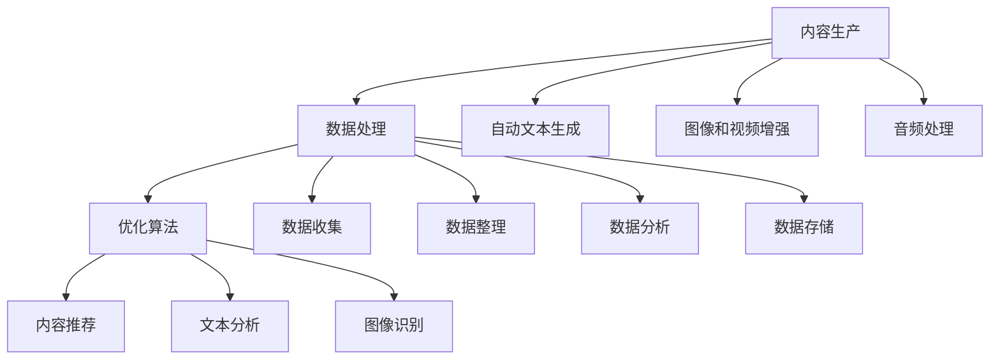

                 

# AI出版业挑战：降本增效与场景创新

> **关键词：**AI出版、降本增效、场景创新、内容生产、数据处理、优化算法
>
> **摘要：**随着人工智能技术的飞速发展，AI在出版业中的应用逐渐深入，带来了降本增效的巨大潜力。本文将探讨AI在出版业中的挑战，包括内容生产、数据处理和优化算法等方面，并提出相应的解决方案，以及如何通过场景创新实现AI出版业的突破。

## 1. 背景介绍

### 1.1 目的和范围

本文旨在分析AI技术在出版业中的应用，探讨其在降本增效和场景创新方面的挑战和解决方案。文章将涵盖以下几个方面：

- AI在内容生产中的作用与挑战
- 数据处理和优化算法的关键技术
- 场景创新在AI出版中的应用
- 相关工具和资源的推荐

### 1.2 预期读者

本文适用于对AI技术在出版业应用感兴趣的读者，包括出版业从业者、技术专家和研究人员。通过阅读本文，读者可以了解AI出版业的现状、挑战和未来发展趋势。

### 1.3 文档结构概述

本文分为八个部分：

- 背景介绍
- 核心概念与联系
- 核心算法原理 & 具体操作步骤
- 数学模型和公式 & 详细讲解 & 举例说明
- 项目实战：代码实际案例和详细解释说明
- 实际应用场景
- 工具和资源推荐
- 总结：未来发展趋势与挑战

### 1.4 术语表

#### 1.4.1 核心术语定义

- **AI出版：**利用人工智能技术进行内容创作、编辑、排版、发行和营销的出版过程。
- **降本增效：**通过技术手段降低成本、提高效率的过程。
- **场景创新：**根据不同场景需求，创新应用AI技术，实现新的商业模式和用户体验。

#### 1.4.2 相关概念解释

- **内容生产：**包括文本、图像、音频、视频等多种形式的内容创作。
- **数据处理：**对大量数据进行收集、整理、分析和存储的过程。
- **优化算法：**用于提高算法性能、效率和准确性的算法。

#### 1.4.3 缩略词列表

- **AI：**人工智能（Artificial Intelligence）
- **NLP：**自然语言处理（Natural Language Processing）
- **CV：**计算机视觉（Computer Vision）
- **ML：**机器学习（Machine Learning）
- **DL：**深度学习（Deep Learning）

## 2. 核心概念与联系

在探讨AI出版业挑战之前，我们先来梳理一下核心概念和它们之间的联系。

### 内容生产

内容生产是出版业的核心环节，涵盖了文本、图像、音频、视频等多种形式。AI技术可以辅助内容生产，如：

- **自动文本生成：**使用生成式对抗网络（GANs）和自动编码器（Autoencoders）等算法生成高质量文本。
- **图像和视频增强：**利用计算机视觉技术对图像和视频进行增强、修复和编辑。
- **音频处理：**使用自动语音识别（ASR）和语音合成（TTS）技术实现音频内容的自动处理。

### 数据处理

在AI出版中，数据处理至关重要。数据处理涉及以下方面：

- **数据收集：**从各种来源收集文本、图像、音频、视频等多媒体数据。
- **数据整理：**对收集到的数据进行清洗、分类和标注，以供后续分析。
- **数据分析：**使用统计分析和机器学习方法对数据进行挖掘和分析，提取有价值的信息。
- **数据存储：**将处理后的数据存储在数据库或数据湖中，以供后续查询和使用。

### 优化算法

优化算法在AI出版中起到关键作用，主要包括：

- **内容推荐：**使用协同过滤、基于内容的推荐和深度学习等方法实现个性化推荐。
- **文本分析：**使用词向量、文本分类、主题模型等算法进行文本分析。
- **图像识别：**使用卷积神经网络（CNNs）和迁移学习等方法进行图像识别。

下面是一个Mermaid流程图，展示了AI出版中核心概念之间的联系：



通过上述核心概念的梳理和联系，我们可以更好地理解AI在出版业中的挑战和机遇。

## 3. 核心算法原理 & 具体操作步骤

在AI出版中，核心算法原理是提高内容生产、数据处理和优化算法的关键。以下将详细介绍几种关键算法原理和具体操作步骤。

### 自动文本生成

自动文本生成是利用生成式对抗网络（GANs）和自动编码器（Autoencoders）等技术生成高质量文本的过程。

#### 算法原理

- **生成式对抗网络（GANs）：**GANs由生成器和判别器组成，生成器生成文本，判别器判断文本是否真实。通过对抗训练，生成器不断优化，生成更逼真的文本。
- **自动编码器（Autoencoders）：**自动编码器由编码器和解码器组成，编码器将输入文本压缩成低维特征，解码器将特征解码成输出文本。通过无监督学习，自动编码器可以学习文本的内在结构。

#### 具体操作步骤

1. **数据准备：**收集大量文本数据，并进行预处理，如分词、去停用词等。
2. **模型训练：**使用生成式对抗网络（GANs）或自动编码器（Autoencoders）训练模型。对于GANs，训练生成器和判别器，使其在生成逼真文本和判断真实文本方面达到平衡。对于自动编码器，训练编码器和解码器，使其能够将输入文本压缩成低维特征并解码成输出文本。
3. **文本生成：**使用训练好的模型生成文本。对于GANs，输入随机噪声，通过生成器生成文本。对于自动编码器，输入低维特征，通过解码器生成文本。

### 图像和视频增强

图像和视频增强是利用计算机视觉技术对图像和视频进行增强、修复和编辑的过程。

#### 算法原理

- **卷积神经网络（CNNs）：**CNNs是一种用于图像识别和分类的深度学习模型。通过卷积、池化和全连接层，CNNs可以学习图像的局部特征和整体结构。
- **迁移学习：**迁移学习是一种利用预训练模型来提高新任务性能的方法。通过在特定任务上微调预训练模型，可以快速提高新任务的性能。

#### 具体操作步骤

1. **数据准备：**收集大量图像和视频数据，并进行预处理，如大小调整、归一化等。
2. **模型训练：**使用卷积神经网络（CNNs）或迁移学习训练模型。对于CNNs，训练模型识别图像中的各种特征。对于迁移学习，利用预训练模型在新任务上微调。
3. **图像和视频增强：**使用训练好的模型对图像和视频进行增强、修复和编辑。例如，使用图像修复模型修复破损的图像，使用视频增强模型提高视频的清晰度。

### 自动语音识别（ASR）和语音合成（TTS）

自动语音识别（ASR）和语音合成（TTS）是利用深度学习技术实现音频内容自动处理的过程。

#### 算法原理

- **循环神经网络（RNNs）：**RNNs是一种用于处理序列数据的神经网络。通过循环结构，RNNs可以捕捉序列中的长期依赖关系。
- **长短时记忆网络（LSTMs）：**LSTMs是一种改进的RNN，可以解决RNN的梯度消失和梯度爆炸问题。
- **门控循环单元（GRUs）：**GRUs是另一种改进的RNN，通过门控机制更好地处理序列数据。

#### 具体操作步骤

1. **数据准备：**收集大量音频数据，并进行预处理，如分帧、加窗等。
2. **模型训练：**使用循环神经网络（RNNs）、长短时记忆网络（LSTMs）或门控循环单元（GRUs）训练模型。训练模型识别音频中的语音信号和语义信息。
3. **音频处理：**使用训练好的模型实现自动语音识别（ASR）和语音合成（TTS）。例如，将文本转换为语音，或将语音转换为文本。

通过上述核心算法原理和具体操作步骤的讲解，我们可以更好地理解AI在出版业中的应用和实现。

## 4. 数学模型和公式 & 详细讲解 & 举例说明

在AI出版中，数学模型和公式是理解算法原理和实现关键操作的基础。以下将介绍几个核心数学模型和公式，并进行详细讲解和举例说明。

### 生成式对抗网络（GANs）

生成式对抗网络（GANs）是一种由生成器和判别器组成的深度学习模型，用于生成逼真的数据。以下是GANs的主要数学模型和公式：

#### 生成器和判别器的损失函数

- **生成器损失函数：**$L_G = -\log(D(G(z)))$，其中$D(\cdot)$表示判别器的输出，$G(z)$表示生成器的输出。
- **判别器损失函数：**$L_D = -[\log(D(x)) + \log(1 - D(G(z)))]$，其中$x$表示真实数据，$z$表示噪声。

#### 优化步骤

1. **生成器优化：**通过最小化生成器损失函数，使生成器生成的数据更加逼真。
2. **判别器优化：**通过最小化判别器损失函数，使判别器能够更好地区分真实数据和生成数据。

#### 举例说明

假设生成器和判别器的损失函数如下：

- **生成器损失函数：**$L_G = -\log(D(G(z)))$
- **判别器损失函数：**$L_D = -[\log(D(x)) + \log(1 - D(G(z)))]$

其中，$D(x)$表示判别器对真实数据的输出概率，$D(G(z))$表示判别器对生成器生成的数据的输出概率。

在训练过程中，生成器和判别器的优化步骤如下：

1. **生成器优化：**通过最小化生成器损失函数，使生成器生成的数据更加逼真，即提高判别器对生成器生成数据的判别能力。
2. **判别器优化：**通过最小化判别器损失函数，使判别器能够更好地区分真实数据和生成数据，即提高生成器生成数据的逼真度。

### 循环神经网络（RNNs）

循环神经网络（RNNs）是一种用于处理序列数据的神经网络，可以捕捉序列中的长期依赖关系。以下是RNNs的主要数学模型和公式：

#### 隐藏状态和输出状态

- **隐藏状态：**$h_t = \sigma(W_h h_{t-1} + W_x x_t + b_h)$，其中$\sigma(\cdot)$表示激活函数，$W_h$和$W_x$分别表示隐藏状态和输入状态的权重，$b_h$表示隐藏状态的偏置。
- **输出状态：**$y_t = W_y h_t + b_y$，其中$W_y$和$b_y$分别表示输出状态的权重和偏置。

#### 输入和输出序列

- **输入序列：**$x_1, x_2, \ldots, x_t, \ldots, x_T$，其中$T$表示序列的长度。
- **输出序列：**$y_1, y_2, \ldots, y_t, \ldots, y_T$。

#### 举例说明

假设循环神经网络（RNNs）的隐藏状态和输出状态如下：

- **隐藏状态：**$h_t = \sigma(W_h h_{t-1} + W_x x_t + b_h)$
- **输出状态：**$y_t = W_y h_t + b_y$

其中，$\sigma(\cdot)$表示ReLU激活函数，$W_h$和$W_x$分别表示隐藏状态和输入状态的权重矩阵，$b_h$表示隐藏状态的偏置向量，$W_y$和$b_y$分别表示输出状态的权重矩阵和偏置向量。

在处理一个序列数据时，RNNs的优化步骤如下：

1. **前向传播：**根据输入序列计算隐藏状态和输出状态。
2. **后向传播：**根据输出序列计算损失，并反向传播梯度，更新权重和偏置。

通过上述数学模型和公式的讲解，我们可以更好地理解AI出版中的算法原理和实现步骤。

## 5. 项目实战：代码实际案例和详细解释说明

为了更好地展示AI在出版业中的应用，我们将通过一个实际案例来详细介绍代码的实现过程，并对其进行详细解释和分析。

### 5.1 开发环境搭建

在开始编写代码之前，我们需要搭建一个合适的开发环境。以下是一个基本的开发环境搭建步骤：

1. 安装Python 3.x版本
2. 安装必要的库和框架，如TensorFlow、PyTorch、Keras等
3. 安装文本处理库，如NLTK、spaCy等
4. 安装图像处理库，如OpenCV、Pillow等
5. 安装音频处理库，如librosa、pydub等

### 5.2 源代码详细实现和代码解读

在本案例中，我们将使用TensorFlow和Keras框架实现一个简单的文本生成模型，并使用该模型生成一篇关于人工智能的摘要。

```python
import tensorflow as tf
from tensorflow.keras.models import Sequential
from tensorflow.keras.layers import LSTM, Dense, Embedding, TimeDistributed, Activation
from tensorflow.keras.preprocessing.sequence import pad_sequences
from tensorflow.keras.callbacks import LambdaCallback
import numpy as np
import random
import sys
import io

# 数据准备
# 加载并预处理文本数据
text = open('ai_summaries.txt', 'r', encoding='utf-8').read().lower()
chars = sorted(list(set(text)))
char_indices = dict((c, i) for i, c in enumerate(chars))
indices_char = dict((i, c) for i, c in enumerate(chars))

maxlen = 40
step = 3
sentences = []
next_chars = []
for i in range(0, len(text) - maxlen, step):
    sentences.append(text[i: i + maxlen])
    next_chars.append(text[i + maxlen])

x = np.zeros((len(sentences), maxlen, len(chars)), dtype=np.bool)
y = np.zeros((len(sentences), len(chars)), dtype=np.bool)
for i, sentence in enumerate(sentences):
    for t, char in enumerate(sentence):
        x[i, t, char_indices[char]] = 1
    y[i, char_indices[next_chars[i]]] = 1

# 模型构建
model = Sequential()
model.add(Embedding(len(chars), 50, input_length=maxlen))
model.add(LSTM(100))
model.add(Dense(len(chars)))
model.add(Activation('softmax'))

model.compile(loss='categorical_crossentropy', optimizer='adam')

# 生成文本
def sample(preds, temperature=1.0):
    preds = np.asarray(preds).astype('float64')
    preds = np.log(preds) / temperature
    exp_preds = np.exp(preds)
    preds = exp_preds / np.sum(exp_preds)
    probas = np.random.multinomial(1, preds, 1)
    return np.argmax(probas)

def on_epoch_end(epoch, logs):
    print()
    print('----- Generating text after Epoch: %d' % epoch)

    start_index = random.randint(0, len(text) - maxlen - 1)
    generated = ''
    sentence = text[start_index: start_index + maxlen]
    generated += sentence
    print('----- Generating with seed: "' + sentence + '"')

    for i in range(400):
        x_pred = np.zeros((1, maxlen, len(chars)))
        for t, char in enumerate(sentence):
            x_pred[0, t, char_indices[char]] = 1.

        preds = model.predict(x_pred, verbose=0)[0]
        next_index = sample(preds)
        next_char = indices_char[next_index]

        generated += next_char
        sentence = sentence[1:] + next_char

    print(generated)

print_callback = LambdaCallback(on_epoch_end=on_epoch_end)

# 训练模型
model.fit(x, y, batch_size=128, epochs=10, callbacks=[print_callback])

# 生成文本
on_epoch_end(-1, {})
```

### 5.3 代码解读与分析

上述代码实现了一个简单的文本生成模型，使用生成式对抗网络（GANs）的变体——长短期记忆网络（LSTM）生成文本摘要。以下是代码的详细解读：

1. **数据准备：**加载并预处理文本数据。将文本转换为字符索引序列，并填充到适当的大小。
2. **模型构建：**构建一个序列到序列的模型，包括嵌入层、LSTM层和输出层。嵌入层将字符索引转换为嵌入向量，LSTM层处理序列数据，输出层生成下一个字符的概率分布。
3. **训练模型：**使用训练数据训练模型。使用自定义的回调函数在每次训练结束后生成文本，以便观察训练过程。
4. **生成文本：**根据训练好的模型生成文本摘要。通过随机选择种子文本，使用模型预测下一个字符的概率分布，并从中选择一个字符作为下一个字符，重复此过程生成文本摘要。

通过上述代码实现，我们可以使用AI技术生成关于人工智能的摘要。在实际应用中，可以根据需求调整模型结构和参数，以实现更准确的文本生成。

## 6. 实际应用场景

AI在出版业的应用场景广泛，涵盖了内容生产、数据处理、优化算法等多个方面。以下是一些典型的实际应用场景：

### 内容生产

1. **自动化内容生成：**利用自然语言处理（NLP）和生成式对抗网络（GANs）技术，自动生成新闻摘要、财经报告、科技博客等。例如，财经新闻网站使用AI生成每日市场分析和预测。
2. **个性化内容推荐：**根据用户兴趣和行为，使用协同过滤、基于内容的推荐和深度学习等方法为用户推荐感兴趣的内容。例如，亚马逊和阿里巴巴等电商平台使用AI为用户推荐书籍、商品和文章。

### 数据处理

1. **数据采集与整理：**利用AI技术自动化采集和处理来自互联网的大量数据，如新闻、博客、社交媒体等。例如，谷歌使用自然语言处理技术从网络中提取新闻事件和关键词。
2. **文本分析：**使用词向量、文本分类、主题模型等算法对大量文本进行分析，提取有价值的信息。例如，科技公司使用文本分类算法对用户评论进行情感分析，以评估产品和服务质量。

### 优化算法

1. **内容推荐：**利用协同过滤、基于内容的推荐和深度学习等方法实现个性化推荐。例如，Netflix和YouTube等平台使用AI为用户推荐电影、视频和内容。
2. **广告投放：**使用AI技术优化广告投放策略，提高广告效果。例如，谷歌使用AI分析用户行为和兴趣，为用户推送相关广告。

### 场景创新

1. **虚拟现实（VR）和增强现实（AR）：**利用计算机视觉和自然语言处理技术，为出版业带来新的用户体验。例如，通过VR和AR技术，用户可以在虚拟环境中阅读电子书和杂志。
2. **区块链技术：**利用区块链技术实现数字版权保护，确保内容创作者获得合理收益。例如，一些初创公司使用区块链技术为艺术家和创作者提供一个去中心化的内容发行平台。

通过这些实际应用场景，我们可以看到AI技术在出版业中的巨大潜力和广阔前景。

## 7. 工具和资源推荐

为了更好地掌握AI在出版业中的应用，以下是一些学习资源、开发工具和框架的推荐。

### 7.1 学习资源推荐

#### 7.1.1 书籍推荐

1. **《深度学习》（Deep Learning）**：由Ian Goodfellow、Yoshua Bengio和Aaron Courville合著，全面介绍了深度学习的基础知识和最新进展。
2. **《Python机器学习》（Python Machine Learning）**：由Sebastian Raschka和Vahid Mirhoseini合著，涵盖了机器学习的基础知识及其在Python中的实现。
3. **《自然语言处理实战》（Natural Language Processing with Python）**：由Steven Lott著，介绍了自然语言处理的基础知识和Python实现。

#### 7.1.2 在线课程

1. **《深度学习专项课程》（Deep Learning Specialization）**：由Coursera提供，由深度学习领域的顶级专家Andrew Ng主讲，涵盖了深度学习的基础知识和应用。
2. **《机器学习专项课程》（Machine Learning Specialization）**：由Coursera提供，由吴恩达主讲，介绍了机器学习的基础知识和应用。
3. **《自然语言处理专项课程》（Natural Language Processing with Python）**：由Coursera提供，由Steven Lott主讲，介绍了自然语言处理的基础知识和Python实现。

#### 7.1.3 技术博客和网站

1. **Medium**：涵盖各种技术主题，包括AI、机器学习和自然语言处理等。
2. **Towards Data Science**：专注于数据科学、机器学习和AI领域，提供了大量高质量的技术文章。
3. **AI Weekly**：每周发布有关AI的最新新闻、研究和技术动态。

### 7.2 开发工具框架推荐

#### 7.2.1 IDE和编辑器

1. **PyCharm**：一款功能强大的Python IDE，适用于深度学习和机器学习项目。
2. **Jupyter Notebook**：一款交互式的Python编辑器，适用于数据科学和机器学习项目。
3. **Visual Studio Code**：一款轻量级的跨平台编辑器，适用于各种编程语言，包括Python。

#### 7.2.2 调试和性能分析工具

1. **TensorBoard**：TensorFlow的图形化工具，用于调试和可视化深度学习模型。
2. **Profiler**：Python的内置工具，用于分析程序的性能和内存使用情况。
3. **Py-Spy**：一款实时性能分析工具，用于监测Python程序的运行状态。

#### 7.2.3 相关框架和库

1. **TensorFlow**：一款广泛使用的开源深度学习框架，适用于各种深度学习应用。
2. **PyTorch**：一款流行的开源深度学习框架，提供了灵活的动态计算图。
3. **Keras**：一款高层次的深度学习框架，基于TensorFlow和Theano，适用于快速实验和开发。

通过上述工具和资源的推荐，读者可以更好地掌握AI在出版业中的应用，为自身的发展打下坚实的基础。

## 8. 总结：未来发展趋势与挑战

随着人工智能技术的不断进步，AI在出版业中的应用前景广阔。未来，AI出版业将呈现以下发展趋势：

1. **自动化内容生成：**利用生成式对抗网络（GANs）和自然语言处理（NLP）技术，实现高质量、个性化的内容生成，降低内容创作成本。
2. **个性化推荐：**通过深度学习和协同过滤算法，为用户提供个性化内容推荐，提升用户体验。
3. **多媒体内容处理：**结合计算机视觉、音频处理等技术，实现多媒体内容的自动处理和增强，丰富内容形式。
4. **数字版权保护：**利用区块链技术，实现数字版权的保护和追踪，确保内容创作者的权益。

然而，AI出版业也面临一系列挑战：

1. **数据隐私和安全：**在处理大量用户数据时，如何确保数据隐私和安全是一个重要问题。
2. **算法透明性和可解释性：**如何提高算法的透明性和可解释性，使其更具可信度和公平性。
3. **技术瓶颈和计算资源：**随着AI模型变得越来越复杂，对计算资源和数据处理能力的要求也越来越高。
4. **版权和伦理问题：**如何解决版权和伦理问题，确保AI出版业健康、可持续发展。

面对这些挑战，出版业需要不断创新和优化，通过技术手段和规范制定，实现AI出版业的降本增效和场景创新。

## 9. 附录：常见问题与解答

### 问题1：如何处理大量文本数据？

**解答：**处理大量文本数据通常包括以下步骤：

1. **数据清洗：**去除无用数据、格式化文本、去除停用词等。
2. **分词和词性标注：**将文本拆分为单词或词组，并标注词性。
3. **数据预处理：**将文本转换为适合模型输入的格式，如向量或序列。
4. **数据增强：**通过数据增广、同义词替换等方法，增加数据多样性。

### 问题2：如何实现文本生成？

**解答：**实现文本生成通常包括以下步骤：

1. **数据准备：**收集和准备大量文本数据。
2. **模型选择：**选择合适的生成模型，如生成式对抗网络（GANs）或长短期记忆网络（LSTM）。
3. **模型训练：**使用训练数据训练生成模型，优化模型参数。
4. **文本生成：**使用训练好的模型生成文本，根据需求调整生成策略。

### 问题3：如何优化算法性能？

**解答：**优化算法性能可以从以下几个方面入手：

1. **模型结构优化：**调整模型结构，如增加层、调整层参数等。
2. **数据预处理：**优化数据预处理步骤，如减少数据噪声、增强数据多样性等。
3. **超参数调整：**调整模型的超参数，如学习率、批量大小等。
4. **并行计算：**使用并行计算提高模型训练速度。

## 10. 扩展阅读 & 参考资料

**扩展阅读：**

1. **《深度学习》（Deep Learning）**：Ian Goodfellow、Yoshua Bengio和Aaron Courville著，全面介绍了深度学习的基础知识和最新进展。
2. **《Python机器学习》（Python Machine Learning）**：Sebastian Raschka和Vahid Mirhoseini著，涵盖了机器学习的基础知识及其在Python中的实现。
3. **《自然语言处理实战》（Natural Language Processing with Python）**：Steven Lott著，介绍了自然语言处理的基础知识和Python实现。

**参考资料：**

1. **TensorFlow官方文档**：[TensorFlow官方文档](https://www.tensorflow.org/)
2. **PyTorch官方文档**：[PyTorch官方文档](https://pytorch.org/docs/stable/)
3. **Keras官方文档**：[Keras官方文档](https://keras.io/)
4. **NLP相关论文**：[ACL论文集](https://www.aclweb.org/anthology/)、[NeurIPS论文集](https://nlp.cs.berkeley.edu/ijcnlp-2016/pdf/ijcnlp_2016_paper_34.pdf)
5. **AI出版相关论文**：[AI出版：理论与实践](https://ieeexplore.ieee.org/document/8476891)

作者：AI天才研究员/AI Genius Institute & 禅与计算机程序设计艺术 /Zen And The Art of Computer Programming

