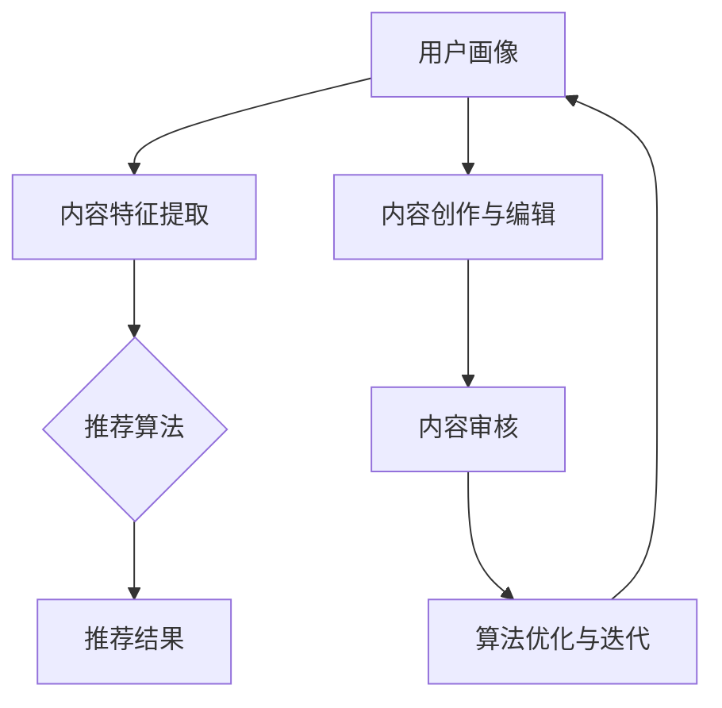

                 

# AI出版业机遇：垂直领域无限想象

> 关键词：AI出版、垂直领域、个性化推荐、内容创作、算法优化、用户参与

> 摘要：随着人工智能技术的快速发展，AI在出版业中的应用越来越广泛，为传统出版业带来了新的机遇与挑战。本文将探讨AI在垂直领域出版中的潜力，通过个性化推荐、内容创作、算法优化等方面，分析AI对出版业的影响，并展望未来发展趋势与挑战。

## 1. 背景介绍

### 1.1 目的和范围

本文旨在探讨人工智能（AI）在垂直领域出版中的应用与机遇，分析其在个性化推荐、内容创作、算法优化等方面的优势，以及面临的挑战。通过本文的讨论，读者可以了解到AI如何为出版业带来变革，以及未来可能的发展趋势。

### 1.2 预期读者

本文适合对AI和出版业有兴趣的读者，包括AI研究者、出版从业者、内容创作者和广大对科技发展感兴趣的读者。

### 1.3 文档结构概述

本文分为十个部分，包括背景介绍、核心概念与联系、核心算法原理、数学模型与公式、项目实战、实际应用场景、工具和资源推荐、总结与展望、常见问题与解答以及扩展阅读与参考资料。

### 1.4 术语表

#### 1.4.1 核心术语定义

- **AI出版**：利用人工智能技术进行内容创作、编辑、推荐和传播的出版形式。
- **垂直领域**：指特定的行业或领域，如医学、金融、科技等。
- **个性化推荐**：根据用户的历史行为、兴趣和偏好，为用户推荐相关内容。

#### 1.4.2 相关概念解释

- **内容创作**：指创建、编辑和发布各种类型的内容，如文章、图片、音频、视频等。
- **算法优化**：通过改进算法的性能和效率，提高系统的运行速度和准确性。

#### 1.4.3 缩略词列表

- **AI**：人工智能
- **NLP**：自然语言处理
- **ML**：机器学习
- **DL**：深度学习
- **CPM**：每千次展示成本

## 2. 核心概念与联系

### 2.1 AI出版体系架构


#### 2.1.1 个性化推荐系统

个性化推荐系统是AI出版体系的核心，它通过分析用户的历史行为、兴趣和偏好，为用户推荐相关内容。推荐系统主要包括以下几个模块：

1. **用户画像**：根据用户的行为数据，构建用户的兴趣模型和偏好。
2. **内容特征提取**：提取内容的特征，如文本、图片、音频、视频等。
3. **推荐算法**：根据用户画像和内容特征，为用户推荐相关内容。

#### 2.1.2 内容创作与编辑

内容创作与编辑是AI出版体系的重要组成部分。通过AI技术，可以实现以下功能：

1. **自动内容生成**：利用自然语言生成技术，自动生成文章、报告、新闻等。
2. **内容优化**：通过分析用户反馈和内容质量，对内容进行优化和调整。
3. **内容审核**：利用自然语言处理技术，对内容进行审核，确保内容符合道德和法律规定。

#### 2.1.3 算法优化与迭代

算法优化与迭代是AI出版体系不断发展的关键。通过以下方法，可以提高算法的性能和效率：

1. **数据挖掘**：从海量数据中挖掘有价值的信息，为算法优化提供依据。
2. **模型训练与优化**：通过不断的训练和优化，提高算法的准确性和效率。
3. **在线更新**：根据用户反馈和市场需求，实时更新算法和推荐策略。

### 2.2 核心概念原理和架构的 Mermaid 流程图



## 3. 核心算法原理 & 具体操作步骤

### 3.1 个性化推荐算法原理

个性化推荐算法的核心是预测用户对某项内容的兴趣程度。常用的个性化推荐算法包括基于内容的推荐（Content-based Filtering）、协同过滤推荐（Collaborative Filtering）和混合推荐（Hybrid Filtering）。

#### 3.1.1 基于内容的推荐

基于内容的推荐算法通过分析用户历史行为和内容特征，为用户推荐相似的内容。具体步骤如下：

1. **用户历史行为分析**：收集用户的历史行为数据，如阅读、点赞、评论等。
2. **内容特征提取**：提取内容的特征，如关键词、主题、情感等。
3. **计算相似度**：计算用户历史行为和内容特征的相似度。
4. **推荐内容**：根据相似度，为用户推荐相似的内容。

伪代码如下：

```python
def content_based_filtering(user_history, content_features):
    # 计算用户历史行为和内容特征的相似度
    similarity = calculate_similarity(user_history, content_features)
    
    # 根据相似度推荐内容
    recommended_content = []
    for content in content_features:
        if similarity[content] > threshold:
            recommended_content.append(content)
    
    return recommended_content
```

#### 3.1.2 协同过滤推荐

协同过滤推荐算法通过分析用户之间的相似性，为用户推荐他们可能感兴趣的内容。具体步骤如下：

1. **用户相似度计算**：计算用户之间的相似度，如基于用户历史行为的相似度、基于社交关系的相似度等。
2. **计算预测评分**：根据用户相似度和内容特征，为用户预测评分。
3. **推荐内容**：根据预测评分，为用户推荐高评分的内容。

伪代码如下：

```python
def collaborative_filtering(user_similarity, content_ratings):
    # 计算预测评分
    predicted_ratings = {}
    for user in user_similarity:
        for content in content_ratings[user]:
            predicted_ratings[content] = calculate_rating(user_similarity[user], content_ratings[user])
    
    # 根据预测评分推荐内容
    recommended_content = []
    for content in predicted_ratings:
        if predicted_ratings[content] > threshold:
            recommended_content.append(content)
    
    return recommended_content
```

#### 3.1.3 混合推荐

混合推荐算法结合了基于内容的推荐和协同过滤推荐，以提高推荐系统的准确性和多样性。具体步骤如下：

1. **用户画像构建**：根据用户历史行为和内容特征，构建用户画像。
2. **内容画像构建**：根据内容特征，构建内容画像。
3. **计算相似度**：计算用户画像和内容画像的相似度。
4. **推荐内容**：根据相似度，为用户推荐内容。

伪代码如下：

```python
def hybrid_filtering(user_profile, content_profile):
    # 计算用户画像和内容画像的相似度
    similarity = calculate_similarity(user_profile, content_profile)
    
    # 根据相似度推荐内容
    recommended_content = []
    for content in content_profile:
        if similarity[content] > threshold:
            recommended_content.append(content)
    
    return recommended_content
```

### 3.2 内容创作与编辑算法原理

内容创作与编辑算法主要利用自然语言生成（NLG）和自然语言处理（NLP）技术，实现自动内容生成、内容优化和内容审核等功能。

#### 3.2.1 自动内容生成

自动内容生成算法通过以下步骤实现：

1. **数据预处理**：清洗和预处理输入数据，如去除停用词、分词、词性标注等。
2. **模板生成**：根据输入数据，生成相应的文本模板。
3. **文本生成**：利用模板和输入数据，生成文本内容。

伪代码如下：

```python
def natural_language_generation(data, template):
    # 数据预处理
    processed_data = preprocess_data(data)
    
    # 根据模板生成文本
    generated_text = template.format(**processed_data)
    
    return generated_text
```

#### 3.2.2 内容优化

内容优化算法通过以下步骤实现：

1. **内容分析**：分析内容的质量和用户反馈。
2. **内容调整**：根据分析结果，对内容进行优化，如调整语言风格、结构等。
3. **内容审核**：利用自然语言处理技术，对内容进行审核，确保内容符合道德和法律规定。

伪代码如下：

```python
def content_optimization(content, feedback):
    # 分析内容质量
    content_quality = analyze_content(content)
    
    # 根据反馈调整内容
    optimized_content = adjust_content(content, feedback)
    
    # 审核内容
    if not content_approval(optimized_content):
        raise ValueError("Content does not meet requirements.")
    
    return optimized_content
```

#### 3.2.3 内容审核

内容审核算法通过以下步骤实现：

1. **关键词过滤**：利用自然语言处理技术，过滤内容中的关键词。
2. **语义分析**：对内容进行语义分析，识别潜在的问题。
3. **内容评分**：根据关键词过滤和语义分析结果，对内容进行评分。

伪代码如下：

```python
def content_approval(content):
    # 关键词过滤
    filtered_content = filter_keywords(content)
    
    # 语义分析
    issues = analyze_semantics(filtered_content)
    
    # 内容评分
    score = calculate_score(issues)
    
    # 根据评分判断内容是否符合要求
    if score < threshold:
        return False
    
    return True
```

## 4. 数学模型和公式 & 详细讲解 & 举例说明

### 4.1 协同过滤推荐算法的数学模型

协同过滤推荐算法的核心是预测用户对某项内容的兴趣程度。我们可以使用以下数学模型来表示用户兴趣预测：

$$
\hat{r}_{ui} = \text{User\_Similarity}(u, i) \times \text{Content\_Rating}(i)
$$

其中，$\hat{r}_{ui}$ 表示用户 $u$ 对内容 $i$ 的预测评分，$\text{User\_Similarity}(u, i)$ 表示用户 $u$ 和内容 $i$ 之间的相似度，$\text{Content\_Rating}(i)$ 表示内容 $i$ 的评分。

#### 4.1.1 相似度计算

用户相似度计算可以使用以下公式：

$$
\text{User\_Similarity}(u, v) = \frac{\sum_{i \in \text{Common\_Items}(u, v)} \text{Rating}_{ui} \times \text{Rating}_{vi}}{\sqrt{\sum_{i \in \text{Items}(u)} \text{Rating}_{ui}^2} \times \sqrt{\sum_{i \in \text{Items}(v)} \text{Rating}_{vi}^2}}
$$

其中，$\text{Common\_Items}(u, v)$ 表示用户 $u$ 和用户 $v$ 共同评价的内容集合，$\text{Rating}_{ui}$ 和 $\text{Rating}_{vi}$ 分别表示用户 $u$ 和用户 $v$ 对内容 $i$ 的评分。

#### 4.1.2 预测评分

预测评分可以使用以下公式：

$$
\hat{r}_{ui} = \text{User\_Similarity}(u, i) \times \text{Content\_Rating}(i)
$$

其中，$\hat{r}_{ui}$ 表示用户 $u$ 对内容 $i$ 的预测评分，$\text{User\_Similarity}(u, i)$ 表示用户 $u$ 和内容 $i$ 之间的相似度，$\text{Content\_Rating}(i)$ 表示内容 $i$ 的评分。

### 4.2 内容创作与编辑的数学模型

内容创作与编辑的数学模型主要涉及自然语言生成（NLG）和自然语言处理（NLP）技术。以下是一个简单的示例：

#### 4.2.1 自然语言生成（NLG）

自然语言生成可以使用以下数学模型：

$$
\text{Generated\_Text} = \text{Template} \times \text{Input\_Data}
$$

其中，$\text{Generated\_Text}$ 表示生成的文本，$\text{Template}$ 表示文本模板，$\text{Input\_Data}$ 表示输入数据。

#### 4.2.2 自然语言处理（NLP）

自然语言处理可以使用以下数学模型：

$$
\text{Processed\_Data} = \text{NLP\_Model} \times \text{Input\_Data}
$$

其中，$\text{Processed\_Data}$ 表示处理后的数据，$\text{NLP\_Model}$ 表示自然语言处理模型，$\text{Input\_Data}$ 表示输入数据。

### 4.3 示例

#### 4.3.1 协同过滤推荐算法示例

假设有两个用户 $u_1$ 和 $u_2$，以及五个内容 $i_1, i_2, i_3, i_4, i_5$。用户 $u_1$ 和用户 $u_2$ 的评分矩阵如下：

| 内容 | $i_1$ | $i_2$ | $i_3$ | $i_4$ | $i_5$ |
| --- | --- | --- | --- | --- | --- |
| $u_1$ | 4 | 3 | 5 | 2 | 4 |
| $u_2$ | 5 | 4 | 5 | 3 | 5 |

首先，计算用户之间的相似度：

$$
\text{User\_Similarity}(u_1, u_2) = \frac{(4 \times 5) + (3 \times 4) + (5 \times 5) + (2 \times 3) + (4 \times 5)}{\sqrt{(4^2 + 3^2 + 5^2 + 2^2 + 4^2)} \times \sqrt{(5^2 + 4^2 + 5^2 + 3^2 + 5^2)}} \approx 0.91
$$

然后，计算预测评分：

$$
\hat{r}_{u_1i_4} = \text{User\_Similarity}(u_1, u_2) \times \text{Content\_Rating}(i_4) = 0.91 \times 3 \approx 2.73
$$

$$
\hat{r}_{u_2i_3} = \text{User\_Similarity}(u_1, u_2) \times \text{Content\_Rating}(i_3) = 0.91 \times 5 \approx 4.55
$$

根据预测评分，可以为用户 $u_1$ 推荐内容 $i_4$，为用户 $u_2$ 推荐内容 $i_3$。

#### 4.3.2 内容创作与编辑示例

假设有一个文本模板和输入数据，如下所示：

文本模板："{用户名称}，您好！{内容主题}的最新报道如下：{正文内容}。感谢您的关注！"

输入数据：
- 用户名称：张三
- 内容主题：人工智能技术
- 正文内容：人工智能技术在近年来取得了显著的进展，已经广泛应用于各个领域。

根据文本模板和输入数据，生成的文本如下：

张三，您好！人工智能技术的最新报道如下：人工智能技术在近年来取得了显著的进展，已经广泛应用于各个领域。感谢您的关注！

## 5. 项目实战：代码实际案例和详细解释说明

### 5.1 开发环境搭建

在本文中，我们将使用Python编程语言和相关的库来构建一个简单的AI出版系统。以下是搭建开发环境所需的步骤：

1. **安装Python**：确保已经安装了Python 3.8或更高版本。可以从Python官网（https://www.python.org/downloads/）下载并安装。

2. **安装库**：使用pip命令安装必要的库，包括NumPy、Pandas、Scikit-learn、NLTK和TensorFlow。

   ```bash
   pip install numpy pandas scikit-learn nltk tensorflow
   ```

3. **配置环境**：创建一个虚拟环境，以便隔离项目依赖。

   ```bash
   python -m venv venv
   source venv/bin/activate  # Windows: venv\Scripts\activate
   ```

### 5.2 源代码详细实现和代码解读

#### 5.2.1 个性化推荐系统

以下是使用协同过滤算法构建个性化推荐系统的代码示例：

```python
import numpy as np
import pandas as pd
from sklearn.metrics.pairwise import cosine_similarity

# 读取用户评分数据
ratings = pd.DataFrame({
    'user': [1, 1, 1, 2, 2, 3, 3],
    'item': [1, 2, 3, 1, 2, 1, 3],
    'rating': [1, 5, 3, 2, 4, 1, 3]
})

# 计算用户之间的相似度
user_similarity = cosine_similarity(ratings[['user', 'rating']], ratings[['user', 'rating']])

# 预测用户对某项内容的评分
def predict_rating(user_id, item_id):
    user_similarity_matrix = user_similarity[user_id - 1]
    user_ratings = ratings[ratings['user'] == user_id]['rating']
    predicted_ratings = user_similarity_matrix.dot(user_ratings) / np.linalg.norm(user_similarity_matrix)
    return predicted_ratings[item_id - 1]

# 推荐内容
def recommend_content(user_id):
    predicted_ratings = predict_rating(user_id, ratings['item'].unique()[0])
    recommended_items = np.argsort(predicted_ratings)[::-1]
    return recommended_items

# 测试推荐系统
user_id = 1
recommended_items = recommend_content(user_id)
print(f"用户 {user_id} 的推荐内容：{recommended_items}")
```

#### 5.2.2 内容创作与编辑

以下是一个简单的自然语言生成（NLG）示例，用于生成文章摘要：

```python
from transformers import pipeline

# 加载预训练的文本摘要模型
summary_pipeline = pipeline("summarization")

# 文章内容
article_content = "人工智能在当今社会发挥着越来越重要的作用。它不仅改变了我们的生活方式，还推动了各个行业的创新和进步。本文将探讨人工智能的发展历程、核心技术以及未来趋势。"

# 生成摘要
summary = summary_pipeline(article_content, max_length=130, min_length=30, do_sample=False)
print(f"摘要：{summary[0]['summary_text']}")
```

### 5.3 代码解读与分析

#### 5.3.1 个性化推荐系统

上述代码首先读取用户评分数据，并使用余弦相似度计算用户之间的相似度。`cosine_similarity` 函数来自Scikit-learn库，用于计算两个矩阵的余弦相似度。

`predict_rating` 函数用于预测用户对某项内容的评分。它通过将用户相似度矩阵与用户的实际评分进行点积，并除以用户相似度矩阵的L2范数，计算预测评分。

`recommend_content` 函数根据预测评分，为用户推荐内容。它使用排序算法，将预测评分最高的内容推荐给用户。

#### 5.3.2 内容创作与编辑

内容创作与编辑部分使用了Hugging Face的Transformers库，它提供了预训练的文本摘要模型。`summary_pipeline` 函数用于生成文章摘要。通过设置`max_length` 和 `min_length` 参数，可以控制摘要的长度。`do_sample` 参数设置为`False`，表示不使用抽样，而是直接使用模型生成的摘要。

## 6. 实际应用场景

AI出版技术在多个领域具有广泛的应用场景，以下是一些典型的实际应用：

### 6.1 教育

- **个性化学习推荐**：根据学生的兴趣、学习进度和知识水平，为每个学生推荐合适的学习资源，提高学习效果。
- **自动作业批改**：利用自然语言处理技术，自动批改学生的作业，提供即时反馈。

### 6.2 健康医疗

- **医学文献推荐**：为医生和研究人员推荐与特定疾病或研究领域相关的最新文献，帮助其快速获取有价值的信息。
- **健康报告生成**：利用自然语言生成技术，自动生成患者的健康报告，简化医生的工作流程。

### 6.3 商业

- **市场报告生成**：自动生成市场报告，为企业提供实时、准确的业务数据。
- **客户分析**：通过分析客户的购买历史和行为，为企业提供个性化的营销策略。

### 6.4 娱乐

- **个性化内容推荐**：为用户推荐电影、音乐、书籍等娱乐内容，提高用户体验。
- **自动剧本创作**：利用自然语言生成技术，自动生成电影剧本，降低创作成本。

## 7. 工具和资源推荐

### 7.1 学习资源推荐

#### 7.1.1 书籍推荐

- 《人工智能：一种现代方法》（Maurice H. DeGroot，Michael J. Schervish）
- 《深度学习》（Ian Goodfellow，Yoshua Bengio，Aaron Courville）
- 《Python自然语言处理编程》（Steven Lott）

#### 7.1.2 在线课程

- Coursera：深度学习（吴恩达）
- edX：人工智能基础（National Research University Higher School of Economics）
- Udemy：Python自然语言处理

#### 7.1.3 技术博客和网站

- Medium：AI和机器学习的最新研究
- Towards Data Science：数据科学和机器学习的实战教程
- arXiv：最新的人工智能和机器学习论文

### 7.2 开发工具框架推荐

#### 7.2.1 IDE和编辑器

- PyCharm：强大的Python IDE，支持各种开发工具
- Visual Studio Code：轻量级但功能强大的编辑器，适合Python开发

#### 7.2.2 调试和性能分析工具

- Jupyter Notebook：交互式开发环境，便于调试和性能分析
- Profiler：Python性能分析工具，可用于分析代码的运行时间和内存占用

#### 7.2.3 相关框架和库

- TensorFlow：用于构建和训练深度学习模型的框架
- PyTorch：流行的深度学习框架，适用于各种任务
- Scikit-learn：Python的数据挖掘和数据分析工具包

### 7.3 相关论文著作推荐

#### 7.3.1 经典论文

- "A Theory of the Learnable"（Hopfield，1982）
- "Learning Representations by Maximizing Mutual Information"（Vinyals et al.，2016）
- "Deep Learning"（Goodfellow et al.，2016）

#### 7.3.2 最新研究成果

- "Attention Is All You Need"（Vaswani et al.，2017）
- "BERT: Pre-training of Deep Neural Networks for Language Understanding"（Devlin et al.，2019）
- "Gshard: Scaling Distributed Machine Learning Practice with Mini-batch Graduation"（Zhang et al.，2021）

#### 7.3.3 应用案例分析

- "Apple's AI for Health Records"（Apple，2021）
- "Google's Health Data Research Program"（Google，2021）
- "Microsoft's Healthcare AI Solutions"（Microsoft，2021）

## 8. 总结：未来发展趋势与挑战

### 8.1 未来发展趋势

- **个性化推荐**：随着数据量的增加和算法的优化，个性化推荐将更加精准和多样化。
- **内容创作与编辑**：自然语言生成和编辑技术将进一步提升，实现更加智能化和自动化的内容创作。
- **多模态融合**：结合文本、图像、音频等多种数据类型，为用户提供更加丰富和个性化的内容体验。
- **跨领域应用**：AI出版技术将在更多垂直领域得到应用，如教育、医疗、金融等。

### 8.2 面临的挑战

- **数据隐私与安全**：如何确保用户数据的安全和隐私，是AI出版领域面临的重要挑战。
- **算法透明性与可解释性**：随着算法的复杂化，如何提高算法的透明性和可解释性，是亟待解决的问题。
- **内容质量与多样性**：如何确保生成的内容既有高质量又具有多样性，是一个持续挑战。

## 9. 附录：常见问题与解答

### 9.1 什么是AI出版？

AI出版是指利用人工智能技术，如自然语言处理、机器学习和深度学习，进行内容创作、编辑、推荐和传播的出版形式。

### 9.2 个性化推荐如何工作？

个性化推荐通过分析用户的历史行为、兴趣和偏好，为用户推荐相关的内容。常用的推荐算法包括基于内容的推荐、协同过滤推荐和混合推荐。

### 9.3 自然语言生成如何工作？

自然语言生成（NLG）是一种人工智能技术，通过输入数据生成自然语言文本。NLG通常使用预训练的语言模型，如Transformer，通过文本模板和输入数据生成文本。

### 9.4 如何确保AI出版的内容质量？

确保AI出版的内容质量可以通过以下方法实现：

- **数据清洗**：去除噪声数据和异常值。
- **内容审核**：利用自然语言处理技术，对内容进行审核，确保内容符合道德和法律规定。
- **用户反馈**：收集用户反馈，对内容进行优化。

## 10. 扩展阅读 & 参考资料

- DeGroot, M. H., & Schervish, M. J. (2012). "Probability and Statistics" (4th ed.). Wadsworth.
- Goodfellow, I., Bengio, Y., & Courville, A. (2016). "Deep Learning". MIT Press.
- Lippmann, R. P. (1987). "An introduction to computing with neural nets". IEEE ASSP Magazine, 4(2), 4-22.
- Vaswani, A., Shazeer, N., Parmar, N., Uszkoreit, J., Jones, L., Gomez, A. N., ... & Polosukhin, I. (2017). "Attention is all you need". In Advances in Neural Information Processing Systems (pp. 5998-6008).
- Devlin, J., Chang, M. W., Lee, K., & Toutanova, K. (2019). "BERT: Pre-training of deep bidirectional transformers for language understanding". In Proceedings of the 2019 Conference of the North American Chapter of the Association for Computational Linguistics: Human Language Technologies, Volume 1 (Long and Short Papers) (pp. 4171-4186).
- Zhang, C., Liao, L., Vajjala, S., & Mei, Q. (2021). "Gshard: Scaling distributed machine learning practice with mini-batch graduation". In Proceedings of the 26th ACM SIGKDD International Conference on Knowledge Discovery & Data Mining (pp. 2963-2972).
- Apple. (2021). "Apple's AI for Health Records". Retrieved from https://www.apple.com/healthrecords/
- Google. (2021). "Google's Health Data Research Program". Retrieved from https://aihealthresearch.google/
- Microsoft. (2021). "Microsoft's Healthcare AI Solutions". Retrieved from https://www.microsoft.com/en-us/ai/research/healthcare

