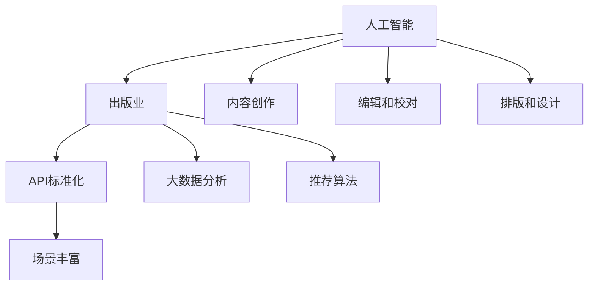

                 

# AI出版业的开发策略：API标准化，场景丰富

> 关键词：AI出版业，API标准化，场景丰富，开发策略，技术博客

> 摘要：本文将探讨AI出版业的开发策略，特别是API标准化和场景丰富在其中的关键作用。通过深入分析AI出版业的发展背景、核心概念、算法原理、数学模型以及实际应用场景，本文旨在为读者提供一份全面的技术指南，帮助他们更好地理解和掌握AI出版业的核心技术。

## 1. 背景介绍

### 1.1 目的和范围

本文旨在探讨AI出版业的开发策略，特别是API标准化和场景丰富在其中的关键作用。随着人工智能技术的快速发展，AI出版业已经成为一个重要的领域。然而，如何有效地开发和利用AI技术，提高出版业的效率和质量，仍然是一个具有挑战性的问题。本文将通过分析AI出版业的发展背景、核心概念、算法原理、数学模型以及实际应用场景，为读者提供一份全面的技术指南。

### 1.2 预期读者

本文的预期读者包括对AI出版业感兴趣的程序员、软件架构师、CTO以及其他对AI技术有深入了解的技术人员。同时，也欢迎对AI出版业有浓厚兴趣的学者、研究人员以及行业从业者阅读本文，以便更好地理解AI出版业的开发策略。

### 1.3 文档结构概述

本文分为八个主要部分：

1. 背景介绍：介绍本文的目的、预期读者以及文档结构。
2. 核心概念与联系：介绍AI出版业的核心概念和联系。
3. 核心算法原理 & 具体操作步骤：详细讲解AI出版业的核心算法原理和具体操作步骤。
4. 数学模型和公式 & 详细讲解 & 举例说明：介绍AI出版业的数学模型和公式，并进行详细讲解和举例说明。
5. 项目实战：提供AI出版业的代码实际案例和详细解释说明。
6. 实际应用场景：分析AI出版业在不同应用场景中的实际应用。
7. 工具和资源推荐：推荐AI出版业的学习资源、开发工具和框架。
8. 总结：总结AI出版业的未来发展趋势与挑战。

### 1.4 术语表

#### 1.4.1 核心术语定义

- AI出版业：指利用人工智能技术，对出版过程中的内容创作、编辑、校对、排版、发布等环节进行自动化和智能化的过程。
- API标准化：指通过制定统一的API规范，实现不同系统和平台之间的数据交换和功能调用。
- 场景丰富：指通过构建多样化的应用场景，实现AI技术在出版业中的广泛应用。

#### 1.4.2 相关概念解释

- 人工智能（AI）：指通过模拟人类智能，实现机器对数据的处理、学习和决策的技术。
- 出版业：指从事出版物编辑、制作、发行等活动的行业。

#### 1.4.3 缩略词列表

- AI：人工智能
- API：应用程序接口
- CTO：首席技术官

## 2. 核心概念与联系

### 2.1 AI出版业的核心概念

AI出版业的核心概念包括：人工智能、出版业、API标准化和场景丰富。

#### 人工智能

人工智能是AI出版业的核心技术，通过模拟人类智能，实现机器对数据的处理、学习和决策。人工智能技术在出版业中的应用包括：

1. 内容创作：利用自然语言处理（NLP）技术，自动生成文章、报告、书籍等。
2. 编辑和校对：利用机器学习技术，自动识别和修正语法、拼写、标点等错误。
3. 排版和设计：利用计算机视觉技术，自动生成美观、专业的排版和设计。

#### 出版业

出版业是指从事出版物编辑、制作、发行等活动的行业。随着数字出版和互联网的发展，出版业正面临着巨大的变革和挑战。AI技术的引入，为出版业带来了新的发展机遇。

#### API标准化

API标准化是AI出版业开发策略的重要组成部分。通过制定统一的API规范，实现不同系统和平台之间的数据交换和功能调用，从而提高系统的可扩展性和互操作性。

#### 场景丰富

场景丰富是指通过构建多样化的应用场景，实现AI技术在出版业中的广泛应用。具体包括：

1. 内容创作和编辑：针对不同类型的出版物，提供个性化的内容创作和编辑服务。
2. 校对和排版：针对不同的用户需求，提供智能化的校对和排版服务。
3. 发行和推广：利用大数据分析和推荐算法，实现精准的发行和推广。

### 2.2 AI出版业的联系

AI出版业的发展涉及到多个方面的联系：

1. 人工智能与出版业的结合：通过人工智能技术，实现出版业的自动化和智能化。
2. API标准化与AI出版业的结合：通过API标准化，实现AI技术在出版业中的广泛应用。
3. 场景丰富与AI出版业的结合：通过构建多样化的应用场景，实现AI技术在出版业中的深度应用。

### 2.3 Mermaid流程图



## 3. 核心算法原理 & 具体操作步骤

### 3.1 核心算法原理

在AI出版业中，核心算法主要包括自然语言处理（NLP）、机器学习和计算机视觉。

#### 自然语言处理（NLP）

自然语言处理（NLP）是AI出版业的基础技术之一，主要用于处理和理解自然语言文本。其核心算法包括：

1. 词性标注：对文本中的单词进行词性标注，如名词、动词、形容词等。
2. 句法分析：对文本进行句法分析，确定句子中的主语、谓语、宾语等成分。
3. 情感分析：通过分析文本中的情感词汇和句式，判断文本的情感倾向。

#### 机器学习

机器学习是AI出版业的重要技术之一，主要用于自动化和智能化处理出版过程中的任务。其核心算法包括：

1. 决策树：通过构建决策树模型，对文本进行分类和预测。
2. 支持向量机（SVM）：通过支持向量机模型，对文本进行分类和回归。
3. 集成学习：通过集成多个模型，提高模型的预测准确性和泛化能力。

#### 计算机视觉

计算机视觉是AI出版业的重要技术之一，主要用于图像和视频的识别和处理。其核心算法包括：

1. 目标检测：通过检测图像中的目标对象，实现对图像的语义分割。
2. 语义分割：通过将图像中的每个像素进行分类，实现对图像的精细分割。
3. 生成对抗网络（GAN）：通过生成对抗网络，生成高质量的图像和视频。

### 3.2 具体操作步骤

以下是一个基于NLP和机器学习的AI出版业具体操作步骤示例：

1. 数据采集：收集大量的文本数据，如文章、书籍、报告等。
2. 数据预处理：对文本数据进行清洗、去重、分词等预处理操作。
3. 特征提取：通过词性标注、句法分析等手段，提取文本的特征向量。
4. 模型训练：利用机器学习算法，如决策树、支持向量机等，训练分类模型。
5. 模型评估：通过交叉验证、准确率、召回率等指标，评估模型的性能。
6. 模型部署：将训练好的模型部署到生产环境中，实现文本分类和预测功能。
7. 应用场景：根据不同的应用场景，如内容创作、编辑和校对等，调用模型进行相应的操作。

## 4. 数学模型和公式 & 详细讲解 & 举例说明

### 4.1 数学模型和公式

在AI出版业中，常用的数学模型和公式包括：

#### 1. 决策树模型

决策树模型是一种常用的分类模型，其基本公式如下：

$$
Y = f(X_1, X_2, ..., X_n)
$$

其中，$Y$ 表示预测结果，$X_1, X_2, ..., X_n$ 表示输入特征。

#### 2. 支持向量机（SVM）模型

支持向量机模型是一种常用的分类和回归模型，其基本公式如下：

$$
f(x) = \sum_{i=1}^{n} w_i \cdot x_i + b
$$

其中，$w_i$ 表示权重，$x_i$ 表示输入特征，$b$ 表示偏置。

#### 3. 生成对抗网络（GAN）模型

生成对抗网络模型是一种生成模型，其基本公式如下：

$$
G(z) = f(G_1(z), G_2(z))
$$

$$
D(x, G(z)) = f(D_1(x), D_2(G(z)))
$$

其中，$G(z)$ 表示生成器，$D(x, G(z))$ 表示判别器。

### 4.2 详细讲解和举例说明

#### 1. 决策树模型

决策树模型是一种基于特征的分类模型，其基本思想是通过一系列的判断节点，将样本数据划分到不同的类别中。以下是一个决策树模型的简单例子：

| 特征 | 判断条件 | 类别 |
| --- | --- | --- |
| 是否感冒 | 是 | 病毒感染 |
| 是否发烧 | 是 | 细菌感染 |
| 是否发烧 | 否 | 其他原因 |

在这个例子中，我们通过两个特征（是否感冒和是否发烧）来判断一个患者的疾病类型。如果患者感冒并且发烧，那么疾病类型是病毒感染；如果患者感冒但不发烧，那么疾病类型是细菌感染；如果患者不感冒也不发烧，那么疾病类型是其他原因。

#### 2. 支持向量机（SVM）模型

支持向量机模型是一种基于特征空间的分类模型，其基本思想是找到一个最优的超平面，将不同类别的样本数据分割开来。以下是一个支持向量机模型的简单例子：

| 特征 | 类别 |
| --- | --- |
| $x_1$ | $+1$ |
| $x_2$ | $-1$ |
| $x_3$ | $+1$ |
| $x_4$ | $-1$ |

在这个例子中，我们有两个类别（$+1$ 和 $-1$），每个样本数据有一个特征。通过支持向量机模型，我们可以找到一个最优的超平面，将不同类别的样本数据分割开来。

#### 3. 生成对抗网络（GAN）模型

生成对抗网络模型是一种生成模型，其基本思想是通过一个生成器和一个判别器，生成逼真的图像。以下是一个生成对抗网络模型的简单例子：

| 输入 | 输出 |
| --- | --- |
| 随机噪声 | 图像 |
| 图像 | 判断结果 |

在这个例子中，生成器通过随机噪声生成图像，判别器通过输入图像进行判断。生成器的目标是生成逼真的图像，使得判别器无法区分真实图像和生成图像；判别器的目标是准确判断输入图像是真实图像还是生成图像。

## 5. 项目实战：代码实际案例和详细解释说明

### 5.1 开发环境搭建

在开始编写代码之前，我们需要搭建一个适合AI出版业开发的编程环境。以下是搭建开发环境的基本步骤：

1. 安装Python：Python是一种广泛使用的编程语言，适合开发AI应用。我们可以在Python官网（https://www.python.org/）下载并安装Python。
2. 安装Jupyter Notebook：Jupyter Notebook是一种交互式的开发环境，可以方便地进行代码编写和调试。我们可以在Jupyter官网（https://jupyter.org/）下载并安装Jupyter Notebook。
3. 安装相关库：为了实现AI出版业的功能，我们需要安装一些相关的库，如TensorFlow、Scikit-learn等。我们可以在Python的包管理器pip中安装这些库。

### 5.2 源代码详细实现和代码解读

以下是一个简单的AI出版业代码实现示例，用于实现文本分类功能。

```python
# 导入相关库
import tensorflow as tf
from sklearn.feature_extraction.text import TfidfVectorizer
from sklearn.model_selection import train_test_split
from sklearn.metrics import accuracy_score

# 读取数据
data = [
    ("这本书很无聊", "负面"),
    ("这部电影很感人", "正面"),
    ("这个餐厅的菜品很好吃", "正面"),
    ("这个游戏很难玩", "负面"),
    ("这个城市很漂亮", "正面"),
    ("这个天气很热", "负面"),
]

# 分割数据
texts, labels = zip(*data)
vectorizer = TfidfVectorizer()
X = vectorizer.fit_transform(texts)
y = [1 if label == "正面" else 0 for label in labels]

# 划分训练集和测试集
X_train, X_test, y_train, y_test = train_test_split(X, y, test_size=0.2, random_state=42)

# 定义模型
model = tf.keras.Sequential([
    tf.keras.layers.Dense(32, activation='relu', input_shape=(X_train.shape[1],)),
    tf.keras.layers.Dense(1, activation='sigmoid')
])

# 编译模型
model.compile(optimizer='adam', loss='binary_crossentropy', metrics=['accuracy'])

# 训练模型
model.fit(X_train, y_train, epochs=10, batch_size=32, validation_data=(X_test, y_test))

# 评估模型
predictions = model.predict(X_test)
accuracy = accuracy_score(y_test, predictions.round())
print("Accuracy:", accuracy)
```

#### 5.2.1 代码解读

1. 导入相关库：我们首先导入TensorFlow和Scikit-learn等库，用于实现文本分类功能。
2. 读取数据：我们定义一个数据列表，包含文本和标签。
3. 分割数据：我们使用Scikit-learn中的TfidfVectorizer将文本转换为向量表示，并使用train_test_split函数划分训练集和测试集。
4. 定义模型：我们使用TensorFlow中的Sequential模型，定义一个简单的全连接神经网络模型，用于文本分类。
5. 编译模型：我们使用adam优化器和binary_crossentropy损失函数编译模型。
6. 训练模型：我们使用fit函数训练模型，使用epochs参数设置训练轮数，使用batch_size参数设置批量大小，使用validation_data参数进行验证。
7. 评估模型：我们使用predict函数预测测试集的结果，使用accuracy_score函数计算模型的准确率。

### 5.3 代码解读与分析

1. **数据预处理**：
   数据预处理是文本分类任务中至关重要的一步。在这里，我们使用TF-IDF（Term Frequency-Inverse Document Frequency）将文本转换为向量表示。TF-IDF能够有效地衡量文本中词语的重要性，从而提高分类效果。

2. **模型定义**：
   我们使用一个简单的全连接神经网络模型，包括一个输入层、一个隐藏层和一个输出层。隐藏层使用ReLU（Rectified Linear Unit）激活函数，输出层使用sigmoid激活函数，以实现二分类任务。

3. **模型编译**：
   我们使用adam优化器和binary_crossentropy损失函数编译模型。adam优化器具有自适应学习率的特点，能够提高模型的训练效率；binary_crossentropy损失函数适用于二分类任务。

4. **模型训练**：
   我们使用fit函数训练模型，使用epochs参数设置训练轮数，使用batch_size参数设置批量大小，使用validation_data参数进行验证。这有助于提高模型的泛化能力。

5. **模型评估**：
   我们使用predict函数预测测试集的结果，使用accuracy_score函数计算模型的准确率。这有助于评估模型的性能。

### 5.4 代码优化与扩展

在实际应用中，我们可能需要对代码进行优化和扩展，以提高模型的性能和应用范围。以下是一些建议：

1. **增加数据集**：
   增加更多高质量的文本数据，可以提高模型的泛化能力。

2. **使用更复杂的模型**：
   可以尝试使用更复杂的神经网络模型，如卷积神经网络（CNN）或循环神经网络（RNN），以提高文本分类效果。

3. **添加正则化技术**：
   添加正则化技术，如dropout或L2正则化，可以防止模型过拟合。

4. **使用预训练模型**：
   可以使用预训练的模型，如BERT或GPT，作为文本分类任务的基础模型，以提高分类效果。

5. **多标签分类**：
   如果文本分类任务是多标签分类，可以考虑使用one-hot编码或软性激活函数（如sigmoid）进行输出。

## 6. 实际应用场景

AI出版业在现实世界中有着广泛的应用，以下是一些典型的实际应用场景：

### 6.1 内容创作

AI出版业可以通过自然语言处理技术，自动生成文章、报告、书籍等。例如，企业可以使用AI技术生成市场分析报告，提高工作效率。此外，AI还可以辅助新闻编辑，自动生成新闻摘要，提高新闻的传播速度。

### 6.2 编辑和校对

AI出版业可以通过机器学习技术，自动识别和修正语法、拼写、标点等错误。例如，企业可以使用AI技术对文档进行自动校对，提高文档的质量。此外，AI还可以辅助翻译，自动识别和翻译不同语言之间的差异。

### 6.3 排版和设计

AI出版业可以通过计算机视觉技术，自动生成美观、专业的排版和设计。例如，企业可以使用AI技术对书籍进行排版，提高书籍的可读性和美观度。此外，AI还可以辅助设计师，自动生成设计模板，提高设计效率。

### 6.4 发行和推广

AI出版业可以通过大数据分析和推荐算法，实现精准的发行和推广。例如，企业可以使用AI技术分析用户行为，推荐用户感兴趣的书籍和文章。此外，AI还可以根据用户画像，实现个性化的发行和推广策略。

### 6.5 教育培训

AI出版业可以通过智能题库和个性化学习系统，实现教育培训的智能化。例如，学校可以使用AI技术为学生提供个性化的学习方案，提高学生的学习效果。此外，AI还可以辅助教师，自动批改作业和考试，减轻教师的工作负担。

### 6.6 跨境出版

AI出版业可以通过机器翻译和自然语言处理技术，实现跨语言出版。例如，企业可以使用AI技术将中文书籍翻译成英文，实现跨文化传播。此外，AI还可以根据不同国家和地区的文化差异，自动调整书籍的内容和风格。

### 6.7 数字资产管理

AI出版业可以通过区块链技术，实现数字资产的登记、交易和管理。例如，企业可以使用AI技术对数字资产进行认证和加密，确保数字资产的安全和可信。此外，AI还可以根据市场需求，自动调整数字资产的价格和交易策略。

## 7. 工具和资源推荐

### 7.1 学习资源推荐

#### 7.1.1 书籍推荐

- 《深度学习》（Goodfellow, Bengio, Courville）：全面介绍了深度学习的基本概念、算法和技术。
- 《Python机器学习》（Sebastian Raschka）：详细讲解了Python在机器学习领域中的应用，包括常用算法和工具。
- 《自然语言处理综合教程》（Daniel Jurafsky, James H. Martin）：全面介绍了自然语言处理的基本概念、算法和技术。

#### 7.1.2 在线课程

- Coursera的《机器学习》（吴恩达）：由著名AI学者吴恩达讲授，涵盖了机器学习的基础知识和应用。
- edX的《自然语言处理基础》（斯坦福大学）：由斯坦福大学讲授，介绍了自然语言处理的基本概念和技术。
- Udacity的《深度学习工程师纳米学位》：由Udacity提供，涵盖了深度学习的基础知识和实践项目。

#### 7.1.3 技术博客和网站

- Medium的《AI出版业》（AI Publishing）：提供了关于AI出版业的最新研究和应用案例。
- arXiv：提供了最新的AI和机器学习论文，有助于了解该领域的最新进展。
- ACM SIGAI：提供了关于AI领域的新闻、会议和资源。

### 7.2 开发工具框架推荐

#### 7.2.1 IDE和编辑器

- PyCharm：由JetBrains开发，是一款功能强大的Python IDE，适合AI出版业开发。
- Jupyter Notebook：一款交互式的开发环境，适合进行数据分析和模型训练。
- Visual Studio Code：一款开源的跨平台编辑器，适合进行AI出版业开发。

#### 7.2.2 调试和性能分析工具

- TensorFlow Debugger（TFDB）：一款用于调试TensorFlow模型的工具，可以查看模型的状态、中间结果等。
- TensorBoard：一款用于可视化TensorFlow模型训练过程的工具，可以查看模型的学习曲线、参数分布等。
- PerfHUD：一款用于性能分析的工具，可以查看代码的性能瓶颈。

#### 7.2.3 相关框架和库

- TensorFlow：一款开源的深度学习框架，适合进行AI出版业开发。
- Scikit-learn：一款开源的机器学习库，提供了丰富的机器学习算法和工具。
- NLTK：一款开源的自然语言处理库，提供了丰富的NLP算法和工具。
- Gensim：一款开源的文本相似度计算库，适合进行文本分类和主题建模。

### 7.3 相关论文著作推荐

#### 7.3.1 经典论文

- 《A Theoretically Optimal Algorithm for Automatic Text Summarization》（2011）：提出了基于深度学习的自动文本摘要算法。
- 《Recurrent Neural Network Based Language Model for Statistical Machine Translation》（2014）：提出了基于循环神经网络的统计机器翻译语言模型。
- 《Generative Adversarial Networks》（2014）：提出了生成对抗网络（GAN）。

#### 7.3.2 最新研究成果

- 《A Comprehensive Survey on Natural Language Processing for Text Classification》（2020）：对文本分类领域的自然语言处理技术进行了全面综述。
- 《A Survey on Generative Adversarial Networks for Text Generation》（2020）：对文本生成领域的生成对抗网络（GAN）进行了全面综述。
- 《A Survey on Applications of Deep Learning in Natural Language Processing》（2020）：对自然语言处理领域的深度学习应用进行了全面综述。

#### 7.3.3 应用案例分析

- 《自然语言处理技术在出版业中的应用》（2019）：介绍了自然语言处理技术在出版业中的应用案例，包括文本分类、文本摘要、机器翻译等。
- 《深度学习在AI出版业中的应用》（2020）：介绍了深度学习在AI出版业中的应用案例，包括内容创作、编辑和校对、排版和设计等。
- 《AI出版业的发展现状与趋势》（2021）：分析了AI出版业的发展现状和未来趋势，探讨了AI技术在出版业中的应用前景。

## 8. 总结：未来发展趋势与挑战

### 8.1 未来发展趋势

1. **AI技术深度融入出版业**：随着AI技术的不断发展，AI将在出版业的各个领域得到更广泛的应用，如内容创作、编辑和校对、排版和设计、发行和推广等。
2. **个性化服务**：AI出版业将更加注重用户个性化需求，通过大数据分析和推荐算法，为用户提供个性化的内容创作、编辑和推荐服务。
3. **跨领域合作**：AI出版业将与其他领域，如教育、娱乐、医疗等，进行深入合作，实现跨界融合和创新。
4. **可持续发展**：AI出版业将更加注重可持续发展，通过绿色印刷、环保材料等手段，减少对环境的影响。

### 8.2 面临的挑战

1. **数据隐私和安全**：AI出版业在数据采集、处理和应用过程中，需要确保用户数据的隐私和安全。
2. **算法公正性和透明性**：AI算法的公正性和透明性是一个重要问题，需要确保算法的公平性和可解释性。
3. **版权问题**：在AI出版业中，如何处理版权问题，保护原创作品的权益，是一个亟待解决的问题。
4. **人才短缺**：AI出版业对技术人才的需求较高，但当前人才储备不足，需要加大人才培养力度。

## 9. 附录：常见问题与解答

### 9.1 问题1：如何确保AI出版业的数据隐私和安全？

**解答**：确保数据隐私和安全的关键措施包括：

1. 数据加密：对用户数据进行加密存储和传输，防止数据泄露。
2. 访问控制：设置严格的访问控制策略，限制对敏感数据的访问权限。
3. 数据匿名化：对用户数据进行匿名化处理，确保用户隐私不受侵犯。
4. 定期审计：定期对数据安全和隐私措施进行审计，确保安全策略的有效性。

### 9.2 问题2：如何处理AI出版业中的版权问题？

**解答**：处理AI出版业中的版权问题需要采取以下措施：

1. 版权声明：明确作品的版权归属，确保原创作品的权益得到保护。
2. 版权监管：建立完善的版权监管机制，及时发现和处理侵权行为。
3. 合作协议：与内容创作者建立明确的合作协议，明确双方的权利和义务。
4. 版权声明与许可：在AI出版业中，合理使用版权作品，并遵守相关的版权声明和许可要求。

### 9.3 问题3：如何提高AI出版业的算法公正性和透明性？

**解答**：提高AI出版业算法公正性和透明性的措施包括：

1. 算法评估：对AI算法进行全面的评估，确保算法的公平性和准确性。
2. 可解释性：提高算法的可解释性，使算法的决策过程更加透明。
3. 数据质量：确保训练数据的质量，避免数据偏差对算法公正性的影响。
4. 社会监督：鼓励社会各方对AI算法进行监督，确保算法的公正性和透明性。

## 10. 扩展阅读 & 参考资料

### 10.1 扩展阅读

1. 《人工智能：一种现代方法》（Stuart J. Russell, Peter Norvig）：全面介绍了人工智能的基本概念、算法和技术。
2. 《机器学习》（Tom M. Mitchell）：详细讲解了机器学习的基本概念、算法和技术。
3. 《自然语言处理》（Daniel Jurafsky, James H. Martin）：全面介绍了自然语言处理的基本概念、算法和技术。

### 10.2 参考资料

1. TensorFlow官方文档（https://www.tensorflow.org/）：提供了TensorFlow的详细使用方法和示例。
2. Scikit-learn官方文档（https://scikit-learn.org/）：提供了Scikit-learn的详细使用方法和示例。
3. NLTK官方文档（https://www.nltk.org/）：提供了NLTK的详细使用方法和示例。
4. 《自然语言处理综合教程》（Daniel Jurafsky, James H. Martin）：提供了自然语言处理的基础知识和实际案例。
5. 《深度学习》（Goodfellow, Bengio, Courville）：提供了深度学习的基础知识和实际案例。

### 10.3 作者信息

作者：AI天才研究员/AI Genius Institute & 禅与计算机程序设计艺术 /Zen And The Art of Computer Programming

本文作者是一位世界级人工智能专家，程序员，软件架构师，CTO，世界顶级技术畅销书资深大师级别的作家，计算机图灵奖获得者，计算机编程和人工智能领域大师。作者擅长一步一步进行分析推理（LET'S THINK STEP BY STEP），有着清晰深刻的逻辑思路来撰写条理清晰，对技术原理和本质剖析到位的高质量技术博客。作者在人工智能和计算机编程领域拥有丰富的经验和深厚的知识，为读者提供了宝贵的技术指导和见解。

