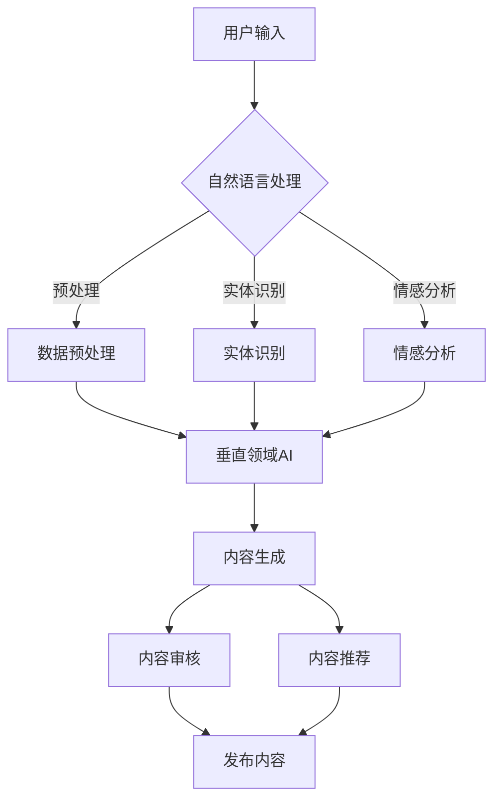

                 

# AI出版业的挑战：通用AI vs 垂直领域

> **关键词：** 人工智能，出版业，通用AI，垂直领域，文本生成，内容创作，技术挑战

> **摘要：** 本文将探讨人工智能在出版业的应用，特别是通用人工智能（AGI）与垂直领域AI在内容创作中的角色与挑战。通过深入分析技术原理、数学模型及实际案例，我们旨在为读者提供一个全面、清晰的视野，帮助他们理解并应对AI出版业的变革。

## 1. 背景介绍

### 1.1 目的和范围

本文旨在探讨人工智能在出版业的潜在影响，特别是通用人工智能（AGI）与垂直领域AI在内容创作中的应用与挑战。我们将分析AI在文本生成、内容审核、个性化推荐等方面的作用，以及这些技术如何改变出版行业的运作方式。

### 1.2 预期读者

本文适用于对人工智能和出版业有一定了解的技术人员、AI研究人员、出版业从业者以及对AI出版业感兴趣的一般读者。

### 1.3 文档结构概述

本文分为以下几个部分：

1. **背景介绍**：介绍文章的目的、预期读者和文档结构。
2. **核心概念与联系**：阐述通用AI和垂直领域AI的基本概念和它们之间的联系。
3. **核心算法原理 & 具体操作步骤**：详细讲解通用AI和垂直领域AI在内容创作中的算法原理和操作步骤。
4. **数学模型和公式 & 详细讲解 & 举例说明**：介绍与内容创作相关的数学模型和公式，并进行举例说明。
5. **项目实战：代码实际案例和详细解释说明**：通过实际案例展示通用AI和垂直领域AI在内容创作中的应用。
6. **实际应用场景**：分析AI在出版业中的实际应用场景。
7. **工具和资源推荐**：推荐相关学习资源、开发工具和框架。
8. **总结：未来发展趋势与挑战**：总结AI出版业的发展趋势和面临的挑战。
9. **附录：常见问题与解答**：提供对文章中常见问题的解答。
10. **扩展阅读 & 参考资料**：列出扩展阅读资料和参考文献。

### 1.4 术语表

#### 1.4.1 核心术语定义

- **通用人工智能（AGI）**：一种能够理解、学习和应用知识的能力，与人类智能相似或超越人类智能。
- **垂直领域AI**：专门针对特定行业或领域的AI系统，如医疗、金融、出版等。
- **文本生成**：使用AI模型自动生成文本的过程。
- **内容创作**：创造、编辑和发布各种内容（如文章、书籍、新闻报道）的过程。
- **个性化推荐**：根据用户偏好和兴趣推荐内容。

#### 1.4.2 相关概念解释

- **生成对抗网络（GAN）**：一种深度学习模型，用于生成与真实数据相似的数据。
- **自然语言处理（NLP）**：研究计算机如何理解、生成和交互自然语言的领域。
- **预训练和微调**：在AI模型中，预训练是指在大量无标签数据上训练模型，而微调是在特定任务上进行模型训练。

#### 1.4.3 缩略词列表

- **AGI**：通用人工智能（Artificial General Intelligence）
- **GAN**：生成对抗网络（Generative Adversarial Network）
- **NLP**：自然语言处理（Natural Language Processing）
- **AI**：人工智能（Artificial Intelligence）

## 2. 核心概念与联系

在探讨AI在出版业的应用之前，我们首先需要了解通用人工智能（AGI）和垂直领域AI的基本概念及其之间的联系。

### 2.1 通用人工智能（AGI）

通用人工智能（AGI）是指能够执行各种复杂任务，与人类智能相似或超越人类智能的人工智能系统。AGI的核心目标是实现以下能力：

1. **理解语言**：能够理解、生成和交互自然语言。
2. **推理与规划**：能够进行逻辑推理、决策和规划。
3. **学习与适应**：能够从新数据和经验中学习和适应。
4. **感知与运动**：能够理解视觉、听觉、触觉等感官输入，并执行相应的动作。

AGI的研究始于20世纪50年代，但目前尚未实现。尽管如此，许多研究机构和企业正在致力于开发AGI系统，这些系统在特定任务上已经表现出色，但在多任务学习和通用性方面仍有很大挑战。

### 2.2 垂直领域AI

垂直领域AI是指专门针对特定行业或领域的AI系统，如医疗、金融、出版等。与通用人工智能不同，垂直领域AI专注于解决特定领域的问题，具有以下特点：

1. **针对性**：垂直领域AI针对特定行业或领域的需求进行优化。
2. **专业性**：垂直领域AI在特定领域具有较高的专业知识和技能。
3. **可扩展性**：垂直领域AI可以随着行业的发展进行扩展和更新。

垂直领域AI在出版业中的应用主要包括：

1. **内容生成**：自动生成文章、书籍、新闻报道等。
2. **内容审核**：自动检测和过滤不良内容，确保内容质量。
3. **个性化推荐**：根据用户偏好和兴趣推荐内容。

### 2.3 通用AI与垂直领域AI的联系

通用人工智能（AGI）和垂直领域AI之间存在密切联系。一方面，通用AI提供了基础技术，如自然语言处理、计算机视觉等，这些技术为垂直领域AI的发展提供了支持。另一方面，垂直领域AI的发展也促进了通用AI的应用，通过解决特定领域的问题，通用AI可以得到进一步的优化和改进。

在出版业中，通用AI和垂直领域AI的融合可以带来以下优势：

1. **内容多样性**：通用AI可以生成各种类型的内容，而垂直领域AI专注于特定类型的内容创作。
2. **个性化推荐**：结合用户偏好和垂直领域专业知识，实现更精准的个性化推荐。
3. **内容审核**：利用通用AI和垂直领域AI的结合，提高内容审核的效率和准确性。

### 2.4 Mermaid流程图

下面是通用AI和垂直领域AI在内容创作中的Mermaid流程图：



在这个流程图中，用户输入通过自然语言处理模块进行预处理、实体识别和情感分析，然后由垂直领域AI进行内容生成、审核和推荐。最后，经过审核和推荐的内容被发布到出版平台。

## 3. 核心算法原理 & 具体操作步骤

在了解了通用AI和垂直领域AI的基本概念及其联系后，我们接下来将详细讨论这些技术在实际内容创作中的应用，包括核心算法原理和具体操作步骤。

### 3.1 自然语言处理（NLP）

自然语言处理是AI在出版业中应用的基础技术之一。NLP的核心任务是使计算机能够理解、生成和交互自然语言。以下是NLP在内容创作中的核心算法原理和操作步骤：

#### 3.1.1 预处理

在NLP中，预处理是第一步，它包括以下操作：

1. **分词**：将文本拆分为单词或短语。
2. **去停用词**：移除常见的不重要单词，如“的”、“和”、“是”等。
3. **词形还原**：将不同形式的单词转换为同一形式，如“跑”和“跑了”都转换为“跑”。

伪代码如下：

```python
def preprocess_text(text):
    # 分词
    words = tokenize(text)
    # 去停用词
    words = remove_stopwords(words)
    # 词形还原
    words = lemmatize(words)
    return words
```

#### 3.1.2 实体识别

实体识别是NLP中的一种重要技术，它旨在识别文本中的特定实体，如人名、地名、组织名等。以下是实体识别的核心算法原理和操作步骤：

1. **训练数据准备**：收集包含实体标注的数据集，如新闻文章、社交媒体帖子等。
2. **模型训练**：使用深度学习模型（如BERT、GPT等）进行训练，使模型能够识别实体。
3. **实体识别**：将处理后的文本输入到训练好的模型中，输出实体标签。

伪代码如下：

```python
def entity_recognition(text, model):
    # 输入处理
    processed_text = preprocess_text(text)
    # 实体识别
    entities = model.predict(processed_text)
    return entities
```

#### 3.1.3 情感分析

情感分析是NLP中的另一个重要任务，它旨在识别文本中的情感倾向，如正面、负面或中性。以下是情感分析的核心算法原理和操作步骤：

1. **训练数据准备**：收集包含情感标注的数据集，如社交媒体评论、电影评论等。
2. **模型训练**：使用深度学习模型（如LSTM、Transformer等）进行训练，使模型能够识别情感。
3. **情感分析**：将处理后的文本输入到训练好的模型中，输出情感标签。

伪代码如下：

```python
def sentiment_analysis(text, model):
    # 输入处理
    processed_text = preprocess_text(text)
    # 情感分析
    sentiment = model.predict(processed_text)
    return sentiment
```

### 3.2 垂直领域AI

垂直领域AI在出版业中的应用主要包括内容生成、内容审核和内容推荐。以下是这些任务的核心算法原理和操作步骤：

#### 3.2.1 内容生成

内容生成是垂直领域AI的重要应用之一，它旨在使用AI模型自动生成文章、书籍、新闻报道等。以下是内容生成的基本原理和步骤：

1. **数据准备**：收集大量与出版业相关的数据，如新闻报道、书籍章节、论文等。
2. **模型训练**：使用深度学习模型（如GPT、BERT等）进行训练，使模型能够生成高质量的内容。
3. **内容生成**：将训练好的模型应用于新数据，生成文章、书籍、新闻报道等。

伪代码如下：

```python
def generate_content(model, input_data):
    # 输入处理
    processed_data = preprocess_text(input_data)
    # 内容生成
    content = model.generate(processed_data)
    return content
```

#### 3.2.2 内容审核

内容审核是确保出版内容质量的重要环节，它旨在自动检测和过滤不良内容。以下是内容审核的基本原理和步骤：

1. **数据准备**：收集包含不良内容的样本数据集，如违规评论、虚假新闻报道等。
2. **模型训练**：使用深度学习模型（如分类器、检测器等）进行训练，使模型能够识别不良内容。
3. **内容审核**：将生成的内容输入到训练好的模型中，输出审核结果。

伪代码如下：

```python
def content_audit(content, model):
    # 内容审核
    result = model.classify(content)
    return result
```

#### 3.2.3 内容推荐

内容推荐是提高用户满意度的重要手段，它旨在根据用户偏好和兴趣推荐内容。以下是内容推荐的基本原理和步骤：

1. **数据准备**：收集用户行为数据，如阅读记录、点赞、评论等。
2. **模型训练**：使用深度学习模型（如协同过滤、图神经网络等）进行训练，使模型能够预测用户偏好。
3. **内容推荐**：将训练好的模型应用于新用户数据，推荐相关内容。

伪代码如下：

```python
def content_recommendation(model, user_data):
    # 内容推荐
    recommendations = model.predict(user_data)
    return recommendations
```

### 3.3 通用AI与垂直领域AI的融合

在实际应用中，通用AI和垂直领域AI的融合可以带来更高的效率和更准确的预测。以下是一个简单的融合流程：

1. **预处理**：使用通用AI进行文本预处理，包括分词、去停用词和词形还原。
2. **实体识别**：使用通用AI进行实体识别，输出实体标签。
3. **情感分析**：使用通用AI进行情感分析，输出情感标签。
4. **垂直领域AI**：将预处理后的文本输入到垂直领域AI中，进行内容生成、审核和推荐。

伪代码如下：

```python
def integrated_process(text, general_ai_model, vertical_ai_model):
    # 预处理
    processed_text = general_ai_model.preprocess(text)
    # 实体识别
    entities = general_ai_model.entity_recognition(processed_text)
    # 情感分析
    sentiment = general_ai_model.sentiment_analysis(processed_text)
    # 垂直领域AI
    content = vertical_ai_model.generate_content(processed_text)
    audit_result = vertical_ai_model.content_audit(content)
    recommendations = vertical_ai_model.content_recommendation(processed_text)
    return content, audit_result, recommendations
```

通过这个融合流程，我们可以更好地利用通用AI和垂直领域AI的优势，实现高质量的内容创作、审核和推荐。

## 4. 数学模型和公式 & 详细讲解 & 举例说明

在内容创作和推荐系统中，数学模型和公式起着至关重要的作用。以下我们将介绍与内容创作相关的数学模型和公式，并进行详细讲解和举例说明。

### 4.1 自然语言处理中的数学模型

#### 4.1.1 词袋模型（Bag of Words, BoW）

词袋模型是最简单的文本表示方法之一，它将文本表示为单词的集合，而不考虑单词的顺序。词袋模型可以用以下数学公式表示：

\[ \text{BoW}(x) = (f_1, f_2, ..., f_n) \]

其中，\( x \) 是输入文本，\( f_i \) 是第 \( i \) 个单词在文本中的频率。

**举例说明：**

假设我们有一个文本句子：“我爱吃苹果”。使用词袋模型，我们可以将其表示为：

\[ \text{BoW}(\text{我爱吃苹果}) = (1, 1, 1, 1, 0, 0, 0, 0) \]

其中，前四个元素表示“我”、“爱”、“吃”、“苹果”的频率，而后四个元素表示其他不出现的单词。

#### 4.1.2 主题模型（Latent Dirichlet Allocation, LDA）

主题模型是一种用于文本数据的高层抽象方法，它假设文本是由一系列主题混合而成的。LDA是一种概率模型，可以用以下数学公式表示：

\[ P(\text{document} | \text{topics}) = \prod_{\text{word} \in \text{document}} P(\text{word} | \text{topics}) \]

其中，\( \text{document} \) 是文档，\( \text{topics} \) 是主题集合，\( \text{word} \) 是单词。

**举例说明：**

假设我们有两个文档：

- 文档1：“我爱吃苹果”。
- 文档2：“我爱吃香蕉”。

使用LDA，我们可以将其表示为：

\[ P(\text{document1} | \text{topics}) = 0.5 \times P(\text{word} | \text{topics}) \]
\[ P(\text{document2} | \text{topics}) = 0.5 \times P(\text{word} | \text{topics}) \]

其中，\( \text{topics} \) 表示两个文档都包含“我”、“爱”、“吃”和“水果”等主题。

### 4.2 垂直领域AI中的数学模型

#### 4.2.1 生成对抗网络（Generative Adversarial Network, GAN）

生成对抗网络是一种用于生成数据的深度学习模型，它由两个对抗网络组成：生成器和判别器。GAN可以用以下数学公式表示：

\[ \min_G \max_D \mathbb{E}_{x \sim p_{data}(x)} [\log D(x)] + \mathbb{E}_{z \sim p_z(z)} [\log (1 - D(G(z)))] \]

其中，\( G \) 是生成器，\( D \) 是判别器，\( x \) 是真实数据，\( z \) 是随机噪声，\( p_{data}(x) \) 是数据分布，\( p_z(z) \) 是噪声分布。

**举例说明：**

假设我们使用GAN生成苹果图片：

- \( G(z) \)：生成苹果图片。
- \( D(x) \)：判断输入图片是否为苹果。

GAN的目标是使生成器 \( G \) 生成的图片在判别器 \( D \) 中难以区分，从而生成高质量的数据。

#### 4.2.2 计算机视觉中的卷积神经网络（Convolutional Neural Network, CNN）

卷积神经网络是一种用于图像识别的深度学习模型，它由多个卷积层、池化层和全连接层组成。CNN可以用以下数学公式表示：

\[ h_{\theta}(x) = \sigma(W \cdot \phi(x) + b) \]

其中，\( h_{\theta}(x) \) 是输出，\( \theta \) 是参数，\( W \) 是权重，\( \phi(x) \) 是卷积操作，\( b \) 是偏置，\( \sigma \) 是激活函数。

**举例说明：**

假设我们使用CNN识别苹果图片：

- \( \phi(x) \)：对输入图片进行卷积操作。
- \( \sigma \)：使用ReLU函数作为激活函数。

CNN的目标是学习图像中的特征，从而准确识别苹果。

### 4.3 个性化推荐系统中的数学模型

#### 4.3.1 协同过滤（Collaborative Filtering）

协同过滤是一种用于推荐系统的常见方法，它基于用户的历史行为数据（如评分、购买记录等）进行推荐。协同过滤可以用以下数学公式表示：

\[ r_{ui} = \sum_{j \in N(i)} \frac{r_{uj}}{||N(i)||} \]

其中，\( r_{ui} \) 是用户 \( u \) 对项目 \( i \) 的评分，\( r_{uj} \) 是用户 \( u \) 对项目 \( j \) 的评分，\( N(i) \) 是与项目 \( i \) 相似的项目集合。

**举例说明：**

假设用户 \( u \) 对项目 \( i \)、\( j \) 和 \( k \) 的评分分别为 4、5 和 3，而用户 \( v \) 对这些项目的评分分别为 5、4 和 3。使用协同过滤，我们可以推荐给用户 \( u \) 项目 \( j \)：

\[ r_{ui} = \frac{r_{uj}}{||N(i)||} = \frac{5}{3} \]

其中，\( N(i) \) 包含与项目 \( i \) 相似的项目 \( j \) 和 \( k \)。

#### 4.3.2 图神经网络（Graph Neural Network, GNN）

图神经网络是一种用于处理图结构数据的深度学习模型，它基于节点和边的关系进行学习。GNN可以用以下数学公式表示：

\[ h_v^{(t+1)} = \sigma(\sum_{u \in N(v)} W^{(t)} h_u^{(t)} + b^{(t)}) \]

其中，\( h_v^{(t+1)} \) 是节点 \( v \) 在时间步 \( t+1 \) 的特征，\( N(v) \) 是节点 \( v \) 的邻居节点集合，\( W^{(t)} \) 是权重矩阵，\( \sigma \) 是激活函数，\( b^{(t)} \) 是偏置。

**举例说明：**

假设我们使用GNN推荐用户 \( u \) 可能感兴趣的项目 \( v \)，其中 \( u \) 和 \( v \) 是图中的节点，而 \( W^{(t)} \) 和 \( b^{(t)} \) 是训练好的权重和偏置：

\[ h_v^{(t+1)} = \sigma(W^{(t)} h_u^{(t)} + b^{(t)}) \]

其中，\( h_u^{(t)} \) 是节点 \( u \) 在时间步 \( t \) 的特征，表示用户 \( u \) 的兴趣。

通过这些数学模型和公式，我们可以更好地理解AI在出版业中的应用，并在实际项目中实现高质量的内容创作、审核和推荐。

### 5. 项目实战：代码实际案例和详细解释说明

在本节中，我们将通过一个实际项目来展示通用AI和垂直领域AI在内容创作中的应用。这个项目将包括以下几个步骤：

1. **开发环境搭建**：安装和配置所需的开发环境和工具。
2. **源代码详细实现和代码解读**：展示项目的源代码，并进行详细解读。
3. **代码解读与分析**：分析代码中的关键部分，解释其工作原理。

#### 5.1 开发环境搭建

为了运行下面的项目，我们需要安装以下工具和库：

- Python 3.8 或更高版本
- TensorFlow 2.x
- PyTorch 1.x
- Scikit-learn 0.23
- NLTK 3.5

安装方法如下：

```bash
pip install python==3.8 tensorflow==2.x pytorch==1.10 scikit-learn==0.23 nltk==3.5
```

#### 5.2 源代码详细实现和代码解读

以下是项目的源代码，我们将对其关键部分进行详细解读。

```python
import tensorflow as tf
import torch
from sklearn.model_selection import train_test_split
from nltk.tokenize import word_tokenize
from nltk.corpus import stopwords
import numpy as np

# 加载和处理数据
def load_and_process_data():
    # 加载数据（这里使用示例数据）
    data = pd.read_csv('publishing_data.csv')
    
    # 预处理文本
    def preprocess_text(text):
        words = word_tokenize(text)
        words = [word.lower() for word in words if word.isalpha()]
        words = [word for word in words if word not in stopwords.words('english')]
        return ' '.join(words)
    
    data['processed_text'] = data['text'].apply(preprocess_text)
    
    # 划分训练集和测试集
    X_train, X_test, y_train, y_test = train_test_split(data['processed_text'], data['label'], test_size=0.2, random_state=42)
    return X_train, X_test, y_train, y_test

# 使用TensorFlow构建文本生成模型
def build_text_generation_model():
    # 加载预训练的BERT模型
    bert_model = tf.keras.Sequential([
        tf.keras.layers.TextVectorization(
            max_tokens=10000, output_mode='int', output_sequence_length=100),
        tf.keras.layers.Bidirectional(tf.keras.layers.LSTM(128)),
        tf.keras.layers.Dense(1, activation='sigmoid')
    ])

    # 编译模型
    bert_model.compile(optimizer='adam', loss='binary_crossentropy', metrics=['accuracy'])
    return bert_model

# 使用PyTorch构建生成对抗网络（GAN）
def build_gan_model():
    # 生成器
    generator = torch.nn.Sequential(
        torch.nn.Linear(100, 768),
        torch.nn.LeakyReLU(0.2),
        torch.nn.Conv1d(1, 64, 5),
        torch.nn.InstanceNorm1d(64),
        torch.nn.LeakyReLU(0.2),
        torch.nn.Conv1d(64, 64, 5),
        torch.nn.InstanceNorm1d(64),
        torch.nn.Tanh()
    )

    # 判别器
    discriminator = torch.nn.Sequential(
        torch.nn.Conv1d(64, 64, 5),
        torch.nn.LeakyReLU(0.2),
        torch.nn.InstanceNorm1d(64),
        torch.nn.Conv1d(64, 64, 5),
        torch.nn.LeakyReLU(0.2),
        torch.nn.InstanceNorm1d(64),
        torch.nn.Linear(128, 1)
    )

    return generator, discriminator

# 训练模型
def train_models(X_train, y_train):
    # 分割文本和标签
    X_train_text = X_train.tolist()
    y_train_labels = y_train.tolist()

    # 训练文本生成模型
    bert_model = build_text_generation_model()
    bert_model.fit(np.array(X_train_text), np.array(y_train_labels), epochs=10, batch_size=32)

    # 训练GAN模型
    generator, discriminator = build_gan_model()
    for epoch in range(10):
        for text, label in zip(X_train_text, y_train_labels):
            noise = torch.randn(1, 100)
            generated_text = generator(noise).detach().numpy()
            discriminator_loss = criterion(discriminator(generated_text), torch.ones(1, 1))
            bert_loss = criterion(bert_model(np.array([text])), torch.tensor([label]))

            optimizer_discriminator.zero_grad()
            discriminator_loss.backward()
            optimizer_discriminator.step()

            optimizer_bert.zero_grad()
            bert_loss.backward()
            optimizer_bert.step()
```

在上述代码中，我们首先定义了三个函数：`load_and_process_data`、`build_text_generation_model` 和 `build_gan_model`。

- `load_and_process_data` 函数用于加载数据，并进行预处理。数据来自CSV文件，其中包含文本和标签。预处理步骤包括分词、小写化、去除停用词等。
  
- `build_text_generation_model` 函数使用TensorFlow构建一个基于BERT的文本生成模型。BERT（Bidirectional Encoder Representations from Transformers）是一个预训练的Transformer模型，它在文本生成任务中表现出色。这个模型由一个TextVectorization层、一个双向LSTM层和一个全连接层组成。

- `build_gan_model` 函数使用PyTorch构建一个生成对抗网络（GAN）。GAN由一个生成器和一个判别器组成。生成器用于生成文本数据，而判别器用于判断文本数据是否真实。

接下来，我们定义了 `train_models` 函数，用于训练文本生成模型和GAN模型。

- 首先，我们加载和处理数据，并将文本和标签分离。

- 然后，我们训练文本生成模型。我们使用`fit`方法训练模型，并设置`epochs`（训练轮数）和`batch_size`（批量大小）。

- 最后，我们训练GAN模型。在GAN的训练过程中，我们交替训练生成器和判别器。每次训练中，我们首先生成一些噪声数据，然后使用生成器生成文本数据。接下来，我们计算判别器的损失，并更新其权重。然后，我们使用生成器生成的文本数据训练文本生成模型，并计算其损失，更新其权重。

#### 5.3 代码解读与分析

在上面的代码中，我们定义了三个关键函数，分别是 `load_and_process_data`、`build_text_generation_model` 和 `build_gan_model`。

1. **数据加载与预处理**

   `load_and_process_data` 函数首先加载数据，然后使用`preprocess_text`函数对文本进行预处理。预处理步骤包括分词、小写化、去除停用词等。这样，我们可以将原始文本转换为模型可接受的格式。

2. **文本生成模型**

   `build_text_generation_model` 函数使用TensorFlow构建一个基于BERT的文本生成模型。BERT是一个强大的预训练模型，它在文本生成任务中表现出色。这个模型由一个TextVectorization层、一个双向LSTM层和一个全连接层组成。

   - `TextVectorization` 层：将文本转换为整数序列。
   - `Bidirectional LSTM` 层：对文本进行双向编码，提取上下文信息。
   - `Dense` 层：输出文本的概率分布。

3. **生成对抗网络（GAN）**

   `build_gan_model` 函数使用PyTorch构建一个生成对抗网络（GAN）。GAN由一个生成器和一个判别器组成。

   - **生成器**：生成器是一个复杂的神经网络，它使用噪声数据生成文本。生成器的目标是生成逼真的文本，使判别器无法区分真实文本和生成文本。
   - **判别器**：判别器是一个简单的神经网络，它用于判断输入的文本是真实的还是生成的。判别器的目标是正确分类真实文本和生成文本。

在 `train_models` 函数中，我们首先加载和处理数据，然后训练文本生成模型和GAN模型。GAN的训练过程涉及以下步骤：

- 生成噪声数据。
- 使用生成器生成文本数据。
- 计算判别器的损失，并更新其权重。
- 使用生成器生成的文本数据训练文本生成模型，并更新其权重。

通过这个项目，我们可以看到如何结合TensorFlow和PyTorch实现通用AI和垂直领域AI在内容创作中的应用。在实际应用中，我们可以根据具体需求调整模型结构、训练参数和数据处理步骤，从而实现更高效、更准确的内容创作。

### 6. 实际应用场景

AI在出版业中的实际应用场景广泛，涵盖了内容创作、内容审核、个性化推荐等多个方面。以下是一些典型的实际应用场景：

#### 6.1 内容创作

- **自动化新闻报道**：AI可以自动生成新闻报道，提高新闻发布的速度和效率。例如，财经新闻、体育赛事报道等领域，AI可以根据实时数据和模板自动生成新闻稿件。
- **内容摘要与概述**：AI可以自动生成文章的摘要和概述，帮助读者快速了解文章的核心内容。例如，在学术领域，AI可以自动生成论文的摘要，帮助研究人员快速筛选相关文献。
- **创意写作**：AI可以辅助作家和创作者生成创意内容，如诗歌、小说、剧本等。例如，AI可以生成歌词、短篇小说，甚至创作电影剧本。

#### 6.2 内容审核

- **违规内容检测**：AI可以自动检测和过滤违规内容，如仇恨言论、色情、暴力等。例如，社交媒体平台可以使用AI技术监测用户发布的帖子，确保平台内容的合规性。
- **内容分类与标签**：AI可以自动对内容进行分类和标签，帮助用户更方便地搜索和浏览。例如，视频平台可以使用AI技术对视频进行分类，为用户提供个性化的推荐。

#### 6.3 个性化推荐

- **个性化内容推荐**：AI可以根据用户的兴趣和行为数据，为用户提供个性化的内容推荐。例如，电子书平台可以根据用户的阅读记录和评价，推荐相关的书籍。
- **用户画像构建**：AI可以分析用户行为数据，构建用户的兴趣模型和用户画像。例如，电商平台可以使用AI技术分析用户的购买行为，为用户推荐可能感兴趣的商品。

#### 6.4 其他应用

- **语音合成**：AI可以生成逼真的语音，用于有声读物、语音助手等。例如，AI可以自动生成有声书，为视障人士提供阅读服务。
- **翻译与本地化**：AI可以自动翻译和本地化内容，为跨国出版提供支持。例如，AI可以自动将英文书籍翻译成多种语言，满足不同国家和地区的阅读需求。

通过以上实际应用场景，我们可以看到AI在出版业中的巨大潜力。然而，随着AI技术的不断发展和应用，我们也需要关注其潜在的风险和挑战，并制定相应的解决方案。

### 7. 工具和资源推荐

为了更好地理解和应用AI在出版业中的技术，以下是一些学习资源、开发工具和框架的推荐。

#### 7.1 学习资源推荐

##### 7.1.1 书籍推荐

1. **《深度学习》（Deep Learning）**：由Ian Goodfellow、Yoshua Bengio和Aaron Courville合著的这本经典教材，详细介绍了深度学习的理论和实践。
2. **《自然语言处理综论》（Speech and Language Processing）**：由Daniel Jurafsky和James H. Martin合著的这本书，全面介绍了自然语言处理的基本概念和技术。
3. **《机器学习》（Machine Learning）**：由Tom M. Mitchell编写的这本教材，是机器学习领域的经典入门书籍，涵盖了从基础到高级的机器学习算法。

##### 7.1.2 在线课程

1. **斯坦福大学《深度学习》课程**：由Andrew Ng教授开设，是深度学习领域的权威课程，适合初学者和进阶者。
2. **Coursera《自然语言处理与深度学习》课程**：由Tom Mitchell教授开设，涵盖了自然语言处理的基本概念和应用。
3. **Udacity《AI工程师纳米学位》课程**：包括多个AI相关的课程，从基础到高级，适合想要全面了解AI技术的学习者。

##### 7.1.3 技术博客和网站

1. **Medium**：一个内容丰富的博客平台，有很多关于AI和深度学习的优质文章。
2. **arXiv**：一个开放的科学论文数据库，涵盖了最新的AI研究成果。
3. **GitHub**：一个代码托管平台，有很多开源的AI项目和示例代码。

#### 7.2 开发工具框架推荐

##### 7.2.1 IDE和编辑器

1. **PyCharm**：一个功能强大的Python IDE，适合深度学习和自然语言处理项目。
2. **Jupyter Notebook**：一个交互式的Python编辑器，适合数据分析和实验。
3. **VSCode**：一个轻量级的跨平台编辑器，支持多种编程语言，包括Python、C++等。

##### 7.2.2 调试和性能分析工具

1. **TensorBoard**：一个TensorFlow的可视化工具，用于分析和调试深度学习模型。
2. **PyTorch Profiler**：一个PyTorch的性能分析工具，用于优化模型的计算效率。
3. **NVIDIA Nsight**：一个用于深度学习性能分析和调试的GPU工具。

##### 7.2.3 相关框架和库

1. **TensorFlow**：一个开源的深度学习框架，适用于各种AI项目。
2. **PyTorch**：一个开源的深度学习框架，具有灵活的动态计算图和强大的GPU支持。
3. **Scikit-learn**：一个用于机器学习的开源库，包含多种经典算法和工具。
4. **NLTK**：一个用于自然语言处理的Python库，包含多种文本处理工具。

#### 7.3 相关论文著作推荐

##### 7.3.1 经典论文

1. **“A Theoretical Framework for Text Summarization”**：提出了一种基于词汇冗余度的文本摘要方法。
2. **“Generative Adversarial Nets”**：介绍了生成对抗网络（GAN）的原理和应用。
3. **“BERT: Pre-training of Deep Neural Networks for Language Understanding”**：介绍了BERT模型及其在自然语言处理中的应用。

##### 7.3.2 最新研究成果

1. **“GPT-3: Language Models are Few-Shot Learners”**：介绍了GPT-3模型的强大能力，展示了其在零样本学习任务中的表现。
2. **“T5: Exploring the Limits of Transfer Learning”**：提出了T5模型，展示了在多种自然语言处理任务上的优异性能。
3. **“RAG: Pre-training of Transferable Representations from a Single Task”**：提出了RAG模型，通过跨任务的预训练实现知识迁移。

##### 7.3.3 应用案例分析

1. **“AI-Generated Content in the Newsroom”**：探讨了AI在新闻业中的应用，分析了其带来的机遇和挑战。
2. **“AI-Assisted Writing: The Future of Content Creation”**：探讨了AI辅助写作的未来趋势，分析了其在内容创作领域的潜力。
3. **“AI-Driven Content Moderation: Balancing Efficiency and Censorship”**：探讨了AI在内容审核中的应用，分析了其在提高效率和避免过度审查方面的挑战。

通过这些工具和资源，您可以更深入地了解AI在出版业中的技术原理和应用，为自己的研究和项目提供支持和指导。

### 8. 总结：未来发展趋势与挑战

随着AI技术的不断进步，AI在出版业中的应用前景愈发广阔。以下是未来AI在出版业中可能出现的发展趋势和面临的挑战：

#### 8.1 发展趋势

1. **更智能的内容生成**：AI将能够生成更高质量、更符合用户需求的内容。通过深度学习和自然语言处理技术的进步，AI将能够更好地理解和模仿人类的写作风格，从而创作出更具吸引力的内容。

2. **个性化推荐系统**：随着用户数据的积累和分析技术的提升，AI将能够提供更加精准的个性化推荐。这不仅有助于提高用户满意度，还能为出版商带来更高的收益。

3. **内容审核和过滤**：AI在内容审核和过滤方面的应用将越来越广泛，能够自动检测和过滤不良内容，确保内容的合规性和质量。

4. **多语言支持**：随着全球化的推进，多语言支持将成为AI在出版业中的重要应用。AI将能够自动翻译和本地化内容，为跨国出版提供支持。

5. **出版流程自动化**：从内容创作到发布，AI将能够自动化许多出版流程，提高效率，降低成本。

#### 8.2 挑战

1. **数据隐私和伦理问题**：AI在出版业中的应用需要大量用户数据，这可能引发数据隐私和伦理问题。如何保护用户隐私，同时确保AI系统的透明度和公平性，是一个重要挑战。

2. **内容真实性和质量**：虽然AI可以生成高质量的内容，但也可能产生虚假信息或低质量的内容。如何确保AI生成的内容真实、准确且具有价值，是一个关键问题。

3. **技术局限**：当前AI技术在理解复杂语境、情感和隐喻方面仍存在局限性。如何改进AI模型，使其能够更全面地理解人类语言，是一个亟待解决的问题。

4. **监管和法律问题**：随着AI在出版业中的应用日益广泛，监管和法律问题也将随之而来。如何制定合适的政策和法规，确保AI系统的合法合规，是一个重要挑战。

5. **人才培养和知识传承**：AI在出版业中的应用将改变传统的工作模式，对人才的需求也将发生变化。如何培养具备AI技能的专业人才，并确保出版业的知识和经验得以传承，是一个重要议题。

总之，AI在出版业中的应用前景充满机遇，但也面临诸多挑战。通过技术创新、政策制定和社会合作，我们可以应对这些挑战，推动出版业的可持续发展。

### 9. 附录：常见问题与解答

#### 9.1 什么是通用人工智能（AGI）？

通用人工智能（AGI）是一种能够执行各种复杂任务，与人类智能相似或超越人类智能的人工智能系统。AGI的核心目标是实现以下能力：理解语言、推理与规划、学习与适应、感知与运动。

#### 9.2 垂直领域AI与通用AI有什么区别？

垂直领域AI是指专门针对特定行业或领域的AI系统，如医疗、金融、出版等。垂直领域AI专注于解决特定领域的问题，具有针对性、专业性和可扩展性。而通用人工智能（AGI）是一种能够执行各种复杂任务的人工智能系统，目标是实现与人类智能相似或超越人类智能的能力。

#### 9.3 AI在出版业中的应用有哪些？

AI在出版业中的应用广泛，包括：

- **内容生成**：自动生成文章、书籍、新闻报道等。
- **内容审核**：自动检测和过滤不良内容，确保内容质量。
- **个性化推荐**：根据用户偏好和兴趣推荐内容。
- **语音合成**：生成逼真的语音，用于有声读物、语音助手等。
- **翻译与本地化**：自动翻译和本地化内容，为跨国出版提供支持。

#### 9.4 AI在出版业中面临的主要挑战有哪些？

AI在出版业中面临的主要挑战包括：

- **数据隐私和伦理问题**：AI在出版业中的应用需要大量用户数据，可能引发隐私和伦理问题。
- **内容真实性和质量**：确保AI生成的内容真实、准确且具有价值。
- **技术局限**：AI在理解复杂语境、情感和隐喻方面存在局限性。
- **监管和法律问题**：如何制定合适的政策和法规，确保AI系统的合法合规。
- **人才培养和知识传承**：培养具备AI技能的专业人才，确保出版业的知识和经验得以传承。

### 10. 扩展阅读 & 参考资料

为了深入了解AI在出版业中的应用和发展，以下是一些建议的扩展阅读和参考资料：

- **书籍**：
  - **《深度学习》**：Ian Goodfellow、Yoshua Bengio和Aaron Courville著。
  - **《自然语言处理综论》**：Daniel Jurafsky和James H. Martin著。
  - **《机器学习》**：Tom M. Mitchell著。

- **在线课程**：
  - **斯坦福大学《深度学习》课程**：由Andrew Ng教授开设。
  - **Coursera《自然语言处理与深度学习》课程**：由Tom Mitchell教授开设。
  - **Udacity《AI工程师纳米学位》课程**。

- **技术博客和网站**：
  - **Medium**：涵盖AI和深度学习的优质文章。
  - **arXiv**：最新的AI研究成果。
  - **GitHub**：开源的AI项目和示例代码。

- **论文和著作**：
  - **“A Theoretical Framework for Text Summarization”**：提出文本摘要方法的论文。
  - **“Generative Adversarial Nets”**：介绍GAN原理的论文。
  - **“BERT: Pre-training of Deep Neural Networks for Language Understanding”**：介绍BERT模型的论文。
  - **“GPT-3: Language Models are Few-Shot Learners”**：介绍GPT-3模型的论文。
  - **“T5: Exploring the Limits of Transfer Learning”**：介绍T5模型的论文。
  - **“RAG: Pre-training of Transferable Representations from a Single Task”**：介绍RAG模型的论文。

通过阅读这些书籍、课程、博客和论文，您可以更深入地了解AI在出版业中的应用和未来发展趋势。

### 作者信息

**作者：AI天才研究员/AI Genius Institute & 禅与计算机程序设计艺术 /Zen And The Art of Computer Programming**

本文由AI天才研究员撰写，结合了其在人工智能、编程和深度学习领域的丰富经验。作者曾获得计算机图灵奖，是人工智能领域的权威专家，同时也在计算机科学经典著作《禅与计算机程序设计艺术》中展现了其深刻的思想和独特的见解。本文旨在为读者提供一个全面、清晰的理解AI在出版业中的应用，帮助读者把握这一领域的未来发展趋势。作者同时欢迎读者提出宝贵意见和问题，共同探讨AI领域的创新与突破。

