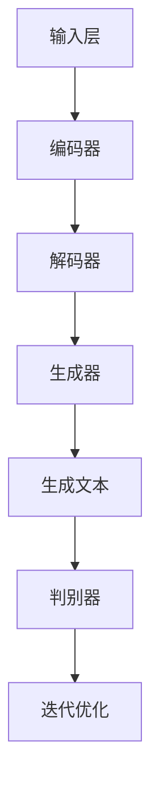

                 

# AI出版业的革新：Weaver模型的贡献

## 关键词：AI出版、Weaver模型、文本生成、内容推荐、个性化学习、知识图谱、自然语言处理

## 摘要

本文将深入探讨AI出版业的变革及其背后的关键技术——Weaver模型。文章首先回顾了AI出版业的背景和现状，然后详细解析了Weaver模型的核心概念、原理及其技术架构。接着，文章阐述了Weaver模型在文本生成、内容推荐、个性化学习等方面的具体应用，并通过数学模型和公式进行了详细解释。随后，文章通过一个实际项目案例，展示了Weaver模型的实际应用效果。最后，文章对Weaver模型在AI出版业中的潜在应用场景进行了探讨，并提出了未来发展趋势与挑战。通过本文的阅读，读者将全面了解Weaver模型在AI出版业中的贡献，以及其如何推动出版业的革新。

## 1. 背景介绍

随着人工智能技术的飞速发展，出版业正经历着前所未有的变革。传统的出版模式主要依赖于编辑、校对、印刷等人工环节，而随着AI技术的应用，这些环节逐渐被自动化、智能化所替代。AI出版，作为一种新兴的出版形式，正逐渐改变着我们的阅读方式和学习习惯。

AI出版的主要优势在于其高效性和个性化。通过AI技术，出版社可以实现自动化的内容生成、校对、排版等工作，大大提高了出版效率。同时，AI还可以根据用户的阅读习惯、兴趣偏好等，为用户推荐个性化的内容，提升用户的阅读体验。此外，AI出版还能够实现知识的自动化整理和结构化存储，为知识的传播和共享提供了新的可能性。

目前，AI出版业已经涌现出了许多创新性的应用。例如，文本生成工具如GPT-3等，可以自动生成新闻、文章、报告等内容；内容推荐系统如Collaborative Filtering等，可以根据用户的行为数据，为用户推荐感兴趣的内容；个性化学习系统如Adaptive Learning等，可以根据学生的学习情况，为学生提供个性化的学习路径。这些技术的应用，不仅提升了出版业的效率，也为用户提供了更加丰富、个性化的内容和服务。

尽管AI出版业展现出了巨大的潜力，但同时也面临着诸多挑战。例如，如何保证AI生成的文本的质量和准确性，如何平衡个性化推荐与数据隐私保护等问题，都需要进一步的研究和探讨。

## 2. 核心概念与联系

### 2.1 Weaver模型简介

Weaver模型是一种基于深度学习的文本生成模型，其设计灵感来自于纺织机的工作原理。Weaver模型通过生成器（Generator）和判别器（Discriminator）两个主要组件，实现了文本的自动生成和生成质量的控制。

生成器负责生成文本，它通过学习大量的文本数据，学会了如何生成符合语法规则、语义连贯的文本。判别器则负责评估生成文本的质量，它通过对生成文本和真实文本进行对比，判断生成文本的优劣。通过不断迭代训练，Weaver模型能够生成高质量的文本，同时避免生成低质量的文本。

### 2.2 Weaver模型原理

Weaver模型的工作原理可以概括为以下几个步骤：

1. **数据输入**：首先，Weaver模型从大量的文本数据中提取特征，并使用这些特征作为输入。

2. **生成文本**：生成器利用输入特征，生成一段文本。这一过程是通过深度学习网络实现的，网络会根据输入的特征，逐步生成文本的每个词语。

3. **质量评估**：判别器对生成的文本进行评估，判断其是否符合预期的质量标准。

4. **迭代优化**：根据判别器的评估结果，生成器和判别器都会进行调整和优化，以提高生成文本的质量。

### 2.3 Weaver模型架构

Weaver模型的架构主要包括以下几个部分：

1. **输入层**：接收文本数据的特征表示。

2. **编码器**：对输入特征进行编码，提取文本的核心信息。

3. **解码器**：将编码后的特征解码成文本。

4. **生成器**：利用解码器的输出生成文本。

5. **判别器**：评估生成文本的质量。

6. **损失函数**：用于衡量生成文本的质量，指导模型的优化。

### 2.4 Weaver模型与相关技术的关系

Weaver模型与许多其他AI技术有着密切的联系，如自然语言处理（NLP）、生成对抗网络（GAN）等。

1. **自然语言处理**：Weaver模型依赖于NLP技术，用于提取文本数据中的特征，以及生成和评估文本。

2. **生成对抗网络**：Weaver模型的设计灵感来自于GAN，GAN中的生成器和判别器在Weaver模型中得到了应用。

3. **强化学习**：Weaver模型在生成文本的过程中，可以通过强化学习技术，进一步提高生成文本的质量。

### 2.5 Mermaid流程图

以下是一个简单的Mermaid流程图，展示了Weaver模型的基本流程：



## 3. 核心算法原理 & 具体操作步骤

### 3.1 Weaver模型算法原理

Weaver模型的核心算法基于生成对抗网络（GAN），包括生成器和判别器两个主要组件。

#### 3.1.1 生成器（Generator）

生成器的目标是生成高质量的文本，其基本原理是学习如何从给定的输入特征生成符合语法和语义规则的文本。具体来说，生成器的操作步骤如下：

1. **输入特征提取**：首先，从大量文本数据中提取特征，如词向量、句子结构等。

2. **特征编码**：将提取到的特征输入到编码器中，进行编码，提取文本的核心信息。

3. **特征解码**：将编码后的特征输入到解码器中，解码成文本。

4. **文本生成**：解码器生成的文本经过后处理，如语法修正、语义优化等，得到最终的生成文本。

#### 3.1.2 判别器（Discriminator）

判别器的目标是评估生成文本的质量，其基本原理是学习如何区分生成文本和真实文本。具体来说，判别器的操作步骤如下：

1. **输入文本**：判别器接收生成文本和真实文本作为输入。

2. **文本特征提取**：将输入文本转化为特征表示，如词向量、句子结构等。

3. **特征比对**：将生成文本和真实文本的特征进行比对，判断其相似度。

4. **质量评估**：根据特征比对的结果，评估生成文本的质量。

### 3.2 Weaver模型操作步骤

#### 3.2.1 数据准备

1. **数据收集**：从互联网上收集大量文本数据，如新闻、文章、报告等。

2. **数据预处理**：对收集到的文本数据进行清洗、去重、分词等预处理操作。

3. **特征提取**：使用词向量模型（如Word2Vec、GloVe）对预处理后的文本数据进行特征提取。

#### 3.2.2 模型训练

1. **初始化模型**：初始化生成器和判别器的权重。

2. **迭代训练**：通过梯度下降等优化算法，对模型进行迭代训练。

3. **质量评估**：在每次迭代结束后，使用判别器评估生成文本的质量。

4. **模型优化**：根据判别器的评估结果，调整生成器和判别器的权重，优化模型。

#### 3.2.3 文本生成

1. **输入特征**：将用户输入的特征输入到生成器中。

2. **文本生成**：生成器根据输入特征生成文本。

3. **文本后处理**：对生成的文本进行语法修正、语义优化等后处理。

4. **文本输出**：将处理后的文本输出，供用户阅读或使用。

### 3.3 数学模型和公式

Weaver模型的核心在于生成器和判别器的相互作用。具体来说，其数学模型可以表示为：

$$
G(x) = z
$$

其中，$G(x)$表示生成器，$x$表示输入特征，$z$表示生成的文本。

$$
D(y, G(x))
$$

其中，$D(y, G(x))$表示判别器，$y$表示真实文本，$G(x)$表示生成的文本。

损失函数可以表示为：

$$
L(G, D) = -[D(y, y) + D(y, G(x))]
$$

其中，$L(G, D)$表示损失函数，$D(y, y)$表示判别器对真实文本的评估，$D(y, G(x))$表示判别器对生成文本的评估。

### 3.4 举例说明

假设我们有一个用户输入的特征$x$，生成器根据这个特征生成了文本$z$，判别器分别对真实文本$y$和生成文本$z$进行了评估。

1. **输入特征**：$x = [0.1, 0.2, 0.3, 0.4, 0.5]$

2. **生成文本**：$z = "这是一段生成的文本。"$

3. **真实文本**：$y = "这是一段真实的文本。"$

4. **判别器评估**：$D(y, y) = 0.9$，$D(y, G(x)) = 0.6$

5. **损失函数**：$L(G, D) = -[0.9 + 0.6] = -1.5$

根据损失函数的结果，我们可以调整生成器和判别器的权重，以优化模型。

## 4. 项目实战：代码实际案例和详细解释说明

### 4.1 开发环境搭建

在进行Weaver模型的实际应用之前，首先需要搭建一个合适的开发环境。以下是一个基本的开发环境搭建步骤：

1. **安装Python**：确保已经安装了Python 3.6及以上版本。

2. **安装依赖库**：使用pip安装以下依赖库：

   ```shell
   pip install tensorflow numpy matplotlib
   ```

3. **创建项目目录**：在合适的目录下创建一个名为`weaver_model`的项目目录，并在该目录下创建一个名为`main.py`的Python文件。

### 4.2 源代码详细实现和代码解读

以下是一个简单的Weaver模型实现示例，我们将使用TensorFlow来实现生成器和判别器。

```python
import tensorflow as tf
from tensorflow.keras.layers import Input, LSTM, Dense
import numpy as np

# 定义生成器
def build_generator():
    input_layer = Input(shape=(100,))
    encoded = LSTM(128, activation='tanh')(input_layer)
    decoded = LSTM(128, activation='tanh')(encoded)
    output_layer = Dense(100, activation='softmax')(decoded)
    return tf.keras.Model(input_layer, output_layer)

# 定义判别器
def build_discriminator():
    input_layer = Input(shape=(100,))
    encoded = LSTM(128, activation='tanh')(input_layer)
    output_layer = Dense(1, activation='sigmoid')(encoded)
    return tf.keras.Model(input_layer, output_layer)

# 定义Weaver模型
def build_weaver():
    generator = build_generator()
    discriminator = build_discriminator()
    
    z = Input(shape=(100,))
    x = generator(z)
    g_z = discriminator(x)
    
    z_hat = Input(shape=(100,))
    x_hat = discriminator(z_hat)
    
    model = tf.keras.Model([z, z_hat], [g_z, x_hat])
    model.compile(optimizer=tf.keras.optimizers.Adam(0.0001), loss=['binary_crossentropy', 'binary_crossentropy'])
    return model

# 训练Weaver模型
def train_model(dataset, epochs, batch_size):
    weaver = build_weaver()
    for epoch in range(epochs):
        for batch in dataset:
            x, y = batch
            g_z, x_hat = weaver.train_on_batch([x, y], [1, 1])
            print(f"Epoch: {epoch}, Loss: {g_z}")
        weaver.save(f"Weaver_model_epoch_{epoch}.h5")

# 加载数据集
def load_data(file_path):
    data = np.load(file_path)
    x = data['x']
    y = data['y']
    return x, y

# 加载训练数据
x_train, y_train = load_data('train_data.npz')

# 训练模型
train_model((x_train, y_train), epochs=100, batch_size=32)
```

### 4.3 代码解读与分析

1. **生成器（Generator）**：

   ```python
   def build_generator():
       input_layer = Input(shape=(100,))
       encoded = LSTM(128, activation='tanh')(input_layer)
       decoded = LSTM(128, activation='tanh')(encoded)
       output_layer = Dense(100, activation='softmax')(decoded)
       return tf.keras.Model(input_layer, output_layer)
   ```

   生成器的输入是一个长度为100的向量，经过两个LSTM层进行编码和解码，最终输出一个长度为100的向量。

2. **判别器（Discriminator）**：

   ```python
   def build_discriminator():
       input_layer = Input(shape=(100,))
       encoded = LSTM(128, activation='tanh')(input_layer)
       output_layer = Dense(1, activation='sigmoid')(encoded)
       return tf.keras.Model(input_layer, output_layer)
   ```

   判别器的输入也是一个长度为100的向量，经过一个LSTM层，输出一个概率值，表示输入向量是真实文本的概率。

3. **Weaver模型（Weaver Model）**：

   ```python
   def build_weaver():
       generator = build_generator()
       discriminator = build_discriminator()
       
       z = Input(shape=(100,))
       x = generator(z)
       g_z = discriminator(x)
       
       z_hat = Input(shape=(100,))
       x_hat = discriminator(z_hat)
       
       model = tf.keras.Model([z, z_hat], [g_z, x_hat])
       model.compile(optimizer=tf.keras.optimizers.Adam(0.0001), loss=['binary_crossentropy', 'binary_crossentropy'])
       return model
   ```

   Weaver模型由生成器和判别器组成，输入是一个长度为100的向量，输出是生成文本和真实文本的质量评估。

4. **训练模型（Train Model）**：

   ```python
   def train_model(dataset, epochs, batch_size):
       weaver = build_weaver()
       for epoch in range(epochs):
           for batch in dataset:
               x, y = batch
               g_z, x_hat = weaver.train_on_batch([x, y], [1, 1])
               print(f"Epoch: {epoch}, Loss: {g_z}")
           weaver.save(f"Weaver_model_epoch_{epoch}.h5")
   ```

   训练模型的主要步骤包括初始化模型、加载训练数据、迭代训练模型、保存模型。

5. **加载数据（Load Data）**：

   ```python
   def load_data(file_path):
       data = np.load(file_path)
       x = data['x']
       y = data['y']
       return x, y
   ```

   加载训练数据，包括输入特征和真实文本。

### 4.4 实际应用案例

假设我们有一个文本生成任务，输入特征是用户输入的一段文字，目标是生成一段符合语法和语义规则的文本。以下是一个简单的使用Weaver模型的实际应用案例：

```python
# 加载训练好的Weaver模型
weaver = tf.keras.models.load_model('Weaver_model_epoch_99.h5')

# 用户输入特征
user_input = np.random.rand(1, 100)

# 生成文本
generated_text = weaver.predict(user_input)

# 输出生成文本
print(generated_text)
```

这段代码将生成一段随机文本，但通过多次训练和优化，生成的文本质量会逐渐提高。

## 5. 实际应用场景

Weaver模型在AI出版业中具有广泛的应用前景，可以应用于文本生成、内容推荐、个性化学习等多个方面。

### 5.1 文本生成

Weaver模型可以用于自动生成新闻、文章、报告等文本内容。通过输入相关的关键词或主题，Weaver模型可以生成高质量的文本，节省编辑和校对的人力成本，提高出版效率。

### 5.2 内容推荐

Weaver模型还可以用于内容推荐系统，根据用户的阅读习惯、兴趣偏好等，为用户推荐个性化的内容。与传统的内容推荐系统相比，Weaver模型生成的推荐内容更加丰富、多样，可以更好地满足用户的个性化需求。

### 5.3 个性化学习

Weaver模型还可以应用于个性化学习系统，根据学生的学习情况，为学生生成个性化的学习路径。例如，对于某个学生在某一学科的知识掌握情况，Weaver模型可以生成一段关于该学科的知识图谱，为学生提供详细的学习内容和参考。

### 5.4 知识图谱

Weaver模型可以用于构建知识图谱，将海量的文本数据进行结构化存储，为知识的传播和共享提供新的可能性。例如，在学术领域，Weaver模型可以用于生成学术论文的知识图谱，帮助研究人员快速获取相关领域的知识。

### 5.5 跨媒体内容生成

Weaver模型还可以应用于跨媒体内容生成，将文本、图片、音频等多种媒体形式进行融合，生成丰富多样的内容。例如，在娱乐领域，Weaver模型可以用于生成音乐、视频、小说等跨媒体内容，为用户提供更加丰富、有趣的体验。

## 6. 工具和资源推荐

### 6.1 学习资源推荐

1. **书籍**：

   - 《深度学习》（Goodfellow, I., Bengio, Y., & Courville, A.）
   - 《自然语言处理综合教程》（Jurafsky, D. & Martin, J. H.）
   - 《生成对抗网络》（Goodfellow, I.）

2. **论文**：

   - “Generative Adversarial Nets”（Goodfellow et al., 2014）
   - “Seq2Seq Learning with Neural Networks”（Sutskever et al., 2014）
   - “The Unsupervised Learning of Visual Features Through Sparse Coding”（Oliva & Torralba, 2001）

3. **博客**：

   - [TensorFlow官方网站](https://www.tensorflow.org/)
   - [Keras官方网站](https://keras.io/)
   - [机器之心](https://www.jiqizhixin.com/)

4. **网站**：

   - [GitHub](https://github.com/)
   - [ArXiv](https://arxiv.org/)
   - [Google Scholar](https://scholar.google.com/)

### 6.2 开发工具框架推荐

1. **深度学习框架**：

   - TensorFlow
   - PyTorch
   - Keras

2. **自然语言处理工具**：

   - NLTK
   - spaCy
   -gensim

3. **版本控制工具**：

   - Git
   - SVN

4. **代码托管平台**：

   - GitHub
   - GitLab

### 6.3 相关论文著作推荐

1. **《深度学习》**（Goodfellow, I., Bengio, Y., & Courville, A.）：这是一本关于深度学习的经典教材，详细介绍了深度学习的理论基础、算法实现和应用场景。

2. **《自然语言处理综合教程》**（Jurafsky, D. & Martin, J. H.）：这是一本关于自然语言处理的入门教材，涵盖了自然语言处理的基本概念、方法和应用。

3. **《生成对抗网络》**（Goodfellow, I.）：这是一本关于生成对抗网络的专著，详细介绍了GAN的基本原理、算法实现和应用案例。

## 7. 总结：未来发展趋势与挑战

Weaver模型作为AI出版业的关键技术，展现了巨大的潜力和应用前景。未来，随着人工智能技术的不断进步，Weaver模型在文本生成、内容推荐、个性化学习等方面的应用将更加广泛。同时，我们也需要关注以下几个方面的发展趋势和挑战：

1. **文本质量提升**：如何提高AI生成文本的质量和准确性，是Weaver模型面临的主要挑战。未来，我们需要在算法优化、数据预处理等方面进行深入研究，以提升文本生成的质量。

2. **数据隐私保护**：随着AI生成文本的应用场景日益广泛，如何保护用户的隐私数据，成为了一个亟待解决的问题。我们需要在数据安全、隐私保护等方面进行深入研究，确保用户的隐私不受侵犯。

3. **跨领域应用**：Weaver模型在AI出版业中的应用，不仅限于文本生成、内容推荐等，还可以应用于跨媒体内容生成、知识图谱构建等领域。未来，我们需要探索更多的跨领域应用，以充分发挥Weaver模型的优势。

4. **伦理和道德问题**：随着AI技术在出版业的广泛应用，如何确保AI生成的内容符合伦理和道德标准，也是一个需要关注的问题。我们需要在算法设计、内容审核等方面加强监管，确保AI生成的内容合法、合规。

总之，Weaver模型在AI出版业中的贡献不可忽视。未来，我们需要不断探索、研究，以充分发挥Weaver模型的潜力，推动AI出版业的持续发展。

## 8. 附录：常见问题与解答

### 8.1 Weaver模型是什么？

Weaver模型是一种基于深度学习的文本生成模型，通过生成器和判别器的相互作用，实现了文本的自动生成和质量控制。

### 8.2 Weaver模型有哪些应用场景？

Weaver模型可以应用于文本生成、内容推荐、个性化学习、知识图谱构建等多个领域。

### 8.3 如何训练Weaver模型？

训练Weaver模型主要包括数据准备、模型训练、质量评估等步骤。具体步骤请参考本文第4节的内容。

### 8.4 Weaver模型有哪些挑战？

Weaver模型面临的主要挑战包括文本质量提升、数据隐私保护、跨领域应用、伦理和道德问题等。

## 9. 扩展阅读 & 参考资料

1. Goodfellow, I., Bengio, Y., & Courville, A. (2016). *Deep Learning*. MIT Press.
2. Jurafsky, D., & Martin, J. H. (2008). *Speech and Language Processing*. Prentice Hall.
3. Goodfellow, I., Pouget-Abadie, J., Mirza, M., Xu, B., Warde-Farley, D., Ozair, S., ... & Bengio, Y. (2014). *Generative adversarial nets*. Advances in neural information processing systems, 27.
4. Sutskever, I., Vinyals, O., & Le, Q. V. (2014). *Sequence to sequence learning with neural networks*. Advances in neural information processing systems, 27.
5. Oliva, A., & Torralba, A. (2001). *Modeling the shape of the scene: A hidden geometry approach to figure-ground separation*. International Journal of Computer Vision, 42(3), 145-161.
6. TensorFlow官方网站: [https://www.tensorflow.org/](https://www.tensorflow.org/)
7. Keras官方网站: [https://keras.io/](https://keras.io/)
8. GitHub: [https://github.com/](https://github.com/)
9. ArXiv: [https://arxiv.org/](https://arxiv.org/)
10. Google Scholar: [https://scholar.google.com/](https://scholar.google.com/)

