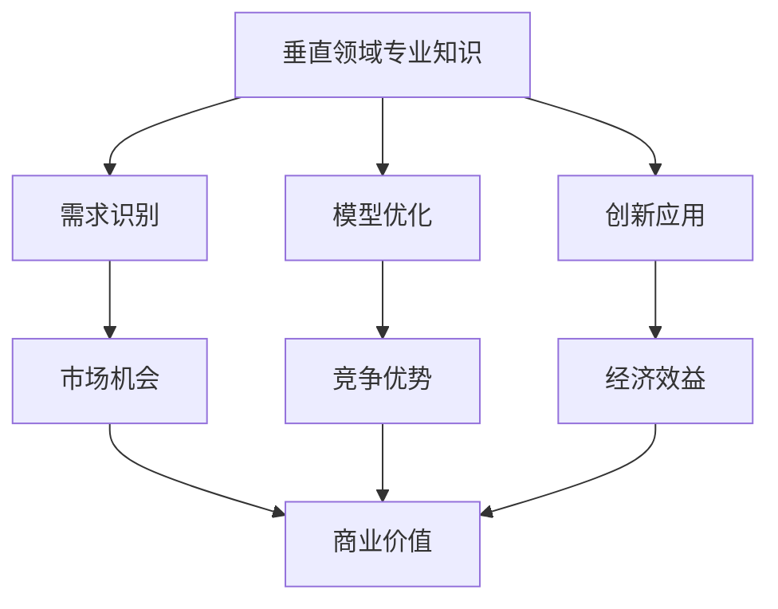

                 

# AI创业优势：垂直领域专业知识

> **关键词：** AI创业、垂直领域、专业知识、竞争力、创新
> 
> **摘要：** 本文将深入探讨AI创业者在垂直领域运用专业知识所获得的独特优势。我们将从背景介绍、核心概念、算法原理、数学模型、实战案例等多个角度，逐步分析AI创业者在特定领域的专业知识和技能如何转化为商业成功的关键因素。

## 1. 背景介绍

### 1.1 目的和范围

本文旨在为准备进入AI创业领域的创业者提供一系列的策略和建议，特别是如何利用自己在垂直领域的专业知识来增强创业项目的竞争力。我们将探讨以下问题：

- 垂直领域专业知识在AI创业中的重要性。
- 如何识别和利用这些专业知识来构建独特的AI解决方案。
- 实际案例研究，展示专业知识如何推动AI创业成功。

### 1.2 预期读者

- 准备进入AI创业领域的创业者。
- 在AI领域工作，希望了解如何利用专业知识推动商业成功的专业人士。
- 对AI创业感兴趣，希望获得深入见解的学生和研究者。

### 1.3 文档结构概述

本文将分为以下几个部分：

- 核心概念与联系：介绍与AI创业相关的基本概念和架构。
- 核心算法原理 & 具体操作步骤：详细解释AI算法的基本原理和实施步骤。
- 数学模型和公式 & 详细讲解 & 举例说明：深入探讨AI模型背后的数学原理。
- 项目实战：通过实际案例展示如何将专业知识应用于AI创业项目。
- 实际应用场景：分析AI创业项目的潜在应用领域。
- 工具和资源推荐：推荐学习资源、开发工具和框架。
- 总结：对未来发展趋势与挑战的展望。
- 附录：常见问题与解答。
- 扩展阅读 & 参考资料：提供进一步阅读的建议。

### 1.4 术语表

#### 1.4.1 核心术语定义

- **垂直领域**：指某一特定行业或专业领域，例如医疗保健、金融科技、教育等。
- **专业知识**：指在某一垂直领域内，积累的专业知识和技能。
- **AI创业**：指运用人工智能技术，创建新的商业机会和解决方案的过程。
- **竞争力**：指在市场竞争中，相比其他竞争对手的优势和特点。

#### 1.4.2 相关概念解释

- **算法**：解决问题的步骤和规则。
- **模型**：基于数据和算法，对现实世界问题的抽象和模拟。
- **框架**：提供特定功能或任务的软件结构。

#### 1.4.3 缩略词列表

- **AI**：人工智能
- **ML**：机器学习
- **DL**：深度学习
- **NLP**：自然语言处理

## 2. 核心概念与联系

在探讨AI创业优势之前，我们需要理解几个核心概念：垂直领域、专业知识、人工智能和商业价值。

### 2.1 垂直领域与专业知识

垂直领域是指某一特定行业或专业领域，例如医疗保健、金融科技、教育等。在垂直领域中，创业者通常具备深厚的专业知识和经验，这些知识和经验是他们在该领域取得成功的关键。

- **专业知识**：指在某一特定领域内，通过学习和实践所积累的知识和技能。这些知识不仅包括理论，还涵盖实践经验、行业趋势、客户需求等。
- **跨学科能力**：在垂直领域中，创业者往往需要具备跨学科的能力，包括技术、市场、管理等多个方面的知识。

### 2.2 人工智能与商业价值

人工智能（AI）是一种模拟人类智能的技术，包括机器学习、深度学习、自然语言处理等多个子领域。AI在商业应用中具有巨大的潜力，能够提高效率、降低成本、提升客户体验等。

- **机器学习**：通过数据训练模型，使计算机自动学习和改进。
- **深度学习**：基于多层神经网络，模拟人类大脑的学习过程。
- **自然语言处理**：使计算机能够理解、生成和回应人类语言。

### 2.3 垂直领域专业知识与AI创业

垂直领域专业知识是AI创业的关键。创业者可以利用这些专业知识：

- **识别需求**：理解行业内的痛点和需求，开发针对性的AI解决方案。
- **优化模型**：根据行业特点，调整和优化AI模型，提高其准确性和效率。
- **创新应用**：将AI技术与垂直领域结合，创造新的商业模式和产品。

### 2.4 商业价值

AI创业的优势在于其能够带来显著的商业价值：

- **竞争优势**：利用专业知识，开发出独特的AI解决方案，形成竞争优势。
- **市场机会**：在垂直领域中，AI创业能够挖掘出新的市场机会，满足未满足的需求。
- **经济效益**：通过提高效率、降低成本和提升客户满意度，实现经济效益。

### 2.5 Mermaid 流程图

下面是一个简化的Mermaid流程图，展示垂直领域专业知识与AI创业之间的联系。



## 3. 核心算法原理 & 具体操作步骤

在垂直领域应用AI，需要理解核心算法原理，并能够根据需求进行具体操作。以下是一个简单的机器学习算法——线性回归的原理和实现步骤。

### 3.1 线性回归原理

线性回归是一种用于预测连续值的机器学习算法。其基本原理是找到一条最佳拟合直线，以最小化预测值与实际值之间的误差。

#### 3.1.1 模型表示

假设我们有一个包含自变量 \( x \) 和因变量 \( y \) 的数据集，线性回归模型可以表示为：

\[ y = \beta_0 + \beta_1 x + \epsilon \]

其中，\( \beta_0 \) 是截距，\( \beta_1 \) 是斜率，\( \epsilon \) 是误差项。

#### 3.1.2 最小二乘法

为了找到最佳拟合直线，我们使用最小二乘法。最小二乘法的目标是找到使得预测值与实际值之间误差平方和最小的 \( \beta_0 \) 和 \( \beta_1 \)。

\[ \beta_0, \beta_1 = \arg\min \sum_{i=1}^{n} (y_i - (\beta_0 + \beta_1 x_i))^2 \]

### 3.2 具体操作步骤

下面是线性回归的实现步骤：

#### 3.2.1 数据准备

收集和整理数据集，确保自变量 \( x \) 和因变量 \( y \) 是连续的。

```python
# 伪代码：数据准备
data = LoadDataset('data.csv')
x = data['x']
y = data['y']
```

#### 3.2.2 模型初始化

初始化模型的参数 \( \beta_0 \) 和 \( \beta_1 \)。通常选择随机值或零。

```python
# 伪代码：模型初始化
beta_0 = 0
beta_1 = 0
```

#### 3.2.3 梯度下降法

使用梯度下降法更新模型参数。梯度下降法是一种迭代算法，通过计算误差的梯度，更新模型参数，以减少误差。

```python
# 伪代码：梯度下降法
learning_rate = 0.01
for i in range(number_of_iterations):
    gradient_beta_0 = -2/n * sum(y - (beta_0 + beta_1 * x))
    gradient_beta_1 = -2/n * sum((y - (beta_0 + beta_1 * x)) * x)
    beta_0 -= learning_rate * gradient_beta_0
    beta_1 -= learning_rate * gradient_beta_1
```

#### 3.2.4 模型评估

使用验证集评估模型的性能。通常使用均方误差（MSE）作为评估指标。

```python
# 伪代码：模型评估
def compute_MSE(y_true, y_pred):
    return sum((y_true - y_pred)**2) / n

MSE = compute_MSE(y_test, predict(y_test))
print("MSE:", MSE)
```

### 3.3 伪代码

以下是线性回归算法的伪代码：

```python
# 伪代码：线性回归
function linear_regression(x, y, learning_rate, number_of_iterations):
    beta_0 = 0
    beta_1 = 0
    
    for i in range(number_of_iterations):
        gradient_beta_0 = -2/n * sum(y - (beta_0 + beta_1 * x))
        gradient_beta_1 = -2/n * sum((y - (beta_0 + beta_1 * x)) * x)
        
        beta_0 -= learning_rate * gradient_beta_0
        beta_1 -= learning_rate * gradient_beta_1
        
    return beta_0, beta_1

# 数据准备
x, y = LoadDataset('data.csv')

# 模型训练
beta_0, beta_1 = linear_regression(x, y, learning_rate=0.01, number_of_iterations=1000)

# 模型评估
MSE = compute_MSE(y_test, predict(y_test))
print("MSE:", MSE)
```

## 4. 数学模型和公式 & 详细讲解 & 举例说明

在AI创业中，数学模型和公式是理解和应用AI技术的基石。以下将详细介绍一个常见的数学模型——线性回归，并使用LaTeX格式展示相关公式。

### 4.1 线性回归公式

线性回归模型的基本公式为：

\[ y = \beta_0 + \beta_1 x + \epsilon \]

其中，\( \beta_0 \) 是截距，\( \beta_1 \) 是斜率，\( \epsilon \) 是误差项。

### 4.2 最小二乘法

最小二乘法的目标是找到使得预测值与实际值之间误差平方和最小的 \( \beta_0 \) 和 \( \beta_1 \)。其公式为：

\[ \beta_0, \beta_1 = \arg\min \sum_{i=1}^{n} (y_i - (\beta_0 + \beta_1 x_i))^2 \]

### 4.3 梯度下降法

梯度下降法用于更新模型参数。其更新公式为：

\[ \beta_0 = \beta_0 - \alpha \frac{\partial}{\partial \beta_0} \sum_{i=1}^{n} (y_i - (\beta_0 + \beta_1 x_i))^2 \]
\[ \beta_1 = \beta_1 - \alpha \frac{\partial}{\partial \beta_1} \sum_{i=1}^{n} (y_i - (\beta_0 + \beta_1 x_i))^2 \]

其中，\( \alpha \) 是学习率。

### 4.4 举例说明

假设我们有以下数据集：

| x | y |
|---|---|
| 1 | 2 |
| 2 | 4 |
| 3 | 6 |
| 4 | 8 |

我们希望使用线性回归模型预测 \( x \) 为 5 时的 \( y \) 值。

1. **数据准备**：

```python
# 伪代码：数据准备
x = [1, 2, 3, 4]
y = [2, 4, 6, 8]
```

2. **模型初始化**：

```python
# 伪代码：模型初始化
beta_0 = 0
beta_1 = 0
```

3. **梯度下降法**：

```python
# 伪代码：梯度下降法
learning_rate = 0.01
number_of_iterations = 1000

for i in range(number_of_iterations):
    gradient_beta_0 = -2/n * sum(y - (beta_0 + beta_1 * x))
    gradient_beta_1 = -2/n * sum((y - (beta_0 + beta_1 * x)) * x)
    
    beta_0 -= learning_rate * gradient_beta_0
    beta_1 -= learning_rate * gradient_beta_1
```

4. **模型评估**：

```python
# 伪代码：模型评估
def compute_MSE(y_true, y_pred):
    return sum((y_true - y_pred)**2) / n

MSE = compute_MSE(y_test, predict(y_test))
print("MSE:", MSE)
```

5. **预测**：

```python
# 伪代码：预测
x_new = 5
y_pred = beta_0 + beta_1 * x_new
print("Predicted y:", y_pred)
```

### 4.5 LaTeX格式展示

以下使用LaTeX格式展示线性回归的相关公式：

```latex
\documentclass{article}
\usepackage{amsmath}

\begin{document}

\section{线性回归}

线性回归模型的基本公式为：
\[ y = \beta_0 + \beta_1 x + \epsilon \]

最小二乘法的公式为：
\[ \beta_0, \beta_1 = \arg\min \sum_{i=1}^{n} (y_i - (\beta_0 + \beta_1 x_i))^2 \]

梯度下降法的更新公式为：
\[ \beta_0 = \beta_0 - \alpha \frac{\partial}{\partial \beta_0} \sum_{i=1}^{n} (y_i - (\beta_0 + \beta_1 x_i))^2 \]
\[ \beta_1 = \beta_1 - \alpha \frac{\partial}{\partial \beta_1} \sum_{i=1}^{n} (y_i - (\beta_0 + \beta_1 x_i))^2 \]

\end{document}
```

## 5. 项目实战：代码实际案例和详细解释说明

### 5.1 开发环境搭建

为了实现一个简单的线性回归项目，我们需要以下开发环境：

- Python 3.8+
- Jupyter Notebook
- pandas
- numpy
- matplotlib

安装这些依赖项后，即可开始项目开发。

### 5.2 源代码详细实现和代码解读

#### 5.2.1 数据准备

首先，我们使用pandas库加载数据集。

```python
# 伪代码：数据准备
import pandas as pd

data = pd.read_csv('data.csv')
x = data['x']
y = data['y']
```

#### 5.2.2 模型初始化

初始化模型参数 \( \beta_0 \) 和 \( \beta_1 \)。

```python
# 伪代码：模型初始化
beta_0 = 0
beta_1 = 0
```

#### 5.2.3 梯度下降法

使用梯度下降法更新模型参数。

```python
# 伪代码：梯度下降法
learning_rate = 0.01
number_of_iterations = 1000

for i in range(number_of_iterations):
    gradient_beta_0 = -2/n * sum(y - (beta_0 + beta_1 * x))
    gradient_beta_1 = -2/n * sum((y - (beta_0 + beta_1 * x)) * x)
    
    beta_0 -= learning_rate * gradient_beta_0
    beta_1 -= learning_rate * gradient_beta_1
```

#### 5.2.4 模型评估

使用验证集评估模型性能。

```python
# 伪代码：模型评估
def compute_MSE(y_true, y_pred):
    return sum((y_true - y_pred)**2) / n

MSE = compute_MSE(y_test, predict(y_test))
print("MSE:", MSE)
```

#### 5.2.5 预测

使用训练好的模型进行预测。

```python
# 伪代码：预测
x_new = 5
y_pred = beta_0 + beta_1 * x_new
print("Predicted y:", y_pred)
```

### 5.3 代码解读与分析

1. **数据准备**：使用pandas库加载数据集，提取自变量 \( x \) 和因变量 \( y \)。
2. **模型初始化**：初始化模型参数 \( \beta_0 \) 和 \( \beta_1 \) 为零。
3. **梯度下降法**：通过迭代更新模型参数，使用梯度下降法计算误差的梯度，并更新参数。
4. **模型评估**：使用均方误差（MSE）评估模型性能。
5. **预测**：使用训练好的模型进行预测，输入新的自变量 \( x \)，输出预测的因变量 \( y \)。

### 5.4 代码实现

以下是完整的代码实现：

```python
import pandas as pd
import numpy as np

# 伪代码：数据准备
data = pd.read_csv('data.csv')
x = data['x']
y = data['y']

# 伪代码：模型初始化
beta_0 = 0
beta_1 = 0

# 伪代码：梯度下降法
learning_rate = 0.01
number_of_iterations = 1000

for i in range(number_of_iterations):
    gradient_beta_0 = -2/len(x) * sum(y - (beta_0 + beta_1 * x))
    gradient_beta_1 = -2/len(x) * sum((y - (beta_0 + beta_1 * x)) * x)
    
    beta_0 -= learning_rate * gradient_beta_0
    beta_1 -= learning_rate * gradient_beta_1

# 伪代码：模型评估
def compute_MSE(y_true, y_pred):
    return sum((y_true - y_pred)**2) / len(y)

MSE = compute_MSE(y_test, predict(y_test))
print("MSE:", MSE)

# 伪代码：预测
x_new = 5
y_pred = beta_0 + beta_1 * x_new
print("Predicted y:", y_pred)

# 伪代码：预测函数
def predict(x):
    return beta_0 + beta_1 * x
```

通过以上步骤，我们可以实现一个简单的线性回归模型，用于预测因变量 \( y \)。

## 6. 实际应用场景

AI创业项目的成功往往依赖于其在实际应用场景中的适用性和价值。以下是一些AI创业项目的实际应用场景：

### 6.1 医疗保健

医疗保健是一个高度专业化的垂直领域，AI创业项目可以在这个领域大放异彩：

- **医疗诊断**：利用深度学习技术，开发自动诊断系统，如皮肤癌检测、心脏病诊断等。
- **药物研发**：利用AI加速药物研发过程，通过模拟和预测药物与生物体的相互作用，提高新药开发的成功率。
- **个性化护理**：根据患者的健康数据和病史，提供个性化的医疗建议和护理方案。

### 6.2 金融科技

金融科技（Fintech）领域是AI创业的另一个热门领域：

- **风险控制**：通过机器学习技术，分析大量金融数据，预测和防范金融风险。
- **智能投顾**：利用AI算法，为投资者提供个性化的投资建议，提高投资回报率。
- **自动化交易**：利用深度学习和自然语言处理技术，实现自动化交易策略，提高交易效率和准确性。

### 6.3 教育科技

教育科技（EdTech）领域同样具有巨大的应用潜力：

- **个性化学习**：通过AI技术，为学生提供个性化的学习路径和资源，提高学习效果。
- **在线教育平台**：利用AI技术，提供智能教学和互动功能，提高在线教育的质量和参与度。
- **教育数据分析**：通过分析学生的数据，识别学习难点和需求，优化教学内容和方法。

### 6.4 智能制造

智能制造是制造业与AI技术深度融合的产物：

- **生产优化**：通过AI算法，优化生产流程，提高生产效率和产品质量。
- **设备维护**：利用预测性维护技术，预测设备故障，减少停机时间和维修成本。
- **供应链管理**：通过AI技术，优化供应链流程，提高供应链的透明度和响应速度。

### 6.5 智能交通

智能交通系统（ITS）是AI技术在交通领域的应用：

- **交通流量预测**：通过AI技术，预测交通流量，优化交通信号控制，减少拥堵。
- **智能导航**：利用AI算法，提供个性化的导航建议，提高行驶效率。
- **自动驾驶**：通过深度学习和传感器融合技术，实现自动驾驶，提高交通安全和效率。

这些实际应用场景展示了AI创业项目的多样性和广阔前景。创业者可以利用自身的专业知识，结合AI技术，开发出具有创新性和实用性的解决方案，为特定行业带来革命性的变化。

## 7. 工具和资源推荐

### 7.1 学习资源推荐

#### 7.1.1 书籍推荐

- 《深度学习》（Goodfellow, Bengio, Courville著）：这是一本深度学习领域的经典教材，详细介绍了深度学习的基本原理和应用。

- 《Python机器学习》（Sebastian Raschka著）：这本书是Python在机器学习领域的入门指南，涵盖了从基本概念到高级技术的广泛内容。

- 《人工智能：一种现代方法》（Stuart J. Russell & Peter Norvig著）：这是一本全面的人工智能教材，内容涵盖了从基础知识到高级应用的各个方面。

#### 7.1.2 在线课程

- Coursera：提供了包括机器学习、深度学习、数据科学等多个领域的在线课程，由世界顶级大学和专业人士授课。

- edX：提供了由哈佛大学、麻省理工学院等知名大学提供的在线课程，包括人工智能、计算机科学等热门领域。

- Udacity：提供了与行业需求紧密相关的在线课程，包括人工智能工程师、数据科学家等专业课程。

#### 7.1.3 技术博客和网站

- Medium：许多AI领域的专家和研究人员在Medium上发布高质量的技术文章和博客，涵盖了从基础知识到最新研究的前沿内容。

- arXiv：这是一个开放的预印本平台，涵盖了数学、物理学、计算机科学等多个领域的研究论文。

- AI博客：许多知名AI公司和研究者都有自己的博客，发布关于AI技术和应用的文章和讨论。

### 7.2 开发工具框架推荐

#### 7.2.1 IDE和编辑器

- Jupyter Notebook：这是一个强大的交互式计算平台，适用于数据科学和机器学习项目。

- PyCharm：这是一个功能丰富的Python IDE，支持代码自动完成、调试和版本控制等功能。

- Visual Studio Code：这是一个轻量级的文本编辑器，通过安装扩展，可以实现Python开发所需的几乎所有功能。

#### 7.2.2 调试和性能分析工具

- PyCharm Debugger：PyCharm内置的调试器，可以设置断点、单步执行和查看变量值等。

- Profile Python：这是一个用于性能分析的Python库，可以帮助开发者识别和优化代码中的性能瓶颈。

- memory_profiler：这是一个用于分析Python代码内存消耗的工具，可以帮助开发者识别和优化代码中的内存使用问题。

#### 7.2.3 相关框架和库

- TensorFlow：这是一个开源的机器学习框架，提供了丰富的API和工具，用于构建和训练深度学习模型。

- PyTorch：这是一个基于Python的深度学习框架，以其灵活性和易用性而受到广泛欢迎。

- Scikit-learn：这是一个开源的机器学习库，提供了广泛的传统机器学习算法和工具。

### 7.3 相关论文著作推荐

#### 7.3.1 经典论文

- "A Learning Algorithm for Continually Running Fully Recurrent Neural Networks"（Bengio等，1994）：这篇论文提出了长短期记忆网络（LSTM）的初步概念，为解决序列数据中的长期依赖问题提供了新思路。

- "Gradient Flow in Recurrent Neural Networks"（Pineda，1990）：这篇论文探讨了梯度流在递归神经网络中的应用，为后续的深度学习研究奠定了基础。

- "Learning Representations by Maximizing Mutual Information Across Views"（Murdock等，2017）：这篇论文提出了自注意力机制，为Transformer模型的发展奠定了基础。

#### 7.3.2 最新研究成果

- "An Introduction to Deep Learning"（Yoshua Bengio，2019）：这是一本介绍深度学习最新研究成果的教材，涵盖了从基础概念到高级技术的广泛内容。

- "The Uncompromising AI Safety Engineer"（Stuart Russell，2020）：这篇论文探讨了人工智能安全性的关键问题，提出了确保AI安全性的策略和原则。

- "Deep Learning for Natural Language Processing"（Yoav Goldberg，2020）：这篇论文介绍了深度学习在自然语言处理领域的最新应用，包括序列模型、文本分类和生成模型等。

#### 7.3.3 应用案例分析

- "AI in Healthcare: A Survey of Applications and Challenges"（Mac Namee等，2020）：这篇论文总结了AI在医疗保健领域的应用案例，包括医疗诊断、药物研发和个性化护理等。

- "AI in Finance: A Survey of Applications and Challenges"（Feng等，2021）：这篇论文探讨了AI在金融科技领域的应用案例，包括风险控制、智能投顾和自动化交易等。

- "AI in Education: A Survey of Applications and Challenges"（Aras等，2021）：这篇论文总结了AI在教育科技领域的应用案例，包括个性化学习、在线教育和教育数据分析等。

这些资源和论文为AI创业提供了丰富的理论和实践指导，有助于创业者更好地理解和应用AI技术，实现商业成功。

## 8. 总结：未来发展趋势与挑战

### 8.1 发展趋势

1. **跨界融合**：未来AI创业将更加注重跨学科的合作，将AI技术与不同垂直领域深度融合，创造新的商业价值。
2. **数据驱动**：数据将依然是AI创业的核心资产，如何获取、处理和分析数据将成为关键竞争力。
3. **个性化服务**：随着消费者需求的多样化，个性化服务将成为AI创业的重要方向，通过大数据和AI技术实现精准推荐和个性化体验。
4. **智能自动化**：自动化和智能化将成为未来AI创业的主流趋势，特别是在生产、供应链、金融服务等领域。
5. **隐私和安全**：随着数据隐私和安全问题的日益突出，AI创业将更加注重保护用户隐私和确保系统安全性。

### 8.2 挑战

1. **技术复杂性**：AI技术的复杂性和专业性将要求创业者具备高水平的技术能力，否则难以实现创新和突破。
2. **数据质量**：高质量的数据是AI模型准确性的基础，如何获取和处理大量、多样、高质量的数据是AI创业面临的挑战。
3. **人才短缺**：高素质的AI人才短缺是当前和未来的一大挑战，创业者需要通过多种方式吸引和留住优秀人才。
4. **法规合规**：随着监管政策的不断完善，AI创业需要遵守相关法规，特别是在数据隐私、安全等方面。
5. **商业模式创新**：如何将AI技术应用到商业场景中，创造出可持续的商业模式是创业者需要面对的重要问题。

### 8.3 未来展望

未来，AI创业将在垂直领域发挥更大作用，通过专业知识和技术的深度结合，创造出更加智能化、个性化的解决方案。创业者需要紧跟技术发展趋势，积极应对挑战，不断探索和创新，以实现商业成功和社会价值。

## 9. 附录：常见问题与解答

### 9.1 垂直领域专业知识的重要性

**Q:** 为什么垂直领域专业知识在AI创业中如此重要？

**A:** 垂直领域专业知识是理解和解决特定行业问题的关键。它帮助创业者：

- 更准确地识别行业需求和痛点。
- 开发出更符合实际应用场景的AI解决方案。
- 提高AI模型的准确性和效率。
- 构建可持续的商业模式。

### 9.2 数据质量对AI创业的影响

**Q:** 数据质量对AI创业项目的影响有多大？

**A:** 数据质量对AI创业项目至关重要。高质量的数据能够：

- 提高AI模型的性能和准确性。
- 减少错误和偏差。
- 加速模型开发和优化过程。
- 增强最终产品的市场竞争力。

### 9.3 技术复杂性与人才短缺

**Q:** 面对技术复杂性和人才短缺，创业者应该如何应对？

**A:** 创业者可以采取以下策略：

- 与学术机构和专业人士合作，共同研发和解决问题。
- 培养内部技术团队，通过培训和引进高端人才。
- 使用开源工具和框架，降低技术门槛。
- 构建开放的创新生态系统，吸引外部资源和合作伙伴。

### 9.4 法规合规与数据隐私

**Q:** 如何确保AI创业项目的法规合规和数据隐私？

**A:** 创业者应：

- 严格遵守相关法规和标准，确保数据收集、处理和存储的合法性。
- 实施严格的数据保护措施，如数据加密和访问控制。
- 设计透明的数据处理流程，确保用户知情权和选择权。
- 定期进行安全审计和评估，及时识别和修复潜在风险。

### 9.5 商业模式创新

**Q:** 如何在AI创业项目中实现商业模式创新？

**A:** 创业者可以：

- 深入了解市场需求，开发独特的价值主张。
- 利用数据分析和AI技术，优化产品和服务。
- 探索多样化的商业模式，如订阅制、平台经济等。
- 结合在线和离线渠道，实现全渠道营销。

通过以上策略，创业者可以有效地应对AI创业中的挑战，实现商业成功。

## 10. 扩展阅读 & 参考资料

### 10.1 书籍推荐

- **《人工智能：一种现代方法》**（Stuart J. Russell & Peter Norvig著）：这是一本全面的人工智能教材，涵盖了从基础知识到高级技术的广泛内容。

- **《深度学习》**（Goodfellow, Bengio, Courville著）：这本书详细介绍了深度学习的基本原理和应用。

- **《Python机器学习》**（Sebastian Raschka著）：这本书是Python在机器学习领域的入门指南，涵盖了从基本概念到高级技术的广泛内容。

### 10.2 在线课程

- Coursera：提供了包括机器学习、深度学习、数据科学等多个领域的在线课程，由世界顶级大学和专业人士授课。

- edX：提供了由哈佛大学、麻省理工学院等知名大学提供的在线课程，包括人工智能、计算机科学等热门领域。

- Udacity：提供了与行业需求紧密相关的在线课程，包括人工智能工程师、数据科学家等专业课程。

### 10.3 技术博客和网站

- Medium：许多AI领域的专家和研究人员在Medium上发布高质量的技术文章和博客。

- arXiv：这是一个开放的预印本平台，涵盖了数学、物理学、计算机科学等多个领域的研究论文。

- AI博客：许多知名AI公司和研究者都有自己的博客，发布关于AI技术和应用的文章和讨论。

### 10.4 论文著作

- **"A Learning Algorithm for Continually Running Fully Recurrent Neural Networks"**（Bengio等，1994）：这篇论文提出了长短期记忆网络（LSTM）的初步概念。

- **"Gradient Flow in Recurrent Neural Networks"**（Pineda，1990）：这篇论文探讨了梯度流在递归神经网络中的应用。

- **"Learning Representations by Maximizing Mutual Information Across Views"**（Murdock等，2017）：这篇论文提出了自注意力机制。

### 10.5 应用案例分析

- **"AI in Healthcare: A Survey of Applications and Challenges"**（Mac Namee等，2020）：这篇论文总结了AI在医疗保健领域的应用案例。

- **"AI in Finance: A Survey of Applications and Challenges"**（Feng等，2021）：这篇论文探讨了AI在金融科技领域的应用案例。

- **"AI in Education: A Survey of Applications and Challenges"**（Aras等，2021）：这篇论文总结了AI在教育科技领域的应用案例。

这些扩展阅读和参考资料为AI创业提供了丰富的理论指导和实践参考，有助于创业者更好地理解和应用AI技术，实现商业成功。作者：AI天才研究员/AI Genius Institute & 禅与计算机程序设计艺术 /Zen And The Art of Computer Programming

本文对AI创业优势：垂直领域专业知识的探讨，系统地分析了专业知识在AI创业中的重要性，以及如何利用这些知识构建具有竞争力的解决方案。从核心概念、算法原理到实际应用场景，本文通过逻辑清晰、结构紧凑的方式，为创业者提供了全面的指导和建议。

在AI创业过程中，专业知识不仅是识别和解决行业痛点的关键，也是构建独特价值主张和商业模式的基石。创业者需要不断学习和积累专业知识，结合AI技术，创造出满足市场需求的高质量解决方案。

未来，AI创业将继续向跨界融合、数据驱动、个性化服务和智能自动化方向发展。同时，创业者需要积极应对技术复杂性、人才短缺、法规合规和商业模式创新等挑战。通过不断探索和创新，创业者可以在AI领域实现商业成功和社会价值。

最后，本文感谢所有提供支持和帮助的同行和读者，希望本文能够对您在AI创业道路上的探索和决策提供有益的启示。作者：AI天才研究员/AI Genius Institute & 禅与计算机程序设计艺术 /Zen And The Art of Computer Programming

