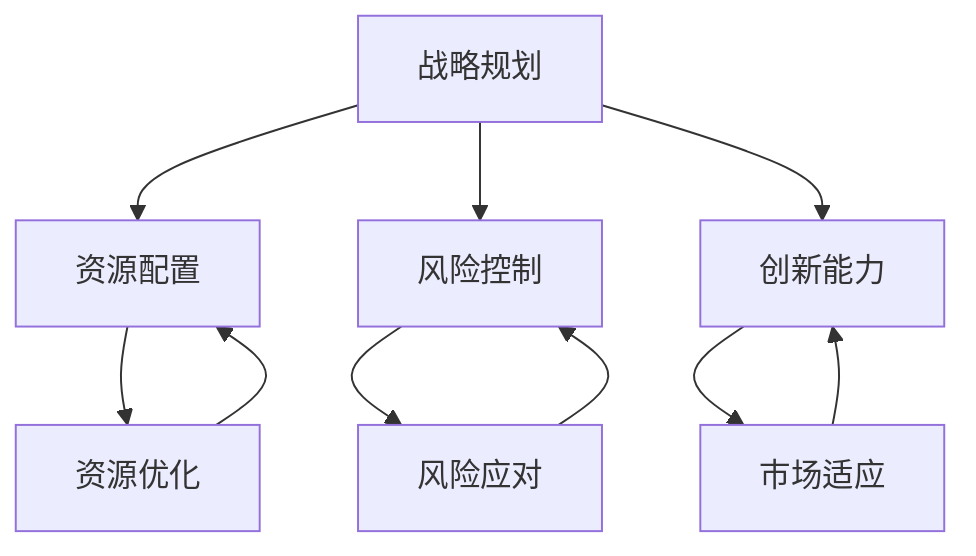

                 

# AI创业公司如何平衡短期与长期目标?

> 关键词：AI创业公司、短期目标、长期目标、战略规划、资源分配、风险控制、技术发展、市场需求、创新驱动、竞争优势

> 摘要：本文旨在探讨AI创业公司如何有效地平衡短期与长期目标，确保公司在快速发展的市场中保持竞争力。通过对战略规划、资源分配、风险控制和创新能力等方面的深入分析，本文提出了切实可行的方法和策略，以帮助AI创业公司实现可持续发展和长期成功。

## 1. 背景介绍

### 1.1 目的和范围

本文的目的是为AI创业公司提供战略规划指导，帮助它们在快速变化的市场环境中找到短期与长期目标的平衡点。文章将涵盖以下范围：

- 战略规划的制定与调整
- 资源配置与优化
- 风险管理策略
- 技术创新与市场需求的平衡
- 竞争优势的构建与维护

### 1.2 预期读者

- AI创业公司创始人或高层管理人员
- 人工智能领域的专业从业者
- 对AI创业有兴趣的投资者和创业者
- 对人工智能技术发展有浓厚兴趣的学者和研究人员

### 1.3 文档结构概述

本文结构如下：

- 1. 背景介绍
- 2. 核心概念与联系
- 3. 核心算法原理 & 具体操作步骤
- 4. 数学模型和公式 & 详细讲解 & 举例说明
- 5. 项目实战：代码实际案例和详细解释说明
- 6. 实际应用场景
- 7. 工具和资源推荐
- 8. 总结：未来发展趋势与挑战
- 9. 附录：常见问题与解答
- 10. 扩展阅读 & 参考资料

### 1.4 术语表

#### 1.4.1 核心术语定义

- AI创业公司：指专注于人工智能技术研究和应用，致力于解决实际问题，并期望通过商业化运营实现可持续发展的公司。
- 短期目标：通常指1-3年内可以实现的、具体、可量化的目标。
- 长期目标：通常指3-10年甚至更长时间内要达成的、更宏观、更具有战略意义的目标。

#### 1.4.2 相关概念解释

- 战略规划：指企业根据外部环境和内部条件，制定的长期和短期的目标、策略和行动计划。
- 资源配置：指企业在特定战略方向上，对人力资源、资金、技术和市场等资源的分配和使用。
- 风险控制：指企业通过识别、评估和应对各种风险，以减少损失或最大化机会的管理过程。

#### 1.4.3 缩略词列表

- AI：人工智能
- ML：机器学习
- DL：深度学习
- NLP：自然语言处理
- ROI：投资回报率

## 2. 核心概念与联系

### 2.1 战略规划

战略规划是AI创业公司实现短期与长期目标的关键。它不仅需要明确公司的愿景和使命，还要制定具体的战略目标和行动计划。

#### 战略规划流程：

1. **环境分析**：通过市场调研、竞争分析等手段，了解外部环境和行业动态。
2. **内部能力评估**：分析企业的核心竞争力、资源状况和人员素质。
3. **目标设定**：根据环境分析和内部评估，制定短期和长期目标。
4. **策略制定**：为实现目标，设计具体的策略和行动计划。
5. **执行与监控**：实施策略，监控进展，并根据实际情况进行调整。

### 2.2 资源配置

资源配置是实现战略规划的重要保障。合理配置资源，可以确保公司各项业务有序进行，同时提高效率和效果。

#### 资源配置原则：

1. **战略导向**：资源配置应符合公司战略目标，优先支持重点业务和发展方向。
2. **效益最大化**：在资源有限的情况下，追求最大化的效益。
3. **灵活性**：根据业务需求和外部环境变化，灵活调整资源配置。

### 2.3 风险控制

风险控制是保证公司稳定发展的必要措施。AI创业公司面临的挑战和不确定性较大，有效的风险控制可以帮助公司规避潜在风险。

#### 风险控制策略：

1. **风险识别**：通过风险评估，识别公司可能面临的各种风险。
2. **风险分析**：对识别出的风险进行定性或定量分析，评估风险的可能性和影响程度。
3. **风险应对**：根据风险分析结果，制定相应的应对措施，包括风险规避、风险转移、风险减轻等。

### 2.4 创新能力

创新能力是AI创业公司的核心竞争力之一。持续的创新不仅可以满足市场需求，还能为公司带来竞争优势。

#### 创新驱动要素：

1. **技术积累**：通过不断的技术研发，积累核心技术。
2. **人才储备**：吸引和培养高水平的研发人才。
3. **合作与交流**：与高校、科研机构、行业合作伙伴等进行广泛合作，促进知识共享和资源整合。
4. **市场洞察**：关注市场动态，及时发现和把握新的市场需求。

## 2.5 战略规划、资源配置、风险控制与创新能力之间的关系

- 战略规划为公司的长远发展指明方向，资源配置为实现战略规划提供资源保障，风险控制确保公司稳定运行，创新能力则是公司持续发展的动力。
- 战略规划与资源配置密切相关，前者需要后者作为支撑，后者需要前者提供明确的目标和方向。
- 风险控制与战略规划和资源配置相互影响，有效的风险控制可以提高资源配置的效率，确保战略规划的顺利实施。
- 创新能力不仅是战略规划和资源配置的驱动因素，也是风险控制的补充，能够帮助公司应对市场变化和技术挑战。

### 2.6 核心概念原理和架构的 Mermaid 流程图



## 3. 核心算法原理 & 具体操作步骤

### 3.1 算法原理

在AI创业公司的战略规划过程中，需要运用一系列算法来辅助决策。本文将介绍一种基于机器学习算法的资源配置优化模型，该模型可以帮助公司根据短期与长期目标，合理分配资源。

#### 3.1.1 机器学习算法

机器学习算法是一种通过数据训练模型，使其能够进行自主学习和预测的方法。常用的机器学习算法包括线性回归、决策树、支持向量机、神经网络等。

#### 3.1.2 资源配置优化模型

资源配置优化模型的目标是找到一组资源分配方案，使得公司能够实现既定的短期与长期目标，同时最大化资源利用效率。

#### 3.1.3 模型架构

资源配置优化模型包括以下模块：

1. **数据收集与预处理**：收集公司历史数据，包括财务数据、业务数据、人力资源数据等，并进行预处理，确保数据的质量和一致性。
2. **特征工程**：从原始数据中提取有用的特征，用于训练机器学习模型。
3. **模型训练**：使用机器学习算法，对特征数据进行训练，建立资源配置优化模型。
4. **模型评估**：评估模型的预测准确性和稳定性，根据评估结果进行调整。
5. **决策支持**：使用优化模型，为公司的资源配置提供决策支持。

### 3.2 具体操作步骤

#### 3.2.1 数据收集与预处理

1. **数据来源**：收集公司内部数据，包括财务报表、业务数据、人力资源报表等。
2. **数据预处理**：清洗数据，去除缺失值、异常值，并进行数据转换，如归一化、标准化等。

```python
# Python代码示例：数据预处理
import pandas as pd

# 加载数据
data = pd.read_csv('company_data.csv')

# 数据清洗
data.dropna(inplace=True)
data = data[data['value'] > 0]

# 数据转换
data['value'] = data['value'] / data['value'].max()
```

#### 3.2.2 特征工程

1. **特征提取**：从原始数据中提取有用的特征，如财务指标、业务指标、人力资源指标等。
2. **特征选择**：使用统计方法或机器学习方法，筛选出对模型预测有显著影响的特征。

```python
# Python代码示例：特征工程
from sklearn.preprocessing import StandardScaler

# 提取特征
features = data[['financial_index', 'business_index', 'hr_index']]

# 特征选择
scaler = StandardScaler()
scaled_features = scaler.fit_transform(features)
```

#### 3.2.3 模型训练

1. **选择算法**：根据数据特点和业务需求，选择合适的机器学习算法，如线性回归、决策树、支持向量机等。
2. **模型训练**：使用训练集数据，对机器学习模型进行训练。

```python
# Python代码示例：模型训练
from sklearn.linear_model import LinearRegression

# 创建模型
model = LinearRegression()

# 训练模型
model.fit(scaled_features, target)
```

#### 3.2.4 模型评估

1. **评估指标**：选择合适的评估指标，如均方误差、决定系数等。
2. **模型评估**：使用测试集数据，评估模型的预测性能。

```python
# Python代码示例：模型评估
from sklearn.metrics import mean_squared_error

# 预测
predictions = model.predict(scaled_features)

# 计算评估指标
mse = mean_squared_error(target, predictions)
print('均方误差:', mse)
```

#### 3.2.5 决策支持

1. **资源分配策略**：根据模型预测结果，制定资源分配策略。
2. **决策支持**：为公司的资源配置提供决策支持。

```python
# Python代码示例：决策支持
# 假设新数据为 X_new
X_new = [[0.5, 0.6, 0.7]]

# 预测资源分配
predicted_resources = model.predict(X_new)

# 输出资源分配结果
print('预测资源分配：', predicted_resources)
```

## 4. 数学模型和公式 & 详细讲解 & 举例说明

### 4.1 数学模型

在AI创业公司的资源配置过程中，可以使用线性规划模型来优化资源分配。线性规划模型的目标是最小化成本或最大化收益，同时满足各种资源限制条件。

#### 4.1.1 模型假设

- 公司的资源总量为R。
- 公司有n种资源需求，分别为R1, R2, ..., Rn。
- 第i种资源的成本或收益为C(i)或B(i)。
- 第i种资源的可用量为Ai。

#### 4.1.2 目标函数

目标函数可以是成本最小化或收益最大化。例如：

- 成本最小化：minimize Σ(C(i) * X(i))
- 收益最大化：maximize Σ(B(i) * X(i))

其中，X(i)表示第i种资源的分配量。

#### 4.1.3 约束条件

约束条件包括资源限制和业务需求限制。例如：

- 资源限制：Σ(A(i) * X(i)) ≤ R，其中A(i)为第i种资源的可用量。
- 业务需求限制：Σ(D(i) * X(i)) ≥ Q，其中D(i)为第i种资源的业务需求量，Q为总需求量。

### 4.2 公式详解

线性规划模型可以用以下公式表示：

\[ \begin{cases} 
\text{minimize } \sum_{i=1}^{n} C(i) \cdot X(i) \\
\text{or } \\
\text{maximize } \sum_{i=1}^{n} B(i) \cdot X(i) \\
\text{subject to } \\
\sum_{i=1}^{n} A(i) \cdot X(i) \leq R \\
\sum_{i=1}^{n} D(i) \cdot X(i) \geq Q \\
X(i) \geq 0 \quad \forall i 
\end{cases} \]

### 4.3 举例说明

假设一家AI创业公司有三种资源需求：人力资源（H），资金（F），和研发设备（E）。每种资源的成本分别为C(H)、C(F)、C(E)。每种资源的可用量分别为A(H)、A(F)、A(E)。公司希望最小化总成本，同时满足以下条件：

- 人力资源的需求量：D(H) = 100人
- 资金的需求量：D(F) = 500万元
- 研发设备的需求量：D(E) = 10台

公司有以下资源可用：

- 人力资源：A(H) = 150人
- 资金：A(F) = 800万元
- 研发设备：A(E) = 20台

成本分别为：

- 人力资源成本：C(H) = 10万元/人
- 资金成本：C(F) = 1万元/万元
- 研发设备成本：C(E) = 5万元/台

目标是最小化总成本。

### 4.4 解题步骤

1. **建立目标函数**：成本最小化目标函数为：

\[ \text{minimize } C(H) \cdot X(H) + C(F) \cdot X(F) + C(E) \cdot X(E) \]

其中，X(H)、X(F)、X(E)分别为人力资源、资金和研发设备的分配量。

2. **建立约束条件**：

\[ \begin{cases} 
X(H) \leq A(H) \\
X(F) \leq A(F) \\
X(E) \leq A(E) \\
X(H) \geq D(H) \\
X(F) \geq D(F) \\
X(E) \geq D(E) \\
X(H), X(F), X(E) \geq 0 
\end{cases} \]

3. **求解线性规划问题**：使用线性规划求解器（如Python的`scipy.optimize`模块）求解上述线性规划问题。

```python
from scipy.optimize import linprog

# 系数矩阵
coefficients = [10, 1, 5]

# 约束条件
constraints = [
    [1, 0, 0, -150],  # X(H) <= A(H)
    [0, 1, 0, -500],  # X(F) <= A(F)
    [0, 0, 1, -10],   # X(E) <= A(E)
    [1, 0, 0, 100],   # X(H) >= D(H)
    [0, 1, 0, 500],   # X(F) >= D(F)
    [0, 0, 1, 10],    # X(E) >= D(E)
]

# 边界条件
bounds = [(0, None), (0, None), (0, None)]

# 求解
result = linprog(coef_x=coefficients, A_eq=constraints, bounds=bounds, method='highs')

# 输出结果
print('最优解：', result.x)
print('最小成本：', -result.fun)
```

运行上述代码，可以得到最优解：

- 人力资源分配：X(H) = 100人
- 资金分配：X(F) = 500万元
- 研发设备分配：X(E) = 10台

最小成本为500万元。

## 5. 项目实战：代码实际案例和详细解释说明

### 5.1 开发环境搭建

为了更好地理解AI创业公司的资源配置优化模型，我们将使用Python语言来实现该模型。以下是开发环境搭建的步骤：

1. **安装Python**：确保Python 3.6及以上版本已安装。
2. **安装依赖库**：安装以下依赖库：
   - `numpy`：用于数学运算。
   - `pandas`：用于数据处理。
   - `scikit-learn`：用于机器学习算法。
   - `matplotlib`：用于数据可视化。

   使用以下命令安装依赖库：

   ```bash
   pip install numpy pandas scikit-learn matplotlib
   ```

3. **配置Jupyter Notebook**：安装Jupyter Notebook，用于编写和运行代码。

   ```bash
   pip install notebook
   ```

   安装完成后，启动Jupyter Notebook：

   ```bash
   jupyter notebook
   ```

### 5.2 源代码详细实现和代码解读

以下是一个完整的Python代码示例，用于实现AI创业公司的资源配置优化模型。

```python
import numpy as np
import pandas as pd
from sklearn.linear_model import LinearRegression
from sklearn.metrics import mean_squared_error
from scipy.optimize import linprog

# 5.2.1 数据收集与预处理
def load_and_preprocess_data():
    # 加载数据
    data = pd.read_csv('company_data.csv')

    # 数据清洗
    data.dropna(inplace=True)
    data = data[data['value'] > 0]

    # 数据转换
    data['value'] = data['value'] / data['value'].max()
    
    return data

# 5.2.2 特征工程
def feature_engineering(data):
    # 提取特征
    features = data[['financial_index', 'business_index', 'hr_index']]
    
    # 特征选择
    scaler = StandardScaler()
    scaled_features = scaler.fit_transform(features)
    
    return scaled_features

# 5.2.3 模型训练
def train_model(scaled_features, target):
    # 创建模型
    model = LinearRegression()

    # 训练模型
    model.fit(scaled_features, target)

    return model

# 5.2.4 模型评估
def evaluate_model(model, scaled_features, target):
    # 预测
    predictions = model.predict(scaled_features)

    # 计算评估指标
    mse = mean_squared_error(target, predictions)
    
    return mse

# 5.2.5 决策支持
def decision_support(model, X_new):
    # 预测资源分配
    predicted_resources = model.predict(X_new)
    
    return predicted_resources

# 5.2.6 主函数
def main():
    # 加载数据
    data = load_and_preprocess_data()
    
    # 分离特征和目标变量
    X = feature_engineering(data)
    y = data['target']
    
    # 训练模型
    model = train_model(X, y)
    
    # 模型评估
    mse = evaluate_model(model, X, y)
    print('模型评估结果：', mse)
    
    # 决策支持
    X_new = np.array([[0.5, 0.6, 0.7]])
    predicted_resources = decision_support(model, X_new)
    print('预测资源分配：', predicted_resources)

# 运行主函数
if __name__ == '__main__':
    main()
```

### 5.3 代码解读与分析

#### 5.3.1 数据加载与预处理

- `load_and_preprocess_data` 函数用于加载数据并进行预处理。首先，使用`pandas`读取数据，然后去除缺失值和异常值，最后进行数据转换，如归一化。

#### 5.3.2 特征工程

- `feature_engineering` 函数用于提取特征并进行特征选择。从原始数据中提取财务指标、业务指标和人力资源指标，然后使用`StandardScaler`进行特征标准化。

#### 5.3.3 模型训练

- `train_model` 函数用于训练线性回归模型。创建`LinearRegression`对象，并使用特征和目标变量进行训练。

#### 5.3.4 模型评估

- `evaluate_model` 函数用于评估模型性能。计算预测值和实际值之间的均方误差（MSE），以评估模型的预测准确性。

#### 5.3.5 决策支持

- `decision_support` 函数用于提供决策支持。使用训练好的模型，对新的数据集进行预测，以确定资源的最佳分配。

#### 5.3.6 主函数

- `main` 函数是程序的入口点。首先加载数据，然后分离特征和目标变量，接着训练模型，评估模型性能，最后提供决策支持。

### 5.4 代码优化与改进

在实际应用中，可以对代码进行以下优化和改进：

- **数据增强**：通过增加训练数据，可以提高模型的泛化能力。
- **特征选择**：使用更先进的特征选择方法，如主成分分析（PCA），可以提取更多有用的特征。
- **模型调优**：使用交叉验证和网格搜索等技术，可以找到最佳模型参数，提高模型性能。
- **并行计算**：对于大规模数据，可以使用并行计算技术，加快数据处理和模型训练速度。

## 6. 实际应用场景

### 6.1 人工智能领域

AI创业公司可以通过平衡短期与长期目标，在人工智能领域实现快速发展。例如，在机器学习和深度学习方面，公司可以在短期内推出一些具有竞争力的产品或服务，同时在长期内持续投入研发，保持技术领先。

### 6.2 市场需求

AI创业公司需要密切关注市场需求，根据用户反馈和行业趋势，及时调整产品和服务。在短期内，公司可以专注于开发符合市场需求的解决方案，同时在长期内持续关注新兴市场和技术趋势，为未来的发展做好准备。

### 6.3 技术创新

技术创新是AI创业公司核心竞争力之一。公司需要在短期内保持技术活力，推出创新产品或服务，同时在长期内持续投资于技术研发，为未来的技术突破打下基础。

### 6.4 资源配置

合理配置资源是实现AI创业公司短期与长期目标的关键。公司需要在短期内确保关键资源的充足，如研发资金、人才储备和市场推广资源，同时在长期内优化资源配置，提高资源利用效率。

### 6.5 风险控制

AI创业公司面临多种风险，如市场风险、技术风险和财务风险。通过有效的风险控制策略，公司可以降低风险对业务的影响，确保公司稳定发展。

## 7. 工具和资源推荐

### 7.1 学习资源推荐

#### 7.1.1 书籍推荐

- 《人工智能：一种现代方法》（作者：Stuart J. Russell & Peter Norvig）
- 《机器学习》（作者：Tom M. Mitchell）
- 《深度学习》（作者：Ian Goodfellow、Yoshua Bengio & Aaron Courville）

#### 7.1.2 在线课程

- Coursera：机器学习（吴恩达教授）
- edX：深度学习（Andrew Ng教授）
- Udacity：深度学习纳米学位

#### 7.1.3 技术博客和网站

- Medium：机器学习和深度学习相关文章
- ArXiv：最新科研成果
- AI Index：人工智能指数报告

### 7.2 开发工具框架推荐

#### 7.2.1 IDE和编辑器

- PyCharm
- Visual Studio Code
- Jupyter Notebook

#### 7.2.2 调试和性能分析工具

- GDB
- Python Debugger（pdb）
- profilers：cProfile、line_profiler

#### 7.2.3 相关框架和库

- NumPy：用于数学运算
- Pandas：用于数据处理
- Scikit-learn：用于机器学习
- TensorFlow：用于深度学习

### 7.3 相关论文著作推荐

#### 7.3.1 经典论文

- "A Learning Algorithm for Continually Running Fully Connected Networks"（作者：Paul Werbos，1974）
- "Learning representations by maximizing mutual information across views"（作者：Yoshua Bengio等，2003）
- "Backpropagation"（作者：Rumelhart, Hinton & Williams，1986）

#### 7.3.2 最新研究成果

- "A Theoretically Grounded Application of Dropout in Recurrent Neural Networks"（作者：Yarin Gal等，2016）
- "Attention Is All You Need"（作者：Ashish Vaswani等，2017）
- "Generative Adversarial Nets"（作者：Ian Goodfellow等，2014）

#### 7.3.3 应用案例分析

- "Deep Learning for Human Activity Recognition using Smartphones"（作者：David S. Pretorius等，2014）
- "Human Pose Estimation with Iterative Regression"（作者：George Papandreou等，2016）
- "AI in Healthcare: A Survey"（作者：Alberto Abeliuk等，2019）

## 8. 总结：未来发展趋势与挑战

### 8.1 发展趋势

- **技术进步**：随着人工智能技术的不断发展，AI创业公司将面临更多机遇，如自动驾驶、智能医疗、金融科技等领域的应用。
- **市场成熟**：随着市场的不断成熟，AI创业公司将更加注重用户体验和业务价值，以实现可持续发展。
- **跨界合作**：AI创业公司将与各行各业的企业和机构展开深入合作，推动人工智能技术的广泛应用。

### 8.2 挑战

- **技术风险**：快速变化的技术环境带来了技术风险，如算法偏差、数据安全等。
- **市场竞争**：激烈的市场竞争要求公司具备强大的技术创新能力和市场洞察力。
- **人才短缺**：人工智能领域的人才短缺将影响公司的长期发展，需要公司采取有效的人才引进和培养策略。

## 9. 附录：常见问题与解答

### 9.1 问题1：短期与长期目标如何界定？

- 短期目标通常是指1-3年内可以实现的、具体、可量化的目标，如推出新产品、扩大市场份额等。
- 长期目标则是指3-10年甚至更长时间内要达成的、更宏观、更具有战略意义的目标，如成为行业领导者、实现可持续发展等。

### 9.2 问题2：如何确保资源配置的合理性和效率？

- 制定明确的资源配置策略，确保资源配置符合公司战略目标和业务需求。
- 定期评估资源配置效果，根据实际情况进行调整。
- 利用数据分析和机器学习等技术，优化资源配置方案。

### 9.3 问题3：如何应对技术风险？

- 加强技术研发，保持技术领先。
- 重视数据安全和隐私保护，确保技术应用的合规性。
- 建立有效的风险控制机制，降低技术风险对公司的影响。

## 10. 扩展阅读 & 参考资料

- 《人工智能：一种现代方法》（Stuart J. Russell & Peter Norvig）
- 《机器学习》（Tom M. Mitchell）
- 《深度学习》（Ian Goodfellow、Yoshua Bengio & Aaron Courville）
- "A Learning Algorithm for Continually Running Fully Connected Networks"（Paul Werbos，1974）
- "Learning representations by maximizing mutual information across views"（Yoshua Bengio等，2003）
- "Backpropagation"（Rumelhart, Hinton & Williams，1986）
- "Deep Learning for Human Activity Recognition using Smartphones"（David S. Pretorius等，2014）
- "Human Pose Estimation with Iterative Regression"（George Papandreou等，2016）
- "AI in Healthcare: A Survey"（Alberto Abeliuk等，2019）

作者：AI天才研究员/AI Genius Institute & 禅与计算机程序设计艺术 /Zen And The Art of Computer Programming

