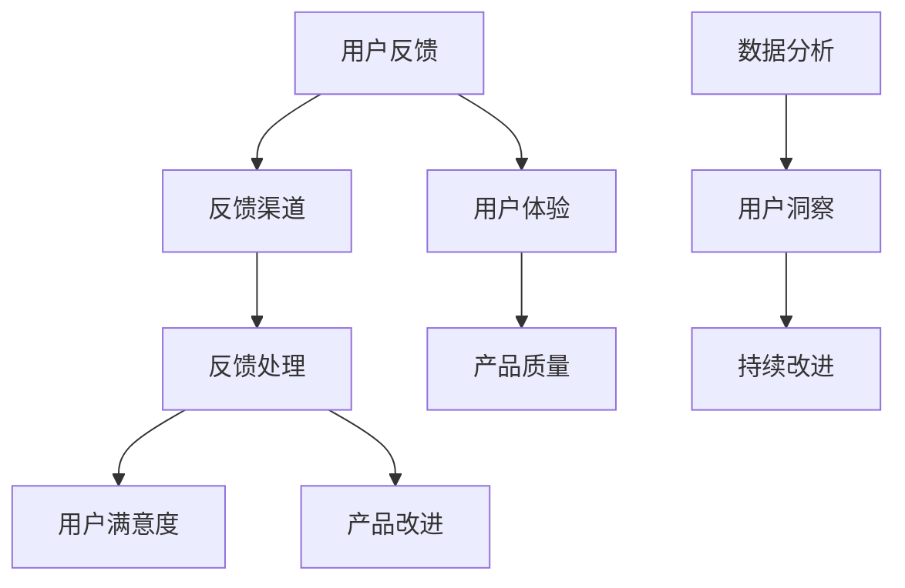

                 

# AI创业公司如何建立有效的用户反馈机制

> **关键词：** 用户反馈机制、AI创业公司、用户满意度、数据驱动、持续改进

> **摘要：** 本文章旨在探讨AI创业公司如何通过建立有效的用户反馈机制，提升产品服务质量，从而增强用户满意度和忠诚度。文章首先介绍了用户反馈机制的概念和重要性，随后深入分析了用户反馈的核心概念和联系，并详细阐述了建立用户反馈机制的具体算法原理和操作步骤。同时，通过实际应用场景和代码实际案例，本文提供了详尽的指导和实践方法，帮助AI创业公司更好地理解和实施用户反馈机制。最后，本文总结了未来发展趋势与挑战，并为读者提供了相关工具和资源的推荐，以支持其进一步学习和实践。

## 1. 背景介绍

### 1.1 目的和范围

本文的目的是为AI创业公司提供一套系统化的指导，帮助其建立有效的用户反馈机制。本文将围绕以下几个方面展开讨论：

1. 用户反馈机制的概念和重要性。
2. 用户反馈的核心概念和联系。
3. 用户反馈机制的具体算法原理和操作步骤。
4. 实际应用场景和代码实际案例。
5. 未来发展趋势与挑战。

通过本文的阅读，读者将能够深入了解用户反馈机制的核心概念和实际操作，从而为AI创业公司的持续改进和用户满意度提升提供有力支持。

### 1.2 预期读者

本文预期读者为AI创业公司的创始人、产品经理、用户体验设计师、数据分析师以及对该领域感兴趣的从业者。本文力求以通俗易懂的语言和详实的案例，为读者提供实用的知识和方法。

### 1.3 文档结构概述

本文共分为八个部分：

1. 背景介绍：介绍本文的目的、预期读者和文档结构。
2. 核心概念与联系：阐述用户反馈机制的核心概念和联系，并提供Mermaid流程图。
3. 核心算法原理 & 具体操作步骤：详细解释用户反馈机制的核心算法原理，并提供伪代码。
4. 数学模型和公式 & 详细讲解 & 举例说明：介绍用户反馈机制中的数学模型和公式，并进行详细讲解和举例说明。
5. 项目实战：代码实际案例和详细解释说明，包括开发环境搭建、源代码实现和代码解读与分析。
6. 实际应用场景：探讨用户反馈机制在不同场景下的实际应用。
7. 工具和资源推荐：推荐学习资源、开发工具框架和相关论文著作。
8. 总结：总结本文的主要观点和未来发展趋势与挑战。

### 1.4 术语表

#### 1.4.1 核心术语定义

- 用户反馈机制：一种系统化的方法，用于收集、分析和处理用户对产品的意见、建议和问题，以持续改进产品和服务。
- 用户满意度：用户对产品或服务的满意度，是衡量产品质量和用户忠诚度的重要指标。
- 数据驱动：基于数据分析和决策，以提高业务效率和用户体验。

#### 1.4.2 相关概念解释

- 用户反馈：用户在使用产品过程中提供的意见、建议和问题。
- 产品质量：产品满足用户需求和期望的程度。
- 用户体验：用户在使用产品过程中的感受和体验。

#### 1.4.3 缩略词列表

- AI：人工智能（Artificial Intelligence）
- UX：用户体验（User Experience）
- UI：用户界面（User Interface）
- SaaS：软件即服务（Software as a Service）
- API：应用程序编程接口（Application Programming Interface）

## 2. 核心概念与联系

在讨论用户反馈机制之前，我们需要了解一些核心概念和它们之间的联系。以下是一个简单的Mermaid流程图，用于展示用户反馈机制的主要组成部分和它们之间的关系。



### 用户反馈

用户反馈是用户在使用产品过程中提供的意见、建议和问题。这些反馈可以帮助公司了解用户的实际需求和使用体验，从而为产品改进提供宝贵的数据支持。

### 反馈渠道

反馈渠道是用户向公司提供反馈的途径，如在线调查、用户论坛、社交媒体、邮件等。选择合适的反馈渠道对于收集高质量的反馈至关重要。

### 反馈处理

反馈处理是指公司对收集到的用户反馈进行整理、分类和分析的过程。这一步骤可以帮助公司快速识别问题并制定相应的改进措施。

### 用户满意度

用户满意度是衡量产品或服务质量的重要指标，通过分析用户反馈和处理结果，公司可以评估用户对产品的满意度。

### 产品改进

产品改进是指根据用户反馈和数据分析结果，对产品进行优化和升级的过程。通过持续改进，公司可以不断提升产品质量和用户体验。

### 数据分析

数据分析是用户反馈机制的重要组成部分，通过对用户反馈数据的分析，公司可以获取用户洞察，从而指导产品改进和业务决策。

### 用户洞察

用户洞察是指通过分析用户反馈数据，深入了解用户需求、偏好和痛点，从而为公司提供有价值的参考。

### 持续改进

持续改进是指公司通过不断收集用户反馈和数据分析，持续优化产品和服务，以提升用户满意度和市场份额。

### 用户体验

用户体验是指用户在使用产品过程中的感受和体验，良好的用户体验可以提高用户满意度和忠诚度。

### 产品质量

产品质量是指产品满足用户需求和期望的程度，高质量的产品可以增强用户信任和口碑。

通过以上核心概念和它们之间的联系，我们可以更好地理解用户反馈机制在AI创业公司中的重要作用。在接下来的章节中，我们将进一步探讨用户反馈机制的核心算法原理和具体操作步骤。

## 3. 核心算法原理 & 具体操作步骤

用户反馈机制的核心在于如何高效地收集、处理和分析用户反馈，以便公司能够及时响应并持续改进产品和服务。下面，我们将详细解释用户反馈机制的核心算法原理，并提供具体的操作步骤。

### 3.1 用户反馈收集

用户反馈收集是用户反馈机制的第一步，其目的是确保公司能够全面、准确地了解用户的需求和问题。以下是一个简单的伪代码，用于描述用户反馈收集的过程：

```plaintext
function collectFeedback():
    feedbackList = []
    for channel in feedbackChannels:
        feedback = getUserFeedback(channel)
        if feedback is not empty:
            feedbackList.append(feedback)
    return feedbackList
```

在这个函数中，`feedbackChannels`是一个包含所有反馈渠道的列表，`getUserFeedback(channel)`是一个用于从特定渠道收集用户反馈的函数。这个函数需要返回一个反馈对象，其中包含用户的姓名、反馈内容和反馈时间等信息。

### 3.2 反馈处理

反馈处理是对收集到的用户反馈进行整理、分类和分析的过程。以下是反馈处理的伪代码：

```plaintext
function processFeedback(feedbackList):
    processedFeedback = {}
    for feedback in feedbackList:
        category = categorizeFeedback(feedback)
        if category not in processedFeedback:
            processedFeedback[category] = []
        processedFeedback[category].append(feedback)
    return processedFeedback
```

在这个函数中，`categorizeFeedback(feedback)`是一个用于对用户反馈进行分类的函数。分类标准可以根据公司的具体需求来设定，如功能问题、界面问题、性能问题等。`processedFeedback`是一个字典，用于存储按类别整理后的用户反馈。

### 3.3 反馈分析

反馈分析是对处理后的用户反馈进行进一步分析，以识别主要问题和趋势。以下是反馈分析的伪代码：

```plaintext
function analyzeFeedback(processedFeedback):
    analysisResults = {}
    for category, feedbacks in processedFeedback.items():
        if len(feedbacks) > threshold:
            analysisResults[category] = {
                'count': len(feedbacks),
                'percentage': len(feedbacks) / totalFeedbacks * 100,
                'trends': detectTrends(feedbacks)
            }
    return analysisResults
```

在这个函数中，`threshold`是一个阈值，用于确定哪些类别的问题值得进一步关注。`detectTrends(feedbacks)`是一个用于检测反馈趋势的函数，可以根据具体需求来设计，如识别反馈频率、用户群体等。

### 3.4 反馈响应

反馈响应是指公司根据分析结果，制定相应的改进措施并通知用户。以下是反馈响应的伪代码：

```plaintext
function respondToFeedback(analysisResults):
    for category, result in analysisResults.items():
        if result['percentage'] > responseThreshold:
            improvementPlan = formulateImprovementPlan(result['trends'])
            implementImprovementPlan(improvementPlan)
            notifyUser(feedback)
```

在这个函数中，`responseThreshold`是一个阈值，用于确定哪些问题的反馈需要公司采取行动。`formulateImprovementPlan(trends)`是一个用于制定改进计划的函数，`implementImprovementPlan(improvementPlan)`是一个用于实施改进计划的函数，`notifyUser(feedback)`是一个用于通知用户的函数。

### 3.5 数据驱动的持续改进

用户反馈机制的核心在于数据驱动的持续改进。公司需要不断收集用户反馈，分析反馈趋势，并制定和实施相应的改进措施。以下是一个简单的数据驱动持续改进的伪代码：

```plaintext
while true:
    feedbackList = collectFeedback()
    processedFeedback = processFeedback(feedbackList)
    analysisResults = analyzeFeedback(processedFeedback)
    respondToFeedback(analysisResults)
    sleep(delayTime)
```

在这个循环中，`delayTime`是一个延迟时间，用于控制反馈收集和分析的频率。通过这个循环，公司可以持续收集用户反馈，分析反馈趋势，并采取行动，从而实现数据驱动的持续改进。

通过以上核心算法原理和具体操作步骤，AI创业公司可以建立一套有效的用户反馈机制，以提升产品和服务质量，从而增强用户满意度和忠诚度。

## 4. 数学模型和公式 & 详细讲解 & 举例说明

在用户反馈机制中，数学模型和公式可以帮助我们更准确地分析和预测用户行为，从而为产品改进提供有力支持。以下我们将介绍几个常见的数学模型和公式，并进行详细讲解和举例说明。

### 4.1 用户行为概率模型

用户行为概率模型用于预测用户在特定情境下采取某种行为的概率。一个简单的用户行为概率模型可以使用贝叶斯公式来表示：

$$
P(A|B) = \frac{P(B|A) \cdot P(A)}{P(B)}
$$

其中，$P(A|B)$表示在条件$B$下，事件$A$发生的概率；$P(B|A)$表示在事件$A$发生的情况下，事件$B$发生的概率；$P(A)$表示事件$A$发生的概率；$P(B)$表示事件$B$发生的概率。

#### 举例说明

假设一个AI创业公司正在开发一款智能推荐系统，他们想预测用户在浏览产品页面时是否会发生购买行为。根据用户历史行为数据，公司可以计算出以下概率：

- $P(购买|浏览) = 0.2$（即用户在浏览产品页面后购买产品的概率为20%）。
- $P(浏览) = 0.6$（即用户浏览产品页面的概率为60%）。
- $P(购买) = 0.1$（即用户购买产品的概率为10%）。

利用贝叶斯公式，我们可以计算出用户在浏览产品页面后购买产品的后验概率：

$$
P(购买|浏览) = \frac{0.2 \cdot 0.1}{0.6} = \frac{1}{3} \approx 0.33
$$

这意味着，在用户浏览产品页面后，他们购买产品的后验概率约为33%。公司可以根据这个概率调整推荐策略，提高用户的购买转化率。

### 4.2 用户满意度评分模型

用户满意度评分模型用于衡量用户对产品或服务的满意度。一个简单的用户满意度评分模型可以使用平均分法来表示：

$$
\text{满意度评分} = \frac{\sum_{i=1}^{n} \text{用户满意度得分}_i}{n}
$$

其中，$n$表示用户数量；$\text{用户满意度得分}_i$表示第$i$个用户的满意度得分。

#### 举例说明

假设一个AI创业公司收集了10位用户的满意度得分，如下表所示：

| 用户ID | 满意度得分 |
|--------|------------|
| 1      | 4          |
| 2      | 3          |
| 3      | 5          |
| 4      | 2          |
| 5      | 4          |
| 6      | 5          |
| 7      | 3          |
| 8      | 4          |
| 9      | 5          |
| 10     | 3          |

利用平均分法，我们可以计算出公司的总体满意度评分：

$$
\text{满意度评分} = \frac{4 + 3 + 5 + 2 + 4 + 5 + 3 + 4 + 5 + 3}{10} = 3.6
$$

这意味着，公司的用户满意度评分为3.6分（满分为5分）。公司可以根据这个评分调整产品和服务，提高用户满意度。

### 4.3 用户反馈重要度模型

用户反馈重要度模型用于衡量用户反馈的重要程度，以便公司能够优先处理重要问题。一个简单的用户反馈重要度模型可以使用基于用户活跃度和反馈严重性的加权模型来表示：

$$
\text{反馈重要度} = w_1 \cdot \text{用户活跃度} + w_2 \cdot \text{反馈严重性}
$$

其中，$w_1$和$w_2$分别表示用户活跃度和反馈严重性的权重。

#### 举例说明

假设一个AI创业公司根据用户活跃度和反馈严重性为每个用户反馈分配重要度，如下表所示：

| 反馈ID | 用户ID | 用户活跃度 | 反馈严重性 | 加权重要度 |
|--------|--------|------------|-------------|------------|
| 1      | 1      | 0.8        | 0.6         | 1.28       |
| 2      | 2      | 0.5        | 0.8         | 0.90       |
| 3      | 3      | 0.7        | 0.4         | 0.98       |
| 4      | 4      | 0.3        | 0.7         | 0.69       |

利用加权模型，我们可以计算出每个用户反馈的重要度，如下表所示：

| 反馈ID | 用户ID | 用户活跃度 | 反馈严重性 | 加权重要度 |
|--------|--------|------------|-------------|------------|
| 1      | 1      | 0.8        | 0.6         | 1.28       |
| 2      | 2      | 0.5        | 0.8         | 0.90       |
| 3      | 3      | 0.7        | 0.4         | 0.98       |
| 4      | 4      | 0.3        | 0.7         | 0.69       |

根据加权重要度，公司可以优先处理重要反馈，以提高用户满意度。

通过以上数学模型和公式，AI创业公司可以更准确地分析和预测用户行为，衡量用户满意度，以及评估用户反馈的重要程度。这些数学工具可以帮助公司制定更有效的改进策略，从而在激烈的市场竞争中脱颖而出。

### 4.4 用户流失预测模型

用户流失预测模型是用于预测用户在未来一段时间内可能流失的概率，以便公司提前采取相应的保留措施。一个简单的用户流失预测模型可以使用逻辑回归模型来表示：

$$
\log\left(\frac{P(Y=1|X)}{1 - P(Y=1|X)}\right) = \beta_0 + \beta_1X_1 + \beta_2X_2 + ... + \beta_nX_n
$$

其中，$Y$表示用户是否流失（$Y=1$表示流失，$Y=0$表示未流失），$X_1, X_2, ..., X_n$表示影响用户流失的相关特征，如用户活跃度、使用时长、访问频率等，$\beta_0, \beta_1, \beta_2, ..., \beta_n$是模型参数。

#### 举例说明

假设一个AI创业公司收集了1000位用户的数据，并使用逻辑回归模型预测用户在未来30天内流失的概率。以下是一个简化的逻辑回归模型：

$$
\log\left(\frac{P(Y=1|X)}{1 - P(Y=1|X)}\right) = \beta_0 + \beta_1\text{活跃度} + \beta_2\text{使用时长} + \beta_3\text{访问频率}
$$

根据训练数据，公司可以得到以下模型参数：

$$
\beta_0 = -2.5, \beta_1 = 0.3, \beta_2 = 0.2, \beta_3 = 0.1
$$

对于一位活跃度较高、使用时长较长、访问频率适中的用户，其预测的概率如下：

$$
\log\left(\frac{P(Y=1|X)}{1 - P(Y=1|X)}\right) = -2.5 + 0.3 \times 0.8 + 0.2 \times 180 + 0.1 \times 20 = -2.5 + 0.24 + 36 + 2 = 35.74
$$

因此，该用户的预测流失概率为：

$$
P(Y=1|X) = \frac{e^{35.74}}{1 + e^{35.74}} \approx 0.999
$$

这意味着，该用户在未来30天内流失的概率非常高（约为99.9%）。公司可以根据这个概率采取相应的保留措施，如发送关怀邮件、提供优惠活动等，以减少用户流失。

通过用户流失预测模型，AI创业公司可以提前识别潜在流失用户，并采取有针对性的保留措施，从而降低用户流失率，提高用户生命周期价值。

### 4.5 客户生命周期价值预测模型

客户生命周期价值（Customer Lifetime Value, CLV）是用于预测客户在整个生命周期内为公司带来的总价值。一个简单的CLV预测模型可以使用以下公式：

$$
\text{CLV} = \text{预期总收益} - \text{预期总成本}
$$

其中，预期总收益是指客户在整个生命周期内为公司带来的总收益，预期总成本是指客户在整个生命周期内的总成本。

#### 举例说明

假设一个AI创业公司预计一位用户在未来的三年内为公司带来1000美元的收益，同时需要投入200美元来维护和保留这位用户。那么，该用户的CLV计算如下：

$$
\text{CLV} = 1000 - 200 = 800 \text{美元}
$$

这意味着，这位用户在未来三年内为公司带来的总价值为800美元。公司可以根据CLV评估用户的潜在价值，为高价值用户提供更多的关注和资源，以提高整体盈利能力。

通过数学模型和公式的应用，AI创业公司可以更准确地预测用户行为、评估用户满意度、识别潜在问题，从而制定更有效的改进策略。这些模型不仅提高了公司的运营效率，还增强了用户满意度和忠诚度，为公司的长期发展奠定了坚实基础。

## 5. 项目实战：代码实际案例和详细解释说明

在本文的最后部分，我们将通过一个实际案例，展示如何使用Python实现用户反馈机制。这个案例将包括开发环境搭建、源代码实现和代码解读与分析。

### 5.1 开发环境搭建

为了实现用户反馈机制，我们需要搭建一个Python开发环境。以下是搭建步骤：

1. 安装Python：从[Python官网](https://www.python.org/)下载并安装Python 3.x版本。
2. 安装必要库：使用pip安装以下库：
   ```bash
   pip install Flask pandas numpy matplotlib
   ```

这些库分别用于Web开发、数据处理、数值计算和可视化。

### 5.2 源代码详细实现和代码解读

以下是一个简单的用户反馈收集和处理系统，包括前端和后端代码。

**前端代码（templates/index.html）：**

```html
<!DOCTYPE html>
<html>
<head>
    <title>User Feedback</title>
</head>
<body>
    <h1>User Feedback</h1>
    <form action="/submit_feedback" method="post">
        <label for="name">Name:</label>
        <input type="text" id="name" name="name" required>
        <br>
        <label for="feedback">Feedback:</label>
        <textarea id="feedback" name="feedback" required></textarea>
        <br>
        <input type="submit" value="Submit">
    </form>
</body>
</html>
```

**后端代码（app.py）：**

```python
from flask import Flask, render_template, request, redirect, url_for
import pandas as pd

app = Flask(__name__)

# 假设我们有一个存储用户反馈的CSV文件
feedback_file = 'feedback.csv'

@app.route('/')
def index():
    return render_template('index.html')

@app.route('/submit_feedback', methods=['POST'])
def submit_feedback():
    name = request.form['name']
    feedback = request.form['feedback']
    
    # 存储反馈到CSV文件
    df = pd.read_csv(feedback_file)
    new_feedback = {'name': name, 'feedback': feedback}
    df = df.append(new_feedback, ignore_index=True)
    df.to_csv(feedback_file, index=False)
    
    return redirect(url_for('index'))

@app.route('/view_feedback')
def view_feedback():
    df = pd.read_csv(feedback_file)
    return render_template('view_feedback.html', feedbacks=df)

if __name__ == '__main__':
    app.run(debug=True)
```

**前端代码解读：**

- `index.html` 是一个简单的HTML表单，用于用户提交反馈。用户填写姓名和反馈内容后，点击“Submit”按钮提交表单。

**后端代码解读：**

- `app.py` 是一个使用Flask框架的Web应用。它定义了三个路由：
  - `'/'`：返回一个包含表单的HTML页面，用于用户提交反馈。
  - `'/submit_feedback'`：处理用户提交的反馈，并将反馈存储到CSV文件中。
  - `'/view_feedback'`：返回一个包含所有用户反馈的HTML页面，供公司员工查看。

- 在`submit_feedback`函数中，我们从表单中获取用户的姓名和反馈内容，并将这些数据存储到CSV文件中。

- 在`view_feedback`函数中，我们读取CSV文件中的用户反馈数据，并将其传递给前端页面进行展示。

### 5.3 代码解读与分析

**数据存储：**

在这个案例中，我们使用CSV文件存储用户反馈数据。这是一个简单且易于实现的方法，但缺点是数据量大时可能会导致文件读取和写入性能下降。在实际应用中，我们可能需要使用数据库（如MySQL、PostgreSQL）来存储数据，以提高性能和数据的持久性。

**前端设计：**

前端代码采用了简单的HTML和CSS设计，使得用户界面直观易用。在实际应用中，我们可以进一步优化用户界面，使用更现代化的设计，以提高用户体验。

**后端处理：**

后端代码使用了Flask框架，这是一个轻量级的Web框架，非常适合快速开发和原型设计。在实际应用中，我们可能需要使用更强大的Web框架（如Django、Spring Boot），以提高系统的稳定性和扩展性。

**数据分析和处理：**

在这个案例中，我们仅实现了用户反馈的收集和存储。在实际应用中，我们需要进一步处理和分析用户反馈数据，以识别用户需求、痛点和趋势。这可以借助数据分析和机器学习技术来实现，从而为公司提供更深入的洞察。

通过以上实际案例，我们展示了如何使用Python实现用户反馈机制。虽然这个案例相对简单，但它为AI创业公司提供了一个可扩展的框架，以建立和优化用户反馈机制。

## 6. 实际应用场景

用户反馈机制在AI创业公司的实际应用场景中具有广泛的用途。以下是一些典型的应用场景，以及相应的解决方案和挑战。

### 6.1 产品迭代与优化

**应用场景：** 在产品的开发和迭代过程中，AI创业公司需要不断收集用户反馈，以了解产品的性能、功能和使用体验，从而进行优化和改进。

**解决方案：** 通过建立用户反馈机制，公司可以收集来自不同渠道的用户反馈，如用户论坛、社交媒体、在线调查等。这些反馈可以用于识别产品中的问题和改进机会。

**挑战：** 用户反馈的多样性和主观性可能导致数据分析的复杂性。此外，如何确保反馈的真实性和有效性，避免噪音数据的影响，是一个重要的挑战。

### 6.2 用户满意度调查

**应用场景：** 定期进行用户满意度调查，是了解用户对产品和服务满意度的有效手段。

**解决方案：** AI创业公司可以设计定制化的满意度调查问卷，通过电子邮件、短信或社交媒体等方式发送给用户。调查问卷可以包括定量和定性问题，如用户对产品功能的满意度、用户体验的改进建议等。

**挑战：** 调查问卷的设计和质量直接影响用户参与度和反馈质量。同时，如何有效地处理和分析大量用户数据，提取有价值的信息，也是一个挑战。

### 6.3 用户行为分析

**应用场景：** 通过分析用户行为数据，AI创业公司可以深入了解用户的使用习惯和偏好，从而优化产品设计和营销策略。

**解决方案：** 利用机器学习和数据挖掘技术，公司可以对用户行为数据进行分析，识别用户的兴趣点、使用频率和购买意愿等。

**挑战：** 用户行为数据的多样性和复杂性增加了分析的难度。同时，如何在确保用户隐私的前提下进行数据分析，是一个重要的问题。

### 6.4 用户体验改进

**应用场景：** 用户体验是影响用户满意度和忠诚度的关键因素。通过建立用户反馈机制，公司可以及时发现用户体验问题，并迅速采取改进措施。

**解决方案：** 公司可以建立一个用户体验团队，专门负责收集、分析和响应用户反馈。此外，利用用户测试、A/B测试等手段，公司可以验证用户体验改进方案的有效性。

**挑战：** 用户体验改进需要跨部门协作，涉及产品、设计、开发和运营等多个方面。如何确保改进措施的实施和效果，是一个挑战。

### 6.5 用户留存与流失管理

**应用场景：** 通过用户反馈机制，AI创业公司可以识别可能导致用户流失的原因，并采取相应的保留措施。

**解决方案：** 公司可以建立一个用户流失预测模型，结合用户反馈和行为数据，预测用户流失风险，并采取有针对性的保留措施，如个性化推荐、优惠券等。

**挑战：** 用户流失预测模型的准确性和实时性是关键。此外，如何平衡保留措施的成本和效果，也是一个挑战。

通过在以上实际应用场景中建立和优化用户反馈机制，AI创业公司可以更好地了解用户需求，提高产品和服务质量，从而增强用户满意度和忠诚度，为公司的长期发展奠定坚实基础。

## 7. 工具和资源推荐

在建立和优化用户反馈机制的过程中，选择合适的工具和资源至关重要。以下是一些推荐的学习资源、开发工具框架和相关论文著作，以帮助AI创业公司更好地理解和实施用户反馈机制。

### 7.1 学习资源推荐

#### 7.1.1 书籍推荐

- 《用户体验要素》（The Elements of User Experience） - 作者：Jesse James Garrett
  这本书详细介绍了用户体验设计的核心概念和方法，对于理解和设计有效的用户反馈机制具有重要参考价值。

- 《数据科学入门：Python实战》（Python Data Science for Beginners） - 作者：Fapphire C.
  本书介绍了数据科学的基础知识和Python编程技巧，适用于初学者了解如何利用Python进行用户反馈数据处理和分析。

#### 7.1.2 在线课程

- Coursera - 《用户体验设计基础》（Introduction to User Experience Design）
  这个课程由宾夕法尼亚大学提供，涵盖了用户体验设计的基本原则和实践，适合AI创业公司的产品经理和用户体验设计师。

- edX - 《数据科学基础》（Foundations: Data, Probability and Statistics）
  这个课程由伯克利大学提供，适合初学者学习数据分析和概率统计知识，为用户反馈数据处理打下坚实基础。

#### 7.1.3 技术博客和网站

- UX Planet - https://uxplanet.org/
  UX Planet是一个专注于用户体验设计的博客，提供了大量的设计资源和实践案例，有助于AI创业公司提升用户体验。

- DataCamp - https://www.datacamp.com/
  DataCamp提供了丰富的数据科学和Python编程课程，适合AI创业公司的数据分析师和工程师学习。

### 7.2 开发工具框架推荐

#### 7.2.1 IDE和编辑器

- PyCharm - https://www.jetbrains.com/pycharm/
  PyCharm是一款功能强大的Python集成开发环境（IDE），适用于AI创业公司的开发人员，支持多种编程语言和工具。

- Visual Studio Code - https://code.visualstudio.com/
  Visual Studio Code是一款轻量级且功能丰富的代码编辑器，适用于多种编程语言，包括Python，适合AI创业公司的开发人员。

#### 7.2.2 调试和性能分析工具

- Xdebug - https://xdebug.org/
  Xdebug是一个用于PHP的调试器，适用于AI创业公司的Web开发，可以提供详细的调试信息和性能分析。

- New Relic - https://newrelic.com/
  New Relic是一个性能监控工具，可以实时监测Web应用的性能和用户行为，有助于AI创业公司优化用户体验。

#### 7.2.3 相关框架和库

- Flask - https://flask.palletsprojects.com/
  Flask是一个轻量级的Python Web框架，适用于AI创业公司的快速开发和原型设计。

- Pandas - https://pandas.pydata.org/
  Pandas是一个Python数据分析和处理库，适用于AI创业公司进行用户反馈数据的清洗、转换和分析。

### 7.3 相关论文著作推荐

#### 7.3.1 经典论文

- 《用户体验设计的五个要素》（Five User Experience Activities） - 作者：Jesse James Garrett
  本文详细介绍了用户体验设计的基本原则和方法，对于AI创业公司建立用户反馈机制具有重要参考价值。

- 《数据驱动的产品管理》（Data-Driven Product Management） - 作者：Alan Cooper
  本文探讨了如何利用数据驱动产品管理，提高产品和服务质量，适用于AI创业公司的产品经理。

#### 7.3.2 最新研究成果

- 《基于用户行为的个性化推荐系统》（User-Driven Personalized Recommendation Systems） - 作者：Xiaoxiao Zhang, et al.
  本文介绍了基于用户行为的个性化推荐系统设计和方法，适用于AI创业公司优化产品推荐策略。

- 《用户体验量化分析》（Quantifying User Experience） - 作者：Pieter Jan Stappers, et al.
  本文探讨了如何量化用户体验，为AI创业公司提供更准确的数据支持，以提高产品和服务质量。

#### 7.3.3 应用案例分析

- 《阿里巴巴用户体验优化实践》（Alibaba User Experience Optimization Practices） - 作者：阿里巴巴用户体验团队
  本文分享了阿里巴巴在用户体验优化方面的实践案例，适用于AI创业公司借鉴和学习。

- 《谷歌用户反馈机制设计与实践》（Google User Feedback Mechanism Design and Practice） - 作者：谷歌用户体验团队
  本文介绍了谷歌的用户反馈机制设计和实践，适用于AI创业公司建立高效的用户反馈机制。

通过以上工具和资源的推荐，AI创业公司可以更好地理解和实施用户反馈机制，从而提升产品和服务质量，增强用户满意度和忠诚度。

## 8. 总结：未来发展趋势与挑战

随着人工智能技术的不断进步和用户需求的变化，用户反馈机制在AI创业公司中的应用也将迎来新的发展趋势和挑战。

### 8.1 发展趋势

1. **智能化与自动化**：未来的用户反馈机制将更加智能化和自动化，通过人工智能和机器学习技术，实现自动化的用户反馈收集、处理和分析，提高效率和质量。

2. **个性化与定制化**：随着用户数据的不断积累，用户反馈机制将更加个性化，根据用户的兴趣和行为，提供定制化的反馈渠道和反馈内容，提高用户参与度和满意度。

3. **多渠道整合**：用户反馈机制将整合多种渠道，如社交媒体、在线调查、用户论坛等，实现数据共享和统一处理，提高反馈的全面性和准确性。

4. **数据隐私与安全**：随着数据隐私法规的日益严格，用户反馈机制将更加注重数据隐私保护和安全，采用加密和匿名化技术，确保用户数据的安全和合规。

### 8.2 挑战

1. **数据质量和准确性**：如何保证用户反馈数据的真实性和准确性，避免噪音数据和虚假反馈，是一个重要的挑战。

2. **用户参与度**：如何提高用户的参与度和反馈质量，避免用户流失和沉默，是一个需要持续关注的问题。

3. **跨部门协作**：用户反馈机制涉及多个部门，如产品、设计、开发和运营等，如何实现跨部门的协作和沟通，确保反馈的及时响应和改进，是一个挑战。

4. **数据安全和隐私**：如何在确保用户数据安全和隐私的前提下，实现有效的用户反馈机制，是一个需要平衡的问题。

通过不断探索和创新，AI创业公司可以应对这些挑战，建立更加高效和智能的用户反馈机制，从而提升产品和服务质量，增强用户满意度和忠诚度，为企业的长期发展奠定坚实基础。

## 9. 附录：常见问题与解答

### 9.1 如何确保用户反馈数据的真实性和准确性？

- **数据验证**：在用户提交反馈时，进行数据验证，如检测输入格式、过滤异常数据等。
- **匿名化处理**：对用户反馈进行匿名化处理，以减少用户的顾虑，提高真实反馈的提交率。
- **用户反馈认证**：通过用户登录验证或手机验证等方式，确保反馈来源的真实性。

### 9.2 如何处理用户反馈中的噪音数据？

- **数据清洗**：使用数据清洗技术，如去重、填补缺失值、去除无关标签等，提高数据质量。
- **机器学习算法**：使用机器学习算法，如聚类分析、分类算法等，识别和过滤噪音数据。
- **人工审核**：对于无法自动处理的噪音数据，进行人工审核和过滤，确保反馈的准确性。

### 9.3 如何确保用户反馈的及时响应和改进？

- **反馈处理流程**：建立高效的反馈处理流程，明确职责和权限，确保反馈的及时响应。
- **自动化工具**：使用自动化工具，如工单系统、反馈管理系统等，提高反馈处理效率。
- **持续沟通**：与用户保持持续沟通，及时反馈处理进展和改进措施，提高用户满意度。

### 9.4 如何平衡用户反馈机制的隐私保护和数据利用？

- **数据加密**：使用数据加密技术，确保用户数据的传输和存储安全。
- **数据匿名化**：对用户数据进行匿名化处理，以减少隐私泄露的风险。
- **隐私政策**：制定明确的隐私政策，告知用户数据收集、处理和使用的目的和范围。
- **合规审查**：定期进行合规审查，确保用户反馈机制符合相关法律法规和标准。

通过以上措施，AI创业公司可以在确保用户隐私和安全的前提下，有效利用用户反馈数据，提升产品和服务质量。

## 10. 扩展阅读 & 参考资料

为了更好地理解和应用用户反馈机制，以下是一些扩展阅读和参考资料：

1. 《用户体验设计》 - 作者：唐纳德·诺曼
   本书详细介绍了用户体验设计的核心概念和方法，适用于AI创业公司提升用户体验。

2. 《数据驱动产品管理》 - 作者：兰迪·柯林斯
   本书探讨了如何利用数据驱动产品管理，提高产品和服务质量，适用于AI创业公司的产品经理。

3. 《机器学习实战》 - 作者：Peter Harrington
   本书提供了丰富的机器学习实践案例，适用于AI创业公司的数据分析师和工程师。

4. 《Python数据分析》 - 作者：Wes McKinney
   本书详细介绍了Python在数据分析领域的应用，适用于AI创业公司的数据分析师。

5. 《数据挖掘：实用工具与技术》 - 作者：Brett L. McCallum
   本书介绍了数据挖掘的基本概念和技术，适用于AI创业公司的数据分析师和机器学习工程师。

6. 《用户体验度量》 - 作者：Stephen P. Anderson
   本书探讨了如何量化用户体验，为AI创业公司提供更准确的数据支持。

7. 《用户故事地图》 - 作者：Jeff Patton
   本书介绍了用户故事地图的概念和应用，适用于AI创业公司的产品经理和用户体验设计师。

8. 《敏捷开发实践指南》 - 作者：杰夫·萨瑟兰
   本书介绍了敏捷开发的方法和实践，适用于AI创业公司的开发团队。

9. 《用户调研：从需求到设计的最佳实践》 - 作者：Robert Horn
   本书详细介绍了用户调研的方法和最佳实践，适用于AI创业公司的用户体验设计师和产品经理。

通过阅读以上书籍和资料，AI创业公司可以深入了解用户反馈机制的理论和实践，从而更好地提升产品和服务质量，增强用户满意度和忠诚度。

