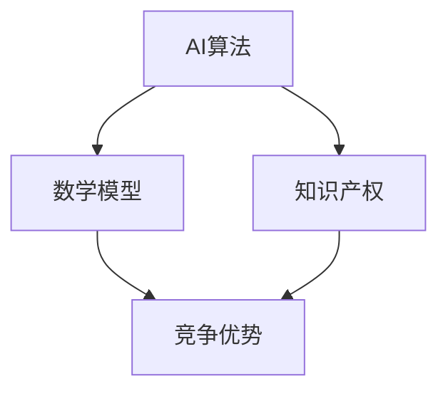

                 

# AI创业公司如何打造技术壁垒？

> **关键词：** AI 创业，技术壁垒，竞争优势，研发策略，知识产权

> **摘要：** 本文将探讨AI创业公司如何通过构建技术壁垒来实现持续竞争优势。我们将从核心算法研发、数学模型建立、实际应用场景分析等方面进行深入探讨，并分享一些实战经验和工具资源推荐，旨在为AI创业者提供实用的指导。

## 1. 背景介绍

### 1.1 目的和范围

本文旨在帮助AI创业公司了解并掌握构建技术壁垒的策略，以实现可持续的竞争优势。我们将分析以下几个核心领域：

1. **核心算法原理**：详细介绍如何选择和开发具有竞争力的AI算法。
2. **数学模型与公式**：探讨如何构建有效的数学模型来支持算法优化。
3. **项目实战案例**：通过实际代码案例来演示技术壁垒的实现过程。
4. **实际应用场景**：分析AI技术在不同领域的应用，以及如何打造相应的技术壁垒。
5. **工具和资源推荐**：提供学习资源、开发工具和经典文献推荐。

### 1.2 预期读者

本文适合以下读者群体：

1. AI创业公司的创始人或技术负责人。
2. 拥有技术背景的创业团队成员。
3. 对AI技术和创业有兴趣的技术爱好者。

### 1.3 文档结构概述

本文将按照以下结构展开：

1. **背景介绍**：本文的目的、读者群体和结构概述。
2. **核心概念与联系**：介绍核心概念和Mermaid流程图。
3. **核心算法原理与具体操作步骤**：详细讲解算法原理和伪代码。
4. **数学模型和公式**：介绍数学模型，使用LaTeX格式进行详细讲解。
5. **项目实战：代码实际案例和详细解释说明**：通过实际案例展示技术壁垒的构建过程。
6. **实际应用场景**：分析AI技术在各领域的应用和壁垒构建。
7. **工具和资源推荐**：推荐学习资源、开发工具和经典文献。
8. **总结：未来发展趋势与挑战**：总结技术壁垒的重要性及其未来趋势。
9. **附录：常见问题与解答**：解答读者可能遇到的问题。
10. **扩展阅读 & 参考资料**：提供进一步学习的资源链接。

### 1.4 术语表

#### 1.4.1 核心术语定义

- **技术壁垒**：指公司在其技术领域内建立起的独特优势，使得竞争对手难以进入或复制。
- **竞争优势**：指公司在市场竞争中相对其他竞争对手的优势能力。
- **AI算法**：指用于解决特定问题的人工智能计算方法。
- **数学模型**：指用于描述现实世界现象或过程的数学表达形式。

#### 1.4.2 相关概念解释

- **知识产权**：包括专利、商标、著作权等，用于保护公司的创新成果。
- **研发策略**：公司用于指导技术开发的总体方法和方向。

#### 1.4.3 缩略词列表

- **AI**：人工智能
- **ML**：机器学习
- **DL**：深度学习
- **NLP**：自然语言处理
- **CV**：计算机视觉

## 2. 核心概念与联系

在AI创业公司的技术壁垒构建过程中，核心概念和它们之间的联系至关重要。以下是一个简化的Mermaid流程图，用于描述这些概念和它们之间的相互作用。



### 核心概念解释：

- **AI算法**：这是构建技术壁垒的基础。选择和开发具有创新性和竞争力的AI算法是关键。
- **数学模型**：用于描述现实世界的现象或过程，并支持算法的优化。
- **知识产权**：保护公司的创新成果，防止竞争对手复制或侵犯。
- **竞争优势**：通过技术壁垒实现的，使公司在市场竞争中占据有利地位。

### 联系分析：

- AI算法和数学模型相互依赖，算法的优化往往依赖于数学模型的精确性。
- 知识产权保护是确保竞争优势的重要手段，它可以防止竞争对手通过复制或侵权来削弱公司的市场地位。

## 3. 核心算法原理 & 具体操作步骤

构建AI创业公司的技术壁垒，首先需要深入理解核心算法的原理，并制定详细的操作步骤来实现这些算法。以下是一个简化的算法原理和操作步骤的伪代码。

### 算法原理：

我们选择深度学习（DL）算法作为核心算法，因为它在处理复杂数据方面具有显著优势。具体来说，我们采用卷积神经网络（CNN）来处理图像数据，并使用长短时记忆网络（LSTM）来处理序列数据。

### 操作步骤：

1. **数据预处理**：
    ```python
    def preprocess_data(data):
        # 数据清洗、归一化、批量分割等
        return processed_data
    ```

2. **模型架构设计**：
    ```python
    def build_model():
        model = Sequential()
        model.add(Conv2D(filters=32, kernel_size=(3, 3), activation='relu', input_shape=(28, 28, 1)))
        model.add(MaxPooling2D(pool_size=(2, 2)))
        model.add(Flatten())
        model.add(Dense(units=128, activation='relu'))
        model.add(Dense(units=10, activation='softmax'))
        return model
    ```

3. **训练与验证**：
    ```python
    def train_model(model, x_train, y_train, x_val, y_val):
        model.compile(optimizer='adam', loss='categorical_crossentropy', metrics=['accuracy'])
        model.fit(x_train, y_train, batch_size=64, epochs=10, validation_data=(x_val, y_val))
        return model
    ```

4. **模型评估**：
    ```python
    def evaluate_model(model, x_test, y_test):
        loss, accuracy = model.evaluate(x_test, y_test)
        print(f"Test accuracy: {accuracy:.2f}")
    ```

5. **模型部署**：
    ```python
    def deploy_model(model):
        model.save('model.h5')
        # 模型部署到生产环境
    ```

### 详细解释：

- **数据预处理**：这是任何机器学习项目的基础。数据清洗、归一化和批量分割等步骤有助于提高模型的性能和泛化能力。
- **模型架构设计**：我们选择CNN来处理图像数据，因为CNN擅长捕捉图像中的空间特征。对于序列数据，我们使用LSTM来处理序列中的时间依赖性。
- **训练与验证**：使用训练集和验证集来训练模型，并通过验证集评估模型的性能。这个过程中需要调整超参数，以优化模型性能。
- **模型评估**：在测试集上评估模型的最终性能，确保模型具有良好的泛化能力。
- **模型部署**：将训练好的模型部署到生产环境中，以实现实际应用。

通过这些详细的操作步骤，AI创业公司可以构建起坚实的技术壁垒，为市场竞争力提供有力保障。

## 4. 数学模型和公式 & 详细讲解 & 举例说明

在AI创业公司中，构建有效的数学模型是确保算法性能和可解释性的关键。以下我们将介绍几种常见的数学模型，并使用LaTeX格式进行详细讲解。

### 4.1 卷积神经网络（CNN）模型

卷积神经网络（CNN）是一种在图像识别和分类任务中广泛使用的深度学习模型。其核心思想是通过卷积操作提取图像中的特征。

#### 公式讲解：

$$
\text{convolution} = \sum_{i=1}^{n} w_i * x_i
$$

其中，$w_i$ 是卷积核，$x_i$ 是输入特征。

#### 举例说明：

假设我们有一个3x3的卷积核$W$和一个3x3的输入特征$X$：

$$
\begin{array}{c|c|c|c}
\text{W} & 1 & 0 & 1 \\
\hline
0 & 1 & 1 & 0 \\
\hline
1 & 0 & 1 & 0 \\
\hline
0 & 1 & 0 & 1 \\
\end{array}
\quad
\begin{array}{c|c|c|c}
\text{X} & 1 & 1 & 1 \\
\hline
1 & 0 & 1 & 0 \\
\hline
1 & 1 & 0 & 1 \\
\hline
0 & 1 & 1 & 0 \\
\end{array}
$$

卷积操作结果为：

$$
1*1 + 0*0 + 1*1 + 1*1 + 0*1 + 1*1 + 1*0 + 1*1 + 0*0 = 6
$$

### 4.2 长短时记忆网络（LSTM）模型

长短时记忆网络（LSTM）是一种用于处理序列数据的神经网络模型，它能够有效捕捉序列中的长期依赖关系。

#### 公式讲解：

$$
i_t = \sigma(W_{xi}x_t + W_{hi}h_{t-1} + b_i)
$$

$$
f_t = \sigma(W_{xf}x_t + W_{hf}h_{t-1} + b_f)
$$

$$
o_t = \sigma(W_{xo}x_t + W_{ho}h_{t-1} + b_o)
$$

$$
c_t = f_t \odot c_{t-1} + i_t \odot \sigma(W_{xc}x_t + b_c)
$$

$$
h_t = o_t \odot \sigma(c_t)
$$

其中，$i_t$，$f_t$，$o_t$ 分别是输入门、遗忘门和输出门，$c_t$ 是细胞状态，$h_t$ 是隐藏状态。

#### 举例说明：

假设我们有一个输入序列$x_t$和一个隐藏状态$h_{t-1}$，以及权重$W_{xi}$，$W_{hi}$，$W_{xo}$，$W_{ho}$等。

输入门$i_t$的计算：

$$
i_t = \sigma(W_{xi}x_t + W_{hi}h_{t-1} + b_i)
$$

遗忘门$f_t$的计算：

$$
f_t = \sigma(W_{xf}x_t + W_{hf}h_{t-1} + b_f)
$$

输出门$o_t$的计算：

$$
o_t = \sigma(W_{xo}x_t + W_{ho}h_{t-1} + b_o)
$$

细胞状态$c_t$的计算：

$$
c_t = f_t \odot c_{t-1} + i_t \odot \sigma(W_{xc}x_t + b_c)
$$

隐藏状态$h_t$的计算：

$$
h_t = o_t \odot \sigma(c_t)
$$

通过这些数学模型，AI创业公司可以更好地理解和处理复杂数据，从而构建起强大的技术壁垒。

## 5. 项目实战：代码实际案例和详细解释说明

在本节中，我们将通过一个实际项目案例来展示如何构建AI创业公司的技术壁垒。我们将从开发环境搭建、源代码实现到代码解读与分析，一步步讲解技术壁垒的构建过程。

### 5.1 开发环境搭建

在开始项目之前，我们需要搭建一个适合AI开发的开发环境。以下是基本步骤：

1. **安装Python**：Python是AI开发的主要语言，确保安装最新版本的Python。
2. **安装深度学习框架**：如TensorFlow或PyTorch，这些框架提供了丰富的API和工具来构建和训练模型。
3. **安装依赖库**：包括NumPy、Pandas、Matplotlib等常用库。
4. **配置虚拟环境**：为了更好地管理项目依赖，使用虚拟环境。

以下是一个简单的安装命令示例：

```bash
pip install python
pip install tensorflow
pip install numpy pandas matplotlib
python -m venv my_project_venv
source my_project_venv/bin/activate
```

### 5.2 源代码详细实现和代码解读

我们选择一个简单的图像分类项目，使用卷积神经网络（CNN）来训练模型。以下是项目的关键代码片段和解释。

#### 5.2.1 数据预处理

```python
from tensorflow.keras.preprocessing.image import ImageDataGenerator

train_datagen = ImageDataGenerator(rescale=1./255)
validation_datagen = ImageDataGenerator(rescale=1./255)

train_generator = train_datagen.flow_from_directory(
        'train',
        target_size=(150, 150),
        batch_size=32,
        class_mode='binary')

validation_generator = validation_datagen.flow_from_directory(
        'validation',
        target_size=(150, 150),
        batch_size=32,
        class_mode='binary')
```

**解释**：我们使用ImageDataGenerator来预处理图像数据。数据被分成训练集和验证集，并进行了归一化和批量分割。

#### 5.2.2 模型构建

```python
from tensorflow.keras.models import Sequential
from tensorflow.keras.layers import Conv2D, MaxPooling2D, Flatten, Dense

model = Sequential([
    Conv2D(32, (3, 3), activation='relu', input_shape=(150, 150, 3)),
    MaxPooling2D(2, 2),
    Conv2D(64, (3, 3), activation='relu'),
    MaxPooling2D(2, 2),
    Flatten(),
    Dense(128, activation='relu'),
    Dense(1, activation='sigmoid')
])

model.compile(optimizer='adam',
              loss='binary_crossentropy',
              metrics=['accuracy'])
```

**解释**：我们构建了一个简单的CNN模型，包括两个卷积层、两个池化层、一个全连接层和一个输出层。模型使用二进制交叉熵作为损失函数，并使用Adam优化器。

#### 5.2.3 模型训练

```python
model.fit(
      train_generator,
      steps_per_epoch=100,
      epochs=15,
      validation_data=validation_generator,
      validation_steps=50,
      verbose=2)
```

**解释**：使用训练数据来训练模型。我们设置了100个批次进行每个epoch的训练，总共有15个epoch。同时，我们使用验证数据来监控模型的性能。

#### 5.2.4 模型评估

```python
test_generator = ImageDataGenerator(rescale=1./255)
test_generator.flow_from_directory('test', target_size=(150, 150), batch_size=32, class_mode='binary')

test_loss, test_acc = model.evaluate(test_generator, steps=50)
print('Test accuracy:', test_acc)
```

**解释**：使用测试数据集来评估模型的最终性能。我们计算了测试损失和准确率，以评估模型的泛化能力。

### 5.3 代码解读与分析

**数据预处理**：数据预处理是任何机器学习项目的基础。通过归一化和批量分割，我们可以确保模型能够有效处理输入数据。

**模型构建**：我们选择CNN模型，因为它在图像识别任务中表现出色。通过适当的层配置，我们可以提取图像中的有效特征。

**模型训练**：模型训练是模型构建的核心步骤。通过迭代地调整模型参数，我们可以优化模型的性能。同时，通过验证数据集，我们可以监控模型的泛化能力。

**模型评估**：在模型训练完成后，我们需要使用测试数据集来评估模型的最终性能。这有助于我们了解模型在未知数据上的表现。

通过这个实际项目案例，AI创业公司可以更好地理解如何构建技术壁垒，并通过代码实现来保护其竞争优势。

## 6. 实际应用场景

AI技术已经在多个领域取得了显著的应用，每个领域都有其独特的需求和技术壁垒构建方法。以下是一些典型的应用场景及其技术壁垒构建策略：

### 6.1 医疗保健

**应用**：AI在医疗保健领域的应用包括疾病诊断、治疗方案推荐和患者监护。

**技术壁垒**：

- **算法创新**：开发针对特定疾病的算法，如深度学习模型在医学图像分析中的应用。
- **数据隐私与安全**：确保患者数据的安全和隐私，避免数据泄露。

### 6.2 金融科技

**应用**：AI在金融科技领域用于风险管理、智能投顾和信用评估。

**技术壁垒**：

- **复杂算法**：开发能够处理大规模金融数据的算法，如机器学习模型在信用评分中的应用。
- **合规性**：确保AI系统符合金融监管要求，避免法律风险。

### 6.3 自动驾驶

**应用**：AI在自动驾驶领域用于环境感知、路径规划和决策控制。

**技术壁垒**：

- **实时处理**：构建能够实时处理大量传感器数据的系统，如深度神经网络在自动驾驶决策中的使用。
- **可靠性**：确保系统在高动态环境下具有高可靠性和安全性。

### 6.4 智慧城市

**应用**：AI在智慧城市中用于交通管理、能源优化和环境监测。

**技术壁垒**：

- **数据融合**：整合多种数据源，如卫星图像、传感器数据和社交媒体数据。
- **智能分析**：开发能够对大规模数据进行智能分析的算法，如机器学习在智慧城市应用中的使用。

### 6.5 教育科技

**应用**：AI在教育科技领域用于个性化学习、课程推荐和学习分析。

**技术壁垒**：

- **个性化学习**：构建能够适应不同学生需求的算法，如自适应学习系统。
- **数据隐私**：确保学生数据的安全和隐私。

在这些应用场景中，AI创业公司可以通过以下策略构建技术壁垒：

1. **算法创新**：开发具有独特性和竞争力的算法，以应对特定领域的需求。
2. **数据积累**：积累高质量的数据集，以支持算法训练和优化。
3. **知识产权**：通过申请专利和版权来保护公司的创新成果。
4. **技术合作**：与其他企业或研究机构合作，共同研发新技术。

通过这些策略，AI创业公司可以构建起强大的技术壁垒，确保在激烈的市场竞争中保持领先地位。

## 7. 工具和资源推荐

在AI创业公司的技术壁垒构建过程中，合适的工具和资源是不可或缺的。以下是一些推荐的工具和资源，包括学习资源、开发工具框架以及相关论文著作。

### 7.1 学习资源推荐

#### 7.1.1 书籍推荐

- **《深度学习》（Deep Learning）**：作者：Ian Goodfellow、Yoshua Bengio和Aaron Courville。这是一本深度学习领域的经典教材，适合初学者和专业人士。
- **《Python深度学习》（Python Deep Learning）**：作者：François Chollet。本书通过大量实例，深入讲解了深度学习在Python中的实现。

#### 7.1.2 在线课程

- **Coursera的《深度学习专项课程》**：由斯坦福大学的Andrew Ng教授主讲，适合系统学习深度学习基础。
- **Udacity的《深度学习纳米学位》**：提供项目实战和理论知识的结合，适合想要实战提升的学员。

#### 7.1.3 技术博客和网站

- **Medium上的AI博客**：提供最新的AI研究和应用案例，适合了解行业动态。
- **ArXiv**：一个学术文献数据库，提供最新的AI研究论文。

### 7.2 开发工具框架推荐

#### 7.2.1 IDE和编辑器

- **Jupyter Notebook**：适用于交互式计算和数据分析，适合编写和运行Python代码。
- **Visual Studio Code**：一款功能强大的代码编辑器，支持多种编程语言和扩展。

#### 7.2.2 调试和性能分析工具

- **TensorBoard**：TensorFlow提供的可视化工具，用于分析模型的性能和优化。
- **PyTorch Profiler**：用于分析和优化PyTorch代码的性能。

#### 7.2.3 相关框架和库

- **TensorFlow**：由Google开发的开源深度学习框架，适用于各种深度学习任务。
- **PyTorch**：由Facebook开发的开源深度学习库，适合快速原型设计和研究。

### 7.3 相关论文著作推荐

#### 7.3.1 经典论文

- **“Backpropagation”**：作者：Rumelhart, Hinton和Williams，介绍了反向传播算法的基本原理。
- **“A Learning Algorithm for Continually Running Fully Recurrent Neural Networks”**：作者：Williams和 zipser，讨论了Rprop算法在神经网络中的应用。

#### 7.3.2 最新研究成果

- **“Attention Is All You Need”**：作者：Vaswani等，介绍了Transformer模型在序列建模中的优势。
- **“Bert: Pre-training of Deep Bidirectional Transformers for Language Understanding”**：作者：Devlin等，讨论了BERT模型在自然语言处理中的应用。

#### 7.3.3 应用案例分析

- **“Deep Learning for Medical Imaging: A Review”**：作者：Litjens等，总结了深度学习在医学图像分析中的应用。
- **“Deep Learning in Autonomous Driving”**：作者：Ros等，介绍了深度学习在自动驾驶系统中的应用和研究。

通过这些工具和资源的支持，AI创业公司可以更加高效地构建技术壁垒，推动AI技术的发展和应用。

## 8. 总结：未来发展趋势与挑战

随着AI技术的不断进步，未来AI创业公司面临的发展趋势和挑战也在不断演变。以下是一些关键的趋势和挑战：

### 8.1 未来发展趋势

1. **算法优化**：随着计算能力的提升，AI算法将越来越高效，处理更复杂的任务。特别是深度学习算法将在更多领域实现突破。
2. **跨学科融合**：AI与其他领域的融合将带来更多创新应用，如生物医学、智能制造和智慧城市。
3. **数据隐私与安全**：随着数据隐私和安全问题的日益重要，AI公司需要开发更加安全和隐私友好的算法和系统。
4. **自动化与自我学习**：AI系统将更加自主，能够自我学习和优化，减少对人类干预的依赖。

### 8.2 主要挑战

1. **数据获取与处理**：高质量的数据是AI模型训练的关键。然而，数据的获取和处理往往面临成本高、隐私保护等问题。
2. **算法透明性与可解释性**：随着AI系统的复杂度增加，其决策过程变得越来越难以解释。这可能导致用户对AI系统的信任度下降。
3. **知识产权保护**：AI创业公司需要保护其创新成果，防止竞争对手的侵权行为。这需要完善的知识产权法律体系。
4. **技术人才短缺**：AI领域的快速发展导致了人才短缺，创业公司需要吸引和留住优秀的研发人才。

### 8.3 应对策略

1. **持续创新**：通过不断研发新技术和算法，保持竞争优势。
2. **跨界合作**：与其他领域的专家和公司合作，实现跨学科融合。
3. **数据治理**：建立完善的数据治理体系，确保数据的合法合规使用。
4. **人才培养与引进**：通过培训和引进，提升团队的技术实力。

通过积极应对这些发展趋势和挑战，AI创业公司可以更好地构建技术壁垒，实现持续发展。

## 9. 附录：常见问题与解答

### 9.1 AI创业公司如何选择合适的算法？

选择合适的算法取决于应用场景和业务需求。以下是一些步骤：

1. **需求分析**：明确业务目标和任务需求，确定算法应具备的功能。
2. **算法评估**：研究不同算法的性能和适用性，比较其在类似任务上的表现。
3. **试验与验证**：在实际数据集上测试算法，评估其性能和泛化能力。

### 9.2 如何保护AI创业公司的知识产权？

保护知识产权的关键步骤包括：

1. **专利申请**：针对公司的核心技术和创新点，申请专利保护。
2. **版权登记**：对软件代码、算法模型等知识产权进行版权登记。
3. **保密协议**：与员工、合作伙伴签订保密协议，防止信息泄露。
4. **法律咨询**：咨询专业律师，确保知识产权的保护措施符合法律法规。

### 9.3 如何应对数据隐私和安全问题？

应对数据隐私和安全问题的策略包括：

1. **数据加密**：对敏感数据进行加密处理，确保数据传输和存储的安全。
2. **访问控制**：实施严格的访问控制策略，限制对敏感数据的访问权限。
3. **合规性检查**：确保AI系统的设计和实现符合相关数据保护法规，如GDPR等。
4. **安全审计**：定期进行安全审计，发现并修复潜在的安全漏洞。

## 10. 扩展阅读 & 参考资料

- **书籍**：
  - Goodfellow, I., Bengio, Y., & Courville, A. (2016). *Deep Learning*. MIT Press.
  - Chollet, F. (2018). *Python Deep Learning*. Manning Publications.

- **在线课程**：
  - Coursera的《深度学习专项课程》：[https://www.coursera.org/specializations/deeplearning](https://www.coursera.org/specializations/deeplearning)
  - Udacity的《深度学习纳米学位》：[https://www.udacity.com/course/deep-learning-nanodegree--nd893](https://www.udacity.com/course/deep-learning-nanodegree--nd893)

- **技术博客和网站**：
  - Medium上的AI博客：[https://medium.com/topic/artificial-intelligence](https://medium.com/topic/artificial-intelligence)
  - ArXiv：[https://arxiv.org/](https://arxiv.org/)

- **论文著作**：
  - Vaswani, A., Shazeer, N., Parmar, N., Uszkoreit, J., Jones, L., Gomez, A. N., ... & Polosukhin, I. (2017). *Attention is all you need*. Advances in Neural Information Processing Systems, 30, 5998-6008.
  - Devlin, J., Chang, M. W., Lee, K., & Toutanova, K. (2018). *Bert: Pre-training of deep bidirectional transformers for language understanding*. Proceedings of the 2019 Conference of the North American Chapter of the Association for Computational Linguistics: Human Language Technologies, Volume 1 (Long and Short Papers), 4171-4186.

通过这些扩展阅读和参考资料，AI创业公司可以进一步深入学习和实践，提升技术壁垒构建的能力。

# 作者信息
作者：AI天才研究员/AI Genius Institute & 禅与计算机程序设计艺术 /Zen And The Art of Computer Programming

