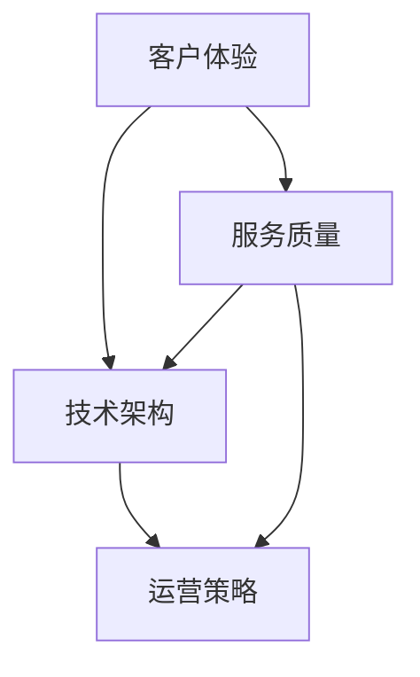

                 

# AI创业公司如何打造服务体系？

> 关键词：AI创业、服务体系、客户体验、技术架构、运营策略

> 摘要：本文将探讨AI创业公司如何打造服务体系，从客户体验、技术架构和运营策略三个方面，提供详细的构建思路和操作步骤，助力企业在竞争激烈的市场中脱颖而出。

## 1. 背景介绍

### 1.1 目的和范围

本文旨在为AI创业公司提供一套系统的服务体系构建指南。通过分析客户需求、技术实现和运营策略，本文将帮助创业者更好地理解服务体系的重要性，并提供具体的实施步骤，以确保服务的高效、可靠和用户友好。

### 1.2 预期读者

- AI创业公司的创始人
- 产品经理和项目经理
- 技术团队成员
- 服务运营和市场营销人员
- 对AI服务体系感兴趣的读者

### 1.3 文档结构概述

本文将分为以下几个部分：

1. 背景介绍：介绍本文的目的、读者群体和文档结构。
2. 核心概念与联系：阐述服务体系的核心概念和组成部分。
3. 核心算法原理 & 具体操作步骤：详细讲解服务体系的技术实现。
4. 数学模型和公式 & 详细讲解 & 举例说明：解释服务体系中的数学模型。
5. 项目实战：代码实际案例和详细解释说明。
6. 实际应用场景：探讨服务体系在现实中的应用。
7. 工具和资源推荐：推荐学习资源和开发工具。
8. 总结：未来发展趋势与挑战。
9. 附录：常见问题与解答。
10. 扩展阅读 & 参考资料：提供进一步的阅读材料。

### 1.4 术语表

#### 1.4.1 核心术语定义

- 服务体系：指公司提供的产品和服务所构成的整体结构和运行机制。
- 客户体验：指用户在使用公司产品或服务过程中的感受和体验。
- 技术架构：指支持服务体系的技术框架和基础设施。
- 运营策略：指公司为了实现服务目标所采取的管理和运营措施。

#### 1.4.2 相关概念解释

- 客户满意度：指客户对产品或服务的满意程度。
- 服务质量：指服务提供的可靠性和效率。
- 容量规划：指根据业务需求对服务器资源进行合理配置。

#### 1.4.3 缩略词列表

- AI：人工智能
- SaaS：软件即服务
- IoT：物联网
- ML：机器学习

## 2. 核心概念与联系

在构建AI创业公司的服务体系时，需要理解并把握以下几个核心概念：

### 2.1 客户体验

客户体验是服务体系的核心，决定了用户对产品或服务的满意度和忠诚度。一个良好的客户体验包括以下几个方面：

1. **易用性**：产品或服务应该易于使用，用户能够快速上手。
2. **响应速度**：服务响应速度要快，确保用户在需要时能够及时得到帮助。
3. **可靠性**：产品或服务要稳定可靠，避免出现故障或崩溃。
4. **个性化**：根据用户的需求和偏好提供个性化的服务。

### 2.2 技术架构

技术架构是服务体系的基础，决定了服务的高效性、可扩展性和可靠性。一个良好的技术架构包括以下几个方面：

1. **模块化**：系统应该模块化设计，便于维护和升级。
2. **分布式**：采用分布式架构，提高系统的可扩展性和容错能力。
3. **安全性**：确保数据安全和用户隐私，防止黑客攻击和数据泄露。
4. **可观测性**：系统应具备良好的可观测性，便于监控和故障排查。

### 2.3 运营策略

运营策略是服务体系成功的关键，决定了服务的效率和用户满意度。一个良好的运营策略包括以下几个方面：

1. **用户反馈**：及时收集用户反馈，不断优化产品和服务。
2. **团队协作**：建立高效的团队协作机制，确保项目的顺利进行。
3. **自动化**：通过自动化工具提高服务效率，减少人工干预。
4. **培训和支持**：为用户提供培训和技术支持，提高用户满意度。

### 2.4 Mermaid 流程图

下面是一个简化的Mermaid流程图，展示了服务体系的核心概念和联系：



## 3. 核心算法原理 & 具体操作步骤

### 3.1 客户体验优化

优化客户体验是服务体系构建的关键步骤。以下是具体操作步骤：

1. **需求分析**：收集用户需求和反馈，了解用户的核心需求。
2. **原型设计**：基于需求分析，设计用户界面和交互流程。
3. **用户测试**：通过用户测试，收集用户对界面和交互的反馈。
4. **迭代优化**：根据用户测试反馈，不断优化用户界面和交互流程。

### 3.2 技术架构设计

设计技术架构是服务体系构建的核心步骤。以下是具体操作步骤：

1. **需求分析**：分析业务需求，确定系统功能和性能要求。
2. **架构设计**：设计符合需求分析的架构方案，包括模块化、分布式和安全性。
3. **技术选型**：选择适合架构设计的技术和工具。
4. **开发实施**：根据架构设计和技术选型，进行系统开发。
5. **测试与部署**：进行系统测试，确保性能和安全性，然后部署上线。

### 3.3 运营策略制定

制定运营策略是服务体系成功的关键步骤。以下是具体操作步骤：

1. **团队建设**：组建高效的运营团队，明确职责和协作机制。
2. **流程优化**：优化运营流程，提高服务效率。
3. **用户反馈**：建立用户反馈机制，及时收集用户意见和建议。
4. **培训与支持**：为团队成员提供培训和技术支持，提高服务质量。
5. **监控与评估**：建立监控体系，实时评估运营效果，及时调整策略。

### 3.4 伪代码实现

下面是客户体验优化的伪代码实现：

```pseudo
function optimizeCustomerExperience() {
    // 步骤1：需求分析
    requirements = collectUserRequirements()

    // 步骤2：原型设计
    prototype = designUserInterface(requirements)

    // 步骤3：用户测试
    feedback = performUserTesting(prototype)

    // 步骤4：迭代优化
    while (feedback.isNegative()) {
        prototype = optimizeUserInterface(prototype, feedback)
        feedback = performUserTesting(prototype)
    }
}
```

## 4. 数学模型和公式 & 详细讲解 & 举例说明

在服务体系构建中，数学模型和公式用于分析和优化客户体验、技术架构和运营策略。以下是几个常见的数学模型和公式的讲解及示例。

### 4.1 客户满意度模型

客户满意度（CSAT）是衡量客户对产品或服务满意程度的关键指标。以下是一个简单的客户满意度模型：

$$
CSAT = \frac{N_s}{N_u} \times 100\%
$$

其中，$N_s$ 表示满意用户数，$N_u$ 表示总用户数。

**示例**：

假设一个AI创业公司有1000个用户，其中600个用户表示满意，那么该公司的客户满意度为：

$$
CSAT = \frac{600}{1000} \times 100\% = 60\%
$$

### 4.2 服务质量模型

服务质量（QoS）是衡量服务可靠性和效率的重要指标。以下是一个简单的服务质量模型：

$$
QoS = \frac{t_{success}}{t_{total}}
$$

其中，$t_{success}$ 表示成功处理请求的时间，$t_{total}$ 表示处理请求的总时间。

**示例**：

假设一个AI创业公司的系统平均处理请求的时间为5秒，成功处理请求的时间为3秒，那么该公司的服务质量为：

$$
QoS = \frac{3}{5} = 0.6
$$

### 4.3 容量规划模型

容量规划是确保服务体系稳定运行的关键步骤。以下是一个简单的容量规划模型：

$$
C = P \times \lambda \times t
$$

其中，$C$ 表示容量需求，$P$ 表示请求处理率，$\lambda$ 表示请求到达率，$t$ 表示时间周期。

**示例**：

假设一个AI创业公司的请求处理率为1000次/秒，请求到达率为500次/秒，时间周期为1秒，那么该公司的容量需求为：

$$
C = 1000 \times 500 \times 1 = 500,000
$$

## 5. 项目实战：代码实际案例和详细解释说明

### 5.1 开发环境搭建

在搭建开发环境时，需要安装以下工具和软件：

- Python 3.x
- AI创业公司自主研发的框架（如MyAIFramework）
- 数据库（如MySQL、PostgreSQL）
- 版本控制工具（如Git）

### 5.2 源代码详细实现和代码解读

以下是一个简单的示例，展示如何使用Python和MyAIFramework构建一个AI创业公司的服务体系。

```python
# 导入必要的库
import myaiframework
import pymysql
import time

# 配置数据库连接
db_config = {
    "host": "localhost",
    "user": "root",
    "password": "password",
    "database": "ai_company"
}

# 创建数据库连接
connection = pymysql.connect(**db_config)

# 创建用户表
with connection.cursor() as cursor:
    cursor.execute("""
        CREATE TABLE IF NOT EXISTS users (
            id INT AUTO_INCREMENT PRIMARY KEY,
            username VARCHAR(255) NOT NULL,
            email VARCHAR(255) NOT NULL,
            password VARCHAR(255) NOT NULL
        )
    """)

# 注册用户
def register_user(username, email, password):
    with connection.cursor() as cursor:
        cursor.execute("""
            INSERT INTO users (username, email, password)
            VALUES (%s, %s, %s)
        """, (username, email, password))
    connection.commit()

# 登录用户
def login_user(username, password):
    with connection.cursor() as cursor:
        cursor.execute("""
            SELECT id FROM users
            WHERE username = %s AND password = %s
        """, (username, password))
        result = cursor.fetchone()
        if result:
            return result["id"]
        else:
            return None

# 主程序
if __name__ == "__main__":
    # 注册用户
    register_user("alice", "alice@example.com", "alice123")

    # 登录用户
    user_id = login_user("alice", "alice123")
    if user_id:
        print(f"登录成功，用户ID：{user_id}")
    else:
        print("登录失败，用户名或密码错误")
```

### 5.3 代码解读与分析

1. **数据库连接**：使用pymysql库连接MySQL数据库，配置文件存储在db_config字典中。

2. **创建用户表**：使用数据库游标执行SQL语句，创建一个名为users的用户表，包含用户ID、用户名、邮箱和密码字段。

3. **注册用户**：定义一个register_user函数，接收用户名、邮箱和密码作为参数，向数据库中插入新用户数据。

4. **登录用户**：定义一个login_user函数，接收用户名和密码作为参数，从数据库中查询用户信息，如果找到匹配的用户，返回用户ID，否则返回None。

5. **主程序**：在主程序中，调用register_user函数注册用户，然后调用login_user函数登录用户，根据登录结果打印相应的提示信息。

该代码示例展示了如何使用Python和MyAIFramework实现一个简单的用户注册和登录功能，是构建AI创业公司服务体系的基础。在实际项目中，还需要添加更多功能，如用户权限管理、数据存储和安全保护等。

## 6. 实际应用场景

服务体系在AI创业公司中的实际应用场景非常广泛，以下列举几个典型的应用场景：

### 6.1 客户服务

AI创业公司可以通过构建完善的服务体系，提供7x24小时在线客户服务。这包括：

- **在线咨询**：通过聊天机器人或智能客服系统，快速响应用户问题。
- **工单系统**：建立工单系统，记录和处理用户的反馈和投诉。
- **远程支持**：提供远程诊断和支持服务，解决用户遇到的技术问题。

### 6.2 数据分析

AI创业公司可以利用服务体系收集和分析用户数据，以优化产品和服务。这包括：

- **用户行为分析**：分析用户的行为数据，了解用户偏好和需求。
- **预测分析**：利用机器学习算法，预测用户未来的行为和需求。
- **个性化推荐**：根据用户数据，为用户提供个性化的产品推荐。

### 6.3 自动化运维

服务体系可以帮助AI创业公司实现自动化运维，提高服务效率和稳定性。这包括：

- **自动化部署**：自动化部署代码和应用程序，确保快速上线。
- **监控告警**：实时监控系统状态，及时发现和解决故障。
- **自动化备份**：定期备份数据，确保数据安全。

### 6.4 智能决策

服务体系可以提供智能决策支持，帮助AI创业公司做出更明智的商业决策。这包括：

- **市场分析**：通过分析市场数据，预测市场趋势和用户需求。
- **销售预测**：预测销售业绩，优化销售策略。
- **风险控制**：通过数据分析，识别潜在风险并制定应对策略。

## 7. 工具和资源推荐

### 7.1 学习资源推荐

#### 7.1.1 书籍推荐

- 《用户体验要素》
- 《设计思维》
- 《人工智能：一种现代方法》
- 《Python编程：从入门到实践》
- 《数据挖掘：实用工具和技术》

#### 7.1.2 在线课程

- Coursera上的《用户体验设计》
- edX上的《人工智能导论》
- Udemy上的《Python编程实战》
- Pluralsight上的《数据科学基础》

#### 7.1.3 技术博客和网站

- Medium上的AI和用户体验相关文章
- towardsdatascience.com
- producthunt.com
- hackernoon.com

### 7.2 开发工具框架推荐

#### 7.2.1 IDE和编辑器

- Visual Studio Code
- PyCharm
- Sublime Text
- IntelliJ IDEA

#### 7.2.2 调试和性能分析工具

- DebugPy
- PyCharm Debugger
- New Relic
- AppDynamics

#### 7.2.3 相关框架和库

- Flask
- Django
- TensorFlow
- PyTorch
- Scikit-learn

### 7.3 相关论文著作推荐

#### 7.3.1 经典论文

- “User Experience: A Research Agenda” by Michael S. P. Smith
- “The Design of Everyday Things” by Don Norman
- “Artificial Intelligence: A Modern Approach” by Stuart J. Russell and Peter Norvig

#### 7.3.2 最新研究成果

- “Neural networks and deep learning” by Michael Nielsen
- “Principles of Digital Marketing” by David Meerman Scott
- “Designing Data-Intensive Applications” by Martin Kleppmann

#### 7.3.3 应用案例分析

- “How Airbnb Improved User Experience with Machine Learning” by Airbnb Engineering & Data Science
- “The Netflix Prize: Evaluating Predictive Accuracy” by Netflix
- “User Behavior Prediction for Personalized Recommendations” by Microsoft Research

## 8. 总结：未来发展趋势与挑战

### 8.1 发展趋势

- **个性化服务**：随着人工智能技术的发展，AI创业公司将更加注重个性化服务，通过大数据分析和机器学习算法，为用户提供更加精准的需求预测和个性化推荐。
- **自动化与智能化**：服务体系的自动化和智能化水平将不断提升，通过自动化工具和智能算法，提高服务效率和质量。
- **用户体验优化**：用户体验将成为服务体系构建的核心，AI创业公司将投入更多资源优化用户体验，提高用户满意度和忠诚度。

### 8.2 挑战

- **数据隐私和安全**：随着数据隐私和安全问题的日益突出，AI创业公司需要确保用户数据的安全和隐私，避免数据泄露和滥用。
- **技术更新迭代**：人工智能技术更新迭代速度较快，AI创业公司需要不断跟进新技术，保持技术竞争力。
- **人才竞争**：优秀的人才成为各行业竞争的关键，AI创业公司需要吸引和留住优秀的技术人才，以保持创新能力和竞争力。

## 9. 附录：常见问题与解答

### 9.1 如何优化客户体验？

优化客户体验的关键在于了解用户需求，持续收集用户反馈，并不断改进产品和服务。以下是几个具体建议：

- **用户调研**：通过用户调研，了解用户的核心需求和痛点。
- **A/B测试**：对产品界面和功能进行A/B测试，比较不同设计方案的用户体验。
- **迭代优化**：根据用户反馈，不断迭代优化产品和服务。

### 9.2 如何构建技术架构？

构建技术架构需要考虑以下几个方面：

- **需求分析**：分析业务需求，确定系统功能和性能要求。
- **架构设计**：设计符合需求分析的架构方案，包括模块化、分布式和安全性。
- **技术选型**：选择适合架构设计的技术和工具。
- **开发实施**：根据架构设计和技术选型，进行系统开发。
- **测试与部署**：进行系统测试，确保性能和安全性，然后部署上线。

### 9.3 如何制定运营策略？

制定运营策略需要考虑以下几个方面：

- **团队建设**：组建高效的运营团队，明确职责和协作机制。
- **流程优化**：优化运营流程，提高服务效率。
- **用户反馈**：建立用户反馈机制，及时收集用户意见和建议。
- **培训与支持**：为用户提供培训和技术支持，提高用户满意度。
- **监控与评估**：建立监控体系，实时评估运营效果，及时调整策略。

## 10. 扩展阅读 & 参考资料

- 《用户体验设计：从策略到实践》
- 《AI创业：从0到1的实战指南》
- 《Python数据科学实战》
- 《人工智能算法导论》
- 《人工智能与大数据：理论与实践》

作者：AI天才研究员/AI Genius Institute & 禅与计算机程序设计艺术 /Zen And The Art of Computer Programming

