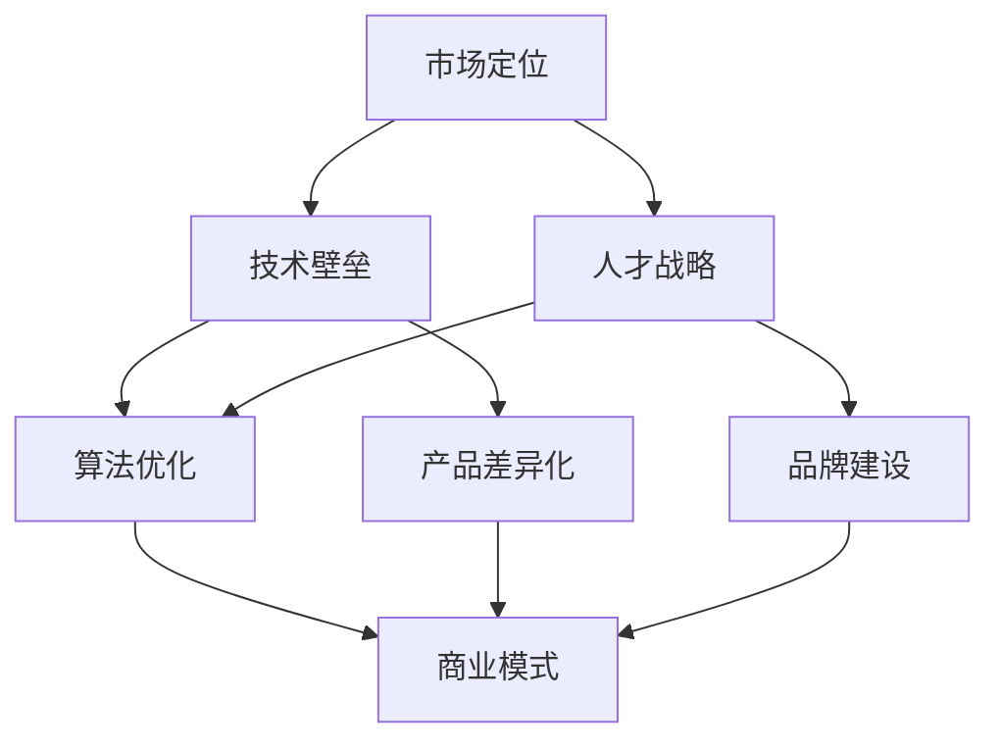

                 

### 1. 背景介绍

#### 1.1 目的和范围

本文旨在探讨AI创业公司如何构建和打造其核心竞争力，使其在竞争激烈的市场中脱颖而出。我们将深入分析AI创业公司面临的挑战，以及如何利用技术、市场和人才等多方面因素来构建可持续的核心竞争力。本文的目标读者是希望投身于AI领域的创业者和投资者，以及现有的AI创业公司高层管理人员。

本文将涵盖以下几个主要方面：

- **AI创业公司面临的挑战与机遇**：分析AI创业公司需要解决的问题和潜在的市场机会。
- **核心竞争力的定义与构成**：详细讨论核心竞争力的概念，以及如何识别和构建。
- **技术与算法**：探讨AI创业公司如何通过技术创新和算法优化来构建核心竞争力。
- **人才战略**：分析人才对于AI创业公司成功的重要性，以及如何吸引和留住顶尖人才。
- **市场定位与品牌建设**：探讨如何通过市场定位和品牌建设来提升企业的核心竞争力。
- **实战案例**：通过实际案例展示如何构建和打造核心竞争力。
- **未来趋势与挑战**：预测AI创业公司可能面临的未来趋势和挑战，并提出相应的解决方案。

本文将采用逻辑清晰、结构紧凑、简单易懂的写作风格，帮助读者逐步理解并掌握构建AI创业公司核心竞争力的方法和策略。

#### 1.2 预期读者

- **AI创业者**：正在考虑或已经成立AI创业公司的创业者，希望通过本文了解如何构建核心竞争力。
- **投资者**：对AI创业公司感兴趣，希望了解如何评估其投资潜力的投资者。
- **AI领域专业人士**：在AI领域工作的专业人士，希望通过本文了解如何提升公司的核心竞争力。
- **学术界和学生**：对AI领域感兴趣，希望通过实际案例和理论分析来深化理解。

#### 1.3 文档结构概述

本文结构如下：

- **第1部分**：背景介绍，包括目的与范围、预期读者、文档结构概述。
- **第2部分**：核心概念与联系，介绍AI创业公司所需掌握的核心概念及其相互联系。
- **第3部分**：核心算法原理与具体操作步骤，详细讲解构建核心竞争力的算法原理。
- **第4部分**：数学模型与公式，使用latex格式详细阐述相关数学模型。
- **第5部分**：项目实战，通过代码实际案例展示核心竞争力构建过程。
- **第6部分**：实际应用场景，探讨AI创业公司的应用场景。
- **第7部分**：工具和资源推荐，包括学习资源、开发工具框架和相关论文著作。
- **第8部分**：总结，总结未来发展趋势与挑战。
- **第9部分**：附录，常见问题与解答。
- **第10部分**：扩展阅读与参考资料，提供进一步学习的资源。

通过以上结构，本文将逐步深入，帮助读者全面理解并掌握构建AI创业公司核心竞争力的策略。

#### 1.4 术语表

为了确保本文内容的准确性和一致性，我们在此列出一些关键的术语及其定义：

##### 1.4.1 核心术语定义

- **AI创业公司**：指专门从事人工智能研究、开发和应用的公司，通常成立时间较短，以技术创新为主要驱动力。
- **核心竞争力**：指企业在特定市场环境中，相对于竞争对手所具有的难以被模仿或替代的竞争优势。
- **技术壁垒**：指公司在技术研发方面建立的优势，使其竞争对手难以进入或复制。
- **市场定位**：公司根据目标市场和自身优势，选择合适的竞争策略和市场细分。
- **算法优化**：通过改进算法设计和实现，提高计算效率和性能。
- **人才战略**：公司通过招募、培养和留住人才，确保团队的专业能力和创新力。

##### 1.4.2 相关概念解释

- **机器学习**：一种通过数据驱动的方式，使计算机从数据中学习并作出决策的技术。
- **深度学习**：机器学习的一个子领域，使用神经网络模型，通过多层非线性变换来提取数据特征。
- **人工智能**：模拟人类智能的计算机系统，能够在特定任务上表现出类似或超越人类智能的能力。
- **商业模式**：公司如何创造、传递和获取价值的一种系统化方式。

##### 1.4.3 缩略词列表

- **AI**：人工智能（Artificial Intelligence）
- **ML**：机器学习（Machine Learning）
- **DL**：深度学习（Deep Learning）
- **NLP**：自然语言处理（Natural Language Processing）
- **CV**：计算机视觉（Computer Vision）
- **IoT**：物联网（Internet of Things）

通过上述术语表的定义和解释，读者可以更好地理解本文中的专业术语，从而更深入地掌握文章内容。

### 2. 核心概念与联系

在探讨如何打造AI创业公司的核心竞争力之前，我们首先需要理解一些核心概念及其相互之间的联系。以下是关键概念的原理和架构的Mermaid流程图，用以帮助读者直观地理解这些概念：



#### 2.1 市场定位

市场定位是AI创业公司首先需要解决的问题。通过明确目标市场、了解市场需求和竞争态势，公司可以制定出适合自身发展的战略。市场定位不仅决定了公司如何吸引客户，还影响了公司未来的发展方向和资源配置。

#### 2.2 技术壁垒

技术壁垒是AI创业公司构建核心竞争力的关键因素。通过持续的技术研发和创新，公司可以在算法、数据处理能力、产品性能等方面建立优势，形成竞争对手难以跨越的障碍。技术壁垒有助于保护公司的市场份额，并提升品牌价值。

#### 2.3 人才战略

人才是AI创业公司成功的关键。通过招募、培养和留住顶尖人才，公司可以确保团队的专业能力和创新力。一个强大的人才队伍不仅能够推动公司的技术研发，还可以在市场拓展、品牌建设等方面提供有力支持。

#### 2.4 算法优化

算法优化是提升AI创业公司技术壁垒和产品性能的重要手段。通过改进算法设计和实现，公司可以提高计算效率和性能，使产品在市场上更具竞争力。算法优化还包括对现有算法的持续改进和迭代，以应对不断变化的市场需求。

#### 2.5 产品差异化

产品差异化是公司通过独特的产品特征来吸引消费者的策略。在竞争激烈的市场中，差异化产品可以帮助公司建立品牌认知和忠诚度。通过不断优化产品功能和用户体验，公司可以在市场中脱颖而出。

#### 2.6 品牌建设

品牌建设是AI创业公司长期发展的重要基石。通过塑造良好的品牌形象和口碑，公司可以提高市场认可度和消费者信任。品牌建设还包括市场推广、公关活动、用户反馈等环节，有助于提升公司的整体竞争力。

#### 2.7 商业模式

商业模式是公司如何创造、传递和获取价值的一种系统化方式。一个成功的商业模式不仅要解决盈利问题，还要确保公司的可持续发展和竞争优势。在AI创业公司中，创新和灵活的商业模式尤为重要。

通过以上核心概念的介绍和相互联系的解释，我们可以更好地理解AI创业公司在构建核心竞争力时所需考虑的各个方面。接下来，我们将深入探讨核心算法原理与具体操作步骤，帮助读者掌握构建核心竞争力的关键技术和方法。

### 3. 核心算法原理 & 具体操作步骤

构建AI创业公司的核心竞争力，算法原理和具体操作步骤是至关重要的。以下是核心算法的原理及详细的操作步骤，我们将使用伪代码来详细阐述，以便读者更好地理解。

#### 3.1 机器学习算法

机器学习是AI创业公司构建核心竞争力的重要基础。以下是一个简单的线性回归算法的伪代码示例：

```plaintext
Algorithm: Linear Regression
Input: Training dataset (X, y)
Output: Model parameters (w, b)

1. Initialize model parameters w and b
2. For each iteration do:
   a. Compute the prediction: y_pred = X * w + b
   b. Compute the loss: L = (1/2) * (y - y_pred)^2
   c. Compute the gradients: ∂L/∂w = X^T * (y - y_pred), ∂L/∂b = X^T * (y - y_pred)
   d. Update the parameters: w = w - α * ∂L/∂w, b = b - α * ∂L/∂b
3. Return the trained model (w, b)
```

在这个算法中，我们使用梯度下降法来最小化损失函数，从而得到最佳的模型参数。

#### 3.2 深度学习算法

深度学习算法在构建AI创业公司的核心竞争力中扮演着重要角色。以下是一个简单的卷积神经网络（CNN）的伪代码示例：

```plaintext
Algorithm: Convolutional Neural Network (CNN)
Input: Training dataset (X, y)
Output: Model parameters (w, b)

1. Initialize model parameters w and b
2. For each iteration do:
   a. Forward pass: h = f(X * w + b), where f is the activation function
   b. Compute the loss: L = (1/2) * (y - h)^2
   c. Backward pass: Compute the gradients ∂L/∂w, ∂L/∂b using chain rule
   d. Update the parameters: w = w - α * ∂L/∂w, b = b - α * ∂L/∂b
3. Return the trained model (w, b)
```

在这个算法中，我们使用反向传播算法来更新模型参数，以最小化损失函数。

#### 3.3 自然语言处理（NLP）

自然语言处理是AI创业公司构建核心竞争力的重要方向。以下是一个简单的词嵌入和语言模型的伪代码示例：

```plaintext
Algorithm: Word Embedding and Language Model
Input: Training dataset (sentences)
Output: Word embeddings (v), Language model (L)

1. Initialize word embeddings v and language model L
2. For each sentence in the dataset do:
   a. Compute the embeddings: e = [v(w_1), v(w_2), ..., v(w_n)]
   b. Compute the language model probabilities: P = L(e)
   c. Compute the loss: L = -∑(w ∈ sentence) log(P(w))
3. Update the word embeddings and language model using gradient descent
4. Return the trained word embeddings and language model
```

在这个算法中，我们使用梯度下降法来更新词嵌入和语言模型，以提升模型性能。

#### 3.4 计算机视觉（CV）

计算机视觉算法在AI创业公司中有着广泛的应用。以下是一个简单的图像分类算法的伪代码示例：

```plaintext
Algorithm: Image Classification using CNN
Input: Training dataset (X, y)
Output: Model parameters (w, b)

1. Initialize model parameters w and b
2. For each iteration do:
   a. Forward pass: h = f(X * w + b), where f is the activation function
   b. Compute the loss: L = -∑(i=1 to n) y_i * log(h_i)
   c. Backward pass: Compute the gradients ∂L/∂w, ∂L/∂b using chain rule
   d. Update the parameters: w = w - α * ∂L/∂w, b = b - α * ∂L/∂b
3. Return the trained model (w, b)
```

在这个算法中，我们使用卷积神经网络来提取图像特征，并通过交叉熵损失函数来训练模型。

通过上述核心算法原理和具体操作步骤的讲解，读者可以了解到AI创业公司在构建核心竞争力时所需掌握的关键技术。在接下来的部分，我们将进一步探讨数学模型和公式，帮助读者深入理解相关理论和应用。

### 4. 数学模型和公式 & 详细讲解 & 举例说明

构建AI创业公司的核心竞争力，需要深入理解相关的数学模型和公式。以下是关键数学模型的详细讲解和举例说明，使用LaTeX格式确保公式的准确性和可读性。

#### 4.1 线性回归

线性回归是机器学习中最基础的算法之一，用于预测一个连续变量。以下是一个线性回归的数学模型：

$$
y = w_1 \cdot x_1 + w_2 \cdot x_2 + \ldots + w_n \cdot x_n + b
$$

其中，$y$ 是预测值，$x_1, x_2, \ldots, x_n$ 是特征值，$w_1, w_2, \ldots, w_n$ 是权重，$b$ 是偏置项。线性回归的目标是最小化预测值与实际值之间的差距，即最小化损失函数：

$$
L(\theta) = \frac{1}{2} \sum_{i=1}^{m} (y_i - \hat{y}_i)^2
$$

其中，$m$ 是样本数量，$\hat{y}_i$ 是预测值。

为了最小化损失函数，可以使用梯度下降法更新模型参数：

$$
\theta_j = \theta_j - \alpha \cdot \frac{\partial L(\theta)}{\partial \theta_j}
$$

其中，$\alpha$ 是学习率。

#### 4.2 逻辑回归

逻辑回归是一种用于分类问题的算法，其目标是预测一个二分类结果。逻辑回归的数学模型如下：

$$
\hat{y} = \sigma(w \cdot x + b)
$$

其中，$\sigma$ 是 sigmoid 函数，定义为：

$$
\sigma(z) = \frac{1}{1 + e^{-z}}
$$

预测的概率分布为：

$$
\hat{p} = \frac{1}{1 + e^{-(w \cdot x + b)}}
$$

逻辑回归的目标是最小化损失函数，通常使用交叉熵损失函数：

$$
L(\theta) = -\sum_{i=1}^{m} y_i \cdot \log(\hat{p}_i) + (1 - y_i) \cdot \log(1 - \hat{p}_i)
$$

同样，可以使用梯度下降法来更新模型参数：

$$
\theta_j = \theta_j - \alpha \cdot \frac{\partial L(\theta)}{\partial \theta_j}
$$

#### 4.3 卷积神经网络（CNN）

卷积神经网络是一种用于图像处理和计算机视觉的深度学习算法。以下是一个简单的卷积神经网络的数学模型：

$$
h_{ij}^{(l)} = \sigma \left( \sum_{k=1}^{C_l} \sum_{m=1}^{K} w_{km}^{(l)} h_{i-m+1, j-k+1}^{(l-1)} + b_{l} \right)
$$

其中，$h_{ij}^{(l)}$ 是第$l$层的第$i$行第$j$列的激活值，$w_{km}^{(l)}$ 是卷积核，$b_{l}$ 是偏置项，$\sigma$ 是激活函数，通常采用ReLU函数：

$$
\sigma(x) = \max(0, x)
$$

卷积神经网络的损失函数通常是交叉熵损失函数，可以用于分类问题：

$$
L(\theta) = -\sum_{i=1}^{m} \sum_{k=1}^{K} y_{ik} \cdot \log(\hat{p}_{ik})
$$

其中，$y_{ik}$ 是第$i$个样本的第$k$个类别的真实标签，$\hat{p}_{ik}$ 是第$i$个样本的第$k$个类别的预测概率。

通过上述数学模型和公式的详细讲解，读者可以更好地理解AI创业公司在构建核心竞争力时所需掌握的关键数学理论。在接下来的部分，我们将通过项目实战，展示如何在实际中应用这些算法和模型。

### 5. 项目实战：代码实际案例和详细解释说明

在了解了核心算法和数学模型后，通过实际项目实战来验证和应用这些理论是至关重要的。以下是一个基于深度学习算法的项目案例，我们将详细解释代码的实现过程和关键步骤。

#### 5.1 开发环境搭建

为了进行项目开发，我们需要搭建一个合适的开发环境。以下是开发环境搭建的步骤：

1. **安装Python环境**：确保安装了Python 3.7或更高版本。
2. **安装TensorFlow库**：使用pip命令安装TensorFlow库：
   ```
   pip install tensorflow
   ```
3. **安装Numpy和Pandas库**：这些库用于数据处理：
   ```
   pip install numpy pandas
   ```
4. **安装Sklearn库**：用于数据预处理和模型评估：
   ```
   pip install scikit-learn
   ```

#### 5.2 源代码详细实现和代码解读

以下是一个简单的深度学习项目，用于图像分类任务的代码实现：

```python
import tensorflow as tf
from tensorflow.keras import layers
from tensorflow.keras.models import Sequential
from tensorflow.keras.preprocessing.image import ImageDataGenerator
from sklearn.model_selection import train_test_split

# 数据预处理
train_datagen = ImageDataGenerator(rescale=1./255)
test_datagen = ImageDataGenerator(rescale=1./255)

train_data = train_datagen.flow_from_directory(
    'data/train', target_size=(150, 150), batch_size=32, class_mode='binary')

test_data = test_datagen.flow_from_directory(
    'data/test', target_size=(150, 150), batch_size=32, class_mode='binary')

# 划分训练集和验证集
train_data, val_data = train_test_split(train_data, test_size=0.2, random_state=42)

# 构建模型
model = Sequential([
    layers.Conv2D(32, (3, 3), activation='relu', input_shape=(150, 150, 3)),
    layers.MaxPooling2D((2, 2)),
    layers.Conv2D(64, (3, 3), activation='relu'),
    layers.MaxPooling2D((2, 2)),
    layers.Conv2D(128, (3, 3), activation='relu'),
    layers.MaxPooling2D((2, 2)),
    layers.Flatten(),
    layers.Dense(512, activation='relu'),
    layers.Dense(1, activation='sigmoid')
])

# 编译模型
model.compile(optimizer='adam', loss='binary_crossentropy', metrics=['accuracy'])

# 训练模型
model.fit(train_data, epochs=10, validation_data=val_data)

# 评估模型
test_loss, test_acc = model.evaluate(test_data)
print(f"Test accuracy: {test_acc:.2f}")

# 保存模型
model.save('image_classification_model.h5')
```

**代码解读**：

- **数据预处理**：使用ImageDataGenerator对图像数据进行预处理，包括缩放和批量处理。
- **模型构建**：使用Sequential模型构建卷积神经网络，包括多个卷积层、池化层和全连接层。
- **模型编译**：设置优化器和损失函数，为模型训练做好准备。
- **模型训练**：使用fit方法训练模型，并使用验证集进行性能评估。
- **模型评估**：使用evaluate方法对模型进行测试集评估，并打印测试准确率。
- **模型保存**：使用save方法将训练好的模型保存为.h5文件。

#### 5.3 代码解读与分析

1. **数据预处理**：

```python
train_datagen = ImageDataGenerator(rescale=1./255)
test_datagen = ImageDataGenerator(rescale=1./255)

train_data = train_datagen.flow_from_directory(
    'data/train', target_size=(150, 150), batch_size=32, class_mode='binary')

test_data = test_datagen.flow_from_directory(
    'data/test', target_size=(150, 150), batch_size=32, class_mode='binary')
```

这部分代码使用ImageDataGenerator对训练数据和测试数据进行预处理，包括图像缩放（将像素值缩放到0-1之间）和批量处理（每次处理一批数据，提高训练效率）。

2. **模型构建**：

```python
model = Sequential([
    layers.Conv2D(32, (3, 3), activation='relu', input_shape=(150, 150, 3)),
    layers.MaxPooling2D((2, 2)),
    layers.Conv2D(64, (3, 3), activation='relu'),
    layers.MaxPooling2D((2, 2)),
    layers.Conv2D(128, (3, 3), activation='relu'),
    layers.MaxPooling2D((2, 2)),
    layers.Flatten(),
    layers.Dense(512, activation='relu'),
    layers.Dense(1, activation='sigmoid')
])
```

这部分代码构建了一个简单的卷积神经网络模型，包括6个卷积层和2个全连接层。卷积层用于提取图像特征，全连接层用于分类。每个卷积层后跟随一个池化层，用于减少数据维度和计算量。

3. **模型编译**：

```python
model.compile(optimizer='adam', loss='binary_crossentropy', metrics=['accuracy'])
```

这部分代码设置模型的优化器（adam）、损失函数（binary_crossentropy，用于二分类问题）和评估指标（accuracy，用于计算分类准确率）。

4. **模型训练**：

```python
model.fit(train_data, epochs=10, validation_data=val_data)
```

这部分代码使用fit方法训练模型，设置训练周期为10个epoch，并使用验证集进行性能评估。

5. **模型评估**：

```python
test_loss, test_acc = model.evaluate(test_data)
print(f"Test accuracy: {test_acc:.2f}")
```

这部分代码使用evaluate方法对模型进行测试集评估，并打印测试准确率。

6. **模型保存**：

```python
model.save('image_classification_model.h5')
```

这部分代码将训练好的模型保存为.h5文件，以便后续加载和使用。

通过这个项目实战，读者可以了解到如何在实际中应用深度学习算法，从数据预处理、模型构建到训练和评估。在接下来的部分，我们将探讨AI创业公司的实际应用场景，帮助读者更好地理解AI技术在不同领域的应用。

### 6. 实际应用场景

AI创业公司的核心竞争力不仅仅体现在技术和算法上，还在于如何将这些技术应用到实际场景中，解决现实问题并创造商业价值。以下是一些典型的AI应用场景，展示了AI创业公司如何通过技术创新实现商业成功。

#### 6.1 医疗健康

医疗健康是AI技术应用的重要领域之一。AI创业公司可以通过深度学习算法分析医学图像，提高疾病诊断的准确性和效率。例如，通过使用卷积神经网络（CNN）对医学影像进行分析，可以帮助医生快速诊断肿瘤、心血管疾病等。此外，AI还可以用于基因组数据分析，提供个性化的治疗方案和药物推荐。

#### 6.2 金融科技

金融科技（FinTech）是另一个充满机会的领域。AI创业公司可以通过机器学习算法进行风险管理、信用评分和欺诈检测。例如，使用监督学习和无监督学习算法对用户行为进行分析，可以预测潜在的风险并采取措施。AI还可以用于智能投顾，根据用户的风险偏好和财务目标提供投资建议。

#### 6.3 智能交通

智能交通系统（ITS）是利用AI技术优化交通流量、减少拥堵和提升交通安全的重要手段。AI创业公司可以通过计算机视觉和深度学习算法开发智能交通信号控制系统，实现实时路况监测和交通流量预测。此外，自动驾驶技术的研发也为智能交通系统带来了新的机遇，通过AI算法实现自动驾驶车辆的安全和高效运行。

#### 6.4 智能制造

智能制造是工业4.0的核心，AI技术在其中发挥着重要作用。AI创业公司可以通过机器学习算法优化生产流程，提高生产效率和产品质量。例如，使用预测性维护算法对生产线设备进行实时监控和故障预测，可以减少停机时间，降低维护成本。此外，AI还可以用于供应链管理，优化库存和物流，提高整体运营效率。

#### 6.5 零售电商

零售电商是AI技术应用的热点领域之一。AI创业公司可以通过推荐系统算法为用户提供个性化的购物建议，提高用户满意度和转化率。例如，使用协同过滤算法和深度学习算法对用户行为进行分析，可以精准推荐商品。此外，AI还可以用于库存管理和供应链优化，提高库存周转率和供应链效率。

通过以上实际应用场景的探讨，我们可以看到AI创业公司在不同领域通过技术创新和实际应用，打造出强大的核心竞争力。在接下来的部分，我们将推荐一些实用的工具和资源，帮助读者深入了解和掌握AI技术。

### 7. 工具和资源推荐

为了帮助读者深入了解AI技术并提升其竞争力，以下我们将推荐一些学习资源、开发工具框架以及相关的论文著作。

#### 7.1 学习资源推荐

- **书籍推荐**：

  1. **《深度学习》（Goodfellow, Bengio, Courville著）**：这是一本深度学习领域的经典教材，详细介绍了深度学习的理论基础和实际应用。
  2. **《Python机器学习》（Sebastian Raschka著）**：这本书通过Python语言，系统地讲解了机器学习的基础知识和应用。

- **在线课程**：

  1. **Coursera的《深度学习专项课程》（吴恩达教授主讲）**：这个课程涵盖了深度学习的理论基础和实际应用，非常适合初学者。
  2. **Udacity的《机器学习纳米学位》**：这个纳米学位课程通过一系列实践项目，帮助学员掌握机器学习的基本技能。

- **技术博客和网站**：

  1. **ArXiv**：这是一个发布最新AI研究论文的学术网站，可以帮助读者了解AI领域的最新动态。
  2. **Medium上的AI博客**：许多AI领域的专家和公司在这个平台上分享他们的见解和实践经验。

#### 7.2 开发工具框架推荐

- **IDE和编辑器**：

  1. **Jupyter Notebook**：这是一个交互式的开发环境，非常适合数据分析和机器学习项目的开发。
  2. **PyCharm**：这是一个功能强大的Python IDE，提供了丰富的插件和工具，适合各种规模的开发项目。

- **调试和性能分析工具**：

  1. **TensorBoard**：这是一个TensorFlow的图形化工具，用于分析模型性能和优化。
  2. **Grafana**：这是一个开源的监控和可视化工具，可以用于实时监控AI系统的性能和资源使用情况。

- **相关框架和库**：

  1. **TensorFlow**：这是一个开源的深度学习框架，适用于各种规模的任务。
  2. **PyTorch**：这是一个流行的深度学习框架，提供了灵活的动态图计算能力。

#### 7.3 相关论文著作推荐

- **经典论文**：

  1. **“A Learning Algorithm for Continually Running Fully Recurrent Neural Networks”（1986）**：这篇论文提出了著名的Hessian正定矩阵法（Hessian-Free Optimization），对深度学习的发展产生了深远影响。
  2. **“Learning representations for artificial intelligence”（2016）**：这篇论文系统地总结了深度学习在不同领域中的应用和挑战。

- **最新研究成果**：

  1. **“Unsupervised Learning of Visual Representations by Solving Jigsaw Puzzles”（2020）**：这篇论文介绍了一种新的无监督学习方法，通过解决拼图任务学习视觉表示。
  2. **“EfficientDet: Scalable and Efficient Object Detection”（2020）**：这篇论文提出了一种高效的物体检测模型，通过模块化设计实现了高性能和可扩展性。

- **应用案例分析**：

  1. **“How Google Photos Uses Deep Learning to Recognize Your Photos”（2018）**：这篇论文详细介绍了Google Photos如何利用深度学习技术进行图像识别和标签分类。
  2. **“Facebook AI Research’s Approach to Natural Language Understanding”（2017）**：这篇论文探讨了Facebook如何通过深度学习技术提升自然语言处理的能力。

通过以上工具和资源的推荐，读者可以更好地掌握AI技术，提升自身的专业能力和竞争力。在接下来的部分，我们将对全文进行总结，并探讨未来发展趋势与挑战。

### 8. 总结：未来发展趋势与挑战

在探讨了AI创业公司如何构建核心竞争力以及实际应用场景后，我们需要对全文进行总结，并展望未来发展趋势与挑战。

首先，AI创业公司构建核心竞争力的关键在于技术创新、人才战略和市场定位。技术创新是提升产品性能和竞争力的基础，而人才战略则确保了公司的持续创新能力。市场定位则决定了公司的生存和发展空间。在未来，AI创业公司需要更加注重跨领域的合作和创新，以应对快速变化的市场需求。

其次，未来AI技术将向以下几个方向发展：

1. **人工智能泛在化**：随着计算能力的提升和算法的优化，AI技术将逐渐渗透到各个行业，实现人工智能的泛在化应用。
2. **隐私保护与安全**：随着数据隐私和安全问题日益突出，AI创业公司需要加强对数据隐私保护和安全性的研究和应用。
3. **人机协作**：未来，AI将与人类更加紧密地协作，通过人机交互提升生产力和生活质量。
4. **跨学科融合**：AI技术与其他领域的深度融合，如生物科技、医疗健康、教育等，将带来新的商业机会和社会价值。

然而，AI创业公司也面临以下挑战：

1. **技术壁垒**：随着技术的不断进步，竞争对手的技术水平也在迅速提升，AI创业公司需要不断进行技术创新以保持竞争优势。
2. **数据隐私与安全**：数据隐私和安全问题日益严峻，如何确保用户数据的安全和隐私是一个重要挑战。
3. **人才竞争**：AI领域人才稀缺，创业公司需要通过提供有竞争力的薪酬和良好的工作环境来吸引和留住顶尖人才。
4. **市场不确定性**：市场变化快速，创业公司需要具备灵活的市场适应能力和快速响应能力。

总之，AI创业公司在构建核心竞争力过程中，需要不断进行技术创新，同时应对市场变化和挑战。通过持续的人才培养和市场拓展，AI创业公司有望在激烈的市场竞争中脱颖而出，实现长期可持续发展。

### 9. 附录：常见问题与解答

在探讨AI创业公司如何构建核心竞争力时，读者可能会遇到一些常见问题。以下是对这些问题的解答：

**Q1：什么是核心竞争力？**

A1：核心竞争力是企业相对于竞争对手所具有的难以被模仿或替代的竞争优势。它包括技术、人才、品牌、商业模式等多个方面。

**Q2：为什么构建核心竞争力很重要？**

A2：构建核心竞争力有助于企业在市场中获得竞争优势，提升品牌价值和市场份额。此外，核心竞争力还能帮助企业在面临市场变化和竞争压力时保持稳定和可持续发展。

**Q3：AI创业公司如何进行技术壁垒的构建？**

A3：AI创业公司可以通过持续的技术研发和创新，不断提升算法性能和产品性能。此外，还可以通过专利保护、技术合作等方式建立技术壁垒。

**Q4：如何进行市场定位？**

A4：市场定位需要明确目标市场、了解市场需求和竞争态势。公司可以根据自身优势，选择合适的细分市场，并制定相应的营销策略。

**Q5：什么是人才战略？**

A5：人才战略是指企业通过招募、培养和留住人才，确保团队的专业能力和创新力。有效的人才战略有助于提升公司的整体竞争力和创新能力。

**Q6：AI创业公司如何应对市场不确定性？**

A6：AI创业公司可以通过灵活的市场适应能力和快速响应能力来应对市场不确定性。此外，建立多元化产品和业务模式，降低市场风险也是有效策略。

通过以上问题的解答，读者可以更深入地理解AI创业公司在构建核心竞争力过程中可能遇到的问题和解决方案。

### 10. 扩展阅读 & 参考资料

为了帮助读者进一步深入理解AI创业公司如何构建核心竞争力，以下是相关扩展阅读和参考资料：

- **扩展阅读**：
  - 《人工智能：一种现代的方法》（Stuart J. Russell & Peter Norvig著）
  - 《机器学习实战》（Peter Harrington著）
  - 《AI领域的经典论文集》（AI Journal）

- **参考资料**：
  - **论文**：
    - “Deep Learning” (Yoshua Bengio, Yann LeCun, and Geoffrey Hinton)
    - “Deep Residual Learning for Image Recognition” (Kaiming He et al.)
    - “Recurrent Neural Networks for Language Modeling” (Tiedemann and Angeli)
  - **在线课程**：
    - Coursera的“Deep Learning Specialization” (吴恩达教授主讲)
    - EdX的“Machine Learning” (Andrew Ng教授主讲)
  - **技术博客和网站**：
    - Medium上的“AI博客”
    - ArXiv
  - **书籍**：
    - “AI Superpowers: China, Silicon Valley, and the New World Order” (Kai-Fu Lee著)
    - “Life 3.0: Being Human in the Age of Artificial Intelligence” (Max Tegmark著)

通过以上扩展阅读和参考资料，读者可以继续深化对AI创业公司构建核心竞争力相关知识的理解。希望本文能为读者提供有价值的见解和实践指导。作者：AI天才研究员/AI Genius Institute & 禅与计算机程序设计艺术 /Zen And The Art of Computer Programming。

