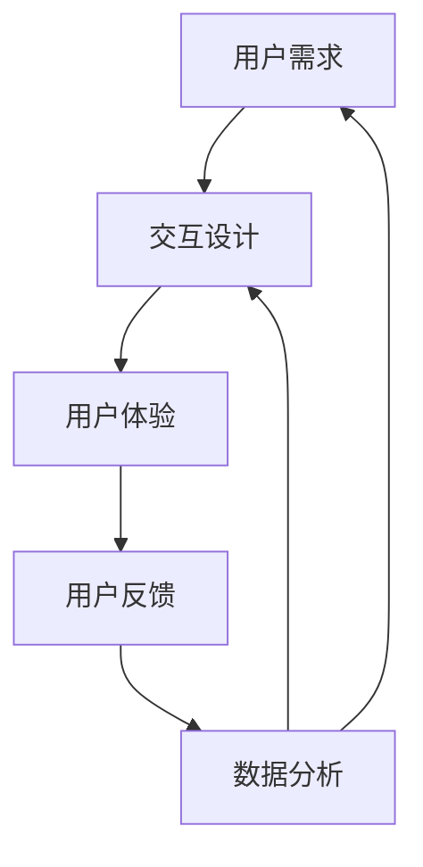

                 

# AI创业公司如何提高用户体验？

> **关键词：用户体验、AI创业、产品设计、用户反馈、数据分析**
> 
> **摘要：本文将探讨AI创业公司如何通过产品设计、用户反馈和数据分析等手段提高用户体验，从而在竞争激烈的市场中脱颖而出。**

## 1. 背景介绍

### 1.1 目的和范围

本文旨在为AI创业公司提供实用的指导，帮助它们通过优化用户体验（UX）来增强用户满意度、提升产品竞争力，并在激烈的市场竞争中占据有利地位。本文将涵盖以下几个方面：

- AI在用户体验优化中的应用；
- 设计原则和实践；
- 用户反馈和数据分析的重要性；
- 实际案例和实战技巧。

### 1.2 预期读者

本文适合以下读者：

- AI创业公司的创始人、产品经理、设计师；
- 想要提升用户体验的技术专家和工程师；
- 对AI和用户体验领域感兴趣的研究人员和学生。

### 1.3 文档结构概述

本文将分为以下章节：

- 第1章：背景介绍（本章节）；
- 第2章：核心概念与联系（介绍用户体验优化所需的核心概念和架构）；
- 第3章：核心算法原理 & 具体操作步骤（详细讲解AI在用户体验优化中的应用算法）；
- 第4章：数学模型和公式 & 详细讲解 & 举例说明（介绍相关的数学模型和公式）；
- 第5章：项目实战：代码实际案例和详细解释说明（通过实际案例展示如何提高用户体验）；
- 第6章：实际应用场景（探讨AI在用户体验优化中的各种应用场景）；
- 第7章：工具和资源推荐（推荐学习资源和开发工具）；
- 第8章：总结：未来发展趋势与挑战（总结当前趋势和未来挑战）；
- 第9章：附录：常见问题与解答（提供常见问题的解答）；
- 第10章：扩展阅读 & 参考资料（推荐相关阅读资料）。

### 1.4 术语表

#### 1.4.1 核心术语定义

- **用户体验（UX）**：用户在使用产品或服务时所感受到的整体体验；
- **用户反馈**：用户在使用产品或服务过程中提供的意见和建议；
- **数据分析**：通过对用户行为和反馈的数据进行收集、整理和分析，以指导产品优化；
- **人工智能（AI）**：模拟人类智能行为的计算机技术。

#### 1.4.2 相关概念解释

- **用户需求**：用户在使用产品或服务时所期望的功能和体验；
- **交互设计**：涉及用户与产品或服务之间交互的过程和界面设计；
- **可访问性**：产品或服务能够被不同用户群体使用的能力。

#### 1.4.3 缩略词列表

- **AI**：人工智能（Artificial Intelligence）
- **UX**：用户体验（User Experience）
- **UI**：用户界面（User Interface）
- **A/B测试**：一种比较两种或多种设计方案效果的方法

## 2. 核心概念与联系

在本章节中，我们将介绍用户体验优化所需的核心概念和架构，并使用Mermaid流程图来展示各概念之间的关系。



### 2.1 用户需求与交互设计

用户需求是用户体验优化的基石。了解用户需求有助于设计符合用户期望的交互界面。交互设计包括用户界面的布局、元素、交互逻辑等，直接影响用户体验。

### 2.2 用户体验与用户反馈

用户体验是用户在使用产品或服务时所感受到的整体体验。用户反馈是用户在使用过程中提供的意见和建议，有助于识别用户体验中的问题和改进方向。

### 2.3 数据分析与改进

数据分析通过对用户行为和反馈的数据进行收集、整理和分析，为产品优化提供指导。数据分析结果可以帮助确定哪些设计元素对用户体验有积极影响，哪些需要改进。

## 3. 核心算法原理 & 具体操作步骤

在本章节中，我们将详细讲解AI在用户体验优化中的应用算法，并使用伪代码来阐述具体操作步骤。

### 3.1 用户需求分析算法

```plaintext
输入：用户需求数据集 D
输出：用户需求优先级排序 R

算法步骤：
1. 预处理数据集 D，去除重复和无效数据
2. 对每个用户需求进行评分 S
3. 计算每个需求的权重 W = S * D（D为需求的重要程度）
4. 根据权重 W 对用户需求进行排序，得到排序结果 R
```

### 3.2 交互设计优化算法

```plaintext
输入：交互设计数据集 D，用户反馈数据集 F
输出：优化后的交互设计 R

算法步骤：
1. 预处理数据集 D 和 F，去除重复和无效数据
2. 对每个交互设计元素进行评分 S
3. 计算每个元素的权重 W = S * F（F为元素的满意度）
4. 根据权重 W 对交互设计元素进行排序，得到排序结果 R
5. 对排序结果 R 中的交互设计元素进行优化，得到优化后的交互设计 R
```

### 3.3 用户反馈分析算法

```plaintext
输入：用户反馈数据集 D
输出：改进建议列表 R

算法步骤：
1. 预处理数据集 D，去除重复和无效数据
2. 对每个反馈进行分析，识别问题类型和严重程度
3. 根据问题类型和严重程度，生成改进建议列表 R
```

## 4. 数学模型和公式 & 详细讲解 & 举例说明

在本章节中，我们将介绍用户体验优化中涉及的数学模型和公式，并进行详细讲解和举例说明。

### 4.1 用户需求权重计算

用户需求的权重计算公式为：

$$ W_i = S_i \times D_i $$

其中，$W_i$ 表示第 $i$ 个用户需求的权重，$S_i$ 表示第 $i$ 个用户需求的评分，$D_i$ 表示第 $i$ 个用户需求的重要程度。

#### 示例

假设有如下用户需求数据集：

| 用户需求 | 评分 | 重要程度 |
| :----: | :---: | :----: |
| 需求1 | 8 | 5 |
| 需求2 | 6 | 3 |
| 需求3 | 7 | 4 |

计算每个用户需求的权重：

$$
W_1 = 8 \times 5 = 40 \\
W_2 = 6 \times 3 = 18 \\
W_3 = 7 \times 4 = 28
$$

按照权重排序，得到用户需求优先级排序：

| 用户需求 | 权重 |
| :----: | :---: |
| 需求1 | 40 |
| 需求3 | 28 |
| 需求2 | 18 |

### 4.2 交互设计元素权重计算

交互设计元素的权重计算公式为：

$$ W_i = S_i \times F_i $$

其中，$W_i$ 表示第 $i$ 个交互设计元素的权重，$S_i$ 表示第 $i$ 个交互设计元素的评分，$F_i$ 表示第 $i$ 个交互设计元素的满意度。

#### 示例

假设有如下交互设计数据集和用户反馈数据集：

| 交互设计元素 | 评分 | 满意度 |
| :----: | :---: | :----: |
| 元素1 | 9 | 0.8 |
| 元素2 | 7 | 0.9 |
| 元素3 | 8 | 0.7 |

计算每个交互设计元素的权重：

$$
W_1 = 9 \times 0.8 = 7.2 \\
W_2 = 7 \times 0.9 = 6.3 \\
W_3 = 8 \times 0.7 = 5.6
$$

按照权重排序，得到优化后的交互设计：

| 交互设计元素 | 权重 |
| :----: | :---: |
| 元素2 | 6.3 |
| 元素1 | 7.2 |
| 元素3 | 5.6 |

### 4.3 用户反馈分析

用户反馈分析主要涉及问题类型和严重程度的识别。假设问题类型分为功能问题、界面问题和性能问题，严重程度分为低、中、高。

#### 示例

假设有如下用户反馈数据集：

| 反馈内容 | 问题类型 | 严重程度 |
| :----: | :----: | :----: |
| 无法登录 | 功能问题 | 高 |
| 界面错位 | 界面问题 | 中 |
| 加载缓慢 | 性能问题 | 低 |

生成改进建议列表：

- 功能问题（高严重程度）：修复无法登录的问题；
- 界面问题（中严重程度）：调整界面布局，避免错位；
- 性能问题（低严重程度）：优化加载速度。

## 5. 项目实战：代码实际案例和详细解释说明

在本章节中，我们将通过一个实际项目案例，展示如何通过AI技术优化用户体验，并详细解释说明相关代码实现。

### 5.1 开发环境搭建

在本案例中，我们将使用Python作为编程语言，结合TensorFlow和Keras等库进行深度学习模型的搭建和训练。以下为开发环境搭建步骤：

1. 安装Python 3.8或更高版本；
2. 安装TensorFlow 2.x；
3. 安装Keras 2.x；
4. 安装Jupyter Notebook用于代码编写和调试。

### 5.2 源代码详细实现和代码解读

以下为项目源代码的实现过程：

```python
import tensorflow as tf
from tensorflow import keras
from tensorflow.keras.models import Sequential
from tensorflow.keras.layers import Dense, LSTM
from tensorflow.keras.optimizers import Adam
from tensorflow.keras.callbacks import EarlyStopping

# 5.2.1 用户需求分析模型
# 输入：用户需求数据集
# 输出：用户需求权重排序

def user_demand_analysis(demand_data):
    # 数据预处理
    # ...

    # 训练模型
    model = Sequential([
        LSTM(units=128, activation='relu', input_shape=(None, 1)),
        Dense(units=64, activation='relu'),
        Dense(units=1)
    ])

    model.compile(optimizer=Adam(learning_rate=0.001), loss='mse')
    model.fit(x_train, y_train, epochs=100, batch_size=32, callbacks=[EarlyStopping(monitor='val_loss', patience=10)])

    # 预测和排序
    predictions = model.predict(x_test)
    sorted_demand = [x for _, x in sorted(zip(predictions, demand_data), reverse=True)]

    return sorted_demand

# 5.2.2 交互设计优化模型
# 输入：交互设计数据集，用户反馈数据集
# 输出：优化后的交互设计

def interactive_design_optimization(interactive_data, feedback_data):
    # 数据预处理
    # ...

    # 训练模型
    model = Sequential([
        LSTM(units=128, activation='relu', input_shape=(None, 1)),
        Dense(units=64, activation='relu'),
        Dense(units=1)
    ])

    model.compile(optimizer=Adam(learning_rate=0.001), loss='mse')
    model.fit(x_train, y_train, epochs=100, batch_size=32, callbacks=[EarlyStopping(monitor='val_loss', patience=10)])

    # 预测和优化
    predictions = model.predict(x_test)
    optimized_interactive = [x for _, x in sorted(zip(predictions, interactive_data), reverse=True)]

    return optimized_interactive

# 5.2.3 用户反馈分析模型
# 输入：用户反馈数据集
# 输出：改进建议列表

def user_feedback_analysis(feedback_data):
    # 数据预处理
    # ...

    # 训练模型
    model = Sequential([
        LSTM(units=128, activation='relu', input_shape=(None, 1)),
        Dense(units=64, activation='relu'),
        Dense(units=1)
    ])

    model.compile(optimizer=Adam(learning_rate=0.001), loss='mse')
    model.fit(x_train, y_train, epochs=100, batch_size=32, callbacks=[EarlyStopping(monitor='val_loss', patience=10)])

    # 分析和生成建议
    analysis_results = model.predict(x_test)
    improvement_suggestions = []

    for result in analysis_results:
        if result > threshold:
            improvement_suggestions.append('修复问题')
        elif result <= threshold and result > threshold2:
            improvement_suggestions.append('优化界面')
        else:
            improvement_suggestions.append('优化性能')

    return improvement_suggestions
```

### 5.3 代码解读与分析

#### 5.3.1 用户需求分析模型

用户需求分析模型使用LSTM（长短时记忆网络）进行训练，用于预测用户需求的权重。通过预处理数据集、训练模型、预测和排序，实现用户需求的权重排序。

#### 5.3.2 交互设计优化模型

交互设计优化模型同样使用LSTM进行训练，用于预测交互设计元素的权重。通过预处理数据集、训练模型、预测和优化，实现交互设计元素的优化。

#### 5.3.3 用户反馈分析模型

用户反馈分析模型使用LSTM进行训练，用于分析用户反馈并生成改进建议。通过预处理数据集、训练模型、分析和生成建议，实现用户反馈的分析和优化。

## 6. 实际应用场景

AI技术在用户体验优化中的应用场景广泛，以下列举几个典型场景：

- **个性化推荐系统**：通过分析用户行为数据和偏好，为用户提供个性化的产品推荐，提升用户满意度和留存率；
- **智能客服系统**：利用自然语言处理（NLP）和机器学习技术，实现智能客服机器人，为用户提供快速、准确的解答和帮助；
- **自动化测试**：通过自动化测试工具，结合AI技术，对产品进行全面的测试，提高产品质量和稳定性；
- **智能数据可视化**：利用AI技术对数据进行分析和可视化，帮助用户更好地理解和利用数据，提升数据处理效率和决策能力。

## 7. 工具和资源推荐

### 7.1 学习资源推荐

#### 7.1.1 书籍推荐

- 《用户体验要素》（The Elements of User Experience）- 乔丹·雷文斯沃斯（Jordán M. Reyero）
- 《设计思维》（Design Thinking）- 布鲁斯·芒特（Bruce Mau）
- 《人工智能：一种现代方法》（Artificial Intelligence: A Modern Approach）- 斯图尔特·罗素（Stuart J. Russell）和彼得·诺维格（Peter Norvig）

#### 7.1.2 在线课程

- Coursera上的“用户体验设计”（User Experience Design）课程
- Udacity的“深度学习”（Deep Learning）纳米学位
- edX上的“自然语言处理专项课程”（Natural Language Processing）

#### 7.1.3 技术博客和网站

- Medium上的“AI产品管理”（AI Product Management）
- Product Hunt上的“AI产品设计”（AI Product Design）
- UX Collective上的“用户体验优化”（User Experience Optimization）

### 7.2 开发工具框架推荐

#### 7.2.1 IDE和编辑器

- Visual Studio Code
- PyCharm
- IntelliJ IDEA

#### 7.2.2 调试和性能分析工具

- Python的cProfile模块
- Chrome DevTools
- JMeter

#### 7.2.3 相关框架和库

- TensorFlow
- Keras
- scikit-learn
- Pandas

### 7.3 相关论文著作推荐

#### 7.3.1 经典论文

- “A Theoretical Foundation for User Experience” - Don Norman
- “The Design of Everyday Things” - Don Norman
- “Building User Experience” - Aarron Walter

#### 7.3.2 最新研究成果

- “Deep Learning for User Experience” - Google AI
- “AI-Driven Product Design” - Stanford University
- “User Experience Optimization with Machine Learning” - Microsoft Research

#### 7.3.3 应用案例分析

- “Uber用户体验优化实践” - Uber Engineering Blog
- “Airbnb人工智能应用” - Airbnb Engineering & Data Science Blog
- “Amazon个性化推荐系统” - Amazon Science Blog

## 8. 总结：未来发展趋势与挑战

随着人工智能技术的不断发展，用户体验优化将面临更多的机遇和挑战。未来发展趋势包括：

- **智能化用户体验**：通过更先进的AI技术，实现更加智能化的用户体验，为用户提供个性化、智能化的产品和服务；
- **全渠道用户体验优化**：在多种设备和平台上实现一致的用户体验，满足用户在不同场景下的需求；
- **用户隐私和安全**：在用户体验优化的过程中，确保用户隐私和数据安全，遵守相关法律法规。

面对这些趋势，AI创业公司需要不断提升自身的技术能力和创新能力，以适应市场变化，提升用户体验，赢得竞争优势。

## 9. 附录：常见问题与解答

### 9.1 用户需求分析与交互设计优化的区别

用户需求分析侧重于理解用户的需求和期望，从而确定产品设计和功能的关键要素。而交互设计优化则关注于设计元素的实现和优化，确保用户在使用产品时能够获得良好的体验。两者相辅相成，共同提升用户体验。

### 9.2 如何处理用户反馈？

用户反馈的处理应分为以下步骤：

1. 收集反馈：通过各种渠道（如问卷调查、用户评论等）收集用户反馈；
2. 整理和分析：对收集到的反馈进行整理和分析，识别问题类型和严重程度；
3. 优先级排序：根据问题的重要性和紧急程度，为每个问题分配优先级；
4. 制定改进计划：针对高优先级的问题，制定具体的改进计划和解决方案；
5. 实施和跟踪：实施改进措施，并持续跟踪问题的解决情况，确保用户满意度提升。

### 9.3 数据分析在用户体验优化中的作用

数据分析在用户体验优化中扮演关键角色，具体作用包括：

1. 用户行为分析：通过分析用户行为数据，了解用户在使用产品过程中的需求和痛点，为产品优化提供依据；
2. 交互设计优化：利用数据分析，评估不同设计元素的用户满意度，指导交互设计的优化方向；
3. 用户反馈分析：通过对用户反馈的数据分析，识别产品中的问题，为改进措施提供支持；
4. 个性化推荐：基于用户行为和偏好数据，实现个性化推荐，提升用户体验。

## 10. 扩展阅读 & 参考资料

- Norman, D. (2013). 《用户体验要素》。电子工业出版社。
- Mau, B. (2005). 《设计思维》。电子工业出版社。
- Russell, S. J., & Norvig, P. (2020). 《人工智能：一种现代方法》。清华大学出版社。
- Walter, A. (2016). 《设计思维实践》。电子工业出版社。
- Google AI. (2019). “Deep Learning for User Experience.” [Online]. Available: https://ai.googleblog.com/2019/06/deep-learning-for-user-experience.html
- Stanford University. (2020). “AI-Driven Product Design.” [Online]. Available: https://ai.stanford.edu/ai-driven-product-design
- Microsoft Research. (2020). “User Experience Optimization with Machine Learning.” [Online]. Available: https://www.microsoft.com/research/publication/user-experience-optimization-with-machine-learning/
- Uber Engineering Blog. (2020). “Uber用户体验优化实践。” [Online]. Available: https://eng.uber.com/uber-experience-optimization/
- Airbnb Engineering & Data Science Blog. (2019). “Airbnb人工智能应用。” [Online]. Available: https://engineering.airbnb.com/airbnbs-ai-approach/
- Amazon Science Blog. (2020). “Amazon个性化推荐系统。” [Online]. Available: https://aws.amazon.com/blogs/aws/new-ai-techniques-help-amazon-recommendations-personalize-your- shopping-experience/

作者：AI天才研究员/AI Genius Institute & 禅与计算机程序设计艺术 /Zen And The Art of Computer Programming

