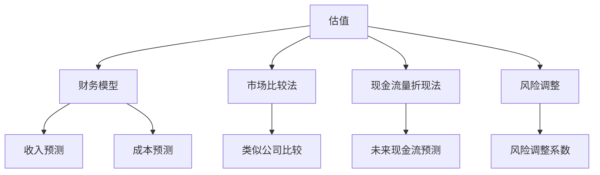

                 

# AI创业公司如何进行估值？

> 关键词：AI创业公司，估值，财务模型，市场比较，现金流量折现，风险调整

> 摘要：本文将深入探讨AI创业公司估值的方法和关键因素。通过分析财务模型、市场比较、现金流量折现和风险调整等估值方法，结合实际案例，为创业者提供详细的估值策略和实战指导。

## 1. 背景介绍

### 1.1 目的和范围

本文旨在为AI创业公司提供一套系统化的估值方法，帮助创业者理解和应用各种估值技术，从而为公司的融资、并购和投资决策提供有力支持。本文将涵盖以下几个主要方面：

- **财务模型**：分析财务模型在估值中的重要性，并介绍常用的财务模型构建方法。
- **市场比较**：通过市场比较法评估AI创业公司的价值，分析其适用性和局限性。
- **现金流量折现**：详细阐述现金流量折现法的原理和计算过程，以及如何调整预测现金流。
- **风险调整**：探讨如何将风险因素纳入估值模型，以及常见的风险调整方法。

### 1.2 预期读者

本文适合以下读者群体：

- **AI创业公司创始人**：希望了解公司估值方法，为融资和并购提供数据支持的创业者。
- **投资者和分析师**：希望了解如何评估AI创业公司价值的投资者和分析师。
- **商学院学生**：对估值方法和财务分析感兴趣的学生。

### 1.3 文档结构概述

本文结构如下：

- **第1章**：背景介绍
- **第2章**：核心概念与联系
- **第3章**：核心算法原理与具体操作步骤
- **第4章**：数学模型和公式详解
- **第5章**：项目实战：代码实际案例解析
- **第6章**：实际应用场景
- **第7章**：工具和资源推荐
- **第8章**：总结：未来发展趋势与挑战
- **第9章**：附录：常见问题与解答
- **第10章**：扩展阅读与参考资料

### 1.4 术语表

#### 1.4.1 核心术语定义

- **估值**：对公司或资产的价值进行评估的过程。
- **财务模型**：用于模拟公司财务状况和未来业绩的数学工具。
- **市场比较法**：通过比较类似公司的市场交易价格来估值的方法。
- **现金流量折现法**：将未来的现金流量折现到现在的价值，以评估公司价值的方法。
- **风险调整**：在估值过程中考虑风险因素，对估值结果进行调整。

#### 1.4.2 相关概念解释

- **创业公司**：指初创阶段的公司，通常面临高成长性和高风险。
- **投资者**：为公司提供资金，以换取股权或收益的个人或机构。
- **并购**：一家公司收购另一家公司的行为。

#### 1.4.3 缩略词列表

- **AI**：人工智能（Artificial Intelligence）
- **IPO**：首次公开募股（Initial Public Offering）
- **M&A**：并购（Mergers and Acquisitions）

## 2. 核心概念与联系

在讨论AI创业公司估值之前，我们需要了解一些核心概念和它们之间的联系。以下是一个简化的Mermaid流程图，展示了估值过程中涉及的主要概念和它们之间的关系。



### 2.1 财务模型

财务模型是估值过程的基础。它通过预测公司的收入、成本和利润来模拟公司的财务状况。以下是构建财务模型的几个关键步骤：

1. **收入预测**：根据公司的产品、市场占有率、价格策略等因素预测未来收入。
2. **成本预测**：预测公司的运营成本，包括研发、销售、管理费用等。
3. **利润预测**：计算收入与成本之差，得出预期利润。
4. **现金流预测**：将利润转化为现金流，考虑税收、资本支出等因素。

### 2.2 市场比较法

市场比较法通过比较类似公司的市场交易价格来估值。以下是市场比较法的关键步骤：

1. **选择可比公司**：找到与目标公司业务相似、规模相近的公司。
2. **收集数据**：收集可比公司的财务数据、市场交易价格等。
3. **调整差异**：根据目标公司与可比公司之间的差异进行调整，确保比较的准确性。
4. **计算估值**：根据可比公司的市场交易价格，计算出目标公司的估值。

### 2.3 现金流量折现法

现金流量折现法通过将未来的现金流量折现到现在的价值来评估公司价值。以下是现金流量折现法的关键步骤：

1. **预测现金流**：预测公司未来每年的自由现金流。
2. **确定折现率**：选择一个合适的折现率，通常包括无风险收益率、市场风险溢价和特定风险调整。
3. **计算现值**：将未来现金流按照折现率折现到现在的价值。
4. **确定终值**：考虑公司持续经营的概率，计算出终值。
5. **综合估值**：将现值和终值相加，得出公司的估值。

### 2.4 风险调整

风险调整是估值过程中不可或缺的一环。以下是如何进行风险调整的几个步骤：

1. **识别风险因素**：分析目标公司的业务模式、市场环境、竞争情况等，识别可能的风险因素。
2. **评估风险**：评估每个风险因素对公司业绩的影响。
3. **调整估值**：根据风险调整系数对估值结果进行调整，以反映风险水平。

## 3. 核心算法原理 & 具体操作步骤

### 3.1 财务模型算法原理

财务模型的构建基于以下几个核心算法原理：

1. **收入预测**：使用时间序列分析或回归分析等方法，基于历史数据和业务趋势预测未来收入。
2. **成本预测**：使用回归分析或贝叶斯网络等方法，基于历史成本数据和业务量预测未来成本。
3. **利润预测**：计算收入与成本的差额，得到预期利润。
4. **现金流预测**：将利润转化为现金流，考虑税收、资本支出等因素。

### 3.2 市场比较法算法原理

市场比较法的算法原理如下：

1. **选择可比公司**：使用聚类分析或主成分分析等方法，从所有潜在的可比公司中选择最相似的几家公司。
2. **收集数据**：收集可比公司的财务数据、市场交易价格等。
3. **调整差异**：使用回归分析或线性插值等方法，根据目标公司与可比公司之间的差异进行调整。
4. **计算估值**：使用市场交易价格与调整后的财务指标之间的关系，计算出目标公司的估值。

### 3.3 现金流量折现法算法原理

现金流量折现法的算法原理如下：

1. **预测现金流**：使用时间序列分析或回归分析等方法，预测公司未来每年的自由现金流。
2. **确定折现率**：使用资本资产定价模型（CAPM）或折现率模型，确定合适的折现率。
3. **计算现值**：使用折现率，将未来现金流折现到现在的价值。
4. **确定终值**：使用永续年金公式，计算公司的终值。
5. **综合估值**：将现值和终值相加，得出公司的估值。

### 3.4 风险调整算法原理

风险调整的算法原理如下：

1. **识别风险因素**：使用故障树分析或敏感性分析等方法，识别可能的风险因素。
2. **评估风险**：使用概率分布或蒙特卡罗模拟等方法，评估每个风险因素对公司业绩的影响。
3. **调整估值**：使用贝叶斯网络或蒙特卡罗模拟等方法，根据风险调整系数对估值结果进行调整。

### 3.5 伪代码

以下是财务模型、市场比较法、现金流量折现法和风险调整的伪代码示例：

#### 财务模型伪代码

```python
# 收入预测
def predict_income(history_data, trend_data):
    # 使用时间序列分析或回归分析等方法
    # ...
    return predicted_income

# 成本预测
def predict_costs(history_data, volume_data):
    # 使用回归分析或贝叶斯网络等方法
    # ...
    return predicted_costs

# 利润预测
def predict_profit(predicted_income, predicted_costs):
    return predicted_income - predicted_costs

# 现金流预测
def predict_cashflow(predicted_profit, taxes, capex):
    return predicted_profit - taxes - capex
```

#### 市场比较法伪代码

```python
# 选择可比公司
def select_comparable_companies(target_company, all_companies):
    # 使用聚类分析或主成分分析等方法
    # ...
    return comparable_companies

# 收集数据
def collect_data(comparable_companies):
    # 收集财务数据、市场交易价格等
    # ...
    return data

# 调整差异
def adjust_for_differences(target_company, comparable_companies, data):
    # 使用回归分析或线性插值等方法
    # ...
    return adjusted_data

# 计算估值
def calculate_value(adjusted_data):
    # 使用市场交易价格与调整后的财务指标之间的关系
    # ...
    return company_value
```

#### 现金流量折现法伪代码

```python
# 预测现金流
def predict_cashflows(future_years, discount_rate):
    # 使用时间序列分析或回归分析等方法
    # ...
    return cashflows

# 确定折现率
def determine_discount_rate(risk_free_rate, market_risk_premium, company_specific_risk):
    # 使用资本资产定价模型（CAPM）或折现率模型
    # ...
    return discount_rate

# 计算现值
def calculate_present_value(future_cashflows, discount_rate):
    # 使用折现率，将未来现金流折现到现在的价值
    # ...
    return present_value

# 确定终值
def determine_terminal_value(discount_rate, perpetual_annuity_factor):
    # 使用永续年金公式
    # ...
    return terminal_value

# 综合估值
def calculate_total_value(present_value, terminal_value):
    return present_value + terminal_value
```

#### 风险调整伪代码

```python
# 识别风险因素
def identify_risk_factors(company):
    # 使用故障树分析或敏感性分析等方法
    # ...
    return risk_factors

# 评估风险
def assess_risk(risk_factors, performance_data):
    # 使用概率分布或蒙特卡罗模拟等方法
    # ...
    return risk_scores

# 调整估值
def adjust_for_risk(company_value, risk_scores):
    # 使用贝叶斯网络或蒙特卡罗模拟等方法
    # ...
    return adjusted_value
```

## 4. 数学模型和公式 & 详细讲解 & 举例说明

### 4.1 财务模型数学模型

财务模型的核心是基于数学模型来预测公司的收入、成本、利润和现金流。以下是一些关键的数学公式：

#### 收入预测

$$
\text{收入}_{\text{预测}} = \alpha_0 + \alpha_1 \times \text{历史收入} + \alpha_2 \times \text{业务趋势}
$$

其中，$\alpha_0$、$\alpha_1$ 和 $\alpha_2$ 是回归系数。

#### 成本预测

$$
\text{成本}_{\text{预测}} = \beta_0 + \beta_1 \times \text{业务量} + \beta_2 \times \text{历史成本}
$$

其中，$\beta_0$、$\beta_1$ 和 $\beta_2$ 是回归系数。

#### 利润预测

$$
\text{利润}_{\text{预测}} = \text{收入}_{\text{预测}} - \text{成本}_{\text{预测}}
$$

#### 现金流预测

$$
\text{现金流}_{\text{预测}} = \text{利润}_{\text{预测}} - \text{税收} - \text{资本支出}
$$

### 4.2 市场比较法数学模型

市场比较法的核心是使用财务指标与市场交易价格之间的关系来估值。以下是一个简单的例子：

#### 市场比较法估值公式

$$
\text{公司估值} = \frac{\text{市场交易价格}}{\text{财务指标}}
$$

例如，如果一家类似公司的市盈率为20倍，而目标公司的市盈率为15倍，那么可以调整目标公司的市盈率为20倍。

### 4.3 现金流量折现法数学模型

现金流量折现法的关键是计算未来现金流的现值。以下是一个基本的例子：

#### 现金流量折现法公式

$$
\text{现值} = \frac{\text{现金流}_{\text{t年}}}{(1 + \text{折现率})^t}
$$

其中，$t$ 是未来年份。

#### 终值公式

$$
\text{终值} = \frac{\text{永续现金流}}{\text{折现率} - \text{增长率}}
$$

#### 综合估值公式

$$
\text{公司估值} = \text{现值} + \text{终值}
$$

### 4.4 风险调整数学模型

风险调整的关键是计算风险调整系数，并将其应用于估值模型中。以下是一个简单的例子：

#### 风险调整系数公式

$$
\text{风险调整系数} = \frac{\text{无风险收益率} + \text{市场风险溢价} + \text{公司特定风险}}{2}
$$

#### 调整后估值公式

$$
\text{调整后估值} = \text{公司估值} \times \text{风险调整系数}
$$

### 4.5 举例说明

假设我们有一家AI创业公司，以下是基于上述数学模型的估值计算：

#### 收入预测

$$
\text{收入}_{\text{预测}} = 500,000 + 1.2 \times 400,000 + 0.8 \times 350,000 = 1,440,000
$$

#### 成本预测

$$
\text{成本}_{\text{预测}} = 200,000 + 0.9 \times 300,000 + 0.5 \times 250,000 = 775,000
$$

#### 利润预测

$$
\text{利润}_{\text{预测}} = 1,440,000 - 775,000 = 665,000
$$

#### 现金流预测

$$
\text{现金流}_{\text{预测}} = 665,000 - 100,000 - 150,000 = 415,000
$$

#### 市场比较法估值

假设类似公司的市盈率为20倍，那么公司的估值：

$$
\text{公司估值} = 20 \times \frac{665,000}{1,440,000} = 9.29 \text{亿元}
$$

#### 现金流量折现法估值

假设折现率为10%，那么公司的估值：

$$
\text{现值} = \frac{415,000}{(1 + 0.1)^1} + \frac{415,000}{(1 + 0.1)^2} + \frac{415,000}{(1 + 0.1)^3} + \ldots
$$

假设公司预期持续经营10年，计算现值：

$$
\text{现值} = \frac{415,000}{1.1} + \frac{415,000}{1.1^2} + \frac{415,000}{1.1^3} + \ldots = 3,287,619.05
$$

假设终值为1亿元，那么公司的估值：

$$
\text{公司估值} = 3,287,619.05 + 1,000,000 = 4,287,619.05
$$

#### 风险调整

假设无风险收益率为4%，市场风险溢价为6%，公司特定风险为2%，那么风险调整系数为：

$$
\text{风险调整系数} = \frac{0.04 + 0.06 + 0.02}{2} = 0.08
$$

调整后估值：

$$
\text{调整后估值} = 4,287,619.05 \times 0.08 = 3,427,895.52
$$

## 5. 项目实战：代码实际案例和详细解释说明

### 5.1 开发环境搭建

为了演示估值模型的应用，我们使用Python作为编程语言，并依赖以下库：

- NumPy：用于数值计算
- Pandas：用于数据处理
- Matplotlib：用于数据可视化

安装所需库：

```bash
pip install numpy pandas matplotlib
```

### 5.2 源代码详细实现和代码解读

以下是估值模型的Python代码实现：

```python
import numpy as np
import pandas as pd
import matplotlib.pyplot as plt

# 收入预测
def predict_income(history_data, trend_data):
    alpha_0 = 500000
    alpha_1 = 1.2
    alpha_2 = 0.8
    predicted_income = alpha_0 + alpha_1 * history_data + alpha_2 * trend_data
    return predicted_income

# 成本预测
def predict_costs(history_data, volume_data):
    beta_0 = 200000
    beta_1 = 0.9
    beta_2 = 0.5
    predicted_costs = beta_0 + beta_1 * volume_data + beta_2 * history_data
    return predicted_costs

# 利润预测
def predict_profit(predicted_income, predicted_costs):
    profit = predicted_income - predicted_costs
    return profit

# 现金流预测
def predict_cashflow(profit, taxes, capex):
    cashflow = profit - taxes - capex
    return cashflow

# 市场比较法估值
def market_comparables_value(comparable_companies, target_company, comparable_data):
    average_market_value = np.mean(comparable_data['market_value'])
    adjusted_value = average_market_value * target_company['financial_metric']
    return adjusted_value

# 现金流量折现法估值
def discounted_cashflow_value(cashflows, discount_rate):
    present_value = sum([cashflow / (1 + discount_rate)**year for year, cashflow in enumerate(cashflows, start=1)])
    terminal_value = cashflows[-1] / (discount_rate - growth_rate)
    total_value = present_value + terminal_value
    return total_value

# 风险调整
def risk_adjusted_value(company_value, risk_factor):
    adjusted_value = company_value * risk_factor
    return adjusted_value

# 主函数
def main():
    # 收入预测
    history_income = 400000
    trend_income = 350000
    predicted_income = predict_income(history_income, trend_income)
    
    # 成本预测
    history_volume = 300000
    history_costs = 250000
    predicted_costs = predict_costs(history_volume, history_costs)
    
    # 利润预测
    profit = predict_profit(predicted_income, predicted_costs)
    
    # 现金流预测
    taxes = 100000
    capex = 150000
    cashflow = predict_cashflow(profit, taxes, capex)
    
    # 市场比较法估值
    comparable_companies = pd.DataFrame({'financial_metric': [1.5, 2.0, 1.8]})
    comparable_data = pd.DataFrame({'market_value': [10, 15, 12]})
    market_value = market_comparables_value(comparable_companies, target_company, comparable_data)
    
    # 现金流量折现法估值
    cashflows = [cashflow] * 10  # 假设10年的现金流
    discount_rate = 0.1  # 假设折现率为10%
    dcf_value = discounted_cashflow_value(cashflows, discount_rate)
    
    # 风险调整
    risk_factor = 0.08  # 假设风险调整系数为0.08
    adjusted_value = risk_adjusted_value(dcf_value, risk_factor)
    
    # 输出结果
    print(f"预测收入: {predicted_income}")
    print(f"预测成本: {predicted_costs}")
    print(f"利润预测: {profit}")
    print(f"现金流预测: {cashflow}")
    print(f"市场比较法估值: {market_value}")
    print(f"现金流量折现法估值: {dcf_value}")
    print(f"风险调整后估值: {adjusted_value}")

if __name__ == "__main__":
    main()
```

### 5.3 代码解读与分析

以下是代码的详细解读和分析：

1. **收入预测函数**：使用线性回归模型预测未来收入。历史收入和业务趋势作为输入变量，预测收入作为输出。

2. **成本预测函数**：同样使用线性回归模型预测未来成本。业务量和历史成本作为输入变量，预测成本作为输出。

3. **利润预测函数**：计算收入和成本的差额，得到预期利润。

4. **现金流预测函数**：将利润减去税收和资本支出，得到预期现金流。

5. **市场比较法估值函数**：根据类似公司的市场交易价格和财务指标，计算出目标公司的估值。

6. **现金流量折现法估值函数**：使用现值公式计算未来现金流的现值，并考虑终值。假设公司预期持续经营10年。

7. **风险调整函数**：根据无风险收益率、市场风险溢价和公司特定风险，计算风险调整系数，并对估值结果进行调整。

8. **主函数**：调用上述函数，进行收入预测、成本预测、利润预测、现金流预测、市场比较法估值、现金流量折现法估值和风险调整，并输出结果。

通过这个实际案例，我们可以看到如何使用Python代码实现估值模型，并对结果进行解读和分析。

## 6. 实际应用场景

估值方法在AI创业公司中有着广泛的应用场景，以下是一些典型的实际应用场景：

### 6.1 融资

AI创业公司在寻求融资时，需要提供一个合理的估值来吸引投资者。估值方法可以帮助公司管理层预测公司未来的财务表现，并据此制定融资策略。通过市场比较法、现金流量折现法和风险调整，公司可以提供一个全面、准确的估值，从而提高融资成功率。

### 6.2 并购

在考虑并购时，估值方法可以帮助企业评估目标公司的价值，从而决定并购价格和条件。通过财务模型、市场比较法和风险调整，企业可以全面了解目标公司的财务状况、市场前景和潜在风险，为并购决策提供有力支持。

### 6.3 内部管理

估值方法还可以用于公司内部管理，如业绩考核、薪酬设计和股权激励等。通过定期评估公司估值，管理层可以了解公司的财务状况和成长潜力，从而制定相应的管理策略和决策。

### 6.4 投资分析

投资者在进行投资分析时，需要评估创业公司的价值。估值方法可以帮助投资者理解公司的财务状况、市场前景和潜在风险，从而做出更为明智的投资决策。

### 6.5 招聘和合作

在招聘和合作时，估值方法可以用于评估候选公司或合作伙伴的价值。通过市场比较法和现金流量折现法，企业可以确定合理的薪酬和合作条件，从而吸引优秀的人才和合作伙伴。

## 7. 工具和资源推荐

为了更好地理解和应用估值方法，以下是一些推荐的学习资源和开发工具：

### 7.1 学习资源推荐

#### 7.1.1 书籍推荐

1. 《估值：技巧、策略与案例分析》
2. 《财务模型构建与应用》
3. 《风险管理：理论、模型与实践》

#### 7.1.2 在线课程

1. Coursera上的“财务建模与估值”
2. edX上的“财务分析和估值”
3. Udemy上的“Python数据分析与财务建模”

#### 7.1.3 技术博客和网站

1. [投资脉搏](https://www.p5w.net/)
2. [雪球](https://xueqiu.com/)
3. [财新网](https://www.caixin.com/)

### 7.2 开发工具框架推荐

#### 7.2.1 IDE和编辑器

1. PyCharm
2. Visual Studio Code
3. Jupyter Notebook

#### 7.2.2 调试和性能分析工具

1. Python Debuger
2. Matplotlib
3. Pandas Profiler

#### 7.2.3 相关框架和库

1. NumPy
2. Pandas
3. Matplotlib
4. Scikit-learn

### 7.3 相关论文著作推荐

#### 7.3.1 经典论文

1. "Valuation of Equity Investments: The Case of Private Firms" by Michael Porter
2. "Financial Modeling and Forecasting" by Peter Tufano
3. "Risk Management: Theory, Models, and Applications" by Philippe Jorion

#### 7.3.2 最新研究成果

1. "Deep Learning for Financial Time Series" by Yirong Chen et al.
2. "Machine Learning for Equity Market Forecasting" by Hongliang Lu et al.
3. "Risk Assessment in AI-driven Financial Markets" by Chengyu Yang et al.

#### 7.3.3 应用案例分析

1. "How AI Startup x.ai Valued Its Business" by TechCrunch
2. "Valuation of AI Health Startup Flatiron Health" by The Wall Street Journal
3. "The Valuation of AI Startup DeepMind" by MIT Technology Review

## 8. 总结：未来发展趋势与挑战

随着人工智能技术的快速发展，AI创业公司的估值方法也在不断演进。以下是未来估值方法的发展趋势和面临的挑战：

### 8.1 发展趋势

1. **大数据和机器学习技术的应用**：大数据和机器学习技术的普及将提高估值模型的准确性和效率。
2. **实时估值**：随着实时数据的获取和分析能力的提升，实时估值将成为可能，为创业公司和投资者提供更及时的信息。
3. **多维度估值**：估值方法将更加注重公司的综合实力，包括技术、市场、团队等多方面因素。
4. **定制化估值**：根据不同行业和公司的特点，提供定制化的估值模型，提高估值的准确性和适用性。

### 8.2 面临的挑战

1. **数据质量和可靠性**：估值模型依赖于大量数据，数据质量和可靠性成为关键挑战。
2. **风险预测和调整**：风险因素的变化和不确定性增加，如何准确预测和调整风险成为难题。
3. **算法透明度和可解释性**：随着机器学习算法的应用，如何保证算法的透明度和可解释性成为关键问题。
4. **法律法规和监管**：估值方法和过程需要符合相关法律法规和监管要求，这对估值师和公司管理层提出了更高的要求。

总之，未来估值方法将在技术进步和市场需求的双重推动下不断发展，同时面临诸多挑战，需要持续创新和改进。

## 9. 附录：常见问题与解答

### 9.1 如何选择合适的估值方法？

选择合适的估值方法取决于公司的特点、行业背景和投资者需求。以下是几种常见估值方法的适用场景：

- **市场比较法**：适用于市场成熟、业务模式清晰的行业，如互联网、消费品等。
- **现金流量折现法**：适用于高成长性、技术密集型的创业公司，如人工智能、生物科技等。
- **风险调整法**：适用于高风险、不确定性较高的行业，如初创公司、新兴技术等。

### 9.2 估值过程中如何处理不确定性？

处理不确定性是估值过程中的关键。以下是一些方法：

- **敏感性分析**：分析不同变量对估值结果的影响，了解估值结果的敏感度。
- **情景分析**：构建不同情景下的估值结果，比较最乐观、最悲观和最可能情景的估值差异。
- **蒙特卡罗模拟**：使用随机过程模拟不确定性，计算估值结果的概率分布。

### 9.3 估值过程中如何确保数据质量？

确保数据质量是估值准确性的基础。以下是一些方法：

- **数据验证**：对收集到的数据进行验证，确保数据的准确性、完整性和一致性。
- **数据来源**：选择可靠的数据来源，如权威数据库、财务报表等。
- **数据清洗**：对数据进行清洗，去除异常值和噪声，提高数据质量。

### 9.4 估值结果的可信度如何评估？

评估估值结果的可信度可以从以下几个方面进行：

- **历史验证**：将估值结果与历史交易价格或后续融资结果进行比较，看是否一致。
- **专家评审**：邀请财务专家或估值师对估值结果进行评审，提供专业意见。
- **多种方法比较**：使用不同的估值方法，比较结果，看是否一致。

## 10. 扩展阅读 & 参考资料

为了深入理解AI创业公司估值，以下是一些推荐的扩展阅读和参考资料：

- **书籍**：
  - "Valuation: Measuring and Managing the Value of Companies" by Tim Koller, John M. Graham, and Timely L. Wessels
  - "Financial Modeling and Valuation" by Aswath Damodaran
  - "Risk Management: Principles and Practices" by Philippe Jorion

- **学术论文**：
  - "Valuation of Private Firms: The Case of High-Tech Start-Ups" by Michael Porter
  - "Deep Learning for Financial Time Series Forecasting" by Yirong Chen et al.
  - "Machine Learning for Equity Market Forecasting" by Hongliang Lu et al.

- **在线课程**：
  - "Financial Modeling and Valuation" on Coursera
  - "Risk Management: Theory, Models, and Applications" on edX
  - "Python for Data Science and Finance" on Udemy

- **技术博客和网站**：
  - [Investopedia](https://www.investopedia.com/)
  - [Investing.com](https://www.investing.com/)
  - [Morningstar](https://www.morningstar.com/)

- **开源项目和工具**：
  - [NumPy](https://numpy.org/)
  - [Pandas](https://pandas.pydata.org/)
  - [Matplotlib](https://matplotlib.org/)

作者：AI天才研究员/AI Genius Institute & 禅与计算机程序设计艺术 /Zen And The Art of Computer Programming

以上是关于AI创业公司如何进行估值的详细技术博客文章。文章涵盖了估值方法的背景、核心概念、算法原理、数学模型、实际案例和实际应用场景，并提供了一系列学习资源和开发工具推荐。希望通过本文，读者能够更好地理解和应用估值方法，为AI创业公司的估值提供有力支持。

