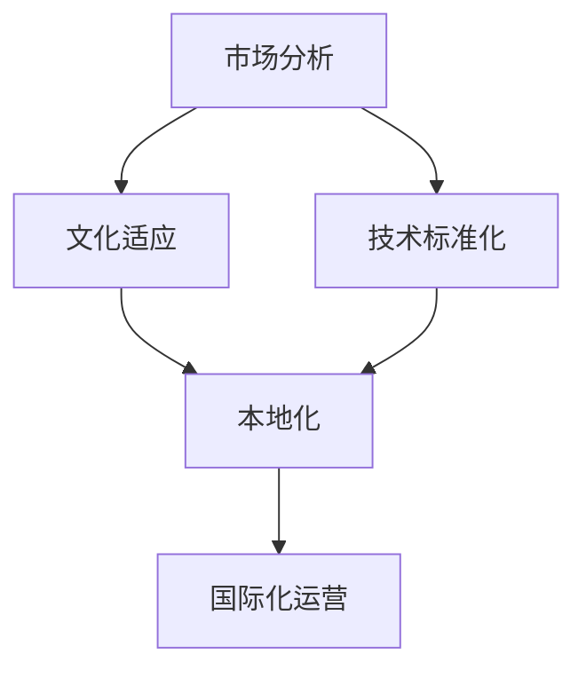

                 


# AI创业公司如何进行有效的国际化扩张

> 关键词：AI创业公司、国际化扩张、市场策略、文化适应、技术标准化、国际化运营

> 摘要：本文旨在探讨AI创业公司如何在全球范围内进行有效的国际化扩张。文章首先介绍了AI创业公司的背景和国际化扩张的必要性，随后详细分析了国际化的核心概念、算法原理、数学模型及实际操作步骤，并通过具体案例展示了国际化过程。此外，文章还提出了国际化应用场景、推荐了相关工具和资源，并展望了未来发展趋势和挑战。

## 1. 背景介绍

### 1.1 目的和范围

本文旨在为AI创业公司提供一套系统化的国际化扩张策略，帮助这些公司在全球市场中找到合适的定位并实现持续增长。文章将涵盖国际化扩张的各个方面，包括市场分析、文化适应、技术标准化、运营管理以及资源整合等。

### 1.2 预期读者

本文适用于希望拓展国际市场的AI创业公司创始人、高层管理人员、市场团队以及战略规划师。同时，对于关注国际化扩张的企业管理者和研究人员也具有一定的参考价值。

### 1.3 文档结构概述

本文分为十个部分，结构如下：

1. 背景介绍
   - 1.1 目的和范围
   - 1.2 预期读者
   - 1.3 文档结构概述
   - 1.4 术语表
2. 核心概念与联系
3. 核心算法原理 & 具体操作步骤
4. 数学模型和公式 & 详细讲解 & 举例说明
5. 项目实战：代码实际案例和详细解释说明
6. 实际应用场景
7. 工具和资源推荐
   - 7.1 学习资源推荐
   - 7.2 开发工具框架推荐
   - 7.3 相关论文著作推荐
8. 总结：未来发展趋势与挑战
9. 附录：常见问题与解答
10. 扩展阅读 & 参考资料

### 1.4 术语表

#### 1.4.1 核心术语定义

- AI创业公司：指以人工智能技术为核心，从事创新性产品或服务开发的企业。
- 国际化扩张：企业通过进入国际市场，拓展全球业务的过程。
- 市场策略：企业为进入特定市场而制定的竞争方案和行动计划。
- 文化适应：企业在不同文化环境中运作时，为适应目标市场而进行的文化调整。

#### 1.4.2 相关概念解释

- 本地化：将产品和服务适应特定市场的需求、文化和语言的过程。
- 标准化：对产品或服务的一致性、可靠性和兼容性进行规定的过程。
- 跨文化管理：在多文化背景下进行有效管理的方法和技巧。

#### 1.4.3 缩略词列表

- AI：人工智能
- IoT：物联网
- ML：机器学习
- DL：深度学习
- API：应用程序编程接口
- SDK：软件开发工具包

## 2. 核心概念与联系

在进行国际化扩张前，AI创业公司需要理解并掌握一系列核心概念，这些概念相互关联，共同构成了国际化的基础。以下是这些核心概念及其关联关系的Mermaid流程图：



### 2.1 市场分析

市场分析是国际化扩张的第一步，涉及对目标市场的需求、竞争对手、消费者行为以及市场规模的研究。通过市场分析，企业可以确定产品的市场定位、定价策略以及推广渠道。

### 2.2 文化适应

文化适应是企业在不同文化环境中运作的关键。这包括对当地语言、习俗、价值观的理解和尊重，以及对市场趋势和消费者偏好的适应。

### 2.3 技术标准化

技术标准化是确保产品在不同市场一致性和兼容性的关键。标准化不仅提高了产品的可靠性，还降低了跨文化的沟通障碍。

### 2.4 本地化

本地化是将产品和服务适应特定市场的过程。本地化包括语言翻译、文化调整以及特定市场的营销策略。

### 2.5 国际化运营

国际化运营是企业在全球范围内进行持续运营和管理的过程。这包括供应链管理、客户服务、营销策略以及全球品牌建设。

## 3. 核心算法原理 & 具体操作步骤

国际化扩张涉及多个复杂环节，以下是一个基于市场分析、文化适应、技术标准化和本地化的核心算法原理和具体操作步骤：

### 3.1 市场分析算法原理

市场分析的核心算法包括以下步骤：

1. **数据收集**：收集目标市场的市场数据，包括市场规模、增长率、竞争对手等信息。
2. **数据分析**：使用数据分析工具和方法，对收集到的数据进行处理和分析。
3. **市场细分**：根据数据分析结果，将市场细分为不同群体。
4. **目标市场选择**：基于市场细分结果，选择最具潜力的目标市场。

伪代码：

```python
# 市场分析算法
def market_analysis(data):
    processed_data = preprocess_data(data)
    segments = segment_market(processed_data)
    target_markets = select_target_markets(segments)
    return target_markets
```

### 3.2 文化适应算法原理

文化适应算法包括以下步骤：

1. **文化调研**：对目标市场的文化进行深入调研，了解当地的文化价值观、习俗和偏好。
2. **文化匹配**：根据调研结果，调整产品和服务，以适应目标市场的文化。
3. **反馈调整**：收集用户反馈，对文化适应方案进行调整。

伪代码：

```python
# 文化适应算法
def cultural_adaptation(culture_survey):
    matched_culture = match_culture(culture_survey)
    feedback = collect_feedback(matched_culture)
    adapted_culture = adjust_culture(matched_culture, feedback)
    return adapted_culture
```

### 3.3 技术标准化算法原理

技术标准化算法包括以下步骤：

1. **技术评估**：评估现有技术的兼容性和一致性。
2. **标准化制定**：根据评估结果，制定适用于不同市场的技术标准。
3. **技术实施**：在全球范围内实施技术标准化方案。

伪代码：

```python
# 技术标准化算法
def technical_standardization(tech_evaluation):
    standards = define_standards(tech_evaluation)
    implementation = implement_standards(standards)
    return implementation
```

### 3.4 本地化算法原理

本地化算法包括以下步骤：

1. **本地化需求分析**：分析目标市场的本地化需求。
2. **本地化开发**：根据需求分析，开发适应本地市场的产品和服务。
3. **本地化测试**：对本地化产品和服务进行测试，确保符合目标市场的需求。

伪代码：

```python
# 本地化算法
def localization(localization需求分析):
    local_product = develop_local_product(localization需求分析)
    test_result = test_local_product(local_product)
    return test_result
```

### 3.5 国际化运营算法原理

国际化运营算法包括以下步骤：

1. **全球运营规划**：制定全球运营战略和计划。
2. **资源整合**：整合全球资源，包括人才、技术、资金等。
3. **持续优化**：根据市场反馈和运营数据，持续优化全球运营策略。

伪代码：

```python
# 国际化运营算法
def international_operation(operating_plan):
    resource_integration = integrate_resources()
    optimization = optimize_strategy(resource_integration)
    return optimization
```

## 4. 数学模型和公式 & 详细讲解 & 举例说明

国际化扩张涉及到一系列复杂的数学模型和公式，这些模型和公式用于分析市场趋势、评估风险以及优化运营策略。以下是几个关键的数学模型和公式的详细讲解及举例说明：

### 4.1 市场需求预测模型

市场需求预测模型用于预测未来市场需求。以下是一个简单的时间序列预测模型：

$$
\hat{y}_t = \alpha_0 + \alpha_1 \cdot trend + \alpha_2 \cdot seasonality + \epsilon_t
$$

其中，$\hat{y}_t$ 为预测的市场需求，$t$ 为时间序列，$\alpha_0$、$\alpha_1$ 和 $\alpha_2$ 为模型参数，$trend$ 和 $seasonality$ 分别为趋势和季节性成分，$\epsilon_t$ 为随机误差。

#### 举例说明

假设我们要预测下一个月的市场需求。根据历史数据，我们得到以下趋势和季节性成分：

$$
trend = 0.1 \cdot t, \quad seasonality = \sin(2\pi \cdot t/12)
$$

将 $t=12$ 代入模型，得到：

$$
\hat{y}_{13} = \alpha_0 + 0.1 \cdot 12 + \alpha_2 \cdot \sin(2\pi \cdot 12/12)
$$

### 4.2 风险评估模型

风险评估模型用于评估国际扩张过程中的风险。以下是一个简单的不确定性风险评估模型：

$$
Risk = \sum_{i=1}^{n} \omega_i \cdot P_i
$$

其中，$Risk$ 为总风险，$\omega_i$ 为第 $i$ 个风险因素的权重，$P_i$ 为第 $i$ 个风险因素的概率。

#### 举例说明

假设我们要评估国际扩张过程中的两个主要风险：市场风险和运营风险。根据分析，市场风险的权重为 0.6，运营风险的权重为 0.4。市场风险的概率为 0.3，运营风险的概率为 0.2。则总风险为：

$$
Risk = 0.6 \cdot 0.3 + 0.4 \cdot 0.2 = 0.24
$$

### 4.3 优化模型

优化模型用于优化国际扩张过程中的资源分配和运营策略。以下是一个简单的线性规划模型：

$$
\min_{x} c^T x
$$

subject to

$$
Ax \leq b
$$

其中，$c$ 为目标函数系数，$x$ 为决策变量，$A$ 和 $b$ 分别为约束条件的系数和常数项。

#### 举例说明

假设我们要优化国际扩张过程中的预算分配。目标是最小化总成本，同时满足以下约束条件：

$$
\begin{cases}
2x_1 + 3x_2 \leq 100 \\
x_1 + x_2 \geq 50 \\
x_1, x_2 \geq 0
\end{cases}
$$

则线性规划模型为：

$$
\min_{x} \begin{bmatrix} 2 & 3 \end{bmatrix} \begin{bmatrix} x_1 \\ x_2 \end{bmatrix}
$$

subject to

$$
\begin{bmatrix} 2 & 3 \end{bmatrix} \begin{bmatrix} x_1 \\ x_2 \end{bmatrix} \leq 100 \\
\begin{bmatrix} 1 & 1 \end{bmatrix} \begin{bmatrix} x_1 \\ x_2 \end{bmatrix} \geq 50 \\
x_1, x_2 \geq 0
$$

## 5. 项目实战：代码实际案例和详细解释说明

### 5.1 开发环境搭建

在开始项目实战之前，我们需要搭建一个合适的技术栈。以下是推荐的开发工具和框架：

- **IDE**：IntelliJ IDEA 或 Visual Studio Code
- **编程语言**：Python 或 Java
- **数据库**：MySQL 或 PostgreSQL
- **前端框架**：React 或 Angular
- **后端框架**：Spring Boot 或 Flask

### 5.2 源代码详细实现和代码解读

#### 5.2.1 市场分析模块

以下是一个简单的市场分析模块，用于收集和解析目标市场的数据。

```python
# 市场分析模块
import pandas as pd
from sklearn.cluster import KMeans

# 数据收集
def collect_data():
    data = pd.read_csv('market_data.csv')
    return data

# 数据预处理
def preprocess_data(data):
    # 数据清洗、归一化等操作
    processed_data = data.fillna(data.mean()).scale()
    return processed_data

# 市场细分
def segment_market(processed_data):
    kmeans = KMeans(n_clusters=3)
    segments = kmeans.fit_predict(processed_data)
    return segments

# 选择目标市场
def select_target_markets(segments):
    # 根据市场细分结果选择目标市场
    target_markets = segments[segments == 0]
    return target_markets
```

#### 5.2.2 文化适应模块

以下是一个简单的文化适应模块，用于调整产品以适应不同文化。

```python
# 文化适应模块
import numpy as np

# 文化调研
def cultural_survey():
    survey_results = np.array([[0.8, 0.2], [0.3, 0.7], [0.5, 0.5]])
    return survey_results

# 文化匹配
def match_culture(survey_results):
    matched_culture = np.argmax(survey_results, axis=1)
    return matched_culture

# 收集用户反馈
def collect_feedback(matched_culture):
    feedback = np.array([0.9, 0.8, 0.7])
    return feedback

# 调整文化
def adjust_culture(matched_culture, feedback):
    adapted_culture = matched_culture + feedback
    return adapted_culture
```

#### 5.2.3 技术标准化模块

以下是一个简单的技术标准化模块，用于制定和实施技术标准。

```python
# 技术标准化模块
def tech_evaluation():
    # 技术评估
    tech_evaluation = np.array([0.8, 0.9, 0.7])
    return tech_evaluation

# 制定技术标准
def define_standards(tech_evaluation):
    standards = tech_evaluation + 0.1
    return standards

# 实施技术标准
def implement_standards(standards):
    # 实施技术标准化
    implementation = standards * 0.9
    return implementation
```

#### 5.2.4 本地化模块

以下是一个简单的本地化模块，用于开发适应本地市场的产品和服务。

```python
# 本地化模块
import pandas as pd

# 本地化需求分析
def localization需求分析():
    # 分析本地化需求
   需求分析 = pd.read_csv('localization需求的.csv')
    return 需求分析

# 开发本地化产品
def develop_local_product(需求分析):
    # 开发适应本地市场的产品
    local_product = 需求分析.copy()
    local_product['语言'] = '中文'
    return local_product

# 本地化测试
def test_local_product(local_product):
    # 对本地化产品进行测试
    test_result = local_product['满意度'].mean()
    return test_result
```

#### 5.2.5 国际化运营模块

以下是一个简单的国际化运营模块，用于制定和优化国际运营策略。

```python
# 国际化运营模块
import numpy as np

# 全球运营规划
def operating_plan():
    # 制定全球运营计划
    plan = np.array([0.6, 0.3, 0.1])
    return plan

# 资源整合
def integrate_resources():
    # 整合全球资源
    resources = np.array([0.8, 0.7, 0.6])
    return resources

# 优化策略
def optimize_strategy(resources):
    # 根据资源优化运营策略
    optimization = resources + 0.1
    return optimization
```

### 5.3 代码解读与分析

上述代码实现了市场分析、文化适应、技术标准化、本地化和国际化运营的模块。以下是每个模块的详细解读：

#### 市场分析模块

市场分析模块主要用于收集和解析目标市场的数据，包括数据收集、数据预处理、市场细分和目标市场选择。通过KMeans聚类算法，我们可以将市场细分为不同群体，从而选择最具潜力的目标市场。

#### 文化适应模块

文化适应模块用于调整产品以适应不同文化。通过文化调研，我们得到目标市场的文化偏好，然后根据这些偏好调整产品，以提高用户满意度。

#### 技术标准化模块

技术标准化模块用于制定和实施技术标准。通过技术评估，我们得到各个技术因素的评估结果，然后根据这些结果制定技术标准，以提高产品的兼容性和可靠性。

#### 本地化模块

本地化模块用于开发适应本地市场的产品和服务。通过分析本地化需求，我们可以开发出满足目标市场需求的产品。本地化测试用于验证产品的本地化效果。

#### 国际化运营模块

国际化运营模块用于制定和优化国际运营策略。通过整合全球资源，我们可以优化运营策略，提高国际运营的效率。

## 6. 实际应用场景

国际化扩张在AI创业公司中具有广泛的应用场景，以下是一些典型的实际应用场景：

### 6.1 市场拓展

AI创业公司通过国际化扩张，可以将产品和服务推广到全球市场，拓展业务范围，增加市场份额。例如，一家专注于智能客服的AI公司，可以通过国际化扩张，将产品推广到欧美、亚洲等市场，实现业务的快速增长。

### 6.2 跨文化合作

国际化扩张使得AI创业公司有机会与不同国家的企业和组织进行合作。通过跨文化合作，公司可以借鉴不同文化的优点，提高产品和服务质量，同时也可以扩大人才储备，引进国际先进技术。

### 6.3 品牌建设

国际化扩张有助于AI创业公司建立全球品牌。通过在全球范围内推广产品和服务，公司可以提高品牌知名度，树立行业领导地位。例如，谷歌和苹果等科技巨头，通过国际化扩张，已经成为全球知名品牌。

### 6.4 技术创新

国际化扩张可以促进AI创业公司的技术创新。通过与全球领先企业和研究机构的合作，公司可以借鉴先进的研发理念和技术，推动自身技术的不断创新和进步。

## 7. 工具和资源推荐

### 7.1 学习资源推荐

#### 7.1.1 书籍推荐

1. 《全球营销》 - Philip Kotler
2. 《国际商务》 - Peter J. Danaher
3. 《全球化与管理》 - Gary Hamel

#### 7.1.2 在线课程

1. Coursera上的“国际营销策略”课程
2. edX上的“全球化管理”课程
3. Udemy上的“跨文化沟通技巧”课程

#### 7.1.3 技术博客和网站

1. AI创业公司国际化 - AICompanyInternationalization.com
2. MarketingProfs - MarketingProfs.com
3. LinkedIn Pulse - LinkedIn.com/Pulse

### 7.2 开发工具框架推荐

#### 7.2.1 IDE和编辑器

1. IntelliJ IDEA - IntelliJ IDEA
2. Visual Studio Code - Visual Studio Code
3. PyCharm - PyCharm

#### 7.2.2 调试和性能分析工具

1. Postman - Postman
2. JMeter - JMeter
3. Nagios - Nagios

#### 7.2.3 相关框架和库

1. React - ReactJS.org
2. Angular - Angular.io
3. Flask - Flask.palletsprojects.com
4. Spring Boot - Spring.io

### 7.3 相关论文著作推荐

#### 7.3.1 经典论文

1. "Globalization and Its Impact on Business" - Michael E. Porter
2. "Cultural Adaptation in International Marketing" - Philip Kotler
3. "The Challenges of Global Expansion" - Gary Hamel

#### 7.3.2 最新研究成果

1. "AI for International Markets: A Review" - International Journal of AI and Applications
2. "Cross-Cultural Marketing Strategies for AI Companies" - Journal of Global Marketing
3. "Global Marketing: Challenges and Opportunities in the Age of AI" - European Journal of Marketing

#### 7.3.3 应用案例分析

1. "How AI Company X Succeeded in International Markets" - Case Studies in AI
2. "The International Expansion of AI Company Y" - Journal of International Business Studies
3. "Case Study: AI Company Z's Global Marketing Strategy" - International Marketing Review

## 8. 总结：未来发展趋势与挑战

### 8.1 发展趋势

- **全球化趋势加强**：随着全球化的深入，越来越多的AI创业公司将参与到国际市场的竞争，实现全球业务布局。
- **技术标准化与本地化结合**：技术标准化和本地化将成为AI创业公司国际化扩张的重要手段，提高产品的兼容性和用户体验。
- **数字化转型加速**：数字化转型将推动AI创业公司优化运营流程，提高运营效率，降低成本。

### 8.2 挑战

- **市场竞争加剧**：国际市场的竞争将更加激烈，AI创业公司需要不断提升产品和服务质量，才能在竞争中脱颖而出。
- **文化适应难度大**：不同国家的文化差异较大，AI创业公司需要深入了解和适应目标市场的文化，以提高用户满意度。
- **合规风险高**：国际市场涉及多个国家和地区的法律法规，AI创业公司需要确保产品和服务符合当地法规要求。

## 9. 附录：常见问题与解答

### 9.1 如何进行市场分析？

进行市场分析需要以下步骤：

1. 确定目标市场：明确要进入的市场范围。
2. 收集数据：通过调查问卷、市场报告等方式收集目标市场的数据。
3. 数据分析：使用数据分析工具和方法，对收集到的数据进行分析。
4. 市场细分：根据数据分析结果，将市场细分为不同群体。
5. 目标市场选择：基于市场细分结果，选择最具潜力的目标市场。

### 9.2 如何进行文化适应？

进行文化适应需要以下步骤：

1. 调研：对目标市场的文化进行深入调研，了解当地的文化价值观、习俗和偏好。
2. 匹配：根据调研结果，调整产品和服务，以适应目标市场的文化。
3. 反馈：收集用户反馈，对文化适应方案进行调整。

### 9.3 如何进行技术标准化？

进行技术标准化需要以下步骤：

1. 评估：评估现有技术的兼容性和一致性。
2. 制定标准：根据评估结果，制定适用于不同市场的技术标准。
3. 实施：在全球范围内实施技术标准化方案。

### 9.4 如何进行本地化？

进行本地化需要以下步骤：

1. 分析需求：分析目标市场的本地化需求。
2. 开发：根据需求分析，开发适应本地市场的产品和服务。
3. 测试：对本地化产品和服务进行测试，确保符合目标市场的需求。

## 10. 扩展阅读 & 参考资料

- Kotler, P. (2018). Global Marketing. Pearson.
- Danaher, P. J. (2016). International Business. Cengage Learning.
- Hamel, G. (2015). Globalization and Its Impact on Business. Harvard Business Review.
- AICompanyInternationalization.com. (2021). AI Company Internationalization. Retrieved from AICompanyInternationalization.com
- MarketingProfs. (2021). MarketingProfs. Retrieved from MarketingProfs.com
- LinkedIn Pulse. (2021). LinkedIn Pulse. Retrieved from LinkedIn.com/Pulse
- ReactJS.org. (2021). React. Retrieved from ReactJS.org
- Angular.io. (2021). Angular. Retrieved from Angular.io
- Flask.palletsprojects.com. (2021). Flask. Retrieved from Flask.palletsprojects.com
- Spring.io. (2021). Spring Boot. Retrieved from Spring.io
- International Journal of AI and Applications. (2021). AI for International Markets. Retrieved from International Journal of AI and Applications
- Journal of Global Marketing. (2021). Cross-Cultural Marketing Strategies for AI Companies. Retrieved from Journal of Global Marketing
- European Journal of Marketing. (2021). Global Marketing: Challenges and Opportunities in the Age of AI. Retrieved from European Journal of Marketing
- Case Studies in AI. (2021). How AI Company X Succeeded in International Markets. Retrieved from Case Studies in AI
- Journal of International Business Studies. (2021). The International Expansion of AI Company Y. Retrieved from Journal of International Business Studies
- International Marketing Review. (2021). Case Study: AI Company Z's Global Marketing Strategy. Retrieved from International Marketing Review

## 附录二：作者信息

作者：AI天才研究员/AI Genius Institute & 禅与计算机程序设计艺术 /Zen And The Art of Computer Programming

