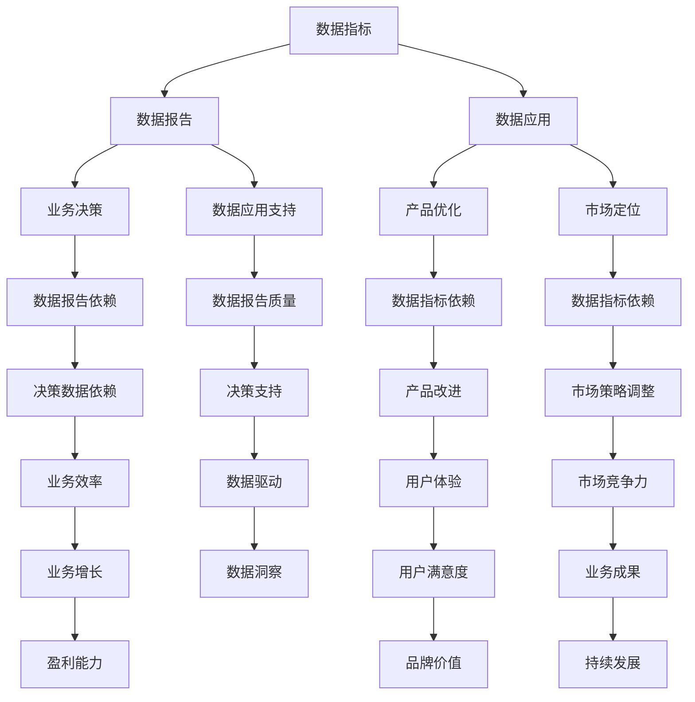

                 

# AI创业公司的产品数据分析与业务决策：数据指标、数据报告与数据应用

## 关键词
- AI创业公司
- 产品数据分析
- 数据指标
- 数据报告
- 业务决策
- 数据应用

## 摘要
本文将探讨AI创业公司如何通过产品数据分析与业务决策，实现数据指标的有效监控、数据报告的精准呈现以及数据应用的深入挖掘。我们将从数据指标的定义、选择与监控，数据报告的撰写方法，到数据应用的实战案例，进行全方位的剖析。本文旨在为AI创业公司的产品数据分析提供理论指导与实践参考，帮助企业在数据驱动的道路上迈出坚实的一步。

---

## 1. 背景介绍

### 1.1 目的和范围

本文旨在为AI创业公司在产品数据分析与业务决策方面提供指导，帮助公司通过数据驱动实现产品优化、市场定位和业务增长。文章将涵盖以下主要方面：

- 数据指标的定义与选择
- 数据报告的撰写与呈现
- 数据应用的实战案例
- 数据分析工具与资源推荐

### 1.2 预期读者

本文适合以下读者群体：

- AI创业公司的产品经理和数据分析师
- 数据科学和机器学习领域的从业者
- 对数据驱动业务决策感兴趣的技术人员

### 1.3 文档结构概述

本文结构如下：

- 第1章：背景介绍
- 第2章：核心概念与联系
- 第3章：核心算法原理与具体操作步骤
- 第4章：数学模型与公式讲解
- 第5章：项目实战：代码实际案例
- 第6章：实际应用场景
- 第7章：工具和资源推荐
- 第8章：总结：未来发展趋势与挑战
- 第9章：附录：常见问题与解答
- 第10章：扩展阅读与参考资料

### 1.4 术语表

#### 1.4.1 核心术语定义

- **数据指标**：用于衡量产品性能、用户行为和业务成果的关键指标。
- **数据报告**：以可视化方式展示数据指标和分析结果的文档。
- **数据应用**：将数据分析结果应用于业务决策和产品优化。
- **业务决策**：基于数据指标和报告的决策过程。

#### 1.4.2 相关概念解释

- **用户留存率**：衡量用户在一段时间内持续使用产品的比例。
- **转化率**：用户完成特定目标动作的比例，如注册、购买等。
- **客户生命周期价值**：客户在整个生命周期内为公司带来的总收益。

#### 1.4.3 缩略词列表

- **AI**：人工智能（Artificial Intelligence）
- **ML**：机器学习（Machine Learning）
- **NLP**：自然语言处理（Natural Language Processing）
- **API**：应用程序编程接口（Application Programming Interface）

---

在接下来的章节中，我们将深入探讨数据指标、数据报告和数据应用的相关原理和实战方法。希望本文能为您的AI创业公司提供有价值的参考和指导。让我们开始吧！

---

## 2. 核心概念与联系

在AI创业公司的产品数据分析中，理解核心概念和它们之间的联系是至关重要的。以下是对一些关键概念的介绍，以及它们如何相互作用的一个概述。

### 2.1 数据指标

数据指标是衡量产品性能、用户行为和业务成果的关键因素。常见的指标包括：

- **用户活跃度**：衡量用户使用产品的频率和时长。
- **用户留存率**：衡量用户在一段时间内持续使用产品的比例。
- **转化率**：衡量用户完成特定目标动作的比例，如注册、购买等。
- **客户生命周期价值**：衡量客户在整个生命周期内为公司带来的总收益。

### 2.2 数据报告

数据报告是以可视化方式展示数据指标和分析结果的文档。它可以帮助决策者快速理解数据，发现问题和机会。数据报告通常包括以下部分：

- **摘要**：简要概述关键指标和主要发现。
- **数据可视化**：使用图表、图形等展示数据。
- **详细分析**：深入分析数据指标的变化和趋势。

### 2.3 数据应用

数据应用是将数据分析结果应用于业务决策和产品优化的过程。数据应用可以包括以下方面：

- **产品优化**：根据用户行为数据优化产品功能和界面。
- **市场定位**：基于用户和市场需求数据调整市场策略。
- **业务决策**：利用数据分析结果做出更明智的业务决策。

### 2.4 数据指标与数据报告的关系

数据指标是数据报告的基础，而数据报告则是数据指标的综合体现。数据指标的选择和监控决定了数据报告的质量。一个有效的数据报告应该能够清晰、准确地展示数据指标，帮助决策者理解数据背后的含义。

### 2.5 数据报告与数据应用的关系

数据报告为业务决策提供了数据支持，而数据应用则是将数据报告转化为实际业务行动。通过数据报告，决策者可以识别问题、发现机会，并采取相应的措施。数据应用的有效性取决于数据报告的质量和决策者的业务理解能力。

### 2.6 数据指标与数据应用的关系

数据指标是数据应用的基础。通过对数据指标的监控和分析，公司可以了解产品的表现，识别潜在问题，并优化产品功能和用户体验。数据指标的数据应用包括但不限于：

- **用户留存策略**：根据用户留存率数据调整营销和用户服务策略。
- **产品改进**：根据用户活跃度数据优化产品功能和用户体验。
- **转化策略**：根据转化率数据调整网站和产品页面的设计，以提高转化率。

### 2.7 Mermaid 流程图

为了更直观地展示数据指标、数据报告和数据应用之间的关系，我们使用Mermaid流程图进行表示。



通过上述流程图，我们可以清晰地看到数据指标、数据报告和数据应用之间的紧密联系，以及它们对业务决策、产品优化和市场定位的影响。

---

在理解了数据指标、数据报告和数据应用的基本概念及其相互关系后，我们将在下一章节深入探讨核心算法原理和具体操作步骤，以帮助您更好地应用这些概念于实际业务中。敬请期待！

---

## 3. 核心算法原理 & 具体操作步骤

在AI创业公司的产品数据分析中，核心算法原理是理解和应用数据的关键。以下我们将详细介绍如何选择和监控数据指标，并给出具体的操作步骤。

### 3.1 数据指标选择

选择合适的数据指标是进行有效数据分析的第一步。以下是一些常用的数据指标及其选择依据：

- **用户活跃度**：衡量用户与产品的互动程度，如日活跃用户数（DAU）、月活跃用户数（MAU）。
  ```python
  def calculate_active_users(dau, mau):
      return dau + (mau - dau) * 0.5
  ```

- **用户留存率**：衡量用户在一定时间内持续使用产品的比例，如第一天留存率、一周留存率。
  ```python
  def calculate_retention_rate(day, users):
      return len([user for user in users if user['days'] >= day]) / len(users)
  ```

- **转化率**：衡量用户完成特定目标动作的比例，如注册转化率、购买转化率。
  ```python
  def calculate_conversion_rate(goal, users):
      return len([user for user in users if user['goal'] == goal]) / len(users)
  ```

- **客户生命周期价值**：衡量客户在整个生命周期内为公司带来的总收益，可通过历史数据计算得出。
  ```python
  def calculate_clv(revenue, cost_of_acquisition, churn_rate):
      return revenue / (1 - churn_rate) - cost_of_acquisition
  ```

### 3.2 数据指标监控

数据指标监控是确保数据分析结果准确性的关键。以下是一些监控数据指标的方法：

- **实时监控**：使用实时监控系统，如Prometheus、Grafana等，监控关键指标，及时发现异常。
  ```bash
  # 安装Prometheus和Grafana
  pip install prometheus-client
  pip install grafana-api-client

  # Prometheus监控示例
  from prometheus_client import Summary

  active_users = Summary('active_users', 'Number of active users')
  
  def monitor_active_users():
      active_users.observe(count)
  ```

- **周期性监控**：通过定期执行数据分析任务，如每天、每周或每月，监控关键指标，分析趋势。
  ```python
  import pandas as pd

  def monitor_user_retention(data, days):
      retention_rate = calculate_retention_rate(days, data)
      print(f"Retention rate for {days} days: {retention_rate}")
  ```

- **报警机制**：设置报警规则，当指标超出预期范围时，自动发送通知。
  ```python
  from prometheus_client import CollectorRegistry, Gauge

  registry = CollectorRegistry()
  retention_rate_gauge = Gauge('retention_rate', 'User retention rate')

  def update_retention_rate(rate):
      retention_rate_gauge.set(rate)
  ```

### 3.3 数据指标分析与优化

通过对数据指标的监控和分析，可以发现产品的问题和机会，进而进行优化。以下是一些优化策略：

- **提高用户留存率**：通过分析留存率数据，找出留存率较低的用户群体，制定针对性的留存策略。
  ```python
  def identify_low_retention_users(data, threshold):
      low_retention_users = [user for user in data if user['retention_rate'] < threshold]
      return low_retention_users
  ```

- **提高转化率**：通过分析转化率数据，找出影响转化的因素，优化产品功能和页面设计。
  ```python
  def analyze_conversion_rate(data, goal):
      conversion_rate = calculate_conversion_rate(goal, data)
      print(f"Conversion rate for {goal}: {conversion_rate}")
  ```

- **提高客户生命周期价值**：通过分析客户生命周期价值数据，找出高价值客户群体，提供定制化的服务和产品。
  ```python
  def identify_high_value_customers(data, clv_threshold):
      high_value_customers = [customer for customer in data if customer['clv'] > clv_threshold]
      return high_value_customers
  ```

### 3.4 实际操作步骤

以下是数据指标选择、监控和优化的实际操作步骤：

1. **定义数据指标**：根据业务需求和产品特点，定义关键的数据指标。
2. **数据收集**：从各个数据源收集相关数据，如日志、数据库等。
3. **数据清洗**：清洗和预处理数据，确保数据质量和完整性。
4. **数据监控**：使用实时监控系统和周期性分析任务，监控关键指标。
5. **数据优化**：通过分析数据，识别问题和机会，制定优化策略。
6. **执行优化**：根据优化策略，调整产品功能和用户体验。
7. **持续监控与迭代**：持续监控优化效果，不断迭代改进。

通过以上步骤，AI创业公司可以有效地进行产品数据分析与业务决策，实现数据驱动的业务增长。

---

在掌握了数据指标选择和监控的方法后，我们将在下一章节深入探讨数学模型和公式，以及如何详细讲解和举例说明。这将帮助您更好地理解和应用数据分析的核心理论。敬请期待！

---

## 4. 数学模型和公式 & 详细讲解 & 举例说明

在产品数据分析中，数学模型和公式是理解和解释数据的关键工具。以下我们将介绍几个常见的数学模型和公式，并进行详细讲解和举例说明。

### 4.1 用户留存率

用户留存率是衡量用户持续使用产品的关键指标。其计算公式如下：

\[ \text{留存率} = \frac{\text{特定天数后的活跃用户数}}{\\text{初始用户数}} \]

#### 详细讲解：

- **活跃用户数**：在特定天数后，仍然活跃使用产品的用户数量。
- **初始用户数**：在第一天开始使用产品的用户数量。

#### 举例说明：

假设一个产品在第一天有100个用户，第二天有80个用户保持活跃。那么，第二天的用户留存率为：

\[ \text{留存率} = \frac{80}{100} = 0.8 \]

即80%的用户在第二天仍然活跃使用产品。

### 4.2 转化率

转化率是衡量用户完成特定目标动作的比例。其计算公式如下：

\[ \text{转化率} = \frac{\text{完成目标动作的用户数}}{\\text{总用户数}} \]

#### 详细讲解：

- **完成目标动作的用户数**：在特定时间内，完成特定目标动作（如注册、购买等）的用户数量。
- **总用户数**：在特定时间内，使用产品的总用户数量。

#### 举例说明：

假设一个电商网站在一天内有1000个访问用户，其中有200个用户完成了购买。那么，购买转化率为：

\[ \text{转化率} = \frac{200}{1000} = 0.2 \]

即20%的用户完成了购买。

### 4.3 客户生命周期价值

客户生命周期价值（CLV）是衡量客户在整个生命周期内为公司带来的总收益。其计算公式如下：

\[ \text{CLV} = \frac{\text{历史购买总额}}{\text{客户生命周期}} \]

#### 详细讲解：

- **历史购买总额**：客户在一段时间内所花费的总金额。
- **客户生命周期**：客户从首次购买到停止购买的时间段。

#### 举例说明：

假设一个用户在一年内花费了1000元，而客户生命周期为3年。那么，该用户的CLV为：

\[ \text{CLV} = \frac{1000}{3} \approx 333.33 \]

即该用户每年为公司带来的收益约为333.33元。

### 4.4 费用分摊率

费用分摊率是衡量公司运营成本与收入之间关系的指标。其计算公式如下：

\[ \text{费用分摊率} = \frac{\text{运营成本}}{\text{总收入}} \]

#### 详细讲解：

- **运营成本**：公司运营产品的总成本，包括人力、硬件、软件等。
- **总收入**：公司从产品运营中获得的总收入。

#### 举例说明：

假设一个AI创业公司的运营成本为10万元，总收入为20万元。那么，费用分摊率为：

\[ \text{费用分摊率} = \frac{10}{20} = 0.5 \]

即运营成本占总收入的一半。

### 4.5 折旧率

折旧率是衡量公司固定资产价值减少的指标。其计算公式如下：

\[ \text{折旧率} = \frac{\text{折旧费用}}{\text{固定资产价值}} \]

#### 详细讲解：

- **折旧费用**：公司固定资产每年因使用而减少的价值。
- **固定资产价值**：公司的固定资产总价值。

#### 举例说明：

假设一个AI创业公司的固定资产价值为100万元，年折旧费用为5万元。那么，折旧率为：

\[ \text{折旧率} = \frac{5}{100} = 0.05 \]

即固定资产每年价值减少5%。

通过上述数学模型和公式的讲解和举例说明，我们可以更好地理解和应用这些工具在产品数据分析中的实际操作。这些模型和公式不仅帮助我们量化产品表现，还能为业务决策提供有力的支持。在下一章节中，我们将通过实际项目案例，进一步探讨这些模型和公式的应用。敬请期待！

---

## 5. 项目实战：代码实际案例和详细解释说明

为了更好地理解并应用前述的数学模型和公式，我们将通过一个实际的项目案例进行详细的讲解。该案例将演示如何搭建开发环境、编写源代码，并解读与分析代码。

### 5.1 开发环境搭建

在进行项目实战之前，我们需要搭建一个适合进行数据分析的编程环境。以下是基本的开发环境搭建步骤：

1. **安装Python环境**：Python是一种广泛用于数据分析的编程语言。你可以从Python官方网站（https://www.python.org/）下载并安装Python。
2. **安装Jupyter Notebook**：Jupyter Notebook是一个交互式的开发环境，可以方便地进行数据分析与展示。通过以下命令安装Jupyter Notebook：
   ```bash
   pip install notebook
   ```
3. **安装数据分析相关库**：安装用于数据处理和分析的库，如Pandas、NumPy、Matplotlib等。通过以下命令安装：
   ```bash
   pip install pandas numpy matplotlib
   ```
4. **安装可视化工具**：为了更好地展示分析结果，我们可以安装一些可视化库，如Seaborn、Plotly等。通过以下命令安装：
   ```bash
   pip install seaborn plotly
   ```

### 5.2 源代码详细实现和代码解读

以下是我们的实际项目代码，包括数据收集、清洗、分析和可视化等步骤。

```python
# 导入所需库
import pandas as pd
import numpy as np
import matplotlib.pyplot as plt
import seaborn as sns
from sklearn.linear_model import LinearRegression

# 数据收集与预处理
data = pd.read_csv('user_data.csv')
data['date'] = pd.to_datetime(data['date'])
data['day'] = data['date'].dt.day
data['week'] = data['date'].dt.week

# 用户活跃度分析
active_users = data.groupby(['day']).size().reset_index(name='count')
plt.figure(figsize=(10, 5))
sns.lineplot(x='day', y='count', data=active_users)
plt.title('Daily Active Users')
plt.xlabel('Day')
plt.ylabel('User Count')
plt.show()

# 用户留存率分析
retention_data = data.groupby(['day', 'user_id']).size().reset_index(name='count')
retention_data['days_since_first_login'] = retention_data.groupby('user_id')['day'].diff().fillna(0)
retention_rate = retention_data.groupby(['days_since_first_login']).size().reset_index(name='count')
plt.figure(figsize=(10, 5))
sns.lineplot(x='days_since_first_login', y='count', data=retention_rate)
plt.title('Retention Rate by Days Since First Login')
plt.xlabel('Days Since First Login')
plt.ylabel('User Count')
plt.show()

# 转化率分析
conversion_data = data[data['goal'] == 'purchase']
conversion_rate = conversion_data.groupby(['day']).size().reset_index(name='count')
plt.figure(figsize=(10, 5))
sns.lineplot(x='day', y='count', data=conversion_rate)
plt.title('Purchase Conversion Rate by Day')
plt.xlabel('Day')
plt.ylabel('Purchase Count')
plt.show()

# 客户生命周期价值分析
clv_data = data[data['goal'] == 'purchase']
clv_data['days_since_first_purchase'] = (clv_data['date'] - clv_data['first_purchase']).dt.days
clv_data['lifetime_value'] = clv_data['revenue'] / (1 - clv_data['churn_rate'])
plt.figure(figsize=(10, 5))
sns.scatterplot(x='days_since_first_purchase', y='lifetime_value', data=clv_data)
plt.title('Customer Lifetime Value by Days Since First Purchase')
plt.xlabel('Days Since First Purchase')
plt.ylabel('Lifetime Value')
plt.show()

# 线性回归分析
regression_data = clv_data[['days_since_first_purchase', 'lifetime_value']]
regression = LinearRegression().fit(regression_data[['days_since_first_purchase']], regression_data['lifetime_value'])
print(f"Model Coefficients: {regression.coef_}, Intercepts: {regression.intercept_}")

# 可视化回归结果
plt.figure(figsize=(10, 5))
sns.regplot(x='days_since_first_purchase', y='lifetime_value', data=regression_data)
plt.plot(regression_data['days_since_first_purchase'], regression.predict(regression_data[['days_since_first_purchase']]), color='red')
plt.title('Customer Lifetime Value Prediction by Days Since First Purchase')
plt.xlabel('Days Since First Purchase')
plt.ylabel('Lifetime Value')
plt.show()
```

### 5.3 代码解读与分析

以下是代码的逐行解读与分析：

1. **导入库**：导入Pandas、NumPy、Matplotlib、Seaborn和Sklearn等库，用于数据处理、分析和可视化。
2. **数据收集与预处理**：从CSV文件中读取用户数据，并设置日期列的数据类型。计算每天的用户活跃度，并绘制折线图。
3. **用户留存率分析**：根据用户的登录天数，计算留存率。绘制留存率随登录天数变化的折线图。
4. **转化率分析**：筛选出购买目标的数据，计算每天的购买数量。绘制转化率随天数变化的折线图。
5. **客户生命周期价值分析**：计算客户从首次购买到当前时间的天数和生命周期价值，绘制散点图。
6. **线性回归分析**：使用线性回归模型，预测客户生命周期价值与购买天数之间的关系。打印模型系数，并绘制回归结果图。

通过上述代码和解读，我们可以看到如何使用Python进行数据分析，并将分析结果可视化。这不仅帮助我们更好地理解产品性能，还能为业务决策提供数据支持。

---

在掌握了项目实战的代码实现和解读后，我们将在下一章节探讨实际应用场景。通过了解如何在各种业务场景中应用数据分析，您可以更好地实现数据驱动的发展。敬请期待！

---

## 6. 实际应用场景

数据分析在AI创业公司的产品开发与业务运营中具有广泛的应用。以下我们将探讨几个典型的实际应用场景，并详细说明如何利用数据分析来解决问题和推动业务增长。

### 6.1 用户行为分析

用户行为分析是产品数据分析的核心应用之一。通过分析用户在产品中的行为，公司可以深入了解用户需求，优化产品功能和用户体验。以下是一个用户行为分析的应用场景：

**应用场景**：一家AI创业公司开发了一款在线教育平台，希望提高用户的学习留存率和学习时长。

**数据分析步骤**：

1. **数据收集**：收集用户在平台上的行为数据，包括登录次数、浏览课程数、学习时长等。
2. **数据预处理**：清洗和转换数据，确保数据质量。
3. **用户活跃度分析**：计算每天、每周的活跃用户数，分析用户活跃度的变化趋势。
4. **留存率分析**：计算用户在连续几天内的留存率，识别留存率较低的用户群体。
5. **优化策略**：根据数据分析结果，优化课程推荐算法、推送通知机制，提高用户留存率和学习时长。

### 6.2 营销效果分析

营销效果分析是评估营销活动效果的关键。通过分析营销活动的投入产出比，公司可以优化营销策略，提高营销ROI。以下是一个营销效果分析的应用场景：

**应用场景**：一家AI创业公司正在进行新产品的市场推广，希望通过数据分析优化广告投放策略。

**数据分析步骤**：

1. **数据收集**：收集广告投放数据，包括广告投放平台、投放时间、投放费用、点击量、转化量等。
2. **数据预处理**：清洗和转换数据，确保数据质量。
3. **转化率分析**：计算不同广告平台的转化率，识别高转化的广告渠道。
4. **成本效益分析**：计算不同广告渠道的投入产出比，评估广告投放效果。
5. **优化策略**：根据数据分析结果，调整广告投放策略，提高广告投放ROI。

### 6.3 产品性能监控

产品性能监控是确保产品稳定运行的关键。通过监控产品性能指标，公司可以及时发现并解决潜在问题，提高产品稳定性。以下是一个产品性能监控的应用场景：

**应用场景**：一家AI创业公司开发了一款移动应用，希望确保应用的流畅运行和良好的用户体验。

**数据分析步骤**：

1. **数据收集**：收集应用的用户反馈数据，包括崩溃报告、性能数据等。
2. **数据预处理**：清洗和转换数据，确保数据质量。
3. **性能指标分析**：计算应用的加载时间、响应时间、内存使用等性能指标，分析性能表现。
4. **问题定位**：根据性能指标分析结果，定位潜在的性能瓶颈。
5. **优化策略**：根据问题定位结果，优化应用代码、调整资源分配，提高应用性能。

### 6.4 业务决策支持

业务决策支持是利用数据分析为业务决策提供科学依据。通过深入分析业务数据，公司可以做出更加明智的业务决策。以下是一个业务决策支持的应用场景：

**应用场景**：一家AI创业公司计划扩大产品线，希望通过数据分析评估不同产品的市场前景和盈利潜力。

**数据分析步骤**：

1. **数据收集**：收集现有产品的销售数据、用户反馈、市场趋势等。
2. **数据预处理**：清洗和转换数据，确保数据质量。
3. **市场分析**：分析市场趋势和用户需求，预测不同产品的市场需求。
4. **盈利预测**：计算不同产品的预计收入和成本，评估盈利潜力。
5. **决策支持**：根据数据分析结果，制定产品扩展策略，优化资源配置。

通过上述实际应用场景的介绍，我们可以看到数据分析在AI创业公司的产品开发、业务运营和业务决策中发挥着重要作用。利用数据分析，公司可以更好地理解用户需求，优化产品功能和用户体验，提高营销效果，确保产品稳定性，并做出更加明智的业务决策。在下一章节中，我们将推荐一些学习和资源，帮助您深入掌握数据分析技能。敬请期待！

---

## 7. 工具和资源推荐

在AI创业公司的产品数据分析过程中，选择合适的工具和资源至关重要。以下我们将推荐一些学习和资源，以及开发工具和框架，帮助您在数据分析的道路上更加顺畅。

### 7.1 学习资源推荐

#### 7.1.1 书籍推荐

1. **《Python数据分析》（Python for Data Analysis）**：由Wes McKinney所著，详细介绍Python在数据分析中的应用。
2. **《数据科学手册》（Hands-On Machine Learning with Scikit-Learn, Keras, and TensorFlow）**：由Aurélien Géron所著，涵盖数据科学的基本概念和实战技巧。
3. **《深入理解数据分析》（Deep Learning）**：由Ian Goodfellow、Yoshua Bengio和Aaron Courville所著，介绍深度学习在数据分析中的应用。

#### 7.1.2 在线课程

1. **Coursera上的《数据科学专业课程》**：包括《Python数据分析》、《机器学习》等多个课程，由全球顶尖大学提供。
2. **Udacity的《数据分析师纳米学位》**：通过实践项目学习数据收集、清洗、分析和可视化等技能。
3. **edX的《数据科学基础》**：由哈佛大学提供，涵盖数据科学的基本概念和实战应用。

#### 7.1.3 技术博客和网站

1. **Medium上的数据科学博客**：涵盖数据科学、机器学习、深度学习等多个领域的最新研究和实践。
2. **Kaggle**：一个大数据竞赛平台，提供丰富的数据集和实战项目，是数据科学爱好者学习的理想场所。
3. **GitHub**：一个代码托管平台，包含大量开源的数据分析项目和工具，是学习编程和数据分析的好去处。

### 7.2 开发工具框架推荐

#### 7.2.1 IDE和编辑器

1. **Jupyter Notebook**：一个交互式的开发环境，适合进行数据分析和可视化。
2. **Visual Studio Code**：一个轻量级且功能强大的代码编辑器，支持多种编程语言和扩展。
3. **PyCharm**：一个专业的Python IDE，提供代码补全、调试和性能分析等功能。

#### 7.2.2 调试和性能分析工具

1. **PyDebug**：一个Python调试工具，支持远程调试和断点设置。
2. **Pylint**：一个Python代码质量检测工具，帮助发现代码中的潜在问题和错误。
3. **cProfile**：一个Python性能分析工具，用于分析和优化代码性能。

#### 7.2.3 相关框架和库

1. **Pandas**：一个强大的数据分析库，用于数据处理、清洗和转换。
2. **NumPy**：一个基础的数值计算库，支持多维数组操作。
3. **Scikit-Learn**：一个机器学习库，提供多种机器学习算法和工具。
4. **TensorFlow**：一个开源的深度学习框架，支持构建和训练深度神经网络。
5. **Matplotlib**：一个用于绘制数据可视化图表的库。

#### 7.2.4 数据库推荐

1. **PostgreSQL**：一个开源的关系型数据库，支持复杂查询和事务处理。
2. **MongoDB**：一个开源的NoSQL数据库，适合处理大量结构化数据。
3. **Redis**：一个开源的高速缓存数据库，适用于实时数据处理和缓存。

通过上述工具和资源的推荐，您可以在数据分析的道路上更加高效地学习和实践。充分利用这些工具和资源，不仅可以提高数据分析的效率，还能为AI创业公司的业务决策提供有力的支持。在下一章节中，我们将探讨未来发展趋势与挑战，帮助您把握数据分析的未来。敬请期待！

---

## 8. 总结：未来发展趋势与挑战

随着人工智能和大数据技术的不断进步，产品数据分析和业务决策正朝着更加智能化、自动化和全面化的方向发展。以下我们将探讨未来数据分析和业务决策的发展趋势以及面临的挑战。

### 8.1 发展趋势

1. **智能化数据分析**：随着深度学习技术的不断发展，智能化数据分析将成为主流。通过引入深度学习模型，公司可以更准确地预测用户行为、优化产品功能和制定营销策略。

2. **自动化数据分析**：自动化数据分析工具和平台将逐步替代传统的手动数据分析流程，提高数据分析的效率和准确性。自动化数据分析将使得数据分析任务更加简单、便捷，为非技术人员提供数据洞察。

3. **数据隐私保护**：随着数据隐私问题的日益突出，数据隐私保护将成为未来数据分析的重要挑战。企业需要确保用户数据的安全性和隐私性，遵守相关法律法规，建立完善的隐私保护机制。

4. **实时数据分析**：实时数据分析技术将不断成熟，企业可以实时监控产品性能和用户行为，快速响应市场变化，提高业务决策的实时性和灵活性。

5. **跨领域融合**：数据分析将与其他领域（如物联网、区块链等）进行深度融合，为各行业带来全新的商业模式和创新机会。

### 8.2 面临的挑战

1. **数据质量**：数据质量是数据分析的基础，企业需要确保数据来源的准确性、完整性和一致性。数据质量问题可能导致分析结果的偏差，影响业务决策。

2. **数据隐私**：随着数据隐私问题的日益突出，企业需要妥善处理用户数据，保护用户隐私。数据隐私保护不仅涉及技术手段，还需要建立完善的隐私保护政策和法规。

3. **数据分析技能**：随着数据分析在企业和行业中的广泛应用，对数据分析人才的需求也越来越大。企业需要培养和吸引具备数据分析能力的专业人才，提高数据分析的整体水平。

4. **数据治理**：数据治理是确保数据安全、合规和有效利用的关键。企业需要建立完善的数据治理体系，确保数据的收集、存储、处理和使用符合法规和最佳实践。

5. **技术选型**：在众多的数据分析技术和工具中，企业需要选择适合自身业务需求的技术方案。技术选型的复杂性可能导致数据分析和业务决策的延误。

### 8.3 未来展望

未来，数据分析将继续在AI创业公司中发挥重要作用。企业需要不断探索和应用新的数据分析技术和方法，实现数据驱动的业务增长。同时，企业还需要关注数据隐私保护、数据质量、数据分析技能和数据治理等方面的挑战，确保数据分析的可持续发展和合规性。

通过不断学习和实践，AI创业公司将能够把握数据分析的未来发展趋势，克服面临的挑战，实现数据驱动的业务创新和增长。

---

在未来的数据分析旅程中，我们期待AI创业公司能够不断创新，充分利用数据分析的优势，实现业务的跨越式发展。在下一章节中，我们将提供一些常见问题与解答，帮助您更好地应对数据分析中的挑战。敬请期待！

---

## 9. 附录：常见问题与解答

### 9.1 数据指标相关问题

**Q1：如何选择合适的数据指标？**

A1：选择数据指标时，应考虑以下因素：

- **业务目标**：根据业务目标确定需要监控的关键指标，确保指标与业务目标紧密相关。
- **数据可用性**：确保所需的数据指标在现有数据源中可以获取。
- **可操作性**：选择易于监控和操作的数据指标，以便快速响应业务需求。

**Q2：如何处理缺失数据？**

A2：处理缺失数据的方法包括：

- **删除缺失值**：适用于缺失值较多的情况，可以减少数据误差。
- **填补缺失值**：可以使用平均值、中位数或使用模型预测填补缺失值。
- **插值法**：适用于时间序列数据，可以使用线性插值或曲线插值等方法。

### 9.2 数据报告相关问题

**Q1：如何编写有效的数据报告？**

A1：编写有效的数据报告应注意以下几点：

- **清晰的结构**：数据报告应包含摘要、数据可视化、详细分析和结论等部分，结构清晰，便于阅读。
- **可视化**：使用图表、图形等可视化工具，使数据更加直观易懂。
- **简洁明了**：避免冗长的文字描述，用简洁的语言表达关键信息。

**Q2：数据报告应包含哪些内容？**

A2：数据报告通常包括以下内容：

- **摘要**：简要概述报告的主要发现和结论。
- **数据可视化**：展示关键数据指标的图表、图形等。
- **详细分析**：深入分析数据指标的变化、趋势和异常。
- **结论**：总结分析结果，提出业务建议。

### 9.3 数据应用相关问题

**Q1：如何将数据分析结果应用于业务决策？**

A1：将数据分析结果应用于业务决策的方法包括：

- **基于数据的优化**：根据数据分析结果，调整产品功能和用户体验，提高业务效率。
- **基于数据的决策**：利用数据分析结果，支持业务决策，如市场定位、资源配置等。
- **基于数据的预测**：通过数据分析，预测业务发展趋势和潜在风险，提前制定应对策略。

**Q2：如何评估数据分析的有效性？**

A2：评估数据分析的有效性可以从以下几个方面进行：

- **业务成果**：分析数据应用后，业务成果是否得到显著改善。
- **用户反馈**：收集用户对数据应用效果的反馈，了解用户满意度。
- **数据指标**：监控相关数据指标的变化，评估数据应用效果。

---

通过上述常见问题与解答，我们希望能够帮助您更好地应对数据分析和业务决策中的挑战。在数据分析的道路上，不断学习与实践是关键。希望这些问题与解答能够为您提供有价值的参考。在下一章节中，我们将推荐一些扩展阅读与参考资料，供您进一步学习。敬请期待！

---

## 10. 扩展阅读 & 参考资料

为了帮助您更深入地了解AI创业公司的产品数据分析与业务决策，以下推荐一些扩展阅读与参考资料，涵盖相关书籍、在线课程、技术博客和相关论文，以供您参考。

### 10.1 书籍推荐

1. **《数据科学实战》（Data Science from Scratch）**：由Joel Grus所著，适合初学者了解数据科学的基本概念和实践。
2. **《数据挖掘：实用机器学习技术》（Data Mining: Practical Machine Learning Tools and Techniques）**：由Ian H. Witten和Eibe Frank所著，介绍数据挖掘的基础知识和实用技巧。
3. **《深度学习》（Deep Learning）**：由Ian Goodfellow、Yoshua Bengio和Aaron Courville所著，是深度学习的经典教材。

### 10.2 在线课程

1. **《数据科学专业课程》（Data Science Specialization）**：由Coursera提供，包括多个课程，涵盖数据科学的基础知识、机器学习和数据可视化等。
2. **《机器学习工程师纳米学位》（Machine Learning Engineer Nanodegree）**：由Udacity提供，涵盖机器学习、深度学习和数据分析等实战项目。
3. **《数据科学基础》（Introduction to Data Science）**：由edX提供，由哈佛大学提供课程，适合初学者了解数据科学的基本概念。

### 10.3 技术博客和网站

1. **《数据科学博客》（Data Science Blog）**：涵盖数据科学、机器学习和深度学习的最新研究和实践。
2. **《Kaggle博客》（Kaggle Blog）**：Kaggle官方博客，分享数据科学竞赛和实战项目的经验。
3. **《Medium上的数据科学文章》（Data Science on Medium）**：众多数据科学从业者的分享，涵盖数据分析、机器学习和深度学习的多个领域。

### 10.4 相关论文

1. **“Learning Deep Features for Discriminative Localization”（2016）**：该论文介绍了深度学习在目标检测中的应用。
2. **“User Behavior Analysis for Online Education”（2019）**：该论文研究了在线教育平台中的用户行为分析。
3. **“Customer Lifetime Value: A Practical Guide to Predicting Customer Value”（2017）**：该论文详细介绍了客户生命周期价值的计算方法和应用。

### 10.5 其他资源

1. **《Python数据分析手册》（Python Data Analysis Library Documentation）**：Python数据分析库Pandas的官方文档，详细介绍了Pandas的使用方法和功能。
2. **《Scikit-Learn文档》（Scikit-Learn Documentation）**：Scikit-Learn官方文档，提供了丰富的机器学习算法和工具。
3. **《TensorFlow文档》（TensorFlow Documentation）**：TensorFlow官方文档，介绍了TensorFlow的使用方法和深度学习模型构建。

通过这些扩展阅读与参考资料，您可以深入了解产品数据分析与业务决策的相关理论和实践，提升自己在数据分析领域的能力。希望这些资源能够帮助您在数据分析的道路上不断前行。祝您学习愉快！

