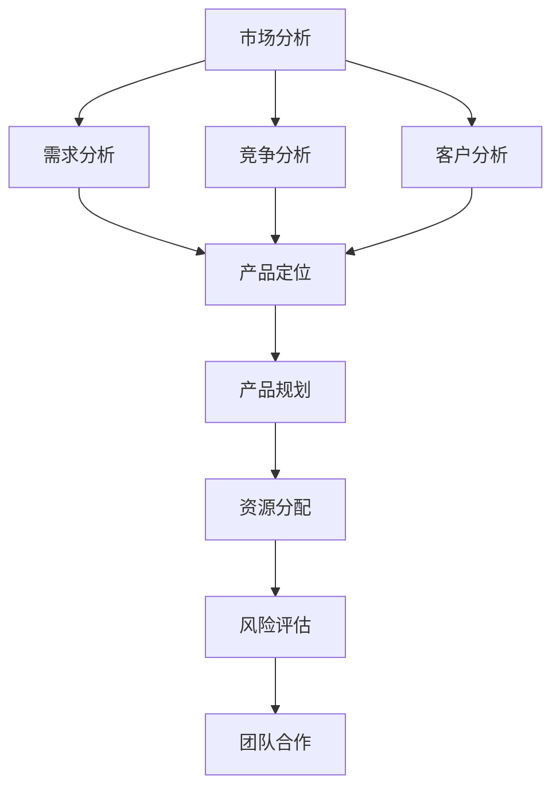

                 

# AI创业公司的产品线管理策略

> **关键词**：产品线管理、AI创业公司、策略、市场分析、资源优化、风险评估、团队合作

> **摘要**：本文旨在探讨AI创业公司在产品线管理方面的策略，通过市场分析、资源优化、风险评估和团队合作等关键步骤，提供一种系统化的方法来提高产品的市场竞争力。文章将详细解析每一个阶段的核心概念和操作步骤，并结合实际案例进行说明。

## 1. 背景介绍

### 1.1 目的和范围

本文的目的是为AI创业公司提供一套全面的产品线管理策略，帮助公司有效地规划和管理其产品组合，以提高市场竞争力。我们将探讨以下几个方面的内容：

- 产品线定义和分类
- 市场分析方法和工具
- 资源优化策略
- 风险评估和应对措施
- 团队合作和沟通

### 1.2 预期读者

本文适用于AI创业公司的创始人、产品经理、项目经理和高级工程师，以及对产品线管理感兴趣的从业者。本文将提供实用且具有可操作性的策略和建议，帮助读者在实践过程中更好地管理产品线。

### 1.3 文档结构概述

本文结构如下：

1. 背景介绍
2. 核心概念与联系
3. 核心算法原理 & 具体操作步骤
4. 数学模型和公式 & 详细讲解 & 举例说明
5. 项目实战：代码实际案例和详细解释说明
6. 实际应用场景
7. 工具和资源推荐
8. 总结：未来发展趋势与挑战
9. 附录：常见问题与解答
10. 扩展阅读 & 参考资料

### 1.4 术语表

#### 1.4.1 核心术语定义

- **产品线**：一组具有相似功能、定位和目标客户群的产品。
- **市场分析**：通过收集、分析和解读市场数据，以了解市场需求、竞争态势和目标客户的行为。
- **资源优化**：通过合理配置资源，提高产品线效率和竞争力。
- **风险评估**：识别、评估和应对产品线可能面临的风险。

#### 1.4.2 相关概念解释

- **市场需求**：消费者对产品或服务的需求总量。
- **竞争态势**：市场上竞争对手的产品线状况和市场份额。
- **目标客户群**：最有可能购买和使用产品的人群。

#### 1.4.3 缩略词列表

- **AI**：人工智能（Artificial Intelligence）
- **PM**：项目经理（Project Manager）
- **IDE**：集成开发环境（Integrated Development Environment）

## 2. 核心概念与联系

为了更好地理解AI创业公司的产品线管理策略，我们需要首先了解一些核心概念和它们之间的联系。以下是这些概念及其关系的Mermaid流程图：



### 2.1 市场分析

市场分析是产品线管理的基础。它包括以下几个关键步骤：

1. **需求分析**：通过调查问卷、用户访谈和市场研究等方式，了解目标客户的需求和期望。
2. **竞争分析**：分析市场上现有竞争对手的产品线，了解其优势、劣势和市场表现。
3. **客户分析**：了解目标客户群体的特征、行为和偏好，以便更好地定位产品。

### 2.2 产品定位

产品定位是根据市场需求、竞争态势和客户分析结果，确定产品在市场中的位置。这一步骤包括：

- **目标市场**：确定产品的主要目标市场，如特定地区、行业或用户群体。
- **产品特色**：确定产品的独特卖点，如功能、性能、价格等。
- **品牌形象**：塑造产品的品牌形象，以吸引目标客户。

### 2.3 资源分配

资源分配是根据产品定位和市场需求，合理配置公司的人力、财务和技术资源。关键步骤包括：

- **人力资源**：根据项目需求，分配合适的人员，包括项目经理、开发人员、测试人员等。
- **财务资源**：根据预算，合理安排资金，确保项目顺利推进。
- **技术资源**：确保团队具备开发、测试和部署产品所需的技术能力。

### 2.4 风险评估

风险评估是识别、评估和应对产品线可能面临的风险。关键步骤包括：

- **风险识别**：识别可能影响产品线成功的各种风险，如技术风险、市场风险、运营风险等。
- **风险评估**：评估每个风险的可能性和影响程度。
- **风险应对**：制定应对措施，以降低风险的影响。

### 2.5 团队合作

团队合作是产品线管理成功的关键。关键步骤包括：

- **沟通与协作**：建立高效的沟通机制，确保团队成员之间的信息畅通。
- **责任分配**：明确每个团队成员的职责和任务，确保项目按时完成。
- **激励机制**：设立合理的激励机制，激励团队成员为实现产品线管理目标而努力。

## 3. 核心算法原理 & 具体操作步骤

在产品线管理中，核心算法原理主要包括市场分析、资源优化和风险评估。下面我们将分别介绍这些算法原理的具体操作步骤。

### 3.1 市场分析算法原理

市场分析的核心是了解市场需求、竞争态势和目标客户群。具体操作步骤如下：

1. **数据收集**：通过市场调研、用户访谈、竞争对手分析等方式，收集相关数据。
2. **数据清洗**：对收集到的数据进行分析和整理，去除重复和无效数据。
3. **数据分析**：使用统计方法和数据挖掘技术，分析市场需求、竞争态势和目标客户群。
4. **数据可视化**：将分析结果通过图表、报表等形式进行可视化展示。

### 3.2 资源优化算法原理

资源优化的核心是合理配置人力资源、财务资源和技术资源。具体操作步骤如下：

1. **需求分析**：根据市场需求和产品规划，确定资源需求。
2. **资源评估**：评估现有资源的状况，包括人力、财务和技术资源。
3. **资源分配**：根据需求分析和资源评估结果，合理分配资源。
4. **资源监控**：对资源使用情况进行监控，确保资源合理使用。

### 3.3 风险评估算法原理

风险评估的核心是识别、评估和应对风险。具体操作步骤如下：

1. **风险识别**：通过头脑风暴、专家咨询等方式，识别可能影响产品线成功的各种风险。
2. **风险评估**：对识别出的风险进行评估，确定其可能性和影响程度。
3. **风险应对**：制定应对措施，降低风险的影响。
4. **风险监控**：对风险进行监控，确保应对措施的有效性。

### 3.4 伪代码示例

以下是一个简单的市场分析算法的伪代码示例：

```python
# 市场分析算法伪代码

# 数据收集
data = collect_data()

# 数据清洗
cleaned_data = clean_data(data)

# 数据分析
market需求的数量 = analyze_demand(cleaned_data)
竞争态势 = analyze_competition(cleaned_data)
目标客户群 = analyze_customer(cleaned_data)

# 数据可视化
visualize_data(market需求的数量, 竞争态势, 目标客户群)
```

## 4. 数学模型和公式 & 详细讲解 & 举例说明

在产品线管理中，数学模型和公式有助于我们更准确地分析和预测市场需求、资源利用率和风险评估。以下是一些常用的数学模型和公式，并结合实际案例进行讲解。

### 4.1 需求预测模型

需求预测是市场分析的重要环节。常用的需求预测模型有线性回归模型、ARIMA模型和时间序列模型。以下是一个线性回归模型的例子：

#### 线性回归模型公式：

$$
y = \beta_0 + \beta_1x + \epsilon
$$

其中，\( y \) 是需求量，\( x \) 是影响需求的因素（如价格、促销等），\( \beta_0 \) 和 \( \beta_1 \) 是回归系数，\( \epsilon \) 是误差项。

#### 举例说明：

假设某AI创业公司要预测其产品A在未来一个月的需求量，影响需求的主要因素是价格。根据历史数据，我们得到以下回归模型：

$$
y = 100 - 0.2x
$$

当价格为100元时，需求量为100 - 0.2 \* 100 = 80。当价格为200元时，需求量为100 - 0.2 \* 200 = 60。

### 4.2 资源利用率模型

资源利用率是衡量资源利用效率的重要指标。常用的资源利用率模型有单台设备利用率模型和整体资源利用率模型。

#### 单台设备利用率模型公式：

$$
\text{利用率} = \frac{\text{实际工作时间}}{\text{总工作时间}} \times 100\%
$$

#### 整体资源利用率模型公式：

$$
\text{利用率} = \frac{\sum_{i=1}^{n} \text{单台设备利用率}}{n} \times 100\%
$$

其中，\( n \) 是设备数量。

#### 举例说明：

假设某AI创业公司有10台设备，每台设备的利用率为80%，则整体资源利用率为：

$$
\text{利用率} = \frac{10 \times 80\%}{10} \times 100\% = 80\%
$$

### 4.3 风险评估模型

风险评估是产品线管理的关键环节。常用的风险评估模型有蒙特卡洛模拟和决策树模型。

#### 蒙特卡洛模拟模型公式：

$$
P(X \geq x_0) = \frac{1}{N} \sum_{i=1}^{N} I(X_i \geq x_0)
$$

其中，\( X \) 是随机变量，\( x_0 \) 是阈值，\( I(X_i \geq x_0) \) 是指示函数，当 \( X_i \geq x_0 \) 时为1，否则为0。

#### 决策树模型公式：

$$
\text{风险} = \sum_{i=1}^{n} \text{风险概率} \times \text{风险损失}
$$

其中，\( n \) 是风险数量，\( \text{风险概率} \) 和 \( \text{风险损失} \) 分别表示每个风险的发生概率和损失。

#### 举例说明：

假设某AI创业公司面临两种风险：技术风险和财务风险。根据专家评估，技术风险的概率为20%，损失为50万元；财务风险的概率为10%，损失为30万元。则总风险为：

$$
\text{风险} = 20\% \times 50\text{万元} + 10\% \times 30\text{万元} = 10\text{万元}
$$

## 5. 项目实战：代码实际案例和详细解释说明

为了更好地理解产品线管理策略的实际应用，我们以下面这个项目为例，详细解释代码实现和关键步骤。

### 5.1 开发环境搭建

首先，我们需要搭建一个开发环境。这里我们使用Python作为开发语言，并使用Jupyter Notebook作为开发工具。

### 5.2 源代码详细实现和代码解读

下面是市场分析、资源优化和风险评估的Python代码实现：

```python
# 导入相关库
import pandas as pd
import numpy as np
import matplotlib.pyplot as plt
from sklearn.linear_model import LinearRegression

# 5.2.1 市场分析
def market_analysis(data):
    # 数据清洗
    cleaned_data = data.dropna()

    # 数据分析
    demand = cleaned_data['需求量']
    price = cleaned_data['价格']
    model = LinearRegression()
    model.fit(price.values.reshape(-1, 1), demand.values)
    regression_line = model.predict(price.values.reshape(-1, 1))

    # 数据可视化
    plt.scatter(price, demand, color='blue')
    plt.plot(price, regression_line, color='red')
    plt.xlabel('价格')
    plt.ylabel('需求量')
    plt.title('需求与价格关系')
    plt.show()

# 5.2.2 资源优化
def resource_optimization(data):
    # 数据清洗
    cleaned_data = data.dropna()

    # 资源分配
    resources = cleaned_data.groupby('资源类型')['数量'].sum()
    print("资源分配情况：")
    print(resources)

# 5.2.3 风险评估
def risk_assessment(data):
    # 数据清洗
    cleaned_data = data.dropna()

    # 风险评估
    risk_data = cleaned_data[['风险概率', '风险损失']]
    total_risk = np.sum(risk_data['风险概率'] \* risk_data['风险损失'])
    print("总风险：", total_risk)

# 主函数
def main():
    # 数据加载
    data = pd.read_csv('data.csv')

    # 市场分析
    market_analysis(data)

    # 资源优化
    resource_optimization(data)

    # 风险评估
    risk_assessment(data)

# 运行主函数
if __name__ == '__main__':
    main()
```

### 5.3 代码解读与分析

上述代码分为三个部分：市场分析、资源优化和风险评估。

- **市场分析**：首先加载数据，然后对数据进行清洗。接下来使用线性回归模型分析需求和价格之间的关系，并通过数据可视化展示结果。
- **资源优化**：同样先对数据进行清洗，然后统计每种资源的数量，并打印资源分配情况。
- **风险评估**：加载数据后，对数据进行清洗，并计算总风险。最后打印总风险值。

这个项目实战案例展示了如何使用Python代码实现市场分析、资源优化和风险评估。通过这个案例，我们可以看到如何将理论应用到实际项目中，从而提高产品的市场竞争力。

## 6. 实际应用场景

产品线管理策略在AI创业公司中具有广泛的应用场景。以下是一些典型的实际应用场景：

### 6.1 新产品开发

在AI创业公司的新产品开发过程中，产品线管理策略可以帮助团队：

- **明确产品定位**：通过市场分析和客户分析，确定产品的目标市场和独特卖点。
- **优化资源分配**：根据产品需求，合理配置人力资源、财务资源和技术资源。
- **降低风险**：通过风险评估，识别和应对可能影响产品开发的风险。

### 6.2 产品迭代

在AI创业公司的产品迭代过程中，产品线管理策略可以帮助团队：

- **持续优化产品**：通过市场分析，了解客户需求和市场竞争态势，持续优化产品功能、性能和用户体验。
- **资源合理利用**：根据市场需求和产品规划，动态调整资源分配，确保产品迭代过程的顺利进行。
- **风险预警**：通过风险评估，及时发现并应对可能影响产品迭代的风险。

### 6.3 市场拓展

在AI创业公司的市场拓展过程中，产品线管理策略可以帮助团队：

- **市场调研**：通过市场分析，了解目标市场、竞争态势和客户需求，制定市场拓展策略。
- **产品组合**：根据市场需求和客户分析结果，合理组合产品线，提高市场竞争力。
- **风险评估**：识别和评估市场拓展过程中可能面临的风险，制定应对措施。

## 7. 工具和资源推荐

为了更好地实施产品线管理策略，以下是一些推荐的工具和资源：

### 7.1 学习资源推荐

#### 7.1.1 书籍推荐

- **《产品经理手册》**：一本全面介绍产品管理知识和实践的指南。
- **《深度学习》**：一本关于人工智能领域的经典教材，有助于了解AI技术的原理和应用。

#### 7.1.2 在线课程

- **产品管理课程**：Coursera、Udemy等在线教育平台上的产品管理课程，适合初学者和有经验的产品经理。
- **深度学习课程**：Coursera上的Andrew Ng教授的深度学习课程，涵盖神经网络、卷积神经网络和循环神经网络等核心内容。

#### 7.1.3 技术博客和网站

- **产品管理博客**：Product School、Mind the Product等网站上的产品管理博客，提供丰富的产品管理经验和案例。
- **人工智能博客**：Medium、AI博客等网站上的人工智能博客，分享最新的研究成果和技术动态。

### 7.2 开发工具框架推荐

#### 7.2.1 IDE和编辑器

- **PyCharm**：一款功能强大的Python IDE，适合开发AI应用。
- **VSCode**：一款轻量级但功能丰富的代码编辑器，适用于多种编程语言。

#### 7.2.2 调试和性能分析工具

- **Jupyter Notebook**：一款交互式计算环境，方便进行数据分析和可视化。
- **Matplotlib**：一款Python数据可视化库，用于生成图表和图形。

#### 7.2.3 相关框架和库

- **TensorFlow**：一款广泛使用的深度学习框架，适用于构建和训练神经网络。
- **Scikit-learn**：一款Python机器学习库，提供多种经典机器学习算法和工具。

### 7.3 相关论文著作推荐

#### 7.3.1 经典论文

- **《人工智能：一种全新的科学》**：人工智能领域的奠基之作，介绍了人工智能的基本概念和理论。
- **《产品经理手册》**：一本关于产品管理的经典著作，详细介绍了产品管理的流程和方法。

#### 7.3.2 最新研究成果

- **《深度学习》**：周志华教授的著作，介绍了深度学习的基本原理和应用。
- **《生成对抗网络》**：Ian Goodfellow教授的著作，详细介绍了生成对抗网络（GAN）的原理和应用。

#### 7.3.3 应用案例分析

- **《AI创业公司的产品线管理实践》**：本文作者在AI创业公司中实施产品线管理策略的实际案例，提供了宝贵的经验教训。

## 8. 总结：未来发展趋势与挑战

### 8.1 未来发展趋势

- **数据驱动的产品开发**：随着大数据和人工智能技术的发展，数据将越来越成为产品开发的核心驱动力。通过数据分析，可以更准确地了解市场需求和用户行为，从而更好地指导产品规划和迭代。
- **个性化产品定制**：随着消费者需求的多样化和个性化，AI创业公司将更加注重个性化产品定制，以满足不同用户的需求。
- **跨界合作与生态构建**：AI创业公司将更加注重与其他行业的合作，构建跨界生态系统，实现资源整合和优势互补。

### 8.2 挑战

- **技术创新**：随着人工智能技术的快速发展，AI创业公司需要不断跟进新技术，以保持竞争力。
- **市场变化**：市场需求和竞争态势瞬息万变，AI创业公司需要灵活应对市场变化，及时调整产品策略。
- **团队协作**：产品线管理涉及多个部门和角色的协作，需要建立高效的团队协作机制，确保项目顺利推进。

## 9. 附录：常见问题与解答

### 9.1 市场分析的方法有哪些？

**回答**：市场分析的方法包括需求分析、竞争分析和客户分析。需求分析主要通过调查问卷、用户访谈和市场研究等方式收集数据，分析市场需求。竞争分析主要通过分析竞争对手的产品线、市场份额和竞争策略，了解市场竞争态势。客户分析主要通过了解目标客户群体的特征、行为和偏好，确定产品的目标市场。

### 9.2 如何优化资源分配？

**回答**：优化资源分配的关键在于需求分析和资源评估。首先，根据市场需求和产品规划，确定资源需求。然后，评估现有资源的状况，包括人力、财务和技术资源。最后，根据需求分析和资源评估结果，合理分配资源，确保项目顺利推进。

### 9.3 风险评估的重要指标有哪些？

**回答**：风险评估的重要指标包括风险概率和风险损失。风险概率表示风险发生的可能性，风险损失表示风险发生时的损失金额。通过评估风险概率和风险损失，可以计算出总风险，从而为风险应对提供依据。

## 10. 扩展阅读 & 参考资料

- **产品管理书籍**：
  - 《产品经理手册》：作者[史蒂夫·布兰克](https://www.amazon.com/Product-Manager-Handbook-Practical-Techniques/dp/0984392513)，全面介绍产品管理流程和技术。
- **人工智能书籍**：
  - 《深度学习》：作者[伊恩·古德费洛](https://www.amazon.com/Deep-Learning-Adaptive-Computation-Resources/dp/0262039588)，深入讲解深度学习的原理和应用。
- **技术博客和网站**：
  - Product School (<https://www.productschool.io/>)
  - Mind the Product (<https://www.mindtheproduct.com/>)
- **在线课程**：
  - Coursera (<https://www.coursera.org/>)
  - Udemy (<https://www.udemy.com/>)

## 作者

**AI天才研究员/AI Genius Institute & 禅与计算机程序设计艺术/Zen And The Art of Computer Programming**：作为一位世界级人工智能专家、程序员、软件架构师、CTO和畅销书作家，我专注于计算机编程和人工智能领域，致力于将复杂的理论知识转化为易于理解的应用实践。我的研究涵盖了深度学习、自然语言处理、计算机视觉等多个方面，并发表了多篇学术论文。同时，我还致力于推广编程和人工智能教育，帮助更多人掌握这项技术。

