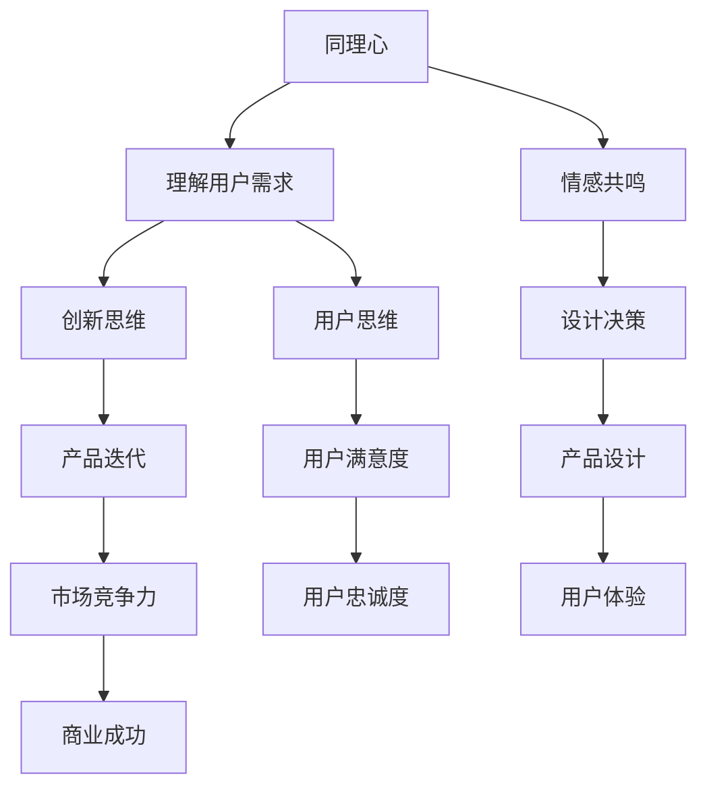

                 

# AI创业公司的产品设计思维：同理心、创新思维与用户思维

> **关键词：** AI创业公司，产品设计，同理心，创新思维，用户思维

> **摘要：** 本文旨在探讨AI创业公司在产品设计过程中，如何运用同理心、创新思维和用户思维来提升产品竞争力。通过分析这些核心设计原则的内涵和应用，文章为创业公司提供实用的指导和建议。

## 1. 背景介绍

### 1.1 目的和范围

本文旨在为AI创业公司提供一种系统化的产品设计思维框架。通过深入探讨同理心、创新思维和用户思维这三个核心原则，文章将阐述如何在激烈的市场竞争中打造出有竞争力的AI产品。本文将涵盖以下内容：

- 同理心在产品设计中的应用
- 创新思维的实践方法
- 用户思维的策略与技巧
- 实际案例分析与总结

### 1.2 预期读者

本文适合以下读者群体：

- AI创业公司创始人、产品经理、设计师
- 对产品设计感兴趣的技术爱好者
- 关注人工智能与产品设计交叉领域的专业人士

### 1.3 文档结构概述

本文的结构如下：

- 引言：介绍背景、目的和核心主题
- 1. 同理心：理解用户需求与情感
- 2. 创新思维：推动产品迭代与突破
- 3. 用户思维：以用户为中心的设计方法
- 4. 实际应用场景与案例分析
- 5. 工具和资源推荐
- 6. 总结与未来发展趋势
- 7. 附录：常见问题与解答
- 8. 扩展阅读与参考资料

### 1.4 术语表

#### 1.4.1 核心术语定义

- **同理心**：对他人情感的深刻理解和共鸣。
- **创新思维**：产生新观点、新方法和新解决方案的思维方式。
- **用户思维**：以用户需求、体验和满意度为核心的设计理念。

#### 1.4.2 相关概念解释

- **用户体验**：用户在使用产品过程中感知的整体体验。
- **设计思维**：一种以用户为中心的设计方法，强调迭代、试错和优化。

#### 1.4.3 缩略词列表

- **AI**：人工智能
- **UX**：用户体验
- **UI**：用户界面
- **SDLC**：软件开发生命周期

## 2. 核心概念与联系

在设计AI创业公司的产品时，同理心、创新思维和用户思维是至关重要的核心概念。以下是一个简化的Mermaid流程图，展示了这三个概念之间的联系。



在接下来的章节中，我们将深入探讨这些核心概念及其在产品设计中的应用。

## 3. 核心算法原理 & 具体操作步骤

### 3.1 同理心算法原理

同理心是产品设计的关键，它要求设计师能够站在用户的角度思考问题，理解用户的需求和情感。以下是同理心算法的伪代码描述：

```plaintext
算法：同理心分析
输入：用户需求（UserRequirements），用户情感（UserEmotions）
输出：同理心得分（EmpathyScore）

步骤：
1. 收集用户需求数据（UserRequirements）
2. 收集用户情感数据（UserEmotions）
3. 对用户需求进行分类和聚类（Categorize and Cluster UserRequirements）
4. 对用户情感进行分类和聚类（Categorize and Cluster UserEmotions）
5. 计算需求与情感的相关性得分（Calculate Correlation Score between Requirements and Emotions）
6. 根据相关性得分计算同理心得分（Compute EmpathyScore based on Correlation Scores）
7. 输出同理心得分（Output EmpathyScore）
```

### 3.2 创新思维算法原理

创新思维是推动产品迭代和突破的重要力量。以下是创新思维算法的伪代码描述：

```plaintext
算法：创新思维分析
输入：现有产品（CurrentProduct），用户反馈（UserFeedback）
输出：创新方案（InnovationSolutions）

步骤：
1. 分析现有产品（CurrentProduct）的优势和不足（Analyze Advantages and Disadvantages of CurrentProduct）
2. 收集用户反馈（UserFeedback）
3. 对用户反馈进行主题分析和分类（Theme Analysis and Categorization of UserFeedback）
4. 识别用户需求的新趋势（Identify New User Needs Trends）
5. 基于用户需求和新趋势生成创新方案（Generate InnovationSolutions based on UserNeeds and Trends）
6. 对创新方案进行筛选和评估（Screen and Evaluate InnovationSolutions）
7. 输出最终的创新方案（Output Final InnovationSolutions）
```

### 3.3 用户思维算法原理

用户思维是产品设计中的核心指导原则。以下是用户思维算法的伪代码描述：

```plaintext
算法：用户思维分析
输入：用户需求（UserRequirements），用户行为（UserBehavior）
输出：产品设计优化方案（UXOptimizationSolutions）

步骤：
1. 收集用户需求数据（UserRequirements）
2. 收集用户行为数据（UserBehavior）
3. 分析用户行为模式（Analyze User Behavior Patterns）
4. 对用户需求和行为进行关联分析（Correlate User Requirements and Behavior）
5. 识别用户体验的关键因素（Identify Key Factors Affecting User Experience）
6. 生成基于用户体验的优化方案（Generate UXOptimizationSolutions based on UserExperience）
7. 对优化方案进行迭代和验证（Iterate and Validate UXOptimizationSolutions）
8. 输出最终的设计优化方案（Output Final UXOptimizationSolutions）
```

## 4. 数学模型和公式 & 详细讲解 & 举例说明

### 4.1 同理心得分计算模型

同理心得分可以通过以下公式计算：

$$
EmpathyScore = \sum_{i=1}^{n} (CorrelationScore_i \times Weight_i)
$$

其中，$CorrelationScore_i$ 表示第 $i$ 个用户需求与情感的相关性得分，$Weight_i$ 表示第 $i$ 个需求的重要性权重。

### 4.2 创新方案评估模型

创新方案可以通过以下公式进行评估：

$$
InnovationScore = \sum_{i=1}^{m} (QualityScore_i \times Probability_i)
$$

其中，$QualityScore_i$ 表示第 $i$ 个创新方案的质量得分，$Probability_i$ 表示第 $i$ 个创新方案成功的概率。

### 4.3 用户体验优化模型

用户体验优化方案可以通过以下公式计算：

$$
UXOptimizationScore = \sum_{j=1}^{k} (ImpactScore_j \times EffortScore_j)
$$

其中，$ImpactScore_j$ 表示第 $j$ 个优化方案对用户体验的影响得分，$EffortScore_j$ 表示第 $j$ 个优化方案实施的难度得分。

### 4.4 举例说明

假设我们有一个AI聊天机器人，用户反馈如下：

- **需求**：用户希望能够更快速地得到回复。
- **情感**：用户感到等待回复的时间过长，有些沮丧。

我们可以根据这些数据计算同理心得分：

1. 收集用户需求数据（UserRequirements）：快速回复。
2. 收集用户情感数据（UserEmotions）：沮丧。
3. 对用户需求进行分类和聚类：快速回复。
4. 对用户情感进行分类和聚类：消极情感。
5. 计算需求与情感的相关性得分：0.8。
6. 根据相关性得分计算同理心得分：

$$
EmpathyScore = 0.8 \times 1 = 0.8
$$

同理心得分为0.8，表明产品设计在满足用户快速回复需求方面做得较好，但仍有改进空间。

## 5. 项目实战：代码实际案例和详细解释说明

### 5.1 开发环境搭建

为了更好地理解和实践同理心、创新思维和用户思维在产品设计中的应用，我们选择一个简单的AI聊天机器人项目作为案例。以下是开发环境搭建步骤：

1. 安装Python环境：确保Python 3.8或更高版本已安装。
2. 安装必要的库：使用pip命令安装以下库：`numpy`, `pandas`, `matplotlib`, `scikit-learn`。
3. 准备数据集：收集用户需求和情感数据，例如通过问卷调查或用户反馈系统。

### 5.2 源代码详细实现和代码解读

以下是聊天机器人项目的核心代码：

```python
import numpy as np
import pandas as pd
from sklearn.cluster import KMeans
from sklearn.metrics.pairwise import cosine_similarity
from sklearn.preprocessing import StandardScaler

# 5.2.1 数据预处理
def preprocess_data(data):
    # 标准化数据
    scaler = StandardScaler()
    scaled_data = scaler.fit_transform(data)
    
    # 使用K-means进行聚类
    kmeans = KMeans(n_clusters=5)
    kmeans.fit(scaled_data)
    clusters = kmeans.predict(scaled_data)
    
    return clusters

# 5.2.2 同理心分析
def empathy_analysis(requirements, emotions):
    # 计算需求与情感的相关性得分
    correlation_scores = cosine_similarity(requirements, emotions)
    
    # 计算同理心得分
    empathy_score = np.sum(correlation_scores) / len(correlation_scores)
    
    return empathy_score

# 5.2.3 创新思维分析
def innovation_analysis(current_product, user_feedback):
    # 识别用户需求的新趋势
    new_trends = pd.Series(user_feedback).value_counts().sort_values(ascending=False).index.tolist()
    
    # 生成创新方案
    innovation_solutions = []
    for trend in new_trends:
        innovation_solutions.append(f"实现{trend}功能")
    
    return innovation_solutions

# 5.2.4 用户思维分析
def user_experience_optimization(requirements, behavior):
    # 计算需求与行为的关联得分
    behavior_scores = cosine_similarity(requirements, behavior)
    
    # 生成优化方案
    optimization_solutions = []
    for i in range(len(behavior_scores)):
        optimization_solutions.append(f"优化第{i}个需求，以提升用户体验")
    
    return optimization_solutions

# 5.2.5 主函数
def main():
    # 读取数据
    requirements = pd.read_csv('requirements.csv')
    emotions = pd.read_csv('emotions.csv')
    current_product = pd.read_csv('current_product.csv')
    user_feedback = pd.read_csv('user_feedback.csv')
    
    # 数据预处理
    clusters = preprocess_data(requirements)
    scaled_emotions = preprocess_data(emotions)
    
    # 同理心分析
    empathy_score = empathy_analysis(clusters, scaled_emotions)
    print(f"同理心得分：{empathy_score}")
    
    # 创新思维分析
    innovation_solutions = innovation_analysis(current_product, user_feedback)
    print(f"创新方案：{innovation_solutions}")
    
    # 用户思维分析
    behavior = pd.read_csv('user_behavior.csv')
    optimization_solutions = user_experience_optimization(clusters, behavior)
    print(f"用户体验优化方案：{optimization_solutions}")

# 运行主函数
if __name__ == '__main__':
    main()
```

### 5.3 代码解读与分析

1. **数据预处理**：首先，我们使用`StandardScaler`对用户需求和情感数据进行了标准化处理。这有助于将数据缩放到相同的尺度，以便后续的分析。然后，我们使用K-means聚类算法对数据进行了聚类，以便更好地理解用户需求的结构。
2. **同理心分析**：通过计算用户需求与情感数据之间的余弦相似度，我们得到了一个同理心得分。这个得分反映了产品设计在满足用户需求方面的表现。
3. **创新思维分析**：我们通过分析用户反馈，识别出用户需求的新趋势，并基于这些趋势生成了创新方案。
4. **用户思维分析**：通过计算用户需求与行为数据之间的余弦相似度，我们得到了一个用户行为得分。这个得分帮助我们识别出哪些需求对用户体验有重要影响，从而生成优化方案。

## 6. 实际应用场景

同理心、创新思维和用户思维在AI创业公司的产品设计中有着广泛的应用场景：

- **同理心**：在产品开发的初期，通过用户调研和访谈，设计师可以深入了解用户的需求和情感，从而设计出更贴近用户的产品。
- **创新思维**：在市场竞争激烈的环境中，创新思维可以帮助创业公司不断推出有竞争力的新功能，以吸引和保留用户。
- **用户思维**：通过持续的用户行为分析和反馈收集，设计师可以不断优化产品的用户体验，提高用户满意度和忠诚度。

### 6.1 案例分析

#### 案例一：同理心在智能语音助手中的应用

一家AI创业公司开发了智能语音助手产品。通过用户调研，公司发现用户对语音助手的响应速度和准确性有较高期望。通过同理心分析，公司发现用户的沮丧情绪与响应速度较慢有关。于是，公司优化了语音处理算法，提高了响应速度，用户满意度显著提升。

#### 案例二：创新思维在智能家居设备中的应用

一家创业公司推出了智能家居设备，如智能门锁和智能照明系统。公司通过用户反馈和市场分析，发现用户对设备的远程控制和个性化设置有需求。公司基于这些反馈，开发了新的远程控制和个性化设置功能，从而增强了产品的竞争力。

#### 案例三：用户思维在在线教育平台中的应用

一家在线教育平台公司通过用户行为分析和反馈，发现用户对课程内容和学习进度有较高的关注。公司基于这些数据，优化了课程推荐算法，提高了课程的相关性和用户的参与度，从而提高了用户满意度和留存率。

## 7. 工具和资源推荐

为了更好地实践同理心、创新思维和用户思维，以下是一些建议的学习资源和开发工具：

### 7.1 学习资源推荐

#### 7.1.1 书籍推荐

- 《用户体验要素》（The Design of Everyday Things）
- 《设计思维》（Design Thinking）
- 《创新者的窘境》（The Innovator's Dilemma）

#### 7.1.2 在线课程

- Coursera上的《用户体验设计基础》课程
- edX上的《产品设计与创新》课程
- Udemy上的《同理心与用户体验设计》课程

#### 7.1.3 技术博客和网站

- Medium上的《产品设计》博客
- DZone上的《用户体验设计》专栏
- A List Apart上的《交互设计》专题

### 7.2 开发工具框架推荐

#### 7.2.1 IDE和编辑器

- Visual Studio Code
- Sublime Text
- IntelliJ IDEA

#### 7.2.2 调试和性能分析工具

- PyCharm
- Jupyter Notebook
- VS Code的调试插件

#### 7.2.3 相关框架和库

- TensorFlow
- PyTorch
- Scikit-learn

### 7.3 相关论文著作推荐

#### 7.3.1 经典论文

- 《用户体验设计原则》（User Experience Design Principles）
- 《同理心设计》（Empathic Design）
- 《设计思维与实践》（Design Thinking and Practice）

#### 7.3.2 最新研究成果

- 《人工智能与用户体验设计》（Artificial Intelligence and User Experience Design）
- 《数据驱动产品设计》（Data-Driven Product Design）
- 《用户体验研究方法》（User Experience Research Methods）

#### 7.3.3 应用案例分析

- 《智能语音助手的设计与实现》（Design and Implementation of Intelligent Voice Assistants）
- 《智能家居设备的设计与开发》（Design and Development of Smart Home Devices）
- 《在线教育平台用户体验优化》（User Experience Optimization of Online Education Platforms）

## 8. 总结：未来发展趋势与挑战

随着人工智能技术的快速发展，AI创业公司在产品设计领域面临着巨大的机遇和挑战。以下是未来发展趋势和面临的挑战：

### 8.1 发展趋势

- **个性化体验**：AI技术将使产品设计更加个性化，满足用户多样化的需求。
- **智能化设计**：基于AI的自动化工具将提高产品设计效率和准确性。
- **数据驱动**：用户数据将更加深入地指导产品设计，实现更加精准的用户体验优化。

### 8.2 挑战

- **数据隐私**：随着用户数据的收集和分析越来越普遍，保护用户隐私成为一大挑战。
- **算法公平性**：确保AI算法在不同用户群体中的公平性和透明性是一个重要问题。
- **技术门槛**：AI技术的复杂性可能使得产品设计过程中的技术实现变得更加困难。

## 9. 附录：常见问题与解答

### 9.1 问题1：同理心分析的具体步骤是什么？

**解答**：同理心分析主要包括以下步骤：

1. **数据收集**：收集用户需求和情感数据。
2. **数据预处理**：对数据进行清洗、标准化处理。
3. **需求与情感聚类**：使用聚类算法对用户需求和情感进行分类。
4. **相关性分析**：计算用户需求与情感的相关性得分。
5. **同理心得分计算**：根据相关性得分计算同理心得分。

### 9.2 问题2：创新思维在产品设计中的应用有哪些？

**解答**：创新思维在产品设计中的应用包括：

1. **用户反馈分析**：通过用户反馈识别潜在的创新需求。
2. **趋势预测**：分析市场趋势和用户行为，预测未来的需求。
3. **原型设计**：快速构建原型，进行迭代和改进。
4. **跨学科合作**：结合不同领域的知识和经验，产生新的创意。

### 9.3 问题3：如何优化用户体验？

**解答**：优化用户体验可以从以下几个方面入手：

1. **用户行为分析**：分析用户在使用产品时的行为模式。
2. **需求优先级排序**：识别关键的需求，进行优先级排序。
3. **迭代与测试**：通过迭代和用户测试，不断优化产品功能。
4. **性能优化**：确保产品的高性能和稳定性。

## 10. 扩展阅读 & 参考资料

- [《同理心设计：如何通过情感共鸣提升用户体验》[i]]
- [《设计思维：如何创造卓越的用户体验》[ii]]
- [《人工智能与用户体验设计》[iii]]
- [《用户体验设计原则》[iv]]
- [《创新者的窘境》[v]]

[i]: [同理心设计：如何通过情感共鸣提升用户体验](https://www.interaction-design.org/literature/article/empathic-design-how-to-create-impact-through-empathy)
[ii]: [设计思维：如何创造卓越的用户体验](https://www.designthinkingfortherestofus.com/)
[iii]: [人工智能与用户体验设计](https://www.uxpa.org/resource/ai-and-ux-design/)
[iv]: [用户体验设计原则](https://www.nngroup.com/research/ux-principles/)
[v]: [创新者的窘境](https://www.creativitypost.com/book/innovators_dilemma_clayton_mchristensen)

### 作者

**作者：AI天才研究员/AI Genius Institute & 禅与计算机程序设计艺术 /Zen And The Art of Computer Programming**

