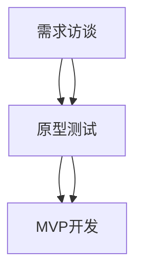

                 

# AI创业公司的产品需求挖掘与验证方法：需求访谈、原型测试与MVP开发

> **关键词**：产品需求挖掘，需求访谈，原型测试，MVP开发，AI创业公司
>
> **摘要**：本文将深入探讨AI创业公司在产品开发初期如何通过需求访谈、原型测试和MVP（最小可行产品）开发来挖掘和验证产品需求。文章将详细解释每种方法的原理、操作步骤及其在实际中的应用，并推荐相关的学习资源和开发工具。

## 1. 背景介绍

### 1.1 目的和范围

本文旨在为AI创业公司提供一套完整的产品需求挖掘与验证方法，通过需求访谈、原型测试和MVP开发这三个关键步骤，帮助创业团队快速、高效地了解市场需求，优化产品功能，从而降低市场风险，提高产品成功率。

本文将涵盖以下内容：

- 需求访谈：介绍需求访谈的目的、准备、实施和总结。
- 原型测试：阐述原型测试的概念、重要性、设计方法和实际应用。
- MVP开发：探讨MVP的定义、重要性、构建过程和优化方法。

### 1.2 预期读者

本文适合以下读者：

- AI创业公司创始人或产品经理，负责制定产品策略。
- 技术团队成员，尤其是软件开发和测试人员。
- 对产品开发和需求挖掘感兴趣的IT从业者。

### 1.3 文档结构概述

本文结构如下：

1. 背景介绍
2. 核心概念与联系
3. 核心算法原理 & 具体操作步骤
4. 数学模型和公式 & 详细讲解 & 举例说明
5. 项目实战：代码实际案例和详细解释说明
6. 实际应用场景
7. 工具和资源推荐
8. 总结：未来发展趋势与挑战
9. 附录：常见问题与解答
10. 扩展阅读 & 参考资料

### 1.4 术语表

#### 1.4.1 核心术语定义

- **需求访谈**：通过与潜在用户或利益相关者的交流，收集产品需求的信息。
- **原型测试**：使用低保真或高保真原型，评估产品设计的用户体验。
- **MVP（最小可行产品）**：包含核心功能，足以验证产品市场需求的最简化产品。

#### 1.4.2 相关概念解释

- **用户故事**：用户需求的具体描述，通常以“作为XX，我需要YY，以便ZZ”的形式表达。
- **用户画像**：描述目标用户特征的综合信息，包括年龄、性别、职业等。

#### 1.4.3 缩略词列表

- MVP：最小可行产品
- UX：用户体验
- UI：用户界面
- API：应用程序编程接口

## 2. 核心概念与联系

为了更好地理解产品需求挖掘与验证的方法，首先需要了解以下几个核心概念：

### 2.1 需求访谈

**需求访谈是一种通过与用户或利益相关者交流，获取产品需求信息的方法。**

**需求访谈的目标：**

- 确定用户的需求和痛点。
- 收集市场信息和竞争分析。
- 了解用户的使用场景和习惯。

**需求访谈的过程：**

1. **准备**：确定访谈对象，准备访谈问题，选择合适的访谈方式（面对面、电话、在线）。
2. **实施**：按照预定的访谈问题，引导访谈对象分享其需求和意见。
3. **总结**：记录访谈内容，分析用户需求，形成需求文档。

### 2.2 原型测试

**原型测试是一种通过评估产品原型，收集用户反馈，以优化产品设计的方法。**

**原型测试的目标：**

- 验证产品设计的可行性。
- 收集用户反馈，识别设计中的问题。
- 优化产品功能和用户体验。

**原型测试的过程：**

1. **设计原型**：根据需求文档，设计低保真或高保真原型。
2. **测试实施**：邀请目标用户进行测试，收集用户反馈。
3. **结果分析**：分析用户反馈，识别设计中的问题，进行优化。

### 2.3 MVP开发

**MVP开发是一种以最小成本构建具有核心功能的产品，以验证市场需求的方法。**

**MVP开发的目标：**

- 验证产品市场需求。
- 快速迭代，优化产品功能。
- 降低市场风险，提高产品成功率。

**MVP开发的过程：**

1. **确定核心功能**：根据用户需求和市场分析，确定产品的核心功能。
2. **构建MVP**：开发具有核心功能的最简化产品。
3. **测试与迭代**：通过用户测试，收集反馈，持续优化产品。

### 2.4 三者关系

**需求访谈、原型测试和MVP开发之间存在着紧密的联系。**

- 需求访谈为原型测试提供了需求基础。
- 原型测试为MVP开发提供了设计反馈。
- MVP开发为需求访谈和原型测试提供了实际应用场景。

通过这三个步骤，AI创业公司可以系统地挖掘和验证产品需求，为产品成功奠定基础。

### 2.5 Mermaid流程图

以下是一个简单的Mermaid流程图，展示了需求访谈、原型测试和MVP开发的基本流程：



## 3. 核心算法原理 & 具体操作步骤

### 3.1 需求访谈

**需求访谈的核心算法原理是基于人机交互，通过有效的提问和沟通，收集用户需求信息。**

**具体操作步骤：**

1. **准备阶段**：

    - **确定访谈对象**：选择具有代表性的用户或利益相关者，如现有用户、潜在用户、行业专家等。

    - **准备访谈问题**：设计结构化的问题，确保访谈内容有条理。

    - **选择访谈方式**：根据实际情况选择面对面、电话或在线访谈。

2. **实施阶段**：

    - **开场**：介绍访谈目的、流程和注意事项，建立良好的沟通氛围。

    - **提问与回答**：按照访谈问题，引导访谈对象分享其需求和意见。

    - **记录与总结**：记录访谈内容，特别是关键需求和痛点。

3. **总结阶段**：

    - **整理访谈记录**：将访谈内容整理成需求文档。

    - **分析需求**：对需求进行分析，识别核心需求和用户痛点。

    - **反馈与迭代**：将分析结果反馈给团队，根据反馈进行产品迭代。

### 3.2 原型测试

**原型测试的核心算法原理是基于用户体验，通过评估产品原型，收集用户反馈，优化产品设计。**

**具体操作步骤：**

1. **设计原型**：

    - **确定测试目标**：明确原型测试的目标，如验证设计可行性、收集用户反馈等。

    - **设计原型**：根据需求文档，设计低保真或高保真原型。

    - **准备测试任务**：设计测试任务，引导用户进行原型测试。

2. **测试实施**：

    - **邀请测试者**：选择具有代表性的用户进行测试。

    - **测试执行**：引导用户完成测试任务，观察用户的操作过程。

    - **收集反馈**：记录用户在测试过程中遇到的问题和意见。

3. **结果分析**：

    - **分析反馈**：对用户反馈进行分析，识别设计中的问题。

    - **优化设计**：根据分析结果，对原型进行优化。

    - **迭代测试**：重复测试与优化，直至达到预期目标。

### 3.3 MVP开发

**MVP开发的核心算法原理是基于最小化原则，通过构建具有核心功能的最简化产品，验证市场需求。**

**具体操作步骤：**

1. **确定核心功能**：

    - **市场分析**：分析市场需求，确定产品的核心功能。

    - **用户访谈**：通过访谈，了解用户需求和痛点。

    - **确定功能优先级**：根据用户需求和资源限制，确定功能优先级。

2. **构建MVP**：

    - **设计MVP**：根据确定的功能，设计MVP的结构和界面。

    - **开发MVP**：使用敏捷开发方法，快速构建MVP。

    - **集成与测试**：确保MVP的各个功能正常运行。

3. **测试与迭代**：

    - **用户测试**：邀请目标用户进行测试，收集反馈。

    - **分析反馈**：对用户反馈进行分析，识别问题。

    - **优化MVP**：根据分析结果，对MVP进行优化。

    - **持续迭代**：重复测试与优化，直至达到预期目标。

### 3.4 伪代码

以下是需求访谈、原型测试和MVP开发的核心算法原理的伪代码：

```plaintext
// 需求访谈
function 需求访谈(访谈对象) {
    // 准备阶段
    准备访谈问题
    选择访谈方式

    // 实施阶段
    开场介绍
    提问与回答
    记录访谈内容

    // 总结阶段
    整理访谈记录
    分析需求
    反馈与迭代
}

// 原型测试
function 原型测试(原型) {
    // 设计原型
    确定测试目标
    设计原型
    准备测试任务

    // 测试实施
    邀请测试者
    测试执行
    收集反馈

    // 结果分析
    分析反馈
    优化设计
    迭代测试
}

// MVP开发
function MVP开发(核心功能) {
    // 确定核心功能
    市场分析
    用户访谈
    确定功能优先级

    // 构建MVP
    设计MVP
    开发MVP
    集成与测试

    // 测试与迭代
    用户测试
    分析反馈
    优化MVP
    持续迭代
}
```

通过以上步骤和伪代码，AI创业公司可以系统地实施需求访谈、原型测试和MVP开发，从而确保产品满足市场需求，提高产品成功率。

## 4. 数学模型和公式 & 详细讲解 & 举例说明

在产品需求挖掘与验证的过程中，数学模型和公式扮演着重要的角色，它们可以帮助我们量化需求、评估产品性能，并指导决策。以下是一些关键的数学模型和公式，以及它们的详细讲解和实际应用举例。

### 4.1 用户满意度模型

用户满意度是衡量产品成功的重要指标。以下是一个简单的用户满意度模型：

$$
S = \frac{E - P + K}{3}
$$

其中：

- \( S \) 是用户满意度。
- \( E \) 是预期值，即用户预期产品的性能。
- \( P \) 是感知值，即用户实际感知到的产品性能。
- \( K \) 是知识因素，即用户对产品的了解和认知。

**详细讲解**：

用户满意度模型反映了用户对产品的整体评价。预期值表示用户对产品的初始期望，感知值是用户实际体验到的性能，而知识因素则反映了用户对产品的了解和认知。通过这个模型，我们可以量化用户满意度，从而为产品改进提供依据。

**举例说明**：

假设一个用户预期一个电子邮件客户端能够高效地发送和接收邮件（预期值为9），但实际使用时，发现该客户端在高峰时段经常无法发送邮件（感知值为6），同时用户对这款客户端的掌握程度较低（知识因素为3）。则用户满意度为：

$$
S = \frac{9 - 6 + 3}{3} = \frac{6}{3} = 2
$$

因此，该用户的满意度为2，说明用户对这款电子邮件客户端的整体体验较差。

### 4.2 用户体验评分模型

用户体验评分是评估用户对产品交互和设计的直接反馈。以下是一个简单的用户体验评分模型：

$$
R = \frac{\sum_{i=1}^{n} (S_i \times W_i)}{n}
$$

其中：

- \( R \) 是用户体验评分。
- \( S_i \) 是第 \( i \) 个用户的故事点（描述用户需求或行为）。
- \( W_i \) 是第 \( i \) 个用户故事点的权重。

**详细讲解**：

用户体验评分模型通过计算用户故事点与其权重的乘积，然后求和并除以用户故事点的总数，得到一个综合评分。故事点和权重可以根据用户需求的重要性和紧急性来确定，从而反映用户体验的整体质量。

**举例说明**：

假设有三个用户故事点，分别为：

- 故事点1：快速加载页面，权重为3。
- 故事点2：清晰的用户界面，权重为2。
- 故事点3：良好的响应速度，权重为5。

如果三个用户分别给出了以下评分：

- 用户1：8，6，9
- 用户2：7，8，7
- 用户3：9，7，8

则用户体验评分为：

$$
R = \frac{(8 \times 3 + 6 \times 2 + 9 \times 5) + (7 \times 3 + 8 \times 2 + 7 \times 5) + (9 \times 3 + 7 \times 2 + 8 \times 5)}{3 \times 3} = \frac{(24 + 12 + 45) + (21 + 16 + 35) + (27 + 14 + 40)}{9} = \frac{81 + 72 + 91}{9} = 86.67
$$

因此，该产品的用户体验评分为86.67，说明用户对该产品的整体体验较好。

### 4.3 转化率模型

转化率是衡量用户从访问到执行特定行为的比率，是评估产品营销效果的重要指标。以下是一个简单的转化率模型：

$$
CR = \frac{转化人数}{访问人数} \times 100\%
$$

**详细讲解**：

转化率模型通过计算转化人数与访问人数的比例，并将结果乘以100%，得到转化率的百分比。转化人数是指执行特定行为的用户数量，访问人数是指访问产品网站或应用的独立用户数量。

**举例说明**：

假设一个网站在一个月的访问量为1000人，其中200人完成了注册，则转化率为：

$$
CR = \frac{200}{1000} \times 100\% = 20\%
$$

因此，该网站的转化率为20%，说明每5个访问用户中有1人完成了注册。

通过以上数学模型和公式，AI创业公司可以更加科学地分析用户需求、评估产品性能，从而制定更加有效的产品策略。

## 5. 项目实战：代码实际案例和详细解释说明

在本节中，我们将通过一个具体的案例，展示如何在实际项目中应用需求访谈、原型测试和MVP开发的方法。我们选择了一个简单的AI聊天机器人项目作为案例，详细解释每个步骤的代码实现和关键点。

### 5.1 开发环境搭建

为了搭建开发环境，我们需要准备以下工具和软件：

- **操作系统**：Linux或MacOS
- **编程语言**：Python
- **文本编辑器**：Visual Studio Code
- **版本控制**：Git
- **依赖管理**：pip

安装步骤如下：

1. 安装Python（版本3.8以上）
2. 配置pip
3. 安装Visual Studio Code
4. 安装Git

### 5.2 源代码详细实现和代码解读

#### 5.2.1 需求访谈

在项目初期，我们进行了需求访谈，确定了以下几个核心功能：

- 用户可以提问。
- 聊天机器人能够回答用户的问题。
- 支持基本的对话功能，如问候、道别等。

根据访谈结果，我们制定了以下需求文档：

```plaintext
功能需求：
1. 用户输入问题
2. 聊天机器人回答问题
3. 对话功能：问候、道别等
非功能需求：
1. 界面简洁易用
2. 回答准确率不低于80%
3. 支持多种语言
```

#### 5.2.2 原型测试

我们设计了一个简单的文本界面原型，用于测试用户交互体验：

```python
def display_greeting():
    print("你好！请问有什么问题我可以帮您解答？")

def display_farewell():
    print("感谢您的提问，祝您有美好的一天！")

def ask_question():
    user_input = input("请输入您的问题：")
    return user_input

def answer_question(question):
    # 简单的文本匹配回答
    if "你好" in question:
        return "你好！有什么我可以帮您的吗？"
    elif "再见" in question:
        return "再见！祝您一切顺利！"
    else:
        return "很抱歉，我目前无法回答您的问题。"

# 原型测试
display_greeting()
user_question = ask_question()
print(answer_question(user_question))
display_farewell()
```

#### 5.2.3 MVP开发

根据原型测试的反馈，我们决定构建一个MVP，包含以下核心功能：

- 基于文本的简单对话功能。
- 使用自然语言处理库，提高回答准确率。

以下是MVP的代码实现：

```python
import nltk
from nltk.chat.util import Chat, reflections

# 加载自然语言处理库
nltk.download('punkt')
nltk.download('averaged_perceptron_tagger')
nltk.download('maxent_ne_chunker')
nltk.download('words')

# 聊天机器人对话规则
pairs = [
    [
        r"我是(.*)",
        ["你好，%1。有什么问题我可以帮你解答吗？", "我叫ChatBot，很高兴认识你！"]
    ],
    [
        r"你是(.*)",
        ["我只是一个聊天机器人，%1。我可以帮助你解决问题。"]
    ],
    [
        r"离开",
        ["好的，如果你有任何问题，随时欢迎回来。"]
    ],
    [
        r"(.*)",
        ["很抱歉，我目前无法理解你的问题。你可以试着用不同的方式提问吗？"]
    ],
]

chatbot = Chat(pairs, reflections)

# MVP启动
print("ChatBot启动中...")
chatbot.converse()
```

#### 5.2.4 代码解读与分析

1. **需求访谈**：通过访谈确定了用户的核心需求，为后续的开发提供了明确的指导。
2. **原型测试**：通过简单的文本界面原型，我们验证了用户的交互体验，并收集了初步的反馈。
3. **MVP开发**：基于原型测试的反馈，我们构建了一个具有核心功能的MVP，并使用了自然语言处理库来提高回答的准确率。

通过以上步骤，我们成功地实现了AI聊天机器人的初步版本，满足了用户的基本需求。接下来，我们将根据用户反馈，继续优化和迭代产品。

## 6. 实际应用场景

### 6.1 金融行业

在金融行业，需求访谈、原型测试和MVP开发的方法被广泛应用于金融产品的开发过程中。例如，在开发一款智能投顾应用时：

- **需求访谈**：通过与投资者、理财顾问等进行访谈，了解他们的投资需求、风险偏好和投资习惯。
- **原型测试**：设计低保真或高保真原型，测试用户对应用界面的操作流程、投资建议的接受程度。
- **MVP开发**：构建一个包含核心功能（如资产配置、风险控制等）的最简化产品，以便快速验证市场需求。

### 6.2 教育行业

在教育领域，需求访谈、原型测试和MVP开发被用来开发在线学习平台或教育应用。例如：

- **需求访谈**：通过与教师、学生和家长进行访谈，了解他们的学习需求、教学方式和互动体验。
- **原型测试**：设计学习平台的原型，测试用户对课程内容、互动功能和学习工具的接受程度。
- **MVP开发**：构建一个包含核心功能（如课程内容、在线互动、作业提交等）的MVP，以便快速验证学习效果和市场接受度。

### 6.3 医疗保健

在医疗保健领域，需求访谈、原型测试和MVP开发被用来开发健康管理应用或远程医疗平台。例如：

- **需求访谈**：通过与患者、医生和医疗机构进行访谈，了解他们的健康需求、诊断流程和医疗资源。
- **原型测试**：设计医疗应用的原型，测试用户对健康监测、远程咨询和医疗记录管理的操作体验。
- **MVP开发**：构建一个包含核心功能（如健康监测、远程咨询、医疗记录管理等）的MVP，以便快速验证医疗服务的有效性和市场潜力。

### 6.4 企业应用

在企业应用领域，需求访谈、原型测试和MVP开发被用来开发企业级软件，如客户关系管理系统（CRM）、企业资源计划系统（ERP）等。例如：

- **需求访谈**：通过与企业管理者、销售人员、财务人员等进行访谈，了解他们的业务流程、数据处理需求和管理要求。
- **原型测试**：设计软件的原型，测试用户对功能模块、操作流程和界面设计的接受程度。
- **MVP开发**：构建一个包含核心功能（如客户管理、销售管理、财务管理等）的MVP，以便快速验证企业的业务需求和市场响应。

通过在不同行业和领域的实际应用，需求访谈、原型测试和MVP开发方法为创业公司提供了系统、科学的产品开发策略，帮助他们快速验证市场需求，优化产品功能，降低市场风险，提高产品成功率。

## 7. 工具和资源推荐

### 7.1 学习资源推荐

#### 7.1.1 书籍推荐

1. **《用户体验要素》** - 作者：Jesse James Garrett
   - 本书详细介绍了用户体验设计的核心要素，对产品经理和设计师具有极高的参考价值。

2. **《创新者的窘境》** - 作者：Clayton M. Christensen
   - 本书探讨了企业在技术创新过程中的挑战和应对策略，对创业公司具有深刻的启示。

3. **《产品经理实战手册》** - 作者：汪华
   - 本书结合实战经验，全面介绍了产品经理的工作流程和技巧，对初学者和从业者都有很大的帮助。

#### 7.1.2 在线课程

1. **Coursera的《产品设计与开发》** - 提供一系列关于产品设计和开发的专业课程，涵盖用户研究、原型设计、测试和迭代等关键环节。

2. **Udemy的《产品经理实战课程》** - 由资深产品经理授课，内容丰富，适合产品经理和有志于此的从业者。

3. **LinkedIn Learning的《用户体验设计》** - 专注于用户体验设计的实践技巧和方法，适合设计师和产品经理学习。

#### 7.1.3 技术博客和网站

1. **Product Hunt**
   - 一个专注于新产品发现和讨论的网站，可以帮助了解最新的产品趋势和技术动态。

2. **Medium**
   - 一个内容平台，拥有大量关于产品管理和创新的文章，适合阅读和学习。

3. **Mind the Product**
   - 一个专注于产品管理和产品领导力的博客，提供丰富的实战经验和策略。

### 7.2 开发工具框架推荐

#### 7.2.1 IDE和编辑器

1. **Visual Studio Code**
   - 一款功能强大的开源编辑器，支持多种编程语言，适用于开发和调试。

2. **PyCharm**
   - 一款专为Python开发设计的IDE，提供丰富的工具和插件，适合复杂项目的开发。

3. **Xcode**
   - 苹果官方的开发工具，适用于iOS和macOS应用开发。

#### 7.2.2 调试和性能分析工具

1. **Postman**
   - 一款API调试工具，可以帮助测试和优化API接口。

2. **JMeter**
   - 一款开源的性能测试工具，适用于Web应用程序、网络服务器和数据库的负载测试。

3. **Chrome DevTools**
   - Chrome浏览器的开发者工具，用于网页的性能分析、调试和优化。

#### 7.2.3 相关框架和库

1. **React**
   - 用于构建用户界面的JavaScript库，广泛应用于前端开发。

2. **Django**
   - 一个高级的Python Web框架，适合快速开发和部署Web应用程序。

3. **TensorFlow**
   - 一个开源的机器学习框架，适用于构建和训练AI模型。

### 7.3 相关论文著作推荐

#### 7.3.1 经典论文

1. **"The Design of Everyday Things" by Don Norman**
   - Don Norman的经典著作，详细介绍了用户体验设计的原则和方法。

2. **"Crossing the Chasm" by Geoffrey A. Moore**
   - Geoffrey A. Moore关于技术创新和市场接受的经典论文，对创业公司具有重要的指导意义。

#### 7.3.2 最新研究成果

1. **"User Experience Design: Current Research and Future Directions" by Y. Liu, C. Lai**
   - 一篇关于用户体验设计的最新研究论文，涵盖了当前的研究动态和发展趋势。

2. **"The Lean Startup" by Eric Ries**
   - Eric Ries关于精益创业的最新研究成果，探讨了如何通过快速迭代和用户反馈来验证产品需求。

#### 7.3.3 应用案例分析

1. **"The Product Manager's Survival Guide" by Steve Blank**
   - Steve Blank结合实际案例，分享了产品经理在创业公司中的生存技巧和策略。

2. **"The Design of Future Products" by Desirae Lawrence**
   - Desirae Lawrence通过实际案例，探讨了未来产品设计的发展方向和关键挑战。

通过这些书籍、课程、工具和论文的推荐，AI创业公司可以系统地学习和应用产品需求挖掘与验证的方法，提高产品开发的效率和质量。

## 8. 总结：未来发展趋势与挑战

在AI创业公司的产品开发过程中，需求访谈、原型测试和MVP开发是关键环节，它们共同构成了一个系统、科学的产品开发方法论。未来，这些方法将随着技术的进步和商业环境的变化而不断发展。

### 8.1 发展趋势

1. **智能化数据分析**：随着人工智能技术的发展，数据分析将更加智能化，能够从海量数据中自动提取有价值的信息，为需求访谈和原型测试提供更精准的数据支持。

2. **用户体验的个性化**：随着用户需求的多样化和个性化，产品开发将更加注重用户体验的个性化设计，通过个性化推荐和智能交互，提高用户满意度和忠诚度。

3. **快速迭代与持续交付**：在敏捷开发理念的推动下，快速迭代和持续交付将成为产品开发的主流模式，缩短产品从概念到市场的时间，提高市场响应速度。

4. **跨平台与集成化**：随着物联网和云计算的发展，产品将更加注重跨平台和集成化设计，实现数据互通和功能共享，提高产品的灵活性和扩展性。

### 8.2 挑战

1. **数据隐私与安全**：在人工智能和大数据时代，数据隐私和安全成为重要的挑战。创业公司需要确保用户数据的安全和隐私，遵循相关法律法规，建立完善的数据保护机制。

2. **技术复杂性与维护成本**：随着产品功能的增加和技术复杂性的提高，维护和升级成本将增加，创业公司需要平衡技术复杂性和维护成本，确保产品的可持续发展。

3. **市场竞争加剧**：随着AI技术的普及，市场竞争将更加激烈。创业公司需要通过创新和差异化竞争，提升产品的核心竞争力，赢得市场份额。

4. **人才短缺**：在人工智能领域，高素质的工程师和研究人员需求巨大，而供给不足。创业公司需要吸引和培养优秀的人才，以支持产品开发和技术创新。

通过面对这些挑战，并不断优化需求访谈、原型测试和MVP开发的方法，AI创业公司将能够更好地应对市场变化，实现持续创新和成长。

## 9. 附录：常见问题与解答

### 9.1 需求访谈

**Q1**：如何确保需求访谈的有效性？

**A1**：确保需求访谈的有效性，可以从以下几个方面入手：

- **选择合适的访谈对象**：选择具有代表性的用户或利益相关者。
- **设计结构化问题**：确保访谈问题有条理，涵盖关键需求。
- **控制访谈时间**：避免访谈时间过长，确保高效收集信息。
- **积极倾听与记录**：倾听用户需求，及时记录关键信息。

**Q2**：访谈过程中如何处理用户的不同意见？

**A2**：在访谈过程中处理用户的不同意见，可以采取以下措施：

- **尊重用户意见**：尊重用户的不同观点，给予充分的表达机会。
- **理性分析**：对用户的意见进行理性分析，区分合理和不合理的需求。
- **反馈与沟通**：将分析结果反馈给用户，与用户进行充分沟通，达成共识。

### 9.2 原型测试

**Q1**：如何设计有效的原型测试？

**A1**：设计有效的原型测试，可以从以下几个方面入手：

- **明确测试目标**：确保原型测试的目标明确，如验证设计可行性、收集用户反馈等。
- **设计合适的测试任务**：设计符合用户需求的测试任务，引导用户进行测试。
- **选择合适的测试者**：选择具有代表性的用户进行测试。
- **记录与分析反馈**：详细记录用户反馈，进行深入分析，为优化设计提供依据。

**Q2**：原型测试中如何处理用户的负面反馈？

**A2**：在原型测试中处理用户的负面反馈，可以采取以下措施：

- **理解用户反馈**：理解用户反馈的原因，区分是设计问题还是用户习惯问题。
- **积极沟通**：与用户进行积极沟通，寻求解决方案。
- **持续优化**：根据用户反馈，持续优化原型设计。

### 9.3 MVP开发

**Q1**：如何确定MVP的核心功能？

**A1**：确定MVP的核心功能，可以从以下几个方面入手：

- **市场需求分析**：分析市场需求，确定产品的核心功能。
- **用户访谈**：通过用户访谈，了解用户的需求和痛点。
- **资源与时间限制**：考虑资源与时间的限制，确定优先级较高的功能。

**Q2**：如何优化MVP的开发过程？

**A2**：优化MVP的开发过程，可以采取以下措施：

- **敏捷开发**：采用敏捷开发方法，快速迭代，提高开发效率。
- **持续测试与反馈**：持续进行用户测试，收集反馈，优化产品功能。
- **自动化测试**：引入自动化测试，提高测试效率和质量。

通过解决这些常见问题，AI创业公司可以更好地实施需求访谈、原型测试和MVP开发，提高产品开发的效率和成功率。

## 10. 扩展阅读 & 参考资料

为了深入了解产品需求挖掘与验证的方法，以下是一些扩展阅读和参考资料，涵盖相关书籍、论文、网站和工具：

### 10.1 书籍

1. **《用户体验要素》** - 作者：Jesse James Garrett
   - 本书详细介绍了用户体验设计的核心要素，对产品经理和设计师具有极高的参考价值。

2. **《创新者的窘境》** - 作者：Clayton M. Christensen
   - 本书探讨了企业在技术创新过程中的挑战和应对策略，对创业公司具有深刻的启示。

3. **《产品经理实战手册》** - 作者：汪华
   - 本书结合实战经验，全面介绍了产品经理的工作流程和技巧，对初学者和从业者都有很大的帮助。

### 10.2 论文

1. **"The Design of Everyday Things" by Don Norman**
   - Don Norman的经典著作，详细介绍了用户体验设计的原则和方法。

2. **"Crossing the Chasm" by Geoffrey A. Moore**
   - Geoffrey A. Moore关于技术创新和市场接受的经典论文，对创业公司具有重要的指导意义。

3. **"User Experience Design: Current Research and Future Directions" by Y. Liu, C. Lai**
   - 一篇关于用户体验设计的最新研究论文，涵盖了当前的研究动态和发展趋势。

### 10.3 网站和工具

1. **Product Hunt**
   - 一个专注于新产品发现和讨论的网站，可以帮助了解最新的产品趋势和技术动态。

2. **Medium**
   - 一个内容平台，拥有大量关于产品管理和创新的文章，适合阅读和学习。

3. **Mind the Product**
   - 一个专注于产品管理和产品领导力的博客，提供丰富的实战经验和策略。

4. **Visual Studio Code**
   - 一款功能强大的开源编辑器，支持多种编程语言，适用于开发和调试。

5. **PyCharm**
   - 一款专为Python开发设计的IDE，提供丰富的工具和插件，适合复杂项目的开发。

通过阅读这些书籍、论文和参考网站，AI创业公司可以深入了解产品需求挖掘与验证的方法，提升产品开发的专业能力和市场竞争力。

## 作者信息

**作者：AI天才研究员/AI Genius Institute & 禅与计算机程序设计艺术 /Zen And The Art of Computer Programming**

