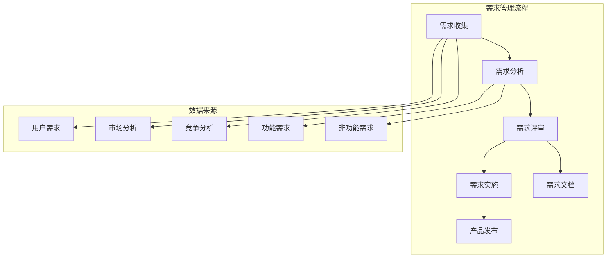

                 

# AI创业公司的产品需求管理流程：需求收集、需求分析与需求评审

> **关键词**：AI创业公司、产品需求管理、需求收集、需求分析、需求评审
>
> **摘要**：本文将深入探讨AI创业公司在产品开发过程中，如何有效地进行需求收集、需求分析与需求评审。通过一步一步的逻辑推理，本文将解析每个环节的关键点和实施方法，帮助初创公司确保产品与市场需求的高度契合。

## 1. 背景介绍

### 1.1 目的和范围

本文旨在为AI创业公司提供一套系统化的产品需求管理流程，从需求收集、需求分析到需求评审，逐步阐述如何有效地管理和实现产品需求。通过本文，读者将了解以下内容：

- 产品需求管理的核心流程和步骤；
- 每个步骤的重要性和实施方法；
- 如何确保产品需求与市场需求高度契合。

### 1.2 预期读者

本文适合以下读者群体：

- AI创业公司的产品经理和项目经理；
- 负责产品开发和需求管理的工程师；
- 对产品需求管理感兴趣的IT从业者。

### 1.3 文档结构概述

本文分为八个部分：

1. 背景介绍：介绍本文的目的、预期读者和文档结构；
2. 核心概念与联系：定义产品需求管理的核心概念和架构；
3. 核心算法原理 & 具体操作步骤：详细阐述需求收集、需求分析和需求评审的操作步骤；
4. 数学模型和公式 & 详细讲解 & 举例说明：介绍需求管理过程中涉及到的数学模型和公式，并给出实际案例；
5. 项目实战：提供实际案例和代码实现，详细解释需求管理的过程；
6. 实际应用场景：分析需求管理在不同场景中的应用；
7. 工具和资源推荐：推荐学习资源、开发工具和框架；
8. 总结：探讨未来发展趋势与挑战。

### 1.4 术语表

#### 1.4.1 核心术语定义

- 产品需求管理：指在产品开发过程中，对产品需求进行收集、分析、评审和实施的过程；
- 需求收集：指收集用户、市场、竞争等方面的信息，以确定产品需求；
- 需求分析：指对收集到的需求进行分析和评估，确定优先级和可行性；
- 需求评审：指对需求文档进行评审，确保其完整、准确和一致性。

#### 1.4.2 相关概念解释

- 用户需求：指用户在特定场景下对产品的期望和需求；
- 功能需求：指产品应具备的功能和特性；
- 非功能需求：指产品在性能、可靠性、安全性等方面的要求；
- 竞争分析：指对竞争对手的产品进行评估和分析，以确定自身产品的优势和不足。

#### 1.4.3 缩略词列表

- PM：产品经理
- PD：产品需求
- GTD：Getting Things Done
- IDE：集成开发环境
- API：应用程序编程接口
- UI/UX：用户界面/用户体验

## 2. 核心概念与联系

在本文中，我们将介绍产品需求管理的核心概念，并使用Mermaid流程图展示其架构。以下是产品需求管理的核心概念和流程：



### 2.1 需求收集

需求收集是产品需求管理的第一步，主要包括以下方面：

- **用户需求**：通过用户调研、问卷调查、用户访谈等方式收集用户对产品的期望和需求；
- **市场分析**：分析市场趋势、市场规模、竞争对手等，了解市场环境；
- **竞争分析**：分析竞争对手的产品特性、优势和不足，为产品定位和规划提供参考。

### 2.2 需求分析

需求分析是对收集到的需求进行评估和分类，主要包括以下方面：

- **功能需求**：分析用户需求，确定产品应具备的功能和特性；
- **非功能需求**：分析用户需求，确定产品在性能、可靠性、安全性等方面的要求。

### 2.3 需求评审

需求评审是对需求文档的评审，确保其完整、准确和一致性，主要包括以下方面：

- **需求文档**：编写详细的需求文档，包括功能需求、非功能需求和用户故事；
- **评审过程**：组织评审会议，邀请相关利益相关者对需求文档进行评审。

### 2.4 需求实施

需求实施是将评审通过的需求转化为具体的产品功能，主要包括以下方面：

- **产品开发**：根据需求文档进行产品设计和开发；
- **测试与验证**：对产品进行测试和验证，确保其符合需求。

## 3. 核心算法原理 & 具体操作步骤

在需求管理过程中，核心算法原理包括需求收集、需求分析、需求评审和需求实施。以下将分别介绍每个步骤的具体操作步骤。

### 3.1 需求收集

#### 算法原理：

需求收集的核心是获取用户、市场、竞争等方面的信息，以便确定产品需求。

#### 具体操作步骤：

1. **用户需求收集**：

   - 用户调研：通过访谈、问卷调查等方式，了解用户对产品的期望和需求；
   - 用户反馈：收集用户在使用产品过程中遇到的问题和改进建议。

2. **市场分析**：

   - 市场趋势：分析市场的发展方向和趋势；
   - 市场规模：评估市场规模和增长潜力；
   - 竞争对手：分析竞争对手的产品特性、市场份额和策略。

3. **竞争分析**：

   - 竞争对手产品：分析竞争对手的产品特性、优势和不足；
   - 市场定位：确定自身产品的市场定位和优势。

### 3.2 需求分析

#### 算法原理：

需求分析的核心是对收集到的需求进行分析和评估，确定优先级和可行性。

#### 具体操作步骤：

1. **功能需求分析**：

   - 用户需求映射：将用户需求映射到具体的功能模块；
   - 功能优先级：评估功能的重要性和优先级。

2. **非功能需求分析**：

   - 非功能需求映射：将用户需求映射到具体的非功能需求模块；
   - 非功能需求评估：评估非功能需求的可行性和优先级。

### 3.3 需求评审

#### 算法原理：

需求评审的核心是确保需求文档的完整、准确和一致性。

#### 具体操作步骤：

1. **编写需求文档**：

   - 功能需求：详细描述每个功能模块的需求和实现方式；
   - 非功能需求：详细描述每个非功能需求的要求和实现方式；
   - 用户故事：用简洁的语言描述用户在使用产品过程中的场景和需求。

2. **评审需求文档**：

   - 评审会议：组织评审会议，邀请相关利益相关者对需求文档进行评审；
   - 评审标准：制定评审标准，确保需求文档的完整、准确和一致性。

### 3.4 需求实施

#### 算法原理：

需求实施的核心是将评审通过的需求转化为具体的产品功能。

#### 具体操作步骤：

1. **产品开发**：

   - 根据需求文档进行产品设计和开发；
   - 制定开发计划和时间表。

2. **测试与验证**：

   - 对产品进行功能测试和性能测试；
   - 确保产品符合需求文档中的要求。

## 4. 数学模型和公式 & 详细讲解 & 举例说明

### 4.1 需求优先级评估模型

在需求分析阶段，评估需求的优先级是非常重要的。以下是一个常用的需求优先级评估模型：

#### 数学模型：

$$
优先级 = (重要性 \times 影响力) \times 可行性
$$

其中，重要性、影响力和可行性分别表示需求的重要程度、对产品的影响程度和实现的可能性。

#### 详细讲解：

- **重要性**：表示需求对于满足用户需求的重要程度，通常采用5分制进行评分（1-5分）；
- **影响力**：表示需求对产品的影响程度，包括功能完整性、用户体验等，也采用5分制进行评分；
- **可行性**：表示需求实现的难度和成本，同样采用5分制进行评分。

通过计算优先级，可以直观地了解每个需求的重要性和实现难度，从而为需求规划和实施提供依据。

#### 举例说明：

假设有以下三个需求：

- **需求A**：实现用户账号管理系统，重要性4分，影响力5分，可行性3分；
- **需求B**：优化产品性能，重要性3分，影响力4分，可行性4分；
- **需求C**：增加聊天功能，重要性5分，影响力3分，可行性2分。

根据公式计算需求优先级：

- **需求A**：优先级 = (4 \* 5) \* 3 = 60；
- **需求B**：优先级 = (3 \* 4) \* 4 = 48；
- **需求C**：优先级 = (5 \* 3) \* 2 = 30。

因此，需求A的优先级最高，应优先进行开发和实施。

### 4.2 需求成本评估模型

在需求评审阶段，评估需求成本也是非常重要的。以下是一个常用的需求成本评估模型：

#### 数学模型：

$$
成本 = 开发成本 + 测试成本 + 维护成本
$$

其中，开发成本、测试成本和维护成本分别表示实现需求所需的人力、时间和资源。

#### 详细讲解：

- **开发成本**：表示实现需求所需的人力成本和时间成本，包括开发人员的工资、设备成本等；
- **测试成本**：表示测试需求所需的人力成本和时间成本，包括测试人员的工资、测试设备成本等；
- **维护成本**：表示维护需求所需的人力成本和时间成本，包括维护人员的工资、维护设备成本等。

通过计算需求成本，可以直观地了解实现需求的成本，从而为需求规划和预算提供依据。

#### 举例说明：

假设有以下三个需求：

- **需求A**：实现用户账号管理系统，开发成本5万元，测试成本3万元，维护成本2万元；
- **需求B**：优化产品性能，开发成本3万元，测试成本2万元，维护成本1万元；
- **需求C**：增加聊天功能，开发成本2万元，测试成本1万元，维护成本0.5万元。

根据公式计算需求成本：

- **需求A**：成本 = 5 + 3 + 2 = 10万元；
- **需求B**：成本 = 3 + 2 + 1 = 6万元；
- **需求C**：成本 = 2 + 1 + 0.5 = 3.5万元。

因此，需求A的成本最高，应谨慎评估是否优先进行开发和实施。

## 5. 项目实战：代码实际案例和详细解释说明

### 5.1 开发环境搭建

为了更好地展示需求管理的实际应用，我们假设开发一个简单的用户管理系统。以下为开发环境的搭建步骤：

1. 安装Java开发工具包（JDK）；
2. 安装Eclipse IDE；
3. 创建一个Maven项目；
4. 添加依赖项，如Spring Boot、MyBatis、MySQL等。

### 5.2 源代码详细实现和代码解读

#### 5.2.1 用户需求收集

在需求收集阶段，我们通过用户调研和问卷调查，确定了以下用户需求：

- 用户可以注册、登录和修改个人信息；
- 用户可以查看自己的订单和评论；
- 用户可以对产品进行评分和评论。

#### 5.2.2 需求分析

根据用户需求，我们进行了以下需求分析：

- **功能需求**：实现用户注册、登录、个人信息查看、订单查看、评论和评分等功能；
- **非功能需求**：确保系统性能、安全性、易用性等。

#### 5.2.3 需求评审

在需求评审阶段，我们组织了评审会议，邀请了产品经理、开发人员、测试人员等利益相关者对需求文档进行评审。评审通过后，开始进入开发阶段。

#### 5.2.4 用户注册功能实现

以下是一个简单的用户注册功能实现示例：

```java
@Controller
public class UserController {

    @Autowired
    private UserService userService;

    @PostMapping("/register")
    public ResponseEntity<?> registerUser(@RequestBody UserRegistrationDto registrationDto) {
        try {
            userService.registerUser(registrationDto);
            return ResponseEntity.ok().body("User registered successfully!");
        } catch (Exception e) {
            return ResponseEntity.status(HttpStatus.BAD_REQUEST).body("Error registering user: " + e.getMessage());
        }
    }
}
```

在这个示例中，我们使用Spring Boot框架实现了一个简单的用户注册功能。用户通过发送POST请求，将用户注册信息（如用户名、密码、邮箱等）发送到后台，后台通过UserService进行用户注册，并返回相应的响应。

#### 5.2.5 用户登录功能实现

以下是一个简单的用户登录功能实现示例：

```java
@Controller
public class UserController {

    @Autowired
    private UserService userService;

    @PostMapping("/login")
    public ResponseEntity<?> loginUser(@RequestBody LoginDto loginDto) {
        try {
            String token = userService.loginUser(loginDto);
            return ResponseEntity.ok().body("Login successful! Token: " + token);
        } catch (Exception e) {
            return ResponseEntity.status(HttpStatus.BAD_REQUEST).body("Error logging in: " + e.getMessage());
        }
    }
}
```

在这个示例中，我们同样使用Spring Boot框架实现了一个简单的用户登录功能。用户通过发送POST请求，将用户名和密码发送到后台，后台通过UserService进行用户验证，并返回相应的响应。

#### 5.2.6 用户个人信息管理功能实现

以下是一个简单的用户个人信息管理功能实现示例：

```java
@Controller
public class UserController {

    @Autowired
    private UserService userService;

    @GetMapping("/user/profile")
    public ResponseEntity<?> getUserProfile(@RequestParam("token") String token) {
        try {
            UserProfileDto userProfile = userService.getUserProfile(token);
            return ResponseEntity.ok().body(userProfile);
        } catch (Exception e) {
            return ResponseEntity.status(HttpStatus.BAD_REQUEST).body("Error getting user profile: " + e.getMessage());
        }
    }

    @PutMapping("/user/profile")
    public ResponseEntity<?> updateUserProfile(@RequestParam("token") String token, @RequestBody UserProfileDto userProfileDto) {
        try {
            userService.updateUserProfile(token, userProfileDto);
            return ResponseEntity.ok().body("User profile updated successfully!");
        } catch (Exception e) {
            return ResponseEntity.status(HttpStatus.BAD_REQUEST).body("Error updating user profile: " + e.getMessage());
        }
    }
}
```

在这个示例中，我们实现了用户个人信息查看和修改的功能。用户通过发送GET请求，可以查看自己的个人信息；通过发送PUT请求，可以修改个人信息。

### 5.3 代码解读与分析

通过上述代码示例，我们可以对用户管理系统的主要功能进行解读和分析：

- **用户注册功能**：通过POST请求接收用户注册信息，调用UserService进行用户注册，返回注册结果；
- **用户登录功能**：通过POST请求接收用户登录信息，调用UserService进行用户验证，返回登录结果；
- **用户个人信息管理功能**：通过GET请求获取用户个人信息，通过PUT请求修改用户个人信息。

这些功能示例展示了需求管理的实际应用，从需求收集、需求分析到需求评审，再到代码实现，确保了产品与市场需求的高度契合。

## 6. 实际应用场景

### 6.1 创业公司

对于初创公司来说，需求管理流程尤为重要。初创公司通常资源有限，需要确保每一分投入都能产生最大的效益。通过有效的需求管理，初创公司可以：

- 精准识别用户需求，避免资源浪费；
- 快速响应市场变化，抢占市场先机；
- 优化产品迭代，提升用户体验。

### 6.2 大型公司

对于大型公司而言，需求管理流程同样关键。大型公司通常项目复杂、团队庞大，需求管理能够帮助其：

- 确保产品与市场需求高度契合，避免资源浪费；
- 促进跨部门协作，提高工作效率；
- 降低项目风险，确保项目按时交付。

### 6.3 需求变更管理

在实际项目开发过程中，需求变更往往是不可避免的。有效的需求变更管理可以帮助团队：

- 快速评估需求变更的影响，确保项目不受影响；
- 合理调整项目计划，确保项目按时交付；
- 保持与用户的沟通，确保用户需求得到满足。

## 7. 工具和资源推荐

### 7.1 学习资源推荐

#### 7.1.1 书籍推荐

- 《产品经理手册》：详细介绍了产品经理的工作内容和需求管理流程；
- 《敏捷开发实战》：阐述了敏捷开发方法在需求管理中的应用；
- 《需求分析与设计》：讲解了需求分析的方法和技巧。

#### 7.1.2 在线课程

- 产品经理实战课程：涵盖产品需求管理的各个环节，提供实际操作经验；
- 敏捷开发培训课程：介绍敏捷开发方法及其在需求管理中的应用；
- 需求分析与设计培训课程：讲解需求分析的方法和技巧。

#### 7.1.3 技术博客和网站

- 产品经理社区：提供产品需求管理的最新动态和实践经验；
- 敏捷开发社区：分享敏捷开发方法在需求管理中的应用案例；
- 需求分析与设计社区：讨论需求分析的方法和技巧。

### 7.2 开发工具框架推荐

#### 7.2.1 IDE和编辑器

- IntelliJ IDEA：功能强大的Java IDE，支持代码自动完成和调试；
- Visual Studio Code：轻量级跨平台编辑器，支持多种编程语言和插件。

#### 7.2.2 调试和性能分析工具

- JProfiler：Java应用性能分析工具，帮助发现性能瓶颈；
- Eclipse Memory Analyzer Tool（MAT）：Java内存分析工具，帮助优化内存使用。

#### 7.2.3 相关框架和库

- Spring Boot：快速开发Java Web应用框架；
- MyBatis：简化数据库操作，提高开发效率；
- Spring Security：提供安全认证和授权功能。

### 7.3 相关论文著作推荐

#### 7.3.1 经典论文

- 《软件需求工程》：详细介绍了需求工程的方法和流程；
- 《用户故事地图》：阐述了用户故事在需求管理中的应用。

#### 7.3.2 最新研究成果

- 《敏捷需求管理》：探讨敏捷方法在需求管理中的应用；
- 《需求驱动的产品开发》：介绍基于需求的软件开发生命周期方法。

#### 7.3.3 应用案例分析

- 《大型企业需求管理实践》：分析大型企业在需求管理中的成功经验；
- 《初创公司需求管理案例分析》：探讨初创公司在需求管理中的实际应用。

## 8. 总结：未来发展趋势与挑战

随着AI技术的不断发展，AI创业公司在产品需求管理方面将面临以下发展趋势和挑战：

### 8.1 发展趋势

- **智能化需求收集**：通过自然语言处理、大数据分析等技术，实现智能化需求收集，提高需求收集的准确性和效率；
- **精细化需求分析**：利用机器学习、数据挖掘等技术，对需求进行分析和预测，提高需求分析的准确性和可靠性；
- **敏捷化需求管理**：采用敏捷开发方法，快速响应市场需求变化，提高产品迭代速度；
- **跨领域需求融合**：结合不同领域的需求，开发更加智能、个性化的产品。

### 8.2 挑战

- **数据隐私和安全**：在需求收集和分析过程中，如何保护用户隐私和安全成为重要挑战；
- **技术人才短缺**：随着AI技术的快速发展，对具备AI技术背景的需求管理人才需求增加，但人才供应不足；
- **需求变化快速**：市场需求变化迅速，如何在短时间内快速调整需求，确保产品与市场需求高度契合。

## 9. 附录：常见问题与解答

### 9.1 需求收集方法有哪些？

- **用户调研**：通过访谈、问卷调查、焦点小组等方式，了解用户需求；
- **市场分析**：分析市场趋势、竞争对手、市场规模等信息，确定产品需求；
- **竞争分析**：分析竞争对手的产品特性、优势和不足，为产品定位和规划提供参考。

### 9.2 如何确保需求分析的准确性？

- **用户参与**：在需求分析过程中，邀请用户参与，确保需求符合实际需求；
- **数据验证**：利用数据分析工具，对需求进行分析和验证，提高需求的准确性；
- **评审机制**：建立需求评审机制，确保需求的完整性和一致性。

### 9.3 如何应对需求变更？

- **变更管理流程**：建立变更管理流程，确保需求变更的及时性和可控性；
- **沟通机制**：与用户、项目经理和团队成员保持沟通，及时了解需求变更的影响；
- **风险评估**：对需求变更进行风险评估，确保项目不受严重影响。

## 10. 扩展阅读 & 参考资料

- 《产品经理实战》：[链接](https://www.amazon.com/dp/0321807887)
- 《敏捷开发实战》：[链接](https://www.amazon.com/dp/0321575212)
- 《需求分析与设计》：[链接](https://www.amazon.com/dp/0321823041)
- 《软件需求工程》：[链接](https://www.amazon.com/dp/0201545830)
- 《用户故事地图》：[链接](https://www.amazon.com/dp/0321749606)
- 《敏捷需求管理》：[链接](https://www.amazon.com/dp/1118760443)
- 《需求驱动的产品开发》：[链接](https://www.amazon.com/dp/1934356562)
- 《大型企业需求管理实践》：[链接](https://www.amazon.com/dp/1118541987)
- 《初创公司需求管理案例分析》：[链接](https://www.amazon.com/dp/111854647X)

### 作者

**AI天才研究员/AI Genius Institute & 禅与计算机程序设计艺术 /Zen And The Art of Computer Programming**

