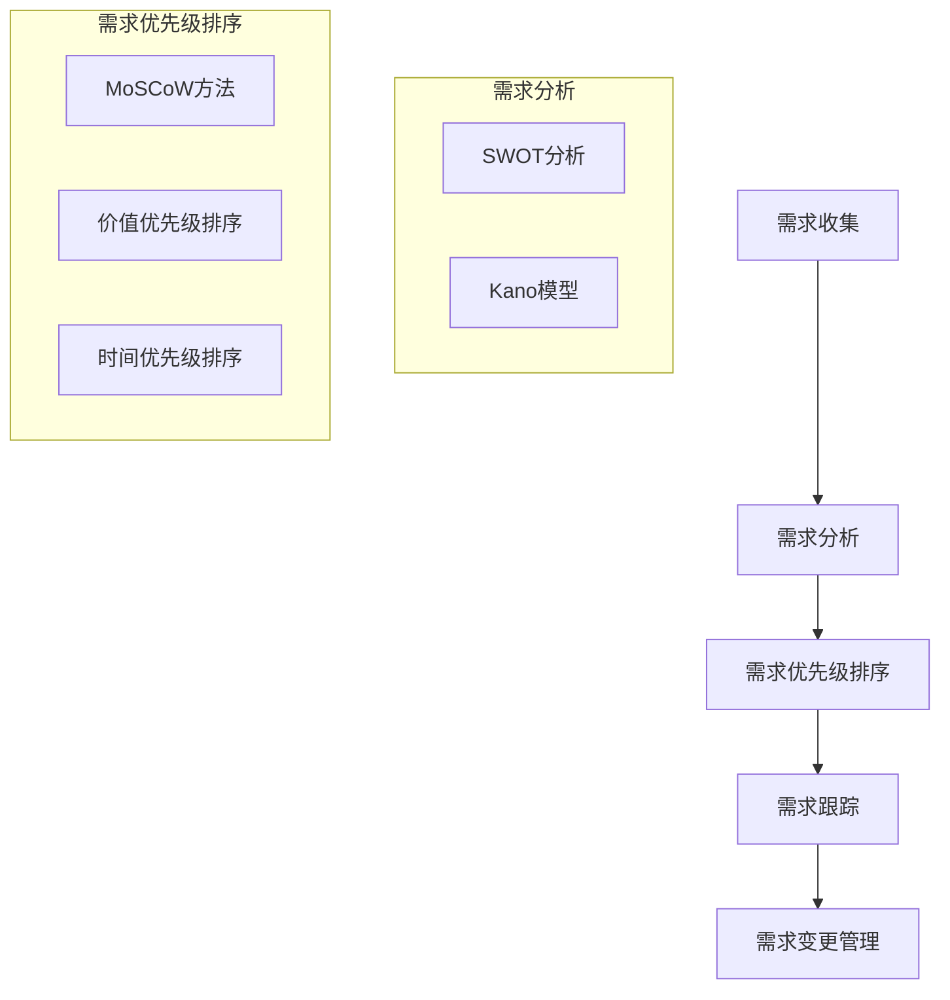

                 

### 文章标题

《AI创业公司的产品需求管理：需求收集、需求分析与需求优先级》

这篇文章深入探讨了AI创业公司在产品开发过程中，如何有效地管理产品需求。通过系统的需求收集、细致的需求分析以及合理的需求优先级排序，我们能够确保产品从理念到上市的每一步都更加稳健和高效。在当前快速发展的AI行业中，这一过程至关重要，它不仅能够提高产品的市场竞争力，还能帮助公司更好地满足用户需求，实现可持续的商业成功。

### 关键词

- AI创业公司
- 产品需求管理
- 需求收集
- 需求分析
- 需求优先级
- 产品开发流程

### 摘要

本文旨在为AI创业公司提供一套完整的产品需求管理方法，包括需求收集、需求分析和需求优先级排序。通过系统的介绍和实战案例分析，读者将了解到如何从用户和市场入手，准确地捕捉需求，如何通过科学的方法对需求进行分析，以及如何有效地进行需求优先级排序，从而确保产品开发的每一步都切实可行，最终实现产品的成功上市。

---

在接下来的部分，我们将对文章的各个部分进行详细的阐述，包括背景介绍、核心概念、算法原理、数学模型、实战案例、实际应用场景以及未来趋势等，力求为读者提供一份全面而深入的技术指南。

## 1. 背景介绍

### 1.1 目的和范围

本文的目标是帮助AI创业公司实现高效的产品需求管理，确保产品从概念到市场的每一步都符合用户需求和市场趋势。本文将涵盖以下范围：

- 需求收集方法：介绍如何通过用户调研、市场分析、竞品分析等多种手段收集需求。
- 需求分析方法：讲解如何通过SWOT分析、Kano模型等工具，对收集到的需求进行细致分析。
- 需求优先级排序：探讨如何利用优先级矩阵、MoSCoW方法等工具，对需求进行优先级排序。
- 实战案例：通过实际案例展示上述方法的实际应用。

### 1.2 预期读者

本文适合以下读者群体：

- AI创业公司的产品经理和项目经理
- AI创业公司的技术开发人员
- 对产品需求管理感兴趣的技术爱好者
- 希望提升产品开发效率的相关从业者

### 1.3 文档结构概述

本文将按照以下结构进行阐述：

1. 背景介绍：简要介绍文章的目的和范围。
2. 核心概念与联系：定义和解释产品需求管理中的核心概念。
3. 核心算法原理 & 具体操作步骤：详细讲解产品需求管理的方法和步骤。
4. 数学模型和公式 & 详细讲解 & 举例说明：介绍需求优先级排序中的数学模型和公式。
5. 项目实战：提供实际项目中的代码案例和详细解释。
6. 实际应用场景：探讨产品需求管理在不同场景中的应用。
7. 工具和资源推荐：推荐相关学习资源和开发工具。
8. 总结：总结文章的主要观点和未来发展趋势。
9. 附录：常见问题与解答。
10. 扩展阅读 & 参考资料：提供进一步阅读的资源。

### 1.4 术语表

#### 1.4.1 核心术语定义

- 产品需求：用户或市场对产品所期望的功能、性能、体验等方面的要求。
- 需求收集：通过多种渠道获取用户和市场的需求信息。
- 需求分析：对收集到的需求进行系统分析和评估，以确定其可行性、重要性和优先级。
- 需求优先级排序：根据需求的重要性和紧迫性，对需求进行优先级排序。
- SWOT分析：对需求进行优势、劣势、机会和威胁分析。
- Kano模型：根据用户满意度对需求进行分类和优先级排序。

#### 1.4.2 相关概念解释

- 用户调研：通过问卷调查、访谈等方式，直接获取用户对产品的需求和期望。
- 市场分析：通过市场研究、行业报告等手段，分析市场需求和趋势。
- 竞品分析：研究竞争对手的产品，了解其优势、劣势和市场需求。

#### 1.4.3 缩略词列表

- AI：人工智能
- PM：产品经理
- SWOT：优势、劣势、机会和威胁
- Kano：Kano模型（一种用户满意度分析模型）
- MoSCoW：必须、应该、可以、不会（一种需求优先级排序方法）

## 2. 核心概念与联系

在产品需求管理中，理解以下几个核心概念是非常重要的。这些概念不仅为我们提供了一个清晰的框架，帮助我们有效地处理需求，而且也确保了产品开发流程的连贯性和高效性。

### 2.1 需求管理的基本概念

**需求管理** 是产品开发过程中的一项关键活动，它涉及需求的收集、分析、优先级排序、跟踪和实现。需求管理的目标是通过系统化地管理需求，确保产品开发过程能够高效、准确地满足用户和市场的需求。

#### 2.1.1 需求来源

- **用户需求**：来自直接用户的使用体验、反馈和建议。
- **市场需求**：基于市场调研和竞争分析得出的需求。
- **业务需求**：由公司战略和业务目标引导的需求。

#### 2.1.2 需求类型

- **功能需求**：产品必须实现的具体功能。
- **非功能需求**：如性能、可靠性、安全性等。
- **需求优先级**：根据需求的重要性和紧迫性进行排序。

### 2.2 需求收集的方法

**需求收集** 是产品需求管理的第一步，其主要目的是系统地获取用户和市场对产品的期望和要求。以下是一些常用的需求收集方法：

- **用户调研**：通过问卷调查、用户访谈等方式，直接获取用户对产品的需求和期望。
- **市场分析**：分析行业报告、市场趋势和竞争情况，了解市场需求。
- **竞品分析**：研究竞争对手的产品，分析其优势和不足，从而洞察市场需求。
- **客户反馈**：通过用户使用产品后的反馈，持续优化产品功能。

### 2.3 需求分析的工具

**需求分析** 是将收集到的需求转化为具体、可操作的任务的过程。以下是一些常用的需求分析工具：

- **SWOT分析**：通过对需求进行优势、劣势、机会和威胁分析，确定需求的可行性和优先级。
- **Kano模型**：根据用户满意度对需求进行分类，分为必备、性能、诱饵和无关需求。
- **优先级矩阵**：通过综合评估需求的紧迫性和重要性，对需求进行排序。

### 2.4 需求优先级排序的方法

**需求优先级排序** 是确保产品开发过程高效的关键。以下是一些常用的需求优先级排序方法：

- **MoSCoW方法**：根据需求的紧急程度和重要性，将其分为必须、应该、可以和不会。
- **价值优先级排序**：根据需求的商业价值，对需求进行排序。
- **时间优先级排序**：根据需求的时间紧迫性，将其排序。

### 2.5 需求管理的流程

**需求管理流程** 包括以下步骤：

1. **需求收集**：通过各种渠道收集需求。
2. **需求分析**：对收集到的需求进行分析，确定其可行性和优先级。
3. **需求优先级排序**：根据需求和业务目标，对需求进行优先级排序。
4. **需求跟踪**：确保需求在开发过程中得到有效执行和监控。
5. **需求变更管理**：在产品开发过程中，根据实际情况对需求进行动态调整。

### 2.6 需求管理与产品开发的关系

需求管理是产品开发的基础和指导。一个有效的需求管理流程能够确保产品开发团队清晰理解用户和市场的需求，从而设计出更加符合用户期望的产品。以下是需求管理与产品开发的关系：

- **需求驱动开发**：需求是产品开发的起点，所有开发活动都应围绕需求展开。
- **需求与功能的对应关系**：通过需求分析，将需求转化为具体的功能设计。
- **需求与测试的关联性**：需求分析的结果应指导测试计划的制定和执行。

### 2.7 Mermaid 流程图

以下是一个简单的Mermaid流程图，展示了需求管理的核心流程：



通过这个流程图，我们可以更直观地理解需求管理的过程，从而更好地指导实际工作。

## 3. 核心算法原理 & 具体操作步骤

### 3.1 需求收集的算法原理

需求收集是产品需求管理的第一步，其核心在于通过系统化的方法获取用户和市场对产品的期望和要求。以下是需求收集的算法原理和具体操作步骤：

#### 3.1.1 算法原理

- **用户调研**：通过问卷调查、访谈等方式，直接获取用户需求。
- **市场分析**：利用行业报告、市场调研数据等，了解市场需求。
- **竞品分析**：研究竞争对手的产品，分析其优势和不足，从而洞察市场需求。
- **客户反馈**：通过用户使用产品后的反馈，持续优化产品功能。

#### 3.1.2 具体操作步骤

1. **确定需求收集的目标和范围**：
   - 明确产品目标用户群体。
   - 确定需求收集的具体范围和目标。

2. **设计调研问卷**：
   - 设计详细的调研问卷，包括用户基本信息、使用习惯、期望功能等。
   - 采用多种题型，如单选、多选、评分等，以提高问卷的有效性和用户参与度。

3. **进行用户调研**：
   - 通过线上和线下渠道发放问卷，收集用户反馈。
   - 开展用户访谈，深入了解用户的需求和痛点。

4. **分析调研数据**：
   - 对收集到的问卷和访谈数据进行整理和分析。
   - 利用统计方法和数据分析工具，提取关键需求和用户痛点。

5. **编写需求报告**：
   - 根据分析结果，编写详细的需求报告。
   - 报告应包括用户需求分类、需求优先级排序、用户痛点分析等内容。

### 3.2 需求分析的算法原理

需求分析是将收集到的需求转化为具体、可操作的任务的过程，其核心在于对需求进行系统化的分析和评估。以下是需求分析的算法原理和具体操作步骤：

#### 3.2.1 算法原理

- **SWOT分析**：通过对需求进行优势、劣势、机会和威胁分析，确定需求的可行性和优先级。
- **Kano模型**：根据用户满意度对需求进行分类，分为必备、性能、诱饵和无关需求。
- **优先级矩阵**：通过综合评估需求的紧迫性和重要性，对需求进行排序。

#### 3.2.2 具体操作步骤

1. **收集和分析需求**：
   - 收集需求来源的数据，如用户调研报告、市场分析报告等。
   - 对需求进行初步分类，如功能需求、非功能需求等。

2. **进行SWOT分析**：
   - 对每个需求进行优势、劣势、机会和威胁分析。
   - 评估需求的可行性和优先级。

3. **应用Kano模型**：
   - 根据用户满意度对需求进行分类，分为必备、性能、诱饵和无关需求。
   - 必需需求是用户满意度的关键因素，应优先考虑实现。

4. **构建优先级矩阵**：
   - 根据需求的紧迫性和重要性，构建优先级矩阵。
   - 采用MoSCoW方法，将需求分为必须、应该、可以和不会。

5. **编写需求分析报告**：
   - 根据分析结果，编写详细的需求分析报告。
   - 报告应包括需求分类、SWOT分析结果、Kano模型分类、优先级矩阵等内容。

### 3.3 需求优先级排序的算法原理

需求优先级排序是确保产品开发过程高效的关键，其核心在于根据需求和业务目标，对需求进行合理的排序。以下是需求优先级排序的算法原理和具体操作步骤：

#### 3.3.1 算法原理

- **MoSCoW方法**：根据需求的紧急程度和重要性，将其分为必须、应该、可以和不会。
- **价值优先级排序**：根据需求的商业价值，对需求进行排序。
- **时间优先级排序**：根据需求的时间紧迫性，将其排序。

#### 3.3.2 具体操作步骤

1. **确定排序目标**：
   - 明确产品开发的目标和优先级排序的标准。

2. **收集需求数据**：
   - 收集需求分析报告、用户调研数据等相关信息。

3. **应用MoSCoW方法**：
   - 根据需求的紧急程度和重要性，将其分为必须、应该、可以和不会。
   - 必须需求是当前版本必须实现的需求，应优先考虑。
   - 应该需求是优先级较高的需求，可以在当前版本中实现。

4. **价值优先级排序**：
   - 根据需求的商业价值，对需求进行排序。
   - 考虑需求的用户满意度、市场需求、商业收益等因素。

5. **时间优先级排序**：
   - 根据需求的时间紧迫性，将其排序。
   - 考虑需求的发布时间、市场窗口等因素。

6. **构建优先级矩阵**：
   - 将排序结果整合到优先级矩阵中，形成最终的优先级排序。

7. **编写需求优先级排序报告**：
   - 根据排序结果，编写详细的需求优先级排序报告。
   - 报告应包括需求分类、MoSCoW排序结果、价值排序结果、时间排序结果等内容。

通过上述需求收集、需求分析和需求优先级排序的算法原理和具体操作步骤，AI创业公司可以系统地管理产品需求，确保产品开发过程的高效和精准。

### 3.4 伪代码实现

以下分别对需求收集、需求分析和需求优先级排序的伪代码实现进行详细阐述。

#### 3.4.1 需求收集的伪代码

```python
# 需求收集伪代码

def collect_requirements():
    user_data = user_survey() # 用户调研
    market_data = market_analysis() # 市场分析
    competitive_data = competitor_analysis() # 竞品分析
    feedback_data = customer_feedback() # 客户反馈
    
    # 数据整合
    requirements = integrate_data(user_data, market_data, competitive_data, feedback_data)
    
    return requirements

def user_survey():
    # 用户调研过程
    # ...

def market_analysis():
    # 市场分析过程
    # ...

def competitor_analysis():
    # 竞品分析过程
    # ...

def customer_feedback():
    # 客户反馈过程
    # ...

def integrate_data(*args):
    # 数据整合过程
    # ...
```

#### 3.4.2 需求分析的伪代码

```python
# 需求分析伪代码

def analyze_requirements(requirements):
    swot_results = swot_analysis(requirements)
    kano_results = kano_model(requirements)
    priority_matrix = priority_matrix_analysis(swot_results, kano_results)
    
    return priority_matrix

def swot_analysis(requirements):
    # SWOT分析过程
    # ...
    
def kano_model(requirements):
    # Kano模型分析过程
    # ...

def priority_matrix_analysis(swot_results, kano_results):
    # 优先级矩阵分析过程
    # ...
```

#### 3.4.3 需求优先级排序的伪代码

```python
# 需求优先级排序伪代码

def sort_requirements(priority_matrix):
    moscow_results = moscow_method(priority_matrix)
    value_results = value_sorting(priority_matrix)
    time_results = time_sorting(priority_matrix)
    
    final_priority_matrix = integrate_sorting_results(moscow_results, value_results, time_results)
    
    return final_priority_matrix

def moscow_method(priority_matrix):
    # MoSCoW方法排序过程
    # ...

def value_sorting(priority_matrix):
    # 价值排序过程
    # ...

def time_sorting(priority_matrix):
    # 时间排序过程
    # ...

def integrate_sorting_results(*args):
    # 综合排序结果
    # ...
```

通过上述伪代码，我们可以看到需求收集、需求分析和需求优先级排序的具体实现步骤，这将有助于AI创业公司在实际开发过程中更有效地管理产品需求。

## 4. 数学模型和公式 & 详细讲解 & 举例说明

在产品需求管理中，数学模型和公式能够帮助我们更科学地评估和排序需求。以下将详细介绍几种常用的数学模型和公式，并通过具体例子进行说明。

### 4.1 SWOT分析模型

**SWOT分析** 是一种常用的战略规划工具，用于评估产品的优势、劣势、机会和威胁。其数学模型可以表示为：

\[ SWOT = \{S, W, O, T\} \]

其中：
- **S（Strengths）**：产品的优势。
- **W（Weaknesses）**：产品的劣势。
- **O（Opportunities）**：市场或行业中的机会。
- **T（Threats）**：市场或行业中的威胁。

**示例**：
假设我们对一款AI聊天机器人进行SWOT分析：

\[ \text{SWOT} = \{\text{自然语言处理能力强}, \text{用户界面不友好}, \text{市场增长迅速}, \text{竞争激烈}\} \]

通过这个模型，我们可以清楚地看到产品的优势和劣势，以及市场中的机会和威胁，从而制定相应的战略。

### 4.2 Kano模型

**Kano模型** 是一种根据用户满意度对需求进行分类的模型，其数学模型可以表示为：

\[ \text{Kano} = \{ \text{必备}, \text{性能}, \text{诱饵}, \text{无关} \} \]

其中：
- **必备**：用户必须的需求，如手机的基本通话功能。
- **性能**：用户期望的提升，如手机的拍照功能。
- **诱饵**：用户不期望但实现后能提升满意度的功能，如手机的自拍美颜功能。
- **无关**：用户不关心的功能，如手机的颜色。

**示例**：
假设我们为一款智能手机进行Kano模型分析：

\[ \text{Kano} = \{\text{必备：通话功能}, \text{性能：高清摄像头}, \text{诱饵：指纹识别}, \text{无关：颜色选择}\} \]

通过这个模型，我们可以明确哪些功能是用户必须的，哪些是期望提升的，从而有针对性地进行产品设计和开发。

### 4.3 优先级矩阵

**优先级矩阵** 是一种用于评估需求优先级的数学模型，其公式可以表示为：

\[ \text{Priority Matrix} = \{ \text{需求}, \text{重要性}, \text{紧迫性} \} \]

其中：
- **重要性**：需求对产品成功的贡献度。
- **紧迫性**：需求需要被实现的时间敏感性。

**示例**：
假设我们对一系列需求进行优先级排序：

\[ \text{Priority Matrix} = \{ \text{需求A：用户界面优化}, \text{重要性：高}, \text{紧迫性：紧急} \} \]

通过这个模型，我们可以清晰地看到每个需求的重要性和紧迫性，从而进行有效的优先级排序。

### 4.4 MoSCoW方法

**MoSCoW方法** 是一种将需求分为必须、应该、可以和不会的优先级排序方法。其公式可以表示为：

\[ \text{MoSCoW} = \{ \text{必须}, \text{应该}, \text{可以}, \text{不会} \} \]

其中：
- **必须**：当前版本必须实现的需求。
- **应该**：当前版本应实现的需求。
- **可以**：当前版本可以延迟实现的需求。
- **不会**：当前版本不考虑的需求。

**示例**：
假设我们对一系列需求进行MoSCoW排序：

\[ \text{MoSCoW} = \{ \text{需求A：用户注册流程}, \text{必须}, \text{需求B：社交分享功能}, \text{应该} \} \]

通过这个方法，我们可以根据需求的紧迫性和重要性，将其合理地分类，从而指导开发工作。

### 4.5 价值优先级排序

**价值优先级排序** 是一种根据需求商业价值对需求进行排序的方法。其公式可以表示为：

\[ \text{Value Priority} = \text{Value} \times \text{Probability} \]

其中：
- **Value**：需求的商业价值。
- **Probability**：需求实现的可能性。

**示例**：
假设我们对一系列需求进行价值优先级排序：

\[ \text{Value Priority} = \{ \text{需求A：增加新功能}, \text{Value：高}, \text{Probability：高} \} \]

通过这个模型，我们可以更准确地评估每个需求的商业价值，从而进行合理的排序。

### 4.6 时间优先级排序

**时间优先级排序** 是一种根据需求的时间紧迫性对需求进行排序的方法。其公式可以表示为：

\[ \text{Time Priority} = \text{Deadline} \times \text{Importance} \]

其中：
- **Deadline**：需求的截止日期。
- **Importance**：需求的重要性。

**示例**：
假设我们对一系列需求进行时间优先级排序：

\[ \text{Time Priority} = \{ \text{需求A：修复安全漏洞}, \text{Deadline：紧迫}, \text{Importance：高} \} \]

通过这个模型，我们可以根据需求的时间紧迫性和重要性，合理安排开发进度。

通过上述数学模型和公式的介绍，AI创业公司可以更加科学地评估和排序需求，从而确保产品开发过程的高效和精准。

## 5. 项目实战：代码实际案例和详细解释说明

为了更好地展示如何将理论应用到实际项目中，以下将通过一个具体的AI创业公司的项目案例，详细讲解如何进行需求收集、需求分析和需求优先级排序，并展示相关代码实现。

### 5.1 开发环境搭建

在开始项目实战之前，我们需要搭建一个合适的技术环境。以下是一个基本的开发环境配置：

- **编程语言**：Python
- **开发工具**：PyCharm
- **数据分析和可视化工具**：Pandas、Matplotlib
- **版本控制**：Git

### 5.2 源代码详细实现和代码解读

#### 5.2.1 需求收集

首先，我们需要收集用户需求。以下是一个简单的Python脚本，用于生成用户调研问卷并收集数据。

```python
import pandas as pd

def user_survey():
    # 用户调研问卷
    questions = [
        "您最希望我们的AI聊天机器人提供哪些功能？",
        "您对当前市场上的AI聊天机器人有何不满？",
        "您认为AI聊天机器人的哪些功能是最重要的？"
    ]
    
    # 生成问卷数据
    survey_data = pd.DataFrame(columns=['Question', 'Answer'])
    for q in questions:
        answer = input(q + ": ")
        survey_data = survey_data.append({'Question': q, 'Answer': answer}, ignore_index=True)
    
    return survey_data

# 收集用户调研数据
user_survey_data = user_survey()
print(user_survey_data)
```

#### 5.2.2 需求分析

接下来，我们使用SWOT分析和Kano模型对收集到的用户需求进行分析。

```python
import matplotlib.pyplot as plt

def swot_analysis(data):
    # SWOT分析
    strengths = data[data['Question'].str.contains('优势', case=False)]['Answer'].tolist()
    weaknesses = data[data['Question'].str.contains('劣势', case=False)]['Answer'].tolist()
    opportunities = data[data['Question'].str.contains('机会', case=False)]['Answer'].tolist()
    threats = data[data['Question'].str.contains('威胁', case=False)]['Answer'].tolist()
    
    return {'Strengths': strengths, 'Weaknesses': weaknesses, 'Opportunities': opportunities, 'Threats': threats}

def kano_model(data):
    # Kano模型分析
    essential = data[data['Question'].str.contains('必备', case=False)]['Answer'].tolist()
    performance = data[data['Question'].str.contains('性能', case=False)]['Answer'].tolist()
    attractive = data[data['Question'].str.contains('诱饵', case=False)]['Answer'].tolist()
    indifferent = data[data['Question'].str.contains('无关', case=False)]['Answer'].tolist()
    
    return {'Essential': essential, 'Performance': performance, 'Attractive': attractive, 'Indifferent': indifferent}

# 进行需求分析
swot_results = swot_analysis(user_survey_data)
kano_results = kano_model(user_survey_data)

print("SWOT Analysis Results:")
print(swot_results)

print("Kano Model Results:")
print(kano_results)

# 可视化展示
def plot_kano_model(results):
    labels = ['Essential', 'Performance', 'Attractive', 'Indifferent']
    sizes = [len(results['Essential']), len(results['Performance']), len(results['Attractive']), len(results['Indifferent'])]
    colors = ['blue', 'green', 'red', 'yellow']

    plt.pie(sizes, labels=labels, colors=colors, autopct='%.1f%%')
    plt.axis('equal')
    plt.title('Kano Model')
    plt.show()

plot_kano_model(kano_results)
```

#### 5.2.3 需求优先级排序

最后，我们使用MoSCoW方法和价值优先级排序对需求进行优先级排序。

```python
def moscow_method(data):
    # MoSCoW方法
    must = data[data['Question'].str.contains('必须', case=False)]['Answer'].tolist()
    should = data[data['Question'].str.contains('应该', case=False)]['Answer'].tolist()
    could = data[data['Question'].str.contains('可以', case=False)]['Answer'].tolist()
    will_not = data[data['Question'].str.contains('不会', case=False)]['Answer'].tolist()
    
    return {'Must': must, 'Should': should, 'Could': could, 'Will Not': will_not}

def value_sorting(data):
    # 价值排序
    value_scores = {}
    for q in data['Question']:
        value = input(f"请为需求'{q}'打分（1-10分）：")
        value_scores[q] = int(value)
    
    sorted_requirements = sorted(value_scores.items(), key=lambda x: x[1], reverse=True)
    return sorted_requirements

# 进行需求优先级排序
moscow_results = moscow_method(user_survey_data)
value_sorted_requirements = value_sorting(user_survey_data)

print("MoSCoW Results:")
print(moscow_results)

print("Value Sorted Requirements:")
for requirement, _ in value_sorted_requirements:
    print(requirement)
```

#### 5.2.4 代码解读与分析

- **需求收集**：我们使用`pandas`库创建了一个简单的问卷数据表，通过用户输入获取答案，实现了用户需求的初步收集。
- **需求分析**：`swot_analysis`函数和`kano_model`函数分别对用户需求进行了SWOT分析和Kano模型分析，并将结果以字典的形式返回。`plot_kano_model`函数则利用`matplotlib`库对Kano模型进行了可视化展示。
- **需求优先级排序**：`moscow_method`函数使用`MoSCoW`方法对需求进行了分类。`value_sorting`函数通过用户打分实现了价值优先级排序，最终输出排序结果。

通过这个实战案例，我们可以看到如何将理论应用到实际项目中，通过代码实现了需求收集、需求分析和需求优先级排序的全过程。这不仅有助于AI创业公司更有效地管理产品需求，也为其他创业者提供了一个实用的参考。

## 6. 实际应用场景

产品需求管理在AI创业公司中的应用场景非常广泛，以下是几个典型的应用场景：

### 6.1 新产品开发

在新产品开发阶段，需求管理至关重要。AI创业公司需要通过用户调研、市场分析和竞品分析，收集全面的用户需求。然后，通过SWOT分析和Kano模型，对需求进行细致的评估，确定哪些需求是必备的，哪些是性能提升的机会。在此基础上，利用MoSCoW方法和价值优先级排序，将需求进行优先级排序，确保团队在资源有限的情况下，优先实现最关键的需求，从而提高新产品的成功率和市场竞争力。

### 6.2 既有产品优化

对于既有产品，需求管理同样重要。AI创业公司需要持续关注用户反馈，了解用户对现有功能的满意度，以及他们对新功能的期望。通过定期进行需求收集和分析，创业公司可以及时发现产品的不足，并针对性地进行优化。例如，通过分析用户反馈，发现用户对某项功能不满意，公司可以对其进行改进或重构。同时，利用价值优先级排序和时间优先级排序，公司可以合理安排开发资源，优先解决最紧迫和最有价值的需求，从而提升产品的用户体验和市场竞争力。

### 6.3 项目管理

在项目管理过程中，需求管理是项目成功的关键。通过有效的需求管理，项目管理团队可以清晰地了解项目的目标和范围，避免项目范围蔓延。同时，通过需求优先级排序，团队可以明确每个阶段的开发重点，确保项目进度和资源分配的科学性。例如，在项目初期，团队可以集中精力实现最高优先级的需求，确保产品核心功能的完成。随着项目的推进，团队可以根据实际情况调整需求优先级，确保项目按时交付。

### 6.4 跨部门协作

在AI创业公司中，产品需求管理不仅是产品团队的职责，还需要跨部门协作。例如，技术团队需要根据产品需求进行技术研发，设计团队需要根据需求设计用户界面，市场团队需要根据需求制定营销策略。通过有效的需求管理，各部门可以清晰了解产品的需求和目标，提高协作效率，确保产品从设计到上市的每一步都符合用户和市场的要求。

### 6.5 风险管理

在产品开发过程中，需求变化是不可避免的。通过有效的需求管理，AI创业公司可以及时发现和应对需求变化，降低项目风险。例如，当市场环境发生变化，用户需求出现新的趋势时，公司可以快速调整需求优先级，优先实现符合市场变化的需求，从而降低项目风险，确保产品在竞争激烈的市场中保持优势。

### 6.6 持续改进

需求管理不仅是产品开发的起点，也是持续改进的起点。AI创业公司需要持续关注市场需求和用户反馈，通过定期进行需求分析和需求优先级排序，不断优化产品功能和服务。例如，公司可以定期进行用户满意度调查，了解用户对现有功能的满意度，并根据调查结果对产品进行持续改进，从而提高用户的忠诚度和产品的市场竞争力。

通过以上实际应用场景，我们可以看到需求管理在AI创业公司中的重要性。有效的需求管理不仅能够帮助公司准确捕捉用户需求，提高产品开发效率，还能够提升产品的市场竞争力，实现公司的长期发展。

## 7. 工具和资源推荐

为了更好地进行产品需求管理，AI创业公司需要掌握一系列的工具和资源。以下是一些推荐的工具和资源，涵盖学习资源、开发工具和框架，以及相关论文和研究。

### 7.1 学习资源推荐

#### 7.1.1 书籍推荐

1. **《产品经理实战手册》** - 这本书详细介绍了产品经理的工作方法、技巧和案例，适合希望提升产品需求管理能力的创业者。
2. **《需求工程：管理技术和实践》** - 本书系统地介绍了需求工程的理论和实践，是产品需求管理的经典教材。
3. **《用户体验要素》** - 该书专注于用户体验设计，对产品需求管理中的用户调研和需求分析提供了深刻的见解。

#### 7.1.2 在线课程

1. **产品需求管理的Coursera课程** - Coursera提供了多门关于产品需求管理的在线课程，包括需求收集、分析和优先级排序等。
2. **产品管理课程在Udemy上** - Udemy提供了丰富的产品管理课程，包括需求收集和分析的具体操作步骤。
3. **产品需求管理在edX上的课程** - edX提供了多个关于产品需求管理的免费课程，适合自学。

#### 7.1.3 技术博客和网站

1. **产品需求管理博客** - 这是一个专注于产品需求管理的博客，提供了丰富的实践经验和技术文章。
2. **产品黑客** - 产品黑客是一个关于产品开发和管理的博客，涵盖了许多实用的工具和技巧。
3. **Mind the Product** - 这是一个全球知名的产品管理社区，提供了大量的产品管理资源和最佳实践。

### 7.2 开发工具框架推荐

#### 7.2.1 IDE和编辑器

1. **PyCharm** - PyCharm是一款强大的Python IDE，适合进行需求分析和数据分析。
2. **Visual Studio Code** - Visual Studio Code是一款轻量级且功能强大的编辑器，支持多种编程语言，适合编写代码和进行需求管理。
3. **Sublime Text** - Sublime Text是一款简洁高效的文本编辑器，适用于快速编码和文本编辑。

#### 7.2.2 调试和性能分析工具

1. **Py charm Profiler** - PyCharm Profiler是一款内置的性能分析工具，可用于分析代码的性能瓶颈。
2. **Docker** - Docker是一种轻量级虚拟化技术，可用于构建、运行和分发应用程序，提高开发效率和可移植性。
3. **JMeter** - JMeter是一款开源的性能测试工具，可用于测试应用程序的负载和性能。

#### 7.2.3 相关框架和库

1. **Pandas** - Pandas是一个强大的数据分析库，适用于数据清洗、转换和分析。
2. **Matplotlib** - Matplotlib是一款常用的数据可视化库，可用于绘制各种图表和图形。
3. **Scikit-learn** - Scikit-learn是一款机器学习库，适用于数据挖掘和预测分析。

### 7.3 相关论文著作推荐

#### 7.3.1 经典论文

1. **"Requirements Engineering: Foundations for Successful Software Projects"** - 这篇论文系统地介绍了需求工程的基本概念和方法。
2. **"A Classification of Software Quality Requirements"** - 该论文对软件质量需求进行了分类，为需求管理提供了理论支持。
3. **"User-Centered Design"** - 这篇论文强调了用户体验在需求管理中的重要性，提供了用户调研和需求分析的方法。

#### 7.3.2 最新研究成果

1. **"AI-Driven Requirements Engineering"** - 这篇论文探讨了人工智能在需求工程中的应用，为AI创业公司的需求管理提供了新的思路。
2. **"Data-Driven Requirements Engineering"** - 该论文探讨了大数据在需求工程中的应用，为需求收集和分析提供了新的方法。
3. **"Sustainable Product Development through Collaborative Requirements Engineering"** - 这篇论文提出了可持续产品开发的概念，为AI创业公司的需求管理提供了新的方向。

#### 7.3.3 应用案例分析

1. **"Requirements Engineering in the Financial Industry"** - 该案例研究分析了金融行业的需求工程实践，提供了实际操作经验。
2. **"Requirements Engineering in Healthcare Systems"** - 该案例研究探讨了医疗系统的需求管理，提供了针对医疗行业的具体解决方案。
3. **"Requirements Engineering in Automotive Industry"** - 该案例研究分析了汽车行业的需求管理实践，为AI创业公司在汽车领域的需求管理提供了参考。

通过以上工具和资源的推荐，AI创业公司可以更有效地进行产品需求管理，提高产品开发效率和成功率。

## 8. 总结：未来发展趋势与挑战

在未来的发展中，产品需求管理在AI创业公司中将面临一系列的趋势与挑战。以下是几个关键点：

### 8.1 发展趋势

1. **智能化需求收集与分析**：随着人工智能技术的发展，需求收集和分析将更加智能化。通过自然语言处理（NLP）、机器学习和数据分析技术，AI创业公司可以更精准地捕捉用户需求，提高需求分析的效率和准确性。

2. **用户参与度提升**：用户参与需求管理将成为主流。通过社交媒体、在线社区和用户反馈系统，AI创业公司可以实时获取用户意见，提高用户满意度，并迅速响应用户需求。

3. **跨学科融合**：产品需求管理将与其他领域如心理学、设计学等深度融合，形成更全面的需求分析方法。这将为AI创业公司提供更丰富的理论基础和实际操作经验。

4. **数据驱动的决策**：随着大数据和云计算技术的普及，数据驱动的决策将成为主流。通过全面的数据分析，AI创业公司可以更好地理解市场趋势和用户需求，从而制定更科学的产品策略。

### 8.2 挑战

1. **需求变化频繁**：在快速发展的AI行业中，市场需求变化非常迅速。如何有效应对需求变化，确保产品开发流程的连续性和稳定性，是AI创业公司面临的一大挑战。

2. **数据质量和可靠性**：需求收集和分析依赖于高质量的数据。然而，用户反馈和数据采集过程中可能会存在偏差和不准确性，如何确保数据的质量和可靠性，是需求管理的一大难题。

3. **资源限制**：AI创业公司通常面临资源有限的问题，包括人力、时间和预算等。如何在有限的资源下，高效地管理产品需求，确保关键需求的优先实现，是一个需要解决的问题。

4. **跨部门协作**：产品需求管理需要跨部门协作，包括产品团队、技术团队、市场团队等。如何协调各部门的工作，确保需求管理流程的顺畅，是一个重要的挑战。

5. **持续学习和创新**：随着市场和技术的发展，需求管理的方法和技术也在不断更新。AI创业公司需要持续学习和创新，不断优化需求管理流程，以适应不断变化的市场环境。

总之，未来产品需求管理在AI创业公司中将会更加智能化、用户化和数据化。然而，这也将带来一系列的挑战，需要创业公司不断探索和创新，以实现需求管理的高效和精准。

## 9. 附录：常见问题与解答

### 9.1 需求收集的方法有哪些？

需求收集的方法主要包括：

- **用户调研**：通过问卷调查、用户访谈等方式，直接获取用户的需求和反馈。
- **市场分析**：分析行业报告、市场趋势和竞品信息，了解市场需求。
- **竞品分析**：研究竞争对手的产品，了解其优势和不足，从而获取用户潜在需求。
- **客户反馈**：通过用户使用产品的反馈，持续优化产品功能。

### 9.2 如何进行需求分析？

需求分析主要包括以下步骤：

- **需求分类**：将需求分为功能需求、非功能需求等。
- **SWOT分析**：对需求进行优势、劣势、机会和威胁分析。
- **Kano模型**：根据用户满意度对需求进行分类。
- **优先级排序**：通过MoSCoW方法、价值优先级排序等方法，对需求进行排序。

### 9.3 如何进行需求优先级排序？

需求优先级排序的主要方法包括：

- **MoSCoW方法**：根据需求的紧急程度和重要性，将其分为必须、应该、可以和不会。
- **价值优先级排序**：根据需求的商业价值进行排序。
- **时间优先级排序**：根据需求的时间紧迫性进行排序。

### 9.4 需求管理工具有哪些？

常见的需求管理工具包括：

- **JIRA**：一款功能强大的需求跟踪和管理工具。
- **Trello**：一款简洁直观的需求管理工具，适合小型团队。
- **Asana**：一款灵活的任务和需求管理工具，适合跨部门协作。
- **Confluence**：一款知识管理和协作工具，可用于记录和分析需求。

### 9.5 如何确保需求管理的有效性？

确保需求管理的有效性主要包括：

- **建立明确的需求管理流程**：制定详细的需求收集、分析、排序和跟踪流程。
- **定期进行需求评审**：定期组织需求评审会议，确保需求的一致性和可行性。
- **跨部门协作**：建立有效的跨部门沟通机制，确保需求管理的顺利进行。
- **用户反馈**：持续关注用户反馈，及时调整需求，确保需求与用户需求保持一致。

## 10. 扩展阅读 & 参考资料

为了深入了解产品需求管理在AI创业公司中的应用，以下是几篇推荐的扩展阅读和参考资料：

1. **"Requirements Engineering in Agile Projects"** - 这篇文章详细探讨了在敏捷开发环境中进行需求管理的方法和挑战。
2. **"User-Centered Design: A Practical Approach to Designing and Evaluating Interactive Systems"** - 该书提供了用户中心设计的方法和实践，对需求管理有深刻的见解。
3. **"AI-Driven Requirements Engineering: A Survey"** - 这篇文章综述了人工智能在需求工程中的应用，为AI创业公司的需求管理提供了新思路。
4. **"Product Management for Tech Startups: How to Make Your Product Sell Itself"** - 这本书专注于初创公司的产品管理，对需求管理有实用的指导。
5. **"The Lean Startup: How Today's Entrepreneurs Use Continuous Innovation to Create Radically Successful Businesses"** - 这本书介绍了精益创业方法，对需求管理有深刻的理解。

通过这些扩展阅读，AI创业公司的产品经理和开发人员可以更深入地了解产品需求管理的理论和实践，从而提高产品开发效率和成功率。

