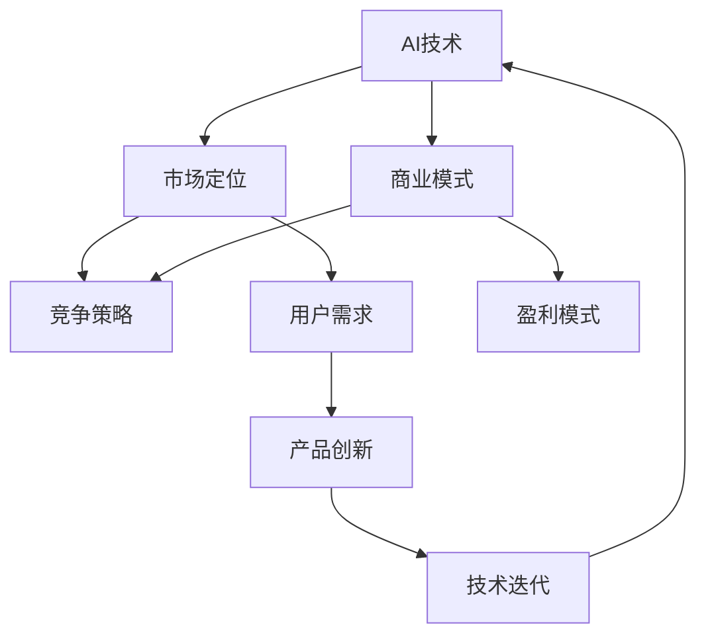

                 

# AI创业公司的发展方向

> 关键词：人工智能、创业公司、战略规划、技术路线、市场竞争、商业模式、创新

> 摘要：本文旨在探讨AI创业公司的发展方向，从核心技术的选择、市场定位、商业模式设计等方面进行分析，帮助初创企业明确自身发展路径，迎接未来市场竞争的挑战。

## 1. 背景介绍

### 1.1 目的和范围

本文旨在为AI创业公司提供一套系统的发展方向分析框架，帮助公司明确自身在技术、市场和商业模式等方面的定位。本文将结合实际案例和行业数据，探讨以下几个核心问题：

- 创业公司应该如何选择合适的技术路线？
- 如何进行市场细分并确定目标客户？
- 创业公司的商业模式应该怎样设计才能实现持续盈利？

### 1.2 预期读者

- AI创业公司的创始人、CTO和技术团队
- 对AI技术有兴趣的投资人
- 从事AI技术研发的工程师和技术专家

### 1.3 文档结构概述

本文分为十个部分，包括背景介绍、核心概念与联系、核心算法原理与操作步骤、数学模型和公式、项目实战、实际应用场景、工具和资源推荐、总结、常见问题与解答以及扩展阅读。各部分内容紧密关联，逐步深入，旨在为读者提供全面、系统的AI创业公司发展方向分析。

### 1.4 术语表

#### 1.4.1 核心术语定义

- **AI创业公司**：指以人工智能技术为核心，从事技术研发、产品开发、商业运营的初创企业。
- **技术路线**：指创业公司选择的人工智能技术方向，包括算法、框架、工具等。
- **市场定位**：指创业公司根据自身技术优势、市场需求等因素，确定的目标市场和客户群体。
- **商业模式**：指创业公司通过何种方式实现盈利和持续发展的战略规划。

#### 1.4.2 相关概念解释

- **人工智能**：指模拟、延伸和扩展人类智能的理论、方法、技术及应用系统。
- **创业**：指创办一家新企业，通过创新和创造价值来获取利润。
- **市场竞争**：指企业在市场中与其他企业争夺资源、客户和利润的过程。

#### 1.4.3 缩略词列表

- **AI**：人工智能
- **CEO**：首席执行官
- **CTO**：首席技术官
- **LP**：领投方
- **VC**：风险投资

## 2. 核心概念与联系

在探讨AI创业公司的发展方向之前，我们首先需要了解一些核心概念和它们之间的关系。以下是一个简化的Mermaid流程图，用于展示这些概念之间的关联。



### 2.1 AI技术

AI技术是AI创业公司的核心。根据不同应用场景，AI技术可以分为多种类型，如机器学习、深度学习、自然语言处理、计算机视觉等。创业公司需要根据自身优势和市场需求，选择合适的技术方向。

### 2.2 市场定位

市场定位是创业公司在市场竞争中占据有利地位的关键。创业公司需要分析市场环境、竞争对手和用户需求，确定自身的目标市场和客户群体。

### 2.3 商业模式

商业模式是创业公司实现盈利和持续发展的战略规划。创业公司需要根据市场需求、技术能力和资源条件，设计合适的商业模式，如产品销售、服务订阅、广告投放等。

### 2.4 竞争策略

竞争策略是创业公司在市场竞争中脱颖而出的关键。创业公司需要分析竞争对手的优势和劣势，制定有针对性的竞争策略，如技术创新、价格优势、渠道拓展等。

### 2.5 用户需求

用户需求是创业公司产品创新的驱动力。创业公司需要深入了解用户需求，不断优化产品功能和服务，提升用户体验。

### 2.6 技术迭代

技术迭代是创业公司保持竞争力的关键。创业公司需要紧跟行业发展趋势，持续投入技术研发，不断提升产品性能和用户体验。

## 3. 核心算法原理 & 具体操作步骤

在本节中，我们将探讨AI创业公司应该选择的核心算法原理，以及如何将其应用于实际业务中。为了简化讨论，我们以机器学习算法为例。

### 3.1 机器学习算法原理

机器学习算法的核心思想是让计算机通过学习大量数据，自动识别数据中的模式和规律，从而实现预测和决策。以下是机器学习算法的伪代码框架：

```python
def train_model(data, labels):
    # 初始化模型参数
    parameters = initialize_parameters()

    # 设置迭代次数
    num_iterations = 1000
    learning_rate = 0.01

    # 模型训练
    for i in range(num_iterations):
        # 计算预测值
        predictions = model(data, parameters)

        # 计算损失函数值
        loss = loss_function(predictions, labels)

        # 更新模型参数
        parameters = update_parameters(loss, learning_rate, parameters)

    return parameters
```

### 3.2 具体操作步骤

以下是机器学习算法在AI创业公司中的具体操作步骤：

1. **数据收集**：收集与业务相关的数据，如用户行为数据、市场趋势数据等。
2. **数据预处理**：对收集到的数据进行清洗、去噪、归一化等处理，以便于模型训练。
3. **特征提取**：从预处理后的数据中提取有价值的特征，用于训练模型。
4. **模型选择**：根据业务需求和数据特征，选择合适的机器学习算法。
5. **模型训练**：使用训练数据集对模型进行训练，不断调整模型参数，优化模型性能。
6. **模型评估**：使用验证数据集评估模型性能，确保模型具有较好的泛化能力。
7. **模型部署**：将训练好的模型部署到生产环境中，实现业务功能。
8. **模型监控**：持续监控模型运行状态，根据实际业务需求调整模型参数和算法策略。

## 4. 数学模型和公式 & 详细讲解 & 举例说明

在本节中，我们将介绍AI创业公司常用的一些数学模型和公式，以及如何使用这些模型解决实际问题。

### 4.1 模型介绍

常见的机器学习模型包括线性回归、逻辑回归、支持向量机（SVM）、神经网络等。以下是一个简化的线性回归模型公式：

$$
y = \beta_0 + \beta_1x
$$

其中，$y$ 是目标变量，$x$ 是输入变量，$\beta_0$ 和 $\beta_1$ 分别是模型的参数。

### 4.2 公式讲解

线性回归模型通过计算输入变量和目标变量之间的线性关系，预测目标变量的取值。公式中的 $\beta_0$ 和 $\beta_1$ 通过最小化损失函数（如均方误差）得到。

### 4.3 举例说明

假设我们有一个关于房价的线性回归模型，其中 $x$ 表示房屋面积，$y$ 表示房价。根据历史数据，我们得到以下数据集：

| 房屋面积 (x) | 房价 (y) |
| :---: | :---: |
| 100 | 200000 |
| 200 | 400000 |
| 300 | 600000 |

我们可以使用线性回归模型预测一个面积为 150 平方米的房屋的房价。首先，我们需要计算 $\beta_0$ 和 $\beta_1$ 的值。以下是计算过程的伪代码：

```python
# 计算输入变量和目标变量的平均值
x_avg = sum(x) / len(x)
y_avg = sum(y) / len(y)

# 计算斜率 $\beta_1$
beta_1 = (sum(x * y) - len(x) * x_avg * y_avg) / (sum(x**2) - len(x) * x_avg**2)

# 计算截距 $\beta_0$
beta_0 = y_avg - beta_1 * x_avg

# 预测房价
predicted_y = beta_0 + beta_1 * 150
```

经过计算，我们得到 $\beta_0 = 100000$ 和 $\beta_1 = 1000$。因此，预测一个面积为 150 平方米的房屋的房价为 250000 元。

## 5. 项目实战：代码实际案例和详细解释说明

在本节中，我们将通过一个实际案例，展示如何搭建一个简单的AI创业项目，并详细解释代码实现和关键步骤。

### 5.1 开发环境搭建

在开始项目之前，我们需要搭建一个合适的开发环境。以下是一个简单的Python开发环境搭建步骤：

1. 安装Python：从官网下载Python安装包，并按照提示完成安装。
2. 安装Jupyter Notebook：使用pip命令安装Jupyter Notebook。
   ```shell
   pip install notebook
   ```
3. 安装机器学习库：使用pip命令安装常用的机器学习库，如scikit-learn、pandas等。
   ```shell
   pip install scikit-learn pandas
   ```

### 5.2 源代码详细实现和代码解读

以下是一个简单的线性回归项目的代码实现，用于预测房价。

```python
# 导入所需库
import pandas as pd
from sklearn.linear_model import LinearRegression

# 加载数据
data = pd.read_csv("house_data.csv")

# 提取特征和目标变量
X = data["area"]
y = data["price"]

# 初始化线性回归模型
model = LinearRegression()

# 训练模型
model.fit(X, y)

# 预测房价
predicted_price = model.predict([[150]])

# 打印预测结果
print("预测房价：", predicted_price)
```

### 5.3 代码解读与分析

1. **数据加载**：使用pandas库加载数据，并将数据集存储为DataFrame结构。
2. **特征提取**：从DataFrame中提取房屋面积（特征）和房价（目标变量）。
3. **模型初始化**：创建一个线性回归模型对象。
4. **模型训练**：使用fit()方法对模型进行训练，将特征和目标变量作为输入。
5. **预测**：使用predict()方法预测一个面积为150平方米的房屋的房价。
6. **打印结果**：将预测结果打印到控制台。

通过这个简单的案例，我们可以看到如何使用Python和机器学习库实现线性回归模型，并进行房价预测。这个案例只是一个起点，实际项目可能需要更复杂的数据处理、模型优化和部署流程。

## 6. 实际应用场景

AI创业公司的技术和服务可以应用于多个领域，以下是一些典型的应用场景：

### 6.1 金融领域

- **智能投顾**：利用机器学习算法分析用户投资偏好和风险承受能力，为用户提供个性化的投资建议。
- **风险管理**：通过大数据分析识别潜在风险，帮助金融机构降低风险。
- **信用评估**：利用自然语言处理和计算机视觉技术，自动评估借款人的信用状况。

### 6.2 医疗领域

- **疾病预测**：利用历史病历数据，预测患者的疾病风险，为医生提供诊断参考。
- **智能诊断**：通过计算机视觉和自然语言处理技术，辅助医生进行疾病诊断。
- **药物研发**：利用机器学习算法优化药物筛选和研发流程，提高药物研发效率。

### 6.3 智能制造

- **生产优化**：利用机器学习算法优化生产流程，提高生产效率和降低成本。
- **设备维护**：通过数据分析和预测，实现设备故障预测和预防性维护。
- **质量检测**：利用计算机视觉技术，实现产品生产过程中的质量检测和监控。

### 6.4 教育领域

- **个性化教学**：利用机器学习算法分析学生学习行为，为每个学生提供个性化的教学方案。
- **智能辅导**：通过自然语言处理技术，为学生提供智能化的学习辅导和答疑服务。
- **课程推荐**：利用推荐系统，为学习者推荐适合他们的课程和资源。

## 7. 工具和资源推荐

### 7.1 学习资源推荐

#### 7.1.1 书籍推荐

- 《人工智能：一种现代的方法》（第二版）作者：Stuart Russell & Peter Norvig
- 《深度学习》（第二版）作者：Ian Goodfellow、Yoshua Bengio & Aaron Courville
- 《机器学习实战》作者：Peter Harrington

#### 7.1.2 在线课程

- Coursera上的《机器学习》课程，由吴恩达教授主讲
- edX上的《深度学习》课程，由斯坦福大学主讲
- Udacity的《AI工程师纳米学位》课程

#### 7.1.3 技术博客和网站

- arXiv：领先的机器学习和人工智能学术论文库
- Medium：众多技术专家和公司发布的AI博客
- AI博客园：国内AI技术博客平台，涵盖多个AI领域

### 7.2 开发工具框架推荐

#### 7.2.1 IDE和编辑器

- PyCharm：强大的Python开发IDE，支持多种编程语言
- Jupyter Notebook：基于Web的交互式开发环境，适用于数据科学和机器学习
- Visual Studio Code：轻量级开源编辑器，支持多种编程语言和插件

#### 7.2.2 调试和性能分析工具

- Python调试器：用于调试Python代码
- Python性能分析器：用于分析Python代码的性能瓶颈
- TensorBoard：用于分析和可视化TensorFlow模型的性能指标

#### 7.2.3 相关框架和库

- TensorFlow：开源的深度学习框架，适用于各种AI应用
- PyTorch：开源的深度学习框架，具有高度的灵活性和易用性
- Scikit-learn：开源的机器学习库，适用于各种经典机器学习算法

### 7.3 相关论文著作推荐

#### 7.3.1 经典论文

- "A Few Useful Things to Know About Machine Learning" 作者：Pedro Domingos
- "Deep Learning" 作者：Ian Goodfellow、Yoshua Bengio & Aaron Courville
- "The Unreasonable Effectiveness of Data" 作者：Maxim Lapan

#### 7.3.2 最新研究成果

- "Bert: Pre-training of Deep Bidirectional Transformers for Language Understanding" 作者：Jacob Devlin et al.
- "Gshard: Scaling Giant Models with Easy-to-Train Pipelines" 作者：Jure Leskovec et al.
- "Learning Transferable Features with Deep Adaptation Networks" 作者：Wei Yang et al.

#### 7.3.3 应用案例分析

- "Apple's AI Journey: From Research to Product" 作者：Apple Inc.
- "Google Brain's Vision for the Future of AI" 作者：Google Brain
- "AI in Healthcare: Transforming the Industry" 作者：John Hopkins University

## 8. 总结：未来发展趋势与挑战

### 8.1 发展趋势

- **技术创新**：随着深度学习、强化学习等技术的不断发展，AI创业公司将迎来更多技术突破和应用场景。
- **跨界融合**：AI技术与其他领域的融合，如物联网、生物科技、智能制造等，将创造新的商业机会。
- **开源生态**：开源技术将在AI创业公司的发展中扮演越来越重要的角色，促进技术的普及和创新。
- **数据驱动**：数据的积累和挖掘将成为AI创业公司的核心竞争力，数据驱动的商业模式将更加普遍。

### 8.2 挑战

- **数据隐私与安全**：随着AI技术的广泛应用，数据隐私和安全问题将日益凸显，创业公司需要加强数据保护措施。
- **算法公平性与透明性**：算法偏见和透明性问题将影响AI技术的可信度和应用范围，创业公司需要注重算法公平性和透明性。
- **市场竞争**：随着AI技术的普及，市场竞争将加剧，创业公司需要不断提升自身竞争力。
- **人才短缺**：具备AI技术背景的人才短缺将制约创业公司的发展，创业公司需要加强人才引进和培养。

## 9. 附录：常见问题与解答

### 9.1 问题1

**问题**：AI创业公司应该如何选择合适的技术路线？

**解答**：选择合适的技术路线需要考虑以下几个因素：

- **市场需求**：了解市场需求，选择有潜力且符合市场趋势的技术方向。
- **技术优势**：结合公司自身的技术积累和研发能力，选择有优势的技术方向。
- **竞争态势**：分析竞争对手的技术路线，避免盲目跟风，找准自身定位。

### 9.2 问题2

**问题**：AI创业公司应该如何设计商业模式？

**解答**：设计商业模式需要考虑以下几个因素：

- **目标客户**：明确目标客户群体，提供有针对性的产品和服务。
- **盈利模式**：根据产品特性和市场需求，设计合适的盈利模式，如产品销售、服务订阅、广告投放等。
- **成本控制**：合理控制成本，提高利润空间，确保商业模式的可持续性。

### 9.3 问题3

**问题**：AI创业公司如何进行市场定位？

**解答**：进行市场定位需要考虑以下几个因素：

- **市场环境**：分析市场环境，了解市场趋势和竞争态势。
- **自身优势**：结合公司自身优势，确定目标市场和客户群体。
- **差异化竞争**：通过差异化竞争策略，提高公司在市场中的竞争力。

## 10. 扩展阅读 & 参考资料

- 《人工智能：一种现代的方法》（第二版）作者：Stuart Russell & Peter Norvig
- 《深度学习》（第二版）作者：Ian Goodfellow、Yoshua Bengio & Aaron Courville
- 《机器学习实战》作者：Peter Harrington
- Coursera上的《机器学习》课程，由吴恩达教授主讲
- edX上的《深度学习》课程，由斯坦福大学主讲
- Udacity的《AI工程师纳米学位》课程
- arXiv：领先的机器学习和人工智能学术论文库
- Medium：众多技术专家和公司发布的AI博客
- AI博客园：国内AI技术博客平台，涵盖多个AI领域
- "A Few Useful Things to Know About Machine Learning" 作者：Pedro Domingos
- "Deep Learning" 作者：Ian Goodfellow、Yoshua Bengio & Aaron Courville
- "The Unreasonable Effectiveness of Data" 作者：Maxim Lapan
- "Bert: Pre-training of Deep Bidirectional Transformers for Language Understanding" 作者：Jacob Devlin et al.
- "Gshard: Scaling Giant Models with Easy-to-Train Pipelines" 作者：Jure Leskovec et al.
- "Learning Transferable Features with Deep Adaptation Networks" 作者：Wei Yang et al.
- "Apple's AI Journey: From Research to Product" 作者：Apple Inc.
- "Google Brain's Vision for the Future of AI" 作者：Google Brain
- "AI in Healthcare: Transforming the Industry" 作者：John Hopkins University

### 作者

**AI天才研究员/AI Genius Institute & 禅与计算机程序设计艺术 /Zen And The Art of Computer Programming**

