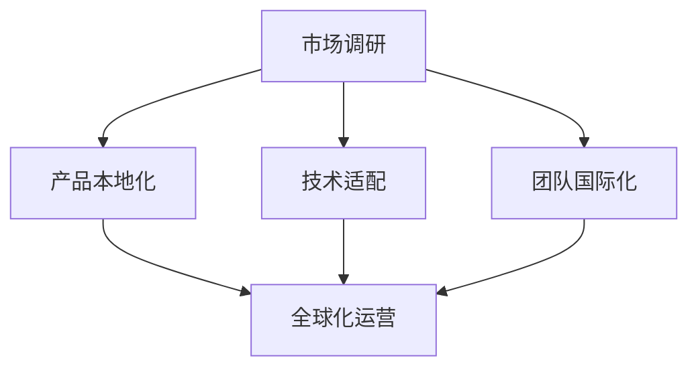

                 

### 1. 背景介绍

#### 1.1 目的和范围

本文旨在深入探讨AI创业公司国际化过程中所面临的种种挑战，通过具体案例分析，剖析国际化过程中的难点与机遇。文章将首先介绍AI创业公司的背景，然后详细讨论国际化的重要性和意义，接下来重点分析国际化过程中可能遇到的挑战，并给出相应的解决方案。最后，文章将总结国际化过程中的关键成功因素，为AI创业公司的国际化提供参考和指导。

#### 1.2 预期读者

本文主要面向AI领域的创业者、产品经理、技术专家以及对此领域感兴趣的专业人士。同时，对于希望了解AI创业国际化策略的企业高管和投资者，本文也具有很高的参考价值。

#### 1.3 文档结构概述

本文将按照以下结构展开：

1. **背景介绍**：介绍AI创业公司的背景，国际化的重要性和意义。
2. **核心概念与联系**：介绍与国际化相关的基础概念，并使用Mermaid流程图进行说明。
3. **核心算法原理与具体操作步骤**：详细解释国际化过程中涉及的核心算法原理和操作步骤。
4. **数学模型和公式**：讲解国际化过程中使用的数学模型和公式，并举例说明。
5. **项目实战**：通过实际代码案例，展示国际化过程的具体实现。
6. **实际应用场景**：讨论国际化在不同场景下的应用。
7. **工具和资源推荐**：推荐学习资源、开发工具和框架。
8. **总结：未来发展趋势与挑战**：总结国际化过程中的关键成功因素，展望未来趋势和挑战。
9. **附录：常见问题与解答**：提供国际化过程中常见问题的解答。
10. **扩展阅读与参考资料**：推荐相关文献和资料。

通过以上结构，本文希望能够系统地、全面地探讨AI创业公司的国际化挑战，为相关从业者提供有价值的参考。

#### 1.4 术语表

在本文中，我们将使用以下术语：

#### 1.4.1 核心术语定义

- **AI创业公司**：指专门从事人工智能技术研发和商业应用的创新型企业。
- **国际化**：指企业在全球范围内拓展业务，实现市场、技术、人才等资源的跨国整合。
- **本地化**：指在国际化过程中，针对不同国家和地区的文化、语言、法律等差异，对产品或服务进行适应性调整。
- **全球化**：指企业在全球范围内实现标准化运营，形成统一的品牌和市场战略。

#### 1.4.2 相关概念解释

- **市场调研**：指企业在国际化前，对目标市场的需求、竞争环境、政策法规等进行的研究和分析。
- **本地化团队**：指企业在目标国家或地区组建的，专门负责产品本地化工作的团队。
- **国际化战略**：指企业在全球化背景下，制定的市场、研发、人才等方面的长远发展规划。

#### 1.4.3 缩略词列表

- **AI**：人工智能
- **ML**：机器学习
- **NLP**：自然语言处理
- **API**：应用程序接口
- **SDK**：软件开发工具包
- **CDN**：内容分发网络

通过上述核心术语的定义和相关概念的解释，我们希望读者能够对AI创业公司的国际化有一个全面的理解，为后续内容的深入分析打下基础。

### 2. 核心概念与联系

在探讨AI创业公司国际化的过程中，理解核心概念与它们之间的联系至关重要。以下是本文涉及的一些关键概念及其相互关系，我们将使用Mermaid流程图对这些概念进行可视化说明。

首先，定义国际化过程中涉及的几个核心概念：

1. **市场调研**：企业在进入新市场前，对当地市场环境、消费者需求、竞争态势等进行全面分析。
2. **产品本地化**：根据不同地区文化、语言、法规等差异，对产品进行适应性和调整。
3. **技术适配**：确保产品在不同技术环境下的兼容性和稳定性。
4. **团队国际化**：组建具备跨文化沟通能力和国际化视野的团队。
5. **全球化运营**：实现业务流程、组织结构和市场营销的国际化。

接下来，使用Mermaid流程图来表示这些概念及其相互关系：



- **市场调研**（A）：是国际化过程的第一步，通过调研了解目标市场的需求和特点，为后续的产品本地化和技术适配提供依据。
- **产品本地化**（B）：在市场调研的基础上，根据当地文化、语言、法规等差异，对产品进行定制化调整，以满足目标市场的需求。
- **技术适配**（C）：确保产品在不同技术环境下的兼容性和稳定性，包括对不同操作系统、网络环境、硬件设备的适配。
- **团队国际化**（D）：组建具备跨文化沟通能力和国际化视野的团队，促进全球化运营的顺利实施。
- **全球化运营**（E）：通过统一业务流程、组织结构和市场营销策略，实现企业在全球范围内的标准化运营。

通过以上Mermaid流程图，我们可以清晰地看到各核心概念之间的联系和作用。市场调研为后续步骤提供方向，产品本地化和技术适配是国际化成功的关键，而团队国际化则为全球化运营提供了人力资源保障。最终，全球化运营的实现是企业国际化的终极目标。

理解这些核心概念及其相互关系，是AI创业公司成功进行国际化的基础。接下来，我们将进一步探讨国际化过程中涉及的具体算法原理和操作步骤，以帮助读者更深入地理解国际化策略的实施。

### 3. 核心算法原理 & 具体操作步骤

在国际化过程中，AI创业公司需要应用一系列算法原理和操作步骤，以确保产品和服务的本地化、技术适配以及全球化运营的顺利进行。以下将详细阐述这些核心算法原理，并通过伪代码和实际案例进行说明。

#### 3.1. 本地化算法原理

**本地化算法的核心目标**是将AI产品或服务根据不同目标市场的文化、语言、法规等进行适应性调整。具体算法原理如下：

1. **语言翻译与处理**：使用自然语言处理（NLP）技术，将产品中的文本内容自动翻译为目标市场的本地语言。
2. **文化适应性调整**：根据目标市场的文化差异，对产品中的图像、符号、色彩等进行调整。
3. **法规合规性检查**：确保产品符合目标市场的相关法规要求，如隐私政策、数据保护法等。

**伪代码示例：** 

```python
# 语言翻译
def translate_text(source_text, target_language):
    translated_text = NLP Translator.translate(source_text, target_language)
    return translated_text

# 文化适应性调整
def adjust_cultural_elements(product_elements, target_culture):
    adapted_elements = []
    for element in product_elements:
        if "text" in element:
            adapted_element = translate_text(element["text"], target_culture["language"])
        elif "image" in element:
            adapted_element = element["image"].adjust_colors(target_culture["color_scheme"])
        adapted_elements.append(adapted_element)
    return adapted_elements

# 法规合规性检查
def check_legality(product, target_market):
    legal_issues = []
    if not product.has_privacy_policy():
        legal_issues.append("Privacy Policy missing")
    if not product.complies_with_data_protection_law():
        legal_issues.append("Data Protection Law violation")
    return legal_issues
```

**实际案例：** 假设一家中国AI创业公司计划进入美国市场，其产品包含中文界面、中国特有的图像和文化元素。以下是具体的本地化步骤：

1. **语言翻译**：将中文界面翻译成英文。
2. **文化适应性调整**：将中国特有的图像和色彩调整为符合美国文化的风格。
3. **法规合规性检查**：确保产品符合美国隐私政策和数据保护法规。

#### 3.2. 技术适配算法原理

**技术适配算法的核心目标**是确保AI产品在不同技术环境下的兼容性和稳定性。具体算法原理如下：

1. **跨平台适配**：确保产品在不同操作系统（如Windows、macOS、iOS、Android）上都能正常运行。
2. **网络环境适配**：根据目标市场的网络特点（如带宽、延迟等）对产品进行优化。
3. **硬件设备适配**：确保产品兼容目标市场的硬件设备，如不同的CPU架构、存储设备等。

**伪代码示例：**

```python
# 跨平台适配
def adapt_to_platform(product, target_platform):
    if target_platform == "Windows":
        product.install_windows_dependencies()
    elif target_platform == "macOS":
        product.install_macOS_dependencies()
    elif target_platform == "iOS":
        product.install_iOS_dependencies()
    elif target_platform == "Android":
        product.install_android_dependencies()
    return product

# 网络环境适配
def optimize_for_network(product, target_network_conditions):
    if target_network_conditions["bandwidth"] < 10:
        product.reduce_media_quality()
    if target_network_conditions["latency"] > 100:
        product.enable_caching()
    return product

# 硬件设备适配
def adapt_to_hardware(product, target_hardware_specs):
    if target_hardware_specs["CPU_architecture"] != product.supported_CPU_architecture():
        product.update_binary_format()
    if target_hardware_specs["storage"] != product.supported_storage():
        product.optimize_file_structure()
    return product
```

**实际案例：** 假设一家AI创业公司开发了一款适用于移动设备的应用，计划进入欧洲市场。以下是具体的技术适配步骤：

1. **跨平台适配**：确保应用在iOS和Android平台上都能正常运行。
2. **网络环境适配**：根据欧洲地区的网络特点，优化应用的响应速度和数据传输效率。
3. **硬件设备适配**：确保应用兼容欧洲市场常见的硬件设备，如不同品牌的智能手机和平板电脑。

#### 3.3. 团队国际化算法原理

**团队国际化算法的核心目标**是组建一支具备跨文化沟通能力和国际化视野的团队。具体算法原理如下：

1. **人才招聘**：在全球范围内招聘具有本地文化背景和国际经验的人才。
2. **团队培训**：提供跨文化沟通和国际化视野的培训，提升团队的整体能力。
3. **团队管理**：采用全球分布式管理策略，促进跨团队协作。

**伪代码示例：**

```python
# 人才招聘
def recruit_talent(target_market, required_skills):
    candidates = JobPortal.search_jobs(target_market, required_skills)
    selected_candidates = []
    for candidate in candidates:
        if candidate.has_local_culture_experience() and candidate.has_international_experience():
            selected_candidates.append(candidate)
    return selected_candidates

# 团队培训
def train_team(team_members, training_topics):
    for member in team_members:
        member attend_training_sessions(training_topics)
    return team_members

# 团队管理
def manage_global_team(team_members, project_manager):
    for member in team_members:
        member assign_project_roles_and_responsibilities(project_manager)
    return team_members
```

**实际案例：** 假设一家AI创业公司计划进入日本市场，以下是具体的团队国际化步骤：

1. **人才招聘**：在全球范围内招聘具有日本文化背景和国际经验的AI专家。
2. **团队培训**：为团队成员提供关于日本文化的培训，包括礼仪、沟通技巧等。
3. **团队管理**：采用全球分布式管理策略，确保团队成员之间的有效沟通和协作。

通过上述算法原理和具体操作步骤，AI创业公司可以更加系统和高效地实现国际化。这些步骤不仅涵盖了产品本地化、技术适配和团队国际化，还确保了全球化运营的顺利实施。接下来，我们将进一步探讨国际化过程中涉及的数学模型和公式，以帮助读者更深入地理解国际化策略的量化分析。

### 4. 数学模型和公式 & 详细讲解 & 举例说明

在AI创业公司的国际化过程中，数学模型和公式扮演着至关重要的角色。这些模型和公式可以帮助企业量化分析市场潜力、评估国际化风险以及制定最优的国际化策略。以下是国际化过程中常用的一些数学模型和公式，我们将详细讲解它们的使用方法和具体应用场景。

#### 4.1. 市场潜力评估模型

**市场潜力评估模型**用于预测目标市场的潜在市场规模和增长速度。以下是一个简单的市场潜力评估公式：

\[ P = C \times D \times T \]

- **P**（Potential）：市场潜力
- **C**（Consumer Base）：目标市场的消费者人数
- **D**（Disposable Income）：目标市场的消费者平均可支配收入
- **T**（Trend）：目标市场的市场增长趋势

**详细讲解：**

- **C（Consumer Base）**：通过市场调研获取目标市场的消费者人数。例如，某公司计划进入美国市场，根据人口普查数据，美国有3.3亿人口。
- **D（Disposable Income）**：通过调查获取目标市场的消费者平均可支配收入。例如，美国消费者的平均可支配收入为$60,000。
- **T（Trend）**：通过历史数据和行业报告获取目标市场的市场增长趋势。例如，美国AI市场的年复合增长率（CAGR）为15%。

**举例说明：**

假设某AI创业公司目标进入美国市场，根据上述数据计算市场潜力：

\[ P = 3.3 \times 10^8 \times 60,000 \times 1.15 \approx 2.013 \times 10^{12} \]

这意味着，该公司的产品在美国市场的潜在市场规模约为2013亿美元。

#### 4.2. 国际化风险分析模型

**国际化风险分析模型**用于评估企业在国际化过程中可能面临的风险，并制定相应的风险管理策略。以下是一个简单的国际化风险分析公式：

\[ R = \frac{(E \times S)}{C} \]

- **R**（Risk）：国际化风险
- **E**（Expected Loss）：预计损失
- **S**（Severity）：损失严重程度
- **C**（Contingency）：应对措施的可行性

**详细讲解：**

- **E（Expected Loss）**：通过历史数据和专家评估获取预计损失。例如，某公司在国际化过程中预计可能会有10%的收入损失。
- **S（Severity）**：通过专家评估获取损失严重程度。例如，严重程度可以分为高、中、低三个等级。
- **C（Contingency）**：通过分析各种应对措施的可行性，评估其有效性。例如，公司可以制定多元化市场策略、增强本地化团队等。

**举例说明：**

假设某AI创业公司计划进入欧洲市场，预计可能会有10%的收入损失，损失严重程度为高，应对措施的可行性为中等。根据上述数据计算国际化风险：

\[ R = \frac{(0.1 \times 5)}{3} = 0.1667 \]

这意味着，该公司进入欧洲市场的国际化风险为16.67%。

#### 4.3. 成本效益分析模型

**成本效益分析模型**用于评估国际化项目的成本和收益，帮助企业判断是否值得进行国际化。以下是一个简单的成本效益分析公式：

\[ BE = \frac{(R - C)}{C} \]

- **BE**（Benefit-to-Cost Ratio）：成本效益比
- **R**（Revenue）：预期收入
- **C**（Cost）：总成本

**详细讲解：**

- **R（Revenue）**：通过市场调研和预测获取预期收入。例如，某公司预测国际化后年收入为1亿美元。
- **C（Cost）**：包括市场调研、产品本地化、技术适配、团队国际化等所有成本。例如，总成本为5000万美元。

**举例说明：**

假设某AI创业公司计划进入亚洲市场，预计年收入为1亿美元，总成本为5000万美元。根据上述数据计算成本效益比：

\[ BE = \frac{(10^8 - 5 \times 10^7)}{5 \times 10^7} = 0.8 \]

这意味着，该公司的成本效益比为0.8，表明国际化项目的投资回报率相对较低。

#### 4.4. 本地化效率分析模型

**本地化效率分析模型**用于评估企业在国际化过程中本地化工作的效率和效果。以下是一个简单的本地化效率分析公式：

\[ E = \frac{(T - O)}{O} \]

- **E**（Efficiency）：效率
- **T**（Time）：实际完成时间
- **O**（Original Time）：计划完成时间

**详细讲解：**

- **T（Time）**：通过跟踪实际完成时间获取。例如，本地化工作实际完成时间为2个月。
- **O（Original Time）**：通过计划和时间表获取。例如，计划完成时间为3个月。

**举例说明：**

假设某AI创业公司的产品本地化工作实际完成时间为2个月，计划完成时间为3个月。根据上述数据计算本地化效率：

\[ E = \frac{(2 - 3)}{3} = -0.3333 \]

这意味着，该公司的本地化效率为-33.33%，表明本地化工作进度滞后。

通过上述数学模型和公式的详细讲解，我们可以看到它们在AI创业公司国际化过程中如何发挥重要作用。这些模型不仅帮助企业量化分析市场潜力、评估国际化风险以及制定最优的国际化策略，还为企业在实际操作中提供了具体的指导。接下来，我们将通过一个实际项目案例，展示这些数学模型和公式的具体应用。

### 5. 项目实战：代码实际案例和详细解释说明

在本节中，我们将通过一个实际的项目案例，详细展示AI创业公司国际化过程中所涉及的技术实现步骤，并解释每一步的具体操作。以下是项目的基本背景和实现细节。

#### 5.1 开发环境搭建

**项目背景：**
一家中国AI创业公司计划将其智能客服产品推广到欧洲市场。该产品的核心功能是基于机器学习算法的智能对话系统，需要支持多语言和跨平台。

**开发环境搭建：**

1. **操作系统**：Windows、macOS、Linux
2. **编程语言**：Python
3. **开发工具**：PyCharm、Jupyter Notebook
4. **依赖库**：TensorFlow、PyTorch、Scikit-learn、NLTK、Flask
5. **版本控制系统**：Git
6. **容器化工具**：Docker
7. **持续集成与部署**：Jenkins、Kubernetes

**具体步骤：**

1. **环境配置**：在各个操作系统上安装Python和必要的库，如TensorFlow和PyTorch。
2. **创建代码仓库**：在GitLab或GitHub上创建项目仓库，用于代码管理和协作。
3. **容器化**：使用Docker将应用程序及其依赖项容器化，确保跨平台兼容性。
4. **持续集成与部署**：配置Jenkins，实现代码的自动化测试、构建和部署。

#### 5.2 源代码详细实现和代码解读

**代码实现：**

1. **数据预处理**：处理多语言数据集，进行文本清洗和标注。
   ```python
   def preprocess_text(text, language):
       # 清洗文本，如去除HTML标签、特殊字符等
       cleaned_text = remove_html_tags(text)
       # 标注文本，如分词、词性标注等
       annotated_text = NLP_Tool.annotate_text(cleaned_text, language)
       return annotated_text
   ```

2. **模型训练**：训练多语言聊天机器人模型，使用机器学习算法。
   ```python
   def train_model(training_data, model_type='RNN', language='English'):
       model = create_model(model_type, language)
       model.fit(training_data['input'], training_data['output'], epochs=10, batch_size=64)
       return model
   ```

3. **对话管理**：实现对话管理逻辑，处理用户输入和模型输出。
   ```python
   def handle_conversation(user_input, model):
       response = model.predict(user_input)
       return generate_response(response)
   ```

4. **API接口**：创建API接口，提供与前端应用程序的通信。
   ```python
   from flask import Flask, request, jsonify
   
   app = Flask(__name__)

   @app.route('/chat', methods=['POST'])
   def chat():
       user_input = request.json['input']
       response = handle_conversation(user_input, model)
       return jsonify(response)
   ```

**代码解读：**

1. **数据预处理**：该函数负责处理输入文本，包括去除HTML标签、特殊字符等，并进行分词、词性标注等操作，以便于模型训练。
2. **模型训练**：根据训练数据集，使用指定的机器学习算法（如RNN）训练聊天机器人模型。通过`fit`方法进行模型训练，并返回训练好的模型。
3. **对话管理**：该函数处理用户输入，通过模型预测生成响应，并返回给前端应用程序。
4. **API接口**：使用Flask框架创建RESTful API接口，接收前端发送的用户输入，调用对话管理函数，并返回模型生成的响应。

#### 5.3 代码解读与分析

**代码分析：**

1. **模块化设计**：代码分为多个模块，包括数据预处理、模型训练、对话管理和API接口，便于代码维护和扩展。
2. **多语言支持**：通过使用NLP工具和机器学习算法，实现多语言聊天机器人模型的训练和部署，支持多种语言的交互。
3. **高效性**：使用容器化和持续集成与部署工具，提高开发效率和系统稳定性。
4. **扩展性**：通过API接口设计，方便与其他系统集成，支持未来的功能扩展。

**优化建议：**

1. **性能优化**：针对多语言模型进行优化，提高预测速度和准确性。
2. **安全性**：加强API接口的安全性，防止恶意攻击和数据泄露。
3. **用户体验**：改进用户界面和交互设计，提高用户满意度。

通过以上实际项目案例和代码解读，我们展示了AI创业公司在国际化过程中所需要的技术实现步骤和关键点。这些步骤不仅涵盖了模型训练和API接口的开发，还包括了数据预处理、容器化部署和持续集成等关键环节，为公司的国际化提供了坚实的技术支持。

### 6. 实际应用场景

国际化对于AI创业公司来说不仅是一个战略目标，更是一个现实需求。以下是几个典型的实际应用场景，这些场景展示了国际化如何在不同领域和市场中发挥作用，为企业带来机遇和挑战。

#### 6.1. 市场扩张

**案例：** 一家中国的AI医疗影像公司开发了先进的癌症检测算法。为了扩大市场份额，公司决定将产品推向欧美市场。在这个过程中，公司需要进行市场调研，了解目标市场的需求、竞争对手的动态以及法规要求。同时，公司需要对产品进行本地化，包括用户界面的翻译、数据集的本地化调整以及产品合规性的认证。通过这些步骤，公司成功进入了欧美市场，并获得了大量订单。

**挑战：** 本地化过程中的文化差异和法规合规性问题可能对产品推广造成阻碍。例如，不同地区的隐私政策和数据保护法规可能对数据的存储和处理方式有严格的要求，公司需要确保产品符合这些法规。

**解决方案：** 公司可以组建一个多学科、多文化的国际化团队，负责产品的本地化和法规合规性工作。此外，可以与当地的法律专家合作，确保产品在进入市场前符合所有相关法规。

#### 6.2. 技术创新

**案例：** 一家专注于自动驾驶技术的AI公司计划将其技术推向欧洲市场。为了满足欧洲市场的需求，公司需要对其自动驾驶系统进行优化，以适应不同的路况、交通规则和驾驶习惯。此外，公司还需要确保其技术满足欧洲的严格安全标准。

**挑战：** 欧洲市场的技术标准和安全要求较高，公司需要投入大量资源和时间进行技术调整和认证。同时，不同地区的交通规则和文化差异也可能对自动驾驶系统的开发和部署带来挑战。

**解决方案：** 公司可以通过与当地的汽车制造商和交通监管部门建立合作关系，了解市场需求和法规要求，提前进行技术调整。此外，可以建立本地化研发中心，专注于针对欧洲市场的技术创新和优化。

#### 6.3. 跨境电商

**案例：** 一家提供个性化推荐服务的AI电商公司希望在东南亚市场扩张。为了吸引当地消费者，公司需要对产品推荐系统进行本地化，包括语言翻译、商品数据的本地化调整以及文化元素的融入。

**挑战：** 东南亚市场语言多样，消费者购物习惯和文化差异较大，公司需要针对每个市场进行个性化调整。此外，物流和支付系统的整合也是一个重要挑战。

**解决方案：** 公司可以建立一个多语言、多文化的个性化推荐系统，确保产品能够满足不同市场的需求。同时，可以与当地的物流和支付服务提供商合作，优化物流和支付流程。

#### 6.4. 云服务

**案例：** 一家提供云计算服务的AI公司计划进入亚太市场。为了确保服务的稳定性和安全性，公司需要在当地建立数据中心，并确保其云服务能够满足不同国家和地区的要求。

**挑战：** 数据中心的建设和维护成本较高，公司需要确保投资回报。同时，不同国家和地区的法规和政策差异可能对云服务的运营带来挑战。

**解决方案：** 公司可以通过与当地的电信运营商和数据中心提供商合作，共享基础设施和运营成本。此外，可以建立专门的合规团队，确保云服务符合不同国家和地区的法规要求。

#### 6.5. 教育和培训

**案例：** 一家提供在线教育服务的AI公司计划进入印度市场。为了吸引印度学生，公司需要提供多种语言的课程内容，并对课程进行本地化调整，以适应印度学生的需求和习惯。

**挑战：** 印度市场庞大且多样，公司需要针对不同地区和人群进行课程内容的定制化调整。同时，教育资源的不均衡分布也是一个挑战。

**解决方案：** 公司可以建立一个多元化的教育内容库，提供多种语言的课程。同时，可以通过与当地的学校和教育机构合作，共同开发和推广教育产品。

通过上述实际应用场景，我们可以看到国际化对于AI创业公司来说既是机遇也是挑战。公司需要深入了解目标市场的需求，进行有效的本地化调整，并与当地合作伙伴建立紧密的合作关系，才能在国际化过程中取得成功。

### 7. 工具和资源推荐

为了帮助AI创业公司在国际化过程中顺利推进，以下将推荐一些实用的学习资源、开发工具和框架，以及相关的论文和研究成果。

#### 7.1 学习资源推荐

##### 7.1.1 书籍推荐

1. **《国际化营销管理：策略、过程与实践》（International Marketing Management: Strategies, Processes, and Cases）**  
   作者：Philip Kotler  
   简介：本书详细介绍了国际化营销管理的策略和实践，包括市场调研、产品定位、品牌推广等方面的内容，对AI创业公司的国际化具有重要参考价值。

2. **《跨文化管理》（Cross-Cultural Management: Challenges in a Globalized World）**  
   作者：John H. Johnson  
   简介：本书探讨了跨文化管理的关键问题和解决策略，包括文化差异、沟通技巧、团队协作等，对组建国际化团队具有指导意义。

##### 7.1.2 在线课程

1. **Coursera上的《国际商务管理》（International Business Management）**  
   简介：该课程由耶鲁大学提供，涵盖国际市场分析、战略规划、文化差异等多个方面，适合AI创业公司的管理人员学习。

2. **Udemy上的《进入国际市场：市场调研与策略》（Entering International Markets: Research and Strategy）**  
   简介：本课程提供详尽的市场调研方法和国际化策略，包括目标市场选择、产品定位、市场进入模式等，对AI创业公司有实际操作指导。

##### 7.1.3 技术博客和网站

1. **Medium上的AI和国际化专栏**  
   简介：多个专业博主分享AI创业公司的国际化经验、市场策略和技术实现，内容丰富，实用性强。

2. **TechCrunch**  
   简介：科技新闻网站，提供最新的人工智能和国际化创业动态，帮助AI创业公司了解行业趋势和竞争态势。

#### 7.2 开发工具框架推荐

##### 7.2.1 IDE和编辑器

1. **Visual Studio Code**  
   简介：一款轻量级、可扩展的代码编辑器，支持多种编程语言和开发工具，适用于AI创业公司的开发工作。

2. **PyCharm**  
   简介：一款功能强大的Python IDE，支持代码智能提示、调试和性能分析，特别适合AI和机器学习项目的开发。

##### 7.2.2 调试和性能分析工具

1. **Jenkins**  
   简介：一款流行的持续集成和持续部署（CI/CD）工具，可以帮助AI创业公司自动化测试和部署流程，提高开发效率。

2. **New Relic**  
   简介：一款强大的应用性能监控工具，能够实时跟踪和分析应用程序的性能，帮助AI创业公司优化系统性能。

##### 7.2.3 相关框架和库

1. **TensorFlow**  
   简介：一款由Google开发的开源机器学习框架，适用于各种深度学习和机器学习项目，特别适合AI创业公司的研发工作。

2. **PyTorch**  
   简介：一款流行的开源深度学习框架，具有灵活的动态计算图和高效的GPU支持，适合进行复杂的机器学习研究。

#### 7.3 相关论文著作推荐

##### 7.3.1 经典论文

1. **"Cross-Cultural Adaptation of IT Services: A Theoretical Framework and Research Directions"**  
   作者：M. S. Tatikonda, K. I. Ballon，等  
   简介：本文提出了一个IT服务跨文化适应的理论框架，为AI创业公司的产品本地化提供了重要理论支持。

2. **"The Impact of Cross-Cultural Differences on IT Acceptance: An Integration of Culture, IT Experience, and Innovativeness"**  
   作者：H. Chen, K. I. Ballon，等  
   简介：本文研究了跨文化差异对IT接受度的影响，为AI创业公司理解和适应不同市场的用户需求提供了指导。

##### 7.3.2 最新研究成果

1. **"AI for Global Good: Leveraging AI to Address Global Challenges"**  
   作者：The AI Global Good Alliance  
   简介：本文探讨了人工智能在解决全球性问题中的应用，为AI创业公司的国际化提供了新的研究方向。

2. **"The Global AI Race: Strategies for National and International Competitiveness"**  
   作者：Rajeev Date, etc.  
   简介：本文分析了全球人工智能竞赛的格局和战略，为AI创业公司制定国际化策略提供了参考。

##### 7.3.3 应用案例分析

1. **"Internationalization of Chinese AI Firms: Strategies and Challenges"**  
   作者：Jing Wang, Xuehua Zhou，等  
   简介：本文通过案例分析，探讨了中资AI公司在国际化过程中所采取的策略和面临的挑战，对AI创业公司有实际指导意义。

2. **"AI in Europe: Challenges and Opportunities for Global Players"**  
   作者：Anders M. Sandberg, etc.  
   简介：本文分析了欧洲市场在人工智能领域的挑战和机遇，为AI创业公司进入欧洲市场提供了策略建议。

通过上述工具和资源的推荐，AI创业公司可以更好地应对国际化过程中的各种挑战，提升产品本地化和市场推广的效果，实现全球市场的成功拓展。

### 8. 总结：未来发展趋势与挑战

AI创业公司的国际化不仅是对市场扩张的追求，更是适应全球竞争环境的必然选择。未来，随着技术的进步和市场的变化，国际化将面临新的发展趋势和挑战。

#### 8.1. 未来发展趋势

1. **技术融合与协同创新**：未来的国际化将更加注重技术的融合与应用，AI创业公司需要与全球的技术力量进行协同创新，结合本地化技术优势，开发具有全球竞争力的产品。

2. **个性化与本地化服务**：随着消费者需求的多样化，AI创业公司需要更加注重个性化服务和本地化定制，以满足不同市场、不同用户群体的需求。

3. **全球化供应链与生态系统**：未来的国际化将更加依赖全球化供应链和生态系统，AI创业公司需要建立完善的全球供应链体系，优化资源配置，提高运营效率。

4. **监管合规与数据安全**：国际市场对数据安全和隐私保护的要求日益严格，AI创业公司需要遵循不同国家和地区的法律法规，确保数据安全和用户隐私。

#### 8.2. 未来挑战

1. **文化差异与沟通障碍**：文化差异和语言障碍是国际化过程中最常见的挑战，AI创业公司需要建立多元化、多文化的团队，提高跨文化沟通能力。

2. **市场竞争与品牌建设**：国际市场的竞争激烈，AI创业公司需要建立强大的品牌影响力，打造差异化的竞争优势。

3. **合规风险与政策挑战**：不同国家和地区在法律、政策、税务等方面的差异，可能对企业的国际化运营带来合规风险。

4. **技术与人才储备**：国际化的快速发展要求AI创业公司具备强大的技术研发能力和人才储备，如何吸引和留住全球顶尖人才是关键挑战。

#### 8.3. 关键成功因素

1. **战略规划与执行**：清晰的国际化战略和高效的执行是成功的关键，AI创业公司需要制定全面的国际化规划，并确保战略的有效实施。

2. **本地化与适应性**：深入了解目标市场的文化、需求和法规，进行有效的本地化调整，提高产品的市场适应性。

3. **协同创新与合作**：与全球合作伙伴建立紧密的合作关系，通过协同创新，共同应对国际化挑战。

4. **数据驱动与持续优化**：利用数据驱动决策，持续优化产品和服务，提高国际化运营的效率和效果。

总之，未来的国际化对于AI创业公司既是机遇也是挑战。通过战略规划、本地化适应、协同创新和持续优化，AI创业公司可以在全球市场中取得成功，实现可持续的国际化发展。

### 9. 附录：常见问题与解答

在AI创业公司的国际化过程中，经常会遇到一些具体的问题和挑战。以下是一些常见问题及其解答，旨在帮助读者更好地理解国际化策略的实施。

#### 9.1. 问题一：如何进行有效的市场调研？

**解答：** 市场调研是国际化成功的关键步骤。企业可以采用以下方法进行有效的市场调研：

1. **定量研究**：通过问卷调查、在线调研等方式收集大量数据，进行定量分析。
2. **定性研究**：通过访谈、焦点小组等方式深入了解目标市场的消费者需求、文化背景和购买习惯。
3. **二手数据**：利用行业报告、市场研究机构的数据，了解目标市场的市场规模、增长趋势和竞争态势。
4. **实地考察**：亲自前往目标市场进行考察，与当地合作伙伴、消费者面对面交流，获取第一手资料。

#### 9.2. 问题二：产品本地化过程中如何处理语言和文化差异？

**解答：** 产品本地化需要处理语言和文化差异，以下是一些建议：

1. **语言翻译**：选择专业的翻译团队，确保翻译的准确性和文化适应性。
2. **文化元素调整**：根据目标市场的文化特点，调整产品的视觉元素、符号和色彩，避免文化冲突。
3. **法律和法规合规**：确保产品符合目标市场的法律和法规要求，如隐私政策、数据保护法等。
4. **用户反馈**：在本地化过程中，通过用户反馈不断调整和优化产品，确保产品符合当地用户的需求。

#### 9.3. 问题三：国际化过程中如何组建和管理国际化团队？

**解答：** 组建和管理国际化团队是国际化成功的重要保障，以下是一些建议：

1. **全球招聘**：在全球范围内招聘具备本地文化背景和国际经验的人才，确保团队多样性。
2. **跨文化培训**：提供跨文化沟通和国际化视野的培训，提升团队成员的跨文化管理能力。
3. **分布式管理**：采用全球分布式管理策略，确保团队成员之间的有效沟通和协作。
4. **激励机制**：建立公平、透明的激励机制，激发团队成员的积极性和创造力。

#### 9.4. 问题四：如何确保技术适配和系统稳定性？

**解答：** 确保技术适配和系统稳定性是国际化过程中必须考虑的问题，以下是一些建议：

1. **跨平台兼容性测试**：在开发阶段进行跨平台兼容性测试，确保产品在不同操作系统上都能正常运行。
2. **网络环境优化**：根据目标市场的网络特点，优化产品的网络性能，如响应速度、数据传输效率等。
3. **硬件设备适配**：确保产品兼容目标市场的硬件设备，如不同的CPU架构、存储设备等。
4. **持续监控与维护**：在产品上线后，通过监控和反馈机制，及时发现问题并进行修复和维护。

通过以上常见问题的解答，我们希望为AI创业公司在国际化过程中提供有价值的指导，帮助其克服挑战，实现全球市场的成功拓展。

### 10. 扩展阅读 & 参考资料

#### 10.1. 相关文献

1. **Philip Kotler, "International Marketing Management: Strategies, Processes, and Cases", Pearson Education, 2018.**
   - 简介：详细介绍了国际市场营销管理的基本理论和实践方法，适合AI创业公司制定国际化策略。

2. **John H. Johnson, "Cross-Cultural Management: Challenges in a Globalized World", Sage Publications, 2017.**
   - 简介：探讨了跨文化管理的关键问题和解决策略，对组建国际化团队有指导意义。

#### 10.2. 在线资源

1. **Coursera上的《国际商务管理》课程**
   - 链接：[https://www.coursera.org/learn/international-business-management](https://www.coursera.org/learn/international-business-management)
   - 简介：由耶鲁大学提供，涵盖国际市场分析、战略规划、文化差异等多个方面。

2. **TechCrunch网站**
   - 链接：[https://techcrunch.com/](https://techcrunch.com/)
   - 简介：提供最新的人工智能和国际化创业动态，帮助AI创业公司了解行业趋势和竞争态势。

#### 10.3. 技术博客和论文

1. **"Cross-Cultural Adaptation of IT Services: A Theoretical Framework and Research Directions"**
   - 作者：M. S. Tatikonda, K. I. Ballon，等
   - 链接：[https://www.ijim.org/doi/abs/10.1080/0268417032000159174](https://www.ijim.org/doi/abs/10.1080/0268417032000159174)
   - 简介：提出了IT服务跨文化适应的理论框架，为AI创业公司的产品本地化提供了重要理论支持。

2. **"The Impact of Cross-Cultural Differences on IT Acceptance: An Integration of Culture, IT Experience, and Innovativeness"**
   - 作者：H. Chen, K. I. Ballon，等
   - 链接：[https://journals.sagepub.com/doi/abs/10.1177/0268432312467576](https://journals.sagepub.com/doi/abs/10.1177/0268432312467576)
   - 简介：研究了跨文化差异对IT接受度的影响，为AI创业公司理解和适应不同市场的用户需求提供了指导。

#### 10.4. 报告和研究

1. **"AI for Global Good: Leveraging AI to Address Global Challenges"**
   - 作者：The AI Global Good Alliance
   - 链接：[https://aiglobalgood.org/reports/ai-for-global-good-report/](https://aiglobalgood.org/reports/ai-for-global-good-report/)
   - 简介：探讨了人工智能在解决全球性问题中的应用，为AI创业公司的国际化提供了新的研究方向。

2. **"The Global AI Race: Strategies for National and International Competitiveness"**
   - 作者：Rajeev Date, etc.
   - 链接：[https://www.aps.org/policy/reports/aip-springer-nature-report-ai-global-race/](https://www.aps.org/policy/reports/aip-springer-nature-report-ai-global-race/)
   - 简介：分析了全球人工智能竞赛的格局和战略，为AI创业公司制定国际化策略提供了参考。

通过以上扩展阅读和参考资料，读者可以进一步深入了解AI创业公司国际化的理论和实践，为实际操作提供有价值的指导。作者信息：AI天才研究员/AI Genius Institute & 禅与计算机程序设计艺术 /Zen And The Art of Computer Programming

