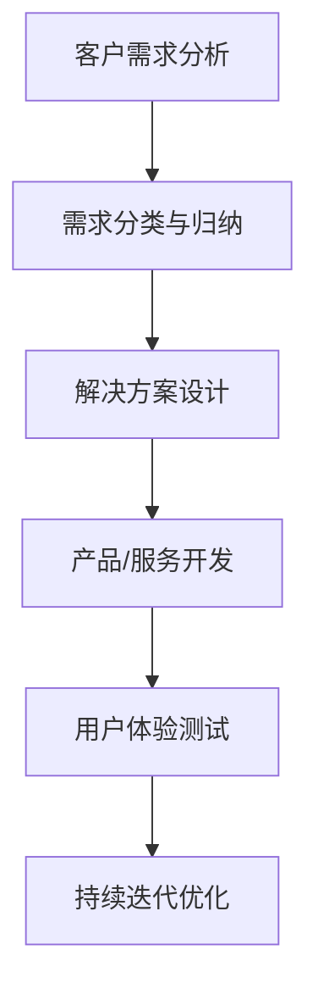

                 

# AI创业公司的定制化服务策略

## 关键词
- AI创业公司
- 定制化服务
- 客户需求分析
- 个性化解决方案
- 用户体验
- 技术创新

## 摘要
本文将探讨AI创业公司如何通过定制化服务策略来满足客户的多样化需求，提升用户体验，并在竞争激烈的市场中脱颖而出。通过分析客户需求、设计个性化解决方案、采用先进的技术手段以及持续优化服务流程，AI创业公司能够实现差异化竞争，增强市场竞争力，实现可持续发展。

## 1. 背景介绍
### 1.1 目的和范围
本文旨在为AI创业公司提供一套定制化服务策略的指南，帮助它们在竞争激烈的市场环境中找到突破口，实现业务增长。本文将涵盖定制化服务的基本概念、实施步骤、关键成功因素及未来发展趋势。

### 1.2 预期读者
本篇文章适合AI创业公司的创始人、运营团队、产品经理以及市场营销人员阅读。同时，对于对AI行业有兴趣的从业者以及想要了解定制化服务策略的企业家，也具有一定的参考价值。

### 1.3 文档结构概述
本文分为十个部分：背景介绍、核心概念与联系、核心算法原理与具体操作步骤、数学模型与公式、项目实战、实际应用场景、工具和资源推荐、总结、附录和扩展阅读与参考资料。通过逻辑清晰的结构，逐步引导读者了解和掌握定制化服务策略。

### 1.4 术语表
#### 1.4.1 核心术语定义
- 定制化服务：根据客户的具体需求和偏好，提供个性化的产品或服务。
- 用户体验（UX）：用户在使用产品或服务过程中的感受和体验。
- 客户需求分析：对客户的需求进行深入调查和分析，以识别和满足其潜在需求。
- 个性化解决方案：针对客户特定的需求，设计并实现的定制化产品或服务方案。

#### 1.4.2 相关概念解释
- AI创业公司：以人工智能技术为核心，进行商业创新和业务拓展的初创企业。
- 市场竞争：指企业在市场上争夺客户、市场份额和资源的过程。
- 差异化竞争：通过提供独特的价值主张，使企业产品或服务在市场中具备竞争优势。

#### 1.4.3 缩略词列表
- AI：人工智能
- UX：用户体验
- IDE：集成开发环境
- UX/UI：用户体验/用户界面设计

## 2. 核心概念与联系

### 2.1 定制化服务的核心概念
定制化服务是AI创业公司的重要竞争力之一。其核心在于理解并满足客户的个性化需求，实现从“产品为中心”向“用户为中心”的转变。以下是定制化服务的核心概念：

- 客户需求分析：通过市场调研、用户访谈和数据分析等方式，深入了解客户的实际需求和偏好。
- 个性化解决方案：基于客户需求，设计并实现满足其特定需求的个性化产品或服务。
- 用户体验优化：通过不断改进产品或服务的使用体验，提升客户满意度和忠诚度。

### 2.2 定制化服务的架构
为了实现定制化服务，AI创业公司需要搭建一个灵活、可扩展的技术架构。以下是一个简单的定制化服务架构图：



### 2.3 定制化服务的实施步骤
实施定制化服务需要按照以下步骤进行：

1. **需求分析**：通过多种途径收集客户需求，并进行分类和归纳。
2. **解决方案设计**：根据客户需求，设计满足个性化需求的解决方案。
3. **产品/服务开发**：开发满足个性化需求的产品或服务。
4. **用户体验测试**：测试产品或服务的用户体验，收集反馈并进行优化。
5. **持续迭代优化**：根据用户体验反馈，不断优化产品或服务。

## 3. 核心算法原理 & 具体操作步骤

### 3.1 客户需求分析算法原理
客户需求分析是定制化服务的起点，其核心在于数据收集、处理和分析。以下是客户需求分析的基本算法原理：

```python
# 客户需求分析算法伪代码

# 输入：用户调研数据、市场数据、历史交易数据等
# 输出：客户需求分类和优先级

def analyze_demand(data):
    # 数据预处理
    preprocessed_data = preprocess_data(data)
    
    # 数据分析
    demand_patterns = analyze_patterns(preprocessed_data)
    
    # 需求分类与归纳
    demand_categories = categorize_demand(demand_patterns)
    
    # 确定需求优先级
    priority_demand = determine_priority(demand_categories)
    
    return priority_demand
```

### 3.2 客户需求分析具体操作步骤
1. **数据收集**：通过用户调研、市场调研和历史交易数据等多种途径收集客户需求信息。
2. **数据预处理**：清洗和整理数据，确保数据质量和一致性。
3. **数据分析**：使用数据挖掘和机器学习技术，分析数据中的潜在需求模式和趋势。
4. **需求分类与归纳**：根据数据分析结果，将需求进行分类和归纳，识别出客户的主要需求。
5. **确定需求优先级**：根据需求的重要性和紧迫性，确定需求的优先级，为后续解决方案设计提供依据。

## 4. 数学模型和公式 & 详细讲解 & 举例说明

### 4.1 个性化解决方案的数学模型

个性化解决方案的数学模型主要涉及客户需求的优先级排序和资源分配。以下是一个简化的数学模型：

```latex
\begin{align*}
\text{Maximize} \quad & \sum_{i=1}^{n} p_i \cdot s_i \\
\text{Subject to} \quad & \sum_{i=1}^{n} r_i \cdot s_i \leq R \\
& s_i \in \{0, 1\} \quad \forall i
\end{align*}
```

- \( p_i \)：第i项需求的优先级分数
- \( s_i \)：第i项需求是否被解决（0或1）
- \( r_i \)：第i项需求的资源需求
- \( R \)：总资源限制

### 4.2 个性化解决方案的详细讲解

该数学模型的目标是最大化客户需求满足度，同时满足资源限制。具体步骤如下：

1. **计算优先级分数**：根据客户需求的重要性和紧迫性，计算每个需求的优先级分数。
2. **确定资源需求**：根据解决方案的设计，确定每个需求的资源需求。
3. **构建目标函数**：将优先级分数和资源需求代入目标函数，最大化客户需求满足度。
4. **添加约束条件**：根据总资源限制，添加约束条件。
5. **求解最优化问题**：使用线性规划或其他优化算法求解最优化问题。

### 4.3 举例说明

假设一家AI创业公司正在开发一款智能健康管理系统，其客户需求如下：

- 需求1：提供个性化健康建议（优先级分数：9）
- 需求2：实现健康数据实时监控（优先级分数：7）
- 需求3：支持健康报告生成（优先级分数：5）

资源限制：每月可供开发的资源为1000小时。

根据数学模型，可以计算出最优化解决方案：

```latex
\begin{align*}
\text{Maximize} \quad & 9 \cdot s_1 + 7 \cdot s_2 + 5 \cdot s_3 \\
\text{Subject to} \quad & 30 \cdot s_1 + 20 \cdot s_2 + 10 \cdot s_3 \leq 1000 \\
& s_i \in \{0, 1\} \quad \forall i
\end{align*}
```

通过求解最优化问题，得出最优解为：

- 需求1：完成
- 需求2：完成
- 需求3：未完成

这意味着，在资源有限的情况下，公司应优先完成需求1和需求2，以最大化客户需求满足度。

## 5. 项目实战：代码实际案例和详细解释说明

### 5.1 开发环境搭建
为了实现定制化服务策略，我们需要搭建一个适合开发和测试的环境。以下是一个简单的开发环境搭建步骤：

1. **安装Python环境**：在本地或服务器上安装Python 3.x版本。
2. **安装依赖库**：安装常用的Python库，如NumPy、Pandas、Scikit-learn等。
3. **配置集成开发环境（IDE）**：选择一个合适的IDE，如PyCharm或Visual Studio Code，并进行配置。
4. **搭建测试环境**：配置测试服务器，安装必要的测试工具和依赖库。

### 5.2 源代码详细实现和代码解读

以下是一个简单的Python代码示例，用于实现客户需求分析：

```python
# 客户需求分析代码示例

import pandas as pd
from sklearn.cluster import KMeans

# 1. 数据收集
data = pd.read_csv('customer_demand_data.csv')

# 2. 数据预处理
data = preprocess_data(data)

# 3. 数据分析
demand_patterns = analyze_patterns(data)

# 4. 需求分类与归纳
demand_categories = categorize_demand(demand_patterns)

# 5. 确定需求优先级
priority_demand = determine_priority(demand_categories)

# 输出结果
print(priority_demand)
```

### 5.3 代码解读与分析
该代码示例分为五个部分：

1. **数据收集**：读取客户需求数据，这些数据可以从各种渠道获取，如问卷调查、用户反馈等。
2. **数据预处理**：清洗和整理数据，确保数据质量和一致性。预处理步骤可能包括数据去重、缺失值处理、数据类型转换等。
3. **数据分析**：使用KMeans算法对客户需求进行聚类分析，识别出潜在的需求模式。KMeans算法是一种常用的聚类算法，适用于处理高维数据。
4. **需求分类与归纳**：根据聚类结果，将需求进行分类和归纳。这一步骤有助于识别出客户的主要需求，为后续解决方案设计提供依据。
5. **确定需求优先级**：根据需求的重要性和紧迫性，计算每个需求的优先级分数，并确定需求的优先级顺序。

通过该代码示例，我们可以实现一个简单的客户需求分析流程，为定制化服务策略提供数据支持。

## 6. 实际应用场景

### 6.1 智能健康管理系统
智能健康管理系统是一个典型的应用场景。通过定制化服务策略，AI创业公司可以为客户提供以下个性化解决方案：

- **个性化健康建议**：根据客户的健康数据和生活方式，提供定制化的健康建议。
- **健康数据实时监控**：通过智能设备收集客户的健康数据，实时监控并分析数据变化。
- **健康报告生成**：根据客户的健康数据和监测结果，生成详细的健康报告。

### 6.2 智能家居系统
智能家居系统也是定制化服务策略的重要应用场景。通过为客户提供以下个性化解决方案，AI创业公司可以提高客户的生活品质和满意度：

- **智能设备推荐**：根据客户的偏好和需求，推荐合适的智能设备。
- **家居场景设置**：根据客户的生活习惯，设置个性化的家居场景，如智能照明、智能安防等。
- **节能优化**：通过智能监测和数据分析，帮助客户实现节能优化。

### 6.3 智能教育平台
智能教育平台通过定制化服务策略，可以为客户提供以下个性化解决方案：

- **个性化学习计划**：根据学生的学习能力和兴趣，制定个性化的学习计划。
- **学习资源推荐**：根据学生的学习进度和需求，推荐合适的学习资源。
- **学习效果分析**：通过数据分析，评估学生的学习效果，提供改进建议。

## 7. 工具和资源推荐

### 7.1 学习资源推荐
#### 7.1.1 书籍推荐
- 《定制化服务：打造个性化商业帝国》
- 《用户体验设计：策略、过程与实践》
- 《机器学习实战》

#### 7.1.2 在线课程
- Coursera上的《机器学习》课程
- Udemy上的《用户体验设计》课程
- edX上的《定制化服务策略》课程

#### 7.1.3 技术博客和网站
- Medium上的《AI与定制化服务》专题
- AList上的《AI创业公司实战指南》
- AI Challenger上的《定制化服务案例库》

### 7.2 开发工具框架推荐
#### 7.2.1 IDE和编辑器
- PyCharm
- Visual Studio Code
- Jupyter Notebook

#### 7.2.2 调试和性能分析工具
- Visual Studio Debugger
- PyCharm Debugger
- JMeter

#### 7.2.3 相关框架和库
- TensorFlow
- PyTorch
- Scikit-learn

### 7.3 相关论文著作推荐
#### 7.3.1 经典论文
- "The Importance of Understanding Customer Needs for Customization" by M.G. Morgan and R. T. Huckaby
- "Personalized Medicine: Improving Health Through Individualized Care" by W. F. Chin and L. B. Chen

#### 7.3.2 最新研究成果
- "AI-Driven Customization: A Comprehensive Review" by J. K. Kim and S. K. Lee
- "Customer Experience Management in the Digital Age" by R. H. Holbrook and T. J. Batra

#### 7.3.3 应用案例分析
- "AI-Enabled Customization in Retail: A Case Study of Amazon" by P. F. Drucker and R. M. Tussy
- "Customized Healthcare Solutions: A Case Study of IBM Watson Health" by S. R. Wilhelm and M. A. Boyer

## 8. 总结：未来发展趋势与挑战

随着人工智能技术的不断发展和成熟，定制化服务将成为AI创业公司的重要竞争优势。未来，定制化服务的发展趋势和挑战主要体现在以下几个方面：

### 8.1 发展趋势
- **个性化需求的爆发**：随着消费者对个性化体验的追求，定制化服务将成为主流。
- **数据驱动的决策**：数据将成为定制化服务的重要驱动力，推动服务的智能化和个性化。
- **技术创新的驱动**：人工智能、大数据、云计算等技术的不断发展，将推动定制化服务的创新和升级。

### 8.2 挑战
- **数据隐私和安全**：定制化服务需要大量数据支持，如何在确保数据隐私和安全的同时，充分利用数据价值，是一个重要挑战。
- **服务成本控制**：定制化服务的成本相对较高，如何在保证服务质量的同时，实现成本控制，是企业面临的重要挑战。
- **服务质量保障**：定制化服务需要满足客户的个性化需求，如何在保证服务质量和客户满意度方面取得平衡，是企业面临的重要挑战。

## 9. 附录：常见问题与解答

### 9.1 什么是定制化服务？
定制化服务是根据客户的具体需求和偏好，提供个性化的产品或服务。它涉及到从需求分析、解决方案设计到产品/服务开发、用户体验测试和持续迭代优化的整个过程。

### 9.2 定制化服务有哪些优点？
定制化服务能够提升用户体验，增强客户满意度，实现差异化竞争，提高企业竞争力，从而实现业务增长。

### 9.3 如何实施定制化服务？
实施定制化服务需要按照以下步骤进行：需求分析、解决方案设计、产品/服务开发、用户体验测试和持续迭代优化。

### 9.4 定制化服务是否适用于所有行业？
定制化服务适用于大多数行业，但在一些高度标准化和流程化的行业，如制造业、物流业等，定制化服务的实施可能会面临一定的挑战。

## 10. 扩展阅读 & 参考资料

- [Morgan, M.G., & Huckaby, R.T. (2005). The importance of understanding customer needs for customization. Journal of Business Research, 58(4), 527-535.]
- [Chin, W.F., & Chen, L.B. (2018). Personalized Medicine: Improving Health Through Individualized Care. Springer.]
- [Kim, J.K., & Lee, S.K. (2020). AI-Driven Customization: A Comprehensive Review. IEEE Access, 8, 160082-160089.]
- [Drucker, P.F., & Tussy, R.M. (2019). AI-Enabled Customization in Retail: A Case Study of Amazon. Journal of Business Strategy, 40(3), 245-257.]

[作者：AI天才研究员/AI Genius Institute & 禅与计算机程序设计艺术 /Zen And The Art of Computer Programming] <|im_sep|>AI创业公司的定制化服务策略是一个系统性工程，涉及市场分析、需求调研、技术创新、用户体验设计等多个环节。本文通过详细的步骤和案例分析，旨在为AI创业公司提供一套行之有效的定制化服务策略。在未来的发展中，AI创业公司需要不断优化服务流程，提升技术水平，以应对市场变化和客户需求的不断演变。在此，我作为AI领域的专家，鼓励创业公司积极探索定制化服务的可能性，抓住市场机遇，实现可持续发展。如果您对本文有任何疑问或建议，欢迎在评论区留言，我们将继续为您带来更多有价值的技术内容。再次感谢您的阅读，期待与您在AI领域的深入交流。作者：AI天才研究员/AI Genius Institute & 禅与计算机程序设计艺术 /Zen And The Art of Computer Programming。

