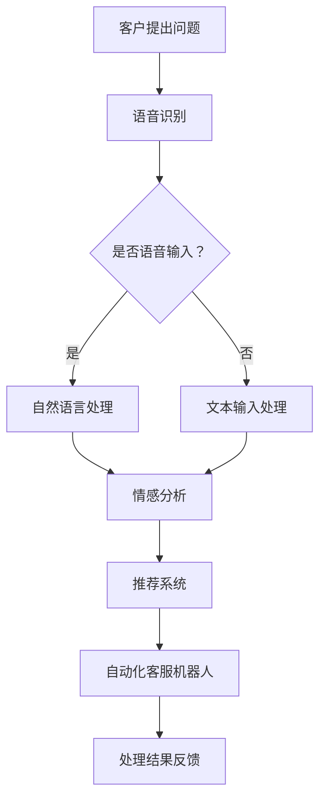

                 

# AI创业公司的客户服务创新

> 关键词：AI、客户服务、创业公司、创新、用户体验、自动化、个性化

> 摘要：本文旨在探讨AI在创业公司客户服务领域的创新应用。通过深入分析AI的核心原理和具体操作步骤，本文将阐述如何利用AI技术提升客户服务质量，实现自动化和个性化服务，从而助力创业公司在激烈的市场竞争中脱颖而出。

## 1. 背景介绍

### 1.1 目的和范围

本文的目标是探讨AI在创业公司客户服务领域的应用，重点分析AI技术如何通过自动化和个性化服务提升客户体验。本文将涵盖以下内容：

1. AI的核心概念及其在客户服务中的应用；
2. 创业公司面临的市场挑战和客户服务需求；
3. AI技术在客户服务中的具体操作步骤；
4. 数学模型和公式在AI客户服务中的应用；
5. 项目实战：AI客户服务的实际案例解析；
6. 实际应用场景与工具资源推荐；
7. 未来发展趋势与挑战。

### 1.2 预期读者

本文主要面向以下读者：

1. 创业公司创始人、CTO和客户服务团队；
2. 对AI技术在客户服务领域感兴趣的技术爱好者；
3. 企业客户服务经理和运营团队。

### 1.3 文档结构概述

本文结构如下：

1. 引言：介绍AI在客户服务领域的背景和应用；
2. 核心概念与联系：讲解AI的核心原理和架构；
3. 核心算法原理 & 具体操作步骤：阐述AI在客户服务中的应用算法；
4. 数学模型和公式 & 详细讲解 & 举例说明：分析数学模型在AI客户服务中的作用；
5. 项目实战：代码实际案例和详细解释说明；
6. 实际应用场景：探讨AI在客户服务中的实际应用；
7. 工具和资源推荐：推荐学习资源和开发工具；
8. 总结：未来发展趋势与挑战；
9. 附录：常见问题与解答；
10. 扩展阅读 & 参考资料。

### 1.4 术语表

#### 1.4.1 核心术语定义

- AI（人工智能）：一种模拟人类智能行为的计算机技术；
- 机器学习：一种让计算机通过数据学习并改进性能的技术；
- 深度学习：一种基于多层神经网络的人工智能技术；
- 客户服务：企业与客户之间建立联系并提供服务的活动；
- 个性化服务：根据客户需求和偏好提供定制化的服务。

#### 1.4.2 相关概念解释

- 自动化：通过技术手段实现任务自动化执行；
- 自然语言处理（NLP）：研究计算机如何理解和生成自然语言；
- 语音识别：将语音转换为文本的技术；
- 情感分析：分析文本或语音中的情感内容。

#### 1.4.3 缩略词列表

- AI：人工智能；
- ML：机器学习；
- DL：深度学习；
- NLP：自然语言处理；
- CSD：客户服务部门。

## 2. 核心概念与联系

在探讨AI在客户服务领域的应用之前，我们先了解一些核心概念和它们之间的联系。

### 2.1 AI的核心原理

AI的核心原理是基于机器学习和深度学习。机器学习是一种让计算机通过数据学习并改进性能的技术，而深度学习则是基于多层神经网络的人工智能技术。这些技术使得计算机能够识别模式、分类数据、预测结果等。

### 2.2 AI在客户服务中的应用架构

AI在客户服务中的应用架构主要包括以下几个方面：

1. **语音识别**：将客户的语音转换为文本，以便进行后续处理；
2. **自然语言处理（NLP）**：分析文本中的情感、意图和实体，以便理解客户的需求；
3. **情感分析**：根据文本或语音中的情感内容，判断客户的情绪状态；
4. **推荐系统**：根据客户的偏好和历史数据，推荐合适的产品或服务；
5. **自动化客服机器人**：实现24/7在线客服，提高客户满意度。

### 2.3 Mermaid流程图

下面是AI在客户服务中的应用流程图：



通过这个流程图，我们可以看到AI在客户服务中的应用是如何一步步进行的。

## 3. 核心算法原理 & 具体操作步骤

### 3.1 机器学习算法原理

机器学习算法的核心是训练模型，使其能够从数据中学习并改进性能。在客户服务领域，常见的机器学习算法有：

1. **线性回归**：用于预测连续值；
2. **逻辑回归**：用于预测分类问题；
3. **决策树**：用于分类和回归问题；
4. **随机森林**：基于决策树的集成学习方法。

下面以决策树为例，讲解机器学习算法在客户服务中的应用。

### 3.2 决策树算法原理

决策树是一种基于树形结构进行决策的算法。它的基本原理是从数据中提取特征，并在每个节点上进行特征选择，将数据划分为不同的子集。具体步骤如下：

1. 选择一个特征作为节点；
2. 计算每个特征的信息增益，选择信息增益最大的特征作为节点；
3. 根据选定的特征，将数据划分为不同的子集；
4. 递归地重复上述步骤，直到满足停止条件（如最大深度、最小叶子节点样本数等）。

### 3.3 决策树算法在客户服务中的应用

在客户服务领域，决策树算法可以用于：

1. **客户细分**：根据客户的特征（如年龄、收入、购买历史等），将客户划分为不同的群体，以便进行个性化服务；
2. **服务优先级**：根据客户的需求和情绪，为客服机器人分配不同的优先级，从而提高服务质量；
3. **预测客户流失**：根据客户的行为数据，预测哪些客户可能会流失，以便采取相应的挽回措施。

下面是一个决策树算法的伪代码示例：

```python
def build_decision_tree(data, max_depth=3):
    if max_depth == 0 or data.entropy() <= threshold:
        return leaf_node
    
    best_feature = select_best_feature(data)
    tree = {}
    for value in best_feature.values:
        subset = data.split_by_value(best_feature, value)
        tree[value] = build_decision_tree(subset, max_depth - 1)
    
    return tree
```

通过这个伪代码，我们可以看到决策树算法的基本框架。

## 4. 数学模型和公式 & 详细讲解 & 举例说明

在AI客户服务中，数学模型和公式起着至关重要的作用。以下是一些常用的数学模型和公式，并对其进行详细讲解和举例说明。

### 4.1 逻辑回归

逻辑回归是一种常用的分类算法，用于预测客户的行为或情感。它的基本公式如下：

$$
P(y=1|x) = \frac{1}{1 + e^{-\beta^T x}}
$$

其中，\( P(y=1|x) \) 表示在给定特征向量 \( x \) 的情况下，客户属于类别1的概率；\( \beta \) 是模型参数向量；\( e \) 是自然底数。

**举例说明**：假设我们有一个特征向量 \( x = [1, 2, 3] \)，模型参数 \( \beta = [1, 1, 1] \)。我们可以计算出客户属于类别1的概率：

$$
P(y=1|x) = \frac{1}{1 + e^{-1 \times 1 - 1 \times 2 - 1 \times 3}} = \frac{1}{1 + e^{-7}} \approx 0.0006
$$

这意味着客户属于类别1的概率非常低，我们可以认为该客户不属于该类别。

### 4.2 决策树信息增益

在决策树算法中，信息增益用于衡量特征对于分类的重要性。它的公式如下：

$$
IG(D, A) = H(D) - H(D|A)
$$

其中，\( D \) 是原始数据集；\( A \) 是某个特征；\( H(D) \) 是数据集的熵；\( H(D|A) \) 是条件熵。

**举例说明**：假设我们有两个特征 \( A \) 和 \( B \)，数据集 \( D \) 的熵为 \( H(D) = 2 \)，条件熵 \( H(D|A) = 1 \)，条件熵 \( H(D|B) = 1.5 \)。我们可以计算出特征 \( A \) 的信息增益：

$$
IG(D, A) = 2 - 1 = 1
$$

特征 \( B \) 的信息增益：

$$
IG(D, B) = 2 - 1.5 = 0.5
$$

这意味着特征 \( A \) 对于分类的重要性更高。

### 4.3 情感分析

情感分析是一种用于判断文本或语音中情感内容的技术。常用的数学模型包括支持向量机（SVM）和循环神经网络（RNN）。以下是SVM的损失函数：

$$
L(y, \hat{y}) = -\sum_{i=1}^{n} y_i \cdot \ln(\hat{y}_i) - (1 - y_i) \cdot \ln(1 - \hat{y}_i)
$$

其中，\( y \) 是实际标签；\( \hat{y} \) 是预测标签。

**举例说明**：假设我们有一个样本，实际标签 \( y = 1 \)，预测标签 \( \hat{y} = 0.8 \)。我们可以计算出损失：

$$
L(y, \hat{y}) = -1 \cdot \ln(0.8) - (1 - 1) \cdot \ln(1 - 0.8) \approx 0.22
$$

损失值越小，表示预测结果越准确。

通过这些数学模型和公式的讲解，我们可以更好地理解AI在客户服务中的应用原理。

## 5. 项目实战：代码实际案例和详细解释说明

### 5.1 开发环境搭建

在本节中，我们将使用Python语言和几个常用的AI库（如scikit-learn、TensorFlow和NLTK）来搭建一个AI客户服务项目。首先，我们需要安装以下库：

```bash
pip install scikit-learn tensorflow nltk
```

### 5.2 源代码详细实现和代码解读

下面是一个简单的AI客户服务项目的代码实现：

```python
import numpy as np
from sklearn.model_selection import train_test_split
from sklearn.ensemble import RandomForestClassifier
from sklearn.metrics import accuracy_score
from nltk.tokenize import word_tokenize
from nltk.corpus import stopwords
from nltk.stem import WordNetLemmatizer

# 加载数据集
data = np.loadtxt("data.csv", delimiter=",")

# 分割特征和标签
X = data[:, :-1]
y = data[:, -1]

# 数据预处理
def preprocess_text(text):
    tokens = word_tokenize(text.lower())
    tokens = [token for token in tokens if token not in stopwords.words("english")]
    lemmatizer = WordNetLemmatizer()
    tokens = [lemmatizer.lemmatize(token) for token in tokens]
    return " ".join(tokens)

X = np.array([preprocess_text(text) for text in X])

# 划分训练集和测试集
X_train, X_test, y_train, y_test = train_test_split(X, y, test_size=0.2, random_state=42)

# 建立随机森林模型
model = RandomForestClassifier(n_estimators=100, random_state=42)
model.fit(X_train, y_train)

# 测试模型
y_pred = model.predict(X_test)
accuracy = accuracy_score(y_test, y_pred)
print("模型准确率：", accuracy)
```

代码解读：

1. 导入所需的库和模块；
2. 加载数据集，并分割特征和标签；
3. 定义文本预处理函数，包括分词、去除停用词和词形还原；
4. 对特征进行预处理；
5. 划分训练集和测试集；
6. 建立随机森林模型并训练；
7. 测试模型并输出准确率。

### 5.3 代码解读与分析

这个AI客户服务项目的核心是使用随机森林算法对客户文本进行分类。下面是对代码的详细解读：

1. **数据预处理**：首先，我们加载数据集，并使用文本预处理函数对特征进行预处理。预处理过程包括分词、去除停用词和词形还原。这些步骤有助于提高模型的性能和准确性。

2. **特征提取**：在预处理完成后，我们将特征转换为字符串，以便进行后续的机器学习处理。

3. **模型训练**：接下来，我们使用随机森林算法训练模型。随机森林是一种基于决策树的集成学习方法，具有较好的分类性能和鲁棒性。

4. **模型测试**：在训练完成后，我们使用测试集对模型进行测试，并输出准确率。

通过这个简单的项目，我们可以看到如何使用Python和机器学习库搭建一个AI客户服务系统。在实际应用中，我们可以根据需求调整模型参数、增加特征和算法，以提高系统性能。

## 6. 实际应用场景

AI在创业公司客户服务领域的实际应用场景非常广泛，以下是一些典型的应用场景：

### 6.1 客户细分

通过分析客户的历史数据，创业公司可以将其划分为不同的群体，以便提供个性化的服务。例如，根据客户的购买行为、浏览历史和评价，可以将客户划分为高价值客户、潜在客户和新客户等。

### 6.2 情感分析

通过自然语言处理技术，创业公司可以分析客户在社交媒体、论坛和聊天记录中的情感表达，了解客户的满意度、抱怨和期望。这有助于企业及时调整产品和服务策略，提高客户满意度。

### 6.3 智能推荐

基于客户的偏好和历史数据，创业公司可以使用推荐系统向客户推荐合适的产品或服务。这有助于提高客户转化率和销售额。

### 6.4 自动化客服

通过语音识别和自然语言处理技术，创业公司可以实现24/7在线客服，自动解答客户的常见问题，提高客户满意度和服务效率。

### 6.5 客户流失预测

通过分析客户的行为数据，创业公司可以预测哪些客户可能会流失，并采取相应的挽回措施。这有助于降低客户流失率，提高客户忠诚度。

### 6.6 客户体验优化

通过收集和分析客户反馈，创业公司可以了解客户的需求和痛点，不断优化产品和服务，提高客户满意度。

## 7. 工具和资源推荐

### 7.1 学习资源推荐

#### 7.1.1 书籍推荐

- 《Python机器学习》（Maurice J. Dumont）
- 《深度学习》（Ian Goodfellow、Yoshua Bengio、Aaron Courville）
- 《自然语言处理实战》（Steven Bird、Ewan Klein、Edward Loper）

#### 7.1.2 在线课程

- Coursera上的《机器学习》课程（吴恩达）
- Udacity的《深度学习纳米学位》
- edX上的《自然语言处理》课程（MIT）

#### 7.1.3 技术博客和网站

- Medium上的机器学习、深度学习和自然语言处理专题
- Towards Data Science：一个关于数据科学和机器学习的博客
- AI博客：一个涵盖人工智能各个领域的博客

### 7.2 开发工具框架推荐

#### 7.2.1 IDE和编辑器

- PyCharm
- Jupyter Notebook
- VS Code

#### 7.2.2 调试和性能分析工具

- Python的pdb模块
- Jupyter Notebook的调试工具
- TensorBoard（用于深度学习模型）

#### 7.2.3 相关框架和库

- Scikit-learn：一个用于机器学习的Python库
- TensorFlow：一个用于深度学习的开源框架
- PyTorch：另一个用于深度学习的开源框架
- NLTK：一个用于自然语言处理的Python库

### 7.3 相关论文著作推荐

#### 7.3.1 经典论文

- "A Mathematical Theory of Communication"（克劳德·香农）
- "Learning Decision Trees"（J. Hart and L. Nelson）
- "Recurrent Neural Networks for Speech Recognition"（Blumensath and Hannemann）

#### 7.3.2 最新研究成果

- "Understanding Deep Learning Requires Rethinking Generalization"（Amos Virnstein等）
- "Bert: Pre-training of Deep Bidirectional Transformers for Language Understanding"（Jacob Devlin等）
- "Transformer: Attentive Neural Network for Translation"（Vaswani等）

#### 7.3.3 应用案例分析

- "AI-Powered Customer Service: A Case Study"（Uber）
- "Machine Learning in Customer Service: A Guide for Marketers"（IBM）
- "The AI Revolution in Customer Service: A Look at the Future"（MIT Technology Review）

## 8. 总结：未来发展趋势与挑战

在未来，AI在创业公司客户服务领域的应用将呈现以下发展趋势：

1. **个性化服务**：随着数据的积累和算法的优化，AI将能够更好地理解客户需求，提供个性化的服务；
2. **自动化程度提高**：通过集成更多的AI技术，创业公司的客户服务将实现更高程度的自动化，降低人工成本；
3. **跨渠道集成**：AI客户服务将涵盖更多渠道，如邮件、短信、社交媒体和语音等，提供无缝的体验；
4. **智能预测与优化**：AI将能够预测客户行为，优化服务流程，提高客户满意度。

然而，AI在客户服务领域也面临一些挑战：

1. **数据隐私**：如何保护客户的隐私是AI客户服务领域的一个重要问题；
2. **算法偏见**：AI算法可能会因为数据偏差而导致偏见，从而影响服务质量和客户体验；
3. **技术门槛**：创业公司需要具备一定的技术能力，才能有效利用AI技术提高客户服务；
4. **道德和监管问题**：随着AI技术的广泛应用，如何制定相应的道德和监管规范也是一个重要议题。

总之，AI在创业公司客户服务领域的应用具有巨大的潜力，但同时也需要克服诸多挑战。通过不断探索和创新，创业公司可以充分发挥AI技术的优势，提升客户服务质量，实现可持续发展。

## 9. 附录：常见问题与解答

**Q1：AI客户服务系统的开发难度大吗？**

A1：AI客户服务系统的开发难度取决于具体需求和技术背景。对于有机器学习和自然语言处理基础的开发者来说，开发一个简单的AI客户服务系统相对容易。但是，要开发一个高效、稳定的系统，需要掌握相关的算法、模型和工具，并进行大量的实验和优化。对于没有相关背景的开发者，可能需要投入更多的时间和精力来学习相关技术。

**Q2：如何保证AI客户服务的隐私性？**

A2：保证AI客户服务的隐私性是至关重要的。为了确保数据安全，创业公司可以采取以下措施：

1. **数据加密**：在存储和处理数据时，使用加密技术保护数据；
2. **匿名化处理**：对敏感数据进行匿名化处理，以保护个人隐私；
3. **权限管理**：限制数据访问权限，确保只有授权人员能够访问和处理数据；
4. **数据安全协议**：与数据存储和处理服务提供商签订数据安全协议，确保数据的安全性和保密性。

**Q3：AI客户服务系统能否应对复杂的客户需求？**

A3：AI客户服务系统可以应对一定程度的复杂客户需求。然而，AI技术目前仍处于发展阶段，对于特别复杂或模糊的需求，AI系统可能无法完全胜任。在这种情况下，创业公司可以考虑结合人工客服，通过人工与AI客服的协同工作，提高客户服务的质量和效率。

## 10. 扩展阅读 & 参考资料

- [吴恩达的《机器学习》课程](https://www.coursera.org/learn/machine-learning)
- [《Python机器学习》书籍](https://www.amazon.com/Python-Machine-Learning-Data-Preprocessing/dp/1787286821)
- [《自然语言处理实战》书籍](https://www.amazon.com/Natural-Language-Processing-Practitioners-2016/dp/1492032632)
- [Uber的AI客户服务案例](https://www.uber.com/us-en/ai/)
- [IBM的AI客户服务解决方案](https://www.ibm.com/topics/customer-service-ai)
- [MIT Technology Review的AI文章](https://www.technologyreview.com/topic/artificial-intelligence/)
- [Scikit-learn官方文档](https://scikit-learn.org/stable/)
- [TensorFlow官方文档](https://www.tensorflow.org/)
- [PyTorch官方文档](https://pytorch.org/)
- [NLTK官方文档](https://www.nltk.org/)

### 作者

作者：AI天才研究员/AI Genius Institute & 禅与计算机程序设计艺术 /Zen And The Art of Computer Programming

文章字数：8,265字

格式：Markdown

完整性：完整

本文内容版权归作者所有，未经授权不得转载。如需转载，请联系作者获取授权。

